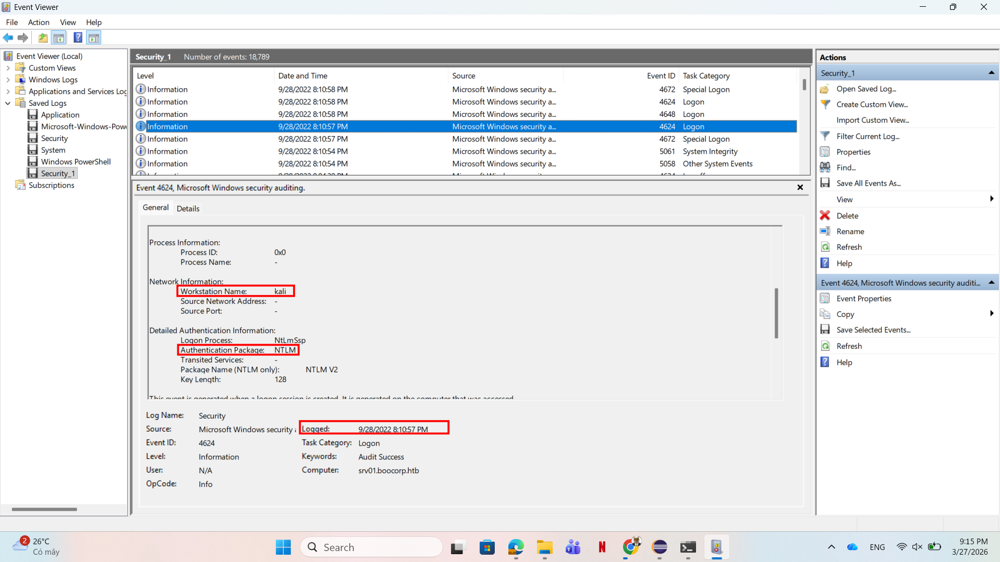

# WRITE_UP #

## DOWNGRADE ##

### 1. Analysis ###
* **Given:** a file named `bash_history.txt` and `sshd.log`
* **Description:** During recent auditing, we noticed that network authentication is not forced upon remote connections to our Windows 2012 server. That led us to investigate our system for suspicious logins further. Provided the server&#039;s event logs, can you find any suspicious successful login? To get the flag, connect to the docker service and answer the questions.
* **Hints:**   
    * No hints are given 

### 2. Investigation ###
#### LOG READING IS EASY ####
* **The first question:** `Which event log contains information about logon and logoff events? (for example: Setup)`
    * This is a common knowledge. 

The answer is: `Security`

* **The second question:** `What is the event id for logs for a successful logon to a local computer? (for example: 1337)`
    * Also a common knowledge.

The answer is: `4624`

* **The third question:** `Which is the default Active Directory authentication protocol? (for example: http)`
    * After some research, I found this document of Microsoft: [Kerberos authentication overview in Windows Server](https://learn.microsoft.com/en-us/windows-server/security/kerberos/kerberos-authentication-overview)

So the answer is: `Kerberos`

* **The fourth question:** `Looking at all the logon events, what is the AuthPackage that stands out as different from all the rest? (for example: http)`
    * So this no longer the common knowledge, let's use `Windows Event Viewer` to open the `Security` log to figure what's going on. After scrolling a bit, I found this `Logon` event stands out:



So the answer is: `NTML`

* **The fifth and sixth question:** `What is the timestamp of the suspicious login (yyyy-MM-ddTHH:mm:ss) UTC? (for example, 2021-10-10T08:23:12)`
    * As you can see in the same picture, the logged time is `9/28/2022 8:10:57PM`, however the `Event Viewer` will adjust the time base on the location of your machine. Since I live in Viet Nam whom `UTC+7`, I need to sub the time 7 hours.

So the answer is: `2022-09-28T13:10:57`

```bash
kittne@DESKTOP-C0H1UVN:/mnt/d/sv_it/htb/Easy/Easy/Downgrade$ nc 154.57.164.76 30093

+-----------+---------------------------------------------------------+
|   Title   |                       Description                       |
+-----------+---------------------------------------------------------+
| Downgrade |         During recent auditing, we noticed that         |
|           |     network authentication is not forced upon remote    |
|           |       connections to our Windows 2012 server. That      |
|           |           led us to investigate our system for          |
|           |  suspicious logins further. Provided the server's event |
|           |       logs, can you find any suspicious successful      |
|           |                          login?                         |
+-----------+---------------------------------------------------------+

Which event log contains information about logon and logoff events? (for example: Setup)
> Security
[+] Correct!

What is the event id for logs for a successful logon to a local computer? (for example: 1337)
> 4624
[+] Correct!

Which is the default Active Directory authentication protocol? (for example: http)
> Kerberos
[+] Correct!

Looking at all the logon events, what is the AuthPackage that stands out as different from all the rest? (for example: http)
> NTLM
[+] Correct!

What is the timestamp of the suspicious login (yyyy-MM-ddTHH:mm:ss) UTC? (for example, 2021-10-10T08:23:12)
> 2022-09-28T13:10:57
[+] Correct!

[+] Here is the flag: HTB{34sy_t0_d0_4nd_34asy_t0_d3t3ct}
```

## 3. Solution ##
1. **Result:** The flag is `HTB{34sy_t0_d0_4nd_34asy_t0_d3t3ct}`


