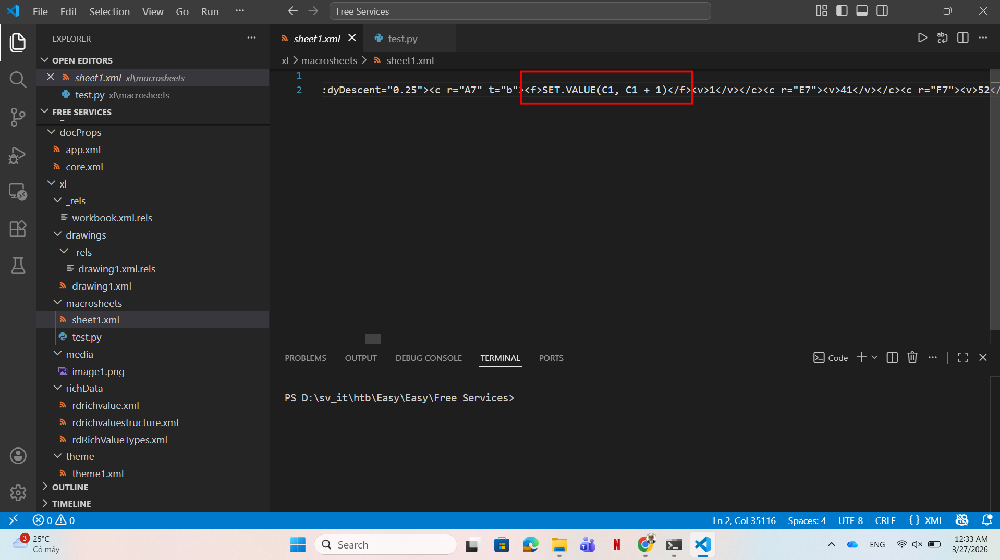
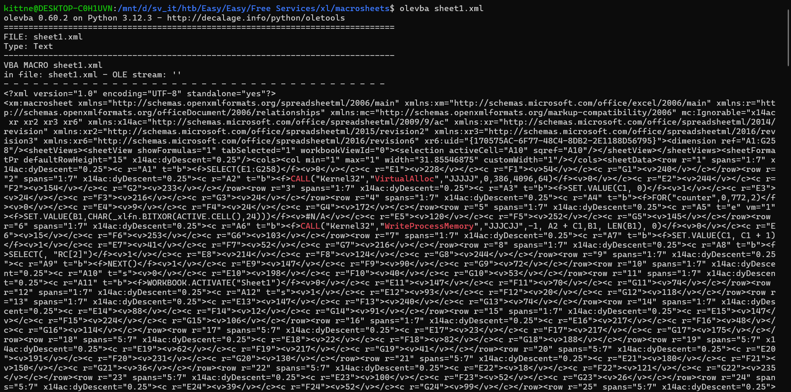
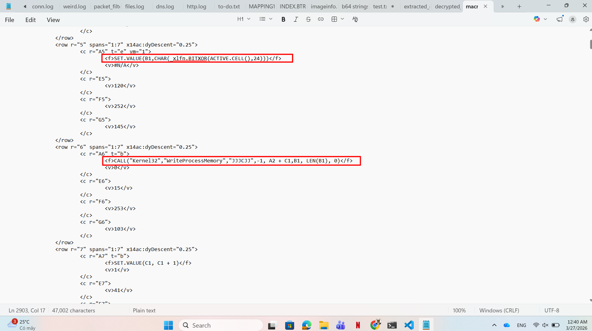
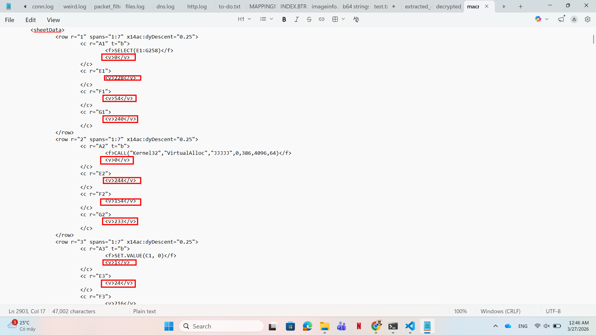
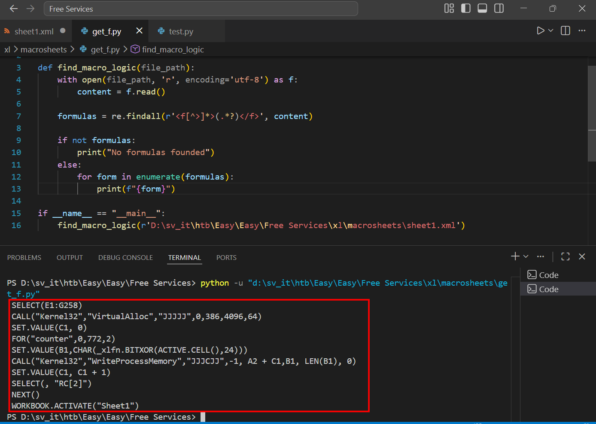
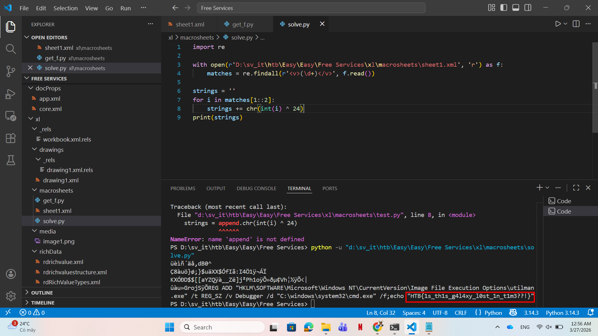

# WRITE_UP #

## FREE SERVICES ##

### 1. Analysis ###
* **Given:** a `.xlsm` file named `free_decryption.js`
* **Description:** Intergalactic Federation stated that it managed to prevent a large-scale phishing campaign that targeted all space personnel across the galaxy. The enemy's goal was to add as many spaceships to their space-botnet as possible so they can conduct distributed destruction of intergalactic services (DDOIS) using their fleet. Since such a campaign can be easily detected and prevented, malicious actors have changed their tactics. As stated by officials, a new spear phishing campaign is underway aiming high value targets. Now Klaus asks your opinion about a mail it received from "sales@unlockyourmind.gal", claiming that in their galaxy it is possible to recover its memory back by following the steps contained in the attached file.
* **Hints:**   
    * No hints are given 

### 2. Investigation ###
#### WHAT'S JOKER SAID ??? ####
Initially, you don't wanna click on the file, since`.xlsm` is actually a zip file, let's unzip it first to see its `.xml`.

After unzipping, there are three subfolders `_rels`, `docProps`, `xl` and a file named `[Content_Types].xml`. After investigating, I found this `sheet1.xml` laid in this path `xl\macrosheets\sheet1.xml` with suspicious keyword:



Let's see its full content using `olevba`: 



As you can see, there are uncommon keywords such as `CALL("Kernel32", "VirtualAlloc", "JJJJJ", 0,386, 4096, 64)`, `CALL("Kernel32", "Write Process Memory", ...)`, ... Why a xml script need to request memory allocation and  write on it?

So I copied the script, paste it to a text file to analyze it further. In the file, when look for the suspicious function call, I found this pattern:





Every function is wrapped between a `<f>` and `</f>` tag, and there are random numbers wrapped in `<v>` and `</v>` tag. So I wrote a python script to extract all the function in `<f>` tags to see the malware try to do what:

```python
import re

def find_macro_logic(file_path):
    with open(file_path, 'r', encoding='utf-8') as f:
        content = f.read()

    formulas = re.findall(r'<f[^>]*>(.*?)</f>', content)
    
    if not formulas:
        print("No formulas founded")
    else:
        for form in formulas:
            print(f"{form}")

if __name__ == "__main__":
    find_macro_logic(r'D:\sv_it\htb\Easy\Easy\Free Services\xl\macrosheets\sheet1.xml')
```



We can see all functions the malware tries to use:

```
SELECT(E1:G258)
CALL("Kernel32","VirtualAlloc","JJJJJ",0,386,4096,64)
SET.VALUE(C1, 0)
FOR("counter",0,772,2)
SET.VALUE(B1,CHAR(_xlfn.BITXOR(ACTIVE.CELL(),24)))
CALL("Kernel32","WriteProcessMemory","JJJCJJ",-1, A2 + C1,Β1, LEN(Β1), 0)
SET.VALUE(C1, C1 + 1)
SELECT(, "RC[2]")
NEXT()
WORKBOOK.ACTIVATE("Sheet1")
```
1. First it will request `Kernel` to allocate an executale memory
2. `FOR("counter",0,772,2)` is actually a for loop from 0 to 772 with step 2
3. `SET.VALUE(B1,CHAR(_xlfn.BITXOR(ACTIVE.CELL(),24)))` will take the value of the cell to xor with 24 to get the actual payload, then write the payload to the memory allocated before.
4. `SELECT(, "RC[2]")` is jump 2 steps to the next cell to get the new value

After getting the flow, I wrote a small python script to decrypt the value in `<v>` tags:

```python
import re

with open(r'D:\sv_it\htb\Easy\Easy\Free Services\xl\macrosheets\sheet1.xml', 'r') as f:
    matches = re.findall(r'<v>(\d+)</v>', f.read())

strings = ''
for i in matches[1::2]:
    strings += chr(int(i) ^ 24)
print(strings)
```



### 3. Solution ###
1. **Result:** The flag is `HTB{1s_th1s_g4l4xy_l0st_1n_t1m3??!}`


