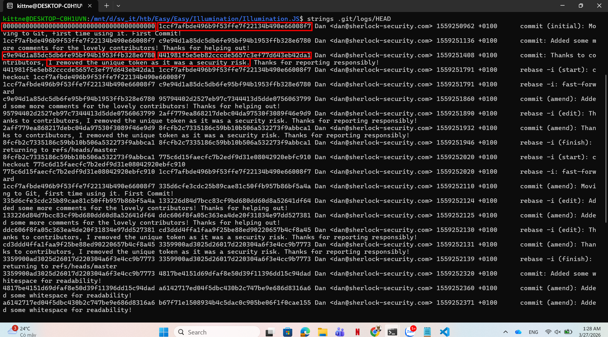
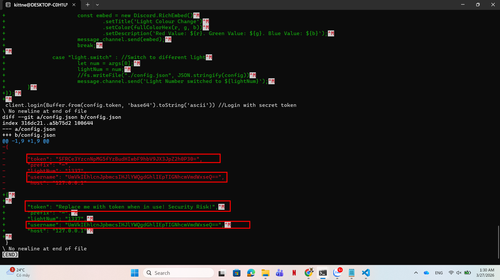

# WRITE_UP #

## ILLUMINATION ##

### 1. Analysis ###
* **Given:** a folder named `Illumination.JS`, inside is a json file `config.json`, a js script `bot.js` and a subfolder `.git`
* **Description:** A Junior Developer just switched to a new source control platform. Can you find the secret token?
* **Hints:**   
    * No hints are given 

### 2. Investigation ###
#### COMMITMENT ISSUEEEE ####
Initially, I open the `config.json` in `VSCode`:

```json
{

	"token": "Replace me with token when in use! Security Risk!",
	"prefix": "~",
	"lightNum": "1337",
	"username": "UmVkIEhlcnJpbmcsIHJlYWQgdGhlIEpTIGNhcmVmdWxseQ==",
	"host": "127.0.0.1"

}
```
But when I decoded it by CyberChef, it was just an alert: `Red Herring, read the JS carefully`.

So I opened the `bot.js` to read through the script, in the end of the script, one line caught my eye:

```js
client.login(Buffer.from(config.token, 'base64').toString('ascii')) //Login with secret token
```

This line will take the token value from the `config.json` file we mentioned above. But let's take a look back at our config, we can see that the real token is replaced by a announcement: `Replace me with token when in use! Security Risk!`

Now we need to find the hidden token. Remember the `.git` folder? This folder is only created if the author uses Git for version control to track their work process. `Git` records all changes applied to a project after every commit command. The folder appears here highly suggests that's the author had changed something with the first file.

These changes are written in a file named `HEAD`, we can easily identify its path `.git\logs\HEAD`, let's run `strings` on the file to see what happened:



As you can see, there's a commit message show that the author has removed the unique token as it was a security risk. This confirmes our hypothesis about a change in the file. 

So how can we spot the difference of that version to our current file ? Well git can handle it very well. If you have the commit id, you can run:
```bash
git diff <commit_id>
```
to see the differences between the newest version and the version in that commit. As the picture above, we can identify the author has changed the token from git id `c9e94d1a85dc5db6fe95bf94b1953ffb328e6780` to ` 441981f5e5eb82cccde5657c3ef77d643eb42da1`. Hence we need to check the `c9e94d1a85dc5db6fe95bf94b1953ffb328e6780` version:

```bash
git diff c9e94d1a85dc5db6fe95bf94b1953ffb328e6780
```



After typing enter to see the changes in `config.json` file, you will see a base64 string token. Decode it should give you the flag.

### 3. Solution ###
1. **Result:** The flag is `HTB{v3rsi0n_c0ntr0l_am_I_right?}`


