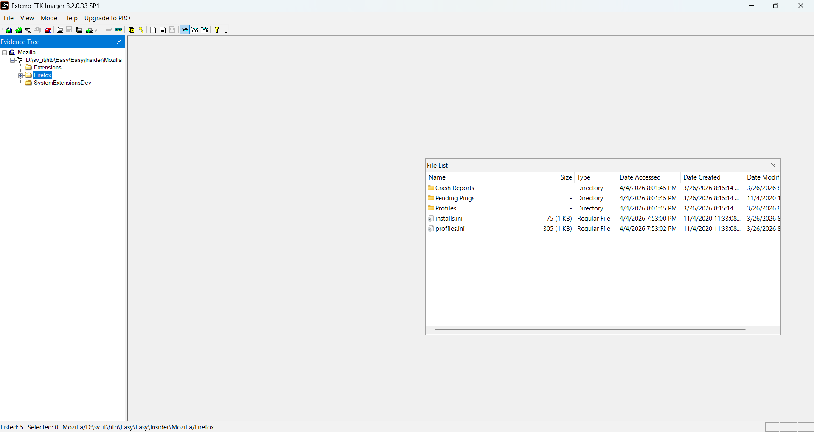
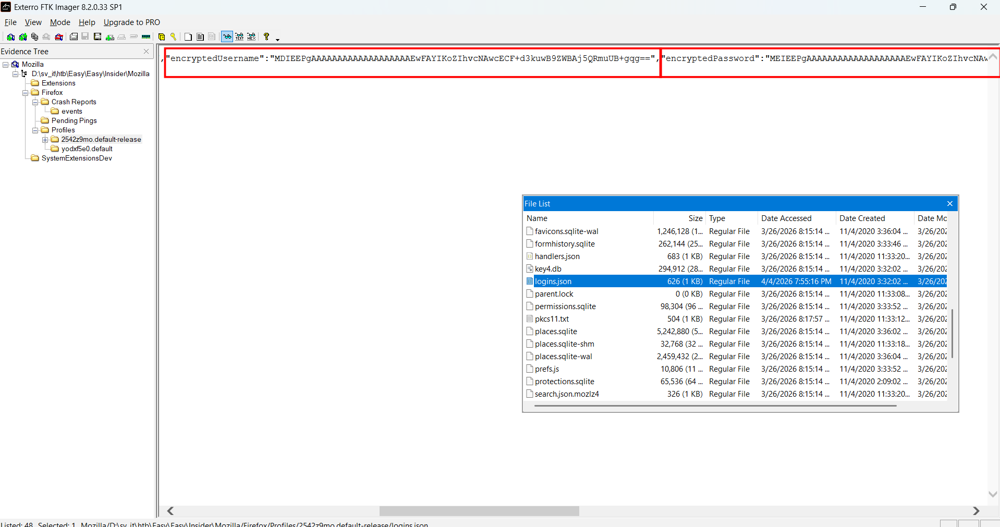
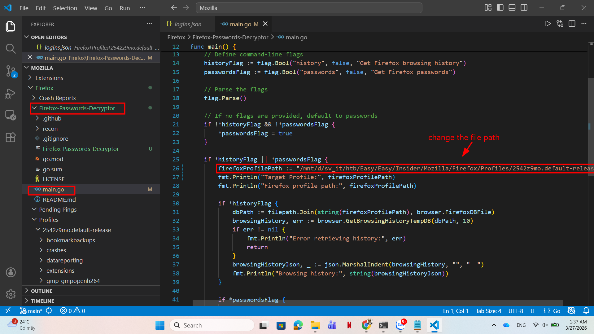
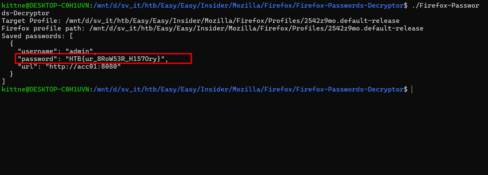

# WRITE_UP #

## INSIDER ##

### 1. Analysis ###
* **Given:** a folder named `Mozilla`
* **Description:** A potential insider threat has been reported, and we need to find out what they accessed. Can you help?
* **Hints:**   
    * No hints are given 

### 2. Investigation ###
#### FIREFOX DECRYPTOR ####
So we were given a folder from `Roaming` directory from a user's profile. Inside `Mozilla` is 3 subfolders `Extensions`, `Firefox`, `SystemExtensionsDev`. However, only `Firefox` contains data, so we will stick to this folder.

Using FTK Imager, I could open the `Mozilla`:

Upon investigation, in the folder Profiles, we can see 2 folder: `2542z9mo.default-release`, `yodxf5e0.default`. While the `yodxf5e0` is almost empty with a meaningless file, the other folder contains a lot of information.

First of all, I found for the `logins.json` which stores user password:

We can see a encrypted password and encrypted username. My first thought was to decrypt the password. After a research, I knew to crack the Firefox password, we will need 2 files:
1. The `logins.json` I mentioned above
2. A file named `key4.db`

I need to make this clear, in the `2025`, Firefox has used another method to encrypt its password: [How Firefox securely saves passwords](https://support.mozilla.org/vi/kb/how-firefox-securely-saves-passwords). In the older version, they used `3DES-CBC` which is quite easy to break, in the newest version they had updated to `AES-256` which is a stronger and more modern method. If you tried to write a script to decrypt the data on your own, you should notice the difference.

Fortunately, we can easily find the 2 ingredients, now we need a recipe to be able to cook the dish. I did do a small research, after that, I found this page: [Firefox Passwords Decryptor](https://pkg.go.dev/github.com/sohimaster/Firefox-Passwords-Decryptor#section-readme) which can decrypt both Firefox old and new encryption method so we don't need to concern about the version of this Firefox.

Followed exactly the README file with a small change in the file path of the main function, I could easily get the username and password decrypted, hence retrieve the flag:

### 3. Solution ###
1. **Result:** The flag is `HTB{ur_8RoW53R_H157Ory}`

