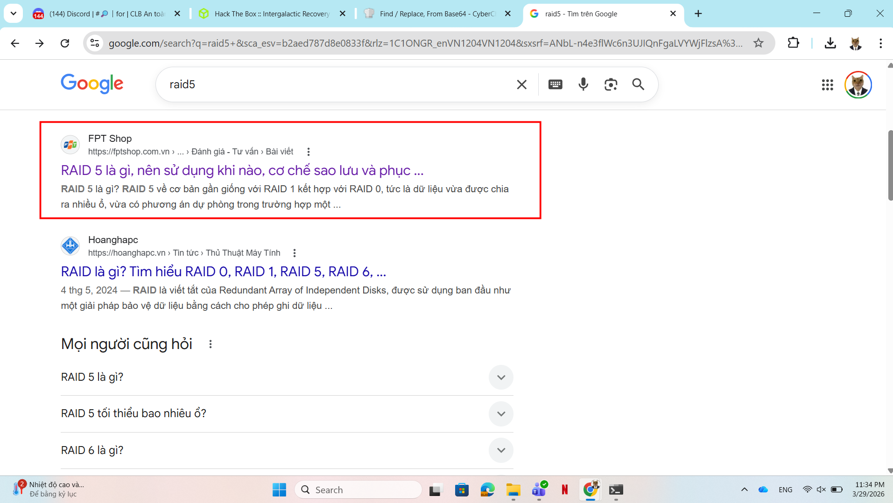
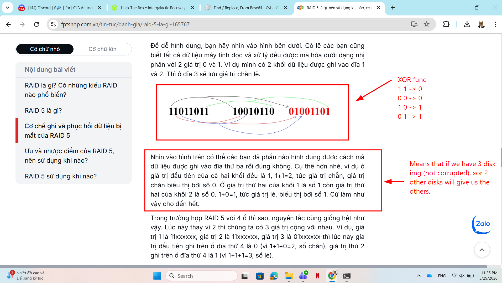
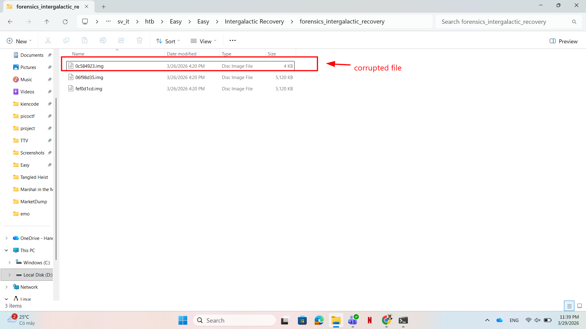
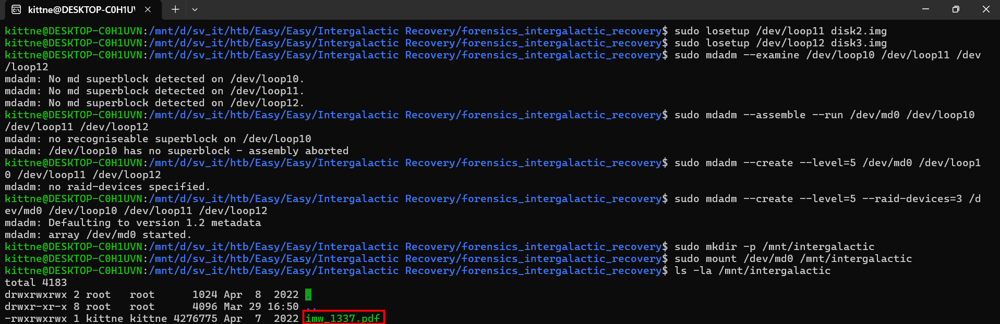
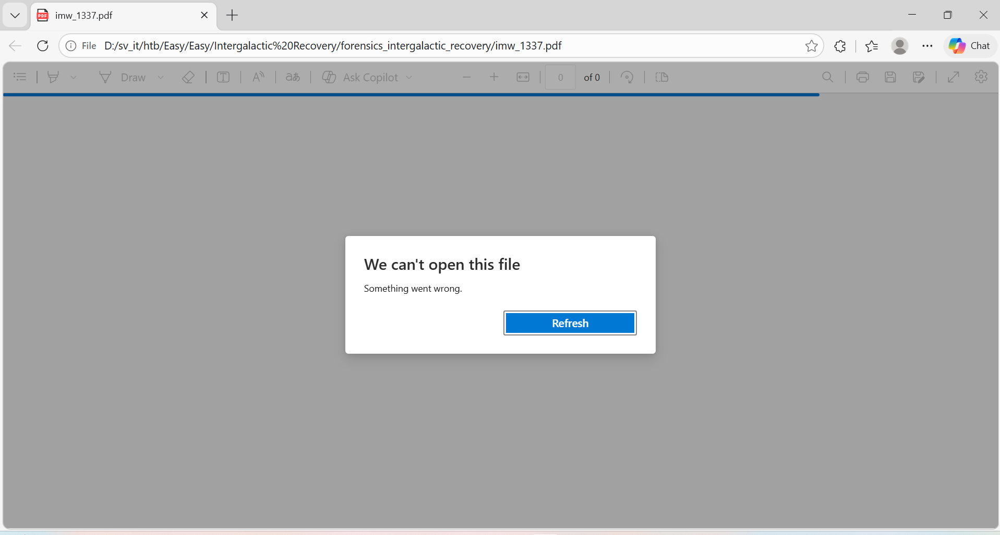
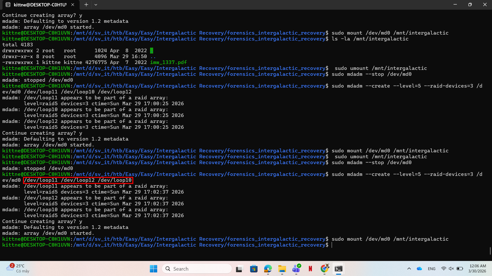
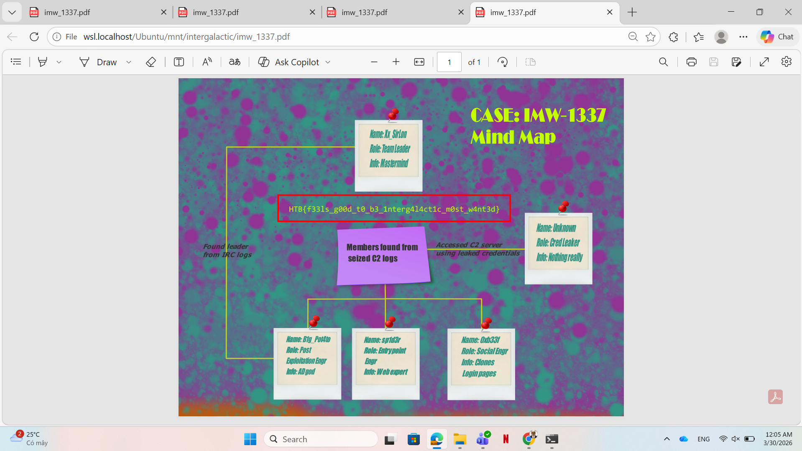

# WRITE_UP #

## SP00KY THEME ##

### 1. Analysis ###
* **Given:** a folder include 3 disk image.
* **Description:** Miyuki's team stores all the evidence from important cases in a shared RAID 5 disk. Especially now that the case IMW-1337 is almost completed, evidences and clues are needed more than ever. Unfortunately for the team, an electromagnetic pulse caused by Draeger's EMP cannon has partially destroyed the disk. Can you help her and the rest of team recover the content of the failed disk?
* **Hints:**   
    * No hints are given 

### 2. Investigation ###
#### RAIDER ####
From the description, we know that these 3 disks are from a shared RAID 5 disk. Doing some research to find more information about RAID5:



[RAID 5](https://fptshop.com.vn/tin-tuc/danh-gia/raid-5-la-gi-165767)

Reading the article, I know the mechanism behind RAID 5 disk:



In RAID 5 with n disk, this mechanism will help us to recover a corrupted disk if we got the other n - 1 disks intact by XOR those n - 1 disks. Moreover, every RAID 5 disks need to be the same size so we can easily detect the corrupted one:



We were given a RAID 5 with 3 disks, so I write a small python script to recover the corrupted one using 2 others:

```python
with open("06f98d35.img", "rb") as f1, open("fef0d1cd.img", "rb") as f2, open("disk3.img", "wb") as f3:
    b1 = f1.read()
    b2 = f2.read()

    result = bytes([a ^ b for a, b in zip(b1, b2)])
    f3.write(result)
```

There we go, after gathering all 3 disks now we can recover the original contents. Here I use `mdadm` to realize our goal:
1. I renamed `06f98d35` to `disk1.img` and `fef0d1cd.img` to `disk2.img` for easier access.
2. First, since computers don't recognize normal disk image as real hardwares, we need to turn those normal disk image to virtual hardware by using `losetup`:
```bash
sudo losetup /dev/loop10 disk1.img
sudo losetup /dev/loop11 disk2.img
sudo losetup /dev/loop12 disk3.img
# You can use any /dev/loop if your computer not using it, here I pick high number to be careful
```
3. Now we can use `mdadm` to group three disks into 1 shared RAID disk. Normally we get this done with:
```bash
# sudo mdadm --create --level=<RAID level> --raid-devices=<number of disks> /dev/md0 <device list>
sudo mdadm --create --level=5 --raid-devices=3 /dev/md0 /dev/loop10 /dev/loop11 /dev/loop12
```
   * **Note:** Here I got a bit lucky to still be able to find the flag.In real-life you shoudn't be careless to not add the `--assume-clean` to the command. If you don't add this argument your machine may override the content of the disk and may destroy the evidence so you gotta be careful. 
4. Back to our challenge, since I didn't know the order of the disk, first I wanted to run --examine to determine the order, but it didn't work. So now we need to try `3! = 6` circumstances since we have 3 disks to be ordered.
5. First, I used the order disk1, disk2, disk3: 
```bash
sudo mdadm --create --level=5 --raid-devices=3 /dev/md0 /dev/loop10 /dev/loop11 /dev/loop12
```
   * After recovering the RAID 5, I mount the disk to my machine and checked for files, I found a `.PDF` file:
   


6. However I couldn't open this file so I knew this is not the right order:



1. After a few more tries, I found the right order: `disk2 ` - `fef0d1cd.img` originally, `disk3` - the corrupted file we recover, `disk1` - `06f98d35.img` originally and got the flag:





**Note:** Remember to umount the disk, stop the RAID disk, free the /dev/loop

```bash
sudo umount #<path you mount the disk to>
sudo mdadm --stop /dev/md0
sudo losetup -d #<device loop you use>
```

### 3. Solution ###
1. **Result:** The flag is `HTB{f33ls_g00d_t0_b3_1nterg4l4ct1c_m0st_w4nt3d}`


