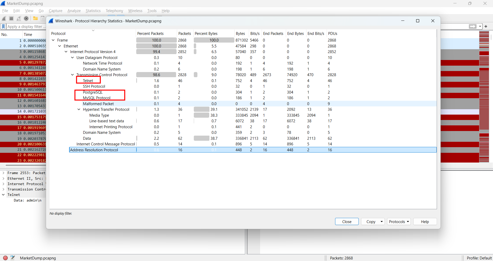
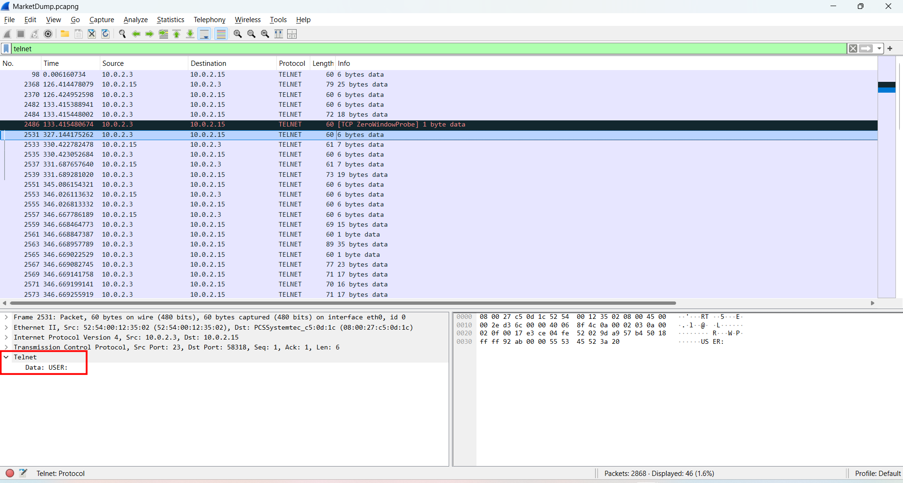
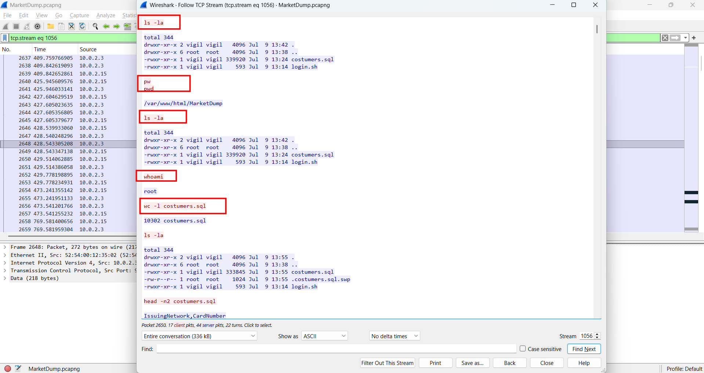
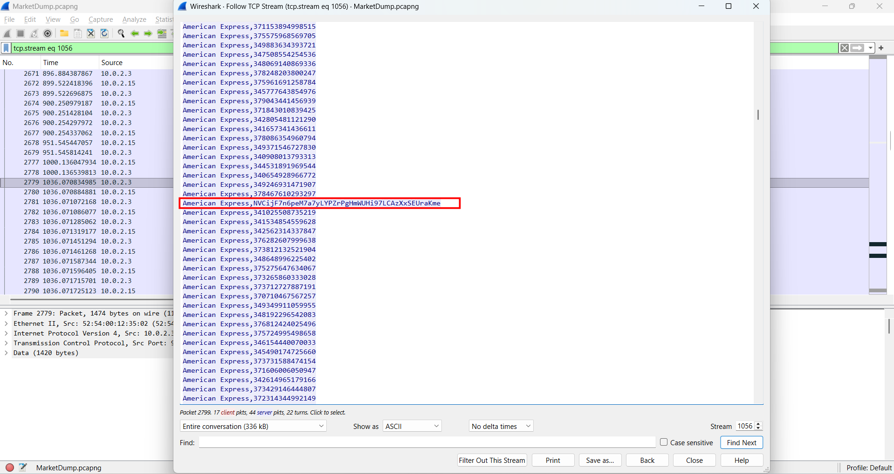
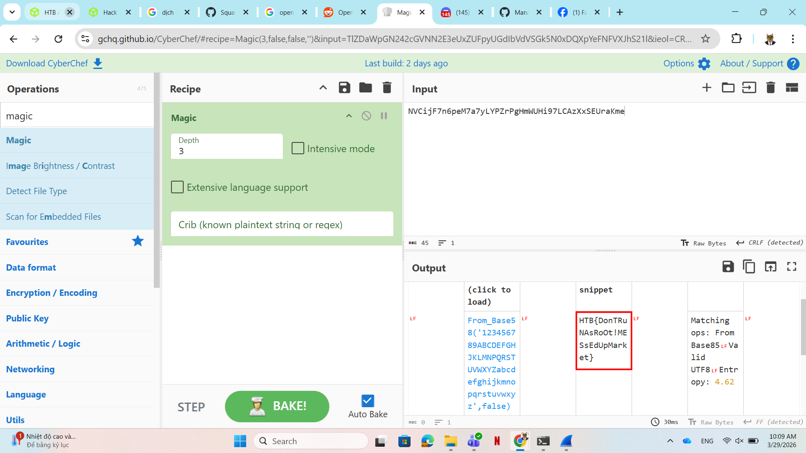

# WRITE_UP #

## MARKETDUMP ##

### 1. Analysis ###
* **Given:** a `.pcapng` file named `MarketDump.pcapng`
* **Description:** We have got informed that a hacker managed to get into our internal network after pivoiting through the web platform that runs in public internet. He managed to bypass our small product stocks logging platform and then he got our costumer database file. We believe that only one of our costumers was targeted. Can you find out who the customer was?
* **Hints:**   
    * No hints are given 

### 2. Investigation ###
#### TELNET SNIFFINGGGGG ####
Opened the pcapng file, initially, I looked for `Protocol Hierarchy` and found some interesting protocols which are `Telnet`, `MySQL Protocol`,...



**Telnet (Teletype Network):** is the ancestor of `SSH`. It is an application protocol used on the Internet or local area networks to provide a bidirectional interactive text-oriented communication facility. Crucially for this investigation, Telnet transmits all data—including usernames, passwords, and commands—in clear text without any encryption. This severe security weakness allows anyone capturing the network traffic to read the exact keystrokes and data exchanged between the client and the server.

Filtered the `Telnet` protocol, we can see the attacker tried to brute force the `USERNAME` and `PASSWORD` of a `SQL` database:



In packet number 2559, we can see that the attacker had access to the SQL database by successfully logging in as `root`. 

To get a clearer picture of what the attacker did next, we follow the `TCP stream`. Since Telnet transmits data in plain text, we can read the entire interaction between the attacker and the server. 

Inside the TCP stream, we can observe the attacker's commands. After gaining `root` access, in stream 1056, the attacker ran lists of command, such as `ls -la`, `whoami`, especially he proceeded to dump the `costumers.sql` database to extract information by running:

```bash
python -m SimpleHTTPServer 9998
cat costumers.sql
```



After scrolling, we can find a line that stands out from the rest:



Upload the suspicious string using `Magic` recipe we should easily find the flag:



### 3. Solution ###
1. **Result:** The flag is `HTB{DonTRuNAsRoOt!MESsEdUpMarket}`


