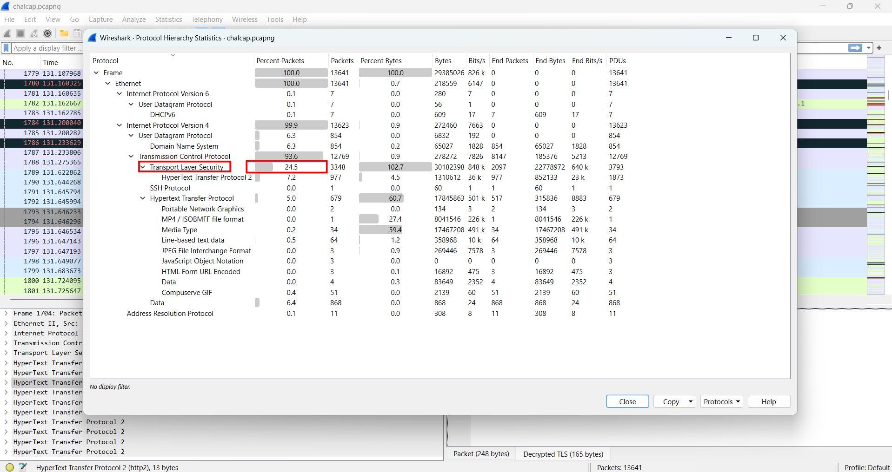
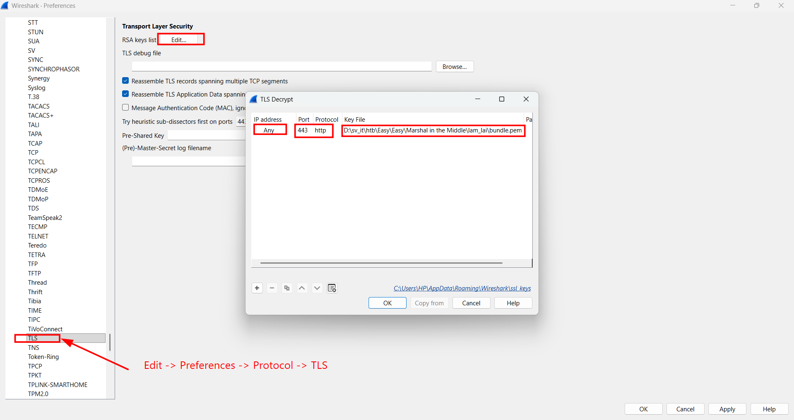
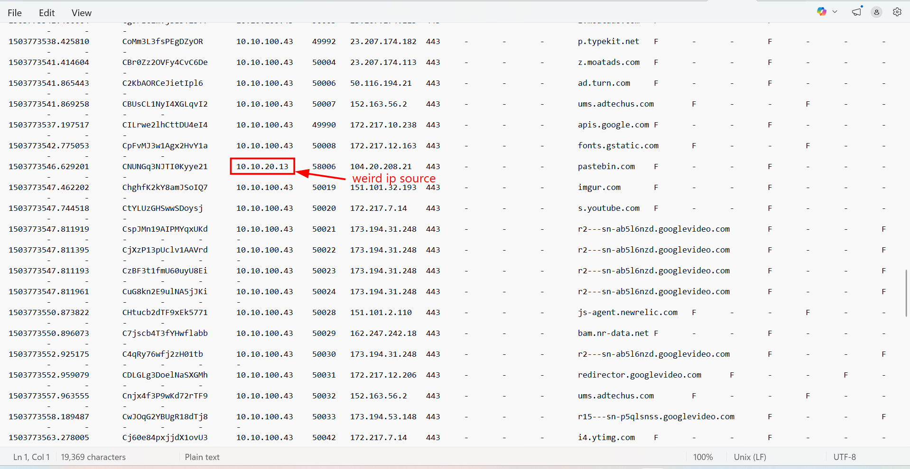
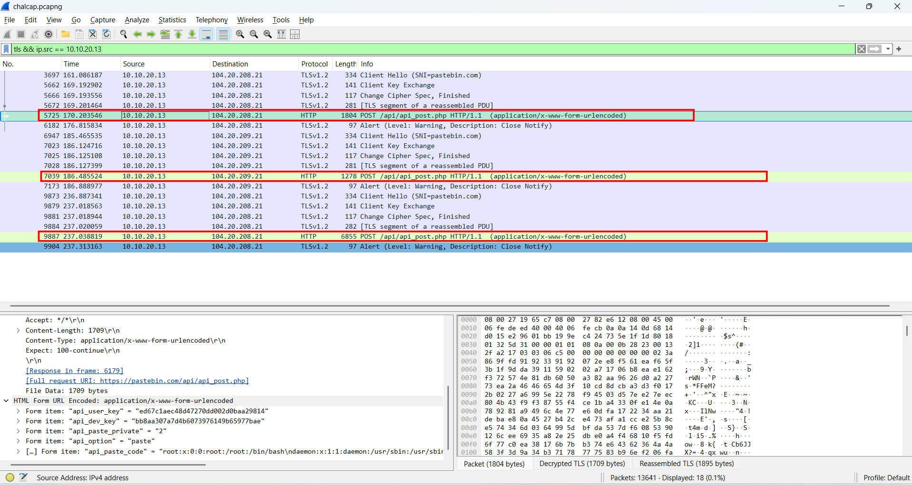
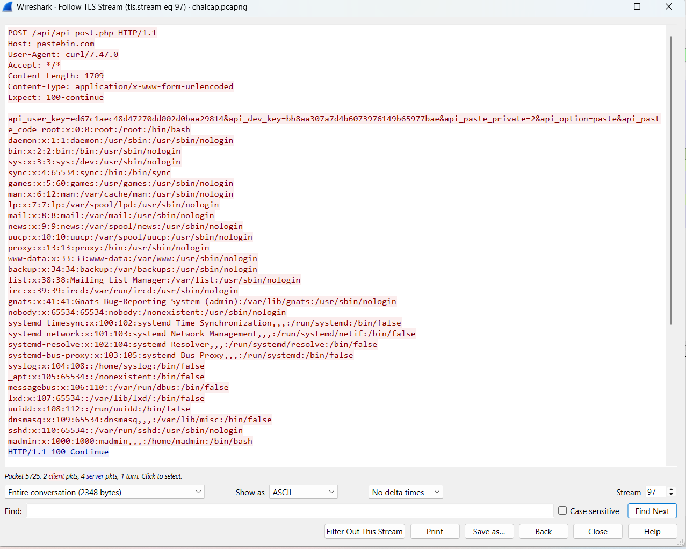
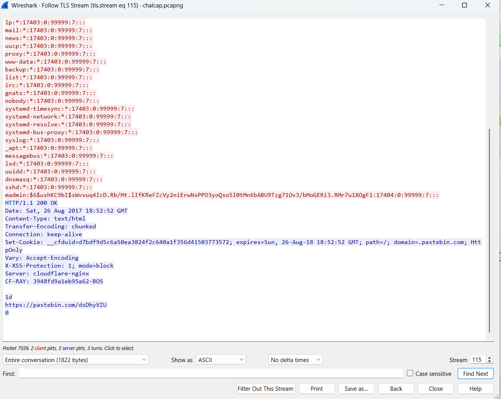
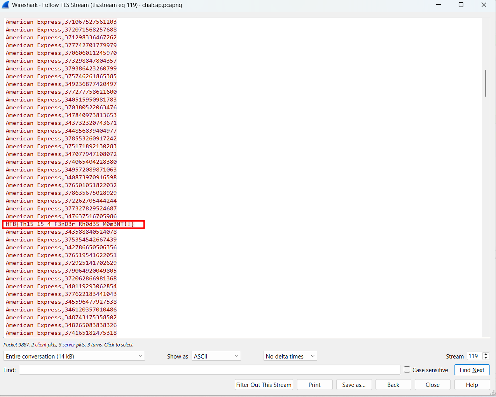

# WRITE_UP #

## MARSHAL IN THE MIDDLE ##

### 1. Analysis ###
* **Given:** a `.pcapng` file named `chalcap.pcapng`, a file named `bundle.pem`, a file named `secrets.log`, a subfolder named `bro` which contains 7 more log files.
* **Description:** The security team was alerted to suspicous network activity from a production web server.Can you determine if any data was stolen and what it was?
* **Hints:**   
    * No hints are given 

### 2. Investigation ###
#### SHAKE MY HANDSSSS ####
Since this is the first time I received a `.pem` file, I did a quick research to see what type of file is it:

**PEM (Privacy-Enhanced Mail)**:  file is a text-based container format used to store and transport cryptographic data, such as public/private keys and digital certificates. Originally designed for secure email, it has become the industry standard for web security (SSL/TLS) and server authentication (SSH).

**TLS (Transport Layer Security):** is a widely adopted security protocol designed to facilitate privacy and data security for communications over the Internet. It encrypts the communication between web applications and servers (turning HTTP into HTTPS). Because the traffic is encrypted, packet sniffers like Wireshark will only see unreadable ciphertext.

Since I knew this is a TLS key, I opened the pcapng file, used `Protocol Hierarchy` to see if `TLS` protocol is captured:

Then I import the `.pem` file to the pcapng to decrypt the TLS data:

Now we can trace the TLS stream. But before that let's take a look at the subfolder `bro`. Inside there's a log named `ssl.log`. Opening it in `Notepad`, we can spot the very suspicious ip source that stands out from the others:

So I filtered only tls packets came from the `ip.src == 10.10.20.13`:

As you can see, there are 3 HTTP request **POST**, let's analyze them step by step:
1. The first stream is `tls stream 97` :

Looks like the attacker had ran `curl` to exfiltrate information from `/etc/passwd`, then attacker use a request **POST** to his pastebin account.
1. The next stream is `tls stream 115`:

The attacker now ran another `curl` to exfiltrate information from `/etc/shadow`, which stores password hash of users
1. The last one is `tls stream 119`, there are lines of American Express credit card data being exfiltrated. Scrolling down is the flag we need to find:
 

### 3. Solution ###
1. **Result:** The flag is `HTB{Th15_15_4_F3nD3r_Rh0d35_M0m3NT!!}`

