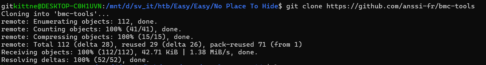
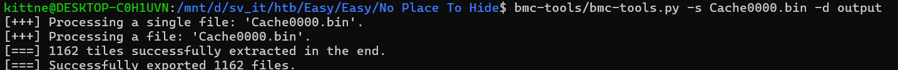
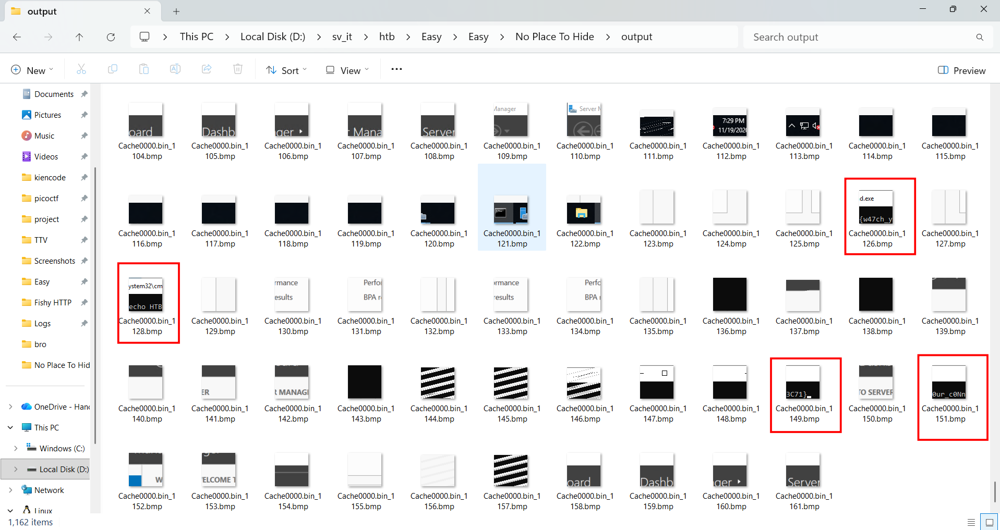

# WRITE_UP #

## NO PLACE TO HIDE ##

### 1. Analysis ###
* **Given:** a file named `bcache24.bmc`, and a file named `Cache0000.bin`.
* **Description:** We found evidence of a password spray attack against the Domain Controller, and identified a suspicious RDP session. We'll provide you with our RDP logs and other files. Can you see what they were up to?
* **Hints:**   
    * No hints are given 

### 2. Investigation ###
#### I CAN SEE YOUU ####
The description mentions an `RDP - Remote Desktop Protocol` session. Usually, we can look for `.rdp` files or Event Logs. However, in this challenge, those are unavailable, so we can look into `RDP Bitmap Caching`.

**RDP Bitmap Caching:** To improve performance and reduce network bandwidth, the RDP client saves frequently used graphical images (bitmaps) — such as icons, taskbar fragments, or wallpaper pieces — to the local disk. Even after a session ends, these tiles remain in the cache files (.bin or .bmc). By reassembling these tiles, we can literally see what the attacker saw on their screen. In this challenge, we are given:
* bcache24.bmc: Used by older RDP clients (Windows XP/7), however this one is empty
* Cache0000.bin: Used by modern RDP clients (Windows 8/10/11). 

After doing a research, I found this tools to parse Bitmap Cache RDP and convert the raw bitmaps into viewable images: [bmc-tools](https://github.com/anssi-fr/bmc-tools)




```bash
mkdir output
python3 bmc-tools.py -s Cache0000.bin -d output
```



Using the script we should easily find the flag hidden in 4 pieces of image.

### 3. Solution ###
1. **Result:** The flag is `HTB{w47ch_y0ur_c0Nn3C71}`


