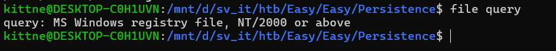
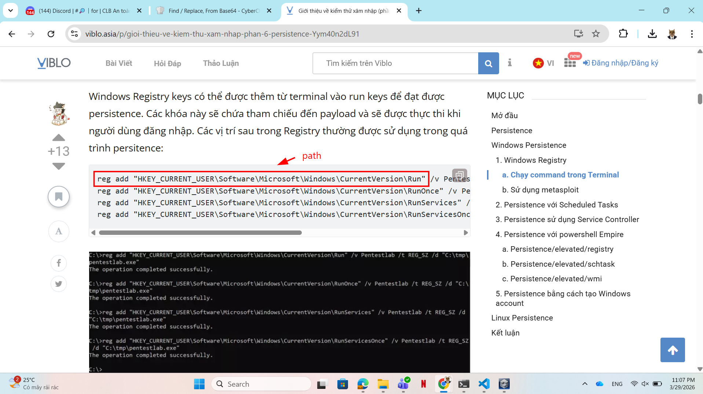
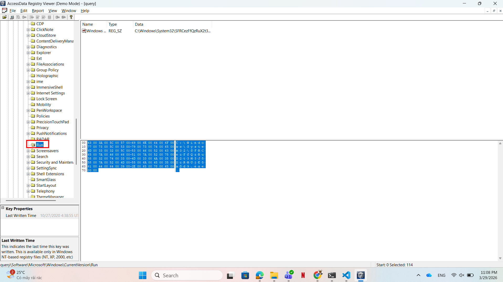
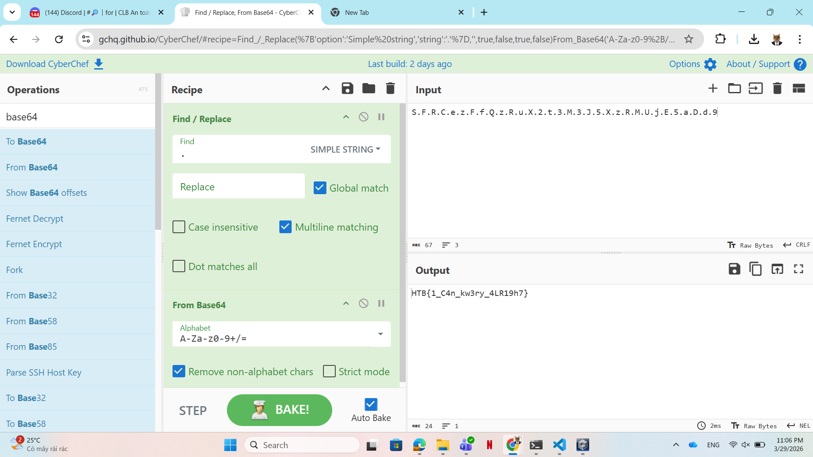

# WRITE_UP #

## PERSISTENCE ##

### 1. Analysis ###
* **Given:** a file named `query`.
* **Description:** We're noticing some strange connections from a critical PC that can't be replaced. We've run an AV scan to delete the malicious files and rebooted the box, but the connections get re-established. We've taken a backup of some critical system files, can you help us figure out what's going on?
* **Hints:**   
    * No hints are given 

### 2. Investigation ###
#### PERSISTENCE ####
First, I ran `file` to see what type of file `query` is:

The output confirms that this is an extracted Windows Registry Hive file from the victim's machine. Basically, **Windows Registry files** are a hierarchical database storing low-level configuration settings for the OS and applications.

**Persistence** is a technique used by attackers to maintain a connection between their Command and Control (C2) server and the victim's machine, ensure the backdoor survives even after the machine is rebooted. Commonly, attackers will modify `Registry Run keys` to achieve this. You can read this article for more information: [Persistence](https://viblo.asia/p/gioi-thieu-ve-kiem-thu-xam-nhap-phan-6-persistence-Yym40n2dL91)

Common persistence locations in the Registry include:
- HKEY_CURRENT_USER\Software\Microsoft\Windows\CurrentVersion\Run
- HKEY_CURRENT_USER\Software\Microsoft\Windows\CurrentVersion\RunOnce
- HKEY_LOCAL_MACHINE\Software\Microsoft\Windows\CurrentVersion\Run
- HKEY_LOCAL_MACHINE\Software\Microsoft\Windows\CurrentVersion\RunOnce

Given the information, we can open this file using `Registry Viewer`. Open the file, we can see there are folders such as `Control panel`, `Software`, `Environment`, so we can make sure this `query` is a `NTUSER.DAT` which belongs to `HKEY_CURRENT_USER`: [Registry Hives](https://learn.microsoft.com/en-us/windows/win32/sysinfo/registry-hives). After navigating the registry structure, we can locate the value in `Software\Microsoft\Windows\CurrentVersion\Run`:

The data looks like a base64 string, using CyberChef we should easily decode it and get the flag:

### 3. Solution ###
1. **Result:** The flag is `HTB{1_C4n_kw3ry_4LR19h7}`

