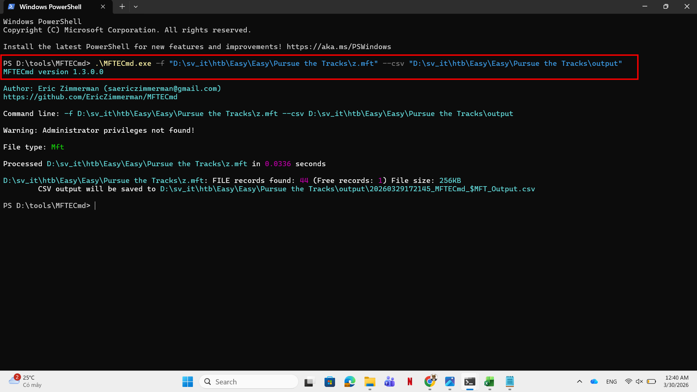
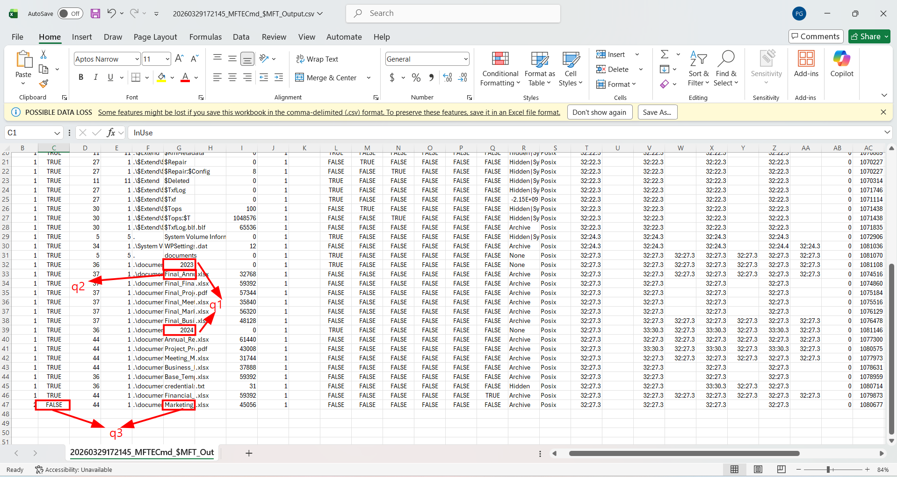
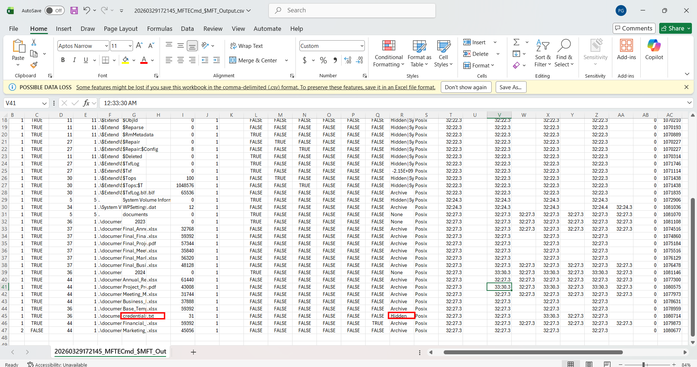
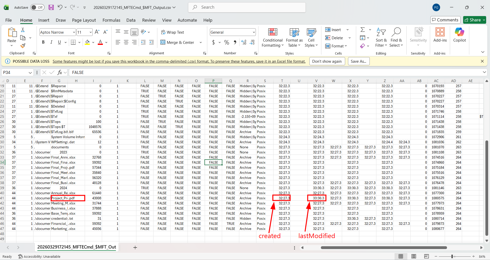

# WRITE_UP #

## PURSUE THE TRACKS ##

### 1. Analysis ###
* **Given:** a `MFT` file named `z.mft`
* **Description:** Luxx, leader of The Phreaks, immerses himself in the depths of his computer, tirelessly pursuing the secrets of a file he obtained accessing an opposing faction member's workstation. With unwavering determination, he scours through data, putting together fragments of information trying to take some advantage on other factions. To get the flag, you need to answer the questions from the docker instance.
* **Hints:**   
    * No hints are given 

### 2. Investigation ###
#### MFT READING ####
For anyone who has never heard about **MFT - Master File Table:** MFT is defined as a critical component of the NTFS file system that maintains records of all files in a volume, including their locations, metadata, and access control lists. Each entry in the MFT is 1024 bytes and contains information such as file creation dates, modification dates, and file sizes. You can read this article for more information:

[Master File Table](https://www.sciencedirect.com/topics/computer-science/master-file-table)

To analyze this file, we need to install a tool specialized to do the work. Here I chose `MFTECmd` developed by `EricZimmerman`: [MFTECmd](https://github.com/EricZimmerman/MFTECmd).

This tool will read the `MFT` file then parse it into a `.csv` file to makes it easier to analyze the file:





* **The first question:** `Files are related to two years, which are those? (for example: 1993,1995)`
    * There are 2 directories named 2023 and 2024 under the `documents` folder

So the answer is: `2023,2024`

* **The second question:** `There are some documents, which is the name of the first file written? (for example: randomname.pdf)`
    * The first file written right below the 2023 one.

So the answer is: `Final_Annual_Report.xlsx`

* **The third question:** `Which file was deleted? (for example: randomname.pdf)`
    * We find this information in `InUse` column, there's only one row's value demonstrates `False`
  
So the answer is: `Marketing_Plan.xlsx`

* **The fourth question:** `How many of them have been set in Hidden mode? (for example: 43)`
    * Although we can see lots of file in hidden mode. However the majority of them are system files, so they are hidden by default.
    * Since the question asks how many have been **SET**, there's only one file not system file which is `credentials.txt`

    

So the answer is: `1`

* **The fifth question:** `Which is the filename of the important TXT file that was created? (for example: randomname.txt)`
    * We found it in the previous question.

So the answer is: `credentials.txt`

* **The sixth question:** `A file was also copied, which is the new filename? (for example: randomname.pdf)`
    * There's a `Copied` column return True or False, we need to find that one True:

So the answer is: `Financial_Statement_draft.xlsx`

* **The seventh question:** `Which file was modified after creation? (for example: randomname.pdf)`
    * We need to find the file where the `LastModified` timestamp is different from the column `Created`

    

So the answer is: `Project_Proposal.pdf`

* **The eighth question:** `What is the name of the file located at record number 45? (for example: randomname.pdf)`
    * We find this information in `EntryNumber` column

So the answer is: `Annual_Report.xlsx`

* **The ninth question:** `What is the size of the file located at record number 40? (for example: 1337)`
    * We find this information in `FileSize` column

So the answer is: `57344`
```bash
kittne@DESKTOP-C0H1UVN:/mnt/d/sv_it/htb/Easy/Easy/Pursue the Tracks$ nc 154.57.164.76 30764

+-------------------+---------------------------------------------------------------------------------------------------------------------------------------------------+
|       Title       |                                                                    Description                                                                    |
+-------------------+---------------------------------------------------------------------------------------------------------------------------------------------------+
| Pursue The Tracks |                                    Luxx, leader of The Phreaks, immerses himself in the depths of his computer,                                   |
|                   |                      tirelessly pursuing the secrets of a file he obtained accessing an opposing faction member workstation.                      |
|                   | With unwavering determination, he scours through data, putting together fragments of information trying to take some advantage on other factions. |
|                   |                                    To get the flag, you need to answer the questions from the docker instance.                                    |
+-------------------+---------------------------------------------------------------------------------------------------------------------------------------------------+

Files are related to two years, which are those? (for example: 1993,1995)
> 2023,2024
[+] Correct!

There are some documents, which is the name of the first file written? (for example: randomname.pdf)
> Final_Annual_Report.xlsx
[+] Correct!

Which file was deleted? (for example: randomname.pdf)
> Marketing_Plan.xlsx
[+] Correct!

How many of them have been set in Hidden mode? (for example: 43)
> 1
[+] Correct!

Which is the filename of the important TXT file that was created? (for example: randomname.txt)
> credentials.txt
[+] Correct!

A file was also copied, which is the new filename? (for example: randomname.pdf)
> Financial_Statement_draft.xlsx
[+] Correct!


Which file was modified after creation? (for example: randomname.pdf)
> Project_Proposal.pdf
[+] Correct!

What is the name of the file located at record number 45? (for example: randomname.pdf)
> Annual_Report.xlsx
[+] Correct!

What is the size of the file located at record number 40? (for example: 1337)
> 57344
[+] Correct!

[+] Here is the flag: HTB{MFT_p4rs1ng_1s_r34lly_us3full!}
```

### 3. Solution ###
1. **Result:** The flag is `HTB{MFT_p4rs1ng_1s_r34lly_us3full!}`


