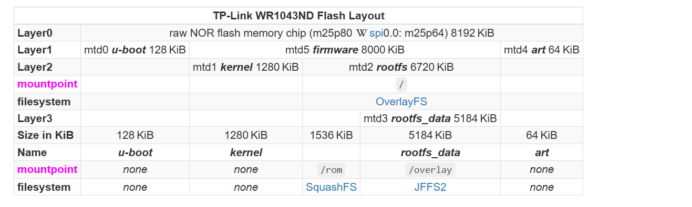
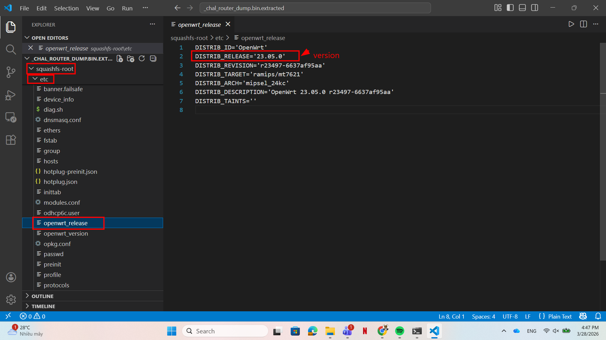
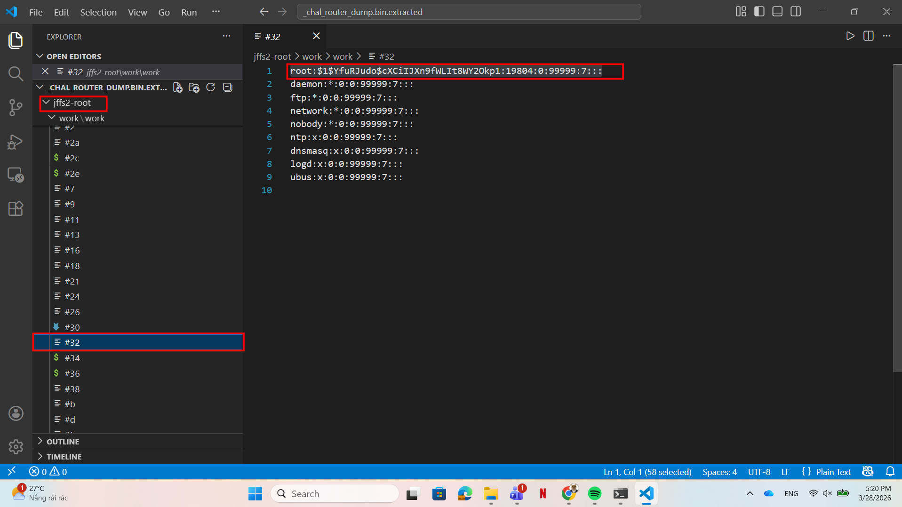
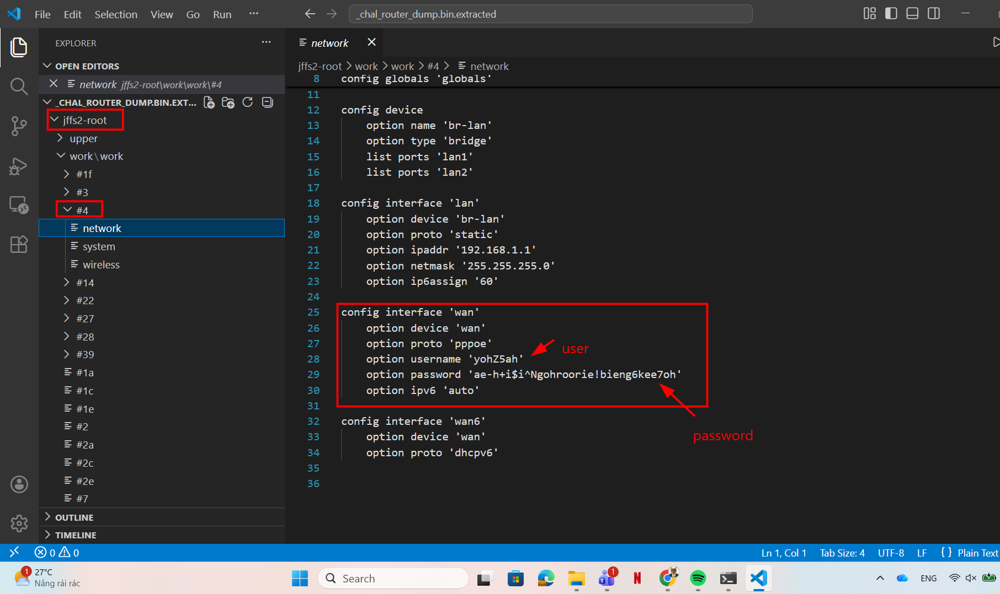
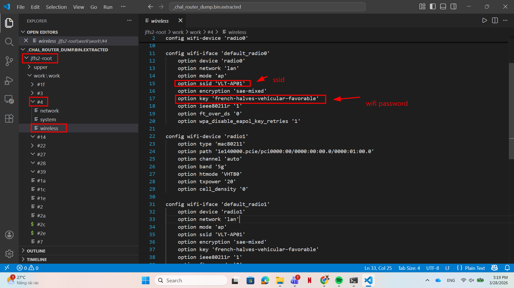
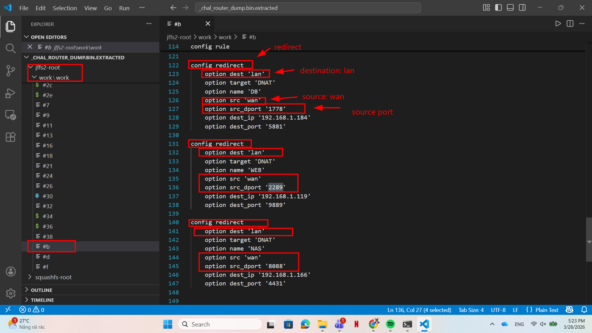

# WRITE_UP #

## SILICON DATA SLEUTHING ##

### 1. Analysis ###
* **Given:** a router dump file `chal_router_dump.bin`
* **Description:** In the dust and sand surrounding the vault, you unearth a rusty PCB... You try to read the etched print, it says Open..W...RT, a router! You hand it over to the hardware gurus and to their surprise the ROM Chip is intact! They manage to read the data off the tarnished silicon and they give you back a firmware image. It's now your job to examine the firmware and maybe recover some useful information that will be important for unlocking and bypassing some of the vault's countermeasures!
* **Hints:**   
    * No hints are given 

### 2. Investigation ###
#### OPEN WRT CONFIG ####
Before actually solving this challenge, let's do a research about `Open WRT` to see how it's structured:

**OpenWRT:** OpenWrt is an open-source Linux operating system targeting embedded devices, most commonly routers. Instead of using the vendor's static and limited firmware, users flash OpenWrt to gain a fully writable filesystem with package management, allowing for deep customization.

When analyzing a router firmware dump like our `.bin` file, we are essentially looking at a flash memory image. OpenWrt uses an `OverlayFS` architecture, which typically combines two distinct filesystems:
1. **SquashFS:** A read-only filesystem. It contains the core operating system, default configurations, ...
2. **JFFS2:** A read-write filesystem. OpenWrt uses this section to store user specific configurations, modified passwords, and newly installed packages.

You can read more about this structure in the official [OpenWrt Documentation](https://openwrt.org/docs/techref/flash.layout).



In this challenge, there are questions require us to analyze the JFFS2 filesystem, so I recommend you to install `jefferson` first before extracting the `bin` file.

```bash
binwalk -e chal_router_dump.bin
```

After extracting the bin file, let's get this done:

* **The first question:** `What version of OpenWRT runs on the router (ex: 21.02.0)`
    * Since this a question about default config, we should find the answer in folder `squashfs-root`, moreover, since we are facing with a Linux distribution, it should comply with Linux Filesystem Hierarchy Standard: [Filesystem Hierarchy Standard](https://refspecs.linuxfoundation.org/FHS_3.0/fhs/index.html), so I found the version in the path `/squashfs-root/etc/openwrt_release`:
     

The answer is: `23.05.0`

* **The second question:** `What is the Linux kernel version (ex: 5.4.143)`
    * In the link I mentioned, the index 3.9 is: `/lib : Essential shared libraries and kernel modules`, so we can find the kernel version in `/squashfs-root/lib/modules`

The answer is: `5.15.134`

* **The third question:** `What's the hash of the root account's password, enter the whole line (ex: root:$2$JgiaOAai....)`
    * This question requires password hash. Notably, this is a configurable information, so I switched to `jffs2-root` folder.
    * With this `jffs2` we can not use the linux filesystem hierarchy anymore since it only stores modified files in subfolders such as `#1`, `#3`, ...
    * After a few minutes I found the hash in this path `jffs2-root/work/work/#32`
    

So the answer is: `root:$1$YfuRJudo$cXCiIJXn9fWLIt8WY2Okp1:19804:0:99999:7:::`

* **The fourth and fifth question:** `What is the PPPoE username` and `What is the PPPoE password`
    * PPPoE - Point-to-Point Protocol over Ethernet is often stores in `/etc/config/network`
    * We can find the answers for this 2 questions in `/jffs2-root/work/work/#4/network`
    

So the answer is: `yohZ5ah` and `ae-h+i$i^Ngohroorie!bieng6kee7oh`

* **The sixth and seventh question:** `What is the WiFi SSID` and `What is the WiFi Password`
    * In the same folder `#4` we can see another file `wireless` that stores the information about wireless device:
     

So the answer is: `VLT-AP01` and `french-halves-vehicular-favorable`

* **The eighth question:** `What are the 3 WAN ports that redirect traffic from WAN -> LAN (numerically sorted, comma sperated: 1488,8441,19990)`
    * In the file `/jffs2-root/work/work/#b`, we can find this type of information:
     
So the answer is: `1778,2289,8088`

```bash
kittne@DESKTOP-C0H1UVN:/mnt/d/sv_it/htb/Easy/Easy/Silicon Data Sleuthing$ nc 154.57.164.66 30638

+------------------------+------------------------------------------------------------------------------------------------------------------------------------------------------------------------------------------+
|         Title          |                                                                                       Description                                                                                        |
+------------------------+------------------------------------------------------------------------------------------------------------------------------------------------------------------------------------------+
| Silicon Data Sleuthing |                         In the dust and sand surrounding the vault, you unearth a rusty PCB... You try to read the etched print, it says Open..W...RT, a router!                         |
|                        |                                                         You hand it over to the hardware gurus and to their surprise the ROM Chip is intact!                                             |
|                        |                                                    They manage to read the data off the tarnished silicon and they give you back a firmware image.                                       |
|                        |              It's now your job to examine the firmware and maybe recover some useful information that will be important for unlocking and bypassing some of the vault's countermeasures! |
+------------------------+------------------------------------------------------------------------------------------------------------------------------------------------------------------------------------------+

What version of OpenWRT runs on the router (ex: 21.02.0)
> 23.05.0
[+] Correct!

What is the Linux kernel version (ex: 5.4.143)
> 5.15.134
[+] Correct!

What's the hash of the root account's password, enter the whole line (ex: root:$2$JgiaOAai....)
> root:$1$YfuRJudo$cXCiIJXn9fWLIt8WY2Okp1:19804:0:99999:7:::
[+] Correct!


What is the PPPoE username
> yohZ5ah
[+] Correct!

What is the PPPoE password
> ae-h+i$i^Ngohroorie!bieng6kee7oh
[+] Correct!

What is the WiFi SSID
> VLT-AP01
[+] Correct!

What is the WiFi Password
> french-halves-vehicular-favorable
[+] Correct!


What are the 3 WAN ports that redirect traffic from WAN -> LAN (numerically sorted, comma sperated: 1488,8441,19990)
> 1778,2289,8088
[+] Correct!

[+] Here is the flag: HTB{Y0u'v3_m4st3r3d_0p3nWRT_d4t4_3xtr4ct10n_4nd_c0nf1g!!}
```

## 3. Solution ##
1. **Result:** The flag is `HTB{Y0u'v3_m4st3r3d_0p3nWRT_d4t4_3xtr4ct10n_4nd_c0nf1g!!}`


