# WRITE_UP #

## TANGLE HEIST ##

### 1. Analysis ###
* **Given:** a pcap file named `capture.pcap`
* **Description:** The survivors' group has meticulously planned the mission 'Tangled Heist' for months. In the desolate wasteland, what appears to be an abandoned facility is, in reality, the headquarters of a rebel faction. This faction guards valuable data that could be useful in reaching the vault. Kaila, acting as an undercover agent, successfully infiltrates the facility using a rebel faction member's account and gains access to a critical asset containing invaluable information. This data holds the key to both understanding the rebel faction's organization and advancing the survivors' mission to reach the vault. Can you help her with this task?
* **Hints:**   
    * No hints are given 

### 2. Investigation ###
#### LDAP CAPTURE ####

Before diving into the questions, it is crucial to understand the core protocol analyzed in this challenge.

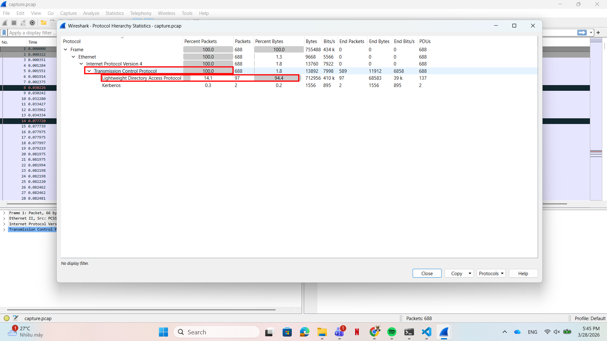

**LDAP (Lightweight Directory Access Protocol)** is an open protocol used over an IP network to manage and access distributed directory information services. In Windows environments, LDAP is the primary protocol used to query and modify objects within **Active Directory (AD)**. Whenever a user logs in, searches for a printer, or an administrator changes a group policy, LDAP is functioning behind the scenes to fetch or update that data.

**The LDAP Session Flow:**
Just like an HTTP connection requires a TCP 3-way handshake before transmitting data, an LDAP session follows a strict, multi-step lifecycle :

1. **Connection Initialization:** The client establishes a TCP connection to the server (usually on port 389 for LDAP or 636 for LDAPS).
2. **Authentication (Bind):** The client must prove its identity to the directory server. It sends a `BindRequest` containing the username and password (or token). The server responds with a `BindResponse`. If successful, the session is established.
3. **Operations (Search/Modify/Add/Delete):** Once bound, the client can request data or make changes. For example, sending a `SearchRequest` to find users, or a `ModifyRequest` to alter attributes.
4. **Termination (Unbind):** The client sends an `UnbindRequest` to close the session, and the TCP connection is dropped.

* **The first question:** `Which is the username of the compromised user used to conduct the attack? (for example: username)`
    * To find who initiated the connection, I filtered for LDAP bind requests: `ldap.bindRequest_element`. Inspecting the first few packets, the authentication attempt reveals the `name` attribute used to bind to the directory:
    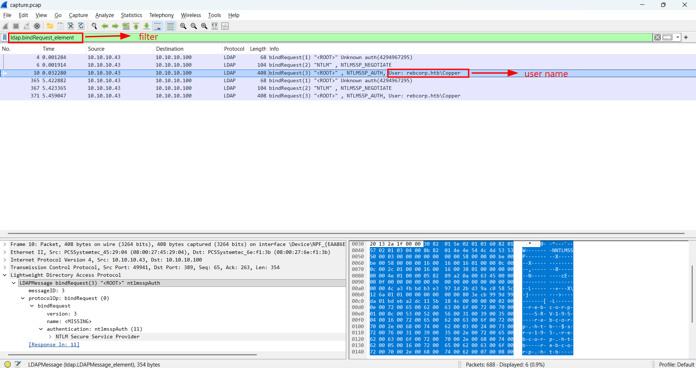
The answer is: `Copper`

* **The second question:** `What is the Distinguished Name (DN) of the Domain Controller? Don't put spaces between commas. (for example: CN=...,CN=...,DC=...,DC=...)`
    * When querying a domain, clients often ask the Root DSE (Directory Specific Entry) for server configuration. By tracing `SearchResEntry` packets which return domain information, I found the answer:

    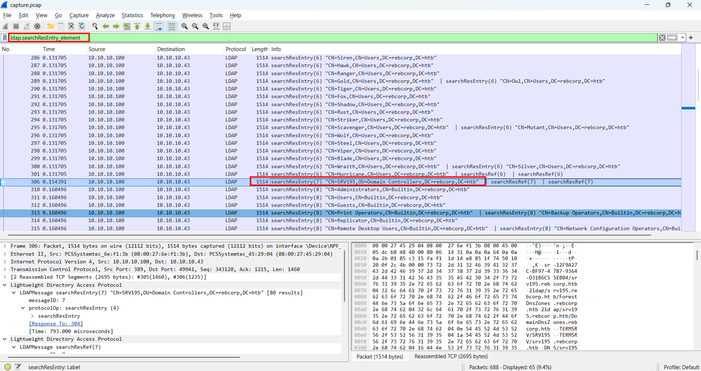

The answer is: `CN=SRV195,OU=Domain Controllers,DC=rebcorp,DC=htb`

* **The third question:** `Which is the Domain managed by the Domain Controller? (for example: corp.domain)`
    * This can be directly extracted from the Domain Components `DC` of the DN we found above.
    * Combining `DC=rebcorp` and `DC=htb`, we got `rebcorp.htb`

So the answer is: `rebcorp.htb`

* **The fourth question:** `How many failed login attempts are recorded on the user account named 'Ranger'? (for example: 6)`
    * Active Directory stores failed login attempts in the `badPwdCount` attribute. I filtered the traffic for responses containing Ranger's account details using `ldap.AttributeDescription == "badPwdCount"`.
    * Filtering for the user `Ranger`, the `badPwdCount` value was `14`.

    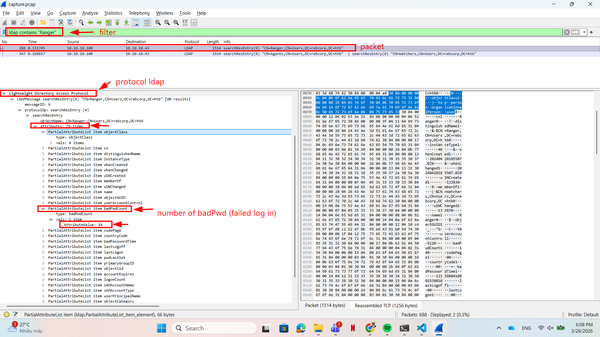 

So the answer is: `14`

* **The fifth question:** `Which LDAP query was executed to find all groups? (for example: (object=value))`
    * Since the question mentioned `find` command, I filtered for LDAP search requests using `ldap.searchRequest_element`. Looking through the queries made by the attacker, I found this one and only contains something about `group`:

    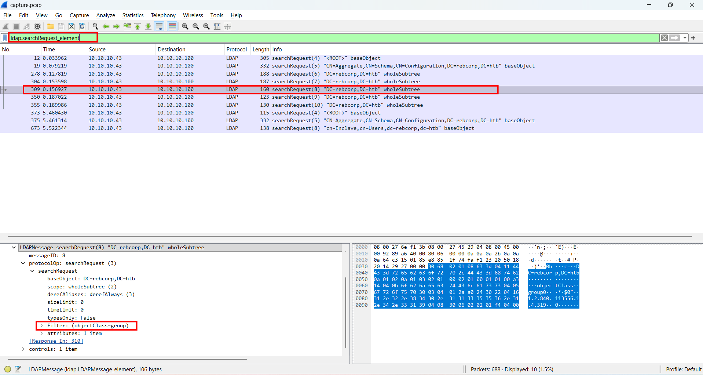
    

So the answer is: `(objectClass=group)`

* **The sixth question:** `How many non-standard groups exist? (for example: 1)`
   * By tracking the responses to the `(objectClass=group)` query, I needed to differentiate between default Windows groups and custom-created ones. In Active Directory, standard built-in groups such as Administrators,DnsUpdateProxy, ... are protected and tagged with the `isCriticalSystemObject` attribute set to `TRUE`. 
    * By expanding the `attributes` section inside the `searchResEntry` packets for the returned groups, I counted the one that lacked this property.  
    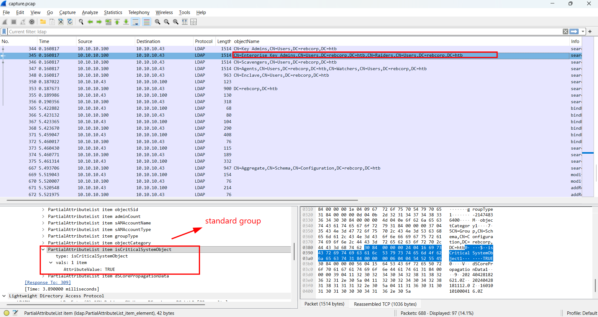
    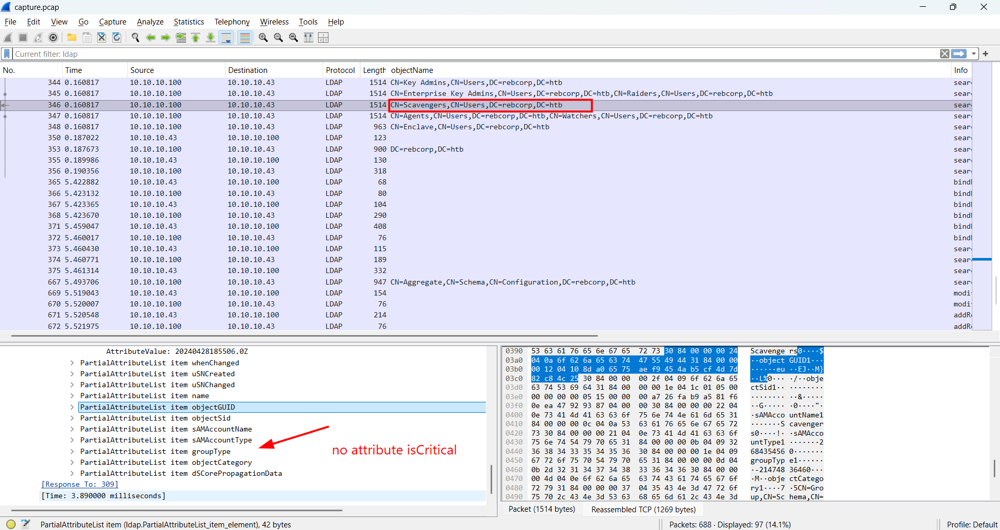
So the answer is: `5`

* **The seventh question:** `One of the non-standard users is flagged as 'disabled', which is it? (for example: username)`
    * In LDAP, an account's status is managed by the `userAccountControl` attribute. A disabled account typically has the `ACCOUNTDISABLE` flag set (e.g., a UAC value like 514). I examined the search responses for user objects and checked their UAC values.
     
    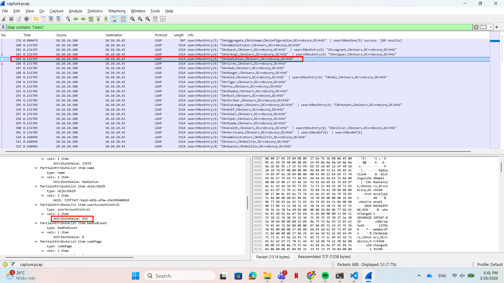

So the answer is: `Radiation`

* **The eighth question:** `The attacker targeted one user writing some data inside a specific field. Which is the field name? (for example: field_name)`
    * Writing data means the attacker sent an LDAP modify request. I filtered for this using `ldap.modifyRequest_element`. 
    * Inspecting the modification packet, the attacker targeted the attribute: `wWWHomePage`

    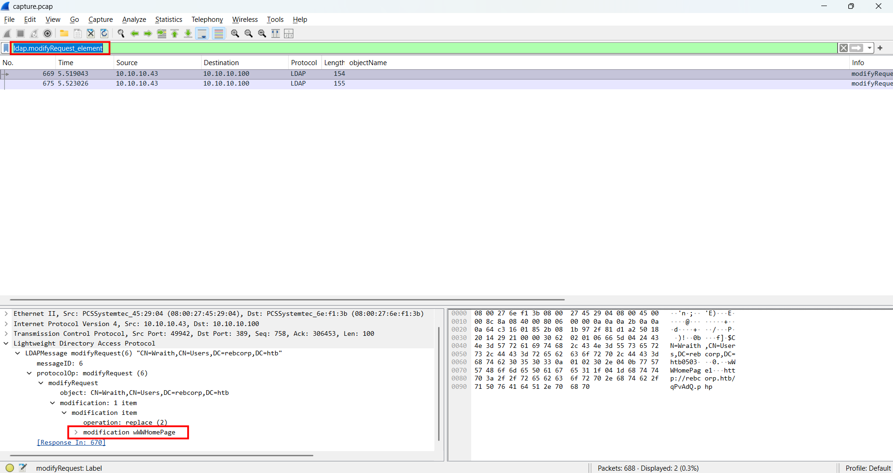

So the answer is: `wWWHomePage`

* **The ninth question:** `Which is the new value written in it? (for example: value123)`
    * Expanding the `modification` item within that exact same `modifyRequest` packet reveals the payload the attacker inserted.

So the answer is: `http://rebcorp.htb/qPvAdQ.php`

* **The tenth question:** `The attacker created a new user for persistence. Which is the username and the assigned group? Don't put spaces in the answer (for example: username,group)`
    * Creating a new user generates an LDAP add request. By filtering `ldap.addRequest_element`, I found an add Request for a user named `B4ck`. 
    * Subsequently, another modify request was sent to update a group's `member` attribute to include this new user. The modidified group was `Enclave`.

    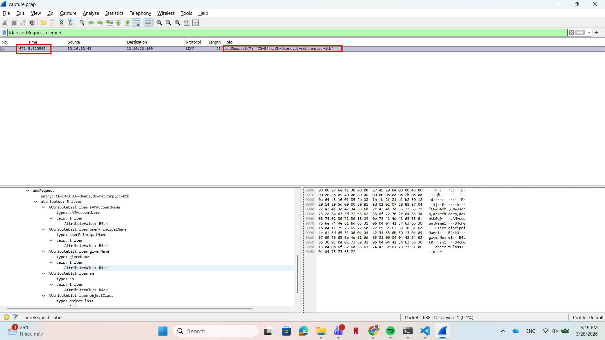
    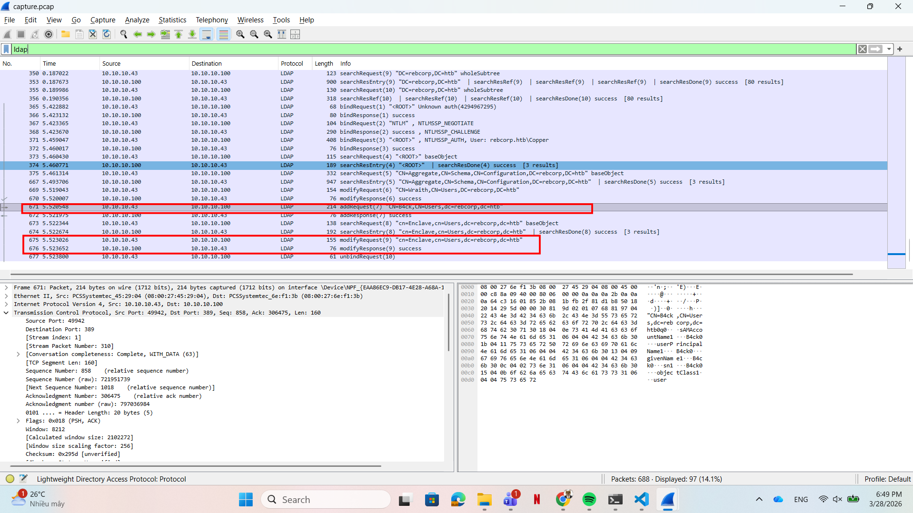

So the answer is: `B4ck,Enclave`

* **The eleventh question:** `The attacker obtained an hash for the user 'Hurricane' that has the UF_DONT_REQUIRE_PREAUTH flag set. Which is the correspondent plaintext for that hash?  (for example: plaintext_password)`
    * To understand this step, we need to understand a classic Active Directory attack called `AS-REP Roasting`.
    * By default, Kerberos requires `Pre-Authentication`. When a user requests a Ticket Granting Ticket (TGT), they must encrypt a timestamp with their password hash. However, if the UF_DONT_REQUIRE_PREAUTH flag is set which menas `Do not require Kerberos preauthentication`, anyone can request an AS-REQ (Authentication Service Request) on behalf of that user without knowing their password. The Domain Controller will respond with an AS-REP packet containing a piece of data encrypted with the user's password hash. The attacker can capture this packet, extract the hash, and crack it offline.
    * I filtered for Kerberos traffic targeting this user: `kerberos contains "Hurricane"`.
    
    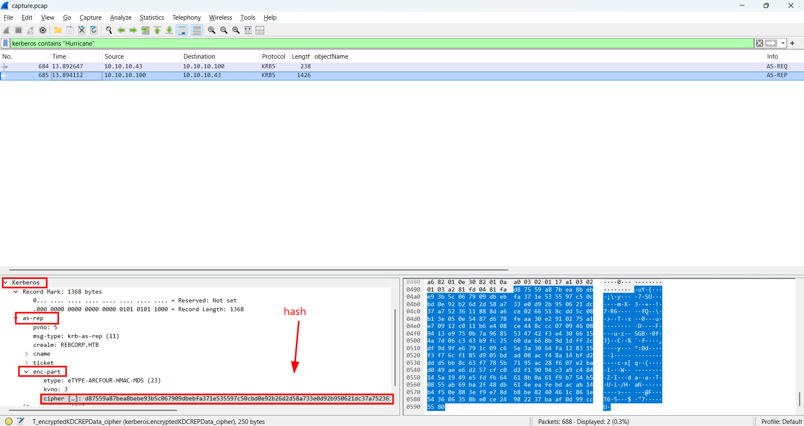

    * After locating the packet, I expanded the Kerberos tree  -> as-rep -> enc-part, I found the encrypted cipher text .
    * By extracting this ciphertext and formatting it into the standard Hashcat AS-REP format: `$krb5asrep$23$Hurricane@rebcorp.htb:<cipher>`, I saved it to a file named `hash.txt`. Finally, I used hashcat with rockyou.txt wordlist to crack the hash offline:

    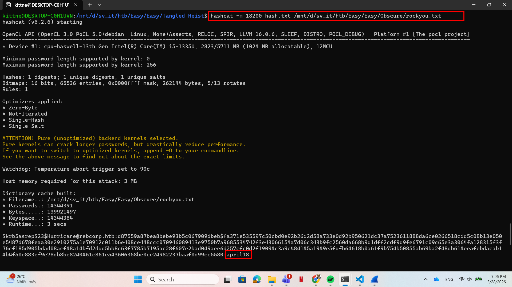

So the answer is: `april18`

```bash
+---------------+-----------------------------------------------------------------------------------------------------------------------------------------+
|     Title     |                                                               Description                                                               |
+---------------+-----------------------------------------------------------------------------------------------------------------------------------------+
| Tangled Heist |                          The survivors' group has meticulously planned the mission 'Tangled Heist' for months.                          |
|               |                                 In the desolate wasteland, what appears to be an abandoned facility is,                                 |
|               |                                             in reality, the headquarters of a rebel faction.                                            |
|               |                              This faction guards valuable data that could be useful in reaching the vault.                              |
|               |            Kaila, acting as an undercover agent, successfully infiltrates the facility using a rebel faction member's account           |
|               |                                 and gains access to a critical asset containing invaluable information.                                 |
|               | This data holds the key to both understanding the rebel faction's organization and advancing the survivors' mission to reach the vault. |
|               |                                                     Can you help her with this task?                                                    |
+---------------+-----------------------------------------------------------------------------------------------------------------------------------------+

[1/11] Which is the username of the compromised user used to conduct the attack? (for example: username)
> Copper
[+] Correct!

[2/11] What is the Distinguished Name (DN) of the Domain Controller? Don't put spaces between commas. (for example: CN=...,CN=...,DC=...,DC=...)
> CN=SRV195,OU=Domain Controllers,DC=rebcorp,DC=htb
[+] Correct!

[3/11] Which is the Domain managed by the Domain Controller? (for example: corp.domain)
> rebcorp.htb
[+] Correct!

[4/11] How many failed login attempts are recorded on the user account named 'Ranger'? (for example: 6)
> 14
[+] Correct!

[5/11] Which LDAP query was executed to find all groups? (for example: (object=value))
> (objectClass=group)
[+] Correct!

[6/11] How many non-standard groups exist? (for example: 1)
> 5
[+] Correct!

[7/11] One of the non-standard users is flagged as 'disabled', which is it? (for example: username)
> Radiation
[+] Correct!

[8/11] The attacker targeted one user writing some data inside a specific field. Which is the field name? (for example: field_name)
>   wWWHomePage
[+] Correct!

[9/11] Which is the new value written in it? (for example: value123)
> http://rebcorp.htb/qPvAdQ.php
[+] Correct!

[10/11] The attacker created a new user for persistence. Which is the username and the assigned group? Don't put spaces in the answer (for example: username,group)
>   B4ck,Enclave
[+] Correct!

[11/11] The attacker obtained an hash for the user 'Hurricane' that has the UF_DONT_REQUIRE_PREAUTH flag set. Which is the correspondent plaintext for that hash?  (for example: plaintext_password)
>  april18
[+] Correct!

[+] Here is the flag: HTB{1nf0rm4t10n_g4th3r3d_fr0m_ld4p_4nd_th3_w1r3!}
```

## 3. Solution ##
1. **Result:** The flag is `HTB{1nf0rm4t10n_g4th3r3d_fr0m_ld4p_4nd_th3_w1r3!}`


