# WRITE_UP #

## TRUE SECRETS ##

### 1. Analysis ###
* **Given:** a memory dump file named `TrueSecrets.raw`.
* **Description:** Our cybercrime unit has been investigating a well-known APT group for several months. The group has been responsible for several high-profile attacks on corporate organizations. However, what is interesting about that case, is that they have developed a custom command & control server of their own. Fortunately, our unit was able to raid the home of the leader of the APT group and take a memory capture of his computer while it was still powered on. Analyze the capture to try to find the source code of the server.
* **Hints:**   
    * No hints are given 

### 2. Investigation ###
#### TRUE SECRETS ####
We were given a memory dump, let's use `Volatility` to analyze it. 
  * **Note:** The version I use in this challenge is Volatility 3.

Initially, I ran `windows.psscan` to scan the processes' traces: 

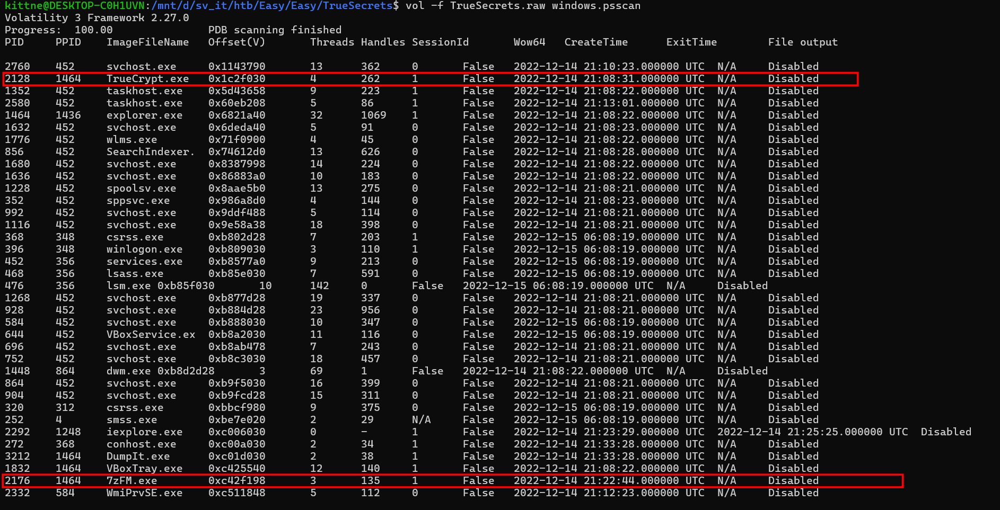 

As you can see, there are 2 processes that catch my eye: `TrueCrypt.exe` and `7zFM.exe`. First, let's focus on the `7z` one to see what zip file the attacker wants to extract. I use the command  `windows.cmdline`:

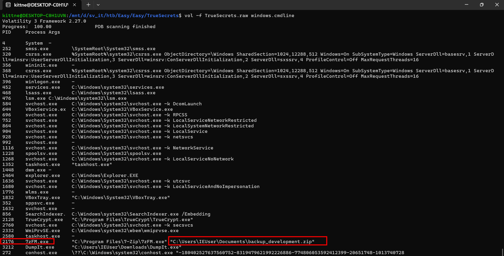

We can see the attacker uses `7z` to extract a suspicious file name `backup_development.zip`. Here I ran the command `windows.filescan` combine with `grep` to take the `Offset` of this file: 

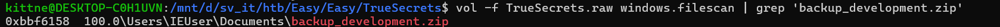

After identifying the offset, we can dump this file to our machine to investigate further. I used `--virtaddr` but it gave me nothing, then I switched to `--physaddr` and extracted the file successfully:

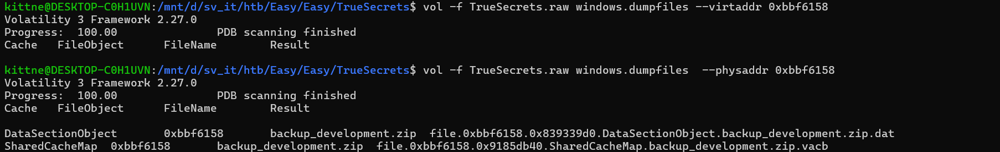

We can delete the cache file, then rename the other one by deleting the extension `data` to get `backup_development.zip`. After unzipping it, we got a file named `development.tc`. The extension `.tc` of the file told us this is a file created by `TrueCrypt`, which matches the result why it appeared after psscan command.

Doing some research about TrueCrypt, this program allows us to create virtual encrypted disk. Moreover it uses strong ecryption method such as AES-256, ...

I installed TrueCrypt, then tried to upload the file `development.tc`. However it requires a password: 

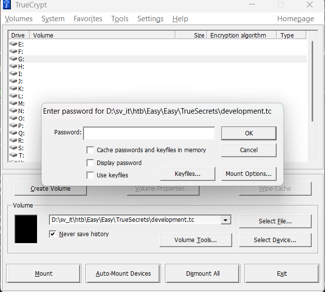

Since I only had the raw dump, I did go for a research and confirmed that TrueCrypt store unencrypted password in the RAM if it is mounted, you can check for this link: [Memory Dump Files](https://www.truecrypt.org/docs/memory-dump-files):

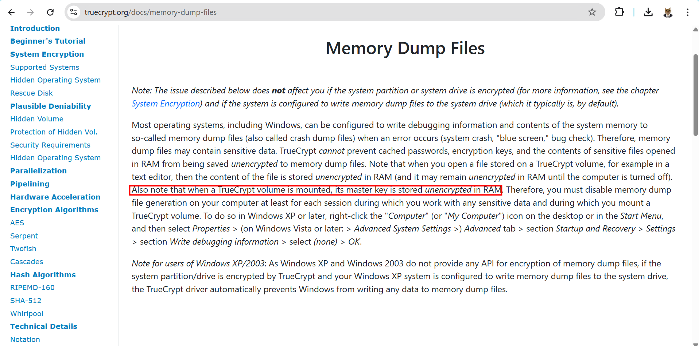

So you can extract the TrueCrypt password with `windows.truecrypt.Passphrase`:

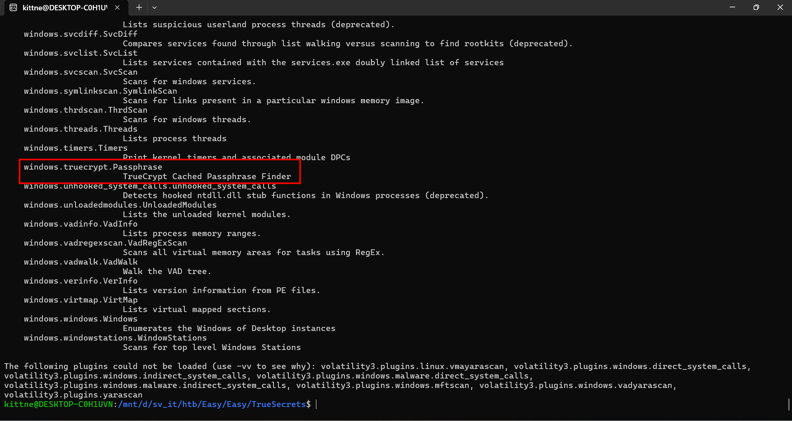

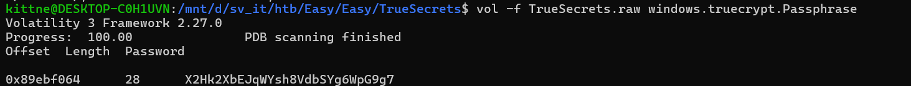

Using the password `X2Hk2XbEJqWYsh8VdbSYg6WpG9g7` we just got to open the `tc` file, we can finally mount the disk to our machine:

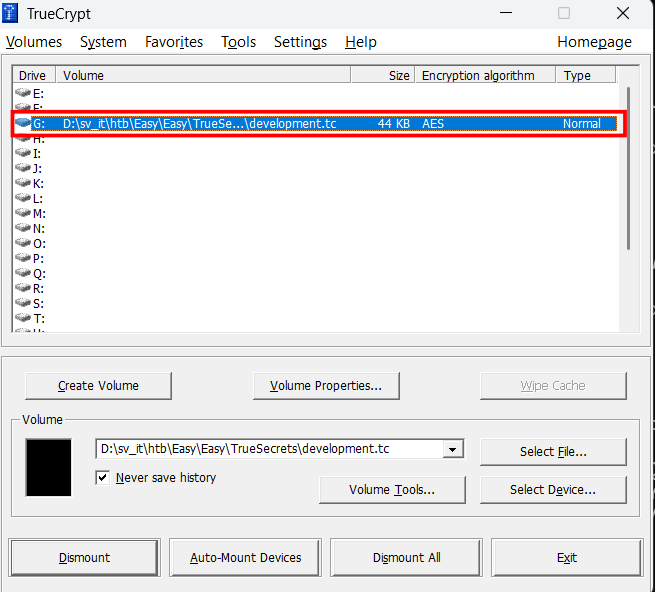

Inside the disk is a `C#` script and a folder name `sessions`:
```c#
using System;
using System.IO;
using System.Net;
using System.Net.Sockets;
using System.Text;
using System.Security.Cryptography;

class AgentServer {
  
    static void Main(String[] args)
    {
        var localPort = 40001;
        IPAddress localAddress = IPAddress.Any;
        TcpListener listener = new TcpListener(localAddress, localPort);
        listener.Start();
        Console.WriteLine("Waiting for remote connection from remote agents (infected machines)...");
    
        TcpClient client = listener.AcceptTcpClient();
        Console.WriteLine("Received remote connection");
        NetworkStream cStream = client.GetStream();
    
        string sessionID = Guid.NewGuid().ToString();
    
        while (true)
        {
            string cmd = Console.ReadLine();
            byte[] cmdBytes = Encoding.UTF8.GetBytes(cmd);
            cStream.Write(cmdBytes, 0, cmdBytes.Length);
            
            byte[] buffer = new byte[client.ReceiveBufferSize];
            int bytesRead = cStream.Read(buffer, 0, client.ReceiveBufferSize);
            string cmdOut = Encoding.ASCII.GetString(buffer, 0, bytesRead);
            
            string sessionFile = sessionID + ".log.enc";
            File.AppendAllText(@"sessions\" + sessionFile, 
                Encrypt(
                    "Cmd: " + cmd + Environment.NewLine + cmdOut
                ) + Environment.NewLine
            );
        }
    }
    
    private static string Encrypt(string pt)
    {
        string key = "AKaPdSgV";
        string iv = "QeThWmYq";
        byte[] keyBytes = Encoding.UTF8.GetBytes(key);
        byte[] ivBytes = Encoding.UTF8.GetBytes(iv);
        byte[] inputBytes = System.Text.Encoding.UTF8.GetBytes(pt);
        
        using (DESCryptoServiceProvider dsp = new DESCryptoServiceProvider())
        {
            var mstr = new MemoryStream();
            var crystr = new CryptoStream(mstr, dsp.CreateEncryptor(keyBytes, ivBytes), CryptoStreamMode.Write);
            crystr.Write(inputBytes, 0, inputBytes.Length);
            crystr.FlushFinalBlock();
            return Convert.ToBase64String(mstr.ToArray());
        }
    }
}
```
I entirely focused on the `Encrypt` function. It uses an old encrypt method which is `DES`, the attacker also assigns the `key` = AKaPdSgV and `iv` = QeThWmYq hardcoded in the code. After encrypting the payloads this function converts them to base64 strings.

In the `Main` function, when victim establishes a connection, it generates a session ID and creates a `.log.enc` file to save the encrypted commands and outputs. 

In the `sessions` folder we find 3 files like that, so now we need to use `strings` with 3 `.log.enc` to get the encoded payload:

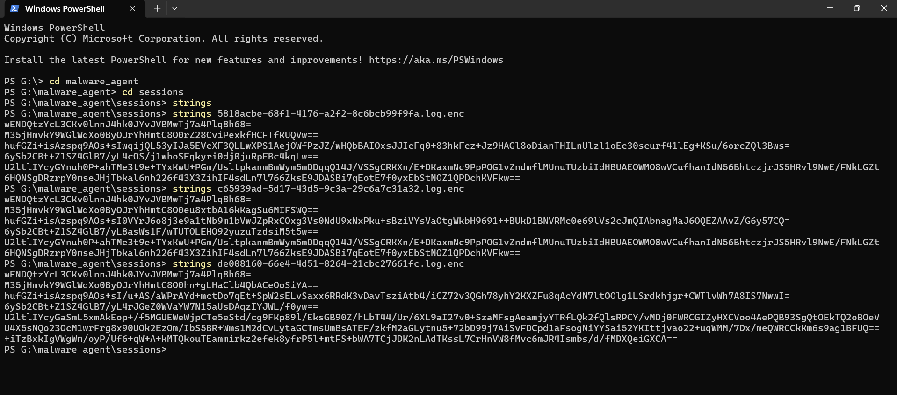

Using CyberChef with the right recipe we should easily get the decoded payload:

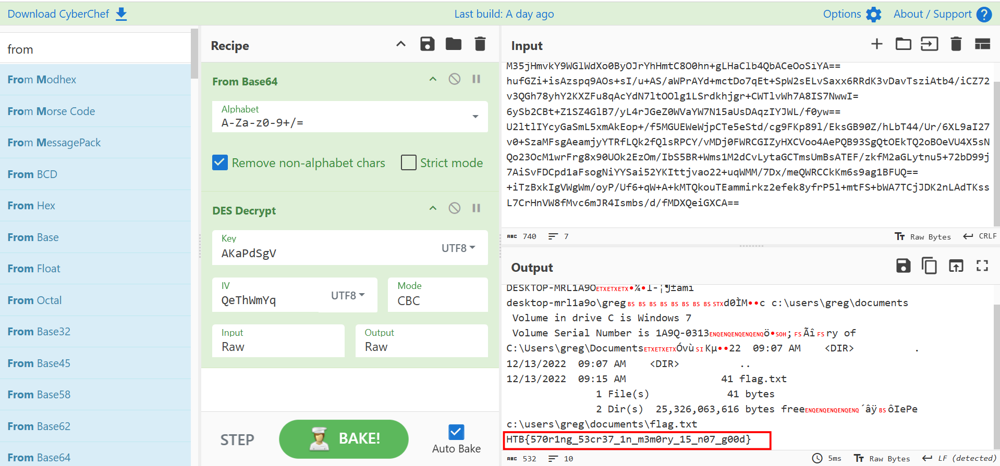

### 3. Solution ###
1. **Result:** The flag is `HTB{570r1ng_53cr37_1n_m3m0ry_15_n07_g00d}`


