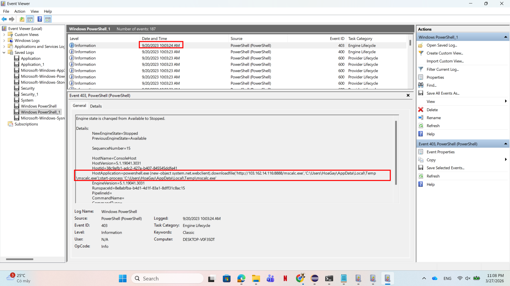
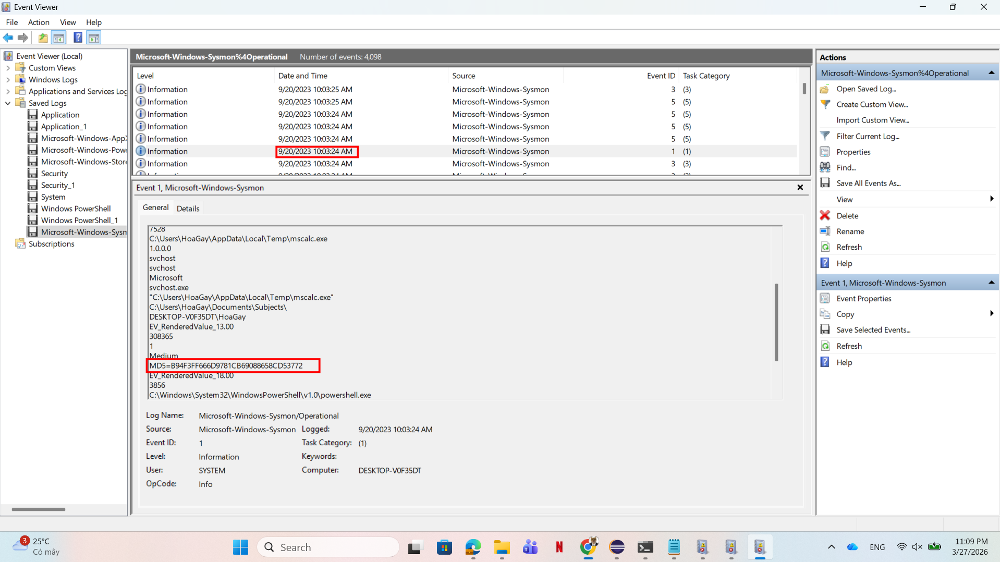
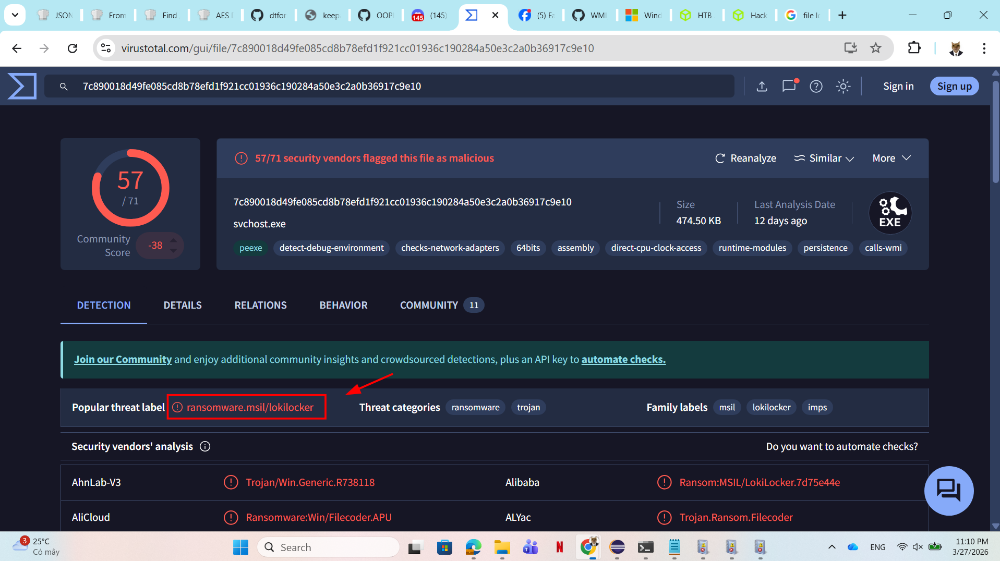
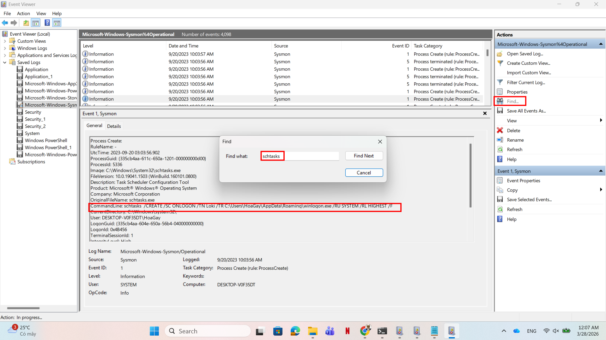
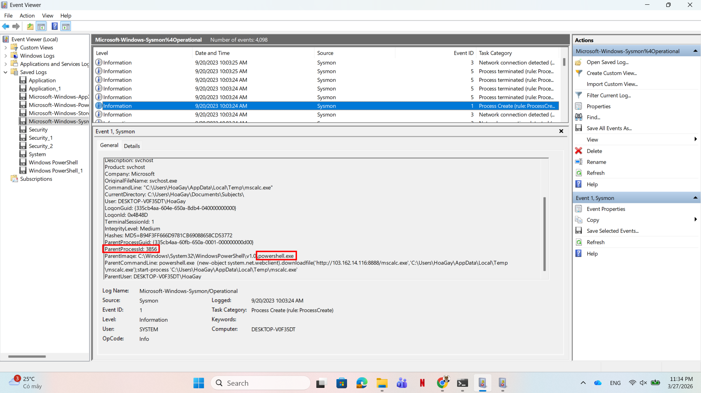
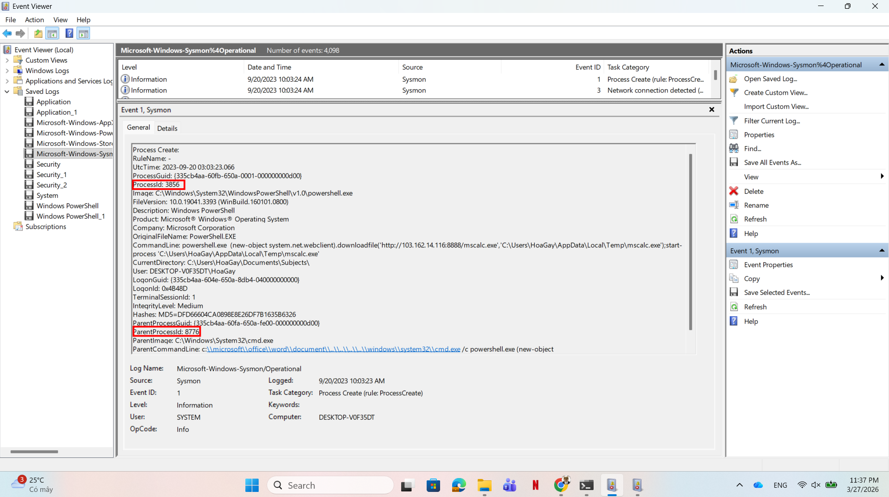
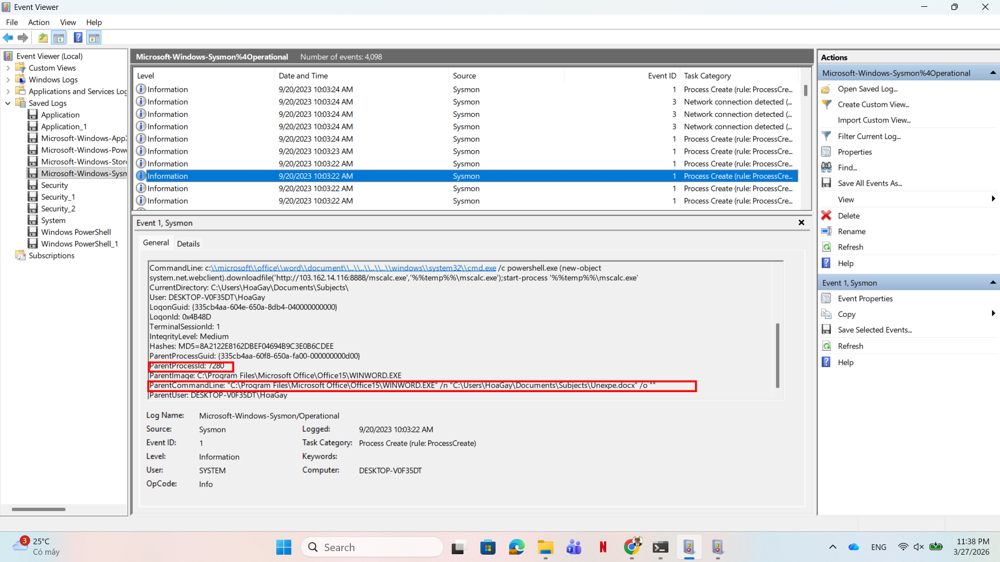
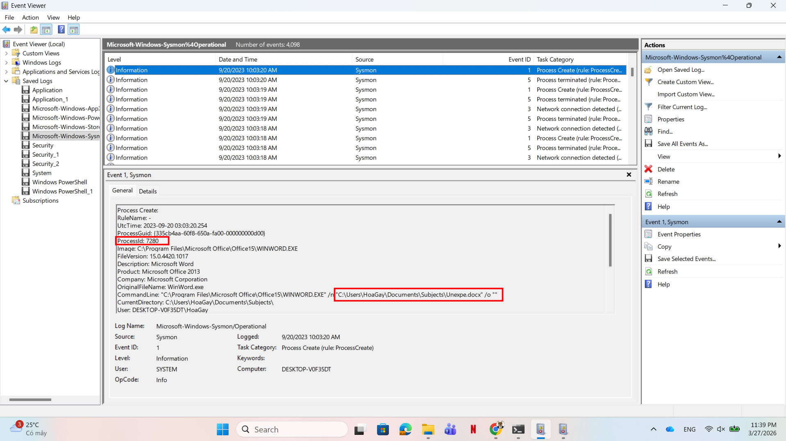

# WRITE_UP #

## Valhalloween ##

### 1. Analysis ###
* **Given:** the `Log` folder of a machine
* **Description:** As I was walking the neighbor's streets for some Trick-or-Treat, a strange man approached me, saying he was dressed as "The God of Mischief!". He handed me some candy and disappeared. Among the candy bars was a USB in disguise, and when I plugged it into my computer, all my files were corrupted! First, spawn the haunted Docker instance and connect to it! Dig through the horrors that lie in the given Logs and answer whatever questions are asked of you!     
* **Hints:**   
    * No hints are given 

### 2. Investigation ###
#### RAGNAROK IS COMINGGG ####
* **The first question:** `What are the IP address and port of the server from which the malicious actors downloaded the ransomware? (for example: 98.76.54.32:443)`
    * Using `Windows PowerShell` logs, in an Event ID `403`, we can easily detect the IP and port of the server. Moreover, we can determine the time of the download which is `9/20/2023 10:03:24AM`:

     

The answer is: `103.162.14.116:8888`

* **The second question:** `According to the sysmon logs, what is the MD5 hash of the ransomware? (for example: 6ab0e507bcc2fad463959aa8be2d782f)`
    * This time the question tells us to use the `sysmon logs` so let's use it. You may want to install `Sysmon` to read more detailed information of this log: [Sysmon](https://learn.microsoft.com/en-us/sysinternals/downloads/sysmon).
    * Cross-referencing to the time we found in the previous question, we can easily find the MD5 hash of the ransomware in Event ID `1`:
    
    

The answer is: `B94F3FF666D9781CB69088658CD53772`

* **The third question:** `Based on the hash found, determine the family label of the ransomware in the wild from online reports such as Virus Total, Hybrid Analysis, etc. (for example: wannacry)`
    * Using that hash to drop on `VirusTotal`, you will easily get the answer:

    

So the answer is: `lokilocker`

* **The fourth question:** `What is the name of the task scheduled by the ransomware? (for example: WindowsUpdater)`
    * Normally, we will find this information in `TaskScheduler` logs and find where the `schtasks.exe` being used. 
    * However, in this challenge, that log is empty, so we need to check another log. I was thinking about Sysmon, so I reopened the logs, use `Find` to search for `schtasks`:

    

    * We can easily see that the `TN - Task Name` is Loki 

So the answer is: `Loki`

* **The fifth question:** `What are the parent process name and ID of the ransomware process?`
  * Return to the timestamp we mentioned before, we should find this information:

    

So the answer is: `powershell.exe_3856`

* **The sixth question:** `Following the PPID, provide the file path of the initial stage in the infection chain. (for example: D:\Data\KCorp\FirstStage.pdf)`
    * Still focus on that event, we can trace all the way back to its ancestor event:
    
    
    

So the answer is: `C:\Users\HoaGay\Documents\Subjects\Unexpe.docx`

* **The seventh question:** `When was the first file in the infection chain opened (in UTC)? (for example: 1975-04-30_12:34:56)`
    * After identifying the event in the previous question, this should be easy.
    * However, `Event Viewer` will adjust the time based on your zone, so make sure to change to the `UTC` zone time before answer.

So the answer is: `2023-09-20_03:03:20`

```bash
kittne@DESKTOP-C0H1UVN:/mnt/d/sv_it/htb/Easy/Easy/Valhalloween$ nc 154.57.164.70 32275

+--------------+--------------------------------------------------------------------------------------+
|    Title     |                                     Description                                      |
+--------------+--------------------------------------------------------------------------------------+
| Valhalloween |           As I was walking the neighbor's streets for some Trick-or-Treat,           |
|              |    a strange man approached me, saying he was dressed as "The God of Mischief!".     |
|              | He handed me some candy and disappeared. Among the candy bars was a USB in disguise, |
|              |         and when I plugged it into my computer, all my files were corrupted!         |
|              |             First, spawn the haunted Docker instance and connect to it!              |
|              |                  Dig through the horrors that lie in the given Logs                  |
|              |                   and answer whatever questions are asked of you!                    |
+--------------+--------------------------------------------------------------------------------------+

What are the IP address and port of the server from which the malicious actors downloaded the ransomware? (for example: 98.76.54.32:443)
> 103.162.14.116:8888
[+] Correct!

According to the sysmon logs, what is the MD5 hash of the ransomware? (for example: 6ab0e507bcc2fad463959aa8be2d782f)
> B94F3FF666D9781CB69088658CD53772
[+] Correct!

Based on the hash found, determine the family label of the ransomware in the wild from online reports such as Virus Total, Hybrid Analysis, etc. (for example: wannacry)
> lokilocker
[+] Correct!

What is the name of the task scheduled by the ransomware? (for example: WindowsUpdater)
> svchost
[-] Wrong Answer.
What is the name of the task scheduled by the ransomware? (for example: WindowsUpdater)

> Loki
[+] Correct!

What are the parent process name and ID of the ransomware process? (for example: svchost.exe_4953)
> powershell.exe_3856
[-] Wrong Answer.
What are the parent process name and ID of the ransomware process? (for example: svchost.exe_4953)

> powershell.exe_3856
[+] Correct!

Following the PPID, provide the file path of the initial stage in the infection chain. (for example: D:\Data\KCorp\FirstStage.pdf)
> C:\Users\HoaGay\Documents\Subjects\Unexpe.docx
[+] Correct!

When was the first file in the infection chain opened (in UTC)? (for example: 1975-04-30_12:34:56)
> 2023-09-20_03:03_20
[-] Wrong Answer.
When was the first file in the infection chain opened (in UTC)? (for example: 1975-04-30_12:34:56)

> 2023-09-20_03:03:20
[+] Correct!

[+] Here is the flag: HTB{l0k1_R4ns0mw4r3_w4s_n0t_sc4ry_en0ugh}
```

## 3. Solution ##
1. **Result:** The flag is `HTB{l0k1_R4ns0mw4r3_w4s_n0t_sc4ry_en0ugh}`


