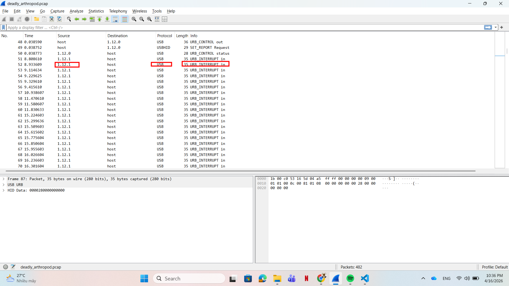
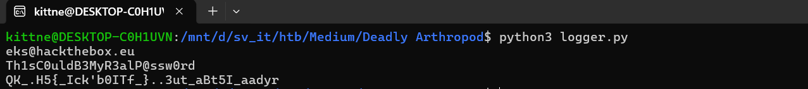
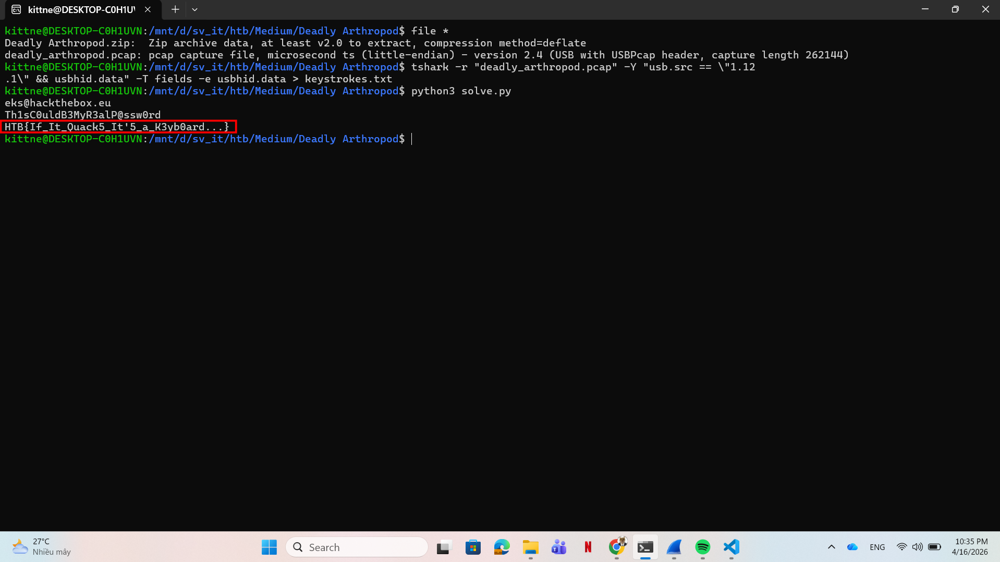

# WRITE_UP #

## DEADLY ARTHROPOD ##

### 1. Analysis ###
* **Given:** a pcap file named `deadly_arthropod.pcap`
* **Description:** Our operatives have intercepted critical information. Origin? Classified. <br>Objective: Retrieve the flag!
* **Hints:**   
    * No hints are given

### 2. Investigation ###
First, I used `Wireshark` to open the pcap file, looked through its data, I saw the protocol used is USB, so there's another HTB challenge I've done also give me a pcap file of USB protocol named `Logger`, so that helped me alot, however let's get back to this challenge.

There is only one main source which is `1.12.1`. The frame length sent from it is `35`, after some investigations I knew that the data was sent from keyboard. 



Basically, the USB URB Header often occupies a fixed size of 27 bytes, by applying the formula: `Payload Size = Frame Length - Header Size`, I broke down the traffic from `1.12.1`:
  * Frame Length: 35 bytes. 
  * Payload: $35 - 27 = 8$ bytes.   
    
An 8-byte payload corresponds perfectly to the standard USB HID Keyboard Report format (1 byte for modifiers, 1 reserved byte, and 6 bytes for keycodes).

Since the flag is a text string, it must have been typed via the keyboard. Therefore, I focused my efforts solely on the data from source `1.12.1`.

First, I used a `tshark` command to extract all the HID data sent from source `1.12.1` and saved in a file name `keystrokes.txt`.
```bash
tshark -r "keystrokes.pcapng" -Y "usb.src == \"1.12.1\" && usbhid.data" -T fields -e usbhid.data > keystrokes.txt
```

After getting the data, I wrote a python script to decode the hex data to readable ASCII characte here the code I copied from `Logger`, let's see if that solves me this challenge:

```python
lcasekey = {}
ucasekey = {}

# mapping
lcasekey[4]="a";   ucasekey[4]="A"
lcasekey[5]="b";   ucasekey[5]="B"
lcasekey[6]="c";   ucasekey[6]="C"
lcasekey[7]="d";   ucasekey[7]="D"
lcasekey[8]="e";   ucasekey[8]="E"
lcasekey[9]="f";   ucasekey[9]="F"
lcasekey[10]="g";  ucasekey[10]="G"
lcasekey[11]="h";  ucasekey[11]="H"
lcasekey[12]="i";  ucasekey[12]="I"
lcasekey[13]="j";  ucasekey[13]="J"
lcasekey[14]="k";  ucasekey[14]="K"
lcasekey[15]="l";  ucasekey[15]="L"
lcasekey[16]="m";  ucasekey[16]="M"
lcasekey[17]="n";  ucasekey[17]="N"
lcasekey[18]="o";  ucasekey[18]="O"
lcasekey[19]="p";  ucasekey[19]="P"
lcasekey[20]="q";  ucasekey[20]="Q"
lcasekey[21]="r";  ucasekey[21]="R"
lcasekey[22]="s";  ucasekey[22]="S"
lcasekey[23]="t";  ucasekey[23]="T"
lcasekey[24]="u";  ucasekey[24]="U"
lcasekey[25]="v";  ucasekey[25]="V"
lcasekey[26]="w";  ucasekey[26]="W"
lcasekey[27]="x";  ucasekey[27]="X"
lcasekey[28]="y";  ucasekey[28]="Y"
lcasekey[29]="z";  ucasekey[29]="Z"
lcasekey[30]="1";  ucasekey[30]="!"
lcasekey[31]="2";  ucasekey[31]="@"
lcasekey[32]="3";  ucasekey[32]="#"
lcasekey[33]="4";  ucasekey[33]="$"
lcasekey[34]="5";  ucasekey[34]="%"
lcasekey[35]="6";  ucasekey[35]="^"
lcasekey[36]="7";  ucasekey[36]="&"
lcasekey[37]="8";  ucasekey[37]="*"
lcasekey[38]="9";  ucasekey[38]="("
lcasekey[39]="0";  ucasekey[39]=")"
lcasekey[40]="\n"; ucasekey[40]="\n" 
lcasekey[44]=" ";  ucasekey[44]=" " 
lcasekey[45]="-";  ucasekey[45]="_"
lcasekey[46]="=";  ucasekey[46]="+"
lcasekey[47]="[";  ucasekey[47]="{"
lcasekey[48]="]";  ucasekey[48]="}"
lcasekey[49]="\\"; ucasekey[49]="|"
lcasekey[51]=";";  ucasekey[51]=":"
lcasekey[52]="'";  ucasekey[52]="\""
lcasekey[53]="`";  ucasekey[53]="~"
lcasekey[54]=",";  ucasekey[54]="<"
lcasekey[55]=".";  ucasekey[55]=">"
lcasekey[56]="/";  ucasekey[56]="?"
lcasekey[89]="1";  ucasekey[89]="1"
lcasekey[90]="2";  ucasekey[90]="2"
lcasekey[91]="3";  ucasekey[91]="3"
lcasekey[92]="4";  ucasekey[92]="4"
lcasekey[93]="5";  ucasekey[93]="5"
lcasekey[94]="6";  ucasekey[94]="6"
lcasekey[95]="7";  ucasekey[95]="7"
lcasekey[96]="8";  ucasekey[96]="8"
lcasekey[97]="9";  ucasekey[97]="9"
lcasekey[98]="0";  ucasekey[98]="0"
lcasekey[99]=".";  ucasekey[99]="."

caps_lock_on = False
output_chars = [] 
cursor = 0       

try:
    with open("keystrokes.txt", 'r') as keycodes:
        for line in keycodes:
            line = line.strip()
            try:
                bytesArray = bytearray.fromhex(line)
                modifier = bytesArray[0]
                val = int(bytesArray[2])

                if val == 0: continue
                
                # Handle capslock
                if val == 57: 
                    caps_lock_on = not caps_lock_on
                    continue

                shift_pressed = (modifier == 0x02) or (modifier == 0x20)
                output_char = ""
                
                if val in lcasekey:
                    if shift_pressed:
                         output_char = ucasekey[val]
                    elif caps_lock_on and lcasekey[val].isalpha():
                         output_char = ucasekey[val]
                    else:
                         output_char = lcasekey[val]
                
                if output_char:
                    output_chars.insert(cursor, output_char)
                    cursor += 1

            except ValueError:
                continue
    print("".join(output_chars))

except FileNotFoundError:
    print(f"File keystrokes.txt not found")
```



Apparently, there's a string contains flag format `HTB{...}`, however it's not arranged well, why this? So let's take a look back at our pythons script, there's a critical mistake: I did not handle the cursor address. When typing a keyboard, we can use left arrow or right arrow to move the cursor back or forward to type in exactly index. 

Acknowledging the mistake, let's fix this with the pro max version:
```python
lcasekey = {}
ucasekey = {}

# mapping
lcasekey[4]="a";   ucasekey[4]="A"
lcasekey[5]="b";   ucasekey[5]="B"
lcasekey[6]="c";   ucasekey[6]="C"
lcasekey[7]="d";   ucasekey[7]="D"
lcasekey[8]="e";   ucasekey[8]="E"
lcasekey[9]="f";   ucasekey[9]="F"
lcasekey[10]="g";  ucasekey[10]="G"
lcasekey[11]="h";  ucasekey[11]="H"
lcasekey[12]="i";  ucasekey[12]="I"
lcasekey[13]="j";  ucasekey[13]="J"
lcasekey[14]="k";  ucasekey[14]="K"
lcasekey[15]="l";  ucasekey[15]="L"
lcasekey[16]="m";  ucasekey[16]="M"
lcasekey[17]="n";  ucasekey[17]="N"
lcasekey[18]="o";  ucasekey[18]="O"
lcasekey[19]="p";  ucasekey[19]="P"
lcasekey[20]="q";  ucasekey[20]="Q"
lcasekey[21]="r";  ucasekey[21]="R"
lcasekey[22]="s";  ucasekey[22]="S"
lcasekey[23]="t";  ucasekey[23]="T"
lcasekey[24]="u";  ucasekey[24]="U"
lcasekey[25]="v";  ucasekey[25]="V"
lcasekey[26]="w";  ucasekey[26]="W"
lcasekey[27]="x";  ucasekey[27]="X"
lcasekey[28]="y";  ucasekey[28]="Y"
lcasekey[29]="z";  ucasekey[29]="Z"
lcasekey[30]="1";  ucasekey[30]="!"
lcasekey[31]="2";  ucasekey[31]="@"
lcasekey[32]="3";  ucasekey[32]="#"
lcasekey[33]="4";  ucasekey[33]="$"
lcasekey[34]="5";  ucasekey[34]="%"
lcasekey[35]="6";  ucasekey[35]="^"
lcasekey[36]="7";  ucasekey[36]="&"
lcasekey[37]="8";  ucasekey[37]="*"
lcasekey[38]="9";  ucasekey[38]="("
lcasekey[39]="0";  ucasekey[39]=")"
lcasekey[40]="\n"; ucasekey[40]="\n" 
lcasekey[44]=" ";  ucasekey[44]=" " 
lcasekey[45]="-";  ucasekey[45]="_"
lcasekey[46]="=";  ucasekey[46]="+"
lcasekey[47]="[";  ucasekey[47]="{"
lcasekey[48]="]";  ucasekey[48]="}"
lcasekey[49]="\\"; ucasekey[49]="|"
lcasekey[51]=";";  ucasekey[51]=":"
lcasekey[52]="'";  ucasekey[52]="\""
lcasekey[53]="`";  ucasekey[53]="~"
lcasekey[54]=",";  ucasekey[54]="<"
lcasekey[55]=".";  ucasekey[55]=">"
lcasekey[56]="/";  ucasekey[56]="?"
lcasekey[89]="1";  ucasekey[89]="1"
lcasekey[90]="2";  ucasekey[90]="2"
lcasekey[91]="3";  ucasekey[91]="3"
lcasekey[92]="4";  ucasekey[92]="4"
lcasekey[93]="5";  ucasekey[93]="5"
lcasekey[94]="6";  ucasekey[94]="6"
lcasekey[95]="7";  ucasekey[95]="7"
lcasekey[96]="8";  ucasekey[96]="8"
lcasekey[97]="9";  ucasekey[97]="9"
lcasekey[98]="0";  ucasekey[98]="0"
lcasekey[99]=".";  ucasekey[99]="."

caps_lock_on = False
output_chars = [] 
cursor = 0       

try:
    with open("keystrokes.txt", 'r') as keycodes:
        for line in keycodes:
            line = line.strip()
            try:
                bytesArray = bytearray.fromhex(line)
                modifier = bytesArray[0]
                val = int(bytesArray[2])

                if val == 0: continue
                
                # 1. CapsLock
                if val == 57: 
                    caps_lock_on = not caps_lock_on
                    continue 

                # 2. Arrow & Backspace
                # Left Arrow (80): Move the cursor back
                if val == 80:
                    cursor = max(0, cursor - 1)
                    continue
                
                # Right Arrow (79): Move the cursor forward
                if val == 79:
                    cursor = min(len(output_chars), cursor + 1)
                    continue
                
                # Backspace (42): Delete the character in front of the cursor
                if val == 42:
                    if cursor > 0:
                        output_chars.pop(cursor - 1)
                        cursor -= 1
                    continue

                if val in [41, 43, 81, 82]: # ESC, TAB, UP, DOWN
                    continue

                shift_pressed = (modifier == 0x02) or (modifier == 0x20)
                output_char = ""
                
                if val in lcasekey:
                    if shift_pressed:
                         output_char = ucasekey[val]
                    elif caps_lock_on and lcasekey[val].isalpha():
                         output_char = ucasekey[val]
                    else:
                         output_char = lcasekey[val]
                
                if output_char:
                    output_chars.insert(cursor, output_char)
                    cursor += 1

            except ValueError:
                continue
    print("".join(output_chars))

except FileNotFoundError:
    print(f"file keystrokes.txt not found")
```



### 3. Solution ###
1. **Result:** The flag is `HTB{If_It_Quack5_It'5_a_K3yb0ard...}`
