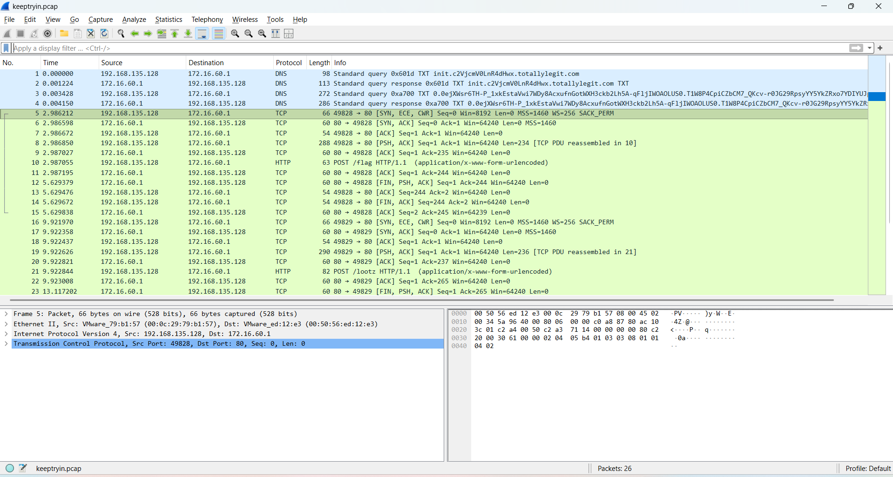
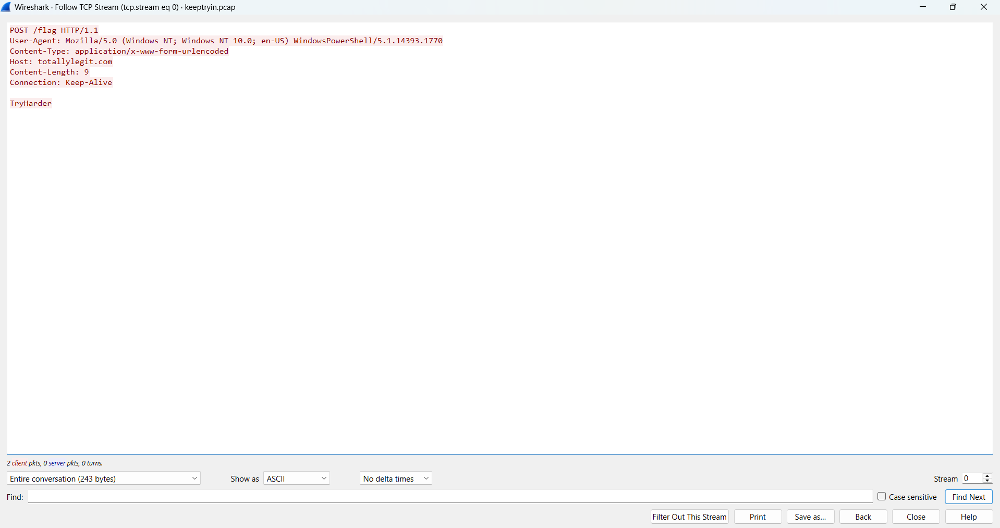
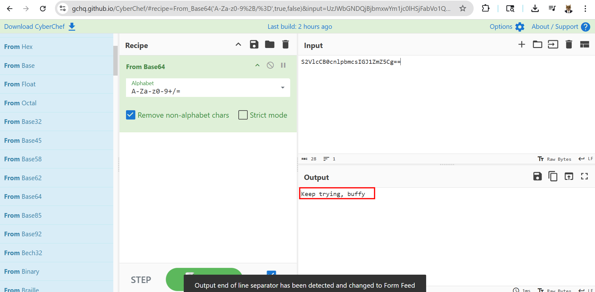
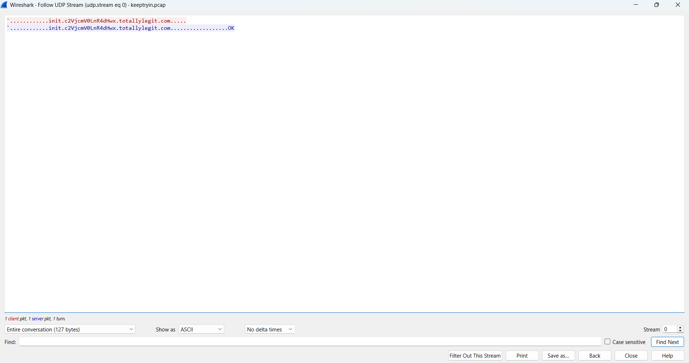
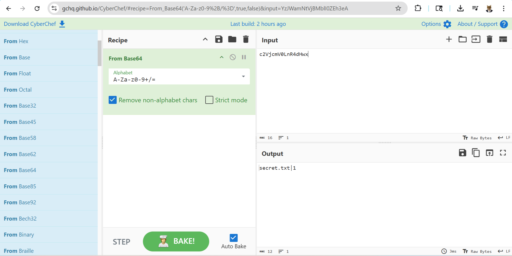
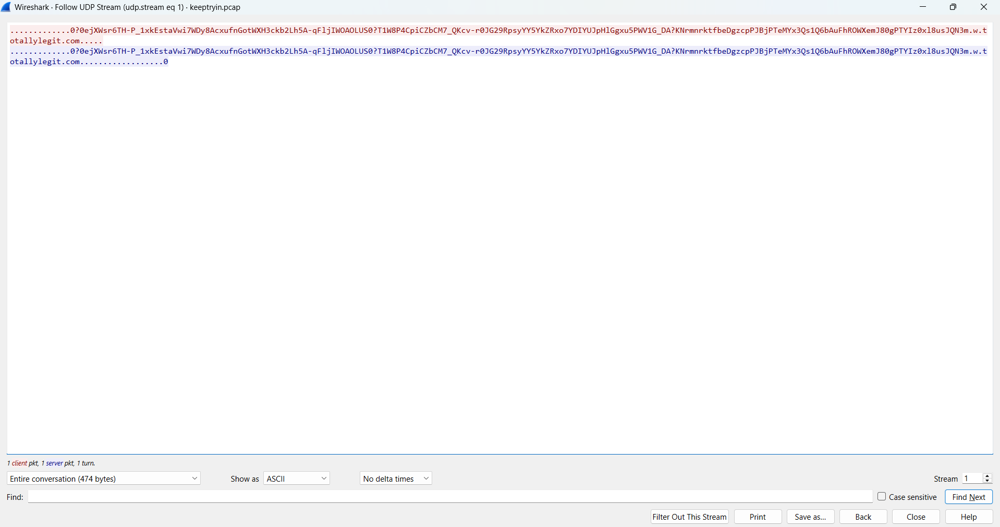
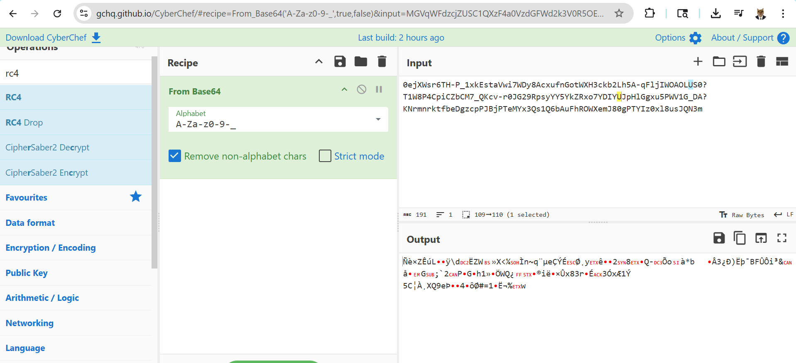
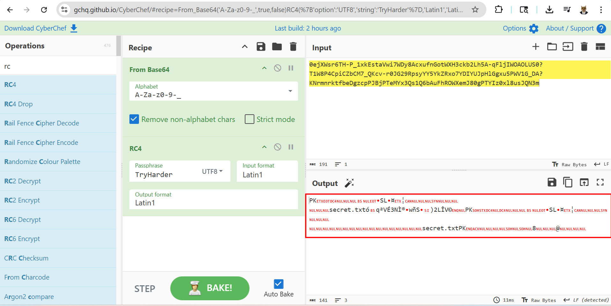

# WRITE_UP #

## KEEP TRYIN_ ##

### 1. Analysis ###
* **Given:** a pcap file named `keeptryin.pcap`
* **Description:** This packet capture seems to show some suspicious traffic
* **Hints:**   
    * No hints are given

### 2. Investigation ###
The `pcap` file given is quite small, with only 26 packets captured. 4 of them are DNS protocol while the others are TCP/HTTP:

    
Apparently, there's a POST request contains a file named `flag`, follow the stream to see the payload but that's only an encouragement `TryHarder`:

The next TCP stream is also a POST request, the payload is a base64 encoded strings, decode it give me nothing but a red herring:

And that's also the last TCP stream, so all I had left was DNS stream, let's investigate it. The first stream was quite simple:

Another base64 string, decoded it give me something more helpful than the TCP stream:

The artifact mentions something about `secret.txt`, which of course I couldn't find yet, and a number `1` behind a pipeline. At first, this reminded me about **ADS** - `Alternative Data Stream` , a feature allows user to attach or hide information to a normal file for defense evasion. 

But two files I found above didn't have any ADS, so I return back to the DNS stream 1:

Now the DNS querry is quite longer than the first packet, so maybe it hides something. The domain looked like base64 encoded string, so I first decoded it, however it didn't go well, so my thought was the string contains another encrypt algorithm:

I wanted to AES decryption, however there was no key given, the only 3 artifacts I received was `TryHarder`, `Keep trying, buffy`, `secret.txt|1`, none of them was fit to AES key size.

I was stuck here for a bit, until I felt desperate then tried using all encrypt algorithm in CyberChef, after a few times I found the answer: **RC4**:

* **RC4:** is a symmetric stream cipher. Instead of encrypting data in fixed-size blocks like AES, RC4 uses a secret key to generate a pseudo-random keystream, then XORs that keystream with the plaintext to create ciphertext. Decryption works the same way: XOR the ciphertext with the same keystream to recover the original data.

The key I used here was `TryHarder`, which came from the first POST request:

After decrypting, a zip file appeared, I saved it then unzipped, inside there was a file named `secret.txt` which contained the flag.

### 3. Solution ###
1. **Result:** The flag is `HTB{$n3aky_DN$_Tr1ck$}`
