# WRITE_UP #

## NO START WHERE ##

### 1. Analysis ###
* **Given:** a pcap file named `capture.pcap`
* **Description:** As echoes of the Dark War lingered in UNZ's cyber-warfare HQ, a beacon blinked ominously. An analyst turned a wary eye to the screen. The alarm signal originated from the main system that controls the mining machinery! It was an attack from the Board of Arodor, aimed at crippling the mining infrastructure. Initial investigation of the network traffic revealed that the system has been compromised! Your task is to disinfect the system by uncovering the infiltration method and potential post-exploitation steps!
* **Hints:**   
    * No hints are given

### 2. Investigation ###
Opening the pcap file using `Wireshark`, using `Hierarchy Protocol`, I can see that majority of packages are sending via `HTTP` method, so let's follow the trace:

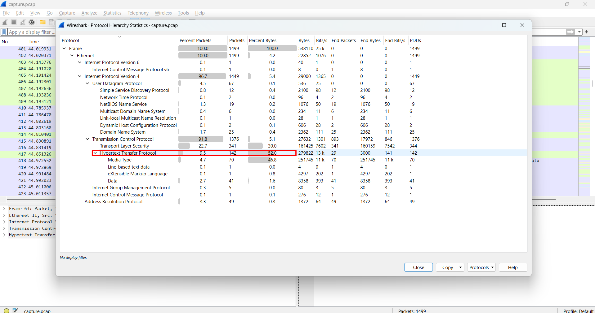

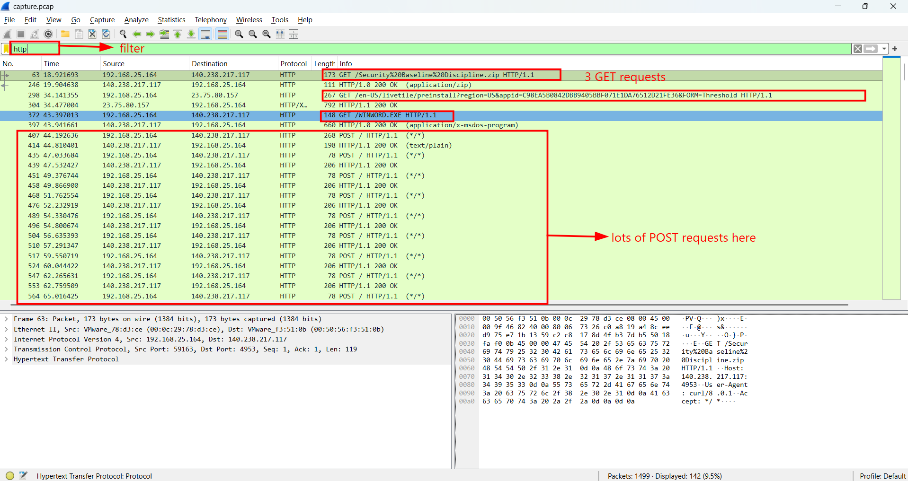

With the TCP stream 1, I find the `Security Baseline Discipline.zip`, which contains a file named `baseline.scr`:

> **.scr**: Microsoft's screensaver file. In the context of malware analysis, a `.scr` file is structurally identical to a standard `.exe` file 

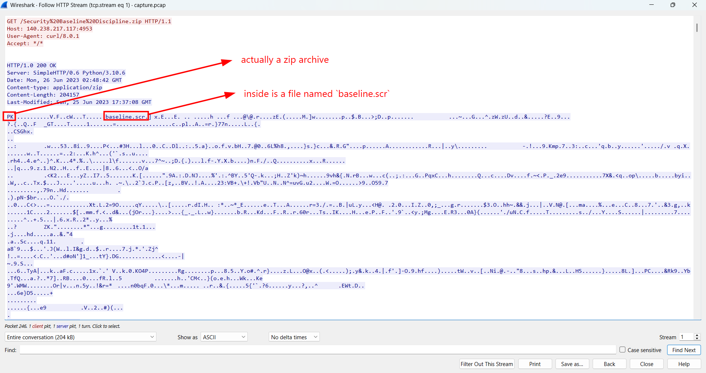

The next `GET` request looks harmless, it's only a request fetching the XML data for the Microsoft Weather app:

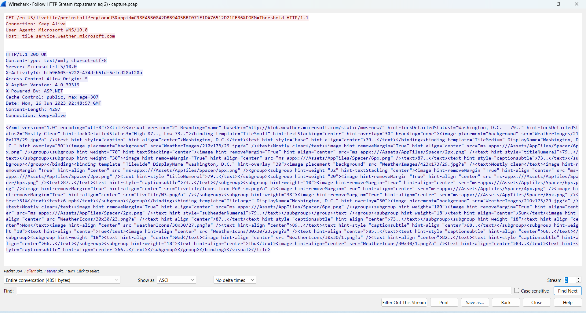

The real interesting thing is the third `GET` request, where outside named `WINWORD.EXE`, but it's actually a 7z archive:

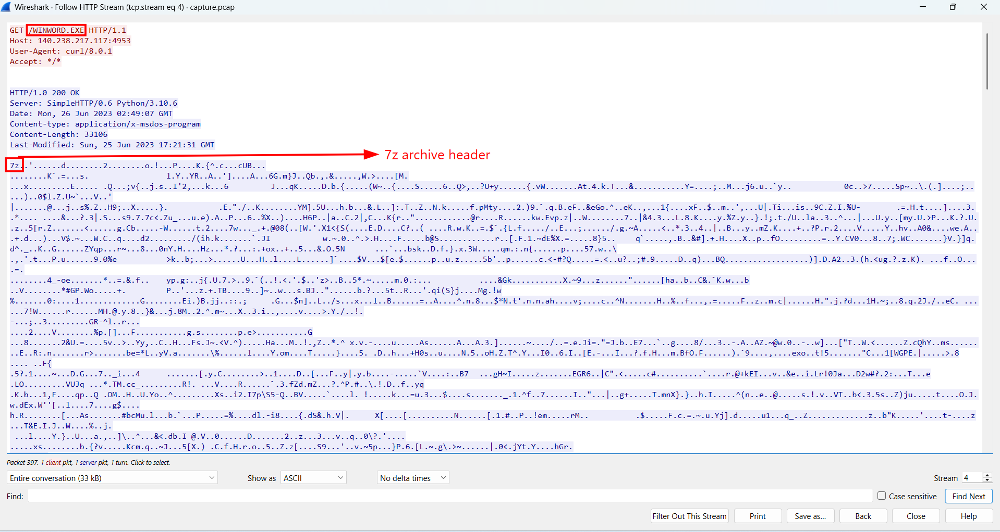

With several `POST` request, their payloads are encrypted, which strongly indicates a C2 malware activity:

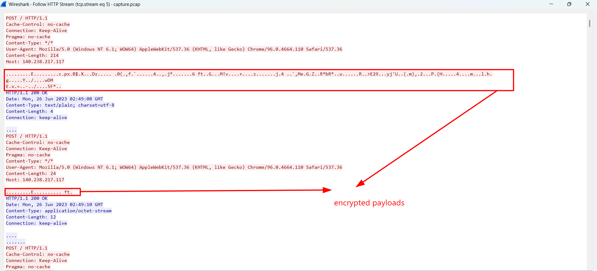

However I don't know which type of C2 it is, so firstly I extract the `.zip` and `.EXE` to analyze further. I can easily unzip the `.zip` one, but `WINWORD.EXE` require a password, I try `hackthebox` but obviously it don't work, so let's comeback to it later:

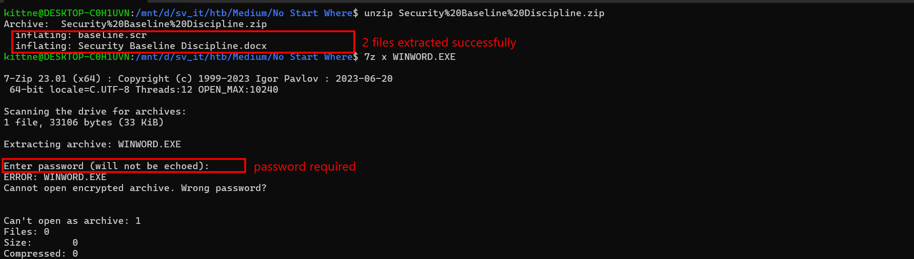

The document looks harmless to me, since I used `oletools` and it nor embedded with any VBA macros and XML macros:

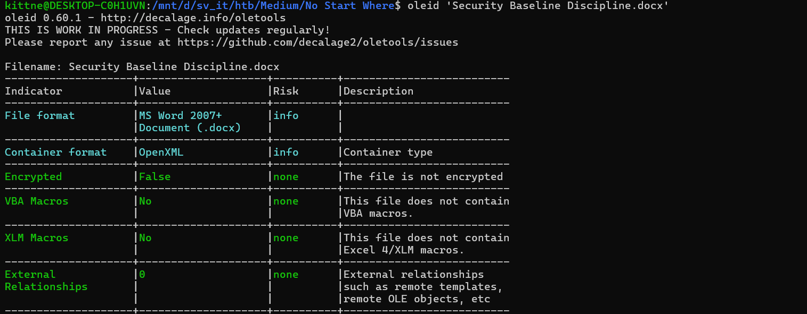

So we only get the `baseline.scr` left, upload it to [VirusTotal](https://www.virustotal.com/) don't help much, only points out it's a real malicious binary:

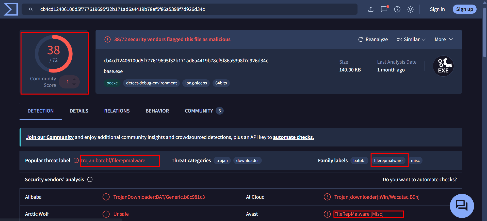

I decided to dynamic analyse the malware here, using my virtual machine. I use `Procmon` to supervise its activities. After filtering out the malware's name then running, it shows interesting activities:

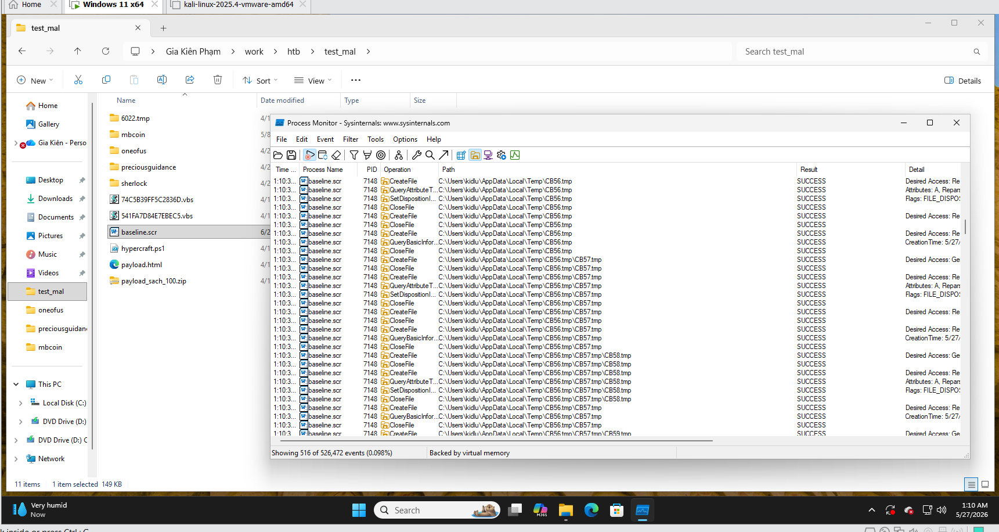

The malware tries to create new folder `CB56.tmp` in my vm `%TEMP`, then create 2 files named `CB58.bat` and `CB59.tmp`, so I copied that suspicious folder to the local machine to investigate it:

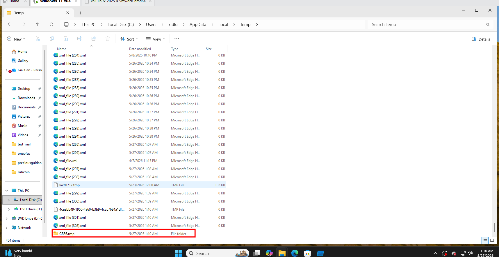

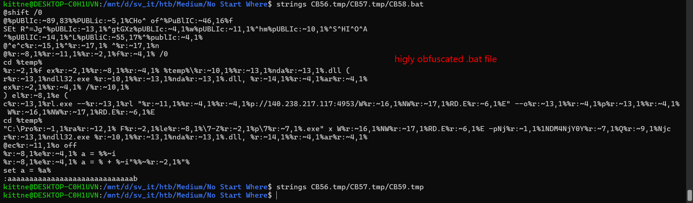

As you can see, the `CB58.bat` file is highly obfuscated, I can deobfuscate it manually, but it will cost lot of time, so I use [this tool](https://github.com/dissectmalware/batch_deobfuscator) to save up my time:

> If you want to do by hand, the deobfuscate logic is: with every strings look like this `%x:~a,b%`, you take `b` characters starting from index `a` of the `x` variable.
> Such as a environment variable `%Public%` which points to `C:\Users\Public`, `%pUBLIc:~13,1%` is take 1 character from index 13 of `C:\Users\Public`, which is the letter `i`.

```bash
python3 batch_deobfuscator/batch_deobfuscator/batch_interpreter.py -f CB56.tmp/CB57.tmp/CB58.bat
```

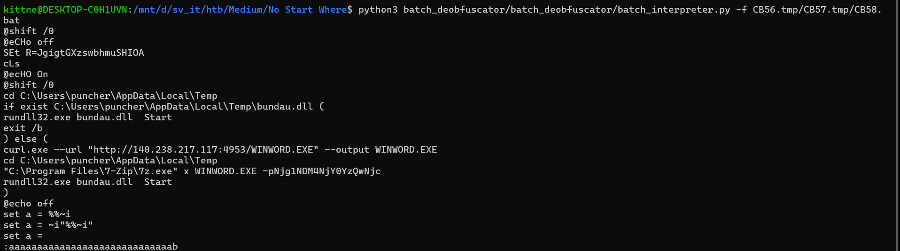

This file check if `bundau.dll` has been existed on the victim machine, if yes, it runs the script, if not, it curls the malicious dll from the internet through a zip archive `WINWORD.EXE` and extract using the password `Njg1NDM4NjY0YzQwNjc` before running it.

So now I have the password to extract the first `WINWORD.EXE`, and get the `bundau.dll`:

```bash
7z x WINWORD.EXE -pNjg1NDM4NjY0YzQwNjc
```

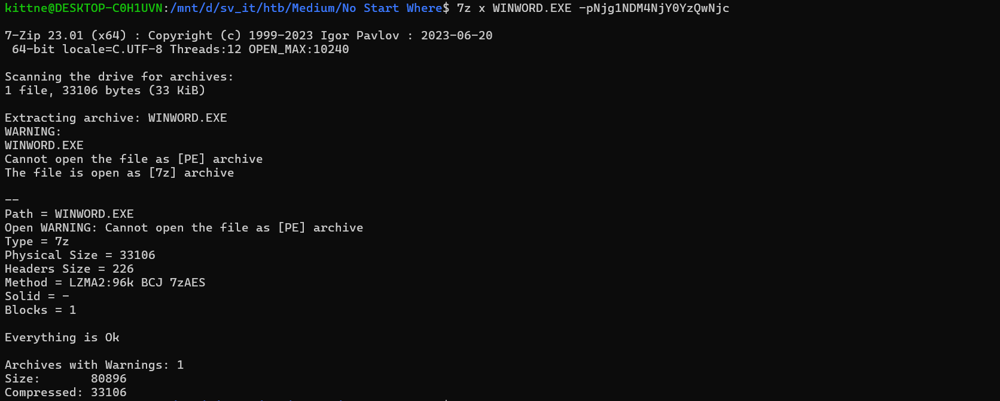

Uploading the file to [VirusTotal](https://www.virustotal.com/) again, it turns out to be a [Havoc C2 framework](https://github.com/havocframework/havoc):

> *About Havoc: Havoc is a modern and malleable post-exploitation command and control (C2) framework created by **@C5pider**. Designed as an open-source tool, it is highly favored by both Red Teams and real-world threat actors. Its primary payload, known as the `Demon` implant, features advanced EDR evasion capabilities, including sleep obfuscation, indirect syscalls, and return address spoofing.*
>
> *Havoc also provides malleable C2 profiles to blend in with legitimate network traffic, and users can custimize their payload configs to whaterver they want*
 
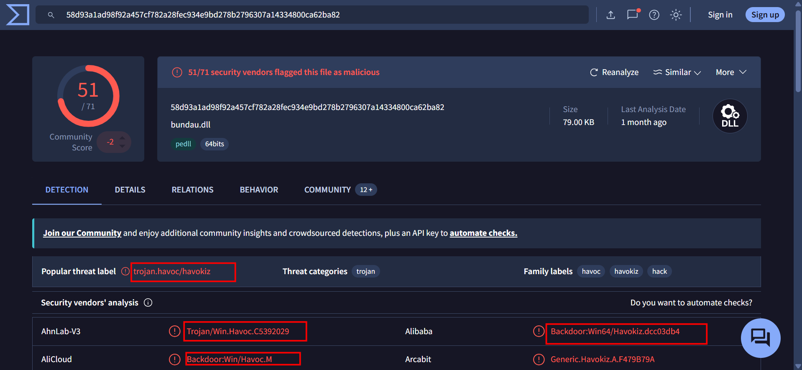

So now we know that the encrypted payload is Havoc's products. Now we can read through Havoc source script to see how it encrypts data, how it set up the payloads, ...:

> My experience is, if you read the source script carefully, you can save up a lot of time debug online tool if it doesn't work with the case.

After understanding a bit about `Havoc`, I found [this script](https://github.com/Immersive-Labs-Sec/HavocC2-Forensics) which is available already to be used. It automatically searchs for arguments such as `AES-key`, `AES-iv`, `agent-id`, ... if not being provided by the user, what's a tool!

So just use the script and we have the flag, right? Of course it's not simple as that, you can run the script with:

```bash
python3 havoc_parser_pcap.py --pcap capture.pcap
```

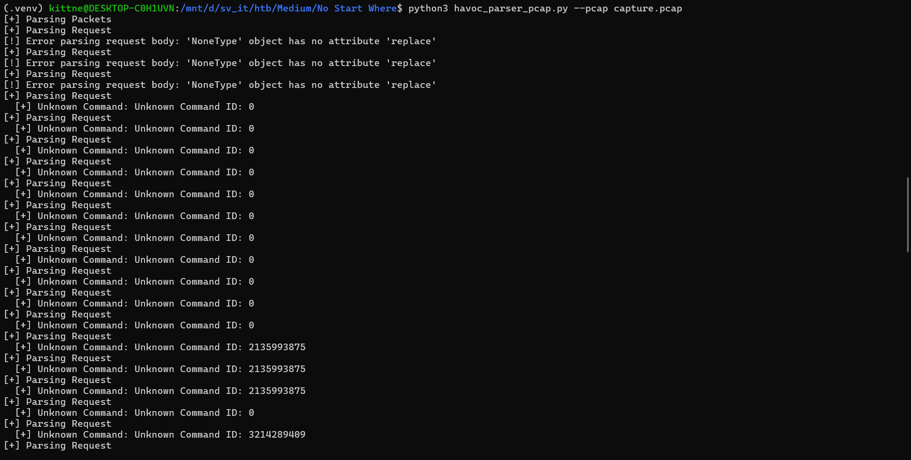

As you can see, the script can't identify any commands, nor identify the Havoc as the tool's description:

```md
python3 havoc-pcap-parser.py --pcap Havoc-MemoryCapture.pcapng
[+] Filtering for HTTP traffic
[+] Agent -> Team Server
[+] Found Havoc C2
  [-] Agent ID: 2f09db1e
  [-] Magic Bytes: deadbeef
  [-] C2 Address: http://havoc-http.the-briar-patch.cc/Collector/2.0/settings/
[+] Found AES Key
  [-] Key: d0f40032e0347cf4f42472ae2066e6eac82ce0d28ce8e4829edcc41ec48836d6
  [-] IV: dc0a16f0046c3c24bed2e29e88805296
```

> *That's why we should always read through the C2 source script first to get a knack of it before using any tools on the Internet.* 

Back to the challenge, after checking the `Havoc\payloads\Demon\Demon.c`, I acknowledge the structure of the payload:

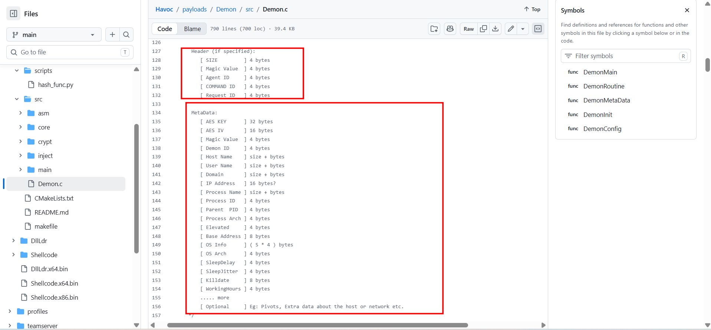

As you can see, the default header looks like this:

```text
        [ SIZE         ] 4 bytes
        [ Magic Value  ] 4 bytes
        [ Agent ID     ] 4 bytes
        [ COMMAND ID   ] 4 bytes
        [ Request ID   ] 4 bytes
```

Moreover, in `payloads\Demon\include\core\Command.h`, the code shows that the `COMMAND ID` of a `DEMON_INITIALIZE` payload (which always be sent first) is `99`, that's how the script we found above detect the payload is sent by a Havoc framework:

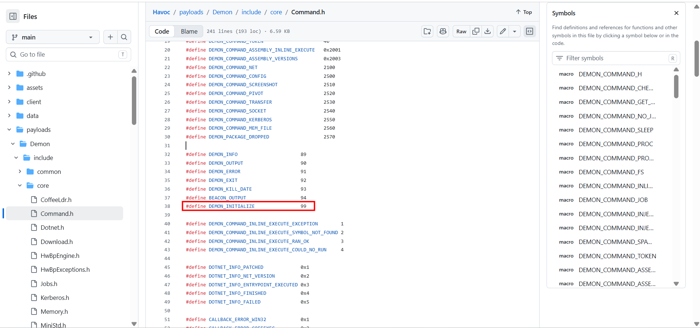

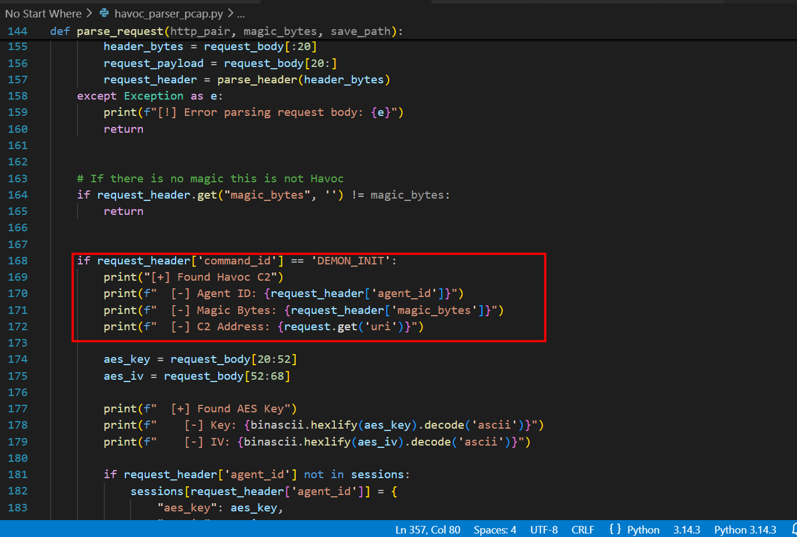

So why in our case the script can't find this number? Using `Wireshark`, set the payload to Hex dump, the secret is revealed:

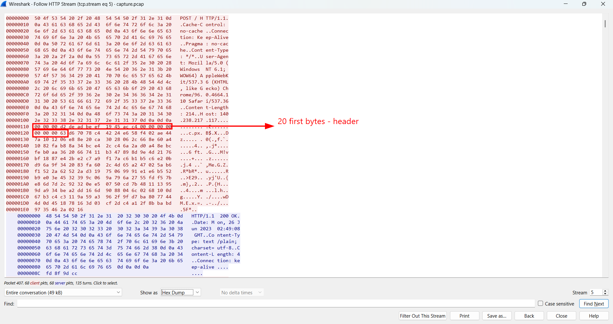

The first 20 bytes sent is: 

```text
00 00 00 d2 de ad be ef 19 45 ac c4 00 00 00 00 00 00 00 63
```

That's when I notice something strange, the last 4 bytes `00 00 00 63` in the `Request ID` place convert to decimal is `99`, which actually stands for the `COMMAND ID` of the init package. So the attackers have swapped 2 tags to not get detect by tools.

> *That's also why Havoc is widely used in real life, since it provides such an ability to customize* 

Let's fix the tool to adapt our situation. The line responsible for extract the hearder is:

```py
payload_size, magic_bytes, agent_id, command_id, mem_id = struct.unpack('>I4s4sI4s', header_bytes)
```

I swap `mem_id` and `command_id` like the attackers do, then run the script again:

```py
payload_size, magic_bytes, agent_id, mem_id, command_id = struct.unpack('>I4s4s4sI', header_bytes)
```
 
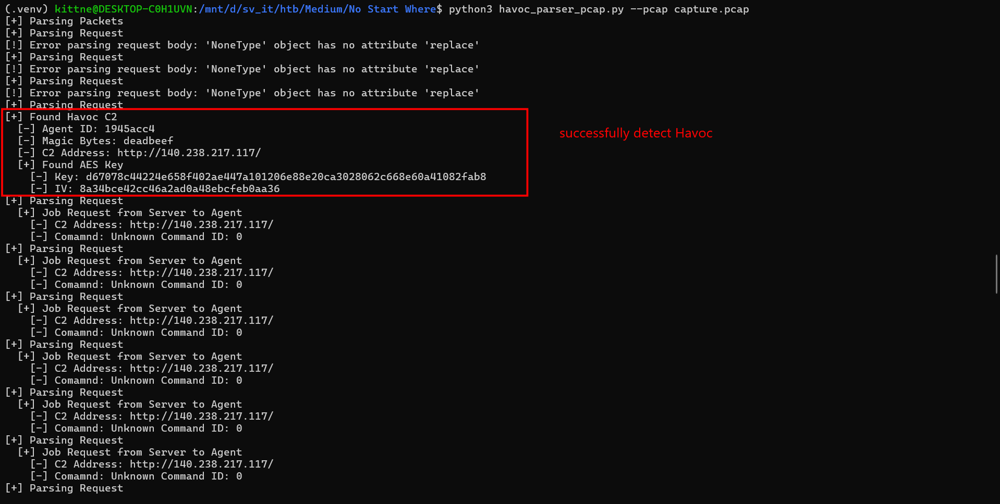

However, the script don't print the decrypted output to the terminal, so I add an argument `--save`:

```bash
python3 havoc_parser_pcap.py --pcap capture.pcap --save check
```

After that, I run `strings -f` to see the decrypted payload, inside, I find another executable:

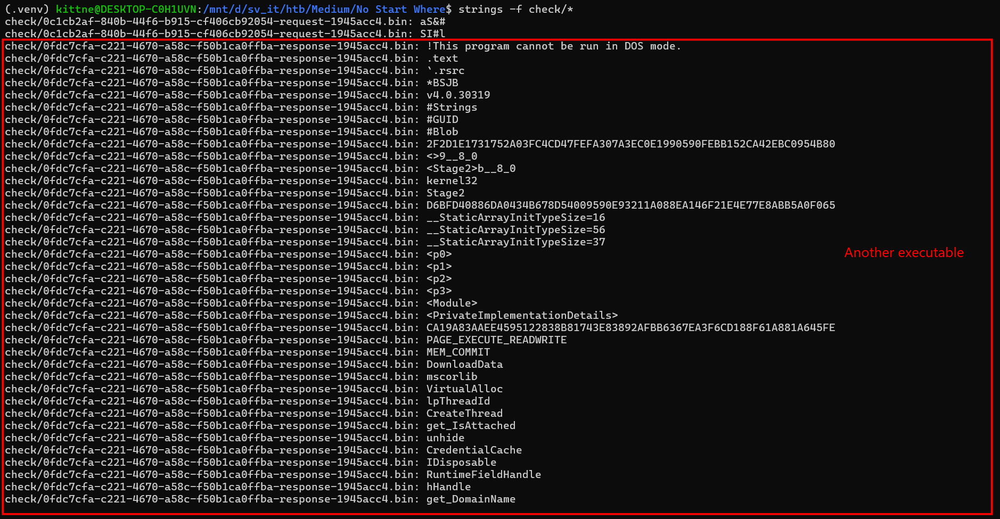

However, when I run `file`, it's just a normal text file:

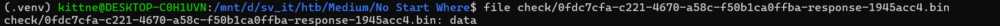

Maybe something strange happens with its header, let's check it:

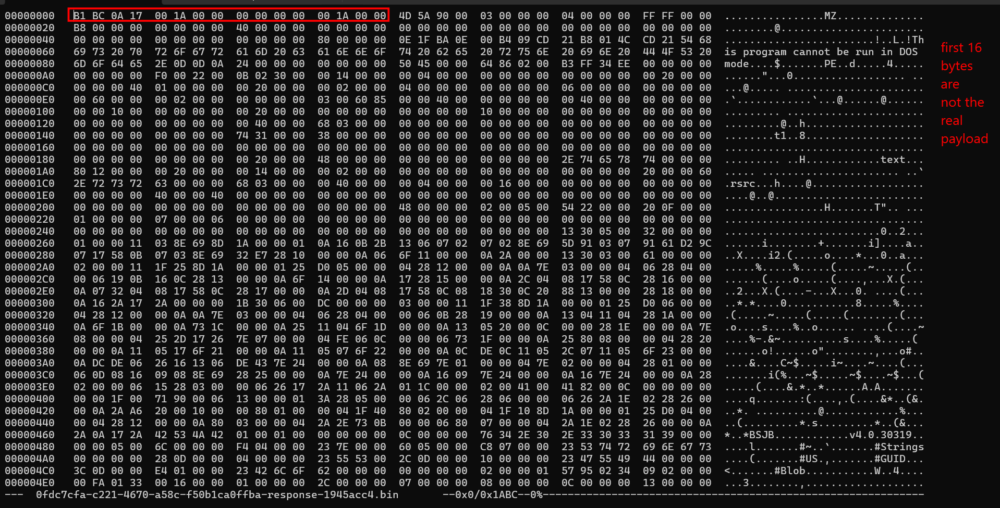

As I thought, the first 16 bytes are not the real payloads as we wanted. This sequence happens because the script only extract the 20 bytes header, but each commands has unique packer to pack the payload.

So we only need to delete the first 16 bytes of the executable:

```bash
cp check/0fdc7cfa-c221-4670-a58c-f50b1ca0ffba-response-1945acc4.bin payload.bin
dd if=payload.bin of=payload.exe bs=1 skip=16
```

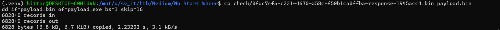

Since it's a .NET assembly, I open it in `dnSpy`, the `Main` class looks like this:

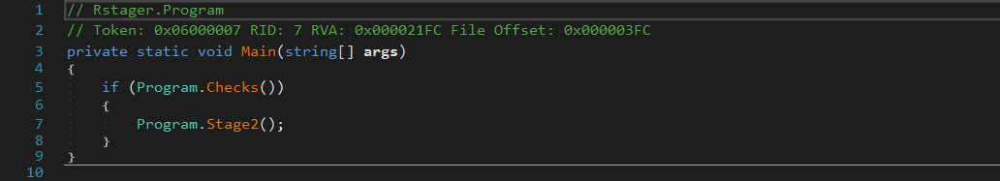

Both `Checks` and `Stage2` assigns a bytesarray, then uses `unhide` to decrypt the array:

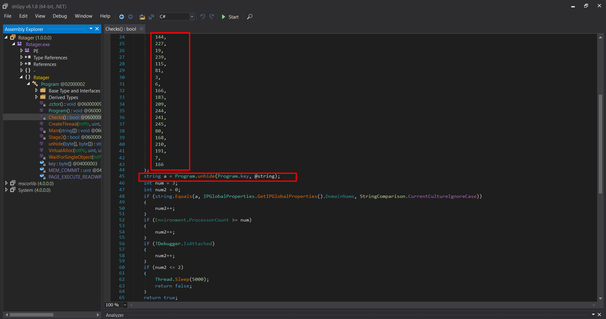

Function `unhide` is a simple xoring function, it xors each element in the array with a key hardcoded:

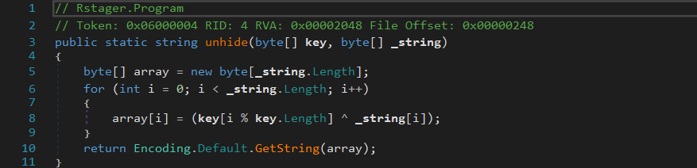

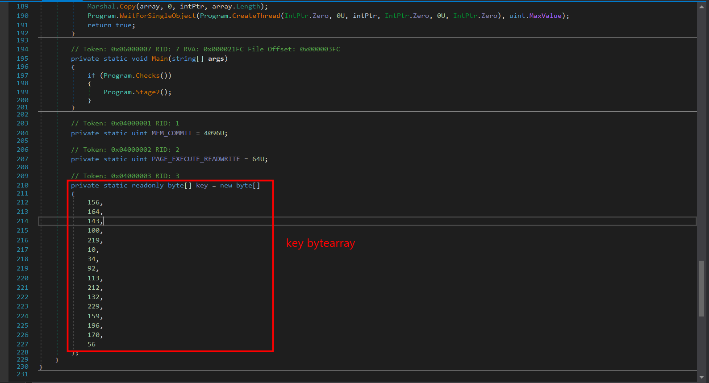

I use a python script to decrypt 2 strings:

```py
key = bytes([
    156, 164, 143, 100,
    219, 10, 34, 92,
    113, 212, 132, 229,
    159, 196, 170, 56
])

encrypted1 = bytes([
    212, 240, 205, 31, 239, 85, 80, 104,
    31, 167, 180, 136, 232, 240, 216, 11,
    195, 144, 227, 19, 239, 115, 81, 3,
    6, 166, 183, 209, 244, 241, 245, 80,
    168, 210, 191, 7, 166
])

encrypted2 = bytes([
    244, 208, 251, 20, 168, 48, 13, 115, 6,
    189, 234, 129, 240, 179, 217, 84, 245,
    210, 234, 17, 171, 110, 67, 40, 20,
    166, 170, 134, 240, 169, 133, 89, 239,
	215, 234, 16, 168, 37, 75, 49, 16, 179,
    225, 150, 176, 160, 207, 94, 253, 209,
    227, 16, 245, 122, 76, 59
])

def unhide(key: bytes, data: bytes) -> str:
    result = bytearray(len(data))

    for i in range(len(data)):
        result[i] = key[i % len(key)] ^ data[i]

    return result.decode(errors="ignore")

decoded1 = unhide(key, encrypted1)
decoded2 = unhide(key, encrypted2)

print(f" Checks: {decoded1}")
print(f" Stage2: {decoded2}")
```

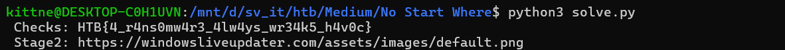

### 3. Solution ###
1. **Result:** The flag is `HTB{4_r4ns0mw4r3_4lw4ys_wr34k5_h4v0c}`