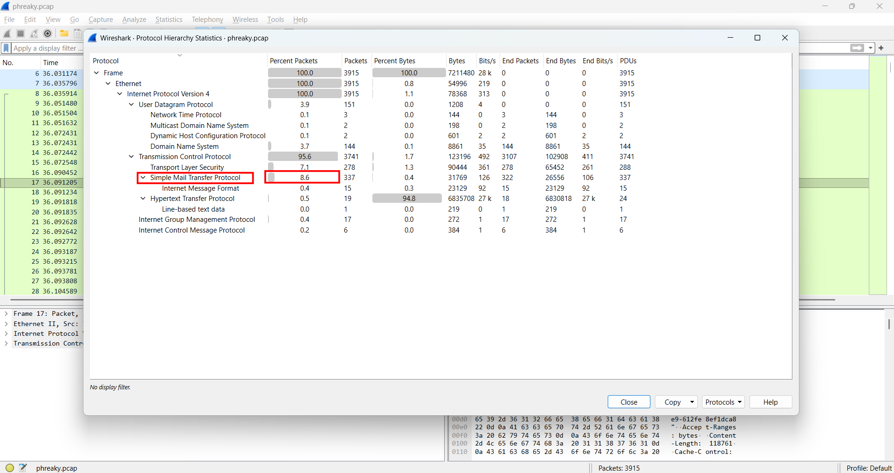
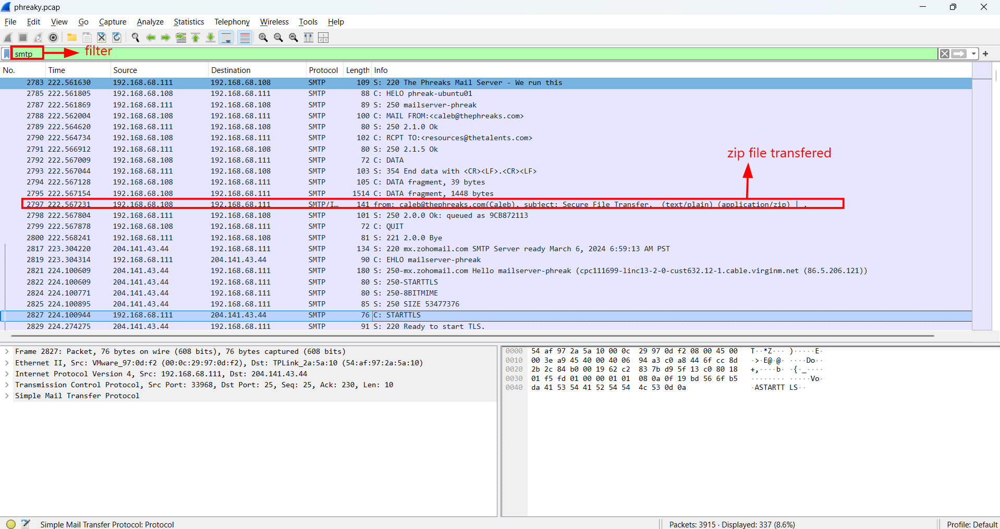
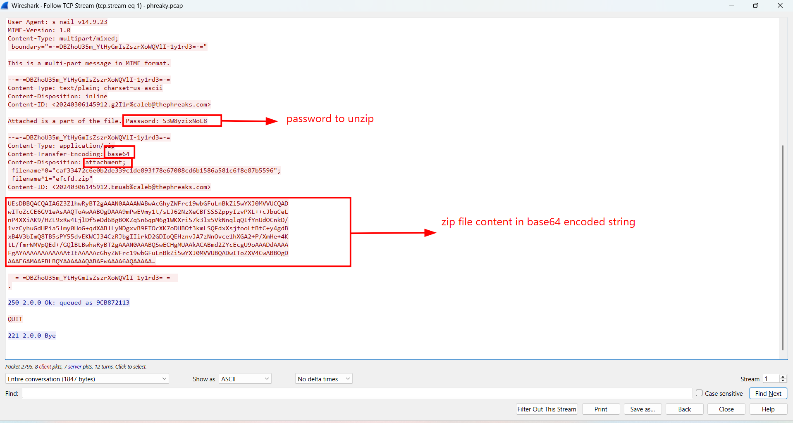
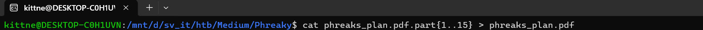
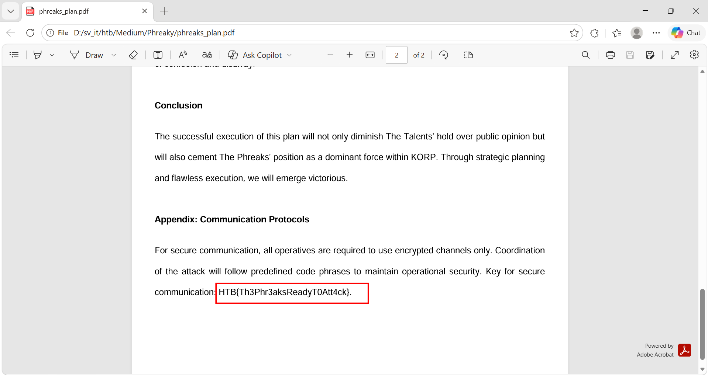

# WRITE_UP #

## Phreaky ##

### 1. Analysis ###
* **Given:** a pcap file named `phreaky.pcap`
* **Description:** In the shadowed realm where the Phreaks hold sway, A mole lurks within leading them astray. Sending keys to the Talents, so sly and so slick, A network packet capture must reveal the trick. Through data and bytes, the sleuth seeks the sign, Decrypting messages, crossing the line. The traitor unveiled, with nowhere to hide, Betrayal confirmed, they'd no longer abide.
* **Hints:**   
    * No hints are given

### 2. Investigation ###
The pcap file is quite big, so I first analyzed it using `Protocol Hierarchy` to see if there was any suspicious protocol:

Apparently, there's a protocol named **SMTP** - `Simple Mail Transfer Protocol` accounts for 8.4% of the packets, not much, but worth a try, so I filtered only this protocol:

In several first lines, we can clearly see several zip files transferred through this protocol, follow the stream to see the `MIME` content:

As the picture shows, there's an attachment which is a zip file, moreover there's a password to unzip it. Follow the TCP stream, I found 14 more streams with the same pattern, a zip file attached with different passwords.

So I extracted all 15 zip file, using password given in each mail to unzip those. Inside each one is a file named `phreaks_plan.pdf.part<number>` from 1 to 15, ordered by the part number. Unzipped all 15 files, I used `cat` to concatenate the 15 parts into the complete PDF:

After that, I opened the pdf file and obtained the flag:

### 3. Solution ###
1. **Result:** The flag is `HTB{Th3Phr3aksReadyT0Att4ck}`
