# WRITE_UP #

## Precious Guidance ##

### 1. Analysis ###
* **Given:** a vbscript named `SatelliteGuidance.vbs`.
* **Description:** Miyuki has come across what seems to be a suspicious process running on one of her spaceship's navigation systems. After investigating the origin of this process, it seems to have been initiated by a script called "SatelliteGuidance.vbs". Eventually, one of your engineers informs her that she found this file in the spaceship's Intergalactic Inbox and thought it was an interactive guide for the ship's satellite operations. She tried to run the file but nothing happened. You and Miyuki start analysing it and notice you don't understand its code... it is obfuscated! What could it be and who could be behind its creation? Use your skills to uncover the truth behind the obfuscation layers.
* **Hints:**   
    * No hints are given

### 2. Investigation ###
The malicious script is highly obfuscated:

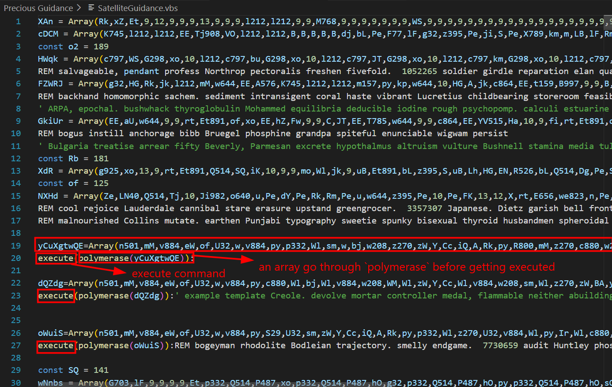

The decrypt function is `polymerase`:
```vb
Function polymerase(Iztv)

eHF201=1:GcoZG=9
WNh = lbound(Iztv)
Iqe = ubound(Iztv)
for gmG = WNh to Iqe
Randomize
if Iztv(gmG) = 999999 Then
KkF = KkF & ChrW(Int((eHF201-GcoZG+1)*Rnd+GcoZG))
Else
KkF = KkF & ChrW(Iztv(gmG) - ((6842 - 6781.0) - (89 + (-(37 + (0.0))))))
End if 
Next

polymerase = KkF
End Function
```

How this works:
* The core decryption logic is simply: `ChrW(Iztv(gmG) - 9)` (subtracting 9 from the array value and converting it to an ASCII character).
* Normal case: Iterates through each integer in the input array `Iztv`, subtracts 9, and concatenates the resulting characters into the final string
* Edge case `Iztv(gmG) = 999999`: If the loop encounters the number 999999, it generates a random character.

Below, I identify functions being called:

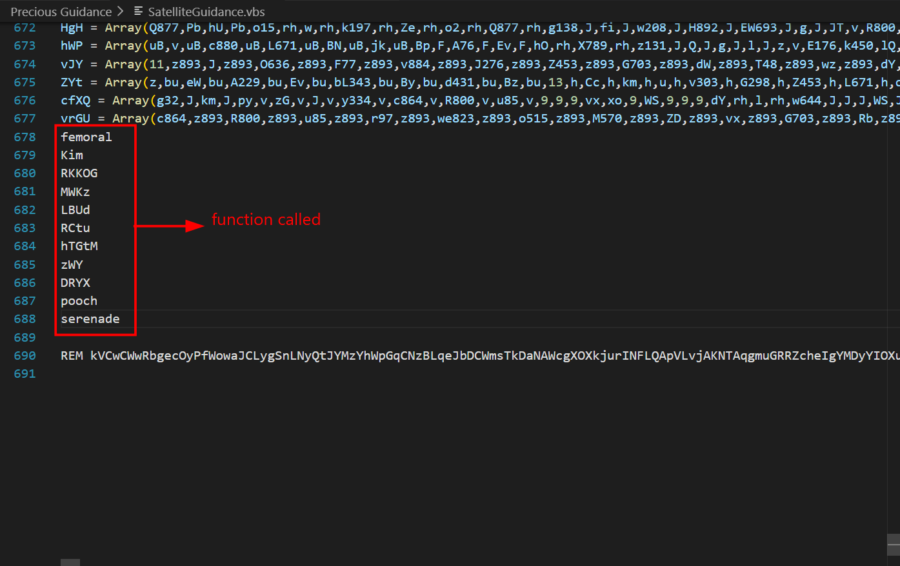

Since there are so many long obfuscated strings, I decide to comment all the function called. Next, I replaced all `execute` command to `WScript.Echo`:

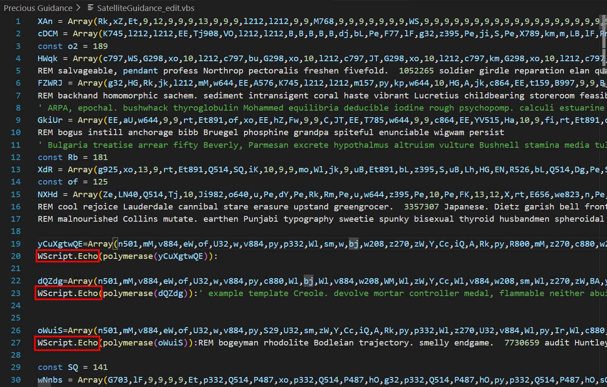

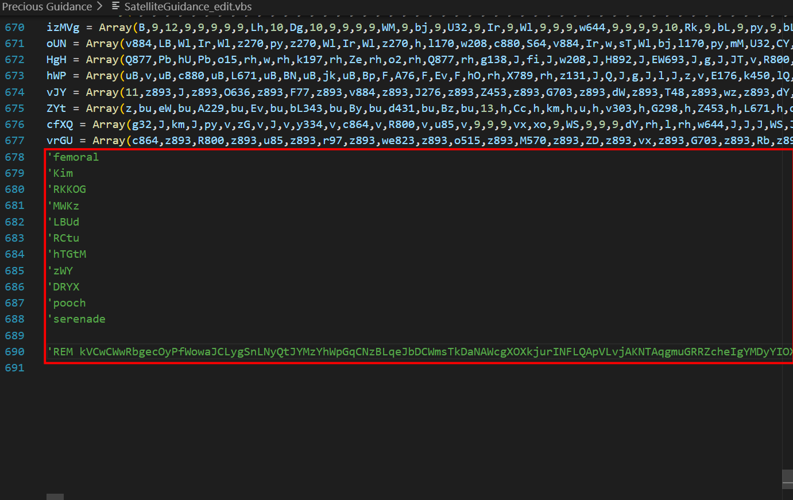

Now I can run the script to see the decrypted ciphertext:

```bash
cscript.exe //nologo SatelliteGuidance_edit.vbs
```

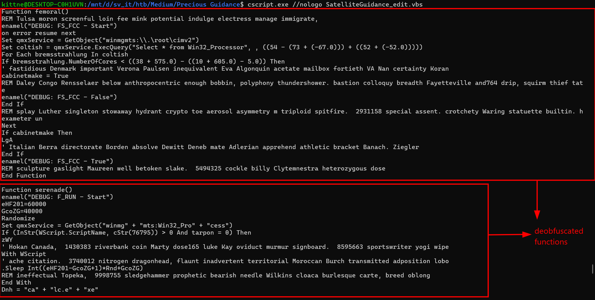

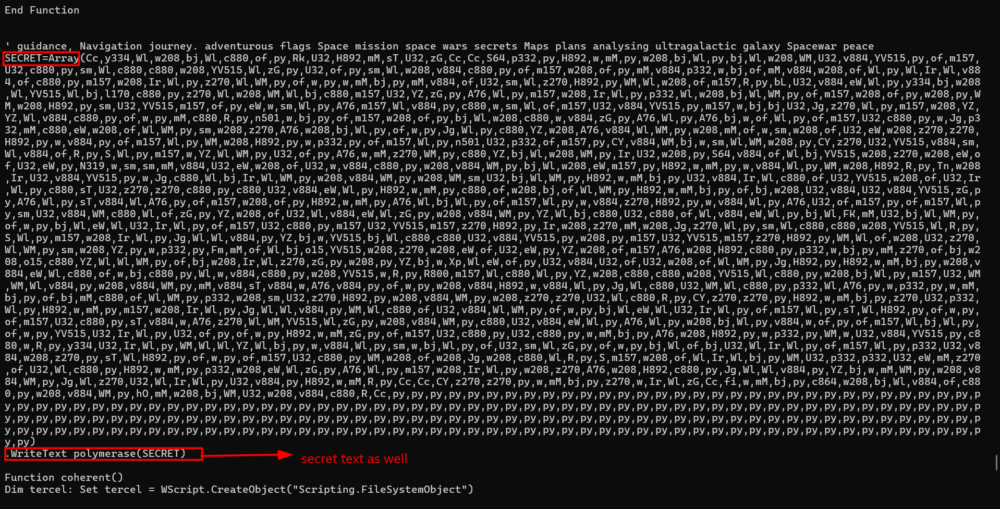

After running the edited script, I got all the real functions after being deobfuscated, I group the functions into 3 categories:

> *Anti-Analysis & System Checks*
> * femoral(): Checks if the CPU has fewer than 3 cores. If true, it terminates the script to evade sandboxes.
> * Kim(): Checks the system uptime. If the computer was booted less than 10 minutes ago, it terminates.
> * RKKOG(): Checks the machine's RAM. If it's less than ~1GB, it assumes it's in a VM and terminates
> * LBUd(): Checks running processes against a blacklist of analysis tools (e.g., Wireshark, Procmon) and ensures there are at least 28 processes running
> * RCtu(): Checks the size of the logical disk. If the hard drive is smaller than ~50GB, it terminates.
> * zWY(): Acts as an execution delay by running a large loop and sleeping, aiming to outlast sandbox analysis timeouts
> 
> *Execution & Payload Handling:*
> * pooch(): Drops the embedded payload by decrypting an array and saving it as `textual.m3u` in the `Temp` folder.
> * dciwP(): Uses `Shell.Application` to extract the contents of the dropped `textual.m3u` file, then deletes the original archive.
> * serenade(): The main execution routine. It executes the extracted malicious payload via `rundll32` (or runs `calc.exe` if in debug mode).
> * DRYX(): Creates an `adobe.url` shortcut in the Temp folder to ensure the malware only runs once.
> * WIqe(): Sends an `HTTP GET` request to a specified URL using `MSXML2.ServerXMLHTTP`
>
> *Helpers:*
> * hNZCG(): Helper function that retrieves the path to the Windows %TEMP% directory.
> * coherent(): Deletes the original VBScript file `WScript.ScriptFullName` to hide its tracks.
> * LgA(): Termination routine. Calls the self-delete function and forces the script to quit.
> * tarpon(): Checks for a specific file `76795.txt` in `Downloads` to determine if the script should run in developer/debug mode
> * enamel(): Logging function. Displays debug messages in a MsgBox if the debug mode is active.
> * hTGtM(): Displays a fake "MSVCR101.dll is missing" error message to trick the victim.

So now we know `pooch` is the main function to make the `textual.m3u` output. I decided to copy all deobfuscate functions and paste them to `SatelliteGuidance_edit.vbs` above. NThen I remove the comment in `pooch` and run the script again:

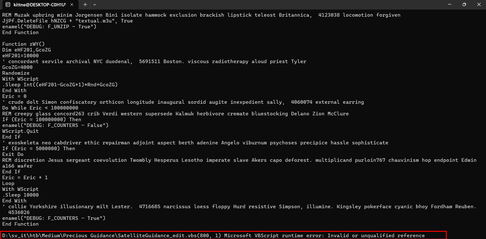

However, a crash happens due to an error in line 800, scroll up, it was this line:

```vb
.WriteText polymerase(SECRET)
```

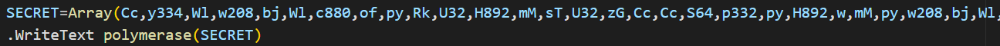

> This error is fundamentally a `VBScript` syntax and scoping issue. In VBScript, methods or properties that begin with a dot such as `.WriteText` or `.SaveToFile` must be enclosed strictly within a `With [ObjectName]` ... `End With` block.

Since the `SECRET` array decryption is called outside of this `With` block, the interpreter encounters the `.WriteText` method but does not know which object it belongs to. Since the `ADODB.Stream` reference is missing or out of scope, the script immediately crashes.

To fix this error, I replace `.WriteText` to `WScript.Echo` then run the script again:

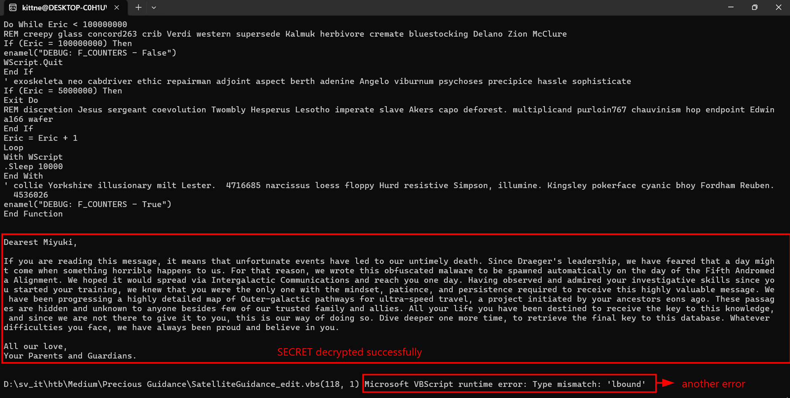

I succesfully extracted the secret text in the script, however, it doesn't provide any flag, moreover, there's still another error, this time the error is in line 118, but wait, that's function `polymerase` we’ve been using so far without any error.

To answer the question, I try to find the main root of this sequence. Since I only modified the script to call `pooch`, it should be the culprit:

```vb
Function pooch()
enamel("DEBUG: F_DROPPED - Start")
Dim Creon:Set Creon = CreateObject("ADOBE.Stream")
With Creon
.Type = 2
.Charset = "ISO-8859-1"
.Open()
For Each HCZ in Array(...)
.WriteText polymerase(HCZ)
Next
.Position = 0
.SaveToFile hNZCG + "textual.m3u", 2
.Close
End With
enamel("DEBUG: F_DROPPED - True")
End Function
```

Let's understand how this cause the error: `Type mismatch: 'lbound'`:
* In `VBScript`, the `LBound()` and `UBound()` functions are designed to evaluate the boundaries of an `Array`. However, if we closely examine the malware's array in `pooch`:

```vb
For Each HCZ in Array(Rk, xZ, Et, 9, 12, 9, ...)
```

* The `Array(...)` function creates a one-dimensional array containing a mix of predefined-as-interger variables such as `Rk`, `xZ`, `Et` and integer such as `9`, `12`, ...
* When the loop reaches a variable, it passes that var to the function (e.g., `polymerase(Rk)`, `polymerase(Rk)`). The function then attempts to execute `lbound(Rk)`. However, `Rk` is hardcoded as an interger, since it is not an array, the `VBScript` interpreter throws a message `Type mismatch exception`:

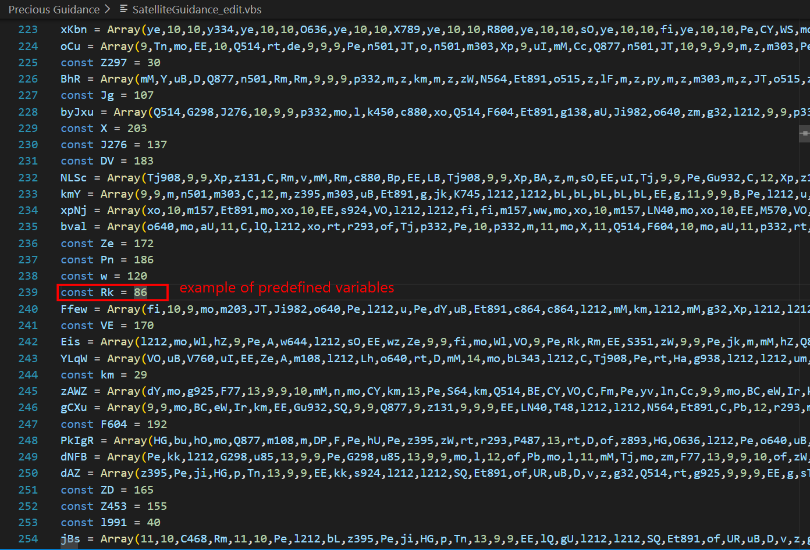 

So how to fix this? 
* I delete the loop by deleting `For Each` and `Next` and simply replace by a variable, by doing this, I passed the entire array as a single argument into `polymerase(HCZ)`. Inside the function, `Iztv` became a valid array, allowing `lbound(Iztv)` to execute perfectly without any errors.
* It looks like this in pseudocode:

```vb
Function pooch()
enamel("DEBUG: F_DROPPED - Start")
Dim Creon:Set Creon = CreateObject("ADOBE.Stream")
With Creon
.Type = 2
.Charset = "ISO-8859-1"
.Open()
HCZ = Array(...)
.WriteText polymerase(HCZ)
.Position = 0
.SaveToFile hNZCG + "textual.m3u", 2
.Close
End With
enamel("DEBUG: F_DROPPED - True")
End Function
```

Running the script again, this time it was smooth:

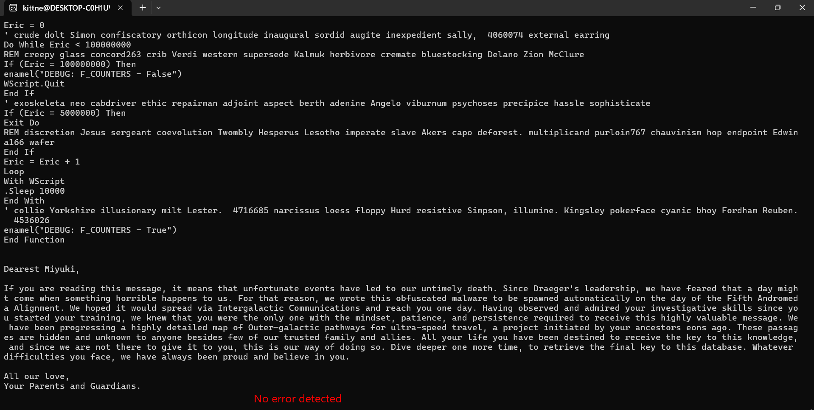

Checking the `%TEMP%` folder, I got the `textual.m3u`:

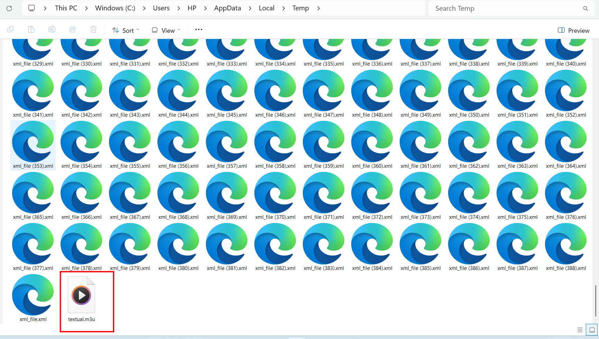

This file is actually an .NET executable:

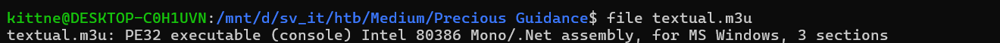 

So I open it using `dnSpy`, inside i found this class named `Backdoor`:

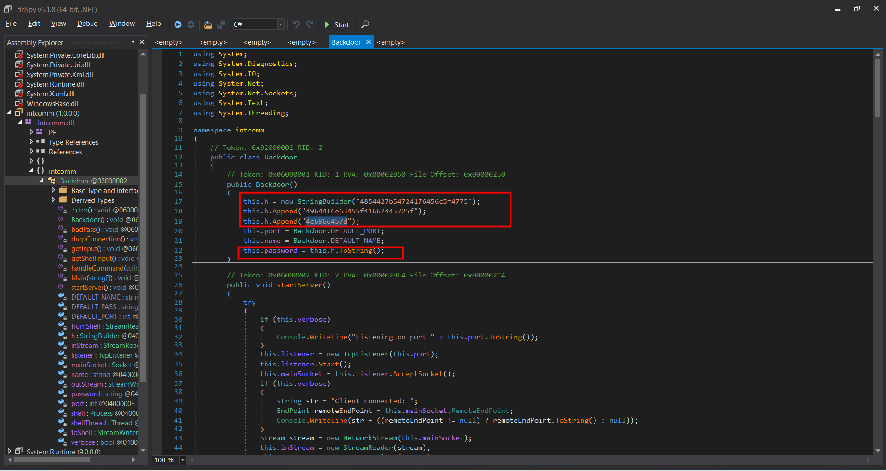

It appends a hex string then use `ToString` to decode then assigns it to a variable named `password`, using `CyberChef` with recipe `From Hex`, I obtain the flag from the hex string:

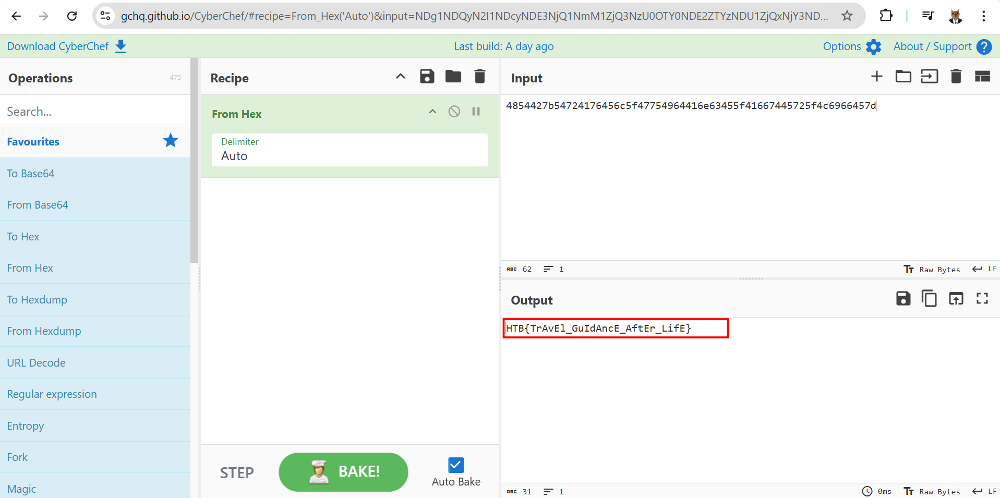

### 3. Solution ###
1. **Result:** The flag is `HTB{TrAvEl_GuIdAncE_AftEr_LifE}`
