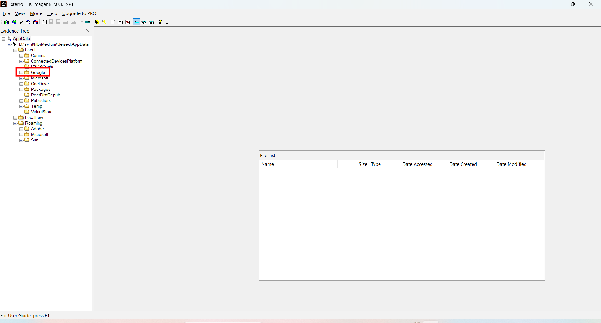
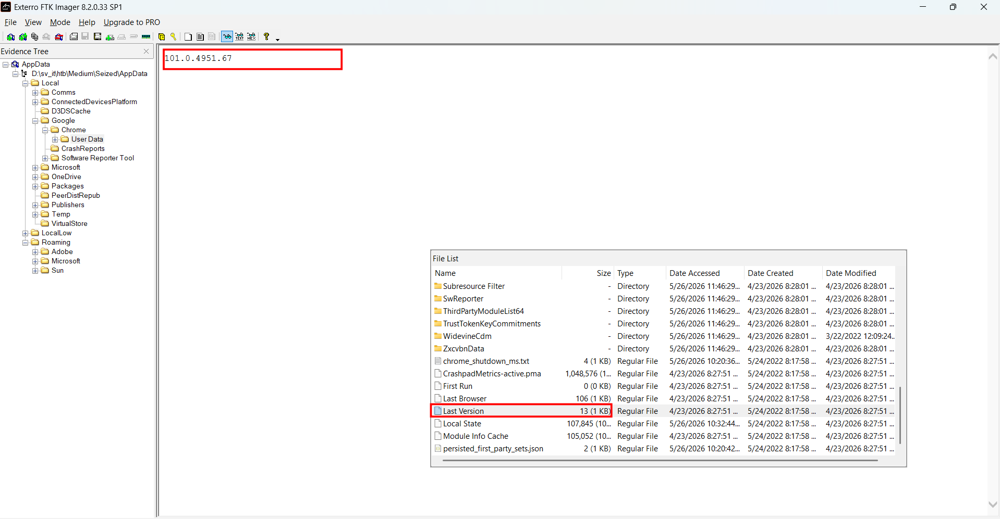
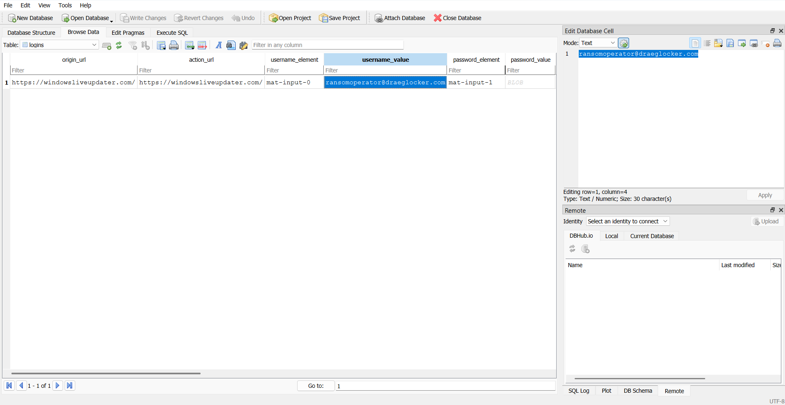
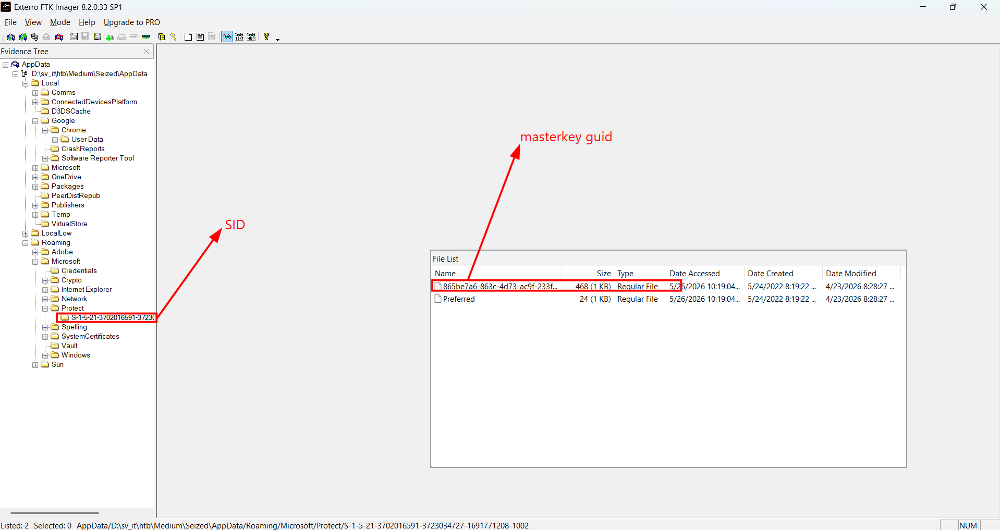
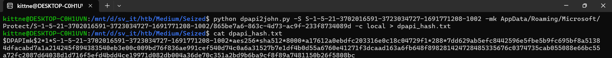
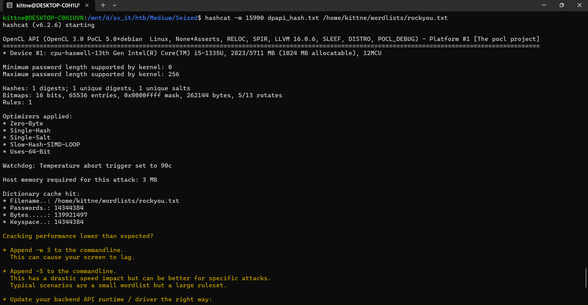
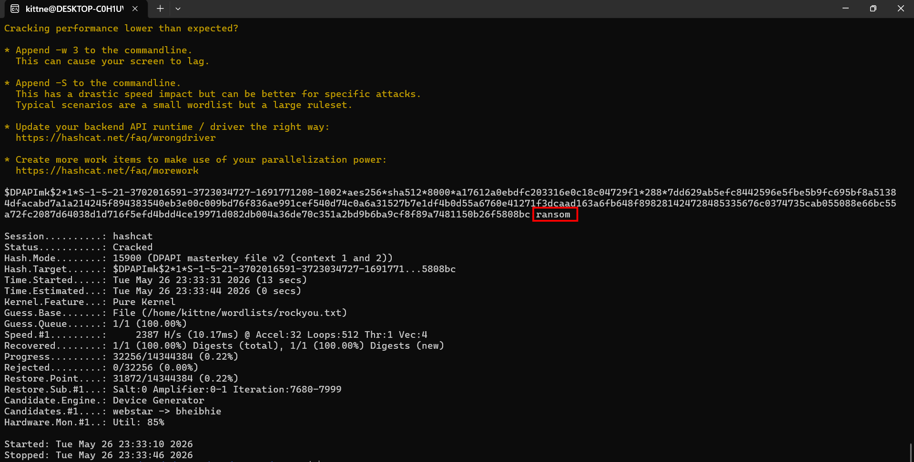
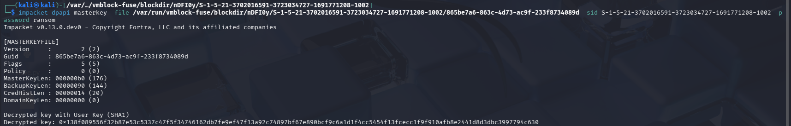
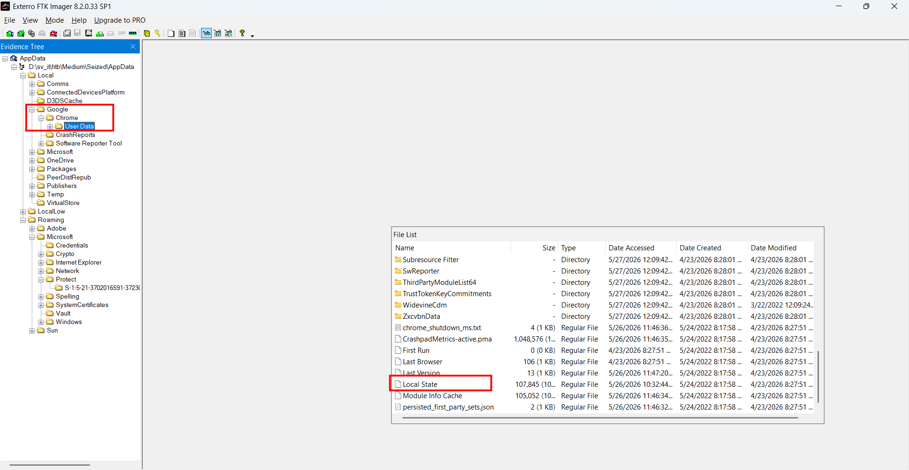
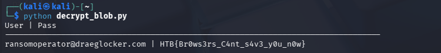

# WRITE_UP #

## SEIZED ##

### 1. Analysis ###
* **Given:** an `AppData` directory
* **Description:** Miyuki is now after a newly formed ransomware division which works for Longhir. This division's goal is to target any critical infrastructure and cause financial losses to their opponents. They never restore the encrypted files, even if the victim pays the ransom. This case is the number one priority for the team at the moment. Miyuki has seized the hard-drive of one of the members and it is believed that inside of which there may be credentials for the Ransomware's Dashboard. Given the AppData folder, can you retrieve the wanted credentials?
* **Hints:**   
    * No hints are given

### 2. Investigation ###
The description mentions `retrieve the wanted credentials`, open the folder in FTK Imager, I found a folder named `Google` in `Local`:



In `AppData/Local/Google/Chrome/User Data/Last Version`, I find the Chrome version of this compromised machine:

```text
101.0.4951.67
```



When I do a research, I find these information about this chrome version:
* Chrome stores user passwords in a SQLite database.
* These passwords are encrypted using the AES standard.
* The AES Master Key itself is protected by Windows' DPAPI (Data Protection API) mechanism.

> However, to be specified, Chrome has changed how it encrypts password, credentials several times within other versions, so you gotta be careful when decrypt the hidden data.
>
> Here some comparisons:
> 
| Chrome Version | Encryption Mechanism | Key Storage & Structure | Offline Extraction Difficulty |
| :--- | :--- | :--- | :--- |
| **< v80** *(Pre-2020)* | **Windows DPAPI** (Direct) | Passwords in the SQLite database were directly encrypted using the user's DPAPI Masterkey. | **Easy:** Only requires the user's DPAPI Masterkey to decrypt the SQLite fields. |
| **v80 to v113** *(2020 - Mid 2023)* | **AES-256-GCM** + DPAPI Wrapper | Uses an AES-256-GCM key to encrypt passwords. This AES key is base64-encoded, encrypted with DPAPI, and stored in the `Local State` JSON file under `os_crypt.encrypted_key`. Ciphertext starts with `v10` or `v11`. | **Moderate:** Requires a 2-step process: (1) Decrypt the AES key from `Local State` using the DPAPI Masterkey, (2) Decrypt the SQLite data using the AES key. *(Current scenario)* |
| **v114+** *(Mid 2023 - Present)* | **App-Bound Encryption** + AES-256-GCM | Similar to v80+, but the DPAPI encryption is cryptographically bound to the `chrome.exe` process identity via a Windows SYSTEM-level service. | **Hard:** Extremely difficult to decrypt entirely offline. Often requires executing code in the context of the user/system or bypassing the App-Bound service. |

We can find the `Login Data` in `AppData\Local\Google\Chrome\User Data\Default`, loading the database to `DBrowser for SQLite`, I find only one entry:



Now our target is decrypt this account password. But before decrypt the password, I need something called `dpapi masterkey` which could be found with:
1. `dpapi guid` in file `AppData\Roaming\Microsoft\Protect\<SID>\`
2. `SID` itself
3. `user password`



While I can easily find `dpapi guid` and `SID` in the directory, the `user password` is missing. However, we can use those 2 elements and a wordlist to crack the password:.

I use this script [DPAPImk2john](https://github.com/openwall/john/blob/bleeding-jumbo/run/DPAPImk2john.py) to extract the password hash:

```bash
python3 dpapi2john.py -S S-1-5-21-3702016591-3723034727-1691771208-1002 -mk AppData/Roaming/Microsoft/Protect/S-1-5-21-3702016591-3723034727-1691771208-1002/865be7a6-863c-4d73-ac9f-233f8734089d -c local > dpapi_hash.txt
```



After getting the user password hash, I use `hashcat` and the wordlist `rockyou.txt` to crack the password, the process is quite quick:

```bash
hashcat -m 15900 dpapi_hash.txt rockyou.txt
```





The user's password is `ransom`. After getting all 3 ingredients, I run my `kali-linux vmware` since it has already install `impacket-dpapi` - a tool use for cracking dpapi:



```bash
impacket-dpapi masterkey 
-file /var/run/vmblock-fuse/blockdir/nDFI0y/S-1-5-21-3702016591-3723034727-1691771208-1002/865be7a6-863c-4d73-ac9f-233f8734089d \
-sid S-1-5-21-3702016591-3723034727-1691771208-1002 \
-password ransom

Impacket v0.13.0.dev0 - Copyright Fortra, LLC and its affiliated companies

[MASTERKEYFILE]
Version     : 2 (2)
Guid        : 865be7a6-863c-4d73-ac9f-233f8734089d
Flags       : 5 (5)
Policy      : 0 (0)
MasterKeyLen: 000000b0 (176)
BackupKeyLen: 00000090 (144)
CredHistLen : 00000014 (20)
DomainKeyLen: 00000000 (0)

Decrypted key with User Key (SHA1)
Decrypted key: 0x138f089556f32b87e53c5337c47f5f34746162db7fe9ef47f13a92c74897bf67e890bcf9c6a1d1f4cc5454f13fcecc1f9f910afb8e2441d8d3dbc3997794c630
```

The Dpapi masterkey is: `1abb18117d02bb5d53099ad3e9bb9d7a8a47f10671be975e3f6074d11d68426253db76369d8e79d6a5e7a2105d65c8ce43d61000dc80826a4d1452d90e13f5c5`

This `masterkey` will be used to decrypt DPAPI blobs such as the **Chrome Password** like I mentioned before. 
Here are some more info about this machine's version **Chromium encrypt mechanism**:
* **Layer 1 - AES Key (The Asset):**
    * Chrome generates a random AES-256 key used to encrypt all stored passwords.
    * This key is stored in the Local State (JSON) file, within the os_crypt.encrypted_key field.
    * To secure this, Chrome utilizes Windows DPAPI (CryptProtectData). This is why you need the Windows MasterKey (decrypted using the system password, e.g., wuan) to unlock this layer and retrieve the actual AES key.

* **Layer 2 - Password Blob (The Final Data):**
    * Once the AES key is obtained, passwords are encrypted using the AES-256-GCM algorithm.
    * The data stored in the password_value column of the SQLite database is a binary structure (Blob) consisting of:
        * Prefix (3 bytes): Typically v10 or v11.
        * Nonce/IV (12 bytes): A unique Initialization Vector used to ensure cryptographic randomness.
        * Ciphertext: The actual encrypted password content.
        * Auth Tag (16 bytes): An authentication tag used to verify data integrity (a standard feature of GCM mode).

In order to crack the password, we (again) need 3 artifacts:
1. `DPAPI masterkey`
2. file `Local State` in `AppData\Local\Google\Chrome\User Data`: This file contains `Chrome AES key`
3. the previous file `Login Data` 



Here my python script to decript the blob:
```python
import os
import json
import sqlite3
import base64
from impacket.dpapi import DPAPI_BLOB
from binascii import unhexlify
from Cryptodome.Cipher import AES

local_state_path = '/var/run/vmblock-fuse/blockdir/oOPjwk/Local State' 
login_data_path = '/var/run/vmblock-fuse/blockdir/MlSQX9/Login Data'
masterkey = unhexlify("138f089556f32b87e53c5337c47f5f34746162db7fe9ef47f13a92c74897bf67e890bcf9c6a1d1f4cc5454f13fcecc1f9f910afb8e2441d8d3dbc3997794c630")

def get_encrypted_key(path):
    with open(path, 'r') as f:
        js = json.load(f)
        encrypted_key = base64.b64decode(js['os_crypt']['encrypted_key'])
        return encrypted_key[5:]

def decrypt_creds(key, value):
    try:
        if value.startswith(b'v10') or value.startswith(b'v11'):
            nonce = value[3:3+12]
            ciphertext = value[3+12:-16]
            tag = value[-16:]
            cipher = AES.new(key, AES.MODE_GCM, nonce)
            return cipher.decrypt_and_verify(ciphertext, tag).decode("utf-8")
        else:
            return DPAPI_BLOB.decrypt(value).decode("utf-8")
    except Exception as e:
        return f"[Errors: {e}]"

# 1. Cut the first 5-bytes
key_data = get_encrypted_key(local_state_path)

# 2. Use Master Key to decrypt the real AES Key
enc_key_blob = DPAPI_BLOB(key_data)
localstate_key = enc_key_blob.decrypt(masterkey)

conn = sqlite3.connect(login_data_path)
cursor = conn.cursor()
cursor.execute('SELECT username_value, password_value FROM logins')

print(f"{'User':} | {'Pass'}")
print("-" * 80)

for row in cursor.fetchall():
    user, enc_pass = row
    if enc_pass:
        password = decrypt_creds(localstate_key, enc_pass)
        print(f"{user:} | {password}")

conn.close()
```



### 3. Solution ###
1. **Result:** The flag is `HTB{Br0ws3rs_C4nt_s4v3_y0u_n0w}`

